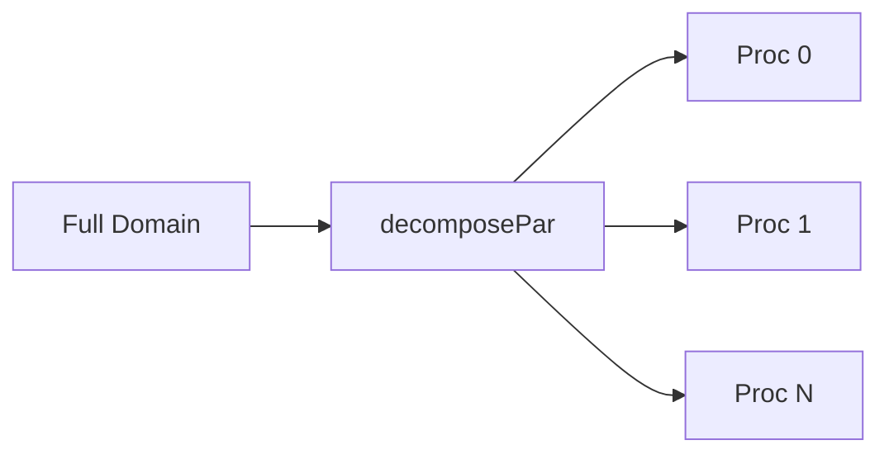

# Parallel Linear Algebra

การแก้สมการเชิงเส้นแบบขนาน

---

## Overview

> OpenFOAM uses **domain decomposition** for parallel solving

---

## 1. Domain Decomposition



### Methods

| Method | Description |
|--------|-------------|
| `scotch` | Graph partitioning (recommended) |
| `hierarchical` | Structured decomposition |
| `simple` | Block decomposition |

---

## 2. Processor Boundaries

```cpp
// Processor patches created automatically
forAll(mesh.boundary(), patchI)
{
    if (isA<processorFvPatch>(mesh.boundary()[patchI]))
    {
        // This is a processor boundary
    }
}
```

---

## 3. Global vs Local

```cpp
// Local (this processor only)
scalar localSum = sum(T);

// Global (all processors)
scalar globalSum = gSum(T);
scalar globalMax = gMax(T);
scalar globalMin = gMin(T);
```

---

## 4. Matrix Assembly

Each processor:
1. Assembles local matrix portion
2. Processor boundaries treated as BC
3. Communication via MPI

```cpp
// Parallel solve is transparent
TEqn.solve();  // Works same in serial and parallel
```

---

## 5. Reduction Operations

| Operation | Local | Global |
|-----------|-------|--------|
| Sum | `sum(f)` | `gSum(f)` |
| Max | `max(f)` | `gMax(f)` |
| Min | `min(f)` | `gMin(f)` |
| Average | `average(f)` | `gAverage(f)` |

---

## 6. Running Parallel

```bash
# Decompose
decomposePar

# Run
mpirun -np 4 solver -parallel

# Reconstruct
reconstructPar
```

### decomposeParDict

```cpp
numberOfSubdomains  4;
method              scotch;
```

---

## 7. Debugging Parallel

```cpp
// Print from specific processor
if (Pstream::myProcNo() == 0)
{
    Info << "Master says: ..." << endl;
}

// Synchronization
Pstream::scatter(value);
Pstream::gather(value);
```

---

## Quick Reference

| Need | Use |
|------|-----|
| Global sum | `gSum(f)` |
| Global max | `gMax(f)` |
| Processor ID | `Pstream::myProcNo()` |
| Number procs | `Pstream::nProcs()` |
| Is parallel | `Pstream::parRun()` |

---

## Concept Check

<details>
<summary><b>1. sum vs gSum ต่างกันอย่างไร?</b></summary>

- **sum**: Local processor only
- **gSum**: Global across all processors
</details>

<details>
<summary><b>2. processor patch คืออะไร?</b></summary>

**Boundary ระหว่าง processors** สำหรับ communication
</details>

<details>
<summary><b>3. scotch method ดีอย่างไร?</b></summary>

**Minimizes processor boundaries** → ลด communication
</details>

---

## Related Documents

- **ภาพรวม:** [00_Overview.md](00_Overview.md)
- **Linear Solvers:** [04_Linear_Solvers_Hierarchy.md](04_Linear_Solvers_Hierarchy.md)
