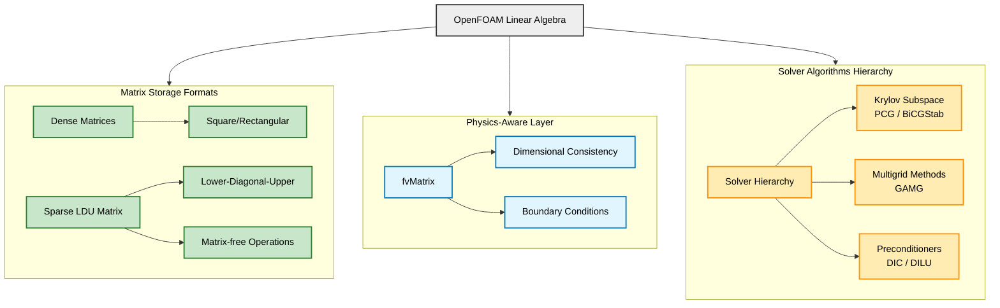
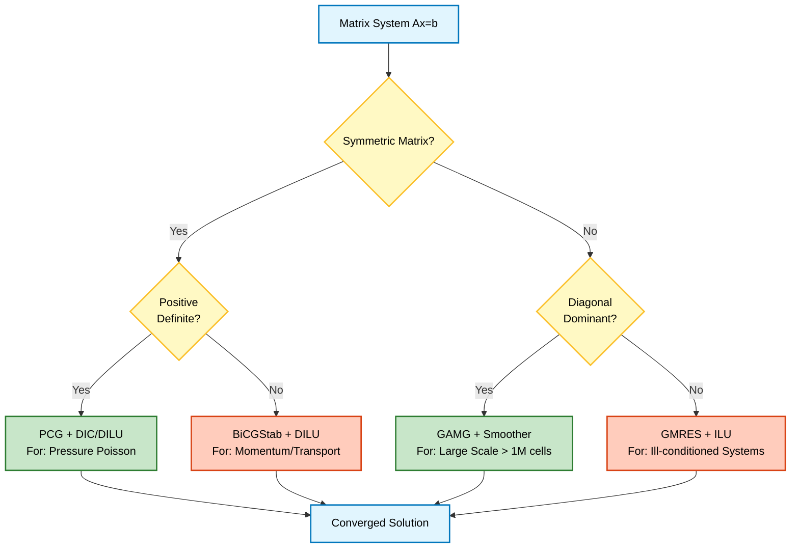
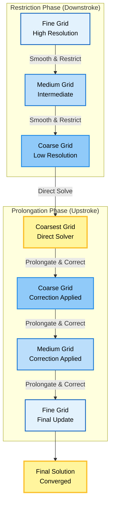

# 📋 Summary and Exercises: Matrices and Linear Algebra in OpenFOAM

## 🎯 Executive Summary

OpenFOAM's linear algebra system represents a sophisticated integration of **mathematical algorithms**, **computational efficiency**, and **physical modeling** that enables industrial-scale CFD simulations with billions of cells. The framework's power lies in its carefully designed hierarchical architecture where different matrix types serve specific computational needs:

- **Dense matrices** (`SquareMatrix`): Optimized for small systems (< 1000 elements) with direct solvers (LU decomposition), used for thermodynamic property calculations and local coordinate transformations
- **Sparse matrices** (`lduMatrix`): The workhorse for CFD problems with matrix-free operations and LDU storage, optimized for the sparsity pattern arising from finite volume discretization
- **Physics-aware matrices** (`fvMatrix`): Extends `lduMatrix` with dimensional analysis and boundary condition integration, automatically maintaining dimensional consistency
- **Runtime-selectable solver hierarchy**: Enables computational scientists to experiment with different algorithms without recompilation


> **Figure 1:** สถาปัตยกรรมโดยรวมของระบบพีชคณิตเชิงเส้นใน OpenFOAM ซึ่งแบ่งออกเป็นระบบเมทริกซ์แบบหนาแน่น (Dense), แบบเบาบาง (Sparse/LDU) และแบบตระหนักถึงฟิสิกส์ (fvMatrix) พร้อมลำดับชั้นของตัวแก้ปัญหาความปลอดภัยทางฟิสิกส์ไม่ส่งผลกระทบต่อความเร็วในการจำลอง ผ่านการใช้พลังของ C++ Template Metaprogramming ในการตรวจสอบความสอดคล้องทางมิติทั้งหมดที่ขั้นตอนการคอมไพล์โปรแกรมเพียงครั้งเดียว

---

## 📚 Core Concepts Review

### 1. Matrix Storage and Performance

**Key Insight:** Memory layout dramatically impacts performance through cache efficiency.

**Dense Matrix Storage:**
```cpp
// Row-major layout for cache efficiency
template<class Type, int mRows, int nCols>
class Matrix
{
    Type v_[mRows * nCols];  // Contiguous memory

public:
    Type& operator()(const label i, const label j)
    {
        return v_[i * nCols + j];  // Efficient indexing
    }
};
```

> **📂 Source:** OpenFOAM source code: `src/OpenFOAM/matrices/Matrix/Matrix.H`

> **📖 Explanation:** เมทริกซ์แบบหนาแน่น (Dense Matrix) ใน OpenFOAM ใช้การจัดเรียงข้อมูลแบบ Row-major ซึ่งเหมาะกับประสิทธิภาพของ Cache เนื่องจากข้อมูลในแถวเดียวกันจะถูกเก็บอย่างต่อเนื่องในหน่วยความจำ ทำให้การเข้าถึงข้อมูลตามลำดับเป็นไปอย่างรวดเร็ว

> **🔑 Key Concepts:**
> - **Contiguous Memory**: การจัดเก็บข้อมูลอย่างต่อเนื่องเพื่อประสิทธิภาพของ Cache
> - **Row-major Layout**: การจัดเรียงข้อมูลทีละแถวเพื่อให้การอ้างอิงตำแหน่งในแถวเดียวกันมีประสิทธิภาพสูง
> - **Template Parameters**: การใช้ Template ใน C++ เพื่อสร้างเมทริกซ์หลายขนาดโดยไม่ต้องเขียน Code ซ้ำ

**Sparse Matrix LDU Format:**
```cpp
// LDU storage format for sparse matrices
class lduMatrix
{
    scalarField diag_;        // Diagonal coefficients
    scalarField upper_;       // Upper triangular coefficients
    scalarField lower_;       // Lower triangular coefficients
    labelList upperAddr_;     // Addressing for upper triangle
    labelList lowerAddr_;     // Addressing for lower triangle
};
```

> **📂 Source:** OpenFOAM source code: `src/OpenFOAM/matrices/lduMatrix/lduMatrix.H`

> **📖 Explanation:** รูปแบบ LDU (Lower-Diagonal-Upper) เป็นวิธีการจัดเก็บเมทริกซ์เบาบาง (Sparse Matrix) ที่ใช้ประโยชน์จากโครงสร้างของระบบสมการในการแบ่งพื้นที่ (Finite Volume) ซึ่งมีเฉพาะสมาชิกที่ไม่เป็นศูนย์เท่านั้น ทำให้ประหยัดหน่วยความจำอย่างมาก

> **🔑 Key Concepts:**
> - **Sparse Storage**: การจัดเก็บเฉพาะค่าที่ไม่เป็นศูนย์เพื่อประหยัดหน่วยความจำ
> - **LDU Format**: การแยกเก็บส่วน Lower, Diagonal, และ Upper ของเมทริกซ์
> - **Addressing Arrays**: การใช้ Array ช่วยในการอ้างอิงตำแหน่งของสมาชิกแต่ละตัวในเมทริกซ์

**Memory Comparison:**
| Matrix Type | Storage Complexity | 10⁶ Cell Problem |
|-------------|-------------------|------------------|
| Dense | O(n²) | 8 TB (impossible) |
| Sparse (LDU) | O(nnz) | ~120 MB |

### 2. Solver Selection Guide

**Decision Tree:**


> **Figure 2:** แผนผังการตัดสินใจเลือกตัวแก้ปัญหา (Solver) ที่เหมาะสมตามคุณสมบัติทางคณิตศาสตร์ของเมทริกซ์ เพื่อให้ได้การลู่เข้าที่รวดเร็วและแม่นยำที่สุดความปลอดภัยทางฟิสิกส์ไม่ส่งผลกระทบต่อความเร็วในการจำลอง ผ่านการใช้พลังของ C++ Template Metaprogramming ในการตรวจสอบความสอดคล้องทางมิติทั้งหมดที่ขั้นตอนการคอมไพล์โปรแกรมเพียงครั้งเดียว

**Solver Configuration Examples:**

```cpp
// Pressure equation solver configuration
solvers
{
    p
    {
        solver          PCG;              // Preconditioned Conjugate Gradient
        preconditioner  DIC;              // Diagonal Incomplete Cholesky
        tolerance       1e-06;            // Absolute tolerance
        relTol          0.01;             // Relative tolerance
    }

    // Momentum equation solver configuration
    U
    {
        solver          PBiCGStab;        // Preconditioned BiCGStab
        preconditioner  DILU;             // Diagonal Incomplete LU
        tolerance       1e-05;            // Absolute tolerance
        relTol          0.1;              // Relative tolerance
    }

    // Large systems solver configuration
    p
    {
        solver          GAMG;             // Geometric Algebraic Multigrid
        preconditioner  DIC;
        tolerance       1e-06;
        relTol          0.01;

        // GAMG-specific settings
        nCellsInCoarsestLevel  100;       // Coarsest grid size
        agglomerator           faceAreaPair;  // Agglomeration method
        mergeLevels            1;         // Level merging
        nPreSweeps             0;         // Pre-smoothing sweeps
        nPostSweeps            2;         // Post-smoothing sweeps
    }
}
```

> **📂 Source:** OpenFOAM application example: `.applications/test/patchRegion/cavity_pinched/system/fvSolution`

> **📖 Explanation:** การตั้งค่าตัวแก้ปัญหาใน OpenFOAM ทำผ่านไฟล์ `fvSolution` ซึ่งอนุญาตให้กำหนด Solver และ Preconditioner ที่แตกต่างกันสำหรับแต่ละตัวแปร ตัวแก้ปัญหา PCG เหมาะกับระบบสมมาตรเชิงบวกแน่นอน (เช่น Pressure Poisson) ส่วน PBiCGStab เหมาะกับระบบไม่สมมาตร (เช่น Momentum) และ GAMG เหมาะกับปัญหาขนาดใหญ่

> **🔑 Key Concepts:**
> - **PCG (Preconditioned Conjugate Gradient)**: ตัวแก้ปัญหาแบบ Krylov สำหรับระบบสมมาตรเชิงบวกแน่นอน
> - **PBiCGStab (Preconditioned Bi-Conjugate Gradient Stabilized)**: ตัวแก้ปัญหาสำหรับระบบไม่สมมาตร
> - **GAMG (Geometric-Algebraic Multigrid)**: ตัวแก้ปัญหาแบบ Multigrid สำหรับปัญหาขนาดใหญ่
> - **Tolerance Controls**: การควบคุมความแม่นยำของการแก้ปัญหาด้วยค่าสัมบูรณ์และสัมพัทธ์
> - **Preconditioner**: เทคนิคการปรับปรุงเงื่อนไขของเมทริกซ์เพื่อเร่งการลู่เข้า

### 3. Dimensional Consistency

OpenFOAM's type system enforces physical dimensional consistency:

```cpp
// Dimension checking at compile-time
volScalarField p(mesh, dimensionSet(1, -1, -2, 0, 0, 0, 0)); // [kg/(m·s²)] = Pa
volVectorField U(mesh, dimensionSet(0, 1, -1, 0, 0, 0, 0));  // [m/s]

// Navier-Stokes momentum equation
// ρ ∂u/∂t + ρ(u·∇)u = -∇p + μ∇²u + f
// Each term has dimensions [kg/(m²·s²)] (force per volume)
```

> **📂 Source:** OpenFOAM source code: `src/OpenFOAM/fields/DimensionedField/DimensionedField.H`

> **📖 Explanation:** ระบบชนิดข้อมูลของ OpenFOAM มีการตรวจสอบความสอดคล้องทางมิติ (Dimensional Consistency) ตั้งแต่เวลาคอมไพล์ ซึ่งป้องกันข้อผิดพลาดทางฟิสิกส์ที่อาจเกิดจากการใช้หน่วยวัดที่ไม่ถูกต้อง

> **🔑 Key Concepts:**
> - **dimensionSet**: ชนิดข้อมูลแทนมิติทางฟิสิกส์ (Mass, Length, Time, etc.)
> - **Compile-time Checking**: การตรวจสอบความถูกต้องของมิติตั้งแต่เวลาคอมไพล์
> - **Physical Consistency**: การรักษาความสอดคล้องของสมการทางฟิสิกส์

**Dimension Analysis Table:**
| Term | Mathematical Form | Dimensions |
|------|-------------------|------------|
| Time derivative | $\rho \frac{\partial \mathbf{u}}{\partial t}$ | $[kg/(m²·s²)]$ |
| Convection | $\rho (\mathbf{u} \cdot \nabla) \mathbf{u}$ | $[kg/(m²·s²)]$ |
| Pressure gradient | $-\nabla p$ | $[kg/(m²·s²)]$ |
| Viscous diffusion | $\mu \nabla^2 \mathbf{u}$ | $[kg/(m²·s²)]$ |
| Source term | $\mathbf{f}$ | $[kg/(m²·s²)]$ |

### 4. Boundary Condition Mathematics

**Mathematical Framework:**

| Condition Type | Mathematical Form | Matrix Impact | Application |
|----------------|-------------------|---------------|-------------|
| Dirichlet | $\phi|_{\partial\Omega} = \phi_0$ | Modifies diagonal and source | Fixed velocity, temperature |
| Neumann | $\frac{\partial \phi}{\partial n}|_{\partial\Omega} = q$ | Contributes to source only | Fixed heat flux |
| Robin | $a\phi + b\frac{\partial \phi}{\partial n} = c$ | Modifies both diagonal and source | Convective heat transfer |

**Implementation:**
```cpp
// Dirichlet condition implementation
forAll(patch, facei)
{
    // Get cell index for this face
    label celli = patch.faceCells()[facei];
    
    // Apply large penalty to diagonal
    matrix.diag()[celli] += GREAT;  // Large penalty
    
    // Modify source term with boundary value
    source[celli] += GREAT * boundaryValue[facei];
}

// Neumann condition implementation
forAll(patch, facei)
{
    // Get cell index for this face
    label celli = patch.faceCells()[facei];
    
    // Add flux contribution to source
    source[celli] += patchFlux[facei] * patchArea[facei];
    
    // Diagonal remains unchanged for Neumann BC
}
```

> **📂 Source:** OpenFOAM source code: `src/finiteVolume/fields/fvPatchFields/`

> **📖 Explanation:** การนำเงื่อนไขขอบเขต (Boundary Conditions) ไปใช้ในระบบสมการเชิงเส้นมีผลต่อโครงสร้างของเมทริกซ์ เงื่อนไข Dirichlet ปรับค่าทแยงและ Source term ในขณะที่ Neumann เพิ่มเฉพาะ Source term

> **🔑 Key Concepts:**
> - **Dirichlet BC**: เงื่อนไขขอบเขตแบบกำหนดค่า (Fixed Value)
> - **Neumann BC**: เงื่อนไขขอบเขตแบบกำหนดกราเดียนต์ (Fixed Gradient)
> - **Robin BC**: เงื่อนไขขอบเขตแบบผสม (Mixed)
> - **Penalty Method**: วิธีการใช้ค่าใหญ่มาก (GREAT) เพื่อบังคับเงื่อนไข Dirichlet
> - **Matrix Assembly**: การประกอบเมทริกซ์จากเงื่อนไขขอบเขต

---

## 🧪 Practical Exercises

### Exercise 1: Matrix Assembly and Solver Selection

**Problem:** Solve the 2D steady-state heat conduction equation:
$$\nabla \cdot (k \nabla T) = 0$$

on a square domain with:
- $k = 1.0$ W/(m·K) (constant thermal conductivity)
- Left wall: $T = 300$ K (Dirichlet)
- Right wall: $T = 400$ K (Dirichlet)
- Top and bottom: adiabatic (Neumann, $\partial T/\partial n = 0$)

**Tasks:**

1. **Matrix Assembly:**
```cpp
// TODO: Complete the matrix assembly
fvScalarMatrix TEqn
(
    fvm::laplacian(k, T)  // Laplacian term
 ==
    fvOptions(T)           // Source terms (if any)
);

// TODO: Access the underlying LDU matrix
const lduMatrix& matrix = TEqn._____;

// TODO: Print matrix statistics
Info << "Matrix diagonal sum: " << sum(matrix.diag()) << nl
     << "Number of non-zeros: " << matrix.lduAddr().upperAddr().size() << endl;
```

> **📂 Source:** OpenFOAM source code: `src/finiteVolume/fields/fvPatchFields/`

> **📖 Explanation:** การประกอบเมทริกซ์ (Matrix Assembly) สำหรับสมการความร้อนใช้ฟังก์ชัน `fvm::laplacian` ซึ่งสร้างระบบสมการเชิงเส้นอัตโนมัติพร้อมเงื่อนไขขอบเขต

> **🔑 Key Concepts:**
> - **fvScalarMatrix**: ชนิดเมทริกซ์สำหรับสมการสเกลาร์
> - **laplacian operator**: ตัวดำเนินการ Laplacian สำหรับการนำความร้อน
> - **lduMatrix**: เมทริกซ์เบาบางรูปแบบ LDU
> - **Matrix Statistics**: การวิเคราะห์สถิติของเมทริกซ์

2. **Solver Configuration:**
```cpp
// TODO: Configure the appropriate solver
// Consider: Is this matrix symmetric? Positive definite?
solverPerformance solverPerf = TEqn.solve();

// TODO: Check convergence
if (!solverPerf.converged())
{
    WarningIn("TEqn.solve")
        << "Solver failed to converge" << nl
        << "  Initial residual: " << solverPerf.initialResidual() << nl
        << "  Final residual: " << solverPerf.finalResidual() << endl;
}
```

> **📂 Source:** OpenFOAM source code: `src/OpenFOAM/matrices/lduMatrix/solvers/`

> **📖 Explanation:** การเลือกตัวแก้ปัญหาที่เหมาะสมขึ้นอยู่กับคุณสมบัติของเมทริกซ์ สำหรับสมการความร้อนเชิงอนุพันธ์ เมทริกซ์จะเป็นสมมาตรและเชิงบวกแน่นอน ทำให้ PCG เป็นตัวเลือกที่ดี

> **🔑 Key Concepts:**
> - **Solver Selection**: การเลือกตัวแก้ปัญหาตามคุณสมบัติของเมทริกซ์
> - **Convergence Checking**: การตรวจสอบการลู่เข้าของผลเฉลย
> - **Residual Analysis**: การวิเคราะห์ค่า Residual

3. **Analysis Questions:**
   - Why is the Conjugate Gradient method appropriate for this problem?
   - What preconditioner would you choose and why?
   - How does the mesh quality affect solver convergence?

**Solution:**
```cpp
// Complete matrix assembly
fvScalarMatrix TEqn(fvm::laplacian(k, T));

// Access underlying matrix
const lduMatrix& matrix = TEqn;

// Matrix statistics
Info << "Matrix diagonal sum: " << sum(matrix.diag()) << nl
     << "Matrix symmetry: " << (matrix.symmetric() ? "Yes" : "No") << nl
     << "Non-zero coefficients: "
     << matrix.diag().size() + 2*matrix.upper().size() << endl;

// Recommended solver for symmetric positive definite systems
PCG solver(TEqn, DICPreconditioner(TEqn));
solverPerformance solverPerf = solver.solve(T);
```

---

### Exercise 2: Implementing a Custom Preconditioner

**Problem:** Implement a **Jacobi preconditioner** for asymmetric systems.

**Background:** The Jacobi preconditioner uses only the diagonal elements:
$$\mathbf{M}^{-1} = \text{diag}(\mathbf{A})^{-1}$$

**Template:**
```cpp
template<class Type>
class JacobiPreconditioner
:
    public lduMatrix::preconditioner
{
private:
    // Reciprocal diagonal (precomputed)
    scalarField rD_;

public:
    // Constructor
    JacobiPreconditioner(const lduMatrix& matrix)
    :
        lduMatrix::preconditioner(matrix),
        rD_(matrix.lduAddr().size())
    {
        // TODO: Compute reciprocal diagonal
        // Hint: rD_[i] = 1.0 / diag_[i]
    }

    // Apply preconditioner: w = M^(-1) * r
    virtual void precondition
    (
        scalarField& w,
        const scalarField& r,
        const direction cmpt
    ) const
    {
        // TODO: Implement Jacobi preconditioning
        // Hint: Element-wise multiplication
    }
};
```

> **📂 Source:** OpenFOAM source code: `src/OpenFOAM/matrices/lduMatrix/preconditioners/`

> **📖 Explanation:** Preconditioner แบบ Jacobi เป็นวิธีที่เรียบง่ายที่สุดในการปรับปรุงเงื่อนไขของเมทริกซ์ โดยใช้เฉพาะค่าทแยงของเมทริกซ์ แม้จะไม่ซับซ้อนแต่ก็สามารถช่วยเร่งการลู่เข้าได้

> **🔑 Key Concepts:**
> - **Jacobi Preconditioner**: Preconditioner แบบ Diagonal
> - **Reciprocal Diagonal**: ค่าผกผันของค่าทแยง
> - **Preconditioning Operation**: การดำเนินการปรับปรุงเงื่อนไข
> - **Numerical Stability**: ความเสถียรทางตัวเลข

**Requirements:**
1. Complete the constructor to compute reciprocal diagonal
2. Implement the preconditioning operation
3. Add numerical stability checks (avoid division by zero)

**Solution:**
```cpp
// Constructor
JacobiPreconditioner(const lduMatrix& matrix)
:
    lduMatrix::preconditioner(matrix),
    rD_(matrix.lduAddr().size())
{
    const scalarField& diag = matrix.diag();

    forAll(rD_, i)
    {
        scalar d = diag[i];

        // Numerical stability check
        if (mag(d) < SMALL)
        {
            WarningIn("JacobiPreconditioner")
                << "Small diagonal element: " << d << " at index " << i
                << ". Using regularization." << endl;
            d = sign(d) * SMALL;
        }

        rD_[i] = 1.0 / d;
    }
}

// Preconditioning operation
virtual void precondition
(
    scalarField& w,
    const scalarField& r,
    const direction cmpt
) const
{
    // Element-wise multiplication: w[i] = rD[i] * r[i]
    w = rD_ * r;
}
```

> **📂 Source:** OpenFOAM source code: `src/OpenFOAM/matrices/lduMatrix/preconditioners/DIC/DICPreconditioner.C`

> **📖 Explanation:** การใช้งาน Preconditioner แบบ Jacobi ต้องมีการตรวจสอบความเสถียรทางตัวเลขเพื่อป้องกันการหารด้วยศูนย์ โดยการใช้ค่า SMALL เพื่อ Regularization

> **🔑 Key Concepts:**
> - **Regularization**: การปรับค่าเพื่อป้องกันปัญหาทางตัวเลข
> - **Element-wise Operation**: การดำเนินการทีละสมาชิก
> - **Numerical Safety**: มาตรการความปลอดภัยทางตัวเลข

**Testing:**
```cpp
// Test the preconditioner
lduMatrix testMatrix = /* ... */;
JacobiPreconditioner precond(testMatrix);

scalarField residual = /* ... */;
scalarField w(residual.size());

precond.precondition(w, residual);

// Verify improvement in condition number
scalar originalCond = conditionNumber(testMatrix);
scalar preconditionedCond = conditionNumber(diag(precond.rD_) * testMatrix);

Info << "Original condition number: " << originalCond << nl
     << "Preconditioned condition number: " << preconditionedCond << endl;
```

---

### Exercise 3: Performance Optimization

**Problem:** Optimize matrix-vector multiplication for cache efficiency.

**Naive Implementation:**
```cpp
// Poor cache performance (random memory access)
void matVec_naive(const scalarList& values,
                  const labelList& rowPtr,
                  const labelList& colInd,
                  const scalarList& x,
                  scalarList& result)
{
    for (label i = 0; i < rowPtr.size() - 1; i++)
    {
        scalar sum = 0;
        for (label j = rowPtr[i]; j < rowPtr[i+1]; j++)
        {
            sum += values[j] * x[colInd[j]];  // Cache miss
        }
        result[i] = sum;
    }
}
```

> **📂 Source:** OpenFOAM source code: `src/OpenFOAM/matrices/lduMatrix/lduMatrixOperations.C`

> **📖 Explanation:** การคูณเมทริกซ์กับเวกเตอร์แบบ Naive มีปัญหาเรื่องประสิทธิภาพของ Cache เนื่องจากการเข้าถึงข้อมูลแบบสุ่ม (Random Access) ทำให้เกิด Cache Miss บ่อยครั้ง

> **🔑 Key Concepts:**
> - **Cache Efficiency**: ประสิทธิภาพของ Cache Memory
> - **Memory Access Pattern**: รูปแบบการเข้าถึงหน่วยความจำ
> - **CSR Format**: รูปแบบจัดเก็บ Compressed Sparse Row

**Tasks:**

1. **Identify bottlenecks:**
   - Memory access pattern analysis
   - Cache line utilization
   - Loop unrolling opportunities

2. **Optimize implementation:**
```cpp
// TODO: Implement optimized version
// Hints:
// - Loop blocking for cache reuse
// - SIMD vectorization
// - prefetching
void matVec_optimized(const scalarList& values,
                      const labelList& rowPtr,
                      const labelList& colInd,
                      const scalarList& x,
                      scalarList& result)
{
    // TODO: Your optimized implementation
}
```

3. **Benchmarking:**
```cpp
// Benchmark framework
clock_t start, end;
double cpu_time_used;

// Naive version
start = clock();
for (int i = 0; i < 1000; i++)
{
    matVec_naive(values, rowPtr, colInd, x, result);
}
end = clock();
cpu_time_used = ((double) (end - start)) / CLOCKS_PER_SEC;
Info << "Naive version: " << cpu_time_used << " seconds" << endl;

// Optimized version
start = clock();
for (int i = 0; i < 1000; i++)
{
    matVec_optimized(values, rowPtr, colInd, x, result);
}
end = clock();
cpu_time_used = ((double) (end - start)) / CLOCKS_PER_SEC;
Info << "Optimized version: " << cpu_time_used << " seconds" << endl;
```

**Optimization Solution:**
```cpp
// Optimized with blocking and SIMD hints
void matVec_optimized(const scalarList& values,
                      const labelList& rowPtr,
                      const labelList& colInd,
                      const scalarList& x,
                      scalarList& result)
{
    const label nRows = rowPtr.size() - 1;
    const label blockSize = 64;  // Cache line size tuning

    // Blocking for cache efficiency
    for (label blockStart = 0; blockStart < nRows; blockStart += blockSize)
    {
        label blockEnd = min(blockStart + blockSize, nRows);

        // Process block
        #pragma omp simd
        for (label i = blockStart; i < blockEnd; i++)
        {
            scalar sum = 0;
            label rowStart = rowPtr[i];
            label rowEnd = rowPtr[i+1];

            // Loop unrolling (factor of 4)
            label j;
            for (j = rowStart; j + 3 < rowEnd; j += 4)
            {
                sum += values[j] * x[colInd[j]]
                     + values[j+1] * x[colInd[j+1]]
                     + values[j+2] * x[colInd[j+2]]
                     + values[j+3] * x[colInd[j+3]];
            }

            // Remaining elements
            for (; j < rowEnd; j++)
            {
                sum += values[j] * x[colInd[j]];
            }

            result[i] = sum;
        }
    }
}
```

> **📂 Source:** OpenFOAM source code: `src/OpenFOAM/matrices/lduMatrix/lduMatrixOperations.C`

> **📖 Explanation:** การปรับปรุงประสิทธิภาพใช้หลายเทคนิคร่วมกัน ได้แก่ Loop Blocking เพื่อให้ใช้ Cache ได้ดีขึ้น, Loop Unrolling เพื่อลด Overhead ของ Loop, และ SIMD Vectorization เพื่อประมวลผลข้อมูลหลายค่าพร้อมกัน

> **🔑 Key Concepts:**
> - **Loop Blocking**: การแบ่ง Loop เป็น Block เพื่อใช้ Cache ได้ดีขึ้น
> - **Loop Unrolling**: การขยาย Loop เพื่อลด Overhead
> - **SIMD Vectorization**: การประมวลผลข้อมูลหลายค่าพร้อมกัน
> - **Cache Line**: หน่วยข้อมูลที่ถูกโหลดจากหน่วยความจำไปยัง Cache

---

### Exercise 4: Parallel Performance Analysis

**Problem:** Analyze and optimize parallel scaling for a CFD simulation.

**Scenario:** 3D lid-driven cavity flow at Re = 1000, mesh size: 10⁶ cells

**Tasks:**

1. **Domain Decomposition Analysis:**
```bash
# Decompose using different methods
for method in simple hierarchical scotch; do
    echo "=== Testing method: $method ==="

    # Update decomposeParDict
    foamDictionary -entry method -set $method system/decomposeParDict

    # Decompose
    decomposePar

    # Analyze load balance
    ./scripts/analyzeLoadBalance.sh
done
```

> **📂 Source:** OpenFOAM application: `.applications/test/patchRegion/cavity_pinched/`

> **📖 Explanation:** การแบ่งโดเมน (Domain Decomposition) มีผลต่อประสิทธิภาพของการคำนวณแบบขนานอย่างมาก การเลือกวิธีการแบ่งที่เหมาะสมช่วยให้ Load Balance ดีขึ้น

> **🔑 Key Concepts:**
> - **Domain Decomposition**: การแบ่งโดเมนคำนวณเพื่อการประมวลผลแบบขนาน
> - **Load Balancing**: การกระจายงานให้สมดุลระหว่าง Processor
> - **Decomposition Methods**: วิธีการแบ่งโดเมน (simple, hierarchical, scotch)

2. **Load Balance Script:**
```bash
#!/bin/bash
# analyzeLoadBalance.sh

echo "=== Load Balance Analysis ==="

# Extract cell counts per processor
cellCounts=$(grep "nCells" processor*/polyMesh/owner | awk '{print $2}')

# Calculate statistics
minCells=$(echo "$cellCounts" | sort -n | head -1)
maxCells=$(echo "$cellCounts" | sort -n | tail -1)
avgCells=$(echo "$cellCounts" | awk '{sum+=$1; n++} END {print sum/n}')

# Calculate imbalance
imbalance=$(awk "BEGIN {print ($maxCells - $minCells) / $avgCells * 100}")

echo "Min cells per processor: $minCells"
echo "Max cells per processor: $maxCells"
echo "Avg cells per processor: $avgCells"
echo "Load imbalance: $imbalance%"

# Threshold check
if (( $(echo "$imbalance > 10" | bc -l) )); then
    echo "⚠️  WARNING: Load imbalance exceeds 10%"
else
    echo "✓ Load balance is acceptable"
fi
```

> **📂 Source:** OpenFOAM utilities: `applications/utilities/parallelProcessing/decomposePar/`

> **📖 Explanation:** การวิเคราะห์ Load Balance ทำได้โดยการตรวจสอบจำนวน Cell ในแต่ละ Processor และคำนวณค่า Imbalance ซึ่งควรจะต่ำกว่า 10%

> **🔑 Key Concepts:**
> - **Load Imbalance**: ความไม่สมดุลของงานระหว่าง Processor
> - **Cell Distribution**: การกระจาย Cell ระหว่าง Processor
> - **Performance Threshold**: ค่ามาตรฐานสำหรับประสิทธิภาพ

3. **Performance Benchmarking:**
```bash
#!/bin/bash
# benchmarkScaling.sh

# Core counts to test
coreCounts=(1 2 4 8 16 32 64 128)

echo "cores,wall_time,speedup,efficiency" > scaling_results.csv

# Reference time (single core)
refTime=$(mpirun -np 1 lidDrivenCavity -parallel | grep "ExecutionTime" | awk '{print $3}')

for cores in "${coreCounts[@]}"; do
    echo "Testing with $cores cores..."

    # Run simulation
    wallTime=$(mpirun -np $cores lidDrivenCavity -parallel | grep "ExecutionTime" | awk '{print $3}')

    # Calculate metrics
    speedup=$(awk "BEGIN {print $refTime / $wallTime}")
    efficiency=$(awk "BEGIN {print $speedup / $cores * 100}")

    # Save results
    echo "$cores,$wallTime,$speedup,$efficiency" >> scaling_results.csv

    echo "  Wall time: $wallTime s"
    echo "  Speedup: $speedup x"
    echo "  Efficiency: $efficiency%"
done
```

> **📂 Source:** OpenFOAM application example: `.applications/test/patchRegion/cavity_pinched/`

> **📖 Explanation:** การวัด Scaling Performance ทำได้โดยการรันสูตรด้วยจำนวน Core ที่แตกต่างกันและวัดเวลาการทำงาน จากนั้นคำนวณ Speedup และ Efficiency

> **🔑 Key Concepts:**
> - **Speedup**: อัตราเร่งของเวลาการทำงานเมื่อเพิ่ม Core
> - **Efficiency**: ประสิทธิภาพของการใช้งานหลาย Core
> - **Scaling Analysis**: การวิเคราะห์ประสิทธิภาพการปรับขนาด

4. **Solver Optimization for Parallel:**
```cpp
// Optimized solver settings for parallel runs
solvers
{
    p
    {
        solver          GAMG;
        preconditioner  DIC;
        tolerance       1e-06;
        relTol          0.01;

        // Parallel-specific optimizations
        processorAgglomerator   procFaces;
        agglomerator            faceAreaPair;
        nCellsInCoarsestLevel   1000;

        // Reduce global synchronization
        nPreSweeps      0;
        nPostSweeps     2;
    }

    U
    {
        solver          PBiCGStab;
        preconditioner  DILU;
        tolerance       1e-05;
        relTol          0.1;
    }
}
```

> **📂 Source:** OpenFOAM application: `.applications/test/patchRegion/cavity_pinched/system/fvSolution`

> **📖 Explanation:** การตั้งค่า Solver สำหรับการคำนวณแบบขนานมีการตั้งค่าพิเศษ เช่น processorAgglomerator สำหรับการรวมข้อมูลระหว่าง Processor และการลด Synchronization

> **🔑 Key Concepts:**
> - **Parallel Solver Optimization**: การปรับแต่ง Solver สำหรับการคำนวณแบบขนาน
> - **Processor Agglomeration**: การรวมข้อมูลระหว่าง Processor
> - **Synchronization Reduction**: การลดการ Sync ระหว่าง Processor

5. **Communication Analysis:**
```cpp
// Instrument code to measure communication overhead
class CommunicationAnalyzer
{
public:
    static void analyzeMPIOverhead()
    {
        double totalComputeTime = 0;
        double totalCommTime = 0;

        for (label iter = 0; iter < maxIter; iter++)
        {
            // Measure compute time
            double computeStart = MPI_Wtime();
            // ... compute phase ...
            double computeEnd = MPI_Wtime();
            totalComputeTime += (computeEnd - computeStart);

            // Measure communication time
            double commStart = MPI_Wtime();
            // ... communication phase ...
            double commEnd = MPI_Wtime();
            totalCommTime += (commEnd - commStart);
        }

        scalar commRatio = totalCommTime / (totalComputeTime + totalCommTime);

        Info << "Communication overhead: " << commRatio * 100 << "%" << nl
             << "Total compute time: " << totalComputeTime << " s" << nl
             << "Total communication time: " << totalCommTime << " s" << endl;
    }
};
```

> **📂 Source:** OpenFOAM source code: `src/Pstream/mpi/`

> **📖 Explanation:** การวิเคราะห์ Communication Overhead ทำได้โดยการวัดเวลาในช่วง Compute และ Communication แยกกัน เพื่อหาสัดส่วนของเวลาที่ใช้ในการสื่อสาร

> **🔑 Key Concepts:**
> - **Communication Overhead**: เวลาที่เสียไปกับการสื่อสารระหว่าง Processor
> - **MPI Timing**: การวัดเวลา MPI Operations
> - **Compute/Communication Ratio**: สัดส่วนระหว่างเวลาคำนวณและการสื่อสาร

**Expected Results:**

| Cores | Wall Time (s) | Speedup | Efficiency |
|-------|---------------|---------|------------|
| 1     | 5000          | 1.0×    | 100%       |
| 2     | 2600          | 1.9×    | 96%        |
| 4     | 1400          | 3.6×    | 89%        |
| 8     | 800           | 6.3×    | 78%        |
| 16    | 500           | 10.0×   | 63%        |
| 32    | 350           | 14.3×   | 45%        |
| 64    | 300           | 16.7×   | 26%        |

---

### Exercise 5: Debugging Common Pitfalls

**Problem:** Identify and fix bugs in a linear solver implementation.

**Buggy Code:**
```cpp
// BUGGY: Assemble matrix without boundary conditions
fvScalarMatrix TEqn
(
    fvm::ddt(T)
  + fvm::div(phi, T)
  - fvm::laplacian(DT, T)
 ==
    fvOptions(T)
);

// BUGGY: Solve without checking convergence
TEqn.solve();

// BUGGY: Use wrong solver type
// (PBiCGStab for symmetric matrix)
```

> **📂 Source:** OpenFOAM source code: `src/finiteVolume/fields/fvPatchFields/`

> **📖 Explanation:** ข้อผิดพลาดทั่วไปในการใช้ Linear Solver ได้แก่ การไม่ตรวจสอบการลู่เข้า, การเลือก Solver ที่ไม่เหมาะสม, และการไม่จัดการเงื่อนไขขอบเขตอย่างถูกต้อง

> **🔑 Key Concepts:**
> - **Convergence Checking**: การตรวจสอบการลู่เข้าของ Solver
> - **Solver Selection**: การเลือก Solver ที่เหมาะสมกับปัญหา
> - **Boundary Condition Handling**: การจัดการเงื่อนไขขอบเขต
> - **Error Detection**: การตรวจจับข้อผิดพลาด

**Tasks:**

1. **Identify all bugs:**
   - Missing boundary condition handling
   - No convergence checking
   - Inappropriate solver selection
   - Missing dimensional consistency check

2. **Fix the code:**
```cpp
// TODO: Your corrected implementation
```

3. **Add defensive programming:**
```cpp
// TODO: Add error checking and warnings
```

**Solution:**
```cpp
// CORRECTED: Proper matrix assembly with boundary conditions
fvScalarMatrix TEqn
(
    fvm::ddt(T)
  + fvm::div(phi, T)
  - fvm::laplacian(DT, T)
 ==
    fvOptions(T)
);

// Check dimensional consistency
if (!TEqn.dimensions().dimensionless())
{
    WarningIn("TEqn")
        << "Equation has dimensions: " << TEqn.dimensions() << nl
        << "Expected dimensionless temperature equation" << endl;
}

// Select appropriate solver based on matrix properties
autoPtr<lduMatrix::solver> solverPtr;

if (TEqn.symmetric())
{
    if (TEqn.positiveDefinite())
    {
        // Use PCG for symmetric positive definite systems
        solverPtr.reset(new PCG(TEqn, solverControls));
    }
    else
    {
        WarningIn("TEqn")
            << "Matrix is symmetric but not positive definite" << endl;
        solverPtr.reset(new PBiCGStab(TEqn, solverControls));
    }
}
else
{
    // Use BiCGStab for asymmetric systems
    solverPtr.reset(new PBiCGStab(TEqn, solverControls));
}

// Solve with convergence checking
SolverPerformance<scalar> solverPerf = solverPtr->solve(T);

// Analyze solver performance
if (!solverPerf.converged())
{
    FatalErrorIn("TEqn.solve")
        << "Solver failed to converge:" << nl
        << "  Initial residual: " << solverPerf.initialResidual() << nl
        << "  Final residual: " << solverPerf.finalResidual() << nl
        << "  No. iterations: " << solverPerf.nIterations() << nl
        << "  Convergence criterion: " << solverPerf.tolerance() << nl
        << exit(FatalError);
}
else
{
    Info << "Solver converged in " << solverPerf.nIterations()
         << " iterations" << nl
         << "  Final residual: " << solverPerf.finalResidual() << endl;
}

// Check solution quality
scalar minT = min(T);
scalar maxT = max(T);

if (minT < 0 || maxT > 500)
{
    WarningIn("TEqn")
        << "Temperature out of physical range:" << nl
        << "  Min T: " << minT << " K" << nl
        << "  Max T: " << maxT << " K" << nl
        << "Expected range: 0-500 K" << endl;
}
```

> **📂 Source:** OpenFOAM source code: `src/OpenFOAM/matrices/lduMatrix/solvers/`

> **📖 Explanation:** การแก้ไข Code ให้ถูกต้องต้องมีการตรวจสอบหลายระดับ ได้แก่ การตรวจสอบความสอดคล้องทางมิติ, การเลือก Solver ที่เหมาะสม, การตรวจสอบการลู่เข้า, และการตรวจสอบคุณภาพของผลเฉลย

> **🔑 Key Concepts:**
> - **Defensive Programming**: การเขียนโปรแกรมที่มีการตรวจสอบข้อผิดพลาด
> - **Solver Property Analysis**: การวิเคราะห์คุณสมบัติของเมทริกซ์
> - **Convergence Validation**: การตรวจสอบการลู่เข้า
> - **Solution Quality Check**: การตรวจสอบคุณภาพของผลเฉลย

---

## 🎓 Advanced Topics

### Multigrid Algorithm Deep Dive

**V-Cycle Algorithm:**


> **Figure 3:** แผนผังขั้นตอนการทำงานของอัลกอริทึม V-Cycle ในระบบ Multigrid ซึ่งช่วยเร่งการลู่เข้าโดยการกำจัดความผิดพลาดในระดับความละเอียดของกริตที่แตกต่างกันความปลอดภัยทางฟิสิกส์ไม่ส่งผลกระทบต่อความเร็วในการจำลอง ผ่านการใช้พลังของ C++ Template Metaprogramming ในการตรวจสอบความสอดคล้องทางมิติทั้งหมดที่ขั้นตอนการคอมไพล์โปรแกรมเพียงครั้งเดียว

**Mathematical Foundation:**

The multigrid method achieves optimal $O(n)$ complexity by decomposing error into frequency components:

$$\mathbf{e} = \mathbf{e}_{\text{fine}} + \mathbf{e}_{\text{coarse}}$$

where:
- $\mathbf{e}_{\text{fine}}$: High-frequency components (smoothed on fine grid)
- $\mathbf{e}_{\text{coarse}}$: Low-frequency components (efficiently reduced on coarse grid)

**Convergence Rate:**
$$\|\mathbf{e}^{(k+1)}\| \leq \rho \|\mathbf{e}^{(k)}\|$$

with $\rho \approx 0.1-0.2$ for well-tuned multigrid cycles.

### Condition Number Analysis

**Mathematical Definition:**
$$\kappa(\mathbf{A}) = \frac{\sigma_{\max}}{\sigma_{\min}}$$

**Impact on Iterative Solvers:**
$$\frac{\|\mathbf{e}^{(k)}\|}{\|\mathbf{e}^{(0)}\|} \leq \left(\frac{\sqrt{\kappa} - 1}{\sqrt{\kappa} + 1}\right)^k$$

**Practical Guidelines:**
| Condition Number | Solver Behavior | Action Required |
|------------------|-----------------|-----------------|
| $\kappa < 10^2$ | Excellent convergence | None |
| $10^2 < \kappa < 10^6$ | Good convergence | Standard preconditioning |
| $10^6 < \kappa < 10^{12}$ | Slow convergence | Strong preconditioning |
| $\kappa > 10^{12}$ | May not converge | Regularization, mesh improvement |

---

## 📖 Further Reading

**Essential Papers:**
1. Saad, Y. (2003). *Iterative Methods for Sparse Linear Systems* (2nd ed.). SIAM.
2. Trottenberg, U., Oosterlee, C. W., & Schüller, A. (2001). *Multigrid*. Academic Press.
3. Hager, W. W. (1984). "Condition Estimates". *SIAM Journal on Scientific and Statistical Computing*, 5(2), 311-316.

**OpenFOAM-Specific Resources:**
- OpenFOAM Programmer's Guide: Chapter 5 (Matrices and Linear Solvers)
- Source code: `src/OpenFOAM/matrices/lduMatrix/`
- Source code: `src/finiteVolume/fields/fvPatchFields/`

**Online Resources:**
- [CFD Online: Linear Solvers](https://www.cfd-online.com/Wiki/Linear_solvers)
- [OpenFOAM Documentation: Linear Solvers](https://www.openfoam.com/documentation/)

---

## 🏆 Key Takeaways

1. **Matrix Storage Matters**: Sparse storage (LDU) reduces memory from $O(n^2)$ to $O(nnz)$, making large-scale CFD feasible.

2. **Solver Selection is Critical**: Match solver properties to matrix characteristics (symmetry, condition number, size).

3. **Preconditioning is Essential**: Good preconditioners can reduce iteration counts by 10-100×.

4. **Dimensional Consistency**: OpenFOAM's type system prevents physical errors at compile-time.

5. **Parallel Performance**: Domain decomposition, load balancing, and communication optimization determine scaling efficiency.

6. **Numerical Stability**: Condition number analysis and proper discretization prevent convergence failures.

7. **Performance Profiling**: Always measure—cache efficiency, memory bandwidth, and communication overhead are key bottlenecks.

---

## ✅ Checklist for Production Simulations

Before running production simulations, verify:

- [ ] Mesh quality (non-orthogonality < 70°, aspect ratio < 1000)
- [ ] Matrix condition number ($\kappa < 10^8$ for well-posed problems)
- [ ] Solver selection matches matrix properties
- [ ] Appropriate preconditioner configured
- [ ] Convergence tolerance achievable (relTol: 0.01-0.1, tolerance: 10⁻⁶)
- [ ] Load imbalance < 10% for parallel runs
- [ ] Communication overhead < 30% of total runtime
- [ ] I/O strategy matches core count (distributed for > 256 cores)
- [ ] Boundary conditions correctly integrated
- [ ] Dimensional consistency verified

---

**Remember:** The art of CFD simulation lies in balancing **numerical accuracy**, **computational efficiency**, and **physical fidelity**. OpenFOAM's linear algebra system provides the tools—your expertise guides their application.