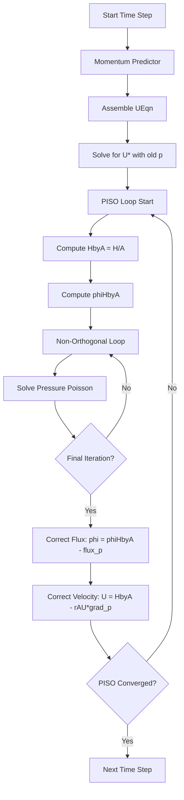

# MODULE_05 Section 06: Solver Basics
# หน่วยที่ 05 ส่วนที่ 06: พื้นฐานโปรแกรมแก้สมการ (Solver)

## 1. Overview / ภาพรวม

### What is an OpenFOAM Solver? / โปรแกรมแก้สมการ OpenFOAM คืออะไร?

An OpenFOAM solver is a **C++ program** that:
- **Reads** mesh and initial conditions from case directory
- **Discretizes** PDEs using FVM (fvc, fvm)
- **Solves** the linear systems iteratively
- **Writes** results at specified time intervals

โปรแกรมแก้สมการ OpenFOAM คือโปรแแกรม **C++** ที่:
- **อ่าน** เมชและเงื่อนไขเริ่มต้นจาก case directory
- **แบ่งส่วน** PDEs โดยใช้ FVM (fvc, fvm)
- **แก้** ระบบเชิงเส้นแบบทำซ้ำ
- **เขียน** ผลลัพธ์ตามช่วงเวลาที่กำหนด

> **Key Insight for R410A Evaporator**: Custom solvers are essential for:
> - **Coupled phase change** (mass + energy transfer)
> - **Property variations** with temperature and quality
> - **Two-phase turbulence** modeling
> - **Heat transfer** with wall boiling

---

## 2. Solver Structure / โครงสร้างโปรแกรมแก้สมการ

### Minimal Solver Template / แม่แบบโปรแกรมแก้สมการขั้นต่ำ

**⭐ Standard OpenFOAM Solver Structure**

> **File**: `openfoam_temp/applications/legacy/incompressible/icoFoam/icoFoam.C`
> **Lines**: 52-140

```cpp
#include "fvCFD.H"  // Includes all core FVM functionality

int main(int argc, char *argv[])
{
    // === INITIALIZATION ===
    #include "setRootCase.H"      // Parse command line arguments
    #include "createTime.H"       // Create runTime object
    #include "createMesh.H"       // Create mesh object

    // === CREATE FIELDS ===
    #include "createFields.H"     // Create p, U, T, and other fields

    // === TIME LOOP ===
    while (runTime.loop())
    {
        // === SOLVE EQUATIONS ===
        // 1. Momentum equation
        // 2. Pressure-velocity coupling (PISO/SIMPLE)
        // 3. Energy equation
        // 4. Other scalar equations

        // === OUTPUT ===
        runTime.write();  // Write fields to disk
    }

    return 0;
}
```

### Include Files Explained / คำอธิบายไฟล์ Include

| Include File | Purpose | Creates |
|--------------|---------|---------|
| **setRootCase.H** | Parse command line args | `args`, `rootDir`, `caseDir` |
| **createTime.H** | Time management | `runTime` object |
| **createMesh.H** | Mesh creation | `mesh` object |
| **createFields.H** | User-defined fields | `p`, `U`, `T`, etc. |
| **initContinuityErrs.H** | Initialize mass error tracking | `cumulContErr` |

### Field Creation (createFields.H) / การสร้างฟิลด์

**⭐ createFields.H Template**

> **File**: `openfoam_temp/applications/legacy/incompressible/icoFoam/createFields.H`
> **Lines**: 1-58

```cpp
// === READ TRANSPORT PROPERTIES ===
Info<< "Reading physicalProperties\n" << endl;

IOdictionary physicalProperties
(
    IOobject
    (
        "physicalProperties",         // Dictionary name
        runTime.constant(),            // Location: constant/
        mesh,                          // Registered to mesh
        IOobject::MUST_READ_IF_MODIFIED,
        IOobject::NO_WRITE
    )
);

dimensionedScalar nu
(
    "nu",
    dimKinematicViscosity,            // Dimensions: [m^2/s]
    physicalProperties.lookup("nu")   // Read from dictionary
);

// === CREATE PRESSURE FIELD ===
Info<< "Reading field p\n" << endl;

volScalarField p
(
    IOobject
    (
        "p",                           // Field name
        runTime.name(),                // Time directory (0/)
        mesh,
        IOobject::MUST_READ,           // Must exist
        IOobject::AUTO_WRITE           // Auto-write at output times
    ),
    mesh                               // Initialize to mesh size
);

// === CREATE VELOCITY FIELD ===
Info<< "Reading field U\n" << endl;

volVectorField U
(
    IOobject
    (
        "U",
        runTime.name(),
        mesh,
        IOobject::MUST_READ,
        IOobject::AUTO_WRITE
    ),
    mesh
);

// === CREATE FLUX FIELD ===
#include "createPhi.H"  // phi = U & mesh.Sf (surfaceScalarField)

// === PRESSURE REFERENCE ===
label pRefCell = 0;
scalar pRefValue = 0.0;
setRefCell(p, simple.dict(), pRefCell, pRefValue);
mesh.schemes().setFluxRequired(p.name());  // Require flux for p
```

**⭐ Key Points**:
- Fields are **registered** to mesh (automatic memory management)
- Fields are **read** from `0/` directory at start
- Fields are **written** to time directories during simulation
- Flux `phi` is computed from `U` and face areas

---

## 3. Time Integration / การรวมเชิงเวลา

### Time Loop Structure / โครงสร้างลูปเวลา

```cpp
// === TIME LOOP ===
while (runTime.loop())
{
    Info<< "Time = " << runTime.userTimeName() << nl << endl;

    // === CALCULATE TIME STEP (ADAPTIVE) ===
    #include "CourantNo.H"  // Calculate Co number

    // === SOLVE GOVERNING EQUATIONS ===
    // Momentum equation
    // Pressure equation
    // Energy equation
    // Other scalars

    // === OUTPUT RESULTS ===
    runTime.write();

    // === TIMING INFO ===
    Info<< "ExecutionTime = " << runTime.elapsedCpuTime() << " s"
        << "  ClockTime = " << runTime.elapsedClockTime() << " s"
        << nl << endl;
}
```

### Adaptive Time Stepping / การกำหนดเวลาขั้นปรับได้

**⭐ Courant Number Calculation**

> **File**: `applications/solvers/incompressible/icoFoam/CourantNo.H`
> **Lines**: 24-36

```cpp
// Calculate Courant number for stability monitoring
scalar CoNum = 0.0;
scalar meanCoNum = 0.0;

surfaceScalarField magPhi = mag(phi);

// Co = |U| * deltaT / deltaX
// OpenFOAM: Co = sum(|phi|) / sum(|Sf|) * deltaT
surfaceScalarField SfByA =
    mesh.magSf()/mesh.deltaCoeffs();  // Approximate cell spacing

CoNum = max
(
    magPhi/(SfByA*runTime.deltaTValue())
).value();

meanCoNum = (sum(magPhi)/sum(mesh.magSf())/runTime.deltaTValue()).value();

Info<< "Courant Number mean: " << meanCoNum
    << " max: " << CoNum << endl;
```

**⚠️ Adaptive Time Step Control**:

```cpp
// Maximum Courant number
const scalar maxCo = 0.5;  // User-defined

// Adjust time step to maintain Co < maxCo
if (CoNum > maxCo)
{
    runTime.setDeltaT
    (
        maxCo * runTime.deltaTValue() / CoNum
    );
}
```

### Time Control Dictionary / พจนานุกรมควบคุมเวลา

**File**: `system/controlDict`

```cpp
application     icoFoam;

startFrom       latestTime;  // startTime, latestTime, firstTime

startTime       0;

stopAt          endTime;     // writeNow, nextWrite, endTime
endTime         1.0;

deltaT          0.001;       // Initial time step [s]

writeControl    timeStep;    // timeStep, runTime, adjustableRunTime, clockTime
writeInterval  100;          // Output every 100 steps

purgeWrite      0;           // Keep all time directories (0 = keep all)

writeFormat     binary;      // ascii, binary

writePrecision  6;           // Decimal places

runTimeModifiable yes;

adjustTimeStep  yes;         // Enable adaptive time stepping

maxCo           0.5;         // Maximum Courant number

// Functions to execute during simulation
functions
{
    #includeFunc CourantNo
    #includeFunc continuityErrs
}
```

---

## 4. Pressure-Velocity Coupling / การเชื่อมโยงความดัน-ความเร็ว

### The Challenge / ปัญหาที่ท้าทาย

In incompressible flow:
- **Continuity**: $\nabla \cdot \mathbf{U} = 0$ (no density variation)
- **Momentum**: $\frac{\partial \mathbf{U}}{\partial t} + \nabla \cdot (\mathbf{U}\mathbf{U}) = -\nabla p + \nu \nabla^2 \mathbf{U}$

**Problem**: No explicit equation for pressure!

**Solution**: Use pressure to **enforce continuity** (mass conservation).

### PISO Algorithm (Pressure-Implicit with Splitting of Operators)

**⭐ PISO Loop Structure**

> **File**: `openfoam_temp/applications/legacy/incompressible/icoFoam/icoFoam.C`
> **Lines**: 87-128

```cpp
// === MOMENTUM PREDICTOR ===
fvVectorMatrix UEqn
(
    fvm::ddt(U)              // Time derivative: dU/dt
  + fvm::div(phi, U)         // Convection: div(U*U)
  - fvm::laplacian(nu, U)    // Diffusion: laplacian(nu*U)
);

// Optional momentum prediction
if (piso.momentumPredictor())
{
    solve(UEqn == -fvc::grad(p));  // Solve with old pressure
}

// === PISO LOOP ===
while (piso.correct())
{
    // Step 1: Compute HbyA (intermediate velocity)
    volScalarField rAU(1.0/UEqn.A());           // 1 / diagonal coefficient
    volVectorField HbyA(constrainHbyA(rAU*UEqn.H(), U, p));

    // H = source - off-diagonal * U
    // HbyA = H / A = U* / diagonal coefficient

    surfaceScalarField phiHbyA
    (
        "phiHbyA",
        fvc::flux(HbyA)
      + fvc::interpolate(rAU)*fvc::ddtCorr(U, phi)
    );

    adjustPhi(phiHbyA, U, p);  // Ensure global mass conservation

    // Update pressure BCs
    constrainPressure(p, U, phiHbyA, rAU);

    // === NON-ORTHOGONAL CORRECTOR LOOP ===
    while (piso.correctNonOrthogonal())
    {
        // Step 2: Pressure Poisson Equation
        // laplacian(rAU, p) = div(phiHbyA)
        fvScalarMatrix pEqn
        (
            fvm::laplacian(rAU, p) == fvc::div(phiHbyA)
        );

        pEqn.setReference(pRefCell, pRefValue);  // Fix pressure at reference cell
        pEqn.solve();

        // Step 3: Correct flux only on final iteration
        if (piso.finalNonOrthogonalIter())
        {
            phi = phiHbyA - pEqn.flux();  // phi = phiHbyA - rAU * grad(p) * Sf
        }
    }

    // Step 4: Correct velocity
    U = HbyA - rAU*fvc::grad(p);  // U = U* - rAU * grad(p)
    U.correctBoundaryConditions();

    #include "continuityErrs.H"  // Check mass conservation
}
```

### PISO Algorithm Steps / ขั้นตอนอัลกอริทึม PISO



**⭐ PISO Parameters** (in `system/fvSolution`):

```cpp
PISO
{
    nCorrectors      2;      // Number of PISO iterations
    nNonOrthogonalCorrectors 0;  // Non-orthogonal correction iterations
    pRefCell         0;      // Reference cell for pressure
    pRefValue        0;      // Reference pressure value [Pa]

    momentumPredictor yes;    // Solve momentum equation
}
```

### SIMPLE Algorithm (Semi-Implicit Method for Pressure-Linked Equations)

**For Steady-State Problems**:

```cpp
// === SIMPLE LOOP (steady-state) ===
while (simple.loop())
{
    // === SOLVE MOMENTUM ===
    UEqn =
        fvm::div(phi, U)
      - fvm::laplacian(nu, U);

    // Relax to ensure stability
    UEqn.relax();
    solve(UEqn == -fvc::grad(p));

    // === SOLVE PRESSURE ===
    // laplacian(rAU, p) = div(HbyA)
    // Similar to PISO but with under-relaxation

    // === CORRECT VELOCITY ===
    U = HbyA - rAU*fvc::grad(p);
    U.correctBoundaryConditions();
}
```

**⭐ SIMPLE Parameters** (in `system/fvSolution`):

```cpp
SIMPLE
{
    nCorrectors      2;      // Number of SIMPLE iterations
    nNonOrthogonalCorrectors 0;

    pRefCell         0;
    pRefValue        0;

    residualControl
    {
        p               1e-5;  // Pressure residual tolerance
        U               1e-5;  // Velocity residual tolerance
        // Add other fields as needed
    }
}

// Under-relaxation factors (for stability)
relaxationFactors
{
    fields
    {
        p               0.3;   // Pressure relaxation
        rho             1;     // Density relaxation
    }
    equations
    {
        U               0.7;   // Momentum equation relaxation
        h               0.7;   // Enthalpy equation relaxation
    }
}
```

### PIMPLE Algorithm (Combined PISO-SIMPLE)

**For Transient with Large Time Steps**:

```cpp
// PIMPLE = PISO + SIMPLE
// - Outer loop: SIMPLE (for convergence)
// - Inner loop: PISO (for pressure-velocity coupling)

while (pimple.loop())
{
    // === SOLVE EQUATIONS ===
    // Can use multiple outer iterations for convergence

    // === PISO LOOP (inner) ===
    while (pimple.correct())
    {
        // PISO algorithm
    }
}
```

**⭐ PIMPLE Parameters** (in `system/fvSolution`):

```cpp
PIMPLE
{
    // Outer iterations (SIMPLE-like)
    nCorrectors      2;      // PISO iterations per outer loop
    nOuterCorrectors 1;      // Outer SIMPLE iterations (1 = pure PISO)

    nNonOrthogonalCorrectors 0;

    pRefCell         0;
    pRefValue        0;

    // Residual control for transient simulations
    residualControl
    {
        p               1e-4;
        U               1e-4;
        T               1e-4;  // Temperature
        alpha           1e-4;  // Phase fraction
    }

    momentumPredictor yes;

    // Turbulence
    turbOnFinalIterOnly off;  // Solve turbulence every iteration
}
```

---

## 5. Solver Equation Assembly / การประกอบสมการโปรแกรมแก้สมการ

### Momentum Equation / สมการโมเมนตัม

**⭐ Incompressible Momentum Equation**:

$$
\frac{\partial \mathbf{U}}{\partial t} + \nabla \cdot (\mathbf{U}\mathbf{U}) = -\nabla p + \nu \nabla^2 \mathbf{U}
$$

**OpenFOAM Implementation**:

```cpp
// === ASSEMBLE MOMENTUM EQUATION ===
fvVectorMatrix UEqn
(
    fvm::ddt(U)              // ∂U/∂t (implicit)
  + fvm::div(phi, U)         // ∇·(U*U) (implicit, requires under-relaxation)
  - fvm::laplacian(nu, U)    // ν∇²U (implicit)
 ==
    fvOptions(U)             // Source terms (e.g., porous media, momentum sources)
);

// === SOLVE MOMENTUM ===
// With old pressure (momentum predictor)
solve(UEqn == -fvc::grad(p));
```

### Pressure Poisson Equation / สมการพอย์สองความดัน

**⭐ Pressure Equation**:

Taking divergence of momentum and using $\nabla \cdot \mathbf{U} = 0$:

$$
\nabla \cdot (\frac{1}{A} \nabla p) = \nabla \cdot (\frac{\mathbf{H}}{A})
$$

where:
- $A$: Diagonal coefficient from UEqn
- $\mathbf{H}$: Source term minus off-diagonal contributions

**OpenFOAM Implementation**:

```cpp
// === PRESSURE POISSON EQUATION ===
fvScalarMatrix pEqn
(
    fvm::laplacian(rAU, p) == fvc::div(phiHbyA)
);

// Set reference pressure (for incompressible flow)
pEqn.setReference(pRefCell, pRefValue);

// Solve pressure equation
pEqn.solve();

// Get pressure flux for correction
surfaceScalarField phi_p = pEqn.flux();  // rAU * grad(p) & Sf
```

### Energy Equation / สมการพลังงาน

**⭐ Temperature Equation for R410A**:

$$
\frac{\partial (\rho c_p T)}{\partial t} + \nabla \cdot (\rho c_p \mathbf{U} T) = \nabla \cdot (k \nabla T) + \dot{q}'''
$$

**OpenFOAM Implementation**:

```cpp
// === ENERGY EQUATION (sensible enthalpy) ===
fvScalarMatrix TEqn
(
    fvm::ddt(rho*cp, T)                    // ∂(ρcpT)/∂t
  + fvm::div(rhoPhi*cp, T)                 // ∇·(ρcpUT)
  - fvm::laplacian(k, T)                   // ∇·(k∇T)
 ==
    fvOptions(T)                           // Heat sources
);

TEqn.solve();
```

**⚠️ R410A Phase Change Consideration**:

For evaporating flow, use **enthalpy** instead of temperature:

```cpp
// === ENTHALPY EQUATION (with phase change) ===
fvScalarMatrix hEqn
(
    fvm::ddt(rho, h)
  + fvm::div(rhoPhi, h)
  - fvm::laplacian(k/cp, h)
 ==
    fvOptions(h)
    + phaseChangeModel_->Sh()  // Phase change source
);

hEqn.solve();

// Update temperature from enthalpy
// (accounts for latent heat during phase change)
T = thermo.T();
```

---

## 6. Linear Solvers / โปรแกรมแก้สมการเชิงเส้น

### Solver Selection / การเลือกโปรแกรมแก้สมการ

**⚠️ Linear Solver Configuration** (in `system/fvSolution`):

```cpp
solvers
{
    // === PRESSURE SOLVER ===
    p
    {
        solver          GAMG;              // Geometric-Algebraic Multi-Grid
        tolerance       1e-06;             // Absolute tolerance
        relTol          0.01;              // Relative tolerance (1%)

        smoother        GaussSeidel;       // Smoother for GAMG
        nPreSweeps      0;
        nPostSweeps     2;
        cacheAgglomeration on;             // Cache agglomeration
        nCellsInCoarsestLevel 50;          // Coarsest level size
        agglomerator    faceAreaPair;      // Agglomeration method
        mergeLevels     1;                 // Merge agglomeration levels
    }

    // === VELOCITY SOLVER ===
    U
    {
        solver          PBiCGStab;         // Stabilized Bi-Conjugate Gradient
        preconditioner  DILU;              // Diagonal Incomplete LU
        tolerance       1e-05;
        relTol          0.1;
    }

    // === SCALAR SOLVERS ===
    T
    {
        solver          PBiCGStab;
        preconditioner  DILU;
        tolerance       1e-05;
        relTol          0.1;
    }

    alpha
    {
        solver          PBiCGStab;
        preconditioner  DILU;
        tolerance       1e-06;
        relTol          0.1;
    }
}
```

### Solver Algorithms / อัลกอริทึมโปรแกรมแก้สมการ

| Solver | Full Name | Matrix Type | Speed | Memory | Use Case |
|--------|-----------|-------------|-------|--------|----------|
| **GAMG** | Geometric-Algebraic Multi-Grid | Symmetric | ⭐⭐⭐⭐⭐ | ⭐⭐⭐ | Pressure (Poisson) |
| **PCG** | Preconditioned Conjugate Gradient | Symmetric | ⭐⭐⭐⭐ | ⭐⭐⭐ | Symmetric systems |
| **PBiCGStab** | Preconditioned BiCGStab | Asymmetric | ⭐⭐⭐⭐ | ⭐⭐⭐ | General purpose |
| **smoothSolver** | Gauss-Seidel/SOR | Any | ⭐⭐ | ⭐ | Smoothing, small problems |

### Preconditioners / ตัวทำให้เงื่อนไขลดลง

| Preconditioner | Full Name | Use Case |
|----------------|-----------|----------|
| **none** | No preconditioning | Testing, debugging |
| **DIC** | Diagonal Incomplete Cholesky | Symmetric matrices (PCG) |
| **DILU** | Diagonal Incomplete LU | Asymmetric matrices (PBiCGStab) |
| **FDIC** | Full Diagonal Incomplete Cholesky | Symmetric (faster than DIC) |

### Convergence Criteria / เกณฑ์การลู่เข้า

```cpp
// Convergence check in solver
while (!converged && iter < maxIter)
{
    // Compute residual: r = b - A*x
    residual = b - A * x;

    // Check convergence
    if (residual < tolerance)
    {
        converged = true;
    }

    // Check relative tolerance
    if (residual / initialResidual < relTol)
    {
        converged = true;
    }

    // Perform solver iteration
    x = solverIteration(x, r);
}
```

**⚠️ Tolerance Selection for R410A**:

- **Pressure**: `tolerance 1e-6`, `relTol 0.01` (tight for mass conservation)
- **Velocity**: `tolerance 1e-5`, `relTol 0.1` (looser, updated in PISO loop)
- **Temperature**: `tolerance 1e-5`, `relTol 0.1` (moderate)
- **VOF (alpha)**: `tolerance 1e-6`, `relTol 0.1` (tight for mass conservation)

---

## 7. R410A Evaporator Solver Design / การออกแบบโปรแกรมแก้สมการเครื่องระเหย R410A

### Custom Solver Structure / โครงสร้างโปรแกรมแก้สมการที่กำหนดเอง

**⭐ R410A Evaporator Solver (`r410aEvaporatorFoam`)**:

```cpp
// === MAIN SOLVER FILE ===
applications/solvers/multiphase/r410aEvaporatorFoam/r410aEvaporatorFoam.C

#include "fvCFD.H"
#include "pimpleControl.H"
#include "phaseChangeModel.H"
#include "thermophysicalModel.H"

int main(int argc, char *argv[])
{
    #include "setRootCase.H"
    #include "createTime.H"
    #include "createMesh.H"

    pimpleControl pimple(mesh);

    #include "createFields.H"
    #include "initContinuityErrs.H"

    // === PHASE CHANGE MODEL ===
    autoPtr<phaseChangeModel> pcModel =
        phaseChangeModel::New(mesh, thermophysicalProperties);

    // === TIME LOOP ===
    while (runTime.loop())
    {
        Info<< "Time = " << runTime.userTimeName() << nl << endl;

        #include "CourantNo.H"
        #include "alphaControls.H"  // VOF time step control

        // === SOLVE VOF EQUATION ===
        #include "alphaEqn.H"  // Liquid-vapor interface

        // === UPDATE PROPERTIES ===
        // R410A properties depend on alpha (liquid vs vapor)
        #include "updateR410AProperties.H"

        // === PIMPLE LOOP ===
        while (pimple.loop())
        {
            // === MOMENTUM EQUATION ===
            #include "UEqn.H"

            // === PISO LOOP ===
            while (pimple.correct())
            {
                #include "pEqn.H"  // Pressure equation
            }

            // === ENERGY EQUATION ===
            #include "TEqn.H"  // Temperature/enthalpy with phase change
        }

        // === OUTPUT ===
        runTime.write();

        Info<< "ExecutionTime = " << runTime.elapsedCpuTime() << " s"
            << "  ClockTime = " << runTime.elapsedClockTime() << " s"
            << nl << endl;
    }

    Info<< "End\n" << endl;

    return 0;
}
```

### Phase-Specific Properties / คุณสมบัติเฉพาะสถานะ

**⭐ createFields.H for R410A**:

```cpp
// === THERMOPHYSICAL PROPERTIES ===
Info<< "Reading thermophysical properties\n" << endl;

twoPhaseMixtureThermo phaseThermo(mesh);

volScalarField& rho = phaseThermo.rho();        // Density (liquid + vapor)
volScalarField& cp = phaseThermo.Cp();          // Specific heat
volScalarField& kappa = phaseThermo.kappa();    // Thermal conductivity
volScalarField& mu = phaseThermo.mu();          // Dynamic viscosity

// === PHASE FRACTION ===
Info<< "Reading field alpha\n" << endl;

volScalarField alpha
(
    IOobject
    (
        "alpha",                  // Liquid volume fraction
        runTime.timeName(),
        mesh,
        IOobject::MUST_READ,
        IOobject::AUTO_WRITE
    ),
    mesh
);

// === PRESSURE ===
Info<< "Reading field p\n" << endl;

volScalarField p
(
    IOobject
    (
        "p",
        runTime.timeName(),
        mesh,
        IOobject::MUST_READ,
        IOobject::AUTO_WRITE
    ),
    mesh
);

// === VELOCITY ===
Info<< "Reading field U\n" << endl;

volVectorField U
(
    IOobject
    (
        "U",
        runTime.timeName(),
        mesh,
        IOobject::MUST_READ,
        IOobject::AUTO_WRITE
    ),
    mesh
);

// === TEMPERATURE ===
Info<< "Reading field T\n" << endl;

volScalarField T
(
    IOobject
    (
        "T",
        runTime.timeName(),
        mesh,
        IOobject::MUST_READ,
        IOobject::AUTO_WRITE
    ),
    mesh
);

#include "createPhi.H"

// === PHASE CHANGE MODEL ===
autoPtr<phaseChangeModel> phaseChange =
    phaseChangeModel::New(mesh, phaseThermo);
```

### Property Update Routine / การอัปเดตคุณสมบัติ

**⭐ updateR410AProperties.H**:

```cpp
// === UPDATE R410A PROPERTIES BASED ON PHASE ===
// Properties depend on liquid/vapor fraction

// Reference phases
const volScalarField& alpha1 = alpha;           // Liquid phase
const volScalarField alpha2 = scalar(1) - alpha; // Vapor phase

// Phase densities
const volScalarField& rho1 = phaseThermo.rho1();  // Liquid density
const volScalarField& rho2 = phaseThermo.rho2();  // Vapor density

// Blended properties
rho = alpha1*rho1 + alpha2*rho2;

// Other properties
cp = alpha1*phaseThermo.Cp1() + alpha2*phaseThermo.Cp2();
kappa = alpha1*phaseThermo.kappa1() + alpha2*phaseThermo.kappa2();
mu = alpha1*phaseThermo.mu1() + alpha2*phaseThermo.mu2();

// Update diffusion coefficient for alpha equation
// (interfacial tension, density difference)
twoPhaseMixture& turb = phaseThermo;
surfaceScalarField sigma = turb.sigma();  // Surface tension

// R410A saturation temperature at current pressure
Tsat = phaseThermo.Tsat(p);
```

### VOF Equation with Phase Change / สมการ VOF กับการเปลี่ยนสถานะ

**⭐ alphaEqn.H**:

```cpp
// === VOF TRANSPORT EQUATION WITH PHASE CHANGE ===
// d(alpha)/dt + div(alpha*U) + div(alpha*(1-alpha)*Ur) = S_alpha

surfaceScalarField phiAlpha(phi);
surfaceScalarField phiAlphaCorr(phi);

// MULES: Multidimensional Universal Limiter with Explicit Solution
// Ensures boundedness: 0 <= alpha <= 1

{
    // Phase change source term (evaporation)
    volScalarField::Internal Sp
    (
        IOobject
        (
            "Sp",
            runTime.timeName(),
            mesh,
            IOobject::NO_READ,
            IOobject::NO_WRITE
        ),
        mesh,
        dimensionedScalar("Sp", dimlessness/dimTime, 0)
    );

    volScalarField::Internal Su
    (
        IOobject
        (
            "Su",
            runTime.timeName(),
            mesh,
            IOobject::NO_READ,
            IOobject::NO_WRITE
        ),
        // Mass transfer rate [kg/m^3/s] / liquid density
        phaseChange->mDot() / rho1
    );

    // Compression flux for sharp interface
    surfaceScalarField phic
    (
        mag(phi/mesh.magSf())
      + interfaceCompression::compressionSpeed*rho.mag()
    );

    surfaceScalarField phir(phic*interfaceCompression::interfacePhi(alpha));

    // Solve VOF equation
    MULES::explicitSolve
    (
        geometricOneField(),
        alpha,
        phi,
        phiAlpha,
        Sp,
        Su,
        phir
    );
}

// Update gamma field (used in some models)
gamma = max(min(alpha, scalar(1)), scalar(0));

Info<< "Phase fraction volume error = "
    << (sum(alpha*mesh.V().field()) - initialMass)/sum(mesh.V().field())
    << endl;
```

### Energy Equation with Phase Change / สมการพลังงานกับการเปลี่ยนสถานะ

**⭐ TEqn.H**:

```cpp
// === ENERGY EQUATION WITH LATENT HEAT ===
// Use enthalpy formulation to handle phase change

fvScalarMatrix hEqn
(
    fvm::ddt(rho, h)
  + fvm::div(rhoPhi, h)
  - fvm::laplacian(kappa/cp, h)
 ==
    fvOptions(h)
  + phaseChange->Sh()    // Latent heat source [W/m^3]
);

hEqn.relax();
hEqn.solve();

// Update temperature from enthalpy
// Phase change occurs at Tsat (saturation temperature)
T = phaseThermo.T(h, p);
T.correctBoundaryConditions();

// Correct thermophysical properties
phaseThermo.correct();
```

---

## 8. Solver Compilation / การคอมไพล์โปรแกรมแก้สมการ

### wmake Build System / ระบบ build wmake

**Directory Structure**:

```
applications/solvers/multiphase/r410aEvaporatorFoam/
├── Make/
│   ├── files        // Source files to compile
│   └── options      // Compilation flags
├── r410aEvaporatorFoam.C  // Main solver file
├── createFields.H
├── alphaEqn.H
├── UEqn.H
├── pEqn.H
└── TEqn.H
```

**⭐ Make/files**:

```cpp
r410aEvaporatorFoam.C

EXE = $(FOAM_USER_APPBIN)/r410aEvaporatorFoam
```

**⭐ Make/options**:

```cpp
EXE_INC = \
    -I$(LIB_SRC)/finiteVolume/lnInclude \
    -I$(LIB_SRC)/meshTools/lnInclude \
    -I$(LIB_SRC)/transportModels \
    -I$(LIB_SRC)/transportModels/incompressible/lnInclude \
    -I$(LIB_SRC)/thermophysicalModels/basic/lnInclude \
    -I$(LIB_SRC)/thermophysicalModels/specie/lnInclude \
    -I$(LIB_SRC)/turbulenceModels \
    -I$(LIB_SRC)/ODE/lnInclude

EXE_LIBS = \
    -lfiniteVolume \
    -lmeshTools \
    -lincompressibleTransportModels \
    -lfluidThermophysicalModels \
    -lspecie \
    -lturbulenceModels
```

### Compilation Steps / ขั้นตอนการคอมไพล์

```bash
# 1. Navigate to solver directory
cd $FOAM_RUN/applications/solvers/multiphase/r410aEvaporatorFoam

# 2. Compile solver
wmake

# Output:
# wmake LnInclude
# wmake MMakefile dependencies: don't know how to make r410aEvaporatorFoam.C
# SOURCE=r410aEvaporatorFoam.C ;  g++ -std=c++11 ... -c r410aEvaporatorFoam.C
# g++ -std=c++11 ... -o /home/user/OpenFOAM/.../platforms/linux64GccDPOpt/bin/r410aEvaporatorFoam

# 3. Verify compilation
which r410aEvaporatorFoam
# Should show: /home/user/OpenFOAM/.../platforms/linux64GccDPOpt/bin/r410aEvaporatorFoam
```

---

## 9. Verification & Validation / การตรวจสอบและการยืนยันความถูกต้อง

### Verification: Method of Manufactured Solutions / การตรวจสอบ: วิธีการสร้างสมการเทียม

**Step 1: Choose exact solution**
$$
u_{exact} = \sin(\pi x) \cos(\pi y) e^{-t}
$$

**Step 2: Compute source term**
$$
S = \frac{\partial u}{\partial t} + u \cdot \nabla u - \nu \nabla^2 u + \nabla p
$$

**Step 3: Run simulation with source term**

**Step 4: Compare numerical vs. exact solution**
```cpp
// Calculate L2 norm error
scalar error = sqrt(sum(mag(u - uExact) * mesh.V()) / sum(mesh.V()));
Info<< "L2 error = " << error << endl;
```

### Validation: Comparison with Experiments / การยืนยันความถูกต้อง: การเปรียบเทียบกับการทดลอง

**R410A Evaporator Validation Data**:

1. **Heat Transfer Coefficient**:
   - Compare simulated $h$ with correlations (Shah, Kandlikar)
   - Wall temperature distribution

2. **Pressure Drop**:
   - Compare $\Delta P$ vs. mass flux
   - Two-phase frictional multiplier

3. **Void Fraction**:
   - Compare cross-sectional void fraction
   - Flow regime transitions

**⭐ Validation Metrics**:

```cpp
// === CALCULATE HEAT TRANSFER COEFFICIENT ===
volScalarField htc
(
    "htc",
    q_wall / (T_wall - T_sat)
);

// === CALCULATE PRESSURE DROP ===
scalar deltaP = max(p).value() - min(p).value();

// === CALCULATE VOID FRACTION ===
scalar voidFraction = sum((1 - alpha) * mesh.V()) / sum(mesh.V());

// Output to file
ofstream file("validationData.dat", ios_base::app);
file << runTime.timeName() << " " << htc.average().value() << " "
     << deltaP << " " << voidFraction << endl;
```

---

## 10. Summary / สรุป

### Key Takeaways / จุดสำคัญ

1. **Solver Structure**:
   - `main()`: Create mesh, fields, time loop
   - `createFields.H`: Initialize all fields
   - Equation files: UEqn, pEqn, TEqn, alphaEqn

2. **Pressure-Velocity Coupling**:
   - **PISO**: Transient, 2-3 iterations per time step
   - **SIMPLE**: Steady, under-relaxation required
   - **PIMPLE**: Combined for transient with large time steps

3. **Linear Solvers**:
   - **GAMG**: Best for pressure (Poisson equation)
   - **PBiCGStab**: General purpose for momentum
   - **Convergence**: Absolute and relative tolerances

4. **R410A Evaporator-Specific**:
   - **VOF** for interface tracking (MULES for boundedness)
   - **Enthalpy** formulation for phase change
   - **Property blending**: $\phi = \alpha \phi_l + (1-\alpha) \phi_v$
   - **Phase change source**: Mass and energy coupling

5. **Compilation**:
   - `wmake` system: Make/files, Make/options
   - Libraries: finiteVolume, meshTools, transportModels
   - Executable placed in `$FOAM_USER_APPBIN`

---

## References / อ้างอิง

1. **OpenFOAM Source Code**:
   - `applications/solvers/incompressible/icoFoam/` - Basic incompressible solver
   - `applications/solvers/multiphase/interFoam/` - VOF solver
   - `applications/solvers/heatTransfer/chtMultiRegionFoam/` - Conjugate heat transfer
   - `src/finiteVolume/` - FVM discretization

2. **OpenFOAM Documentation**:
   - User Guide: Chapter 3 (Applications and solvers)
   - Programmer's Guide: Chapter 3 (Derivation of equations)
   - Wiki: Solver writing (https://openfoamwiki.net/)

3. **Textbooks**:
   - Moukalled, F., Mangani, L., & Darwish, M. (2016). *The Finite Volume Method in Computational Fluid Dynamics*
   - Jasak, H. (1996). *Error Analysis and Estimation for the Finite Volume Method* (PhD thesis)

---

*Last Updated: 2026-01-28*
*Next Section: 07_Boundary_Conditions*
