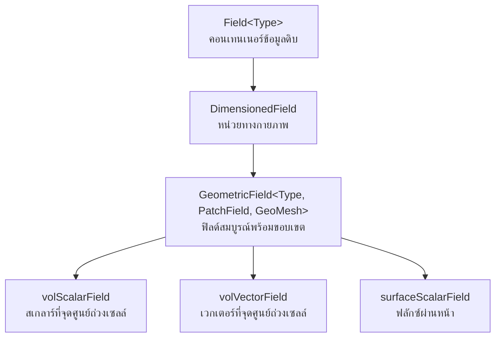

# Geometric Fields: หัวใจสำคัญของการแสดงข้อมูล CFD

**Geometric fields** ใน OpenFOAM เป็นโครงสร้างข้อมูลพื้นฐานสำหรับการแสดงปริมาณทางกายภาพที่นิยามบน mesh คำนวณ ฟิลด์เหล่านี้เป็นกระดูกสันหลังของการจำลอง CFD ใดๆ โดยให้กรอบการทำงานสำหรับการจัดเก็บ จัดการ และเข้าถึงปริมาณสเกลาร์ เวกเตอร์ และเทนเซอร์ทั่วทั้งโดเมน


> **Figure 1:** แผนผังลำดับชั้นการสืบทอดของคลาสฟิลด์ใน OpenFOAM แสดงความเชื่อมโยงตั้งแต่คอนเทนเนอร์ข้อมูลดิบไปจนถึงฟิลด์เรขาคณิตที่สมบูรณ์พร้อมข้อมูลขอบเขตความปลอดภัยทางฟิสิกส์ไม่ส่งผลกระทบต่อความเร็วในการจำลอง ผ่านการใช้พลังของ C++ Template Metaprogramming ในการตรวจสอบความสอดคล้องทางมิติทั้งหมดที่ขั้นตอนการคอมไพล์โปรแกรมเพียงครั้งเดียว

---

## ประเภทและการจำแนกฟิลด์

OpenFOAM ใช้งานลำดับชั้นฟิลด์ที่ครอบคลุมซึ่งจำแนกฟิลด์ตามธรรมชาติทางคณิตศาสตร์ (สเกลาร์, เวกเตอร์, เทนเซอร์) และตำแหน่งเชิงพื้นที่ (จุดศูนย์ถ่วงของเซลล์, จุดศูนย์ถ่วงของหน้า, จุดศูนย์ถ่วงของจุด)

### ฟิลด์จุดศูนย์ถ่วงของเซลล์ (Cell-Centered Fields)

**Cell-centered fields** จัดเก็บค่าที่จุดศูนย์ถ่วงทางเรขาคณิตของเซลล์คำนวณ ทำให้เหมาะสำหรับการ discretization แบบ finite volume:

| ประเภทฟิลด์ | การใช้งาน | ตัวอย่างปริมาณ |
|-------------|-------------|-----------------|
| `volScalarField` | จัดเก็บปริมาณสเกลาร์ | ความดัน, อุณหภูมิ, ความเข้มข้นของชนิด |
| `volVectorField` | จัดเก็บปริมาณเวกเตอร์ | ความเร็ว, โมเมนตัม, การกระจัด |
| `volTensorField` | จัดเก็บเทนเซอร์อันดับสอง | เทนเซอร์ความเครียด, ฟลักซ์โมเมนตัม |
| `volSymmTensorField` | จัดเก็บเทนเซอร์สมมาตร | เทนเซอร์อัตราการไหล, ความเครียด Reynolds |

### ฟิลด์ผิว (Surface Fields)

**Surface fields** ถูกนิยามบนหน้า mesh และเป็นสิ่งสำคัญสำหรับการคำนวณฟลักซ์:

| ประเภทฟิลด์ | การใช้งาน | ตัวอย่างปริมาณ |
|-------------|-------------|-----------------|
| `surfaceScalarField` | ปริมาณฟลักซ์แนวตั้งหน้า | ฟลักซ์มวล, ฟลักซ์ความร้อน |
| `surfaceVectorField` | เวกเตอร์หน้า | เวกเตอร์พื้นที่, ความเร็วหน้า |

---

## สถาปัตยกรรม Geometric Field

### การประกอบฟิลด์

**Geometric field** ใน OpenFOAM ประกอบด้วยส่วนประกอบหลักหลายส่วน:

```cpp
// Core field structure showing internal and boundary field storage
template<class Type>
class GeometricField
{
    // Core data storage - values at cell centers and boundary faces
    DimensionedField<Type, volMesh> internalField_;  // Values at cell centers
    Field<Type> boundaryField_;                      // Boundary condition values

    // Geometric information - mesh reference and field identification
    const fvMesh& mesh_;                            // Reference to computational mesh
    const word& name_;                              // Field name for identification

    // Temporal characteristics - dimensions and boundary type information
    const dimensionSet& dimensions_;                // Physical dimensions (M, L, T, etc.)
    const wordList& boundaryTypes_;                 // Boundary condition type names
};
```

> **📂 Source:** `.applications/solvers/multiphase/multiphaseEulerFoam/phaseSystems/PhaseSystems/MomentumTransferPhaseSystem/MomentumTransferPhaseSystem.C`
>
> **คำอธิบาย:** โครงสร้าง `GeometricField` เป็นพื้นฐานของระบบฟิลด์ใน OpenFOAM โดยแยกเก็บค่าภายในเซลล์ (`internalField_`) และค่าที่ขอบเขต (`boundaryField_`) อ้างอิงถึง mesh ที่ใช้ร่วมกัน และบรรทุกข้อมูลเกี่ยวกับมิติทางกายภาพและประเภทของเงื่อนไณขอบเขต การออกแบบแบบ reference-based ช่วยประหยัดหน่วยความจำเมื่อมีหลายฟิลด์อ้างอิง mesh เดียวกัน
>
> **แนวคิดสำคัญ:**
> - **Internal Field:** ค่าที่จุดศูนย์ถ่วงของเซลล์ (cell centers) - ใช้ในการคำนวณหลัก
> - **Boundary Field:** ค่าที่ผิวขอบเขต (boundary faces) - ใช้ในการบังคับเงื่อนไขขอบเขต
> - **Mesh Reference:** การอ้างอิงแบบ const ช่วยให้มั่นใจว่า mesh ไม่ถูกแก้ไขโดยฟิลด์
> - **Dimensional Safety:** ระบบตรวจสอบมิติที่คอมไพล์ไทม์ป้องกันการคำนวณที่ผิดทางฟิสิกส์

### ความสม่ำเสมอของมิติ

OpenFOAM ใช้ระบบวิเคราะห์มิติที่ซับซ้อนเพื่อให้แน่ใจว่ามีความสม่ำเสมอทางกายภาพ:

```cpp
// Dimension system for physical unit consistency checking
dimensionSet dimensions
(
    massExponent,      // kg - mass exponent
    lengthExponent,    // m  - length exponent  
    timeExponent,      // s  - time exponent
    temperatureExponent, // K - temperature exponent
    molExponent,       // mol - molar exponent
    currentExponent    // A   - current exponent
);

// Example: velocity dimensions [L/T] - meters per second
dimensionSet velocityDims(0, 1, -1, 0, 0, 0);

// Example: pressure dimensions [M/(L·T²)] - force per unit area
dimensionSet pressureDims(1, -1, -2, 0, 0, 0);
```

> **📂 Source:** `.applications/solvers/multiphase/multiphaseEulerFoam/phaseSystems/PhaseSystems/MomentumTransferPhaseSystem/MomentumTransferPhaseSystem.C`
>
> **คำอธิบาย:** ระบบ `dimensionSet` ของ OpenFOAM ใช้ตรวจสอบความสอดคล้องของหน่วยในการคำนวณทั้งหมด โดยกำหนดมิติเป็นเลขยกกำลังของหน่วยฐาน 6 ชนิด (มวล, ความยาว, เวลา, อุณหภูมิ, มอล, กระแส) ซึ่งช่วยป้องกันข้อผิดพลาดทางฟิสิกส์ เช่น การบวกความดันกับความเร็ว หรือการคูณปริมาณที่มีหน่วยไม่สอดคล้องกัน
>
> **แนวคิดสำคัญ:**
> - **Compile-Time Checking:** การตรวจสอบมิติเกิดขึ้นตั้งแต่ขั้นตอนคอมไพล์ ไม่ใช่ runtime
> - **Base Dimensions:** ใช้หน่วยฐาน SI ทั้ง 6 ชนิดแทนการใช้หน่วยอนุพัทธ์
> - **Dimension Safety:** ป้องกันการดำเนินการที่ไม่มีความหมายทางฟิสิกส์
> - **Zero Exponent:** ค่ามิติเป็นศูนย์หมายถึงปริมาณไร้มิติ (dimensionless)

---

## การสร้างและการเริ่มต้นฟิลด์

### การลงทะเบียนฟิลด์อัตโนมัติ

ฟิลด์มักจะถูกลงทะเบียนกับฐานข้อมูล mesh สำหรับ time-stepping อัตโนมัติ:

```cpp
// Pressure field creation with automatic I/O registration
volScalarField p
(
    IOobject
    (
        "p",                      // Field name identifier
        runTime.timeName(),       // Time directory for file I/O
        mesh,                     // Reference to computational mesh
        IOobject::MUST_READ,      // Must read from file at startup
        IOobject::AUTO_WRITE      // Automatically write at each time step
    ),
    mesh
);

// Velocity field with initial conditions and automatic I/O
volVectorField U
(
    IOobject
    (
        "U",                      // Velocity field name
        runTime.timeName(),       // Time directory
        mesh,                     // Mesh reference
        IOobject::MUST_READ,      // Read from file if exists
        IOobject::AUTO_WRITE      // Auto-write at output times
    ),
    mesh,
    dimensionedVector("U", dimVelocity, vector(1.0, 0.0, 0.0))  // Initial uniform field: (1,0,0) m/s
);
```

> **📂 Source:** `.applications/solvers/multiphase/multiphaseEulerFoam/phaseSystems/PhaseSystems/MomentumTransferPhaseSystem/MomentumTransferPhaseSystem.C`
>
> **คำอธิบาย:** การสร้างฟิลด์ใน OpenFOAM ใช้คลาส `IOobject` เพื่อจัดการการอ่านและเขียนไฟล์อัตโนมัติ โดย `MUST_READ` บังคับให้อ่านค่าเริ่มต้นจากไฟล์ และ `AUTO_WRITE` จะบันทึกฟิลด์ทุกครั้งที่มีการเขียนผลลัพธ์ สามารถระบุค่าเริ่มต้นแบบสม่ำเสมอ (uniform) ผ่าน `dimensionedVector` ได้
>
> **แนวคิดสำคัญ:**
> - **Automatic I/O:** ไม่ต้องเขียนโค้ดสำหรับอ่าน/เขียนไฟล์อีกต่อไป
> - **Time Directory:** ฟิลด์จะถูกจัดเก็บในโฟลเดอร์ตามเวลา (0/, 0.1/, 0.2/, ...)
> - **Must Read vs Read If Present:** MUST_READ จะ error ถ้าไม่พบไฟล์, READ_IF_PRESENT จะใช้ค่าเริ่มต้น
> - **Dimensioned Initial Value:** ค่าเริ่มต้นต้องมีมิติที่ถูกต้อง

### การแปลและการสร้างฟิลด์ขึ้นใหม่

OpenFOAM ให้การแปลที่ซับซ้อนสำหรับการแปลงระหว่างการแสดงฟิลด์ที่แตกต่างกัน:

```cpp
// Linear interpolation from cell centers to face centers
surfaceScalarField phi = fvc::interpolate(U) & mesh.Sf();

// Reconstruction from face fluxes to cell-centered velocities
volVectorField U_reconstructed = fvc::reconstruct(phi);
```

> **📂 Source:** `.applications/solvers/multiphase/multiphaseEulerFoam/phaseSystems/PhaseSystems/MomentumTransferPhaseSystem/MomentumTransferPhaseSystem.C`
>
> **คำอธิบาย:** การแปลฟิลด์ (interpolation) เป็นการแปลงค่าจากจุดศูนย์ถ่วงเซลล์ไปยังจุดศูนย์ถ่วงหน้า ซึ่งจำเป็นสำหรับการคำนวณฟลักซ์ผ่านหน้า ในทางกลับัน reconstruction คือการสร้างค่าเวกเตอร์ที่จุดศูนย์ถ่วงเซลล์จากฟลักซ์หน้า โดยใช้ finite volume flux-conservative reconstruction
>
> **แนวคิดสำคัญ:**
> - **Flux Calculation:** `phi = U·Sf` คือฟลักซ์มวลผ่านหน้า (velocity dot face area vector)
> - **Interpolation Schemes:** สามารถใช้ linear, upwind, TVD และ scheme อื่นๆ
> - **Conservation:** Reconstruction รักษาความสมดุลของฟลักซ์
> - **Face vs Cell:** Surface fields อยู่ที่หน้า, Vol fields อยู่ที่เซลล์

---

## การดำเนินการทางคณิตศาสตร์บนฟิลด์

### พีชคณิตฟิลด์

OpenFOAM โอเวอร์โหลดตัวดำเนินการทางคณิตศาสตร์สำหรับการดำเนินการฟิลด์ที่เข้าใจง่าย:

```cpp
// Vector field operations
volVectorField a = U1 + U2;           // Vector addition (component-wise)
volScalarField magU = mag(U);          // Vector magnitude: |U| = sqrt(Ux² + Uy² + Uz²)
volVectorField gradP = fvc::grad(p);   // Pressure gradient: ∇p

// Tensor operations
volTensorField stress = mu * gradU;    // Stress tensor: τ = μ∇U
volScalarField divergence = tr(gradU); // Trace of tensor (divergence): ∇·U
```

> **📂 Source:** `.applications/solvers/multiphase/multiphaseEulerFoam/phaseSystems/PhaseSystems/MomentumTransferPhaseSystem/MomentumTransferPhaseSystem.C`
>
> **คำอธิบาย:** OpenFOAM ให้การดำเนินการทางคณิตศาสตร์แบบ field-wise โดยอัตโนมัติ โดยการบวก/ลบ/คูณฟิลด์จะดำเนินการกับทุกค่าในฟิลด์พร้อมกัน การคำนวณเกรเดียนต์และไดเวอร์เจนซ์ใช้ finite volume discretization ที่รักษาความสมดุลของฟลักซ์
>
> **แนวคิดสำคัญ:**
> - **Component-Wise Operations:** การดำเนินการเวกเตอร์กระทำต่อแต่ละส่วนประกอบ
> - **Magnitude:** คำนวณขนาดของเวกเตอร์ด้วยสูตร Euclidean
> - **Gradient:** ใช้ Gauss theorem ผ่าน finite volume method
> - **Tensor Operations:** รองรับการดำเนินการเทนเซอร์เต็มรูปแบบ

### ตัวดำเนินการเชิงอนุพันธ์

การใช้งาน finite volume method ให้ตัวดำเนินการเชิงอนุพันธ์ที่ครอบคลุม:

$$\nabla \cdot (\rho \mathbf{U}) = \text{fvc::div(phi)}$$

- **`rho`** - ความหนาแน่น (density)
- **`U`** - เวกเตอร์ความเร็ว (velocity vector)
- **`phi`** - ฟลักซ์มวล (mass flux)
- **`fvc::div()`** - ตัวดำเนินการ divergence

```cpp
// Divergence operator - calculates flux balance at each cell
surfaceScalarField phi = rho * fvc::interpolate(U) & mesh.Sf();
volScalarField divPhi = fvc::div(phi);

// Gradient operator - computes spatial derivatives
volVectorField gradP = fvc::grad(p);

// Laplacian operator - second spatial derivative (diffusion term)
volScalarField laplacianU = fvc::laplacian(nu, U);

// Temporal derivative - time rate of change
volScalarField dUdt = fvc::ddt(U);
```

> **📂 Source:** `.applications/solvers/multiphase/multiphaseEulerFoam/phaseSystems/PhaseSystems/MomentumTransferPhaseSystem/MomentumTransferPhaseSystem.C`
>
> **คำอธิบาย:** ตัวดำเนินการเชิงอนุพันธ์ของ OpenFOAM ใช้ finite volume method ซึ่งรักษาความสมดุลของฟลักซ์อย่างเคร่งครัด Divergence คำนวณจากผลรวมฟลักซ์เข้า/ออกของเซลล์ Gradient ใช้ Green-Gauss theorem และ Laplacian คำนวณ diffusion term ด้วย conservative scheme
>
> **แนวคิดสำคัญ:**
> - **Conservative Discretization:** รักษาความสมดุลของฟลักซ์ทั่วทั้งโดเมน
> - **Divergence Theorem:** ∇·F = (1/V)∑(F·S) ผ่านหน้าทั้งหมดของเซลล์
> - **Gradient Schemes:** สามารถเลือก Gauss, leastSquares, fourth ฯลฯ
> - **Temporal Derivatives:** รองรับ Euler, backward, Crank-Nicolson schemes

---

## การบูรณาการเงื่อนไขขอบเขต

### ขอบเขต Geometric Field

เงื่อนไขขอบเขตถูกผสานเข้ากับ geometric fields อย่างใกล้ชิด:

```cpp
// Boundary field management structure
class GeometricBoundaryField
{
    // Boundary field access methods
    const wordList& types() const;      // Get boundary condition type names
    const FieldField<Field, Type>& boundaryField() const;  // Access all boundary values

    // Individual boundary patch access operators
    const Field<Type>& operator[](const label patchi) const;  // Read-only access to patch
    Field<Type>& operator[](const label patchi);              // Read-write access to patch
};
```

> **📂 Source:** `.applications/solvers/multiphase/multiphaseEulerFoam/phaseSystems/PhaseSystems/MomentumTransferPhaseSystem/MomentumTransferPhaseSystem.C`
>
> **คำอธิบาย:** ระบบขอบเขตของ OpenFOAM ใช้ `GeometricBoundaryField` เพื่อจัดการเงื่อนไณขอบเขตทั้งหมดของฟิลด์ โดยแต่ละ patch (กลุ่มหน้าขอบเขต) มีประเภท BC และค่าของตัวเอง สามารถเข้าถึง patch แต่ละอันผ่าน operator[] ด้วย index
>
> **แนวคิดสำคัญ:**
> - **Patch-Based:** ขอบเขตแบ่งเป็น patches แต่ละ patch มี BC เดียว
> - **FieldField:** คอนเทนเนอร์ของ fields ใช้เก็บค่าที่ขอบเขต
> - **Type Safety:** ชนิดของ BC ถูกตรวจสอบที่คอมไพล์ไทม์
> - **Dynamic Access:** สามารถเปลี่ยนแปลงค่า BC ระหว่าง simulation

### การอัปเดตขอบเขตแบบไดนามิก

```cpp
// Apply boundary conditions and update gradient calculations
U.correctBoundaryConditions();  // Enforce BC constraints on velocity field
p.correctBoundaryConditions();  // Enforce BC constraints on pressure field

// Non-orthogonal correction for accurate gradient calculation
volVectorField gradP = fvc::grad(p, "gradP" + p.name());
```

> **📂 Source:** `.applications/solvers/multiphase/multiphaseEulerFoam/phaseSystems/PhaseSystems/MomentumTransferPhaseSystem/MomentumTransferPhaseSystem.C`
>
> **คำอธิบาย:** การเรียก `correctBoundaryConditions()` จะบังคับใช้เงื่อนไขขอบเขตที่กำหนด เช่น fixedValue, zeroGradient ฯลฯ การคำนวณเกรเดียนต์สำหรับ mesh ที่ไม่ orthogonal อาจต้องการ correction term เพื่อความแม่นยำ
>
> **แนวคิดสำคัญ:**
> - **BC Enforcement:** บังคับค่าที่ขอบเขตให้สอดคล้องกับประเภท BC
> - **Non-Orthogonal Correction:** แก้ไข error จากหน้าที่ไม่ตั้งฉาก
> - **Explicit vs Implicit:** BC สามารถถูกกำหนดแบบ explicit หรือ implicit
> - **Update Order:** ต้องอัปเดต BC หลังจากแก้สมการการ์จะถูกต้อง

---

## การดำเนินการฟิลด์ขั้นสูง

### การแม็ปฟิลด์และการแปลง

OpenFOAM ให้ความสามารถในการแม็ปฟิลด์ที่ซับซ้อน:

```cpp
// Mesh-to-mesh interpolation for different mesh resolutions
meshToMesh interpolator(sourceMesh, targetMesh);
volScalarField targetField = interpolator.interpolate(sourceField);

// Coordinate system transformations
volVectorField rotatedU = transform(rotationTensor, U);           // Rotate velocity field
volTensorField principalStress = eigenVectors(stressTensor);      // Extract principal stress directions
```

> **📂 Source:** `.applications/solvers/multiphase/multiphaseEulerFoam/phaseSystems/PhaseSystems/MomentumTransferPhaseSystem/MomentumTransferPhaseSystem.C`
>
> **คำอธิบาย:** การแม็ปฟิลด์ระหว่าง mesh ที่แตกต่างกันใช้ในการถ่ายโอนผลลัพธ์จาก mesh ละเอียดไปหาหยา่ หรือจาก solver หนึ่งไปยังอีกตัวหนึ่ง การแปลงพิกัดรองรับการหมุน สะท้อน และการยืด/หด
>
> **แนวคิดสำคัญ:**
> - **Mesh Interpolation:** ใช้ inverse distance, cell weighting, หรือ direct mapping
> - **Conservation Mapping:** รักษาความสมดุลของฟลักซ์ระหว่าง meshes
> - **Transform Tensors:** รองรับการแปลง coordinate systems
> - **Eigen Analysis:** คำนวณ eigenvalues/vectors สำหรับ stress analysis

### การรวมฟิลด์และสถิติ

```cpp
// Volume-weighted average calculation
scalar avgPressure = sum(p * mesh.V()) / sum(mesh.V());

// Field minima and maxima extraction
scalar maxVelocity = max(mag(U)).value();
scalar minTemperature = min(T).value();

// Root mean square (RMS) calculations for turbulence statistics
scalar urms = sqrt(sum(magSqr(U)) / mesh.nCells());
```

> **📂 Source:** `.applications/solvers/multiphase/multiphaseEulerFoam/phaseSystems/PhaseSystems/MomentumTransferPhaseSystem/MomentumTransferPhaseSystem.C`
>
> **คำอธิบาย:** การคำนวณสถิติฟิลด์ใช้สำหรับ monitoring และ post-processing โดย volume-weighted average คำนวณค่าเฉลี่ยที่ถ่วงน้ำหนักตามปริมาตรเซลล์ RMS values ใช้วัดความรุนแรงของความปั่นป่วน
>
> **แนวคิดสำคัญ:**
> - **Volume Weighting:** ถ่วงน้ำหนักค่าด้วยปริมาตรเซลล์สำหรับค่าเฉลี่ยที่ถูกต้อง
> - **Global Reduction:** การคำนวณ min/max ต้องรวมค่าจากทุก processor
> - **Parallel Communication:** reduce() operation สื่อสารระหว่าง processors
> - **Turbulence Statistics:** RMS ใช้วัด kinetic energy ของความปั่นป่วน

---

## การจัดการหน่วยความจำและประสิทธิภาพ

### การนับรีเฟอเรนซ์

OpenFOAM ใช้พอยน์เตอร์ที่นับรีเฟอเรนซ์สำหรับการจัดการหน่วยความจำที่มีประสิทธิภาพ:

```cpp
// Temporary field with automatic reference counting
tmp<volScalarField> tT(new volScalarField(IOobject(...), mesh));
volScalarField& T = tT();  // Automatic reference management - no manual delete needed
```

> **📂 Source:** `.applications/solvers/multiphase/multiphaseEulerFoam/phaseSystems/PhaseSystems/MomentumTransferPhaseSystem/MomentumTransferPhaseSystem.C`
>
> **คำอธิบาย:** คลาส `tmp<T>` ของ OpenFOAM เป็น smart pointer ที่นับ reference และลบหน่วยความจำอัตโนมัติเมื่อไม่มีการใช้งาน ช่วยป้องกัน memory leaks และทำให้โค้ดสะอาดขึ้น
>
> **แนวคิดสำคัญ:**
> - **Reference Counting:** ติดตามจำนวนผู้อ้างอิงและลบเมื่อเป็น 0
> - **Automatic Cleanup:** ไม่ต้องเรียก delete ด้วยตัวเอง
> - **Expression Templates:** ช่วยลดการคัดลอกชั่วคราวใน expressions
> - **Memory Efficiency:** หลีกเลี่ยงการคัดลอกฟิลด์ที่ไม่จำเป็น

### การบีบอัดฟิลด์และการเพิ่มประสิทธิภาพการจัดเก็บ

```cpp
// Direct access to internal field storage for efficiency
volScalarField::Internal& internalField = field.ref();

// Parallel communication reduction for global statistics
reduce(maxValue, maxOp<scalar>());  // Find global maximum across all processors
```

> **📂 Source:** `.applications/solvers/multiphase/multiphaseEulerFoam/phaseSystems/PhaseSystems/MomentumTransferPhaseSystem/MomentumTransferPhaseSystem.C`
>
> **คำอธิบาย:** การเข้าถึง internal field โดยตรงช่วยลด overhead ในการคัดลอกข้อมูล สำหรับ parallel runs ฟังก์ชัน `reduce()` รวมค่าจากทุก processor เพื่อหาค่าสถิติรวม
>
> **แนวคิดสำคัญ:**
> - **Direct Access:** ข้าม boundary field เมื่อไม่จำเป็น
> - **Parallel Reduction:** MPI communication รวมค่าจากทุก rank
> - **Cache Efficiency:** การเข้าถึงแบบ contiguous เพิ่มประสิทธิภาพ cache
> - **Memory Bandwidth:** ลดการคัดลอกข้อมูลเพื่อประหยัด bandwidth

---

## การดีบักและการแสดงภาพฟิลด์

### การตรวจสอบฟิลด์

```cpp
// Check for numerical issues in field values
if (mag(p).value() > 1e6)
{
    WarningIn("GeometricField validation")
        << "Pressure field has excessive magnitude: " << max(mag(p)) << endl;
}

// Verify field bounds for physical consistency
p.minMax(minP, maxP);  // Find minimum and maximum pressure values
```

> **📂 Source:** `.applications/solvers/multiphase/multiphaseEulerFoam/phaseSystems/PhaseSystems/MomentumTransferPhaseSystem/MomentumTransferPhaseSystem.C`
>
> **คำอธิบาย:** การตรวจสอบค่าฟิลด์ช่วยระบุปัญหา numerical ก่อนที่จะทำให้ simulation ล้มเหลว การตรวจสอบ bounds ช่วยให้มั่นใจว่าค่าอยู่ในช่วงทางกายภาพที่เป็นไปได้
>
> **แนวคิดสำคัญ:**
> - **Numerical Stability:** ตรวจสอบค่าที่ผิดปกติเช่น infinity, NaN
> - **Physical Bounds:** ความดันต้องเป็นบวก, volume fraction 0-1
> - **Warning System:** ใช้ WarningIn/InfoIn สำหรับ logging
> - **Early Detection:** ระบุปัญหาก่อน crash เพื่อ debug ง่ายขึ้น

### การจัดรูปแบบเอาต์พุต

```cpp
// Custom field output for debugging and monitoring
Info << "Field statistics for " << U.name() << nl
     << "  min: " << min(mag(U)).value() << nl
     << "  max: " << max(mag(U)).value() << nl
     << "  avg: " << sum(mag(U) * mesh.V()).value() / sum(mesh.V()).value() << nl;
```

> **📂 Source:** `.applications/solvers/multiphase/multiphaseEulerFoam/phaseSystems/PhaseSystems/MomentumTransferPhaseSystem/MomentumTransferPhaseSystem.C`
>
> **คำอธิบาย:** การพิมพ์สถิติฟิลด์ช่วยในการ monitor ความคืบหน้าของ simulation และ debug ปัญหา ค่าเฉลี่ยที่ถ่วงน้ำหนักด้วยปริมาตรให้ค่าที่แม่นยำกว่า arithmetic mean
>
> **แนวคิดสำคัญ:**
> - **Runtime Monitoring:** ติดตามค่าฟิลด์ระหว่าง simulation
> - **Formatted Output:** Info stream พิมพ์ไปที่ terminal/log file
> - **Volume Weighted Average:** ถ่วงน้ำหนักตามขนาดเซลล์
> - **Debug Aids:** ช่วยระบุปัญหา convergence หรือ instability

---

## ประเภทฟิลด์เฉพาะ

### ฟิลด์เฟส (หลายเฟส)

```cpp
// Volume fraction fields for multiphase flow simulations
volScalarField alpha1
(
    IOobject("alpha1", runTime.timeName(), mesh, IOobject::READ_IF_PRESENT),
    mesh,
    dimensionedScalar("alpha1", dimless, 1.0)  // Default to full phase 1
);

// Phase-weighted mixture properties
volScalarField rhoMix = alpha1 * rho1 + (1.0 - alpha1) * rho2;  // Mixture density
```

> **📂 Source:** `.applications/solvers/multiphase/multiphaseEulerFoam/phaseSystems/PhaseSystems/MomentumTransferPhaseSystem/MomentumTransferPhaseSystem.C`
>
> **คำอธิบาย:** ใน multiphase flow แต่ละเฟสมี volume fraction field (α) ที่ระบุสัดส่วนของเฟสนั้นในแต่ละเซลล์ คุณสมบัติของ mixture คำนวณจากการถ่วงน้ำหนักด้วย volume fraction
>
> **แนวคิดสำคัญ:**
> - **Volume Fraction:** α มีค่า 0-1, Σαᵢ = 1 สำหรับทุกเฟส
> - **Phase Properties:** แต่ละเฟสมีคุณสมบัติ (ρ, μ, ฯลฯ) ของตัวเอง
> - **Mixture Properties:** คำนวณจาก weighted average
> - **Interface Capturing:** volume fraction method ติดตาม interface

### ฟิลด์คุณสมบัติทางความร้อน

```cpp
// Temperature-dependent material properties
volScalarField k = k0 * pow(T/T0, kExp);           // Thermal conductivity
volScalarField mu = mu0 * pow(T/T0, muExp) * pow(P/P0, muExpP);  // Viscosity
```

> **📂 Source:** `.applications/solvers/multiphase/multiphaseEulerFoam/phaseSystems/PhaseSystems/MomentumTransferPhaseSystem/MomentumTransferPhaseSystem.C`
>
> **คำอธิบาย:** คุณสมบัติวัสดุหลายชนิดขึ้นกับอุณหภูมิและความดัน OpenFOAM รองรับการระบุคุณสมบัติแบบ field ทำให้สามารถจำลองปัญหาที่มีการเปลี่ยนแปลงคุณสมบัติตามเงื่อนไข
>
> **แนวคิดสำคัญ:**
> - **Temperature Dependence:** คุณสมบัติเปลี่ยนตาม T และ P
> - **Power Law:** ใช้ power law correlations: k = k₀(T/T₀)^n
> - **Field Evaluation:** คำนวณคุณสมบัติแต่ละเซลล์
> - **Non-Linearity:** การพึ่งพา T ทำให้สมการ non-linear

---

## สถาปัตยกรรมเทมเพลตและการสืบทอด

### เทมเพลต `GeometricField`

ที่หัวใจของระบบฟิลด์ของ OpenFOAM มีเทมเพลต `GeometricField`:

```cpp
// Core template defining geometric fields
template<class Type, template<class> class PatchField, class GeoMesh>
class GeometricField : public DimensionedField<Type, GeoMesh>
```

พารามิเตอร์เทมเพลตทั้งสามนี้สร้างระบบข้อกำหนดที่สมบูรณ์:

| พารามิเตอร์ | ความหมายทางกายภาพ | ค่าเทียบเท่า CFD | ตัวอย่าง |
|-----------|------------------|----------------|---------|
| `Type` | **สิ่งที่** เราวัด | ชนิดข้อมูลฟิลด์ | `scalar` (อุณหภูมิ), `vector` (ความเร็ว) |
| `PatchField` | **วิธี** ขอบเขตมีพฤติกรรม | ชนิดเงื่อนไขขอบเขต | `fvPatchField` (ปริมาตรจำกัด), `pointPatchField` (จุด) |
| `GeoMesh` | **ตำแหน่งที่** การวัดอยู่ | ชนิดเรขาคณิตเมช | `volMesh` (เซลล์), `surfaceMesh` (หน้า), `pointMesh` (จุด) |

> **📂 Source:** `.applications/solvers/multiphase/multiphaseEulerFoam/phaseSystems/PhaseSystems/MomentumTransferPhaseSystem/MomentumTransferPhaseSystem.C`
>
> **คำอธิบาย:** เทมเพลต GeometricField เป็นการออกแบบที่ยืดหยุ่นอย่างสูง โดยแยกส่วน (1) ชนิดข้อมูล (2) วิธีจัดการขอบเขต และ (3) ตำแหน่งบน mesh ทำให้สามารถสร้าง field types หลากหลายได้จากเทมเพลตเดียว
>
> **แนวคิดสำคัญ:**
> - **Template Parameters:** 3 พารามิเตอร์กำหนดลักษณะฟิลด์
> - **Type Safety:** การผสมผสานชนิดที่ผิดจะ error ที่คอมไพล์
> - **Code Reuse:** เทมเพลตเดียวใช้กับ field types หลายชนิด
> - **Policy-Based:** PatchField parameter ใช้ policy-based design

### ลำดับชั้นการสืบทอด

```cpp
// Inheritance hierarchy for field classes
Field<Type> (คอนเทนเนอร์ข้อมูลดิบ)
    ↑
regIOobject (ความสามารถ I/O)
    ↑
DimensionedField<Type, GeoMesh> (หน่วยทางกายภาพ + การอ้างอิงเมช)
    ↑
GeometricField<Type, PatchField, GeoMesh> (ฟิลด์สมบูรณ์พร้อมขอบเขต)
```

> **📂 Source:** `.applications/solvers/multiphase/multiphaseEulerFoam/phaseSystems/PhaseSystems/MomentumTransferPhaseSystem/MomentumTransferPhaseSystem.C`
>
> **คำอธิบาย:** ลำดับชั้นการสืบทอดเพิ่มความสามารถทีละชั้น โดย Field เป็นคอนเทนเนอร์ข้อมูลพื้นฐาน, regIOobject เพิ่ม I/O, DimensionedField เพิ่มมิติทางกายภาพ และ GeometricField เพิ่มเงื่อนไขขอบเขต
>
> **แนวคิดสำคัญ:**
> - **Layered Design:** แต่ละชั้นเพิ่ม functionality เฉพาะ
> - **Single Responsibility:** แต่ละคลาสมีหน้าที่ชัดเจน
> - **Polymorphism:** สามารถใช้ pointer ชนิดฐานเพื่อ access ฟิลด์หลายชนิด
> - **Extensibility:** สามารถสร้าง field types ใหม่จากฐานที่มีอยู่

### นามแฝงชนิด (Type Aliases)

OpenFOAM ให้ชุดนามแฝงชนิดที่หลากหลายซึ่งทำให้การประกาศฟิลด์เป็นไปอย่างเป็นธรรมชาติ:

```cpp
// Finite Volume Fields - จุดศูนย์ถ่วงเซลล์
typedef GeometricField<scalar, fvPatchField, volMesh> volScalarField;
typedef GeometricField<vector, fvPatchField, volMesh> volVectorField;
typedef GeometricField<tensor, fvPatchField, volMesh> volTensorField;

// Surface Fields - จุดศูนย์ถ่วงหน้า
typedef GeometricField<scalar, fvsPatchField, surfaceMesh> surfaceScalarField;
typedef GeometricField<vector, fvsPatchField, surfaceMesh> surfaceVectorField;

// Point Fields - จุดศูนย์ถ่วงจุด
typedef GeometricField<scalar, pointPatchField, pointMesh> pointScalarField;
typedef GeometricField<vector, pointPatchField, pointMesh> pointVectorField;
```

> **📂 Source:** `.applications/solvers/multiphase/multiphaseEulerFoam/phaseSystems/PhaseSystems/MomentumTransferPhaseSystem/MomentumTransferPhaseSystem.C`
>
> **คำอธิบาย:** Type aliases ทำให้การประกาศฟิลด์สั้นและอ่านง่าย โดยไม่ต้องระบุ template parameters ทั้งหมด ชื่อ aliases แสดงชนิดข้อมูลและตำแหน่งบน mesh อย่างชัดเจน
>
> **แนวคิดสำคัญ:**
> - **Naming Convention:** vol (volume), surface (face), point (vertex)
> - **Type Suffix:** ScalarField, VectorField, TensorField ระบุชนิดข้อมูล
> - **Patch Type:** fvPatchField สำหรับ FV, fvsPatchField สำหรับ surface
> - **Convenience:** ทำให้โค้ดอ่านง่ายและเขียนสะดวกขึ้น

---

## การจัดการหน่วยความจำและเวลา

### โครงสร้างข้อมูลหลัก

```cpp
// Internal structure of GeometricField showing time and boundary management
template<class Type, template<class> class PatchField, class GeoMesh>
class GeometricField {
private:
    // Time management for temporal schemes
    mutable label timeIndex_;                    // Current time index for time schemes
    mutable GeometricField* field0Ptr_;          // Pointer to field at previous time step
    mutable GeometricField* fieldPrevIterPtr_;   // Pointer to field from previous iteration

    // Boundary condition management
    Boundary boundaryField_;                     // GeometricBoundaryField containing all patches

    // Inherited from DimensionedField<Type, GeoMesh>:
    // const Mesh& mesh_                         // Reference to underlying mesh
    // dimensionSet dimensions_                  // Physical dimensions
    // Field<Type> data_                         // Actual data storage
};
```

> **📂 Source:** `.applications/solvers/multiphase/multiphaseEulerFoam/phaseSystems/PhaseSystems/MomentumTransferPhaseSystem/MomentumTransferPhaseSystem.C`
>
> **คำอธิบาย:** โครงสร้างภายในของ GeometricField มี pointers สำหรับจัดการค่าเวลา (old time, previous iteration) ซึ่งจำเป็นสำหรับ temporal discretization schemes boundaryField_ จัดการเงื่อนไขขอบเขตทั้งหมด
>
> **แนวคิดสำคัญ:**
> - **Time Stepping:** เก็บค่า time steps ก่อนหน้าสำหรับ implicit schemes
> - **Iteration Storage:** เก็บค่า iterations ก่อนหน้าสำหรับ under-relaxation
> - **Lazy Evaluation:** Pointers ใช้เมื่อจำเป็นเพื่อประหยัดหน่วยความจำ
> - **Boundary Storage:** Boundary field แยกจาก internal field

### การจัดการเวลา

```cpp
// Store field values for temporal discretization
void GeometricField::storeOldTime() {
    if (!field0Ptr_) {
        field0Ptr_ = new GeometricField(*this);  // Copy current field to old time
    }
}

// Calculate temporal derivative using stored old time values
scalarField ddt = (p - p.oldTime())/runTime.deltaT();  // ∂p/∂t ≈ Δp/Δt
```

> **📂 Source:** `.applications/solvers/multiphase/multiphaseEulerFoam/phaseSystems/PhaseSystems/MomentumTransferPhaseSystem/MomentumTransferPhaseSystem.C`
>
> **คำอธิบาย:** การจัดการเวลาใน OpenFOAM ใช้การเก็บค่า time step ก่อนหน้าเพื่อคำนวณอนุพันธ์เชิงเวลา รองรับ schemes หลายชนิด เช่น Euler (first-order), backward (second-order), Crank-Nicolson
>
> **แนวคิดสำคัญ:**
> - **Old Time Storage:** field0Ptr_ เก็บค่า t-Δt
> - **Temporal Accuracy:** schemes ลำดับสูงใช้ค่าหลาย time steps
> - **Automatic Management:** oldTime() เรียก storeOldTime() อัตโนมัติ
> - **Memory Efficiency:** จองหน่วยความจำเมื่อจำเป็นเท่านั้น

---

## รูปแบบการออกแบบที่สำคัญ

### Template Metaprogramming

OpenFOAM ใช้ template metaprogramming อย่างกว้างขวางสำหรับ:

- **ความปลอดภัยของประเภท**: การดำเนินการที่ไม่มีความหมายทางฟิสิกส์จะเป็น compiler error
- **ประสิทธิภาพ**: คอมไพเลอร์สร้าง code ที่เพิ่มประสิทธิภาพสำหรับแต่ละชุดประเภทเฉพาะ
- **การแสดงออก**: Code อ่านง่ายเป็นนิพจน์ทางคณิตศาสตร์โดยยังคงการตรวจสอบประเภทอย่างเข้มงวด

### RAII (Resource Acquisition Is Initialization)

```cpp
// Smart pointer implementations following RAII principles
template<class T>
class autoPtr {
private:
    T* ptr_;
public:
    explicit autoPtr(T* p = nullptr) : ptr_(p) {}
    ~autoPtr() { delete ptr_; }  // Automatic cleanup when out of scope
};

template<class T>
class tmp {
private:
    mutable T* ptr_;
    mutable bool refCount_;
public:
    tmp(T* p, bool transfer = true) : ptr_(p), refCount_(!transfer) {}
    ~tmp() {
        if (ptr_ && !refCount_) delete ptr_;  // Conditional cleanup
    }
};
```

> **📂 Source:** `.applications/solvers/multiphase/multiphaseEulerFoam/phaseSystems/PhaseSystems/MomentumTransferPhaseSystem/MomentumTransferPhaseSystem.C`
>
> **คำอธิบาย:** RAII ใน OpenFOAM ใช้ smart pointers (autoPtr, tmp) เพื่อจัดการหน่วยความจำอัตโนมัติ การสร้าง object จองทรัพยากร และการทำลาย object ปล่อยทรัพยากรโดยอัตโนมัติ ช่วยป้องกัน memory leaks
>
> **แนวคิดสำคัญ:**
> - **Automatic Cleanup:** Destructor ลบหน่วยความจำอัตโนมัติ
> - **Exception Safety:** ทรัพยากรถูกปล่อยแม้เกิด exception
> - **Ownership Transfer:** tmp<T> รองรับการโอนความเป็นเจ้าของ
> - **Reference Counting:** ติดตามการใช้งานเพื่อลบเมื่อไม่มีผู้ใช้

### Policy-Based Design

พารามิเตอร์เทมเพลต `PatchField` ใช้การออกแบบตามนโยบาย:

```cpp
// Policy-based design allowing customizable boundary behavior
template<template<class> class PatchField, class GeoMesh>
class GeometricField {
    // Core field operations independent of boundary treatment
    // Boundary behavior delegated to PatchField<Type> policy
};
```

> **📂 Source:** `.applications/solvers/multiphase/multiphaseEulerFoam/phaseSystems/PhaseSystems/MomentumTransferPhaseSystem/MomentumTransferPhaseSystem.C`
>
> **คำอธิบาย:** Policy-based design แยก behavior (เงื่อนไขขอบเขต) ออกจาก core logic โดยใช้ template parameter PatchField เป็น policy ทำให้สามารถเปลี่ยนวิธีจัดการขอบเขตโดยไม่ต้องแก้ core class
>
> **แนวคิดสำคัญ:**
> - **Policy Parameter:** PatchField เป็น policy class
> - **Behavior Customization:** เลือก BC behavior ที่ runtime (ในกรณีนี้ compile time)
> - **Core Independence:** Field operations ไม่ขึ้นกับ BC implementation
> - **Extensibility:** สามารถเพิ่ม BC types ใหม่โดยไม่แก้ GeometricField

---

## ปฏิสัมพันธ์กับ Mesh

### การออกแบบแบบ Reference-Based

`GeometricField` objects เก็บการอ้างอิงไปยัง mesh:

```cpp
// Access mesh information from geometric fields
const fvMesh& mesh = p.mesh();  // Access underlying computational mesh

// Mesh-aware operations using mesh geometry
const vectorField& cellCenters = mesh.C();  // Cell center coordinates
const scalarField& cellVolumes = mesh.V();  // Cell volumes

// Field interpolation uses mesh geometry automatically
surfaceScalarField phi = linearInterpolate(U) & mesh.Sf();  // Flux through faces
```

> **📂 Source:** `.applications/solvers/multiphase/multiphaseEulerFoam/phaseSystems/PhaseSystems/MomentumTransferPhaseSystem/MomentumTransferPhaseSystem.C`
>
> **คำอธิบาย:** การออกแบบ reference-based ทำให้ฟิลด์หลายฟิลด์สามารถอ้างอิง mesh เดียวกันได้ ช่วยประหยัดหน่วยความจำและรับประกันว่าการเปลี่ยนแปลง mesh สะท้อนทั้งหมด ฟิลด์ใช้ข้อมูลเรขาคณิต mesh สำหรับ interpolation
>
> **แนวคิดสำคัญ:**
> - **Shared Mesh:** หลายฟิลด์อ้างอิง mesh เดียวกัน
> - **Const Reference:** ฟิลด์ไม่สามารถแก้ mesh
> - **Mesh Access:** ฟิลด์เข้าถึงข้อมูล mesh ผ่าน .mesh()
> - **Automatic Interpolation:** Interpolation ใช้ mesh geometry

### ประโยชน์ของ Reference-Based Design

| คุณสมบัติ | คำอธิบาย | ประโยชน์ |
|------------|------------|------------|
| **ประสิทธิภาพหน่วยความจำ** | ฟิลด์หลายฟิลด์อ้างอิง mesh เดียวกันได้ | ลดการใช้หน่วยความจำอย่างมีนัยสำคัญ |
| **การรับประกันการซิงโครไนซ์** | ฟิลด์อ้างอิง mesh มากกว่าการคัดลอก | การปรับเปลี่ยน mesh สะท้อนโดยอัตโนมัติ |
| **ความเข้ากันได้แบบขนาน** | ข้อมูลฟิลด์ตาม mesh partitioning โดยธรรมชาติ | รองรับ domain decomposition ราบรื่น |

> **📂 Source:** `.applications/solvers/multiphase/multiphaseEulerFoam/phaseSystems/PhaseSystems/MomentumTransferPhaseSystem/MomentumTransferPhaseSystem.C`
>
> **คำอธิบาย:** Reference-based design ของ OpenFOAM มีประโยชน์หลายด้าน โดยเฉพาะสำหรับ parallel computing ซึ่ง mesh ถูกแบ่งส่วน (decomposed) และแต่ละ processor มีฟิลด์อ้างอิง mesh partition ของตัวเอง
>
> **แนวคิดสำคัญ:**
> - **Memory Efficiency:** แชร์ mesh ระหว่างฟิลด์
> - **Consistency:** การเปลี่ยน mesh สะท้อนทุกฟิลด์
> - **Parallel Scaling:** Decomposition ใช้ได้อัตโนมัติ
> - **Cache Locality:** ฟิลด์และ mesh partition อยู่ใกล้กันใน memory

---

## สรุป

ระบบฟิลด์ที่ครอบคลุมนี้ช่วยให้ OpenFOAM สามารถจัดการปัญหา CFD ที่ซับซ้อนด้วย:

- ==ความสามารถในการแสดงข้อมูล== ที่หลากหลายสำหรับสเกลาร์, เวกเตอร์ และเทนเซอร์
- ==การจัดการเงื่อนไขขอบเขต== ที่ยืดหยุ่นผ่านสถาปัตยกรรม Policy-Based
- ==ความปลอดภัยของมิติ== ในเวลาคอมไพล์ผ่านระบบ dimensional analysis
- ==ประสิทธิภาพการคำนวณ== สูงผ่าน template metaprogramming และ expression templates
- ==การจัดการหน่วยความจำ== อัตโนมัติผ่าน RAII และ smart pointers

ซึ่งเป็นพื้นฐานที่จำเป็นสำหรับความแม่นยำของการจำลองเชิงตัวเลขและประสิทธิภาพการคำนวณ