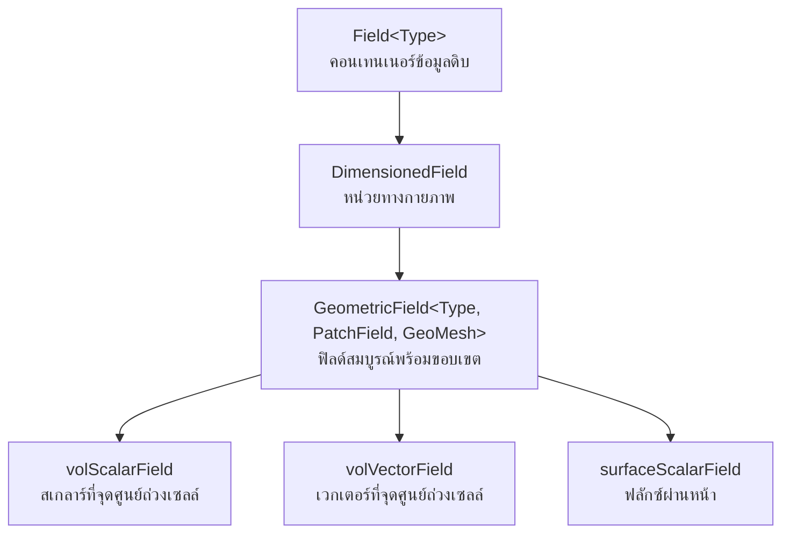

# Geometric Fields: หัวใจสำคัญของการแสดงข้อมูล CFD

**Geometric fields** ใน OpenFOAM เป็นโครงสร้างข้อมูลพื้นฐานสำหรับการแสดงปริมาณทางกายภาพที่นิยามบน mesh คำนวณ ฟิลด์เหล่านี้เป็นกระดูกสันหลังของการจำลอง CFD ใดๆ โดยให้กรอบการทำงานสำหรับการจัดเก็บ จัดการ และเข้าถึงปริมาณสเกลาร์ เวกเตอร์ และเทนเซอร์ทั่วทั้งโดเมน


> **Figure 1:** แผนผังลำดับชั้นการสืบทอดของคลาสฟิลด์ใน OpenFOAM แสดงความเชื่อมโยงตั้งแต่คอนเทนเนอร์ข้อมูลดิบไปจนถึงฟิลด์เรขาคณิตที่สมบูรณ์พร้อมข้อมูลขอบเขตความปลอดภัยทางฟิสิกส์ไม่ส่งผลกระทบต่อความเร็วในการจำลอง ผ่านการใช้พลังของ C++ Template Metaprogramming ในการตรวจสอบความสอดคล้องทางมิติทั้งหมดที่ขั้นตอนการคอมไพล์โปรแกรมเพียงครั้งเดียว

---

## ประเภทและการจำแนกฟิลด์

OpenFOAM ใช้งานลำดับชั้นฟิลด์ที่ครอบคลุมซึ่งจำแนกฟิลด์ตามธรรมชาติทางคณิตศาสตร์ (สเกลาร์, เวกเตอร์, เทนเซอร์) และตำแหน่งเชิงพื้นที่ (จุดศูนย์ถ่วงของเซลล์, จุดศูนย์ถ่วงของหน้า, จุดศูนย์ถ่วงของจุด)

### ฟิลด์จุดศูนย์ถ่วงของเซลล์ (Cell-Centered Fields)

**Cell-centered fields** จัดเก็บค่าที่จุดศูนย์ถ่วงทางเรขาคณิตของเซลล์คำนวณ ทำให้เหมาะสำหรับการ discretization แบบ finite volume:

| ประเภทฟิลด์ | การใช้งาน | ตัวอย่างปริมาณ |
|-------------|-------------|-----------------|
| `volScalarField` | จัดเก็บปริมาณสเกลาร์ | ความดัน, อุณหภูมิ, ความเข้มข้นของชนิด |
| `volVectorField` | จัดเก็บปริมาณเวกเตอร์ | ความเร็ว, โมเมนตัม, การกระจัด |
| `volTensorField` | จัดเก็บเทนเซอร์อันดับสอง | เทนเซอร์ความเครียด, ฟลักซ์โมเมนตัม |
| `volSymmTensorField` | จัดเก็บเทนเซอร์สมมาตร | เทนเซอร์อัตราการไหล, ความเครียด Reynolds |

### ฟิลด์ผิว (Surface Fields)

**Surface fields** ถูกนิยามบนหน้า mesh และเป็นสิ่งสำคัญสำหรับการคำนวณฟลักซ์:

| ประเภทฟิลด์ | การใช้งาน | ตัวอย่างปริมาณ |
|-------------|-------------|-----------------|
| `surfaceScalarField` | ปริมาณฟลักซ์แนวตั้งหน้า | ฟลักซ์มวล, ฟลักซ์ความร้อน |
| `surfaceVectorField` | เวกเตอร์หน้า | เวกเตอร์พื้นที่, ความเร็วหน้า |

---

## สถาปัตยกรรม Geometric Field

### การประกอบฟิลด์

**Geometric field** ใน OpenFOAM ประกอบด้วยส่วนประกอบหลักหลายส่วน:

```cpp
template<class Type>
class GeometricField
{
    // Core data
    DimensionedField<Type, volMesh> internalField_;  // ค่าจุดศูนย์ถ่วงของเซลล์
    Field<Type> boundaryField_;                      // ค่าเงื่อนไขขอบเขต

    // Geometric information
    const fvMesh& mesh_;                            // อ้างอิงถึง mesh คำนวณ
    const word& name_;                              // ชื่อฟิลด์สำหรับการระบุตัวตน

    // Temporal characteristics
    const dimensionSet& dimensions_;                // มิติทางกายภาพ
    const wordList& boundaryTypes_;                 // ประเภทเงื่อนไขขอบเขต
};
```

### ความสม่ำเสมอของมิติ

OpenFOAM ใช้ระบบวิเคราะห์มิติที่ซับซ้อนเพื่อให้แน่ใจว่ามีความสม่ำเสมอทางกายภาพ:

```cpp
dimensionSet dimensions
(
    massExponent,      // kg
    lengthExponent,    // m
    timeExponent,      // s
    temperatureExponent, // K
    molExponent,       // mol
    currentExponent    // A
);

// Example: velocity dimensions [L/T]
dimensionSet velocityDims(0, 1, -1, 0, 0, 0);

// Example: pressure dimensions [M/(L·T²)]
dimensionSet pressureDims(1, -1, -2, 0, 0, 0);
```

---

## การสร้างและการเริ่มต้นฟิลด์

### การลงทะเบียนฟิลด์อัตโนมัติ

ฟิลด์มักจะถูกลงทะเบียนกับฐานข้อมูล mesh สำหรับ time-stepping อัตโนมัติ:

```cpp
// Pressure field creation
volScalarField p
(
    IOobject
    (
        "p",                      // Field name
        runTime.timeName(),       // Time directory
        mesh,                     // Reference to mesh
        IOobject::MUST_READ,      // Read from file
        IOobject::AUTO_WRITE      // Write to file automatically
    ),
    mesh
);

// Velocity field with initial conditions
volVectorField U
(
    IOobject
    (
        "U",
        runTime.timeName(),
        mesh,
        IOobject::MUST_READ,
        IOobject::AUTO_WRITE
    ),
    mesh,
    dimensionedVector("U", dimVelocity, vector(1.0, 0.0, 0.0))  // Initial uniform field
);
```

### การแปลและการสร้างฟิลด์ขึ้นใหม่

OpenFOAM ให้การแปลที่ซับซ้อนสำหรับการแปลงระหว่างการแสดงฟิลด์ที่แตกต่างกัน:

```cpp
// Linear interpolation from cell to face centers
surfaceScalarField phi = fvc::interpolate(U) & mesh.Sf();

// Reconstruction from face to cell centers
volVectorField U_reconstructed = fvc::reconstruct(phi);
```

---

## การดำเนินการทางคณิตศาสตร์บนฟิลด์

### พีชคณิตฟิลด์

OpenFOAM โอเวอร์โหลดตัวดำเนินการทางคณิตศาสตร์สำหรับการดำเนินการฟิลด์ที่เข้าใจง่าย:

```cpp
// Vector operations
volVectorField a = U1 + U2;           // Vector addition
volScalarField magU = mag(U);          // Vector magnitude
volVectorField gradP = fvc::grad(p);   // Pressure gradient

// Tensor operations
volTensorField stress = mu * gradU;    // Stress tensor
volScalarField divergence = tr(gradU); // Trace (divergence)
```

### ตัวดำเนินการเชิงอนุพันธ์

การใช้งาน finite volume method ให้ตัวดำเนินการเชิงอนุพันธ์ที่ครอบคลุม:

$$\nabla \cdot (\rho \mathbf{U}) = \text{fvc::div(phi)}$$

- **`rho`** - ความหนาแน่น (density)
- **`U`** - เวกเตอร์ความเร็ว (velocity vector)
- **`phi`** - ฟลักซ์มวล (mass flux)
- **`fvc::div()`** - ตัวดำเนินการ divergence

```cpp
// Divergence operator
surfaceScalarField phi = rho * fvc::interpolate(U) & mesh.Sf();
volScalarField divPhi = fvc::div(phi);

// Gradient operator
volVectorField gradP = fvc::grad(p);

// Laplacian operator
volScalarField laplacianU = fvc::laplacian(nu, U);

// Temporal derivative
volScalarField dUdt = fvc::ddt(U);
```

---

## การบูรณาการเงื่อนไขขอบเขต

### ขอบเขต Geometric Field

เงื่อนไขขอบเขตถูกผสานเข้ากับ geometric fields อย่างใกล้ชิด:

```cpp
class GeometricBoundaryField
{
    // Boundary field access
    const wordList& types() const;      // BC type names
    const FieldField<Field, Type>& boundaryField() const;

    // Individual boundary patch access
    const Field<Type>& operator[](const label patchi) const;
    Field<Type>& operator[](const label patchi);
};
```

### การอัปเดตขอบเขตแบบไดนามิก

```cpp
// Apply boundary conditions
U.correctBoundaryConditions();
p.correctBoundaryConditions();

// Non-orthogonal correction for gradient calculation
volVectorField gradP = fvc::grad(p, "gradP" + p.name());
```

---

## การดำเนินการฟิลด์ขั้นสูง

### การแม็ปฟิลด์และการแปลง

OpenFOAM ให้ความสามารถในการแม็ปฟิลด์ที่ซับซ้อน:

```cpp
// Mesh-to-mesh interpolation
meshToMesh interpolator(sourceMesh, targetMesh);
volScalarField targetField = interpolator.interpolate(sourceField);

// Coordinate transformations
volVectorField rotatedU = transform(rotationTensor, U);
volTensorField principalStress = eigenVectors(stressTensor);
```

### การรวมฟิลด์และสถิติ

```cpp
// Volume-weighted averages
scalar avgPressure = sum(p * mesh.V()) / sum(mesh.V());

// Field minima and maxima
scalar maxVelocity = max(mag(U)).value();
scalar minTemperature = min(T).value();

// Root mean square calculations
scalar urms = sqrt(sum(magSqr(U)) / mesh.nCells());
```

---

## การจัดการหน่วยความจำและประสิทธิภาพ

### การนับรีเฟอเรนซ์

OpenFOAM ใช้พอยน์เตอร์ที่นับรีเฟอเรนซ์สำหรับการจัดการหน่วยความจำที่มีประสิทธิภาพ:

```cpp
tmp<volScalarField> tT(new volScalarField(IOobject(...), mesh));
volScalarField& T = tT();  // Automatic reference management
```

### การบีบอัดฟิลด์และการเพิ่มประสิทธิภาพการจัดเก็บ

```cpp
// Compact storage for sparse fields
volScalarField::Internal& internalField = field.ref();

// Parallel communication reduction
reduce(maxValue, maxOp<scalar>());
```

---

## การดีบักและการแสดงภาพฟิลด์

### การตรวจสอบฟิลด์

```cpp
// Check for numerical issues
if (mag(p).value() > 1e6)
{
    WarningIn("GeometricField validation")
        << "Pressure field has excessive magnitude: " << max(mag(p)) << endl;
}

// Verify field bounds
p.minMax(minP, maxP);
```

### การจัดรูปแบบเอาต์พุต

```cpp
// Custom field output for debugging
Info << "Field statistics for " << U.name() << nl
     << "  min: " << min(mag(U)).value() << nl
     << "  max: " << max(mag(U)).value() << nl
     << "  avg: " << sum(mag(U) * mesh.V()).value() / sum(mesh.V()).value() << nl;
```

---

## ประเภทฟิลด์เฉพาะ

### ฟิลด์เฟส (หลายเฟส)

```cpp
// Volume fraction fields for multiphase flow
volScalarField alpha1
(
    IOobject("alpha1", runTime.timeName(), mesh, IOobject::READ_IF_PRESENT),
    mesh,
    dimensionedScalar("alpha1", dimless, 1.0)
);

// Phase-weighted fields
volScalarField rhoMix = alpha1 * rho1 + (1.0 - alpha1) * rho2;
```

### ฟิลด์คุณสมบัติทางความร้อน

```cpp
// Temperature-dependent material properties
volScalarField k = k0 * pow(T/T0, kExp);
volScalarField mu = mu0 * pow(T/T0, muExp) * pow(P/P0, muExpP);
```

---

## สถาปัตยกรรมเทมเพลตและการสืบทอด

### เทมเพลต `GeometricField`

ที่หัวใจของระบบฟิลด์ของ OpenFOAM มีเทมเพลต `GeometricField`:

```cpp
template<class Type, template<class> class PatchField, class GeoMesh>
class GeometricField : public DimensionedField<Type, GeoMesh>
```

พารามิเตอร์เทมเพลตทั้งสามนี้สร้างระบบข้อกำหนดที่สมบูรณ์:

| พารามิเตอร์ | ความหมายทางกายภาพ | ค่าเทียบเท่า CFD | ตัวอย่าง |
|-----------|------------------|----------------|---------|
| `Type` | **สิ่งที่** เราวัด | ชนิดข้อมูลฟิลด์ | `scalar` (อุณหภูมิ), `vector` (ความเร็ว) |
| `PatchField` | **วิธี** ขอบเขตมีพฤติกรรม | ชนิดเงื่อนไขขอบเขต | `fvPatchField` (ปริมาตรจำกัด), `pointPatchField` (จุด) |
| `GeoMesh` | **ตำแหน่งที่** การวัดอยู่ | ชนิดเรขาคณิตเมช | `volMesh` (เซลล์), `surfaceMesh` (หน้า), `pointMesh` (จุด) |

### ลำดับชั้นการสืบทอด

```cpp
Field<Type> (คอนเทนเนอร์ข้อมูลดิบ)
    ↑
regIOobject (ความสามารถ I/O)
    ↑
DimensionedField<Type, GeoMesh> (หน่วยทางกายภาพ + การอ้างอิงเมช)
    ↑
GeometricField<Type, PatchField, GeoMesh> (ฟิลด์สมบูรณ์พร้อมขอบเขต)
```

### นามแฝงชนิด (Type Aliases)

OpenFOAM ให้ชุดนามแฝงชนิดที่หลากหลายซึ่งทำให้การประกาศฟิลด์เป็นไปอย่างเป็นธรรมชาติ:

```cpp
// Finite Volume Fields - จุดศูนย์ถ่วงเซลล์
typedef GeometricField<scalar, fvPatchField, volMesh> volScalarField;
typedef GeometricField<vector, fvPatchField, volMesh> volVectorField;
typedef GeometricField<tensor, fvPatchField, volMesh> volTensorField;

// Surface Fields - จุดศูนย์ถ่วงหน้า
typedef GeometricField<scalar, fvsPatchField, surfaceMesh> surfaceScalarField;
typedef GeometricField<vector, fvsPatchField, surfaceMesh> surfaceVectorField;

// Point Fields - จุดศูนย์ถ่วงจุด
typedef GeometricField<scalar, pointPatchField, pointMesh> pointScalarField;
typedef GeometricField<vector, pointPatchField, pointMesh> pointVectorField;
```

---

## การจัดการหน่วยความจำและเวลา

### โครงสร้างข้อมูลหลัก

```cpp
template<class Type, template<class> class PatchField, class GeoMesh>
class GeometricField {
private:
    // Time management for temporal schemes
    mutable label timeIndex_;                    // Current time index
    mutable GeometricField* field0Ptr_;          // Pointer to field at previous time step
    mutable GeometricField* fieldPrevIterPtr_;   // Pointer to field from previous iteration

    // Boundary condition management
    Boundary boundaryField_;                     // GeometricBoundaryField containing all patches

    // Inherited from DimensionedField<Type, GeoMesh>:
    // const Mesh& mesh_                         // Reference to underlying mesh
    // dimensionSet dimensions_                  // Physical dimensions
    // Field<Type> data_                         // Actual data storage
};
```

### การจัดการเวลา

```cpp
void GeometricField::storeOldTime() {
    if (!field0Ptr_) {
        field0Ptr_ = new GeometricField(*this);  // Copy current field
    }
}

scalarField ddt = (p - p.oldTime())/runTime.deltaT();  // ∂p/∂t ≈ Δp/Δt
```

---

## รูปแบบการออกแบบที่สำคัญ

### Template Metaprogramming

OpenFOAM ใช้ template metaprogramming อย่างกว้างขวางสำหรับ:

- **ความปลอดภัยของประเภท**: การดำเนินการที่ไม่มีความหมายทางฟิสิกส์จะเป็น compiler error
- **ประสิทธิภาพ**: คอมไพเลอร์สร้าง code ที่เพิ่มประสิทธิภาพสำหรับแต่ละชุดประเภทเฉพาะ
- **การแสดงออก**: Code อ่านง่ายเป็นนิพจน์ทางคณิตศาสตร์โดยยังคงการตรวจสอบประเภทอย่างเข้มงวด

### RAII (Resource Acquisition Is Initialization)

```cpp
template<class T>
class autoPtr {
private:
    T* ptr_;
public:
    explicit autoPtr(T* p = nullptr) : ptr_(p) {}
    ~autoPtr() { delete ptr_; }  // Automatic cleanup
};

template<class T>
class tmp {
private:
    mutable T* ptr_;
    mutable bool refCount_;
public:
    tmp(T* p, bool transfer = true) : ptr_(p), refCount_(!transfer) {}
    ~tmp() {
        if (ptr_ && !refCount_) delete ptr_;
    }
};
```

### Policy-Based Design

พารามิเตอร์เทมเพลต `PatchField` ใช้การออกแบบตามนโยบาย:

```cpp
template<template<class> class PatchField, class GeoMesh>
class GeometricField {
    // Core field operations independent of boundary treatment
    // Boundary behavior delegated to PatchField<Type> policy
};
```

---

## ปฏิสัมพันธ์กับ Mesh

### การออกแบบแบบ Reference-Based

`GeometricField` objects เก็บการอ้างอิงไปยัง mesh:

```cpp
const fvMesh& mesh = p.mesh();  // Access underlying mesh

// Mesh-aware operations
const vectorField& cellCenters = mesh.C();  // Cell center coordinates
const scalarField& cellVolumes = mesh.V();  // Cell volumes

// Field interpolation uses mesh geometry
surfaceScalarField phi = linearInterpolate(U) & mesh.Sf();  // Flux
```

### ประโยชน์ของ Reference-Based Design

| คุณสมบัติ | คำอธิบาย | ประโยชน์ |
|------------|------------|------------|
| **ประสิทธิภาพหน่วยความจำ** | ฟิลด์หลายฟิลด์อ้างอิง mesh เดียวกันได้ | ลดการใช้หน่วยความจำอย่างมีนัยสำคัญ |
| **การรับประกันการซิงโครไนซ์** | ฟิลด์อ้างอิง mesh มากกว่าการคัดลอก | การปรับเปลี่ยน mesh สะท้อนโดยอัตโนมัติ |
| **ความเข้ากันได้แบบขนาน** | ข้อมูลฟิลด์ตาม mesh partitioning โดยธรรมชาติ | รองรับ domain decomposition ราบรื่น |

---

## สรุป

ระบบฟิลด์ที่ครอบคลุมนี้ช่วยให้ OpenFOAM สามารถจัดการปัญหา CFD ที่ซับซ้อนด้วย:

- ==ความสามารถในการแสดงข้อมูล== ที่หลากหลายสำหรับสเกลาร์, เวกเตอร์ และเทนเซอร์
- ==การจัดการเงื่อนไขขอบเขต== ที่ยืดหยุ่นผ่านสถาปัตยกรรม Policy-Based
- ==ความปลอดภัยของมิติ== ในเวลาคอมไพล์ผ่านระบบ dimensional analysis
- ==ประสิทธิภาพการคำนวณ== สูงผ่าน template metaprogramming และ expression templates
- ==การจัดการหน่วยความจำ== อัตโนมัติผ่าน RAII และ smart pointers

ซึ่งเป็นพื้นฐานที่จำเป็นสำหรับความแม่นยำของการจำลองเชิงตัวเลขและประสิทธิภาพการคำนวณ
