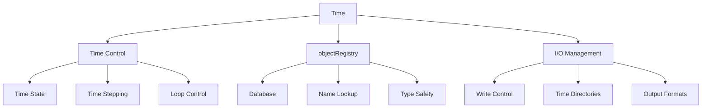
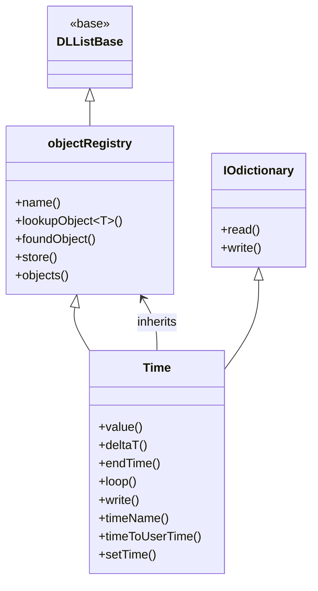

# Time & Databases - Overview

> **Module Strategy Note:** This module has been restructured to eliminate redundancy. File 01 content (basics) has been merged into this overview. Files 02 and 05 have been combined (architecture+patterns). Field-specific content from File 04 has been moved to the GeometricFields module. The module now follows a clear progression: fundamentals → architecture → registry → patterns → runtime issues.

---

## Learning Objectives

By the end of this module, you will be able to:

1. **Understand** the Time class's dual role as simulation controller and object registry
2. **Navigate** the Time class hierarchy and its relationship with objectRegistry
3. **Implement** time loops with proper write control and time stepping
4. **Utilize** the object registry for field lookup and management
5. **Apply** design patterns (tmp, oldTime fields) in custom solvers
6. **Diagnose** and fix common runtime issues related to time and databases

---

## Key Takeaways

- **Time = Controller + Database**: Manages time progression AND stores simulation objects
- **objectRegistry**: Enables lookup of any registered object by name and type
- **Time loop pattern**: `while (runTime.loop())` is the standard simulation control structure
- **Write control**: Automatic scheduling based on writeInterval, writeFormat
- **Design patterns**: `tmp<T>` for temporary fields, `oldTime()` for time derivatives
- **Common pitfalls**: Registry lookup failures, time step inconsistencies, write conflicts

---

## What: Time & Databases in OpenFOAM

### The Dual Role

The `Time` class serves two fundamental purposes in OpenFOAM simulations:

| Role | Responsibility | Key Operations |
|------|----------------|----------------|
| **Time Controller** | Manages temporal progression | `value()`, `deltaT()`, `loop()`, `write()` |
| **Object Registry** | Stores simulation objects | `lookupObject()`, `foundObject()`, `store()` |

### Architecture Overview



### Time Class Hierarchy



---

## Why: The Importance of Time & Databases

### 1. Central Simulation Control

The `Time` class is the **heartbeat** of every OpenFOAM simulation:

```cpp
// This simple loop controls everything
while (runTime.loop()) {
    solve(fvm::ddt(U) + fvm::div(phi, U) == -fvc::grad(p));
    runTime.write();
}
```

**Why this matters:**
- **Single source of truth** for simulation time state
- **Automatic time directory management** (0/, 0.1/, 0.2/, ...)
- **Coordinated output** across all fields and objects

### 2. Dynamic Object Access

The object registry enables **runtime polymorphism**:

```cpp
// Lookup any field by name - no compile-time coupling
const volScalarField& T = mesh.lookupObject<volScalarField>("T");
const volVectorField& U = mesh.lookupObject<volVectorField>("U");

// Works with ANY registered type
const IOobject& config = runTime.lookupObject<IOobject>("solverDict");
```

**Why this matters:**
- **Decouples code**: Boundary conditions can lookup fields without direct references
- **Enables extensibility**: Add new fields without modifying existing code
- **Runtime flexibility**: Load objects dynamically based on configuration

### 3. Write Coordination

Centralized write control ensures **consistent snapshots**:

```cpp
runTime.write();  // Writes ALL registered objects at once
```

**Why this matters:**
- **Synchronization**: All fields written at same time instance
- **Efficiency**: Automatic batch writing, directory creation
- **Reproducibility**: Consistent checkpoint/restart behavior

---

## How: Basic Usage Patterns

### Time Creation and Loop

```cpp
// Standard creation (createTime.H)
Foam::Time runTime(Foam::Time::controlDictName, args);

// Time loop pattern
while (runTime.loop()) {
    Info << "Time = " << runTime.timeName() << nl;
    
    // Solve equations
    #include "UEqn.H"
    
    // Write outputs (controlled by writeInterval)
    runTime.write();
}
```

### Object Registry Operations

```cpp
// Registration (automatic for IOobjects)
volScalarField T
(
    IOobject("T", runTime.timeName(), mesh, IOobject::MUST_READ),
    mesh
);

// Lookup
const volScalarField& T = mesh.lookupObject<volScalarField>("T");

// Safe lookup
if (mesh.foundObject<volScalarField>("T")) {
    const volScalarField& T = mesh.lookupObject<volScalarField>("T");
}

// Iterate all objects
const objectRegistry& reg = mesh;
forAll(reg.sortedNames(), i) {
    Info << reg.sortedNames()[i] << nl;
}
```

### Common Time Operations

```cpp
// Time information
scalar currentTime = runTime.value();           // Current time
scalar dt = runTime.deltaT().value();          // Time step
scalar endT = runTime.endTime().value();       // End time
word timeName = runTime.timeName();            // Directory name

// Time control
runTime.setDeltaT(0.001);                       // Set time step
runTime.setEndTime(10.0);                       // Set end time

// Write control
bool written = runTime.write();                 // Write if scheduled
runTime.writeNow();                             // Force write
```

---

## Module Structure

This module follows a progressive skill-building sequence:

| File | Focus | Key Skills |
|------|-------|------------|
| **00_Overview** | This file | Big picture, basic usage |
| **01_Introduction** *(merged here)* | Basic concepts | Time creation, simple loops |
| **02_Time_Architecture** | Internal design | Class structure, state management |
| **03_Object_Registry** | Field management | Lookup, registration, patterns |
| **04_Functional_Logic** | Callbacks | Function objects, cloud integration |
| **05_Design_Patterns** | Advanced patterns | tmp, oldTime, time integration |
| **06_Runtime_Issues** | Troubleshooting | Common errors, debugging |
| **07_** | Hands-on challenges | Practical exercises |

**Note:** File 01 (Introduction) content has been merged into this overview. File 04 has been refactored to focus on functional logic and callbacks, with field-specific content moved to the GeometricFields module.

---

## Quick Reference

### Time State Queries

| Need | Method | Returns |
|------|--------|---------|
| Current time | `runTime.value()` | `scalar` |
| Time step | `runTime.deltaT().value()` | `scalar` |
| End time | `runTime.endTime().value()` | `scalar` |
| Time name | `runTime.timeName()` | `word` |
| Time index | `runTime.timeIndex()` | `label` |

### Loop Control

| Need | Method | Behavior |
|------|--------|----------|
| Standard loop | `runTime.loop()` | Increments time, returns true while running |
| Manual advance | `runTime++` | Increment time by deltaT |
| Check end | `runTime.run()` | True if time < endTime |

### Write Operations

| Need | Method | Behavior |
|------|--------|----------|
| Scheduled write | `runTime.write()` | Writes if writeInterval reached |
| Force write | `runTime.writeNow()` | Writes immediately |
| Check time | `runTime.outputTime()` | True if this is a write time |

### Registry Operations

| Need | Method | Template |
|------|--------|----------|
| Lookup object | `reg.lookupObject<T>()` | Returns const reference |
| Check exists | `reg.foundObject<T>()` | Returns bool |
| Store object | `reg.store(ptr)` | Takes autoPtr |
| List names | `reg.sortedNames()` | Returns List<word> |

---

## Concept Check

<details>
<summary><b>1. What is the dual role of the Time class?</b></summary>

The Time class serves as both:
1. **Time Controller**: Manages `deltaT`, `endTime`, and the simulation loop
2. **Object Registry**: Inherits from `objectRegistry` to store and provide lookup of simulation objects by name

This dual role makes Time the central coordination point for all simulation operations.
</details>

<details>
<summary><b>2. How does runTime.loop() work?</b></summary>

`runTime.loop()` performs three operations:
1. **Increments time** by `deltaT`
2. **Updates time name** (directory name)
3. **Returns true** if `time < endTime`, false otherwise

This single method handles the entire time progression logic in a standard OpenFOAM solver.
</details>

<details>
<summary><b>3. What is the purpose of objectRegistry?</b></summary>

`objectRegistry` is a **database** that:
- Stores registered `IOobject`-derived objects
- Enables **runtime lookup** by name and type
- Provides **type-safe access** via templates
- Supports **iteration** over all registered objects

This enables boundary conditions, function objects, and utilities to access fields without compile-time dependencies.
</details>

<details>
<summary><b>4. When would you use lookupObject vs direct reference?</b></summary>

**Use `lookupObject` when:**
- Writing generic/reusable code (boundary conditions, function objects)
- Field names are configured at runtime
- Decoupling components is important

**Use direct reference when:**
- Field is always present and required
- Performance is critical (avoids lookup overhead)
- Writing solver-specific code where coupling is intentional
</details>

<details>
<summary><b>5. What is the relationship between Time and objectRegistry?</b></summary>

`Time` **inherits from** `objectRegistry`:

```cpp
class Time : public IOdictionary, public objectRegistry
```

This means:
- Time **is an** objectRegistry (has all registry methods)
- Time also **is an** IOdictionary (reads controlDict)
- `runTime.lookupObject<T>()` works because Time is a registry
- The mesh also inherits from objectRegistry, so both work the same way
</details>

---

## Related Documentation

- **Time Architecture**: [02_Time_Architecture.md](02_Time_Architecture.md) - Internal design and state management
- **Object Registry**: [03_Object_Registry.md](03_Object_Registry.md) - Field lookup and registration patterns
- **Design Patterns**: [05_Design_Patterns.md](05_Design_Patterns.md) - tmp, oldTime, and time integration
- **Runtime Issues**: [06_Runtime_Issues.md](06_Runtime_Issues.md) - Common errors and debugging