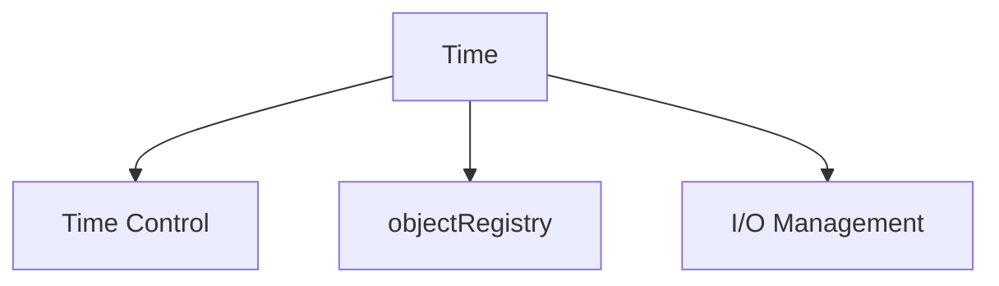

# Time & Databases - Overview

ภาพรวม Time และ Object Registry — ศูนย์กลางการควบคุม simulation

> **ทำไม Time & Databases สำคัญ?**
> - **Time class ควบคุมทุกอย่าง** — deltaT, write, loop
> - **Object Registry** = วิธี lookup fields by name
> - เข้าใจ Time = เขียน custom solver ได้

---

## Overview

> **💡 Time = Controller + Database**
>
> - **Controller:** deltaT, endTime, loop()
> - **Database:** objectRegistry สำหรับ lookup fields



---

## 1. Time Class Roles

| Role | Description |
|------|-------------|
| **Time control** | deltaT, endTime, loop |
| **Object registry** | Store/lookup fields |
| **Write control** | When to output |
| **Directory management** | Time directories |

---

## 2. Basic Usage

```cpp
// Standard creation
#include "createTime.H"

// Time loop
while (runTime.loop())
{
    Info << "Time = " << runTime.timeName() << endl;

    // Solve equations...

    runTime.write();  // Write if scheduled
}
```

---

## 3. Key Methods

| Method | Returns |
|--------|---------|
| `value()` | Current time (scalar) |
| `deltaT()` | Time step |
| `timeName()` | Time as string |
| `endTime()` | End time |
| `loop()` | Continue loop? |
| `write()` | Write outputs |

---

## 4. Object Registry

```cpp
// Fields auto-registered
volScalarField T(..., mesh, ...);

// Lookup
const volScalarField& T = mesh.lookupObject<volScalarField>("T");

// Check existence
if (mesh.foundObject<volScalarField>("T")) { ... }
```

---

## 5. Module Contents

| File | Topic |
|------|-------|
| 01_Introduction | Basics |
| 02_Time_Architecture | Structure |
| 03_Object_Registry | Field management |
| 04_Functional_Logic | Callbacks |
| 05_Design_Patterns | tmp, old time |
| 06_Pitfalls | Common errors |
| 07_Summary | Exercises |

---

## Quick Reference

| Need | Method |
|------|--------|
| Current time | `runTime.value()` |
| Time step | `runTime.deltaT().value()` |
| Time name | `runTime.timeName()` |
| Write | `runTime.write()` |
| Lookup field | `mesh.lookupObject<T>("name")` |

---

## 🧠 Concept Check

<details>
<summary><b>1. objectRegistry คืออะไร?</b></summary>

**Database** ที่เก็บ registered objects — ทำให้ lookup by name ได้
</details>

<details>
<summary><b>2. runTime.loop() ทำอะไร?</b></summary>

**Advance time** และ return true ถ้ายังไม่ถึง endTime
</details>

<details>
<summary><b>3. timeName() ใช้ทำอะไร?</b></summary>

**Directory name** สำหรับ time step (e.g., "0.001", "1")
</details>

---

## 📖 เอกสารที่เกี่ยวข้อง

- **Introduction:** [01_Introduction.md](01_Introduction.md)
- **Object Registry:** [03_Object_Registry.md](03_Object_Registry.md)