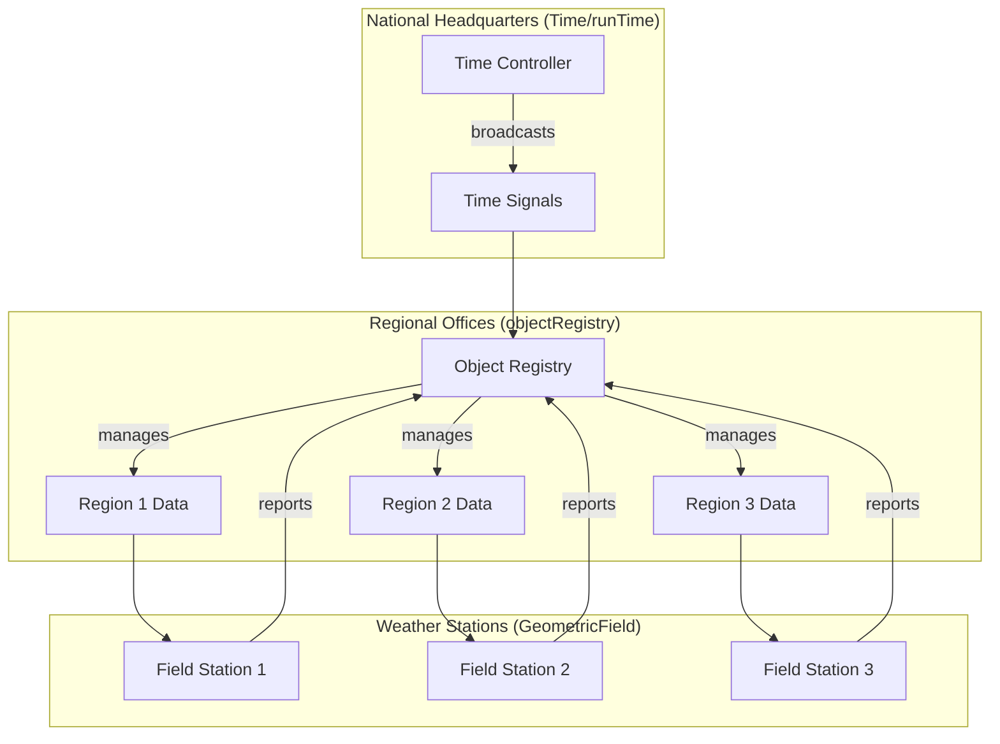
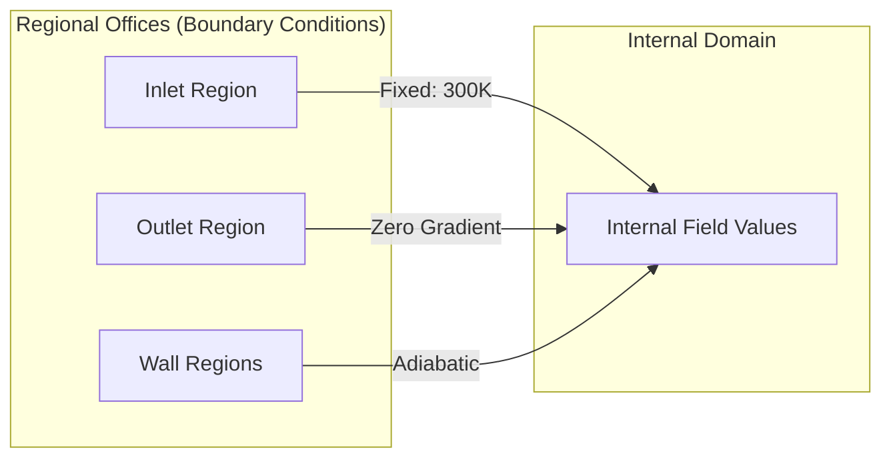
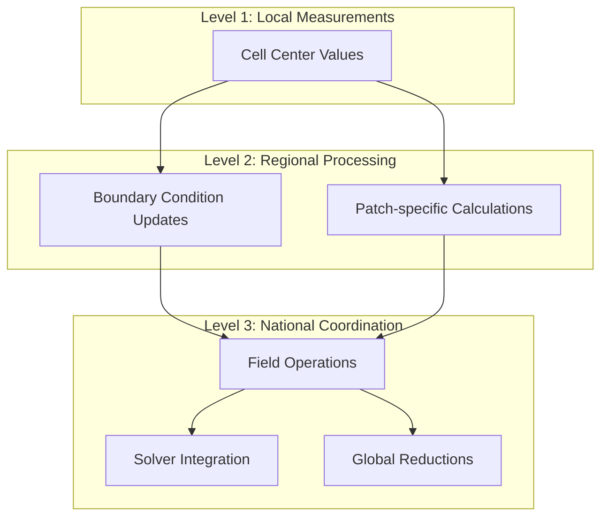

# Introduction to Time and Database Systems

> [!INFO] Overview
> This module explores the **Time** class and **objectRegistry** system — OpenFOAM's central data management infrastructure that coordinates temporal evolution and object storage throughout CFD simulations.

---

## 🌡️ Hook: The "Weather Station Network" Analogy

Imagine you are establishing a **national weather monitoring system**. You need to measure temperature across the entire country:

- **Individual weather stations** measure temperature at specific locations
- **Regional offices** aggregate data and manage local boundaries
- **National headquarters** coordinates everything and guarantees data consistency
- **Measurement units** (Celsius vs Fahrenheit) must be tracked to prevent errors


> **Figure 1:** อุปมาเปรียบเทียบระบบการจัดการข้อมูลของ OpenFOAM กับเครือข่ายสถานีตรวจอากาศระดับชาติ ซึ่งแสดงให้เห็นถึงการประสานงานระหว่างส่วนควบคุมกลาง สำนักงานภูมิภาค และสถานีตรวจวัดในพื้นที่ความปลอดภัยทางฟิสิกส์ไม่ส่งผลกระทบต่อความเร็วในการจำลอง ผ่านการใช้พลังของ C++ Template Metaprogramming ในการตรวจสอบความสอดคล้องทางมิติทั้งหมดที่ขั้นตอนการคอมไพล์โปรแกรมเพียงครั้งเดียว

## 📊 Mapping to OpenFOAM Architecture

OpenFOAM's `GeometricField` is the **weather station network** for CFD data:

| Weather Station | OpenFOAM Field | Description |
|-----------------|----------------|-------------|
| Individual measurement point | `Field<Type>` | Raw data |
| Calibrated station | `DimensionedField` | With physical dimensions |
| Complete network | `GeometricField` | With boundary conditions |
| Temperature monitoring | `volScalarField` | Scalar values on mesh |
| Geographic map | `fvMesh` | Defines station locations |

**Real-world analogy**: Think of `GeometricField` as a **smart city infrastructure**:

- **Data pipes** (`Field`) transmit raw measurements
- **Unit converters** (`dimensionSet`) guarantee consistency
- **Zone managers** (`boundaryField`) handle local conditions
- **City map** (`fvMesh`) defines spatial layout

## 💻 Technical Implementation

The weather station analogy maps directly to OpenFOAM's field architecture:

```cpp
// Individual weather station = Field<Type>
Field<scalar> temperatureAtStation;

// Calibrated station with unit tracking = DimensionedField<scalar>
DimensionedField<scalar, volMesh> calibratedTemperature(
    "T",
    dimensionSet(0, 0, 0, 1, 0, 0, 0),  // Temperature dimensions [K]
    temperatureValues
);

// Complete weather network = GeometricField
GeometricField<scalar, fvPatchField, volMesh> temperatureField(
    IOobject("T", runTime.timeName(), mesh, IOobject::MUST_READ),
    mesh
);
```

## 🧮 Mathematical Foundation

The field network spans a discretized computational domain $\Omega$:

$$\mathbf{u}(\mathbf{x},t) = \sum_{i=1}^{N} \mathbf{u}_i(t) \phi_i(\mathbf{x})$$

**Mathematical variables:**
- $\mathbf{u}_i(t)$ = Weather station measurement at position $\mathbf{x}_i$
- $\phi_i(\mathbf{x})$ = Interpolation basis function (network communication)
- $N$ = Total number of measurement points

## 🏢 Boundary Conditions as Regional Offices

Just as weather regional offices manage geographic boundaries with different conditions:

```cpp
temperatureField.boundaryField()[0] == fixedValueFvPatchField<scalar>(
    temperatureField.boundaryField()[0],
    300.0  // Constant temperature at inlet (Celsius)
);

temperatureField.boundaryField()[1] == zeroGradientFvPatchField<scalar>(
    temperatureField.boundaryField()[1]  // No temperature change at outlet
);
```


> **Figure 2:** การจัดการเงื่อนไขขอบเขตเสมือนสำนักงานภูมิภาคที่ควบคุมพฤติกรรมของข้อมูลในแต่ละโซนของโดเมนการคำนวณความปลอดภัยทางฟิสิกส์ไม่ส่งผลกระทบต่อความเร็วในการจำลอง ผ่านการใช้พลังของ C++ Template Metaprogramming ในการตรวจสอบความสอดคล้องทางมิติทั้งหมดที่ขั้นตอนการคอมไพล์โปรแกรมเพียงครั้งเดียว

## 🔗 Mesh Integration

The `fvMesh` provides the geometric framework:

```cpp
fvMesh mesh(
    IOobject(
        "region0",
        runTime.timeName(),
        runTime,
        IOobject::MUST_READ
    )
);
```

**This mesh defines:**
- **Station positions** (cell centers)
- **Communication paths** (face connections)
- **Regional boundaries** (patch definitions)

## 🔄 Data Flow Architecture

The weather station analogy extends to data flow:

### Data Flow Stages:
1. **Measurement collection**: Field values at cell centers
2. **Regional processing**: Boundary condition calculations
3. **National coordination**: Global field operations and solver integration

```cpp
// Local measurements
scalarField& T = temperatureField.primitiveFieldRef();

// Regional boundary conditions
forAll(temperatureField.boundaryField(), patchI)
{
    fvPatchScalarField& patchT = temperatureField.boundaryFieldRef()[patchI];
    patchT.updateCoeffs();
}

// National coordination
fvScalarMatrix TEqn(
    fvm::ddt(T) + fvm::div(phi, T) - fvm::laplacian(DT, T) == source
);
TEqn.solve();
```


> **Figure 3:** สถาปัตยกรรมการไหลของข้อมูลสามระดับ ตั้งแต่การวัดค่าในพื้นที่ การประมวลผลระดับภูมิภาค ไปจนถึงการประสานงานระดับชาติผ่านตัวแก้ปัญหาความปลอดภัยทางฟิสิกส์ไม่ส่งผลกระทบต่อความเร็วในการจำลอง ผ่านการใช้พลังของ C++ Template Metaprogramming ในการตรวจสอบความสอดคล้องทางมิติทั้งหมดที่ขั้นตอนการคอมไพล์โปรแกรมเพียงครั้งเดียว

This hierarchical structure enables OpenFOAM to efficiently handle complex CFD calculations while maintaining data consistency and proper physical units throughout the computational domain.

---

## 🏗️ Core Components

At the programming level, we encounter the following key classes:

### **1. `Time` (the `runTime` variable)**

Manages information about the past, present, and future of the simulation:

```cpp
Time runTime
(
    "root",         // Case root directory
    "caseName",     // Case name
    "system",       // System dictionary folder
    "constant"      // Constant dictionary folder
);
```

**Key responsibilities:**
- Temporal control: `startTime`, `endTime`, `deltaT`
- Time directory management: `timeName()`, `timePath()`
- Simulation loop control: `runTime.loop()`, `runTime.write()`

### **2. `objectRegistry`**

Acts as a "phone book" or "database" storing entries for all objects created in the run:

```cpp
// The registry stores objects by name
const objectRegistry& db = mesh.db();

// Lookup objects by name
const volScalarField& p = db.lookupObject<volScalarField>("p");
```

**Key operations:**
- Object registration: `regIOobject::store()`
- Object lookup: `objectRegistry::lookupObject()`
- Name-based access: Enables flexible data sharing

### **3. `regIOobject`**

Base class for objects requiring storage in the Registry and disk I/O capabilities:

```cpp
class regIOobject : public IOobject
{
    // Automatic file I/O
    virtual bool writeData(Ostream&) const = 0;

    // Registry management
    bool checkOut();
    bool store();
};
```

**Examples:** `fvMesh`, `volScalarField`, `volVectorField`

These systems give OpenFOAM extremely high flexibility, as each code component can work together through "deposit and retrieve" data access from the central Registry.

---

## 📋 Module Structure

This module covers the following interconnected systems:

### **Topics Covered:**

1. **Time Management** (`Time` class)
   - Temporal discretization control
   - Time step management
   - Time directory handling

2. **Object Registry** (`objectRegistry`)
   - Centralized object storage
   - Name-based lookup system
   - Inter-object communication

3. **Registered I/O** (`regIOobject`)
   - Automatic file reading/writing
   - Object registration protocol
   - Database consistency

4. **Field Integration**
   - How fields interact with time systems
   - Automatic time directory management
   - Solver integration patterns

### **Learning Outcomes:**

After completing this module, you will understand:

> [!CHECK] Learning Objectives
> - ✅ How OpenFOAM manages temporal evolution through the `Time` class
> - ✅ How the `objectRegistry` provides centralized data management
> - ✅ How `regIOobject` enables automatic I/O and object registration
> - ✅ How these systems integrate with `GeometricField` for CFD simulations
> - ✅ How to write code that properly interacts with time and database systems

### **Prerequisites:**

> [!WARNING] Required Knowledge
> - C++ templates and inheritance
> - Basic finite volume method concepts
> - OpenFOAM field types (`volScalarField`, `volVectorField`)
> - Familiarity with OpenFOAM case structure

---

## 🎯 Why This Matters

Understanding Time and Database systems is crucial because:

1. **Every OpenFOAM simulation** uses these systems implicitly
2. **Custom boundary conditions** require proper registry interaction
3. **Function objects** depend on object lookup mechanisms
4. **Parallel computations** rely on coordinated time management
5. **Data output** is controlled through time and registry systems

The weather station analogy provides an intuitive mental model for these sophisticated software engineering concepts that underpin all of OpenFOAM's functionality.

---

## 📚 Further Reading

- [[02_Time_Class_Detailed]] - Deep dive into `Time` class functionality
- [[03_Object_Registry_Mechanisms]] - Registry implementation details
- [[04_Field_Database_Integration]] - How fields use database systems
- [[05_Advanced_Time_Control]] - Adaptive time stepping and sub-cycling
