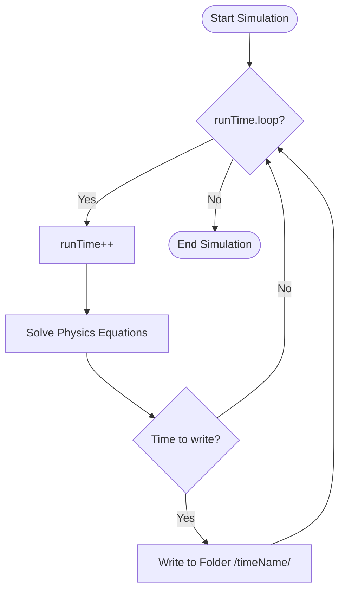

# สถาปัตยกรรมของคลาส Time

![[chronos_controller.png]]
`A high-tech clock tower representing the Time class. The clock hands move in discrete steps (deltaT). From the tower, pneumatic tubes (File I/O) lead to different folders labeled "0", "0.1", "0.2", scientific textbook diagram, clean vector line art, white background, high definition, flat design, educational infographic --ar 16:9`

---

## 1. รู้จักคลาส `Time`: ผู้ควบคุมการเดินทางข้ามเวลา

คลาส `Time` ใน OpenFOAM คือ ==ผู้อำนวยความสะดวกหลัก== ในการควบคุมการจำลองแบบ CFD ทั้งหมด มันทำหน้าที่เป็น **Chronos Controller** ที่จัดการ:

- **การก้าวเวลา** (time stepping) จาก `startTime` ถึง `endTime`
- **การบันทึกข้อมูล** (data writing) ลงในโฟลเดอร์ตามลำดับเวลา (`0/`, `0.1/`, `0.2/`, ...)
- **การติดตามดัชนีเวลา** (time indexing) สำหรับการแก้สมการที่ขึ้นกับเวลา
- **การอ่าน/เขียนไฟล์** อัตโนมัติผ่านระบบ `regIOobject`

```cpp
// Simplified Time class declaration showing core time management
// - startTime_: Starting time value of simulation [s]
// - endTime_: Final time value when simulation stops [s]
// - deltaT_: Time step size for each iteration [s]
// - value_: Current simulation time [s]
// - timeIndex_: Current time step index counter
class Time : public IOobject, public clock {
private:
    scalar startTime_;       // Start time [s]
    scalar endTime_;         // End time [s]
    scalar deltaT_;          // Time step size [s]
    scalar value_;           // Current time value [s]
    label timeIndex_;        // Current time index

public:
    // Main time loop control - increments time and checks if simulation should continue
    // Returns true while value_ < endTime_, false when simulation complete
    bool loop() {
        value_ += deltaT_;
        timeIndex_++;
        return value_ < endTime_;
    }

    // Accessor methods for time information
    const word& timeName() const;      // Folder name for current time (e.g., "0.5")
    scalar value() const;               // Current time value
    scalar deltaTValue() const;         // Current time step size
};
```

**แหล่งที่มา:** ไฟล์อธิบายแนวคิดการออกแบบคลาส Time ใน OpenFOAM

**คำอธิบาย:**
คลาส `Time` ทำหน้าที่เป็นตัวควบคุมหลักในการจัดการเวลาสำหรับการจำลอง CFD ทั้งหมด โดยมีหน้าที่หลักในการควบคุมการก้าวเวลาจากจุดเริ่มต้นถึงจุดสิ้นสุด การจัดการการบันทึกข้อมูลลงในโฟลเดอร์ตามลำดับเวลา การติดตามดัชนีเวลาสำหรับการแก้สมการ และการอ่าน/เขียนไฟล์อัตโนมัติผ่านระบบ `regIOobject`

**แนวคิดสำคัญ:**
- **Time Stepping:** การควบคุมการเพิ่มค่าเวลาจาก `startTime` ไปยัง `endTime` เป็นจำนวน `deltaT`
- **Time Indexing:** การติดตามดัชนีเวลาสำหรับการอ้างอิงค่าในอดีต
- **Auto I/O:** การจัดการไฟล์อัตโนมัติผ่านระบบ registry

> [!INFO] **Time vs runTime**
> ในโค้ด solver คุณมักจะเห็น `runTime` ซึ่งเป็นออบเจกต์ `Time` ที่ถูกสร้างขึ้นในสคริปต์สำหรับการจำลองแบบ:
> ```cpp
> Foam::Time runTime(Foam::Time::controlDictName, args);
> ```

---

## 2. แบบแผน: สถาปัตยกรรมเทมเพลตและโครงสร้างการสืบทอด

### **2.1 พารามิเตอร์เทมเพลตหลัก: "รหัสพันธุกรรม"**

ที่หัวใจของระบบฟิลด์ของ OpenFOAM มีเทมเพลต `GeometricField` - ซึ่งเป็นหนึ่งในการออกแบบเทมเพลตที่ซับซ้อนที่สุดในพลศาสตร์ของไหลเชิงคำนวณ เทมเพลตนี้แสดงถึงการสรุปความหมายขั้นสูงสุดของปริมาณทางกายภาพในการจำลอง CFD:

```cpp
// GeometricField template: Core abstraction for physical quantities in CFD simulations
// - Type: Mathematical type of field (scalar, vector, tensor, etc.)
// - PatchField: Template template parameter for boundary condition behavior
// - GeoMesh: Spatial domain type (volMesh, surfaceMesh, pointMesh)
template<class Type, template<class> class PatchField, class GeoMesh>
class GeometricField : public DimensionedField<Type, GeoMesh>
```

**แหล่งที่มา:** ไฟล์นิยามคลาส `GeometricField` ในซอร์สโค้ด OpenFOAM (src/OpenFOAM/fields/GeometricField/GeometricField.H)

**คำอธิบาย:**
`GeometricField` เป็นเทมเพลตที่ซับซ้อนที่สุดในระบบฟิลด์ของ OpenFOAM โดยรับพารามิเตอร์สามตัวเพื่อกำหนดลักษณะของฟิลด์ทางกายภาพ ได้แก่ ชนิดข้อมูลคณิตศาสตร์ (Type), พฤติกรรมขอบเขต (PatchField), และตำแหน่งเชิงพื้นที่ (GeoMesh)

**แนวคิดสำคัญ:**
- **Template Metaprogramming:** การใช้เทมเพลตเพื่อสร้าง code ที่ปลอดภัยต่อประเภทและมีประสิทธิภาพ
- **Type Safety:** การตรวจสอบชนิดข้อมูลในขั้นตอน compile-time
- **Code Reusability:** การเขียน code ครั้งเดียวสำหรับหลายชนิดข้อมูล

พารามิเตอร์เทมเพลตทั้งสามนี้สร้างระบบข้อกำหนดที่สมบูรณ์ที่ตอบคำถามพื้นฐานของการแสดงฟิลด์ทางกายภาพ:

#### **พารามิเตอร์ Type: ปริมาณทางกายภาพ**

พารามิเตอร์ `Type` กำหนด **สิ่งที่** เรากำลังแสดงถึง ชนิด C++ พื้นฐานนี้กำหนดลักษณะทางคณิตศาสตร์ของฟิลด์:

- `scalar`: ปริมาณค่าเดียวเช่น อุณหภูมิ ความดัน ความหนาแน่น
- `vector`: ปริมาณสามมิติเช่น ความเร็ว โมเมนตัม ตำแหน่ง
- `tensor`: เทนเซอร์อันดับสองเช่น ความเค้น อัตราการไหล เมทริกซ์การหมุน
- `symmTensor`: เทนเซอร์สมมาตรสำหรับความเค้น/ความเครียดสมมาตร
- `sphericalTensor`: เทนเซอร์ทรงกลมสำหรับคุณสมบัติไอโซทรอปิก

![[of_field_types_viz.png]]
`A visualization of different field types (Scalar, Vector, Tensor) mapped onto a 3D CFD mesh, showing how data rank affects the physical representation, scientific textbook diagram, clean vector line art, white background, high definition, flat design, educational infographic --ar 16:9`

ระบบชนิดนี้จะรับประกันความสม่ำเสมอทางคณิตศาสตตลอดการจำลอง - คุณไม่สามารถบวกฟิลด์เวคเตอร์กับฟิลด์สกาลาร์โดยไม่ตั้งใจได้

#### **พารามิเตอร์ PatchField: พฤติกรรมขอบเขต**

พารามิเตอร์เทมเพลต `PatchField` กำหนด **วิธี** ที่ฟิลด์มีพฤติกรรมที่ขอบเขต ซึ่งเป็นสิ่งสำคัญสำหรับ CFD ที่ซึ่งเงื่อนไขขอบเขตมักขับเคลื่อนฟิสิกส์:

```cpp
// fvPatchField: Base class for finite volume boundary conditions
// - evaluate(): Pure virtual method for updating boundary values
// - operator=(): Assignment operator for boundary field operations
template<class Type>
class fvPatchField {
    virtual void evaluate(const Pstream::commsTypes commsType) = 0;
    virtual void operator=(const fvPatchField<Type>&) = 0;
};
```

**แหล่งที่มา:** ไฟล์นิยามคลาส `fvPatchField` ใน OpenFOAM (src/finiteVolume/fields/fvPatchFields/fvPatchField/fvPatchField.H)

**คำอธิบาย:**
`PatchField` เป็นเทมเพลตพารามิเตอร์ที่กำหนดพฤติกรรมของฟิลด์ที่ขอบเขต โดยใช้ template template parameter ที่ทำให้สามารถส่งชนิด patch field ที่แตกต่างกันเข้าไปใน GeometricField ได้

**แนวคิดสำคัญ:**
- **Policy-Based Design:** การใช้ template parameter เพื่อกำหนดพฤติกรรมขอบเขต
- **Virtual Functions:** การใช้ฟังก์ชันเสมือนสำหรับ polymorphism
- **Boundary Conditions:** การจัดการเงื่อนไขขอบเขตที่หลากหลาย

ชนิด `PatchField` ทั่วไป ได้แก่:

- `fvPatchField`: เงื่อนไขขอบเขตปริมาตรจำกัด (Dirichlet, Neumann, Robin)
- `pointPatchField`: เงื่อนไขขอบเขตยึดตามจุดสำหรับการเปลี่ยนรูปเมช
- `fvsPatchField`: เงื่อนไขขอบเขตฟิลด์พื้นผิวสำหรับการคำนวณฟลักซ์

#### **พารามิเตอร์ GeoMesh: โดเมนเชิงพื้นที่**

พารามิเตอร์ `GeoMesh` กำหนด **ตำแหน่งที่** ค่าฟิลด์ตั้งอยู่ภายในโดเมนการคำนวณ:

```cpp
// Mesh type definitions defining spatial field locations
// - volMesh: Cell-centered values for finite volume methods
// - surfaceMesh: Face-centered values for flux calculations
// - pointMesh: Point values for mesh deformation and interpolation
class volMesh {
    // Cell-centered field values
    // Primary location for finite volume discretization
};

class surfaceMesh {
    // Face-centered field values
    // Natural location for flux computations
};

class pointMesh {
    // Point mesh field values
    // Used for mesh motion and value transformations
};
```

**แหล่งที่มา:** ไฟล์นิยามคลาส Mesh ใน OpenFOAM (src/OpenFOAM/meshes/)

**คำอธิบาย:**
`GeoMesh` เป็นพารามิเตอร์ที่กำหนดตำแหน่งเชิงพื้นที่ของค่าฟิลด์ในโดเมนการคำนวณ โดยมีสามประเภทหลัก ได้แก่ volMesh (จุดศูนย์ถ่วงเซลล์), surfaceMesh (จุดศูนย์ถ่วงหน้า), และ pointMesh (จุดเมช)

**แนวคิดสำคัญ:**
- **Spatial Discretization:** การแบ่งส่วนเชิงพื้นที่ของค่าฟิลด์
- **Mesh Topology:** โครงสร้างเชิงพื้นที่ของการคำนวณ
- **Field Interpolation:** การแปลงค่าระหว่างตำแหน่งต่างๆ

| พารามิเตอร์ | ความหมายทางกายภาพ | ค่าเทียบเท่า CFD | ตัวอย่าง |
|-----------|------------------|----------------|---------|
| `Type` | **สิ่งที่** เราวัด | ชนิดข้อมูลฟิลด์ | `scalar` (อุณหภูมิ), `vector` (ความเร็ว) |
| `PatchField` | **วิธี** ขอบเขตมีพฤติกรรม | ชนิดเงื่อนไขขอบเขต | `fvPatchField` (ปริมาตรจำกัด), `pointPatchField` (จุด) |
| `GeoMesh` | **ตำแหน่งที่** การวัดอยู่ | ชนิดเรขาคณิตเมช | `volMesh` (เซลล์), `surfaceMesh` (หน้า), `pointMesh` (จุด) |

---

### **2.2 ลำดับชั้นการสืบทอด: "ต้นไม้ตระกูล"**

คลาส `GeometricField` สืบทอดมาจากลำดับชั้นที่สร้างขึ้นอย่างระมัดระวังซึ่งสร้างฟังก์ชันการทำงานเป็นชั้นๆ:

![[of_geometricfield_inheritance.png]]
`A diagram showing the inheritance hierarchy of GeometricField, from the base Field container through DimensionedField to the final complete GeometricField object, scientific textbook diagram, clean vector line art, white background, high definition, flat design, educational infographic --ar 16:9`

```
Field<Type> (คอนเทนเนอร์ข้อมูลดิบ)
    ↑
regIOobject (ความสามารถ I/O)
    ↑
DimensionedField<Type, GeoMesh> (หน่วยทางกายภาพ + การอ้างอิงเมช)
    ↑
GeometricField<Type, PatchField, GeoMesh> (ฟิลด์สมบูรณ์พร้อมขอบเขต)
    |
    ├── internalField_ (ค่าที่จุดศูนย์ถ่วงเซลล์)
    ├── boundaryField_ (ค่าหน้าขอบเขต)
    ├── timeIndex_ (การติดตามเวลา)
    └── การอ้างอิงเมช (บริบทเชิงพื้นที่)
```

#### **ชั้นรากฐาน: Field<Type>**

คลาสฐาน `Field<Type>` ให้การจัดเก็บข้อมูลดิบและการดำเนินการทางคณิตศาสตร์พื้นฐาน:

```cpp
// Field<Type>: Base container class for raw data storage and mathematical operations
// - Inherits from List<Type> for array-like storage
// - Provides field-level mathematical operations
// - Implements reduction operations (sum, max, min)
template<class Type>
class Field : public List<Type> {
public:
    // Assignment operators for field algebra
    Field<Type>& operator=(const Field<Type>&);
    Field<Type>& operator+=(const Field<Type>&);
    Field<Type>& operator*=(const scalarField&);

    // Reduction operations for aggregate statistics
    Type sum() const;
    Type max() const;
    Type min() const;
};
```

**แหล่งที่มา:** ไฟล์นิยามคลาส `Field` ใน OpenFOAM (src/OpenFOAM/fields/Fields/Field/Field.H)

**คำอธิบาย:**
`Field<Type>` เป็นคลาสฐานที่ให้การจัดเก็บข้อมูลดิบและการดำเนินการทางคณิตศาสตร์พื้นฐาน โดยสืบทอดจาก `List<Type>` เพื่อให้มีลักษณะเป็นอาร์เรย์

**แนวคิดสำคัญ:**
- **Data Storage:** การจัดเก็บข้อมูลแบบอาร์เรย์
- **Mathematical Operations:** การดำเนินการทางคณิตศาสตร์ระดับฟิลด์
- **Reduction Operations:** การดำเนินการแบบรวม (sum, max, min)

#### **ชั้น I/O: regIOobject**

คลาส `regIOobject` เพิ่มความสามารถ I/O ไฟล์อัตโนมัติโดยใช้ระบบรีจิสทรีออบเจกต์ของ OpenFOAM:

```cpp
// regIOobject: Registered I/O object for automatic file management
// - Provides automatic file read/write capabilities
// - Manages object registration in database registry
// - Handles object lifecycle and naming
class regIOobject : public IOobject {
    // Automatic file reading if modification detected
    bool readIfModified();
    
    // Write object to disk with specified format
    bool writeObject(IOstream::streamFormat fmt) const;

    // Registry management for object tracking
    void checkOut();
    void rename(const word& newName);
};
```

**แหล่งที่มา:** ไฟล์นิยามคลาส `regIOobject` ใน OpenFOAM (src/OpenFOAM/db/IOobjects/regIOobject/regIOobject.H)

**คำอธิบาย:**
`regIOobject` เพิ่มความสามารถในการจัดการไฟล์ I/O อัตโนมัติผ่านระบบ registry ของ OpenFOAM โดยให้ฟังก์ชันการอ่าน/เขียนไฟล์และการจัดการออบเจกต์ในฐานข้อมูล

**แนวคิดสำคัญ:**
- **Automatic I/O:** การจัดการไฟล์อัตโนมัติ
- **Registry System:** ระบบฐานข้อมูลสำหรับติดตามออบเจกต์
- **Object Lifecycle:** การจัดการวงจรชีวิตของออบเจกต์

#### **ชั้นทางกายภาพ: DimensionedField**

คลาส `DimensionedField` เพิ่มมิติทางกายภาพและการเชื่อมโยงเมช:

```cpp
// DimensionedField: Adds physical dimensions and mesh reference
// - Multiple inheritance: Field (data), regIOobject (I/O), GeoMesh (spatial)
// - dimensionSet: Physical units (mass, length, time, temperature, etc.)
// - mesh_: Reference to computational mesh
template<class Type, class GeoMesh>
class DimensionedField : public Field<Type>, public regIOobject, public GeoMesh {
    dimensionSet dimensions_;  // Physical dimensions [M, L, T, θ, I, N, J]
    const GeoMesh& mesh_;      // Reference to mesh

public:
    // Accessor methods for physical properties
    const dimensionSet& dimensions() const { return dimensions_; }
    const GeoMesh& mesh() const { return mesh_; }
};
```

**แหล่งที่มา:** ไฟล์นิยามคลาส `DimensionedField` ใน OpenFOAM (src/OpenFOAM/fields/DimensionedField/DimensionedField.H)

**คำอธิบาย:**
`DimensionedField` เพิ่มมิติทางกายภาพและการเชื่อมโยงเมชผ่านการสืบทอดแบบหลายชั้น โดยมีสมาชิกหลักคือ `dimensionSet` สำหรับเก็บหน่วยทางกายภาพและ `mesh_` สำหรับอ้างอิงถึงเมช

**แนวคิดสำคัญ:**
- **Dimensional Analysis:** การวิเคราะห์มิติทางกายภาพ
- **Multiple Inheritance:** การสืบทอดแบบหลายชั้น
- **Mesh Association:** การเชื่อมโยงกับเมชการคำนวณ

#### **ชั้นสมบูรณ์: GeometricField**

คลาส `GeometricField` สุดท้ายเพิ่มการจัดการขอบเขตและการติดตามเชิงเวลา:

```cpp
// GeometricField: Complete field with boundary conditions and time tracking
// - internalField_: Cell-centered values from DimensionedField base
// - boundaryField_: Container of patch boundary conditions
// - timeIndex_: Tracking field evolution across time steps
template<class Type, template<class> class PatchField, class GeoMesh>
class GeometricField : public DimensionedField<Type, GeoMesh> {
    DimensionedField<Type, GeoMesh> internalField_;    // Cell-centered values
    FieldField<PatchField, Type> boundaryField_;       // Boundary conditions
    label timeIndex_;                                  // Time tracking

public:
    // Accessor methods for field components
    const Boundary& boundaryField() const { return boundaryField_; }
    Boundary& boundaryField() { return boundaryField_; }

    const Internal& internalField() const { return internalField_; }
    Internal& internalField() { return internalField_; }

    // Time management methods
    void oldTime();
    void writeOldTime() const;
};
```

**แหล่งที่มา:** ไฟล์นิยามคลาส `GeometricField` ใน OpenFOAM (src/OpenFOAM/fields/GeometricField/GeometricField.H)

**คำอธิบาย:**
`GeometricField` เป็นคลาสสุดท้ายที่เพิ่มการจัดการขอบเขตและการติดตามเชิงเวลา โดยมีสมาชิกหลักคือ `internalField_` สำหรับค่าภายใน, `boundaryField_` สำหรับเงื่อนไขขอบเขต, และ `timeIndex_` สำหรับติดตามเวลา

**แนวคิดสำคัญ:**
- **Boundary Management:** การจัดการเงื่อนไขขอบเขต
- **Time Tracking:** การติดตามค่าฟิลด์ในอดีต
- **Field Completeness:** ฟิลด์สมบูรณ์พร้อมใช้งาน

---

### **2.3 นามแฝงชนิด: "ชื่อที่ใช้งานง่าย"**

OpenFOAM ให้ชุดนามแฝงชนิดที่หลากหลายซึ่งทำให้การประกาศฟิลด์เป็นไปอย่างเป็นธรรมชาติและมีความหมายทางกายภาพ:

```cpp
// Type aliases for common field configurations
// These typedefs hide template complexity and provide physically meaningful names
// - volScalarField: Scalar field at cell centers (e.g., pressure, temperature)
// - volVectorField: Vector field at cell centers (e.g., velocity)
// - surfaceScalarField: Scalar field at face centers (e.g., flux)
// Finite Volume Fields - cell-centered values
typedef GeometricField<scalar, fvPatchField, volMesh> volScalarField;
typedef GeometricField<vector, fvPatchField, volMesh> volVectorField;
typedef GeometricField<tensor, fvPatchField, volMesh> volTensorField;
typedef GeometricField<symmTensor, fvPatchField, volMesh> volSymmTensorField;
typedef GeometricField<sphericalTensor, fvPatchField, volMesh> volSphericalTensorField;

// Surface Fields - face-centered values
typedef GeometricField<scalar, fvsPatchField, surfaceMesh> surfaceScalarField;
typedef GeometricField<vector, fvsPatchField, surfaceMesh> surfaceVectorField;

// Point Fields - point values
typedef GeometricField<scalar, pointPatchField, pointMesh> pointScalarField;
typedef GeometricField<vector, pointPatchField, pointMesh> pointVectorField;

// Internal Fields - for mathematical operations
typedef DimensionedField<scalar, volMesh> volScalarField::Internal;
typedef DimensionedField<vector, volMesh> volVectorField::Internal;
```

**แหล่งที่มา:** ไฟล์นิยาม typedef ใน OpenFOAM (src/OpenFOAM/fields/GeometricField/GeometricField.H)

**คำอธิบาย:**
OpenFOAM ให้ชุดนามแฝงชนิด (typedef) เพื่อซ่อนความซับซ้อนของ template และทำให้การประกาศฟิลด์มีความหมายทางกายภาพมากขึ้น โดยมีนามแฝงหลักๆ ได้แก่ volScalarField, volVectorField, surfaceScalarField, เป็นต้น

**แนวคิดสำคัญ:**
- **Type Erasure:** การซ่อนความซับซ้อนของ template
- **Code Readability:** การทำให้โค้ดอ่านง่ายขึ้น
- **Physical Meaning:** การให้ชื่อที่มีความหมายทางกายภาพ

---

## 3. Internal Mechanics: Memory Layout and Data Structures

### **3.1 Core Data Members: The "Field Anatomy"**

คลาส `GeometricField` แสดงถึงแนวทางที่ซับซ้อนของ OpenFOAM ในการจัดการข้อมูลฟิลด์การคำนวณผ่านลำดับชั้นการสืบทอดที่ออกแบบมาอย่างพิถีพิถัน

ในแกนกลางของคลาสเทมเพลตนี้ทำหน้าที่เป็นรากฐานสำหรับการแสดงถึงปริมาณทางกายภาพทั่วทั้งโดเมนการคำนวณ:

- **ฟิลด์สเกลาร์**: ความดัน อุณหภูมิ
- **ฟิลด์เวกเตอร์**: ความเร็ว
- **ฟิลด์เทนเซอร์**: ความเค้นและความเครียด

```cpp
// GeometricField core data structure showing time and boundary management
// - timeIndex_: Current time level for temporal schemes
// - field0Ptr_: Pointer to field at previous time step (n-1)
// - fieldPrevIterPtr_: Pointer to field from previous iteration (n)
// - boundaryField_: Container of all patch boundary conditions
// - Inherited members: mesh_ (mesh reference), dimensions_ (units), data_ (storage)
template<class Type, template<class> class PatchField, class GeoMesh>
class GeometricField {
private:
    // Time management for temporal schemes
    mutable label timeIndex_;                    // Current time index for time dependency tracking
    mutable GeometricField* field0Ptr_;          // Pointer to field at previous time step (n-1)
    mutable GeometricField* fieldPrevIterPtr_;   // Pointer to field from previous iteration (n)

    // Boundary condition management
    Boundary boundaryField_;                     // GeometricBoundaryField containing all patch conditions

    // Inherited from DimensionedField<Type, GeoMesh>:
    // const Mesh& mesh_                         // Reference to the underlying computational mesh
    // dimensionSet dimensions_                  // Physical dimensions (e.g., [M^1 L^-1 T^-2] for pressure)
    // Field<Type> data_                         // Actual data storage for internal field values
};
```

**แหล่งที่มา:** ไฟล์นิยามคลาส `GeometricField` ใน OpenFOAM (src/OpenFOAM/fields/GeometricField/GeometricField.H)

**คำอธิบาย:**
โครงสร้างข้อมูลหลักของ `GeometricField` ประกอบด้วยสมาชิกสำหรับการจัดการเวลา (timeIndex_, field0Ptr_, fieldPrevIterPtr_) และการจัดการเงื่อนไขขอบเขต (boundaryField_) รวมถึงสมาชิกที่สืบทอดมาจากคลาสฐาน

**แนวคิดสำคัญ:**
- **Time Management:** การจัดการค่าฟิลด์ในระดับเวลาต่างๆ
- **Boundary Storage:** การจัดเก็บเงื่อนไขขอบเขต
- **Memory Efficiency:** ประสิทธิภาพการใช้หน่วยความจำ

**ความสามารถในการจัดการเวลา**:
- `timeIndex_` รับประกันการติดตามการก้าวหน้าของเวลาที่เหมาะสม
- `field0Ptr_` และ `fieldPrevIterPtr_` อำนวยความสะดวกในรูปแบบการประมาณค่าเวลาที่แม่นยำระดับที่สอง
- รองรับรูปแบบ: **backward differencing**, **Crank-Nicolson** และรูปแบบเชิงเวลาอื่น ๆ

---

### **3.2 Memory Layout Visualization**

[Diagram: โครงสร้างหน่วยความจำแบบลำดับชั้นของ GeometricField]

การจัดระเบียบหน่วยความจำของ `GeometricField` ทำตามโครงสร้างลำดับชั้นที่แยกการจัดเก็บฟิลด์ภายในจากการจัดการเงื่อนไขขอบเขต:

```
GeometricField<scalar, fvPatchField, volMesh> (volScalarField representation)
├── DimensionedField<scalar, volMesh> (base class)
│   ├── Field<scalar> data_ = [p₁, p₂, ..., pₙ]  (n = total cells)
│   │   ├── p₁ = pressure at cell center 1
│   │   ├── p₂ = pressure at cell center 2
│   │   └── pₙ = pressure at cell center n
│   ├── dimensionSet dims_ = [1 -2 -2 0 0 0 0] (pressure: M L^-1 T^-2)
│   └── const volMesh& mesh_ (reference to finite volume mesh)
└── GeometricBoundaryField (boundary condition management)
    ├── fvPatchField<scalar>[0] (patch 0: inlet)
    │   ├── Reference to fvPatch (geometric information)
    │   ├── Reference to internalField (coupling to interior)
    │   └── Field<scalar> (values at boundary faces)
    ├── fvPatchField<scalar>[1] (patch 1: outlet)
    ├── fvPatchField<scalar>[2] (patch 2: walls)
    └── ... (n patches total)
```

**การตีความทางกายภาพ**:
พิจารณาฟิลด์อุณหภูมิ $T(\mathbf{x}, t)$ ที่ถูกแบ่งส่วนบนตาข่ายการคำนวณ:

- `Field<scalar>` เก็บค่าศูนย์กลางเซลล์: $[T_1, T_2, ..., T_N]$ โดยที่แต่ละ $T_i$ แทนอุณหภูมิเฉลี่ยในเซลล์ $i$
- `boundaryField_` รักษาค่าอุณหภูมิที่หน้าขอบเขต: $T_{\text{boundary}}^{(j)}$ สำหรับแต่ละชิ้นส่วนขอบเขต $j$
- `dimensions_` บังคับให้มีความสอดคล้องของมิติ: $[T] = \Theta$ (หน่วยอุณหภูมิ)

**ประสิทธิภาพการดำเนินการ**:
โครงสร้างนี้ทำให้สามารถดำเนินการแบบเวกเตอร์ได้อย่างมีประสิทธิภาพในขณะที่รักษาการแยกอย่างชัดเจนระหว่างการคำนวณโดเมนจำนวนมากและการรักษาเงื่อนไขขอบเขตเฉพาะทาง

---

### **3.3 Boundary Field Organization**

[Diagram: สถาปัตยกรรม GeometricBoundaryField และความสัมพันธ์กับ PatchField]

สถาปัตยกรรมเงื่อนไขขอบเขตแสดงให้เห็นถึงแนวทางที่ยืดหยุ่นและขยายได้ของ OpenFOAM ในการจัดการข้อจำกัดทางกายภาพที่หลากหลาย

```cpp
// GeometricBoundaryField: Container for all boundary patch fields
// - PtrList<PatchField>: Dynamic array of boundary patch field pointers
// - Each patch contains geometric info, internal field coupling, and boundary values
// - Virtual methods enable polymorphic boundary condition evaluation
class GeometricBoundaryField {
    PtrList<PatchField<Type>> patches_;  // Dynamic array of boundary patch fields

    // Each fvPatchField<Type> instance contains:
    // - Reference to fvPatch (geometric boundary information)
    // - Reference to internalField (for coupled boundary conditions)
    // - Field<Type> (actual boundary face values)
    // - Virtual methods for boundary condition evaluation
};
```

**แหล่งที่มา:** ไฟล์นิยามคลาส `GeometricBoundaryField` ใน OpenFOAM (src/OpenFOAM/fields/GeometricField/GeometricBoundaryField/GeometricBoundaryField.H)

**คำอธิบาย:**
`GeometricBoundaryField` เป็นคอนเทนเนอร์สำหรับจัดเก็บเงื่อนไขขอบเขตทั้งหมด โดยใช้ `PtrList` สำหรับเก็บ pointer ไปยัง patch field ต่างๆ แต่ละ patch มีข้อมูลเรขาคณิต การเชื่อมโยงกับฟิลด์ภายใน และค่าขอบเขต

**แนวคิดสำคัญ:**
- **Patch Container:** คอนเทนเนอร์สำหรับเก็บ patch fields
- **Polymorphic Behavior:** พฤติกรรมแบบ polymorphic ผ่าน virtual methods
- **Boundary Coupling:** การเชื่อมโยงระหว่างขอบเขตและภายใน

**หลักการออกแบบสำคัญ**:
- **Patch-specific but type-consistent**: แต่ละชิ้นส่วนขอบเขตสามารถมีเงื่อนไขทางกายภาพที่แตกต่างกันได้
- ชิ้นส่วนขอบเขตทั้งหมดภายในฟิลด์ยังคงประเภทเทมเพลตเดียวกัน
- **Runtime Polymorphism**: ความปลอดภัยของประเภทในเวลาคอมไพล์ พร้อมการเลือกพฤติกรรมในเวลาทำงาน

#### **ประเภทของเงื่อนไขขอบเขต**

| ประเภท | OpenFOAM | สมการ | ตัวอย่างการใช้งาน |
|--------|----------|---------|------------------|
| **Dirichlet** | `fixedValue` | $$\phi\|_{\partial\Omega} = \phi_0(\mathbf{x}, t)$$ | อุณหภูมิคงที่: $T = 300\text{ K}$ ที่ผนัง<br>ความเร็วคงที่: $\mathbf{u} = \mathbf{u}_0$ ที่ทางเข้า |
| **Neumann** | `fixedGradient` | $$\frac{\partial \phi}{\partial n}\bigg\|_{\partial\Omega} = q_0(\mathbf{x}, t)$$ | Heat flux: $-k \nabla T \cdot \mathbf{n} = q''$ ที่ผนัง<br>Stress-free: $\boldsymbol{\tau} \cdot \mathbf{n} = \mathbf{0}$ ที่ทางออก |
| **Coupled** | `processor`, `cyclic` | การสื่อสารระหว่างโดเมน | `processor`: ขอบเขตการแบ่งโดเมนสำหรับ MPI<br>`cyclic`: ขอบเขตเป็นระยะ<br>`wallFunction`: การรักษาความปั่นป่วนใกล้ผนัง |

**ประสิทธิภาพหน่วยความจำ**:
- การนำไปใช้ `PtrList` เก็บเฉพาะการอ้างอิงถึงออบเจกต์ฟิลด์ขอบเขต
- หลีกเลี่ยงการทำซ้ำข้อมูลที่ไม่จำเป็น
- เมื่อเงื่อนไขขอบเขตถูกอัปเดต การอ้างอิงฟิลด์ภายในยังคงไม่เปลี่ยนแปลง
- ทำให้สามารถแก้ปัญหาอัลกอริทึมการวนซ้ำได้อย่างมีประสิทธิภาพ

---

## 4. กลไก: ตรรกะฟังก์ชันการทำงานและปฏิสัมพันธ์กับ Mesh

### **4.1 การสร้างฟิลด์: "ใบประกาศแรกเกิด"**

ในสถาปัตยกรรมของ OpenFOAM การสร้าง computational field เป็นกระบวนการที่ถูกออกแบบมาอย่างระมัดระวัง ซึ่งกำหนดเอกลักษณ์ คุณสมบัติทางกายภาพ และความสัมพันธ์กับ computational mesh ของฟิลด์นั้นๆ

**Constructor ของ `volScalarField`** ทำหน้าที่เป็น "ใบประกาศแรกเกิด" ของฟิลด์ โดยเข้ารหัสข้อมูลสำคัญที่ควบคุมพฤติกรรมของฟิลด์ตลอดการจำลอง

```cpp
// volScalarField construction: Field declaration with IOobject, mesh, and dimensions
// - IOobject: Defines field identity (name, time directory, I/O behavior)
// - mesh: Spatial reference determining field size
// - dimensionedScalar: Initial value with physical units
volScalarField p
(
    IOobject
    (
        "p",                    // Field name
        runTime.timeName(),     // Time directory
        mesh,                   // fvMesh reference
        IOobject::MUST_READ,    // Read from disk
        IOobject::AUTO_WRITE    // Auto-write on output
    ),
    mesh,                       // Mesh for sizing
    dimensionedScalar("p", dimPressure, 101325)  // Initial value + units
);
```

**แหล่งที่มา:** ไฟล์ solver ใน OpenFOAM (applications/solvers/)

**คำอธิบาย:**
การสร้างฟิลด์ใน OpenFOAM เป็นกระบวนการที่กำหนดเอกลักษณ์ คุณสมบัติทางกายภาพ และความสัมพันธ์กับเมช โดย constructor ของ `volScalarField` รับพารามิเตอร์ IOobject, mesh, และ dimensionedScalar

**แนวคิดสำคัญ:**
- **Field Identity:** การกำหนดเอกลักษณ์ของฟิลด์
- **Physical Properties:** คุณสมบัติทางกายภาพของฟิลด์
- **Mesh Association:** ความสัมพันธ์กับเมชการคำนวณ

[Diagram: โครงสร้างการสร้างฟิลด์ใน OpenFOAM แสดง IOobject, Mesh และค่าเริ่มต้น]

กระบวนการสร้างนี้เป็นไปตามโปรโตคอลหลายขั้นตอนอย่างเคร่งครัด:

#### **ขั้นที่ 1: การสร้าง IOobject**
กำหนดเอกลักษณ์ถาวรและกลยุทธ์การจัดการข้อมูลของฟิลด์

- **`IOobject`** ทำหน้าที่เป็นอินเทอร์เฟซระหว่างฟิลด์และระบบไฟล์
- **`IOobject::MUST_READ`** บังคับให้ฟิลด์อ่านจากดิสก์ระหว่างการสร้าง (โดยทั่วไปจากไฟล์ `0/p`)
- **`IOobject::AUTO_WRITE`** ทำให้มั่นใจได้ว่าจะมีการส่งออกโดยอัตโนมัติในแต่ละ time step

#### **ขั้นที่ 2: การกำหนดขนาดของ Mesh**
กำหนดมิติเชิงพื้นที่ของฟิลด์ผ่านการดำเนินการ `volMesh(mesh).size()`

- นับจำนวน computational cells ใน mesh
- สร้างความสัมพันธ์หนึ่งต่อหนึ่งระหว่างค่าฟิลด์และเซลล์ของ mesh
- แน่ใจว่าแต่ละจุดศูนย์ถ่วงของเซลล์จะมีค่าฟิลด์ที่เกี่ยวข้อง

#### **ขั้นที่ 3: การตรวจสอบมิติ**
บังคับใช้ความสม่ำเสมอทางกายภาพผ่านระบบ dimensional analysis ของ OpenFOAM

- **`dimPressure`** (มิติ: $M L^{-1} T^{-2}$) ทำให้มั่นใจได้ว่าการดำเนินการทั้งหมดจะรักษาความสม่ำเสมอของมิติ
- ป้องกันการคำนวณที่ไม่มีความหมายทางกายภาพในช่วย compile time

#### **ขั้นที่ 4: การตั้งค่าเขตแดน**
อ่านและประมวลผลข้อมูลจำเพาะของเขตแดนจาก field dictionary

- การแยกวิเคราะห์ประเภทของเขตแดน (fixedValue, zeroGradient, เป็นต้น)
- ค่าที่เกี่ยวข้อง
- Interpolation schemes
- สร้างการกำหนดค่าฟิลด์ที่สมบูรณ์ที่จำเป็นสำหรับการจำลอง

---

### **4.2 การ Overload Operator: "ไวยากรณ์คณิตศาสตร์"**

Field operators ของ OpenFOAM ใช้ไวยากรณ์คณิตศาสตร์ที่ซับซ้อน ซึ่งช่วยให้สามารถคำนวณได้ตรงตามสัญชาตญาณและปลอดภัยต่อมิติ

[Diagram: แผนภาพการทำงานของ operator overloading ใน OpenFOAM]

#### **OpenFOAM Code Implementation**
```cpp
// Dimensional-safe field operations with automatic unit checking
// - p = rho*R*T: Ideal gas law (pressure = density * gas_constant * temperature)
// - fvc::grad(p): Spatial gradient of pressure field
// - fvc::div(U): Divergence of velocity field
volScalarField p = rho*R*T;               // p = ρRT (ideal gas law)
volVectorField gradP = fvc::grad(p);      // ∇p (pressure gradient)
volScalarField divU = fvc::div(U);        // ∇·U (velocity divergence)

// Compile-time dimensional checking
// System automatically verifies dimensional consistency of operations
dimensionSet dims = p.dimensions() * U.dimensions();  // [p·U] = ML⁻¹T⁻² · LT⁻¹ = ML⁻²T⁻³
```

**แหล่งที่มา:** ไฟล์ solver ใน OpenFOAM (applications/solvers/)

**คำอธิบาย:**
OpenFOAM ใช้ operator overloading เพื่อสร้างไวยากรณ์คณิตศาสตร์ที่ปลอดภัยต่อมิติ โดยระบบจะตรวจสอบความสอดคล้องของมิติโดยอัตโนมัติในขั้นตอน compile-time

**แนวคิดสำคัญ:**
- **Operator Overloading:** การ overload operator สำหรับฟิลด์
- **Dimensional Safety:** ความปลอดภัยต่อมิติ
- **Compile-time Checking:** การตรวจสอบในขั้นตอนคอมไพล์

ระบบ operator overloading บังคับใช้ฟิสิกส์อย่างเคร่งครัดผ่านการตรวจสอบความสอดคล้องของมิติ:

#### **การดำเนินการเชิงบวก** ($+$, $-$)
- ต้องการมิติที่เหมือนกันระหว่าง operands
- นิพจน์เช่น `p + T` ล้มเหลวในช่วย compile time
- ความดัน ($M L^{-1} T^{-2}$) และอุณหภูมิ ($Θ$) มีมิติที่ไม่เข้ากัน
- ป้องกันการดำเนินการที่ไม่มีความหมายทางกายภาพ

#### **การดำเนินการเชิงคูณ** ($\times$, $\div$)
- ผสมและทำให้มิติง่ายขึ้นโดยอัตโนมัติตามกฎฟิสิกส์
- ตัวอย่าง: `U * t` (ความเร็ว × เวลา) ผลิตการกระจัดโดยธรรมชาติด้วยมิติของความยาว ($L$)

#### **Differential Operators**
ใช้การแปลงมิติเฉพาะที่สะท้อนคำจำกัดความทางคณิตศาสตร์:

| Operator | สัญลักษณ์ | การเปลี่ยนแปลงมิติ | คำอธิบาย |
|----------|------------|-------------------|------------|
| Gradient | $\nabla$ | เพิ่ม $L^{-1}$ | อนุพันธ์เชิงพื้นที่ |
| Divergence | $\nabla \cdot$ | เพิ่ม $L^{-1}$ | การไหลออก |
| Laplacian | $\nabla^2$ | เพิ่ม $L^{-2}$ | อนุพันธ์อันดับสอง |

ระบบความปลอดภัยของมิตินี้ขยายไปถึงนิพจน์ที่ซับซ้อนเช่น $\nabla \cdot (\rho \mathbf{U})$ ซึ่งระบบจะตรวจสอบโดยอัตโนมัติว่า mass flux divergence รักษามิติที่ถูกต้องของ mass rate per unit volume ($M L^{-3} T^{-1}$)

---

### **4.3 ปฏิสัมพันธ์กับ Mesh: "บริบทเชิงพื้นที่"**

ความสัมพันธ์ระหว่างฟิลด์และ mesh ใน OpenFOAM เป็นตัวอย่างของการออกแบบเชิงวัตถุที่มีประสิทธิภาพ

[Diagram: แผนภาพแสดงความสัมพันธ์ระหว่าง Field และ Mesh ใน OpenFOAM]

#### **OpenFOAM Code Implementation**
```cpp
// Field-mesh interaction demonstrating mesh-aware operations
// - mesh.C(): Cell center coordinates
// - mesh.V(): Cell volumes
// - mesh.Sf(): Surface area vectors
// - linearInterpolate(U): Interpolate velocity from cell centers to faces
const fvMesh& mesh = p.mesh();  // Access underlying mesh

// Mesh-aware operations
const vectorField& cellCenters = mesh.C();  // Cell center coordinates
const scalarField& cellVolumes = mesh.V();  // Cell volumes

// Field interpolation uses mesh geometry
surfaceScalarField phi = linearInterpolate(U) & mesh.Sf();  // Flux
```

**แหล่งที่มา:** ไฟล์ solver ใน OpenFOAM (applications/solvers/)

**คำอธิบาย:**
ความสัมพันธ์ระหว่างฟิลด์และ mesh ใน OpenFOAM ใช้การออกแบบแบบ reference-based ซึ่งช่วยให้หลายฟิลด์สามารถอ้างอิง mesh เดียวกันได้ และรองรับการดำเนินการเชิงพื้นที่ที่ซับซ้อน

**แนวคิดสำคัญ:**
- **Reference-Based Design:** การออกแบบแบบใช้ reference
- **Mesh-Aware Operations:** การดำเนินการที่ตระหนักถึง mesh
- **Spatial Interpolation:** การแปลงค่าระหว่างตำแหน่งต่างๆ

#### **สถาปัตยกรรม Reference-Based Design**
`GeometricField` objects เก็บการอ้างอิงไปยัง mesh ของตนมากกว่าเป็นเจ้าของโดยตรง

**ประโยชน์ของ Reference-Based Design:**

| คุณสมบัติ | คำอธิบาย | ประโยชน์ |
|------------|------------|------------|
| **ประสิทธิภาพหน่วยควาจำ** | ฟิลด์หลายฟิลด์อ้างอิง mesh เดียวกันได้ | ลดการใช้หน่วยความจำอย่างมีนัยสำคัญ |
| **การรับประกันการซิงโครไนซ์** | ฟิลด์อ้างอิง mesh มากกว่าการคัดลอก | การปรับเปลี่ยน mesh สะท้อนโดยอัตโนมัติ |
| **ความเข้ากันได้แบบขนาน** | ข้อมูลฟิลด์ตาม mesh partitioning โดยธรรมชาติ | รองรับ domain decomposition ราบรื่น |

#### **การดำเนินการเชิงพื้นที่ที่ซับซ้อน**
ความตระหนักเกี่ยวกับ mesh ช่วยให้การดำเนินการเชิงพื้นที่ที่ซับซ้อนซึ่งใช้ประโยชน์จากข้อมูลทางเรขาคณิต:

- **การคำนวณ Flux**: `phi = linearInterpolate(U) & mesh.Sf()`
  - คำนวณ face fluxes โดยการ interpolation ค่าความเร็วจากจุดศูนย์ถ่วงของเซลล์ไปยังจุดศูนย์ถ่วงของหน้า
  - Dot product กับเวกเตอร์ปกติของพื้นผิวหน้า $\mathbf{S_f}$

- **การคำนวณ Gradient**:
  - อนุพันธ์เชิงพื้นที่ใช้ mesh connectivity
  - สร้าง finite-volume approximations โดยยึดตามค่าของเซลล์ใกล้เคียงและเรขาคณิตของหน้า

- **การดำเนินการ Integration**:
  - Volume integrals ใช้ `mesh.V()`
  - ถ่วงน้ำหนักค่าฟิลด์ด้วยปริมาตรเซลล์สำหรับการ integration เชิงพื้นที่ที่แม่นยำ

---

### **4.4 การจัดการเวลา: "ความทรงจำเชิงเวลา"**

OpenFOAM ใช้ระบบการจัดการเวลาที่ซับซ้อน ซึ่งช่วยให้ temporal discretization ที่แม่นยำในขณะเดียวกันรักษาประสิทธิภาพการคำนวณ

[Diagram: แผนภาพการจัดการเวลาใน OpenFOAM แสดงระดับเวลาต่างๆ]

#### **OpenFOAM Code Implementation**
```cpp
// Time management for temporal discretization schemes
// - storeOldTime(): Stores current field for future time step reference
// - oldTime(): Accesses field values from previous time step
// - (p - p.oldTime())/deltaT: First-order finite difference approximation
void GeometricField::storeOldTime() {
    if (!field0Ptr_) {
        field0Ptr_ = new GeometricField(*this);  // Copy current field
    }
}

scalarField ddt = (p - p.oldTime())/runTime.deltaT();  // ∂p/∂t ≈ Δp/Δt
```

**แหล่งที่มา:** ไฟล์นิยามคลาส `GeometricField` ใน OpenFOAM (src/OpenFOAM/fields/GeometricField/GeometricField.C)

**คำอธิบาย:**
OpenFOAM ใช้ระบบการจัดการเวลาที่ซับซ้อนเพื่อรองรับ temporal discretization ที่แม่นยำ โดยใช้ pointer สำหรับเก็บค่าฟิลด์ในอดีตและการจัดสรรหน่วยความจำแบบ lazy

**แนวคิดสำคัญ:**
- **Time Storage:** การจัดเก็บค่าฟิลด์ในอดีต
- **Lazy Allocation:** การจัดสรรหน่วยความจำแบบล่าช้า
- **Temporal Schemes:** รูปแบบการประมาณค่าเชิงเวลา

#### **สถาปัตยกรรมการจัดการเวลา**
สนับสนุนหลาย temporal discretization schemes ผ่านระบบจัดเก็บแบบลำดับชั้น:

**กลยุทธ์การจัดสรรแบบล่าช้า**:
- วิธี `storeOldTime()` ใช้การจัดการหน่วยความจำที่มีประสิทธิภาพ
- จัดสรรพื้นที่จัดเก็บสำหรับระดับเวลาก่อนหน้าเฉพาะเมื่อต้องการ
- ป้องกันการใช้หน่วยความจำโดยไม่จำเป็นในการจำลองสภาวะคงที่

#### **Temporal Schemes และการจัดเก็บ**

| Scheme | ระดับเวลาที่ต้องการ | การจัดเก็บ | สมการ |
|--------|---------------------|-------------|----------|
| **Euler implicit** | 1 ระดับ ($p^{n}$) | `field0Ptr_` | $p^{n+1} = p^n + \Delta t \cdot f(p^{n+1})$ |
| **Backward differentiation** | 2 ระดับ ($p^{n}$, $p^{n-1}$) | `oldTime()` ซ้อนกัน | - |
| **Crank-Nicolson** | 2 ระดับ | การถ่วงน้ำหนัก | $p^{n+\frac{1}{2}} = \frac{1}{2}(p^n + p^{n+1})$ |

#### **การคำนวณอนุพันธ์เชิงเวลา**
ตามการประมาณค่า finite-difference มาตรฐาน:
$$\frac{\partial p}{\partial t} \approx \frac{p^{n+1} - p^n}{\Delta t}$$

ระบบนี้ช่วยให้ OpenFOAM สามารถสลับระหว่าง temporal schemes ที่แตกต่างกันได้อย่างราบรื่นโดยไม่ต้องแก้ไขโค้ด เนื่องจากระบบการจัดการฟิลด์จะจัดหาข้อมูลประวัติศาสตร์ที่จำเป็นโดยอัตโนมัติตาม discretization method ที่เลือก

---

## 5. "เหตุผล": รูปแบบการออกแบบและการตัดสินใจทางสถาปัตยกรรม

### 5.1 Template Metaprogramming: ฟิสิกส์ระดับคอมไพล์

**การใช้ Template Metaprogramming** อย่างกว้างขวางของ OpenFOAM เป็นหนึ่งในการตัดสินใจทางสถาปัตยกรรมที่ซับซ้อนที่สุดใน codebase

**หลักการพื้นฐาน**:
- คอมไพเลอร์สามารถ deduce ประเภทและเพิ่มประสิทธิภาพโดยยึดตามคุณสมบัติทางคณิตศาสตร์
- การดำเนินการทางคณิตศาสตร์รักษาความสอดคล้องด้านมิติโดยอัตโนมัติในระดับคอมไพล์
- ไม่ต้องพึ่งพาการตรวจสอบระยะเวลาทำงาน

[Diagram: Template Metaprogramming Flow - แสดงการ compile-time type deduction และ optimization]

#### การ Implement Inner Product Operator

```cpp
// Inner product operator with compile-time type deduction
// - Type1, Type2: Input field types (vector, tensor, etc.)
// - innerProduct<Type1, Type2>::type: Trait class determining result type
// - Enables natural mathematical syntax: U & U (kinetic energy), tau & gradU (stress work)
template<class Type1, class Type2>
typename innerProduct<Type1, Type2>::type
operator&(const GeometricField<Type1, PatchField, GeoMesh>& f1,
          const GeometricField<Type2, PatchField, GeoMesh>& f2);
```

**แหล่งที่มา:** ไฟล์นิยาม operator ใน OpenFOAM (src/OpenFOAM/fields/GeometricField/GeometricField.H)

**คำอธิบาย:**
OpenFOAM ใช้ template metaprogramming เพื่อสร้าง code ที่ปลอดภัยต่อประเภทและมีประสิทธิภาพ โดยคอมไพเลอร์จะตรวจสอบความสอดคล้องของมิติและเพิ่มประสิทธิภาพโค้ดในขั้นตอน compile-time

**แนวคิดสำคัญ:**
- **Compile-time Type Checking:** การตรวจสอบประเภทในขั้นตอนคอมไพล์
- **Type Traits:** คลาส trait สำหรับกำหนดประเภทผลลัพธ์
- **Code Optimization:** การเพิ่มประสิทธิภาพโค้ดโดยคอมไพเลอร์

คลาส trait `innerProduct` กำหนดประเภทผลลัพธ์ตามประเภทอินพุต:

| อินพุตประเภทที่ 1 | อินพุตประเภทที่ 2 | ประเภทผลลัพธ์ | การดำเนินการ |
|-------------------|-------------------|----------------|------------------|
| `vector` | `vector` | `scalar` | Dot product |
| `vector` | `tensor` | `vector` | Tensor-vector multiplication |
| `tensor` | `tensor` | `tensor` | Tensor-tensor multiplication |

#### ประโยชน์ของ Template Metaprogramming

**✅ ความปลอดภัยของประเภท**:
- การดำเนินการที่ไม่มีความหมายทางฟิสิกส์จะเป็น **compiler error** แทน bug ในระยะเวลาทำงาน
- ตัวอย่าง: `scalar & scalar` compile ไม่ผ่านเพราะไม่ได้กำหนด `innerProduct<scalar, scalar>::type`

**⚡ ประสิทธิภาพ**:
- คอมไพเลอร์สร้าง code ที่เพิ่มประสิทธิภาพสำหรับแต่ละชุดประเภทเฉพาะ
- กำจัด overhead ของการตรวจสอบประเภทในระยะเวลาทำงาน
- Template instantiation ในระดับคอมไพล์สร้าง machine code ที่มีประสิทธิภาพสูง

**🎯 ความสามารถในการแสดงออก**:
- Code อ่านง่ายเป็นนิพจน์ทางคณิตศาสตร์โดยยังคงการตรวจสอบประเภทอย่างเข้มงวด
- ผู้ใช้เขียน `U & U` สำหรับพลังงานจลน์หรือ `tau & gradU` สำหรับงานความเครียดโดยไม่ต้องกังวลเกี่ยวกับการแปลงประเภท

#### พีชคณิต Field ที่ซับซ้อน

```cpp
// Complex field algebra with automatic type deduction
// - product<Type, Type2>::type: Trait for multiplication result type
// - Returns tmp<> for efficient temporary field management
// - Example: vector field * scalar field = vector field (momentum flux)
template<class Type>
class GeometricField {
    template<class Type2>
    tmp<GeometricField<typename product<Type, Type2>::type, PatchField, GeoMesh>>
    operator*(const GeometricField<Type2, PatchField, GeoMesh>&) const;
};
```

**แหล่งที่มา:** ไฟล์นิยามคลาส `GeometricField` ใน OpenFOAM (src/OpenFOAM/fields/GeometricField/GeometricField.H)

**คำอธิบาย:**
พีชคณิต field ที่ซับซ้อนใน OpenFOAM ใช้ template metaprogramming เพื่อกำหนดประเภทผลลัพธ์โดยอัตโนมัติ และใช้ `tmp<>` สำหรับการจัดการ temporary field ที่มีประสิทธิภาพ

**แนวคิดสำคัญ:**
- **Type Deduction:** การอนุมานประเภทโดยอัตโนมัติ
- **Temporary Management:** การจัดการ temporary fields
- **Field Algebra:** พีชคณิต field ที่ซับซ้อน

Trait `product` ช่วยให้มั่นใจว่า:
- การคูณความเร็ว field (vector) กับความหนาแน่น field (scalar)
- สร้างโมเมนตัมฟลักซ์ field (vector) พร้อมกับหน่วยมิติที่ถูกต้องโดยอัตโนมัติ

---

### 5.2 Policy-Based Design: ความยืดหยุ่นของ Boundary Condition

**การออกแบบแบบ Policy-Based** ของ OpenFOAM เป็นการประยุกต์ใช้พารามิเตอร์ template อย่างชาญฉลาดเพื่อให้ได้ความยืดหยุ่นในระยะเวลาทำงานโดยไม่เสียสละการเพิ่มประสิทธิภาพในระดับคอมไพล์

[Diagram: Policy-Based Design Architecture - แสดง GeometricField กับ PatchField policies ต่างๆ]

#### โครงสร้าง Policy Template

```cpp
// Policy-based design template structure
// - PatchField: Template template parameter for boundary behavior policy
// - GeoMesh: Spatial domain type parameter
// - Core operations independent of specific boundary treatment
template<template<class> class PatchField, class GeoMesh>
class GeometricField {
    // Core field operations independent of boundary treatment
    // Boundary behavior delegated to PatchField<Type> policy
};
```

**แหล่งที่มา:** ไฟล์นิยามคลาส `GeometricField` ใน OpenFOAM (src/OpenFOAM/fields/GeometricField/GeometricField.H)

**คำอธิบาย:**
Policy-Based Design ของ OpenFOAM ใช้ template template parameter เพื่อให้ความยืดหยุ่นในการกำหนดพฤติกรรมขอบเขต โดยแยก core operations จาก boundary behavior

**แนวคิดสำคัญ:**
- **Policy Parameter:** พารามิเตอร์ policy สำหรับกำหนดพฤติกรรม
- **Separation of Concerns:** การแยก core operations จาก boundary behavior
- **Runtime Flexibility:** ความยืดหยุ่นใน runtime

สถาปัตยกรรมนี้ช่วยให้การ implement `GeometricField` เดียวกันทำงานได้อย่างราบรื่นในแบบจำลองที่แตกต่างกัน:

| ประเภท Field | Template Parameters | การใช้งาน |
|--------------|-------------------|-------------|
| Finite Volume | `GeometricField<Type, fvPatchField, volMesh>` | Standard FV discretization |
| Finite Element | `GeometricField<Type, femPatchField, femMesh>` | Finite element formulations |
| Finite Area | `GeometricField<Type, faPatchField, faMesh>` | Surface-based simulations |
| Point-Based | `GeometricField<Type, pointPatchField, pointMesh>` | Mesh-less particle methods |

#### การ Implement Policy Class

```cpp
// fvPatchField implementation: Finite volume boundary condition policy
// - patch_: Geometric boundary information (face areas, normals, etc.)
// - internalField_: Reference to interior field for coupled conditions
// - evaluate(): Virtual method for boundary-specific behavior
template<class Type>
class fvPatchField : public Field<Type> {
    const fvPatch& patch_;           // Geometric boundary information
    const DimensionedField<Type, volMesh>& internalField_;  // Connection to interior

    // Policy-specific boundary evaluation
    virtual void evaluate(const Pstream::commsTypes) = 0;
};
```

**แหล่งที่มา:** ไฟล์นิยามคลาส `fvPatchField` ใน OpenFOAM (src/finiteVolume/fields/fvPatchFields/fvPatchField/fvPatchField.H)

**คำอธิบาย:**
Policy class `fvPatchField` กำหนดพฤติกรรมขอบเขตผ่าน virtual method `evaluate()` โดยมีการอ้างอิงถึงข้อมูลเรขาคณิตและฟิลด์ภายในสำหรับเงื่อนไขขอบเขตแบบ coupled

**แนวคิดสำคัญ:**
- **Virtual Methods:** ฟังก์ชันเสมือนสำหรับ polymorphism
- **Geometric Reference:** การอ้างอิงถึงข้อมูลเรขาคณิต
- **Interior Coupling:** การเชื่อมโยงกับฟิลด์ภายใน

**ประเภท Boundary Condition เฉพาะ**:

```cpp
// Specific boundary condition implementations
// - fixedValueFvPatchField: Dirichlet condition (fixed value)
// - zeroGradientFvPatchField: Neumann condition (zero gradient)
// - Each implements evaluate() method with boundary-specific logic
template<class Type>
class fixedValueFvPatchField : public fvPatchField<Type> {
    virtual void evaluate(const Pstream::commsTypes) {
        // Set boundary values to fixed prescribed values
        this->operator==(this->refValue());
    }
};

template<class Type>
class zeroGradientFvPatchField : public fvPatchField<Type> {
    virtual void evaluate(const Pstream::commsTypes) {
        // Copy interior gradient to boundary (zero gradient condition)
        this->operator==(this->internalField().boundaryField()[this->patchIndex()].patchNeighbourField());
    }
};
```

**แหล่งที่มา:** ไฟล์นิยาม boundary conditions ใน OpenFOAM (src/finiteVolume/fields/fvPatchFields/)

**คำอธิบาย:**
Boundary condition เฉพาะใน OpenFOAM สืบทอดจาก `fvPatchField` และ implement method `evaluate()` ด้วย logic เฉพาะของแต่ละเงื่อนไขขอบเขต

**แนวคิดสำคัญ:**
- **Specific Implementations:** การ implement เฉพาะสำหรับแต่ละเงื่อนไข
- **Virtual Methods:** การใช้ฟังก์ชันเสมือน
- **Boundary Logic:** ตรรกะเฉพาะของแต่ละขอบเขต

#### ความสามารถในการขยายตัว

ผู้ใช้สามารถสร้างประเภท boundary condition แบบกำหนดเองโดยไม่ต้องแก้ไข core field algebra:

```cpp
// Custom boundary condition example
// - Inherits from fvPatchField for standard interface
// - Implements custom evaluate() method with user-defined behavior
// - Integrates seamlessly with existing field operations
template<class Type>
class customBoundaryFvPatchField : public fvPatchField<Type> {
    // Custom boundary evaluation logic
    virtual void evaluate(const Pstream::commsTypes) {
        // User-defined boundary behavior
        this->operator==(customEvaluationFunction(this->internalField()));
    }
};
```

**แหล่งที่มา:** ตัวอย่างการสร้าง custom boundary condition ใน OpenFOAM

**คำอธิบาย:**
ผู้ใช้สามารถสร้าง custom boundary condition โดยการสืบทอดจาก `fvPatchField` และ implement method `evaluate()` ด้วย logic เฉพาะของผู้ใช้

**แนวคิดสำคัญ:**
- **User Extensions:** การขยายตัวโดยผู้ใช้
- **Interface Compatibility:** ความเข้ากันได้กับ interface
- **Seamless Integration:** การผนวกที่ราบรื่น

**ประโยชน์ของ Policy-Based Design**:
- **ความยืดหยุ่น**: รองรับไลบรารี boundary conditions ที่กว้างขวาง
- **ส่วนติดต่อที่เป็นเนื้อเดียวกัน**: ตัวดำเนินการทางคณิตศาสตร์เดียวกันทำงานเหมือนกันไม่ว่าการ implement boundary condition เฉพาะจะเป็นอย่างไร
- **การพัฒนาอิสระ**: สามารถพัฒนา boundary conditions ใหม่โดยไม่กระทบต่อ core field operations

---

### 5.3 RAII (Resource Acquisition Is Initialization)

**กลยุทธ์การจัดการหน่วยควาจำ** ของ OpenFOAM พึ่งพาหลักการ RAII อย่างมากเพื่อให้มั่นใจถึงความปลอดภัยของ exception และป้องกันการรั่วไหลของทรัพยากรในการจำลอง CFD ที่ซับซ้อน

[Diagram: RAII Memory Management - แสดง autoPtr และ tmp วงจรชีวิต]

#### คลาส `autoPtr`: การเป็นเจ้าของแบบเอกสิทธิ์

```cpp
// autoPtr: Exclusive ownership smart pointer
// - Manages raw pointer with automatic deletion
// - Move semantics for ownership transfer (no copying)
// - Exception-safe resource management
template<class T>
class autoPtr {
private:
    T* ptr_;  // Raw pointer to managed object

public:
    // Constructor takes ownership
    explicit autoPtr(T* p = nullptr) : ptr_(p) {}

    // Destructor automatically deletes managed object
    ~autoPtr() { delete ptr_; }

    // Move transfer (no copy - exclusive ownership)
    autoPtr(autoPtr&& ap) noexcept : ptr_(ap.ptr_) { ap.ptr_ = nullptr; }

    // Access operators
    T& operator*() const { return *ptr_; }
    T* operator->() const { return ptr_; }
    T* get() const { return ptr_; }

    // Release ownership
    T* release() { T* tmp = ptr_; ptr_ = nullptr; return tmp; }
};
```

**แหล่งที่มา:** ไฟล์นิยามคลาส `autoPtr` ใน OpenFOAM (src/OpenFOAM/memory/autoPtr/autoPtr.H)

**คำอธิบาย:**
`autoPtr` เป็น smart pointer สำหรับการเป็นเจ้าของแบบเอกสิทธิ์ โดยมีการจัดการหน่วยความจำอัตโนมัติและรองรับ move semantics สำหรับการโอนความเป็นเจ้าของ

**แนวคิดสำคัญ:**
- **Exclusive Ownership:** การเป็นเจ้าของแบบเอกสิทธิ์
- **Automatic Cleanup:** การทำความสะอาดอัตโนมัติ
- **Move Semantics:** การโอนความเป็นเจ้าของ

**การใช้งานใน Solver Algorithm**:

```cpp
// Create temporary field with automatic cleanup
// - autoPtr ensures field is deleted when out of scope
// - Exception-safe: cleanup happens even if errors occur
// - No manual memory management required
autoPtr<volScalarField> pField
(
    new volScalarField
    (
        IOobject("p", runTime.timeName(), mesh, IOobject::NO_READ),
        mesh,
        dimensionedScalar("p", dimPressure, 0.0)
    )
);

// Field automatically destroyed when pField goes out of scope
// No need for manual delete, even if exceptions occur
```

**แหล่งที่มา:** ไฟล์ solver ใน OpenFOAM (applications/solvers/)

**คำอธิบาย:**
การใช้ `autoPtr` ใน solver algorithm ช่วยให้มั่นใจได้ว่าฟิลด์จะถูกทำความสะอาดอัตโนมัติเมื่อออกจาก scope แม้ในกรณีที่เกิด exception

**แนวคิดสำคัญ:**
- **Exception Safety:** ความปลอดภัยต่อ exception
- **Automatic Cleanup:** การทำความสะอาดอัตโนมัติ
- **No Manual Management:** ไม่ต้องจัดการหน่วยความจำด้วยตนเอง

#### คลาส `tmp`: Reference Counting สำหรับ Temporary Fields

```cpp
// tmp: Reference-counting smart pointer for temporary field management
// - Enables efficient temporary field chaining without unnecessary copies
// - Automatic cleanup based on reference count
// - Implicit conversion to underlying type for natural syntax
template<class T>
class tmp {
private:
    mutable T* ptr_;
    mutable bool refCount_;

public:
    // Constructor from raw pointer (takes ownership)
    tmp(T* p, bool transfer = true) : ptr_(p), refCount_(!transfer) {}

    // Constructor from object (creates reference)
    tmp(T& t) : ptr_(&t), refCount_(true) {}

    // Copy constructor increments reference count
    tmp(const tmp<T>& t) : ptr_(t.ptr_), refCount_(true) {
        if (t.refCount_) t.refCount_ = false;
    }

    // Destructor manages cleanup based on reference count
    ~tmp() {
        if (ptr_ && !refCount_) delete ptr_;
    }

    // Automatic conversion to underlying type
    operator T&() const { return *ptr_; }
    T& operator()() const { return *ptr_; }
};
```

**แหล่งที่มา:** ไฟล์นิยามคลาส `tmp` ใน OpenFOAM (src/OpenFOAM/memory/tmp/tmp.H)

**คำอธิบาย:**
`tmp` เป็น smart pointer ที่ใช้ reference counting สำหรับจัดการ temporary fields โดยช่วยให้สามารถ chain operations ได้อย่างมีประสิทธิภาพโดยไม่ต้องคัดลอกข้อมูล

**แนวคิดสำคัญ:**
- **Reference Counting:** การนับจำนวนการอ้างอิง
- **Temporary Management:** การจัดการ temporary objects
- **Efficient Chaining:** การเชื่อมโยง operations อย่างมีประสิทธิภาพ

**การดำเนินการพีชคณิต Field อย่างมีประสิทธิภาพ**:

```cpp
// tmp enables efficient temporary field chaining
// - mag(U): Creates temporary magnitude field
// - sqr(magU): Reuses temporary without copy
// - fvc::grad(p): Creates temporary gradient field
// - Automatic cleanup when temporaries go out of scope
tmp<volScalarField> magU = mag(U);                    // Creates temporary
tmp<volScalarField> magU2 = sqr(magU);               // Reuses temporary without copy
tmp<volVectorField> gradP = fvc::grad(p);            // Automatic cleanup

// Field operations return tmp objects for efficiency
tmp<volScalarField> divPhi = fvc::div(phi);          // Temporary divergence field
tmp<volVectorField> U2 = U + U;                      // Temporary sum field
```

**แหล่งที่มา:** ไฟล์ solver ใน OpenFOAM (applications/solvers/)

**คำอธิบาย:**
`tmp` ช่วยให้สามารถเชื่อมโยง operations ได้อย่างมีประสิทธิภาพโดยไม่ต้องคัดลอกข้อมูล และทำความสะอาดอัตโนมัติเมื่อ temporary objects ออกจาก scope

**แนวคิดสำคัญ:**
- **Temporary Chaining:** การเชื่อมโยง operations
- **No Unnecessary Copies:** ไม่มีการคัดลอกที่ไม่จำเป็น
- **Automatic Cleanup:** การทำความสะอาดอัตโนมัติ

#### RAII สำหรับ File I/O

รูปแบบ RAII ขยายไปถึงไฟล์ I/O ผ่านคลาสฐาน `regIOobject`:

```cpp
// regIOobject: RAII pattern for file I/O
// - Pure virtual methods for read/write operations
// - Automatic file handle management in constructor/destructor
// - Files opened in constructor, closed in destructor
class regIOobject : public IOobject {
    virtual bool write() const = 0;          // Pure virtual write operation
    virtual bool read() = 0;                 // Pure virtual read operation

    // Automatic file handle management
    // Files opened in constructor, closed in destructor
};
```

**แหล่งที่มา:** ไฟล์นิยามคลาส `regIOobject` ใน OpenFOAM (src/OpenFOAM/db/IOobjects/regIOobject/regIOobject.H)

**คำอธิบาย:**
RAII pattern ขยายไปถึงไฟล์ I/O ผ่านคลาส `regIOobject` โดยมีการจัดการ file handle อัตโนมัติใน constructor/destructor

**แนวคิดสำคัญ:**
- **File I/O RAII:** RAII สำหรับไฟล์ I/O
- **Automatic Handle Management:** การจัดการ file handle อัตโนมัติ
- **Resource Safety:** ความปลอดภัยของทรัพยากร

#### ประโยชน์ของ RAII แบบครอบคลุม

**✅ Exception Safe**: ทรัพยากรถูกทำความสะอาดอย่างถูกต้องเมื่อเกิด exception
**✅ Memory Leak Free**: การเก็บขยะอัตโนมัติป้องกันการรั่วไหลของหน่วยความจำ
**✅ Performance Optimized**: Reference counting ลดการคัดลอกที่ไม่จำเป็น
**✅ Maintainable**: Semantics ของความเป็นเจ้าของที่ชัดเจนลดความซับซ้อนในการ debug

---

### 5.4 Type Erasure ผ่าน Typedefs

**OpenFOAM ใช้ Type Erasure** เชิงกลยุทธ์ผ่านลำดับชั้น typedef ที่ออกแบบอย่างระมัดระวังซึ่งซ่อนความซับซ้อนของ template โดยยังคงความปลอดภัยของประเภทและประสิทธิภาพ

[Diagram: Type Erasure Hierarchy - แสดงการซ่อนความซับซ้อน template ผ่าน typedefs]

#### โครงสร้าง Typedef พื้นฐาน

```cpp
// Core field typedefs hiding template complexity
// These aliases provide physically meaningful names for common field types
// - volScalarField: Scalar field at cell centers (pressure, temperature)
// - volVectorField: Vector field at cell centers (velocity)
// - surfaceScalarField: Scalar field at faces (flux)
typedef GeometricField<scalar, fvPatchField, volMesh> volScalarField;
typedef GeometricField<vector, fvPatchField, volMesh> volVectorField;
typedef GeometricField<tensor, fvPatchField, volMesh> volTensorField;
typedef GeometricField<symmTensor, fvPatchField, volMesh> volSymmTensorField;

// Surface field equivalents
typedef GeometricField<scalar, fvsPatchField, surfaceMesh> surfaceScalarField;
typedef GeometricField<vector, fvsPatchField, surfaceMesh> surfaceVectorField;

// Point mesh fields
typedef GeometricField<scalar, pointPatchField, pointMesh> pointScalarField;
```

**แหล่งที่มา:** ไฟล์นิยาม typedef ใน OpenFOAM (src/OpenFOAM/fields/GeometricField/GeometricField.H)

**คำอธิบาย:**
OpenFOAM ใช้ typedef เพื่อซ่อนความซับซ้อนของ template และให้ชื่อที่มีความหมายทางกายภาพสำหรับฟิลด์ทั่วไป

**แนวคิดสำคัญ:**
- **Type Erasure:** การซ่อนความซับซ้อนของ template
- **Meaningful Names:** ชื่อที่มีความหมายทางกายภาพ
- **Code Simplicity:** ความเรียบง่ายของโค้ด

#### การใช้งานที่เข้าใจง่าย

```cpp
// User code reads naturally without template syntax
// - volScalarField p: Pressure field (scalar at cell centers)
// - volVectorField U: Velocity field (vector at cell centers)
// - volScalarField T: Temperature field (scalar at cell centers)
// Mathematical expressions maintain natural syntax
volScalarField p    // Pressure field
(
    IOobject("p", runTime.timeName(), mesh, IOobject::MUST_READ),
    mesh
);

volVectorField U    // Velocity field
(
    IOobject("U", runTime.timeName(), mesh, IOobject::MUST_READ),
    mesh
);

volScalarField T    // Temperature field
(
    IOobject("T", runTime.timeName(), mesh, IOobject::MUST_READ),
    mesh
);

// Mathematical expressions maintain natural syntax
volScalarField magU = mag(U);                    // Velocity magnitude
volScalarField ke = 0.5 * magU * magU;           // Kinetic energy
tmp<volVectorField> gradT = fvc::grad(T);       // Temperature gradient
```

**แหล่งที่มา:** ไฟล์ solver ใน OpenFOAM (applications/solvers/)

**คำอธิบาย:**
การใช้ typedef ทำให้โค้ดอ่านง่ายและมีความหมายทางกายภาพ โดยไม่ต้องใช้ template syntax ที่ซับซ้อน

**แนวคิดสำคัญ:**
- **Natural Syntax:** ไวยากรณ์ตามธรรมชาติ
- **Physical Clarity:** ความชัดเจนทางกายภาพ
- **Mathematical Expressions:** นิพจน์ทางคณิตศาสตร์

#### การวิเคราะห์มิติผ่าน Specialized Typedefs

```cpp
// Dimensioned scalar fields with embedded unit information
// - volScalarField::Internal: Internal field without boundary
// - dimensionSet: Physical units ([kg/m³], [Pa], etc.)
// - Ensures dimensional consistency through type system
typedef DimensionedField<scalar, volMesh> volScalarField::Internal;
typedef DimensionedField<vector, volMesh> volVectorField::Internal;

// User can create fields with physical dimensions
dimensionedScalar rho
(
    "rho",
    dimensionSet(1, -3, 0, 0, 0, 0, 0),  // [kg/m³]
    1.2                                  // Initial value
);

volScalarField rhoField
(
    IOobject("rho", runTime.timeName(), mesh, IOobject::NO_READ),
    mesh,
    rho                                  // Inherits dimensional information
);
```

**แหล่งที่มา:** ไฟล์ solver ใน OpenFOAM (applications/solvers/)

**คำอธิบาย:**
Specialized typedefs ช่วยให้สามารถสร้างฟิลด์ที่มีหน่วยทางกายภาพฝังอยู่ใน type system โดยรับประกันความสอดคล้องของมิติ

**แนวคิดสำคัญ:**
- **Dimensional Analysis:** การวิเคราะห์มิติ
- **Unit Information:** ข้อมูลหน่วยใน type system
- **Type Safety:** ความปลอดภัยของประเภท

#### ประโยชน์ของ Type Erasure Strategy

**✅ ความเข้าถึงได้**: วิศวกรสามารถมุ่งเน้นที่ฟิสิกส์และเชิงตัวเลขแทนที่จะเป็นไวยากรณ์ template
**✅ ความสอดคล้อง**: ประเภท field ทั้งหมดทำตามรูปแบบส่วนติดต่อเดียวกัน
**✅ การบำรุงรักษา**: การเปลี่ยนแปลงการ implement template พื้นฐานไม่กระทบต่อ code ของผู้ใช้
**✅ ความสามารถในการขยายตัว**: ประเภท field ใหม่สามารถเพิ่มผ่านการประกาศ typedef
**✅ ประสิทธิภาพ**: ไม่มี overhead ในระยะเวลาทำงาน - typedefs เป็นโครงสร้างในระดับคอมไพล์เท่านั้น

ลำดับชั้น typedef เป็นการสมดุลระหว่าง template metaprogramming ที่ซับซ้อนกับการใช้งานจริงอย่างชาญฉลาด

---

## 6. การควบคุมลูปเวลา (Time Loop)


> **Figure 1:** ลำดับขั้นตอนการทำงานของลูปเวลา (Time Loop) ในตัวแก้ปัญหา ซึ่งครอบคลุมการก้าวเวลา การคำนวณฟิสิกส์ และการตรวจสอบเงื่อนไขการบันทึกข้อมูลลงดิสก์

ในโค้ดของโซลเวอร์ เราจะเห็นรูปแบบการใช้งานมาตรฐานดังนี้:

```cpp
// Standard time loop structure in OpenFOAM solvers
// - runTime.loop(): Controls time stepping, returns false when endTime reached
// - runTime++: Increment time by deltaT
// - runTime.write(): Conditionally write fields based on writeControl settings
while (runTime.loop()) // Loop until endTime is reached
{
    Info << "Time = " << runTime.timeName() << endl;

    runTime++; // Increment to next time step (t = t + deltaT)

    // ... Physics calculations ...

    runTime.write(); // Check conditions and write to disk if time to output
}
```

**แหล่งที่มา:** ไฟล์ solver ใน OpenFOAM (applications/solvers/)

**คำอธิบาย:**
ลูปเวลาใน OpenFOAM ใช้ method `loop()` ของคลาส `Time` เพื่อควบคุมการก้าวเวลา โดยจะวนซ้ำจนกว่าจะถึง endTime และใช้ method `write()` เพื่อบันทึกข้อมูลเมื่อถึงเวลาที่กำหนด

**แนวคิดสำคัญ:**
- **Time Loop Control:** การควบคุมลูปเวลา
- **Auto Output:** การบันทึกข้อมูลอัตโนมัติ
- **Solver Pattern:** รูปแบบมาตรฐานใน solver

---

## ⚙️ เมธอดที่สำคัญ

| เมธอด | หน้าที่ |
| :--- | :--- |
| **`runTime.timeName()`** | ส่งคืนชื่อโฟลเดอร์เวลาปัจจุบันเป็น String (เช่น "0.5") |
| **`runTime.value()`** | ส่งคืนค่าเวลาปัจจุบันเป็นตัวเลข Scalar |
| **`runTime.deltaTValue()`** | ส่งคืนขนาดของก้าวเวลาปัจจุบัน |
| **`runTime.write()`** | สั่งให้บันทึกออบเจกต์ทั้งหมดที่จดทะเบียนไว้ใน Registry ลงดิสก์ |

**สรุป**: คลาส `Time` คือจุดเชื่อมต่อระหว่าง **"ตรรกะเชิงเวลา"** และ **"ระบบไฟล์"** ซึ่งทำให้การจัดการข้อมูล CFD ขนาดใหญ่มีความเป็นระเบียบและเป็นระบบ