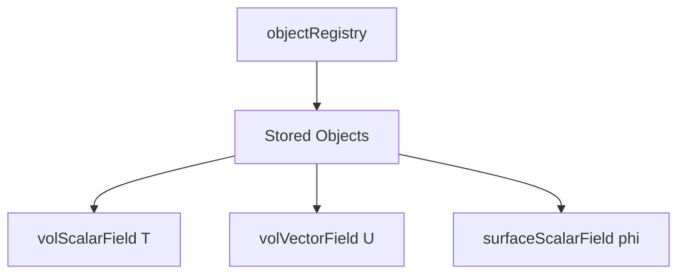

# Object Registry

การจัดการ Objects ใน OpenFOAM

---

## Overview

> **objectRegistry** = Database for storing and retrieving objects by name



---

## 1. Hierarchy

```cpp
Time → objectRegistry
fvMesh → objectRegistry
```

- **Time** owns case-level objects
- **fvMesh** owns field-level objects

---

## 2. Registration

### Automatic

```cpp
// Fields register automatically via IOobject
volScalarField T
(
    IOobject
    (
        "T",
        runTime.timeName(),
        mesh,              // Registry
        IOobject::MUST_READ
    ),
    mesh
);
// T is now registered with mesh
```

### Manual

```cpp
// Store in registry
mesh.store(new volScalarField(...));
```

---

## 3. Lookup

```cpp
// Get const reference
const volScalarField& T = mesh.lookupObject<volScalarField>("T");

// Get non-const reference
volScalarField& T = mesh.lookupObjectRef<volScalarField>("T");

// Check existence first
if (mesh.foundObject<volScalarField>("T"))
{
    const volScalarField& T = mesh.lookupObject<volScalarField>("T");
}
```

---

## 4. Common Patterns

### Access in Function Object

```cpp
void myFunctionObject::execute()
{
    const volVectorField& U = mesh_.lookupObject<volVectorField>("U");
    const volScalarField& p = mesh_.lookupObject<volScalarField>("p");
}
```

### Check Before Access

```cpp
if (mesh.foundObject<volScalarField>("epsilon"))
{
    const volScalarField& eps = mesh.lookupObject<volScalarField>("epsilon");
}
else
{
    // Use alternative
}
```

---

## 5. Registry Iteration

```cpp
// Iterate all objects
forAllConstIter(objectRegistry, mesh, iter)
{
    Info << "Object: " << iter.key() << endl;
}

// Find specific type
HashTable<const volScalarField*> scalarFields = 
    mesh.lookupClass<volScalarField>();
```

---

## 6. Object Lifetime

- Objects registered with `AUTO_WRITE` write at output times
- Objects stay registered until explicitly removed or registry destroyed
- Use `store()` for dynamically created objects

---

## Quick Reference

| Method | Description |
|--------|-------------|
| `lookupObject<T>(name)` | Get const reference |
| `lookupObjectRef<T>(name)` | Get mutable reference |
| `foundObject<T>(name)` | Check if exists |
| `store(ptr)` | Register new object |
| `lookupClass<T>()` | Get all of type T |

---

## Concept Check

<details>
<summary><b>1. IOobject registry parameter ทำอะไร?</b></summary>

**กำหนด objectRegistry** ที่จะ register field นั้น (มักใช้ mesh)
</details>

<details>
<summary><b>2. lookupObject vs lookupObjectRef?</b></summary>

- **lookupObject**: const reference (read only)
- **lookupObjectRef**: mutable reference (can modify)
</details>

<details>
<summary><b>3. ทำไมต้อง foundObject ก่อน lookup?</b></summary>

**ป้องกัน runtime error** ถ้า object ไม่ exists
</details>

---

## Related Documents

- **ภาพรวม:** [00_Overview.md](00_Overview.md)
- **Time Architecture:** [02_Time_Architecture.md](02_Time_Architecture.md)