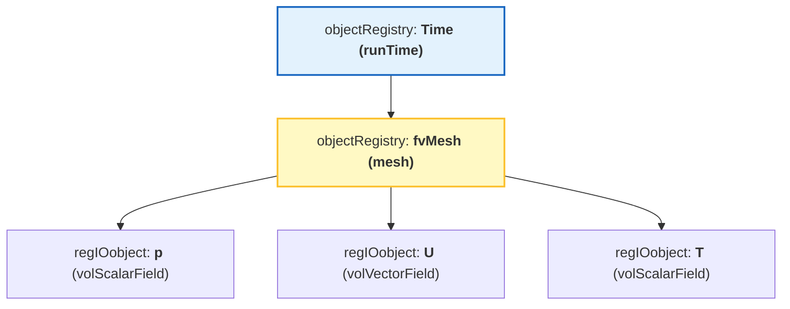
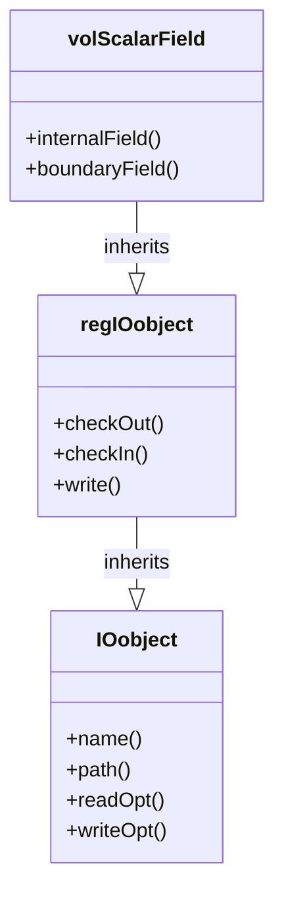

# ระบบฐานข้อมูลออบเจกต์ (Object Registry)

![[central_library_registry.png]]
`A grand library representing the objectRegistry. A librarian is placing a book labeled "volScalarField p" onto a shelf under the "fvMesh" section. Other researchers (Solvers) are using a card catalog to look up data by name, scientific textbook diagram, clean vector line art, white background, high definition, flat design, educational infographic --ar 16:9`

ใน OpenFOAM ออบเจกต์สำคัญต่างๆ (เช่น เมช ฟิลด์ และตารางคุณสมบัติ) จะถูกจัดเก็บไว้ในระบบฐานข้อมูลส่วนกลางที่เรียกว่า **Object Registry** เพื่อให้ส่วนต่างๆ ของโปรแกรมเข้าถึงข้อมูลกันได้โดยไม่ต้องส่งพอยเตอร์ไปมาให้วุ่นวาย

---

## 🏛️ 1. `objectRegistry`: คลังเก็บข้อมูลกลาง

`objectRegistry` เปรียบเสมือน "สมุดโทรศัพท์" หรือ "ตู้ฝากของ" ที่จัดเก็บออบเจกต์แบบลำดับชั้น (Hierarchical):

### 1.1 โครงสร้างลำดับชั้น

- **รูท (Root)**: มักจะเป็นออบเจกต์ `Time` (หรือ `runTime`)
- **โหนดย่อย**: ภายใต้ `runTime` จะมี `fvMesh` (เมช)
- **ออบเจกต์ในเมช**: ภายใต้ `fvMesh` จะมีฟิลด์ต่างๆ เช่น `p`, `U`, `T`


> **Figure 1:** โครงสร้างลำดับชั้นของ Object Registry ใน OpenFOAM ซึ่งจัดเก็บออบเจ็กต์ต่างๆ เช่น เมชและฟิลด์ข้อมูลไว้ภายใต้ศูนย์กลางเดียวเพื่อการเข้าถึงที่สะดวกและเป็นระเบียบความปลอดภัยทางฟิสิกส์ไม่ส่งผลกระทบต่อความเร็วในการจำลอง ผ่านการใช้พลังของ C++ Template Metaprogramming ในการตรวจสอบความสอดคล้องทางมิติทั้งหมดที่ขั้นตอนการคอมไพล์โปรแกรมเพียงครั้งเดียว

### 1.2 การใช้งาน Registry ใน Solver

> [!INFO] การลงทะเบียนอัตโนมัติ
> เมื่อสร้างฟิลด์ด้วย `IOobject` ฟิลด์จะถูกลงทะเบียนใน Registry โดยอัตโนมัติ

```cpp
// การสร้างฟิลด์และลงทะเบียนอัตโนมัติ
volScalarField p
(
    IOobject
    (
        "p",                      // ชื่อฟิลด์
        runTime.timeName(),       // ไดเรกทอรีเวลา
        mesh,                     // การอ้างอิง fvMesh
        IOobject::MUST_READ,      // อ่านจากดิสก์
        IOobject::AUTO_WRITE      // เขียนโดยอัตโนมัติ
    ),
    mesh
);
```

---

## 🔗 2. `regIOobject`: ออบเจกต์ที่ฝากได้

### 2.1 ลำดับชั้นการสืบทอด


> **Figure 2:** แผนผังคลาสแสดงความสัมพันธ์ระหว่าง IOobject และ regIOobject ซึ่งช่วยให้ออบเจ็กต์ต่างๆ มีความสามารถในการจดทะเบียนตัวเองและจัดการการอ่าน/เขียนไฟล์โดยอัตโนมัติความปลอดภัยทางฟิสิกส์ไม่ส่งผลกระทบต่อความเร็วในการจำลอง ผ่านการใช้พลังของ C++ Template Metaprogramming ในการตรวจสอบความสอดคล้องทางมิติทั้งหมดที่ขั้นตอนการคอมไพล์โปรแกรมเพียงครั้งเดียว

### 2.2 ความสามารถของ regIOobject

ออบเจกต์ใดก็ตามที่ต้องการเข้าไปอยู่ใน Registry จะต้องสืบทอดมาจากคลาส **`regIOobject`** ซึ่งมีความสามารถ 2 อย่าง:

1. **Registry Awareness**: สามารถจดทะเบียน (Register) ตัวเองเข้ากับ Registry และถูกค้นหาเจอโดยออบเจกต์อื่น
2. **I/O Capabilities**: รู้วิธีการเขียนตัวเองลงดิสก์ และอ่านตัวเองกลับขึ้นมาเมื่อไฟล์มีการเปลี่ยนแปลง

### 2.3 การ Implement regIOobject

```cpp
class regIOobject : public IOobject {
    // ฟังก์ชันการอ่าน/เขียนอัตโนมัติ
    bool readIfModified();
    bool writeObject(IOstream::streamFormat fmt) const;

    // การจัดการรีจิสทรี
    void checkOut();
    void rename(const word& newName);
};
```

---

## 🔍 3. การค้นหาออบเจกต์ในโค้ด (Lookup)

### 3.1 การค้นหาขั้นพื้นฐาน

นี่คือจุดที่ระบบ Registry แสดงพลัง หากคุณอยู่ในส่วนหนึ่งของโค้ดที่มีเพียงเมช แต่ต้องการใช้ฟิลด์ความดัน `p` คุณสามารถทำได้ดังนี้:

```cpp
// ค้นหาฟิลด์ชื่อ "p" ที่เป็นประเภท volScalarField ในเมช
const volScalarField& p = mesh.lookupObject<volScalarField>("p");
```

### 3.2 ข้อดีของระบบ Lookup

**ข้อดี**:
- **Decoupling**: ส่วนต่างๆ ของโค้ดไม่ต้องรู้จักกันล่วงหน้า แค่รู้ชื่อและประเภทของข้อมูลที่ต้องการก็พอ
- **Automatic Memory Management**: Registry จะช่วยติดตามอายุการใช้งานของออบเจกต์

### 3.3 การค้นหาขั้นสูง

```cpp
// การค้นหาและตรวจสอบว่ามีออบเจกต์อยู่หรือไม่
if (mesh.foundObject<volScalarField>("p")) {
    const volScalarField& p = mesh.lookupObject<volScalarField>("p");
    // ใช้งานฟิลด์ p
}

// การค้นหาใน Time registry
const volVectorField& U = runTime.lookupObject<volVectorField>("U");

// การค้นหาด้วยชื่อไฟล์
const IOobject& ioObj = mesh.lookupObjectRef<IOobject>("transportProperties");
```

---

## ⚙️ 4. กฎเหล็กของ Registry

### 4.1 กฎความเป็นเอกลักษณ์

- **ชื่อต้องไม่ซ้ำ**: ในระดับ Registry เดียวกัน (เช่น ภายใต้เมชตัวเดียวกัน) จะมีออบเจกต์ชื่อซ้ำกันไม่ได้
- **ประเภทต้องตรง**: เมื่อใช้ `lookupObject` คุณต้องระบุประเภทให้ถูกต้อง (เช่น `volScalarField`) มิฉะนั้นโปรแกรมจะแจ้ง Error ทันที

### 4.2 ข้อผิดพลาดทั่วไป

> [!WARNING] ข้อผิดพลาดชื่อซ้ำ
> การพยายามสร้างฟิลด์ที่มีชื่อเดียวกันใน Registry เดียวกันจะทำให้เกิด runtime error

```cpp
// ❌ ERROR: ชื่อซ้ำ
volScalarField p1(..., "p", ...);
volScalarField p2(..., "p", ...);  // ERROR: ชื่อ "p" มีอยู่แล้ว
```

```cpp
// ❌ ERROR: ประเภทไม่ตรง
const volScalarField& p = mesh.lookupObject<volVectorField>("p");  // ERROR!
```

---

## 🏗️ 5. โครงสร้างหน่วยความจำแบบลำดับชั้นของ GeometricField

การจัดระเบียบหน่วยควาจำของ `GeometricField` ทำตามโครงสร้างลำดับชั้นที่แยกการจัดเก็บฟิลด์ภายในจากการจัดการเงื่อนไขขอบเขต:

![[of_field_memory_structure_detailed.png]]
`A detailed memory structure diagram of a GeometricField, showing the internal data array, the dimension set, and the pointer list for boundary conditions (patches), scientific textbook diagram, clean vector line art, white background, high definition, flat design, educational infographic --ar 16:9`

### 5.1 โครงสร้างภายใน GeometricField

```
GeometricField<scalar, fvPatchField, volMesh> (volScalarField representation)
├── DimensionedField<scalar, volMesh> (base class)
│   ├── Field<scalar> data_ = [p₁, p₂, ..., pₙ]  (n = total cells)
│   │   ├── p₁ = pressure at cell center 1
│   │   ├── p₂ = pressure at cell center 2
│   │   └── pₙ = pressure at cell center n
│   ├── dimensionSet dims_ = [1 -2 -2 0 0 0 0] (pressure: M L^-1 T^-2)
│   └── const volMesh& mesh_ (reference to finite volume mesh)
└── GeometricBoundaryField (boundary condition management)
    ├── fvPatchField<scalar>[0] (patch 0: inlet)
    │   ├── Reference to fvPatch (geometric information)
    │   ├── Reference to internalField (coupling to interior)
    │   └── Field<scalar> (values at boundary faces)
    ├── fvPatchField<scalar>[1] (patch 1: outlet)
    ├── fvPatchField<scalar>[2] (patch 2: walls)
    └── ... (n patches total)
```

### 5.2 การตีความทางกายภาพ

พิจารณาฟิลด์ความดัน $p(\mathbf{x}, t)$ ที่ถูกแบ่งส่วนบนตาข่ายการคำนวณ:

- `Field<scalar>` เก็บค่าศูนย์กลางเซลล์: $[p_1, p_2, ..., p_N]$ โดยที่แต่ละ $p_i$ แทนความดันเฉลี่ยในเซลล์ $i$
- `boundaryField_` รักษาค่าความดันที่หน้าขอบเขต: $p_{\text{boundary}}^{(j)}$ สำหรับแต่ละชิ้นส่วนขอบเขต $j$
- `dimensions_` บังคับให้มีความสอดคล้องของมิติ: $[p] = M L^{-1} T^{-2}$

### 5.3 ประสิทธิภาพการดำเนินการ

โครงสร้างนี้ทำให้สามารถดำเนินการแบบเวกเตอร์ได้อย่างมีประสิทธิภาพในขณะที่รักษาการแยกอย่างชัดเจนระหว่างการคำนวณโดเมนจำนวนมากและการรักษาเงื่อนไขขอบเขตเฉพาะทาง

---

## 📊 6. การจัดการเงื่อนไณขอบเขต

### 6.1 สถาปัตยกรรม GeometricBoundaryField

สถาปัตยกรรมเงื่อนไขขอบเขตแสดงให้เห็นถึงแนวทางที่ยืดหยุ่นและขยายได้ของ OpenFOAM ในการจัดการข้อจำกัดทางกายภาพที่หลากหลาย

```cpp
class GeometricBoundaryField {
    PtrList<PatchField<Type>> patches_;  // Dynamic array of boundary patch fields

    // Each fvPatchField<Type> instance contains:
    // - Reference to fvPatch (geometric boundary information)
    // - Reference to internalField (for coupled boundary conditions)
    // - Field<Type> (actual boundary face values)
    // - Virtual methods for boundary condition evaluation
};
```

### 6.2 ประเภทของเงื่อนไขขอบเขต

| ประเภท | OpenFOAM | สมการ | ตัวอย่างการใช้งาน |
|--------|----------|---------|------------------|
| **Dirichlet** | `fixedValue` | $$\phi\|_{\partial\Omega} = \phi_0(\mathbf{x}, t)$$ | อุณหภูมิคงที่: $T = 300\text{ K}$ ที่ผนัง<br>ความเร็วคงที่: $\mathbf{u} = \mathbf{u}_0$ ที่ทางเข้า |
| **Neumann** | `fixedGradient` | $$\frac{\partial \phi}{\partial n}\bigg\|_{\partial\Omega} = q_0(\mathbf{x}, t)$$ | Heat flux: $-k \nabla T \cdot \mathbf{n} = q''$ ที่ผนัง<br>Stress-free: $\boldsymbol{\tau} \cdot \mathbf{n} = \mathbf{0}$ ที่ทางออก |
| **Coupled** | `processor`, `cyclic` | การสื่อสารระหว่างโดเมน | `processor`: ขอบเขตการแบ่งโดเมนสำหรับ MPI<br>`cyclic`: ขอบเขตเป็นระยะ<br>`wallFunction`: การรักษาความปั่นป่วนใกล้ผนัง |

### 6.3 การอัปเดต Boundary Conditions

```cpp
// อัปเดต boundary conditions เสมอก่อนแก้สมการ
forAll(p.boundaryField(), patchi) {
    p.boundaryField()[patchi].updateCoeffs();
}
solve(fvm::laplacian(p) == source);

// หรือใช้รูปแบบที่ง่ายกว่า:
p.correctBoundaryConditions();
```

> [!TIP] การอัปเดต BC
> `updateCoeffs()` ให้ความมั่นใจว่าสัมประสิทธิ์ BC สะท้อนสถานะปัจจุบัน

---

## 🧮 7. การวิเคราะห์มิติ

### 7.1 ระบบ dimensionSet

OpenFOAM ใช้ระบบวิเคราะห์มิติที่ซับซ้อนเพื่อให้แน่ใจว่ามีความสม่ำเสมอทางกายภาพ:

```cpp
dimensionSet dimensions
(
    massExponent,      // kg
    lengthExponent,    // m
    timeExponent,      // s
    temperatureExponent, // K
    molExponent,       // mol
    currentExponent    // A
);

// Example: velocity dimensions [L/T]
dimensionSet velocityDims(0, 1, -1, 0, 0, 0);

// Example: pressure dimensions [M/(L·T²)]
dimensionSet pressureDims(1, -1, -2, 0, 0, 0);
```

### 7.2 การดำเนินการที่ถูกต้อง (สม่ำเสมอทางมิติ)

```cpp
// การประกาศฟิลด์ที่ถูกต้อง
volScalarField pressure(mesh);
pressure.dimensions().reset(dimPressure);

volVectorField velocity(mesh);
velocity.dimensions().reset(dimVelocity);

// การดำเนินการทางคณิตศาสตร์ที่ถูกต้อง
volScalarField kineticEnergy = 0.5 * magSqr(velocity);
surfaceScalarField flux = fvc::interpolate(velocity) & mesh.Sf();
```

### 7.3 ข้อผิดพลาดทางมิติทั่วไป

```cpp
// ข้อผิดพลาด: ไม่สามารถบวกความดันและความเร็วได้ (ไม่ตรงกันทางมิติ)
volScalarField result = pressure + velocity; // ข้อผิดพลาดการคอมไพล์

// ข้อผิดพลาด: การกำหนดค่าระหว่างประเภทฟิลด์ที่แตกต่างกัน
volVectorField velField = pressure; // ข้อผิดพลาดการคอมไพล์
```

---

## 🔬 8. การดำเนินการฟิลด์ขั้นสูง

### 8.1 พีชคณิตฟิลด์

OpenFOAM โอเวอร์โหลดตัวดำเนินการทางคณิตศาสตร์สำหรับการดำเนินการฟิลด์ที่เข้าใจง่าย:

```cpp
// Vector operations
volVectorField a = U1 + U2;           // Vector addition
volScalarField magU = mag(U);          // Vector magnitude
volVectorField gradP = fvc::grad(p);   // Pressure gradient

// Tensor operations
volTensorField stress = mu * gradU;    // Stress tensor
volScalarField divergence = tr(gradU); // Trace (divergence)
```

### 8.2 ตัวดำเนินการเชิงอนุพันธ์

การใช้งาน finite volume method ให้ตัวดำเนินการเชิงอนุพันธ์ที่ครอบคลุม:

$$\nabla \cdot (\rho \mathbf{U}) = \text{fvc::div(phi)}$$

- **`rho`** - ความหนาแน่น (density)
- **`U`** - เวกเตอร์ความเร็ว (velocity vector)
- **`phi`** - ฟลักซ์มวล (mass flux)
- **`fvc::div()`** - ตัวดำเนินการ divergence

```cpp
// Divergence operator
surfaceScalarField phi = rho * fvc::interpolate(U) & mesh.Sf();
volScalarField divPhi = fvc::div(phi);

// Gradient operator
volVectorField gradP = fvc::grad(p);

// Laplacian operator
volScalarField laplacianU = fvc::laplacian(nu, U);

// Temporal derivative
volScalarField dUdt = fvc::ddt(U);
```

### 8.3 การแปลและการสร้างฟิลด์ขึ้นใหม่

OpenFOAM ให้การแปลที่ซับซ้อนสำหรับการแปลงระหว่างการแสดงฟิลด์ที่แตกต่างกัน:

```cpp
// Linear interpolation from cell to face centers
surfaceScalarField phi = fvc::interpolate(U) & mesh.Sf();

// Reconstruction from face to cell centers
volVectorField U_reconstructed = fvc::reconstruct(phi);
```

---

## 💾 9. การจัดการหน่วยความจำและประสิทธิภาพ

### 9.1 การนับรีเฟอเรนซ์

OpenFOAM ใช้พอยน์เตอร์ที่นับรีเฟอเรนซ์สำหรับการจัดการหน่วยความจำที่มีประสิทธิภาพ:

```cpp
tmp<volScalarField> tT(new volScalarField(IOobject(...), mesh));
volScalarField& T = tT();  // Automatic reference management
```

### 9.2 คลาส `tmp`: Reference Counting สำหรับ Temporary Fields

```cpp
template<class T>
class tmp {
private:
    mutable T* ptr_;
    mutable bool refCount_;

public:
    // Constructor from raw pointer (takes ownership)
    tmp(T* p, bool transfer = true) : ptr_(p), refCount_(!transfer) {}

    // Destructor manages cleanup based on reference count
    ~tmp() {
        if (ptr_ && !refCount_) delete ptr_;
    }

    // Automatic conversion to underlying type
    operator T&() const { return *ptr_; }
    T& operator()() const { return *ptr_; }
};
```

### 9.3 การดำเนินการพีชคณิต Field อย่างมีประสิทธิภาพ

```cpp
// tmp enables efficient temporary field chaining
tmp<volScalarField> magU = mag(U);                    // Creates temporary
tmp<volScalarField> magU2 = sqr(magU);               // Reuses temporary without copy
tmp<volVectorField> gradP = fvc::grad(p);            // Automatic cleanup

// Field operations return tmp objects for efficiency
tmp<volScalarField> divPhi = fvc::div(phi);          // Temporary divergence field
tmp<volVectorField> U2 = U + U;                      // Temporary sum field
```

---

## 🎯 10. การจัดการเวลา

### 10.1 สถาปัตยกรรมการจัดการเวลา

OpenFOAM ใช้ระบบการจัดการเวลาที่ซับซ้อน ซึ่งช่วยให้ temporal discretization ที่แม่นยำในขณะเดียวกันรักษาประสิทธิภาพการคำนวณ

```cpp
void GeometricField::storeOldTime() {
    if (!field0Ptr_) {
        field0Ptr_ = new GeometricField(*this);  // Copy current field
    }
}

scalarField ddt = (p - p.oldTime())/runTime.deltaT();  // ∂p/∂t ≈ Δp/Δt
```

### 10.2 Temporal Schemes และการจัดเก็บ

| Scheme | ระดับเวลาที่ต้องการ | การจัดเก็บ | สมการ |
|--------|---------------------|-------------|----------|
| **Euler implicit** | 1 ระดับ ($p^{n}$) | `field0Ptr_` | $p^{n+1} = p^n + \Delta t \cdot f(p^{n+1})$ |
| **Backward differentiation** | 2 ระดับ ($p^{n}$, $p^{n-1}$) | `oldTime()` ซ้อนกัน | - |
| **Crank-Nicolson** | 2 ระดับ | การถ่วงน้ำหนัก | $p^{n+\frac{1}{2}} = \frac{1}{2}(p^n + p^{n+1})$ |

### 10.3 การคำนวณอนุพันธ์เชิงเวลา

ตามการประมาณค่า finite-difference มาตรฐาน:
$$\frac{\partial p}{\partial t} \approx \frac{p^{n+1} - p^n}{\Delta t}$$

---

## 🐛 11. เคล็ดลับการ Debug

### 11.1 การตรวจสอบมิติ

```cpp
// 1. ตรวจสอบมิติฟิลด์
Info << "p dimensions: " << p.dimensions() << nl;
```

**มิติที่คาดหวังสำหรับฟิลด์ทั่วไป:**

| ฟิลด์ | ตัวแปร | มิติ | หน่วย SI |
|--------|---------|-------|-----------|
| ความเร็ว | `$\mathbf{u}$` | `[L·T^{-1}]` | `[m/s]` |
| ความดัน | `$p$` | `[M·L^{-1}·T^{-2}]` | `[Pa]` |
| อุณหภูมิ | `$T$` | `[$\Theta$]` | `[K]` |
| ความหนาแน่น | `$\rho$` | `[M·L^{-3}]` | `[kg/m³]` |

### 11.2 การตรวจสอบการเชื่อมโยง Mesh

```cpp
// 2. ตรวจสอบการเชื่อมโยง mesh
Info << "p mesh has " << p.mesh().nCells() << " cells" << nl;
```

**การตรวจสอบความเข้ากันได้ของ mesh:**
```cpp
// การตรวจสอบความเข้ากันได้ของ mesh อย่างครบถ้วน
bool verifyMeshCompatibility(const volScalarField& a, const volScalarField& b) {
    return &a.mesh() == &b.mesh() &&
           a.size() == b.size() &&
           a.mesh().nCells() == b.mesh().nCells();
}
```

### 11.3 การตรวจสอบ Boundary Condition

```cpp
// 3. ตรวจสอบ boundary conditions
forAll(p.boundaryField(), patchi) {
    Info << "Patch " << patchi << ": " << p.boundaryField()[patchi].type() << nl;
}
```

### 11.4 การตรวจสอบความถูกต้องของสถิติฟิลด์

```cpp
// 4. ตรวจสอบความถูกต้องของสถิติฟิลด์
Info << "p min: " << min(p) << " max: " << max(p) << " avg: " << average(p) << nl;
```

---

## 📝 12. สรุป

ระบบ Object Registry คือสิ่งที่ทำให้ OpenFOAM มีความเป็นโมดูลาร์ (Modularity) สูง ช่วยให้นักพัฒนาสามารถเขียนปลั๊กอินหรือโมเดลใหม่ๆ ที่สามารถ "คุย" กับส่วนอื่นๆ ของโซลเวอร์ได้อย่างราบรื่น

### ประโยชน์หลัก:

1. **Decoupling**: ส่วนต่างๆ ของโค้ดไม่ต้องรู้จักกันล่วงหน้า
2. **Automatic Memory Management**: Registry จะช่วยติดตามอายุการใช้งานของออบเจกต์
3. **Type Safety**: ระบบตรวจสอบประเภทที่เข้มงวด
4. **Dimensional Consistency**: การวิเคราะห์มิติอัตโนมัติ
5. **Flexible I/O**: การจัดการไฟล์อัตโนมัติ

ระบบนี้เป็นพื้นฐานที่จำเป็นสำหรับความแม่นยำของการจำลองเชิงตัวเลขและประสิทธิภาพการคำนวณ
