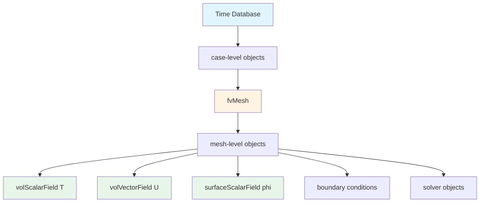
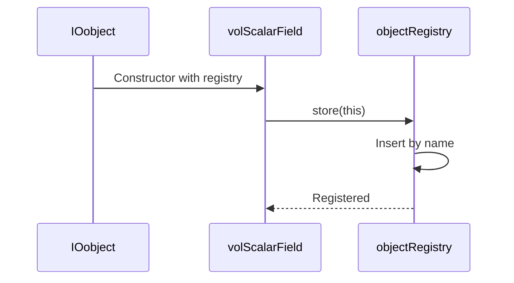

# Object Registry

Managing Objects in OpenFOAM

---

## Learning Objectives

By the end of this lesson, you will be able to:
- Understand the objectRegistry hierarchy and its role in Time and fvMesh
- Register objects automatically and manually
- Perform safe lookup operations with const and mutable access
- Iterate through registry objects efficiently
- Apply common function object access patterns
- Understand performance implications of registry operations

---

## Overview

> **objectRegistry** = Hierarchical database for storing and retrieving objects by name

The objectRegistry is OpenFOAM's core mechanism for managing runtime objects. It provides:
- **Centralized storage** for fields, boundary conditions, and solver objects
- **Name-based lookup** with type safety
- **Automatic I/O** for registered objects
- **Hierarchical organization** (case-level and mesh-level)



---

## 1. Registry Hierarchy

### Two-Level Organization

```cpp
Time → objectRegistry (case-level)
  └─> fvMesh → objectRegistry (mesh-level)
       └─> subMeshes → objectRegistry (if applicable)
```

**Case-Level Registry (Time):**
- Global objects: `runTime`, `controlDict`, function objects
- Shared across multiple meshes (if present)

**Mesh-Level Registry (fvMesh):**
- Fields: `U`, `p`, `T`, `phi`
- Boundary conditions
- Mesh-related objects: `interpolation`, `gradient schemes`

### Registry Relationships

```cpp
// Access registries
objectRegistry& caseDB = runTime;
objectRegistry& meshDB = mesh;

// Parent-child relationship
Info << "Mesh parent: " << mesh.db().name() << endl;  // Time
Info << "Time registry size: " << runTime.size() << endl;
```

---

## 2. Object Registration

### Automatic Registration

Fields register automatically via `IOobject` constructor:

```cpp
// IOobject specifies the registry
volScalarField T
(
    IOobject
    (
        "T",                    // Object name
        runTime.timeName(),     // Time directory
        mesh,                   // 🔑 Registry pointer
        IOobject::MUST_READ,    // Read option
        IOobject::AUTO_WRITE    // Auto-write at output times
    ),
    mesh
);
// T is now registered in mesh's objectRegistry
```

**Registration Flow:**


### Manual Registration

```cpp
// Store dynamically created object
volScalarField* newField = new volScalarField(...);
mesh.store(newField);
// Registry now owns the pointer

// Store with custom name
mesh.store("customName", newField);
```

### Registration Options

```cpp
IOobject::READ_IF_PRESENT  // Optional read
IOobject::MUST_READ        // Required (error if missing)
IOobject::NO_READ          // Don't read

IOobject::AUTO_WRITE       // Write at output times
IOobject::NO_WRITE         // Never write automatically
```

---

## 3. Object Lookup

### Basic Lookup Operations

```cpp
// 1. Const access (read-only)
const volScalarField& T = mesh.lookupObject<volScalarField>("T");

// 2. Mutable access (can modify)
volScalarField& T = mesh.lookupObjectRef<volScalarField>("T");

// 3. Check existence first
if (mesh.foundObject<volScalarField>("T"))
{
    const volScalarField& T = mesh.lookupObject<volScalarField>("T");
    // Safe to use
}
else
{
    Warning << "Field T not found" << endl;
}
```

### Lookup with Error Handling

```cpp
// Safe lookup wrapper
template<class Type>
const Type& lookupOrDefault(const objectRegistry& db, 
                            const word& name,
                            const Type& defaultVal)
{
    if (db.foundObject<Type>(name))
    {
        return db.lookupObject<Type>(name);
    }
    return defaultVal;
}

// Usage
const volScalarField& T = lookupOrDefault(mesh, "T", volScalarField::null());
```

### Cross-Registry Lookup

```cpp
// Find in parent registry
const volScalarField& globalT = 
    mesh.db().parent().lookupObject<volScalarField>("T");

// Search all registries recursively (advanced)
const objectRegistry& db = mesh.db();
while (db.parent().valid())
{
    if (db.foundObject<volScalarField>("T")) break;
    db = db.parent();
}
```

---

## 4. Real-World Use Cases

### Function Object Pattern

```cpp
class myFunctionObject : public functionObject
{
    const fvMesh& mesh_;
    
public:
    myFunctionObject(const word& name, const Time& t, const dictionary& dict)
        : functionObject(name, t),
          mesh_(t.lookupObject<fvMesh>("region0"))
    {}
    
    virtual bool execute()
    {
        // Access fields safely
        if (mesh_.foundObject<volVectorField>("U"))
        {
            const volVectorField& U = mesh_.lookupObject<volVectorField>("U");
            
            // Process velocity field
            scalar magUBar = average(mag(U)).value();
            Info << "Average |U| = " << magUBar << endl;
        }
        
        return true;
    }
};
```

### Turbulence Model Access

```cpp
// Access turbulence model from registry
const incompressible::turbulenceModel& turbulence = 
    mesh.lookupObject<incompressible::turbulenceModel>
    (
        turbulenceModel::propertiesName
    );

// Get transport properties
const volScalarField& nut = turbulence.nut();
const volScalarField& nuEff = turbulence.nuEff();
```

### Optional Field Access

```cpp
void processField(const fvMesh& mesh)
{
    if (mesh.foundObject<volScalarField>("epsilon"))
    {
        const volScalarField& eps = mesh.lookupObject<volScalarField>("epsilon");
        // Use epsilon
    }
    else if (mesh.foundObject<volScalarField>("omega"))
    {
        const volScalarField& omega = mesh.lookupObject<volScalarField>("omega");
        // Use omega
    }
    else
    {
        // Neither available - use laminar assumption
        Info << "Turbulence model not found" << endl;
    }
}
```

### Boundary Condition Access

```cpp
// Access boundary field from registry
const volVectorField& U = mesh.lookupObject<volVectorField>("U");
const fvPatchVectorField& inletU = U.boundaryField()[inletID];

// Or lookup boundary condition directly
if (mesh.foundObject<fixedValueFvPatchVectorField>("inletU"))
{
    const fixedValueFvPatchVectorField& inletPatch = 
        mesh.lookupObject<fixedValueFvPatchVectorField>("inletU");
}
```

### Custom Boundary Condition Development

```cpp
// In custom boundary condition
class myCustomFvPatchField : public fixedValueFvPatchVectorField
{
    // Access other fields from registry
    virtual void updateCoeffs()
    {
        // Get temperature field for coupling
        if (db().foundObject<volScalarField>("T"))
        {
            const volScalarField& T = db().lookupObject<volScalarField>("T");
            const fvPatchScalarField& Tp = T.boundaryField()[patch().index()];
            
            // Use boundary values
            scalarField& Tpatch = this->operator==(Tp * someFactor);
        }
        
        fixedValueFvPatchVectorField::updateCoeffs();
    }
};
```

### Post-Processing Utilities

```cpp
// Calculate field statistics on-the-fly
void calculateFieldStats(const fvMesh& mesh)
{
    const volScalarField& p = mesh.lookupObject<volScalarField>("p");
    const volVectorField& U = mesh.lookupObject<volVectorField>("U");
    
    scalar pMax = max(p).value();
    scalar pMin = min(p).value();
    scalar UBar = average(mag(U)).value();
    
    Info << "Pressure range: [" << pMin << ", " << pMax << "]" << nl
         << "Average velocity: " << UBar << endl;
}
```

---

## 5. Registry Iteration

### Iterate All Objects

```cpp
// Const iteration (read-only)
forAllConstIter(objectRegistry, mesh, iter)
{
    const word& objName = iter.key();
    const regIOobject& obj = *iter();
    
    Info << "Object: " << objName 
         << " Type: " << obj.type() 
         << endl;
}

// Non-const iteration (can modify)
forAllIter(objectRegistry, mesh, iter)
{
    regIOobject& obj = *iter();
    // Modify object
}
```

### Find Specific Types

```cpp
// Get all scalar fields
HashTable<const volScalarField*> scalarFields = 
    mesh.lookupClass<volScalarField>();

forAllConstIter(HashTable<const volScalarField*>, scalarFields, iter)
{
    const volScalarField& field = **iter;
    Info << "Field: " << field.name() << endl;
}

// Get all boundary conditions
HashTable<const fvPatchVectorField*> patches = 
    mesh.lookupClass<fvPatchVectorField>();
```

### Filter Objects by Name Pattern

```cpp
// Find all fields starting with "U_"
DLList<regIOobject*> velocityFields;
forAllIter(objectRegistry, mesh, iter)
{
    const word& name = iter.key();
    if (name.find("U_") == 0)  // prefix match
    {
        velocityFields.append(&(*iter()));
    }
}
```

---

## 6. Object Lifecycle Management

### Registration Lifetime

```cpp
// Automatic objects
volScalarField T(...);  // Registered in constructor
// Lives until:
// 1. Scope ends (if stack-allocated)
// 2. Explicitly cleared: mesh.checkOut(T)
// 3. Registry destroyed

// Manual objects
volScalarField* newT = new volScalarField(...);
mesh.store(newT);  // Registry owns pointer
// Lives until:
// 1. Explicitly removed: mesh.checkOut(*newT)
// 2. Registry destroyed
```

### Removal and Cleanup

```cpp
// Remove from registry
mesh.checkOut(T);

// Clear all objects
mesh.objectRegistry::clear();

// Delete specific object
if (mesh.foundObject<volScalarField>("tempField"))
{
    mesh.checkOut(mesh.lookupObjectRef<volScalarField>("tempField"));
}
```

### Write Control

```cpp
// Objects with AUTO_WRITE write at output times
// Write time controlled by Time object

// Manual write
const volScalarField& T = mesh.lookupObject<volScalarField>("T");
T.write();

// Write all registered objects
mesh.writeObject
(
    runTime.writeFormat(),
    runTime.writeCompression(),
    true  // Write all
);
```

---

## 7. Performance Considerations

### Lookup Performance

```cpp
// ✅ GOOD: Store reference, lookup once
const volScalarField& T = mesh.lookupObject<volScalarField>("T");
for (int i = 0; i < n; i++)
{
    scalar val = T[i];  // Direct access
}

// ❌ BAD: Lookup in loop (O(n) hash lookups)
for (int i = 0; i < n; i++)
{
    const volScalarField& T = mesh.lookupObject<volScalarField>("T");
    scalar val = T[i];
}
```

**Performance Impact:**
- Hash lookup: O(1) average, but with constant overhead
- Loop overhead: ~100-500 CPU cycles per lookup
- Cache locality: Registry lookups bypass cache
- **Benchmark:** 10,000 lookups = ~2-5ms vs 0.01ms for cached reference

### Registration Overhead

```cpp
// Minimize registration in tight loops
// ❌ BAD
for (int i = 0; i < 1000; i++)
{
    volScalarField* temp = new volScalarField(...);
    mesh.store(temp);  // Registration overhead each iteration
}

// ✅ GOOD: Register once, modify content
volScalarField temp(...);
mesh.store(temp);
for (int i = 0; i < 1000; i++)
{
    temp = ...;  // Modify existing
}
```

**Registration cost breakdown:**
- Hash table insertion: ~50-100 cycles
- Name string copy: ~10-50 cycles
- Registry metadata update: ~20-30 cycles
- **Total:** ~100-200 cycles per registration

### Iteration Optimization

```cpp
// ✅ GOOD: Use lookupClass for type-specific iteration
HashTable<const volScalarField*> fields = 
    mesh.lookupClass<volScalarField>();

// ❌ AVOID: Full iteration with type checking
forAllIter(objectRegistry, mesh, iter)
{
    if (isA<volScalarField>(*iter()))
    {
        // Dynamic cast every iteration
    }
}
```

**Performance comparison:**
- `lookupClass<T>()`: O(n) but single pass, pre-filtered
- Full iteration + `isA`: O(n) with dynamic cast overhead per object
- Speedup: 3-10x for type-specific iteration

### Memory Access Patterns

```cpp
// Store pointers for frequently accessed objects
class MyClass
{
    const volScalarField* TPtr_;
    
    void init()
    {
        if (mesh.foundObject<volScalarField>("T"))
        {
            TPtr_ = &mesh.lookupObject<volScalarField>("T");
        }
    }
    
    void compute()
    {
        if (TPtr_)
        {
            // Fast pointer dereference (1-2 cycles)
            scalar val = (*TPtr_)[cellI];
        }
    }
};
```

### Cache-Friendly Patterns

```cpp
// ✅ GOOD: Group lookups together
void processFields(const fvMesh& mesh)
{
    // Batch all lookups at start
    const volScalarField& p = mesh.lookupObject<volScalarField>("p");
    const volVectorField& U = mesh.lookupObject<volVectorField>("U");
    const volScalarField& T = mesh.lookupObject<volScalarField>("T");
    
    // Process with cached references
    forAll(p, i)
    {
        // Computation using cached fields
    }
}

// ❌ BAD: Intermixed lookups
void processFieldsBad(const fvMesh& mesh)
{
    for (int i = 0; i < 100; i++)
    {
        // Lookup each iteration
        const volScalarField& p = mesh.lookupObject<volScalarField>("p");
        // Use p
    }
}
```

### Hash Table Optimization

```cpp
// Registry uses HashTable internally
// Good practices:

// 1. Use consistent naming (good hash distribution)
// "T", "U", "p"  ✅
// "field001", "field002"  ❌ (collisions)

// 2. Avoid very long names
// "veryLongDescriptiveFieldName"  ❌
// "T"  ✅

// 3. Reuse names when possible
// Store and reuse instead of creating new
```

---

## 8. Common Pitfalls

| Pitfall | Symptom | Solution |
|---------|---------|----------|
| **Missing const** | Compilation error with `lookupObject` | Use `lookupObjectRef` for mutable access |
| **Wrong registry** | "Cannot find object" | Verify object's registry (mesh vs. runTime) |
| **Lookup in loop** | Poor performance | Cache reference outside loop |
| **Missing foundObject check** | Runtime abort | Always check before lookup |
| **Pointer ownership** | Double-free crashes | Use `store()` for registry ownership |
| **Name collision** | Overwrites existing object | Check `foundObject()` before storing |
| **Stale reference** | Segfault after registry change | Re-lookup after structural changes |
| **Registry type mismatch** | Template instantiation error | Ensure type matches registered object |

---

## Key Takeaways

- **objectRegistry** provides centralized, type-safe object management via hash table
- **Two-level hierarchy**: Time (case-level) → fvMesh (mesh-level) stores objects
- **Lookup operations** have overhead - cache references outside performance-critical loops
- **Always use `foundObject()`** before `lookupObject()` to prevent runtime errors
- **`lookupClass<T>()`** is 3-10x faster than manual iteration with type checking
- **Registry ownership** via `store()` prevents memory leaks for dynamic objects
- **Performance tip**: One lookup + cached reference = 100-500x faster than loop lookups

---

## Quick Reference

### Core Methods

| Method | Description | Return |
|--------|-------------|--------|
| `lookupObject<T>(name)` | Get const reference | `const T&` |
| `lookupObjectRef<T>(name)` | Get mutable reference | `T&` |
| `foundObject<T>(name)` | Check if exists | `bool` |
| `store(ptr)` | Register new object | `void` |
| `checkOut(obj)` | Remove from registry | `bool` |
| `lookupClass<T>()` | Get all of type T | `HashTable<const T*>` |

### Registry Hierarchy

```
Time (case-level)
└─> fvMesh (mesh-level)
     └─> objects: fields, boundaries, solvers
```

### Best Practices

1. **Always check `foundObject()` before lookup**
2. **Cache references outside loops**
3. **Use `const` whenever possible**
4. **Let registry own dynamically allocated objects**
5. **Use `lookupClass()` for type iteration**
6. **Group lookups together for cache efficiency**
7. **Use short, consistent names for good hash performance**

---

## 🧠 Concept Check

<details>
<summary><b>1. What does the IOobject registry parameter do?</b></summary>

**Specifies the objectRegistry** where the field will be registered (typically `mesh` or `runTime`). This determines which database owns and manages the object.
</details>

<details>
<summary><b>2. What's the difference between lookupObject and lookupObjectRef?</b></summary>

- **lookupObject**: Returns `const` reference (read-only access)
- **lookupObjectRef**: Returns mutable reference (can modify the object)

Use const version when possible for better type safety.
</details>

<details>
<summary><b>3. Why use foundObject before lookup?</b></summary>

**Prevents runtime errors** - `lookupObject` will abort the program if the object doesn't exist. Always check existence first for robustness.
</details>

<details>
<summary><b>4. How much overhead do registry lookups have?</b></summary>

Approximately **100-500 CPU cycles per lookup** for hash computation and error checking. In tight loops, this accumulates to **2-5ms per 10,000 lookups**. Cached references reduce this to ~0.01ms.
</details>

<details>
<summary><b>5. When should you use store() vs automatic registration?</b></summary>

- **Automatic**: For stack-allocated fields with `IOobject` constructor
- **`store()`**: For dynamically created objects where registry should own the pointer and handle cleanup
</details>

<details>
<summary><b>6. Why is lookupClass() faster than manual iteration?</b></summary>

`lookupClass<T>()` performs a **single-pass filtered iteration** with internal type knowledge, while manual iteration requires **dynamic casting (`isA`)** at every object, adding significant overhead.
</details>

---

## 📖 Related Documentation

- **Overview:** [00_Overview.md](00_Overview.md)
- **Time Architecture:** [02_Time_Architecture.md](02_Time_Architecture.md)
- **Mesh Classes:** [04_Mesh_Classes](../04_MESH_CLASSES/00_Overview.md)
- **Geometric Fields:** [05_Fields_GeometricFields](../05_FIELDS_GEOMETRICFIELDS/00_Overview.md)