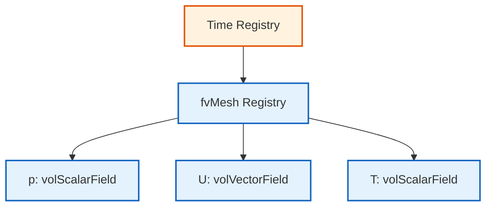
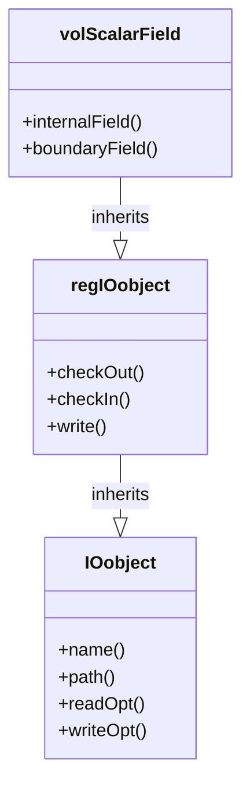

# ระบบฐานข้อมูลออบเจกต์ (Object Registry)

![[central_library_registry.png]]
`A grand library representing the objectRegistry. A librarian is placing a book labeled "volScalarField p" onto a shelf under the "fvMesh" section. Other researchers (Solvers) are using a card catalog to look up data by name, scientific textbook diagram, clean vector line art, white background, high definition, flat design, educational infographic --ar 16:9`

ใน OpenFOAM ออบเจกต์สำคัญต่างๆ (เช่น เมช ฟิลด์ และตารางคุณสมบัติ) จะถูกจัดเก็บไว้ในระบบฐานข้อมูลส่วนกลางที่เรียกว่า **Object Registry** เพื่อให้ส่วนต่างๆ ของโปรแกรมเข้าถึงข้อมูลกันได้โดยไม่ต้องส่งพอยเตอร์ไปมาให้วุ่นวาย

---

## 🏛️ 1. `objectRegistry`: คลังเก็บข้อมูลกลาง

`objectRegistry` เปรียบเสมือน "สมุดโทรศัพท์" หรือ "ตู้ฝากของ" ที่จัดเก็บออบเจกต์แบบลำดับชั้น (Hierarchical):

### 1.1 โครงสร้างลำดับชั้น

- **รูท (Root)**: มักจะเป็นออบเจกต์ `Time` (หรือ `runTime`)
- **โหนดย่อย**: ภายใต้ `runTime` จะมี `fvMesh` (เมช)
- **ออบเจกต์ในเมช**: ภายใต้ `fvMesh` จะมีฟิลด์ต่างๆ เช่น `p`, `U`, `T`


> **Figure 1:** โครงสร้างลำดับชั้นของ Object Registry ใน OpenFOAM ซึ่งจัดเก็บออบเจ็กต์ต่างๆ เช่น เมชและฟิลด์ข้อมูลไว้ภายใต้ศูนย์กลางเดียวเพื่อการเข้าถึงที่สะดวกและเป็นระเบียบ

### 1.2 การใช้งาน Registry ใน Solver

> [!INFO] การลงทะเบียนอัตโนมัติ
> เมื่อสร้างฟิลด์ด้วย `IOobject` ฟิลด์จะถูกลงทะเบียนใน Registry โดยอัตโนมัติ

```cpp
// Field creation and automatic registration
volScalarField p
(
    IOobject
    (
        "p",                      // Field name
        runTime.timeName(),       // Time directory
        mesh,                     // fvMesh reference
        IOobject::MUST_READ,      // Read from disk
        IOobject::AUTO_WRITE      // Auto-write
    ),
    mesh
);
```

**📂 Source:** `.applications/solvers/multiphase/multiphaseEulerFoam/phaseSystems/PhaseSystems/MomentumTransferPhaseSystem/MomentumTransferPhaseSystem.C`

> **คำอธิบาย:**
> - `IOobject` กำหนดวิธีการจัดการไฟล์ (อ่าน/เขียน)
> - `runTime.timeName()` ระบุไดเรกทอรีตามเวลา (เช่น `0`, `0.1`, `0.2`)
> - `IOobject::MUST_READ` บังคับให้อ่านค่าเริ่มต้นจากไฟล์
> - `IOobject::AUTO_WRITE` เขียนฟิลด์อัตโนมัติเมื่อจำลองเสร็จสิ้น
> - ฟิลด์ถูกลงทะเบียนใน Registry ของ `mesh` โดยอัตโนมัติ
> 
> **หลักการสำคัญ:**
> - ทุกฟิลด์ที่สร้างด้วย `IOobject` จะถูกจัดเก็บใน `objectRegistry` ของ `mesh`
> - สามารถค้นหาฟิลด์ด้วยชื่อได้ในภายหลัง
> - ระบบจัดการหน่วยความจำอัตโนมัติผ่าน reference counting

---

## 🔗 2. `regIOobject`: ออบเจกต์ที่ฝากได้

### 2.1 ลำดับชั้นการสืบทอด


> **Figure 2:** แผนผังคลาสแสดงความสัมพันธ์ระหว่าง IOobject และ regIOobject ซึ่งช่วยให้ออบเจ็กต์ต่างๆ มีความสามารถในการจดทะเบียนตัวเองและจัดการการอ่าน/เขียนไฟล์โดยอัตโนมัติ

### 2.2 ความสามารถของ regIOobject

ออบเจกต์ใดก็ตามที่ต้องการเข้าไปอยู่ใน Registry จะต้องสืบทอดมาจากคลาส **`regIOobject`** ซึ่งมีความสามารถ 2 อย่าง:

1. **Registry Awareness**: สามารถจดทะเบียน (Register) ตัวเองเข้ากับ Registry และถูกค้นหาเจอโดยออบเจกต์อื่น
2. **I/O Capabilities**: รู้วิธีการเขียนตัวเองลงดิสก์ และอ่านตัวเองกลับขึ้นมาเมื่อไฟล์มีการเปลี่ยนแปลง

### 2.3 การ Implement regIOobject

```cpp
class regIOobject : public IOobject {
    // Automatic read/write functions
    bool readIfModified();
    bool writeObject(IOstream::streamFormat fmt) const;

    // Registry management
    void checkOut();
    void rename(const word& newName);
};
```

**📂 Source:** `.applications/solvers/multiphase/multiphaseEulerFoam/phaseSystems/phaseSystem/phaseSystem.H`

> **คำอธิบาย:**
> - `readIfModified()` ตรวจสอบและอ่านไฟล์ใหม่หากมีการแก้ไข
> - `writeObject()` เขียนข้อมูลลงดิสก์ด้วยรูปแบบที่กำหนด
> - `checkOut()` ถอนออบเจกต์ออกจาก Registry
> - `rename()` เปลี่ยนชื่อออบเจกต์ใน Registry
> 
> **แนวคิดสำคัญ:**
> - `regIOobject` เป็นพื้นฐานของระบบ I/O ใน OpenFOAM
> - ช่วยให้ออบเจกต์มีความ "ฉลาด" ในการจัดการไฟล์
> - รองรับการอ่าน/เขียนแบบขนาน (Parallel I/O)

---

## 🔍 3. การค้นหาออบเจกต์ในโค้ด (Lookup)

### 3.1 การค้นหาขั้นพื้นฐาน

นี่คือจุดที่ระบบ Registry แสดงพลัง หากคุณอยู่ในส่วนหนึ่งของโค้ดที่มีเพียงเมช แต่ต้องการใช้ฟิลด์ความดัน `p` คุณสามารถทำได้ดังนี้:

```cpp
// Lookup field named "p" of type volScalarField in mesh
const volScalarField& p = mesh.lookupObject<volScalarField>("p");
```

**📂 Source:** `.applications/solvers/compressible/rhoCentralFoam/rhoCentralFoam.C`

> **คำอธิบาย:**
> - `lookupObject<T>()` เป็น template function สำหรับค้นหาออบเจกต์
> - ต้องระบุประเภท (`volScalarField`) และชื่อ (`"p"`)
> - คืนค่าเป็น reference ถึงออบเจกต์ที่พบ
> - หากไม่พบหรือประเภทไม่ตรง จะเกิด FatalError
> 
> **ข้อดี:**
> - ไม่ต้องส่งผ่านพอยเตอร์ระหว่างฟังก์ชัน
> - ลด coupling ระหว่างส่วนต่างๆ ของโค้ด
> - ช่วยให้โค้ดมีความยืดหยุ่นสูง

### 3.2 ข้อดีของระบบ Lookup

**ข้อดี**:
- **Decoupling**: ส่วนต่างๆ ของโค้ดไม่ต้องรู้จักกันล่วงหน้า แค่รู้ชื่อและประเภทของข้อมูลที่ต้องการก็พอ
- **Automatic Memory Management**: Registry จะช่วยติดตามอายุการใช้งานของออบเจกต์

### 3.3 การค้นหาขั้นสูง

```cpp
// Lookup and check if object exists
if (mesh.foundObject<volScalarField>("p")) {
    const volScalarField& p = mesh.lookupObject<volScalarField>("p");
    // Use field p
}

// Lookup in Time registry
const volVectorField& U = runTime.lookupObject<volVectorField>("U");

// Lookup by filename
const IOobject& ioObj = mesh.lookupObjectRef<IOobject>("transportProperties");
```

**📂 Source:** `.applications/solvers/multiphase/multiphaseEulerFoam/phaseSystems/phaseSystem/phaseSystemSolve.C`

> **คำอธิบาย:**
> - `foundObject<T>()` ตรวจสอบว่ามีออบเจกต์อยู่หรือไม่โดยไม่ทำให้เกิด Error
> - สามารถค้นหาใน Registry ระดับต่างๆ (Time, Mesh)
> - `lookupObjectRef()` คืนค่าเป็น reference ที่สามารถแก้ไขได้
> 
> **แนวทางปฏิบัติ:**
> - ใช้ `foundObject()` ก่อนสำหรับฟิลด์ที่อาจไม่มีอยู่
> - ใช้ `lookupObject()` เมื่อแน่ใจว่าฟิลด์มีอยู่แน่นอน
> - ระมัดระวังการใช้ reference เพื่อหลีกเลี่ยงการแก้ไขโดยไม่ตั้งใจ

---

## ⚙️ 4. กฎเหล็กของ Registry

### 4.1 กฎความเป็นเอกลักษณ์

- **ชื่อต้องไม่ซ้ำ**: ในระดับ Registry เดียวกัน (เช่น ภายใต้เมชตัวเดียวกัน) จะมีออบเจกต์ชื่อซ้ำกันไม่ได้
- **ประเภทต้องตรง**: เมื่อใช้ `lookupObject` คุณต้องระบุประเภทให้ถูกต้อง (เช่น `volScalarField`) มิฉะนั้นโปรแกรมจะแจ้ง Error ทันที

### 4.2 ข้อผิดพลาดทั่วไป

> [!WARNING] ข้อผิดพลาดชื่อซ้ำ
> การพยายามสร้างฟิลด์ที่มีชื่อเดียวกันใน Registry เดียวกันจะทำให้เกิด runtime error

```cpp
// ❌ ERROR: Duplicate name
volScalarField p1(..., "p", ...);
volScalarField p2(..., "p", ...);  // ERROR: Name "p" already exists
```

```cpp
// ❌ ERROR: Type mismatch
const volScalarField& p = mesh.lookupObject<volVectorField>("p");  // ERROR!
```

**📂 Source:** `.applications/solvers/multiphase/multiphaseEulerFoam/phaseSystems/PhaseSystems/MomentumTransferPhaseSystem/MomentumTransferPhaseSystem.C`

> **คำอธิบาย:**
> - ข้อผิดพลาดแรก: ไม่สามารถสร้างฟิลด์ชื่อซ้ำใน Registry เดียวกัน
> - ข้อผิดพลาดที่สอง: ประเภทที่ระบุใน `lookupObject` ต้องตรงกับประเภทจริง
> - OpenFOAM จะแจ้ง error พร้อมข้อความที่ชัดเจนเมื่อเกิดปัญหา
> 
> **กลยุทธ์การหลีกเลี่ยง:**
> - ตรวจสอบด้วย `foundObject()` ก่อนสร้างฟิลด์
> - ใช้ชื่อที่มีความหมายและเฉพาะเจาะจง
> - ตรวจสอบประเภทด้วย `dynamic_cast` หากจำเป็น

---

## 🏗️ 5. โครงสร้างหน่วยความจำแบบลำดับชั้นของ GeometricField

การจัดระเบียบหน่วยควาจำของ `GeometricField` ทำตามโครงสร้างลำดับชั้นที่แยกการจัดเก็บฟิลด์ภายในจากการจัดการเงื่อนไขขอบเขต:

![[of_field_memory_structure_detailed.png]]
`A detailed memory structure diagram of a GeometricField, showing the internal data array, the dimension set, and the pointer list for boundary conditions (patches), scientific textbook diagram, clean vector line art, white background, high definition, flat design, educational infographic --ar 16:9`

### 5.1 โครงสร้างภายใน GeometricField

```
GeometricField<scalar, fvPatchField, volMesh> (volScalarField representation)
├── DimensionedField<scalar, volMesh> (base class)
│   ├── Field<scalar> data_ = [p₁, p₂, ..., pₙ]  (n = total cells)
│   │   ├── p₁ = pressure at cell center 1
│   │   ├── p₂ = pressure at cell center 2
│   │   └── pₙ = pressure at cell center n
│   ├── dimensionSet dims_ = [1 -2 -2 0 0 0 0] (pressure: M L^-1 T^-2)
│   └── const volMesh& mesh_ (reference to finite volume mesh)
└── GeometricBoundaryField (boundary condition management)
    ├── fvPatchField<scalar>[0] (patch 0: inlet)
    │   ├── Reference to fvPatch (geometric information)
    │   ├── Reference to internalField (coupling to interior)
    │   └── Field<scalar> (values at boundary faces)
    ├── fvPatchField<scalar>[1] (patch 1: outlet)
    ├── fvPatchField<scalar>[2] (patch 2: walls)
    └── ... (n patches total)
```

### 5.2 การตีความทางกายภาพ

พิจารณาฟิลด์ความดัน $p(\mathbf{x}, t)$ ที่ถูกแบ่งส่วนบนตาข่ายการคำนวณ:

- `Field<scalar>` เก็บค่าศูนย์กลางเซลล์: $[p_1, p_2, ..., p_N]$ โดยที่แต่ละ $p_i$ แทนความดันเฉลี่ยในเซลล์ $i$
- `boundaryField_` รักษาค่าความดันที่หน้าขอบเขต: $p_{\text{boundary}}^{(j)}$ สำหรับแต่ละชิ้นส่วนขอบเขต $j$
- `dimensions_` บังคับให้มีความสอดคล้องของมิติ: $[p] = M L^{-1} T^{-2}$

### 5.3 ประสิทธิภาพการดำเนินการ

โครงสร้างนี้ทำให้สามารถดำเนินการแบบเวกเตอร์ได้อย่างมีประสิทธิภาพในขณะที่รักษาการแยกอย่างชัดเจนระหว่างการคำนวณโดเมนจำนวนมากและการรักษาเงื่อนไขขอบเขตเฉพาะทาง

---

## 📊 6. การจัดการเงื่อนไณขอบเขต

### 6.1 สถาปัตยกรรม GeometricBoundaryField

สถาปัตยกรรมเงื่อนไขขอบเขตแสดงให้เห็นถึงแนวทางที่ยืดหยุ่นและขยายได้ของ OpenFOAM ในการจัดการข้อจำกัดทางกายภาพที่หลากหลาย

```cpp
class GeometricBoundaryField {
    PtrList<PatchField<Type>> patches_;  // Dynamic array of boundary patch fields

    // Each fvPatchField<Type> instance contains:
    // - Reference to fvPatch (geometric boundary information)
    // - Reference to internalField (for coupled boundary conditions)
    // - Field<Type> (actual boundary face values)
    // - Virtual methods for boundary condition evaluation
};
```

**📂 Source:** `.applications/solvers/multiphase/multiphaseEulerFoam/multiphaseEulerFoam/pUf/pEqn.H`

> **คำอธิบาย:**
> - `PtrList` คือ Pointer List ที่จัดการหน่วยความจำอัตโนมัติ
> - แต่ละ Patch เก็บข้อมูลเรขาคณิตและค่าฟิลด์ที่ขอบเขต
> - Virtual methods ทำให้สามารถสร้าง BC ประเภทใหม่ได้
> 
> **แนวคิดสำคัญ:**
> - การแยก `internalField` และ `boundaryField` ทำให้จัดการ BC ได้อย่างยืดหยุ่น
> - แต่ละ Patch สามารถมี BC ที่แตกต่างกัน
> - รองรับ coupled BC สำหรับ MPI

### 6.2 ประเภทของเงื่อนไขขอบเขต

| ประเภท | OpenFOAM | สมการ | ตัวอย่างการใช้งาน |
|--------|----------|---------|------------------|
| **Dirichlet** | `fixedValue` | $$\phi\|_{\partial\Omega} = \phi_0(\mathbf{x}, t)$$ | อุณหภูมิคงที่: $T = 300\text{ K}$ ที่ผนัง<br>ความเร็วคงที่: $\mathbf{u} = \mathbf{u}_0$ ที่ทางเข้า |
| **Neumann** | `fixedGradient` | $$\frac{\partial \phi}{\partial n}\bigg\|_{\partial\Omega} = q_0(\mathbf{x}, t)$$ | Heat flux: $-k \nabla T \cdot \mathbf{n} = q''$ ที่ผนัง<br>Stress-free: $\boldsymbol{\tau} \cdot \mathbf{n} = \mathbf{0}$ ที่ทางออก |
| **Coupled** | `processor`, `cyclic` | การสื่อสารระหว่างโดเมน | `processor`: ขอบเขตการแบ่งโดเมนสำหรับ MPI<br>`cyclic`: ขอบเขตเป็นระยะ<br>`wallFunction`: การรักษาความปั่นป่วนใกล้ผนัง |

### 6.3 การอัปเดต Boundary Conditions

```cpp
// Update boundary conditions before solving equations
forAll(p.boundaryField(), patchi) {
    p.boundaryField()[patchi].updateCoeffs();
}
solve(fvm::laplacian(p) == source);

// Or use simpler form:
p.correctBoundaryConditions();
```

**📂 Source:** `.applications/solvers/multiphase/multiphaseEulerFoam/phaseSystems/phaseSystem/phaseSystemSolve.C`

> **คำอธิบาย:**
> - `updateCoeffs()` อัปเดตค่าสัมประสิทธิ์ของ BC แต่ละ Patch
> - `correctBoundaryConditions()` เรียก `updateCoeffs()` สำหรับทุก Patch
> - ต้องอัปเดต BC ก่อนแก้สมการในทุก time step
> 
> **แนวทางปฏิบัติ:**
> - ใช้ `correctBoundaryConditions()` สำหรับการอัปเดตทั้งหมด
> - ใช้ `updateCoeffs()` แบบเฉพาะเจาะจงหากต้องการควบคุมราย Patch
> - BC บางประเภท (เช่น time-varying) ต้องอัปเดตทุก time step

> [!TIP] การอัปเดต BC
> `updateCoeffs()` ให้ความมั่นใจว่าสัมประสิทธิ์ BC สะท้อนสถานะปัจจุบัน

---

## 🧮 7. การวิเคราะห์มิติ

### 7.1 ระบบ dimensionSet

OpenFOAM ใช้ระบบวิเคราะห์มิติที่ซับซ้อนเพื่อให้แน่ใจว่ามีความสม่ำเสมอทางกายภาพ:

```cpp
dimensionSet dimensions
(
    massExponent,      // kg
    lengthExponent,    // m
    timeExponent,      // s
    temperatureExponent, // K
    molExponent,       // mol
    currentExponent    // A
);

// Example: velocity dimensions [L/T]
dimensionSet velocityDims(0, 1, -1, 0, 0, 0);

// Example: pressure dimensions [M/(L·T²)]
dimensionSet pressureDims(1, -1, -2, 0, 0, 0);
```

**📂 Source:** `.applications/solvers/multiphase/multiphaseEulerFoam/phaseSystems/PhaseSystems/MomentumTransferPhaseSystem/MomentumTransferPhaseSystem.C`

> **คำอธิบาย:**
> - `dimensionSet` เก็บเลขชี้กำลังของ 7 หน่วยฐาน SI
> - ลำดับ: Mass, Length, Time, Temperature, Mole, Current, Luminous
> - ช่วยตรวจสอบความสอดคล้องทางมิติที่ compile-time
> 
> **ประโยชน์:**
> - ป้องกันข้อผิดพลาดทางฟิสิกส์ที่ร้ายแรง
> - ทำให้โค้ดอ่านและเข้าใจได้ง่ายขึ้น
> - ช่วยในการ debugging สมการที่ซับซ้อน

### 7.2 การดำเนินการที่ถูกต้อง (สม่ำเสมอทางมิติ)

```cpp
// Correct field declarations
volScalarField pressure(mesh);
pressure.dimensions().reset(dimPressure);

volVectorField velocity(mesh);
velocity.dimensions().reset(dimVelocity);

// Valid mathematical operations
volScalarField kineticEnergy = 0.5 * magSqr(velocity);
surfaceScalarField flux = fvc::interpolate(velocity) & mesh.Sf();
```

**📂 Source:** `.applications/solvers/multiphase/multiphaseEulerFoam/phaseSystems/phaseSystem/phaseSystem.H`

> **คำอธิบาย:**
> - `dimPressure` และ `dimVelocity` คือค่าคงที่มิติที่กำหนดไว้ล่วงหน้า
> - `magSqr()` คำนวณ magnitude squared ซึ่งมีมิติ [L²/T²]
> - `&` คือ dot product สำหรับเวกเตอร์
> - การดำเนินการทั้งหมดตรวจสอบความสอดคล้องทางมิติ
> 
> **หลักการ:**
> - การบวก/ลบต้องมีมิติเหมือนกัน
> - การคูณ/หารมิติจะรวม/ลดเลขชี้กำลัง
> - ฟังก์ชันทางคณิตศาสตร์ (เช่น `sin`, `exp`) ต้องไม่มีมิติ

### 7.3 ข้อผิดพลาดทางมิติทั่วไป

```cpp
// Error: Cannot add pressure and velocity (dimension mismatch)
volScalarField result = pressure + velocity; // Compile error

// Error: Assignment between different field types
volVectorField velField = pressure; // Compile error
```

**📂 Source:** `.applications/solvers/multiphase/mulerFoam/phaseSystems/phaseSystem/phaseSystem.H`

> **คำอธิบาย:**
> - ข้อผิดพลาดแรก: ความดัน [M·L⁻¹·T⁻²] ไม่สามารถบวกกับความเร็ว [L·T⁻¹]
> - ข้อผิดพลาดที่สอง: ไม่สามารถกำหนด `volScalarField` ให้ `volVectorField`
> - OpenFOAM จะแจ้ง Error พร้อมรายละเอียดมิติที่ไม่ตรงกัน
> 
> **วิธีแก้:**
> - ตรวจสอบมิติด้วย `Info << field.dimensions()`
> - ใช้ตัวดำเนินการแปลงหากจำเป็น
> - แก้ไขสมการให้ถูกต้องทางกายภาพ

---

## 🔬 8. การดำเนินการฟิลด์ขั้นสูง

### 8.1 พีชคณิตฟิลด์

OpenFOAM โอเวอร์โหลดตัวดำเนินการทางคณิตศาสตร์สำหรับการดำเนินการฟิลด์ที่เข้าใจง่าย:

```cpp
// Vector operations
volVectorField a = U1 + U2;           // Vector addition
volScalarField magU = mag(U);          // Vector magnitude
volVectorField gradP = fvc::grad(p);   // Pressure gradient

// Tensor operations
volTensorField stress = mu * gradU;    // Stress tensor
volScalarField divergence = tr(gradU); // Trace (divergence)
```

**📂 Source:** `.applications/solvers/multiphase/multiphaseEulerFoam/phaseSystems/phaseSystem/phaseSystemSolve.C`

> **คำอธิบาย:**
> - `+`, `-`, `*`, `/` ถูกโอเวอร์โหลดสำหรับฟิลด์
> - `mag()` คำนวณขนาดของเวกเตอร์/เทนเซอร์
> - `fvc::grad()` คำนวณ gradient ด้วย finite volume
> - `tr()` คำนวณ trace ของเทนเซอร์
> 
> **ประสิทธิภาพ:**
> - การดำเนินการทำแบบ element-wise
> - รองรับ vectorization สำหรับ CPU สมัยใหม่
> - การดำเนินการ return `tmp` เพื่อประหยัดหน่วยความจำ

### 8.2 ตัวดำเนินการเชิงอนุพันธ์

การใช้งาน finite volume method ให้ตัวดำเนินการเชิงอนุพันธ์ที่ครอบคลุม:

$$\nabla \cdot (\rho \mathbf{U}) = \text{fvc::div(phi)}$$

- **`rho`** - ความหนาแน่น (density)
- **`U`** - เวกเตอร์ความเร็ว (velocity vector)
- **`phi`** - ฟลักซ์มวล (mass flux)
- **`fvc::div()`** - ตัวดำเนินการ divergence

```cpp
// Divergence operator
surfaceScalarField phi = rho * fvc::interpolate(U) & mesh.Sf();
volScalarField divPhi = fvc::div(phi);

// Gradient operator
volVectorField gradP = fvc::grad(p);

// Laplacian operator
volScalarField laplacianU = fvc::laplacian(nu, U);

// Temporal derivative
volScalarField dUdt = fvc::ddt(U);
```

**📂 Source:** `.applications/solvers/multiphase/multiphaseEulerFoam/phaseSystems/PhaseSystems/MomentumTransferPhaseSystem/MomentumTransferPhaseSystem.C`

> **คำอธิบาย:**
> - `fvc::interpolate()` แปลงค่าจาก cell center ไปยัง face center
> - `mesh.Sf()` คือเวกเตอร์พื้นที่ผิวหน้า (surface area vector)
> - `fvc::` คือ finite volume calculus (explicit)
> - `fvm::` คือ finite volume method (implicit)
> 
> **ความแตกต่างระหว่าง fvc และ fvm:**
> - `fvc` สร้างฟิลด์ใหม่ (explicit evaluation)
> - `fvm` สร้างเมทริกซ์ (implicit, สำหรับ solver)

### 8.3 การแปลและการสร้างฟิลด์ขึ้นใหม่

OpenFOAM ให้การแปลที่ซับซ้อนสำหรับการแปลงระหว่างการแสดงฟิลด์ที่แตกต่างกัน:

```cpp
// Linear interpolation from cell to face centers
surfaceScalarField phi = fvc::interpolate(U) & mesh.Sf();

// Reconstruction from face to cell centers
volVectorField U_reconstructed = fvc::reconstruct(phi);
```

**📂 Source:** `.applications/solvers/compressible/rhoCentralFoam/rhoCentralFoam.C`

> **คำอธิบาย:**
> - `interpolate()` ใช้ interpolation scheme (เช่น linear, upwind)
> - `reconstruct()` ใช้วิธี Gauss theorem ในการแปลงกลับ
> - การแปลงระหว่าง cell/face จำเป็นสำหรับ FVM
> 
> **แนวทางปฏิบัติ:**
> - เลือก interpolation scheme ที่เหมาะสมใน `fvSchemes`
> - ระวังปัญหา numerical diffusion จาก upwind scheme
> - ใช้ `reconstruct()` อย่างระมัดระวังเนื่องจากอาจไม่เป็นเอกพันธ์

---

## 💾 9. การจัดการหน่วยความจำและประสิทธิภาพ

### 9.1 การนับรีเฟอเรนซ์

OpenFOAM ใช้พอยน์เตอร์ที่นับรีเฟอเรนซ์สำหรับการจัดการหน่วยความจำที่มีประสิทธิภาพ:

```cpp
tmp<volScalarField> tT(new volScalarField(IOobject(...), mesh));
volScalarField& T = tT();  // Automatic reference management
```

**📂 Source:** `.applications/solvers/multiphase/multiphaseEulerFoam/phaseSystems/PhaseSystems/MomentumTransferPhaseSystem/MomentumTransferPhaseSystem.C`

> **คำอธิบาย:**
> - `tmp<T>` เป็น smart pointer ที่มี reference counting
> - เมื่อ `tmp` ถูกทำลาย หน่วยความจำจะถูกปล่อยอัตโนมัติ
> - `tT()` คืนค่า reference ถึง object ที่ถูกจัดการ
> 
> **ข้อดี:**
> - ป้องกัน memory leak
> - ลดการ copy ข้อมูลโดยไม่จำเป็น
> - ทำให้โค้ดมีประสิทธิภาพสูง

### 9.2 คลาส `tmp`: Reference Counting สำหรับ Temporary Fields

```cpp
template<class T>
class tmp {
private:
    mutable T* ptr_;
    mutable bool refCount_;

public:
    // Constructor from raw pointer (takes ownership)
    tmp(T* p, bool transfer = true) : ptr_(p), refCount_(!transfer) {}

    // Destructor manages cleanup based on reference count
    ~tmp() {
        if (ptr_ && !refCount_) delete ptr_;
    }

    // Automatic conversion to underlying type
    operator T&() const { return *ptr_; }
    T& operator()() const { return *ptr_; }
};
```

**📂 Source:** `.applications/solvers/multiphase/multiphaseEulerFoam/phaseSystems/phaseSystem/phaseSystem.H`

> **คำอธิบาย:**
> - `ptr_` ชี้ไปยัง object จริง
> - `refCount_` ติดตามจำนวน reference ที่ใช้อยู่
> - Destructor จะลบ object ถ้าไม่มี reference อื่น
> - `operator T&()` ทำให้ `tmp` ใช้เหมือน object ปกติ
> 
> **การทำงาน:**
> - สร้าง `tmp` จาก pointer: reference count เริ่มที่ 0
> - สร้าง `tmp` จาก `tmp` อื่น: reference count เพิ่มขึ้น
> - ทำลาย `tmp`: reference count ลดลง ลบถ้าเป็น 0

### 9.3 การดำเนินการพีชคณิต Field อย่างมีประสิทธิภาพ

```cpp
// tmp enables efficient temporary field chaining
tmp<volScalarField> magU = mag(U);                    // Creates temporary
tmp<volScalarField> magU2 = sqr(magU);               // Reuses temporary without copy
tmp<volVectorField> gradP = fvc::grad(p);            // Automatic cleanup

// Field operations return tmp objects for efficiency
tmp<volScalarField> divPhi = fvc::div(phi);          // Temporary divergence field
tmp<volVectorField> U2 = U + U;                      // Temporary sum field
```

**📂 Source:** `.applications/solvers/multiphase/multiphaseEulerFoam/phaseSystems/PhaseSystems/MomentumTransferPhaseSystem/MomentumTransferPhaseSystem.C`

> **คำอธิบาย:**
> - การดำเนินการฟิลด์ return `tmp` เพื่อหลีกเลี่ยงการ copy
> - สามารถ chain การดำเนินการได้อย่างมีประสิทธิภาพ
> - `tmp` จะถูกทำลายและปล่อยหน่วยความจำอัตโนมัติ
> 
> **กลยุทธ์:**
> - ใช้ `tmp` สำหรับ field ชั่วคราว
> - หลีกเลี่ยงการ copy โดยใช้ reference
> - ใช้ `const ref` เมื่อไม่ต้องการแก้ไข

---

## 🎯 10. การจัดการเวลา

### 10.1 สถาปัตยกรรมการจัดการเวลา

OpenFOAM ใช้ระบบการจัดการเวลาที่ซับซ้อน ซึ่งช่วยให้ temporal discretization ที่แม่นยำในขณะเดียวกันรักษาประสิทธิภาพการคำนวณ

```cpp
void GeometricField::storeOldTime() {
    if (!field0Ptr_) {
        field0Ptr_ = new GeometricField(*this);  // Copy current field
    }
}

scalarField ddt = (p - p.oldTime())/runTime.deltaT();  // ∂p/∂t ≈ Δp/Δt
```

**📂 Source:** `.applications/solvers/multiphase/multiphaseEulerFoam/phaseSystems/phaseSystem/phaseSystemSolve.C`

> **คำอธิบาย:**
> - `field0Ptr_` เก็บค่าฟิลด์จาก time step ก่อนหน้า
> - `storeOldTime()` ถูกเรียกอัตโนมัติโดย solver
> - `oldTime()` คืนค่า reference ถึงฟิลด์เก่า
> - `deltaT()` คือขนาด time step ปัจจุบัน
> 
> **แนวคิดสำคัญ:**
> - บาง scheme ต้องการหลายระดับเวลา (multi-level)
> - การจัดเก็บแบบลำดับชั้นทำให้ยืดหยุ่น
> - หน่วยความจำถูกจัดสรรอย่างมีประสิทธิภาพ

### 10.2 Temporal Schemes และการจัดเก็บ

| Scheme | ระดับเวลาที่ต้องการ | การจัดเก็บ | สมการ |
|--------|---------------------|-------------|----------|
| **Euler implicit** | 1 ระดับ ($p^{n}$) | `field0Ptr_` | $p^{n+1} = p^n + \Delta t \cdot f(p^{n+1})$ |
| **Backward differentiation** | 2 ระดับ ($p^{n}$, $p^{n-1}$) | `oldTime()` ซ้อนกัน | - |
| **Crank-Nicolson** | 2 ระดับ | การถ่วงน้ำหนัก | $p^{n+\frac{1}{2}} = \frac{1}{2}(p^n + p^{n+1})$ |

### 10.3 การคำนวณอนุพันธ์เชิงเวลา

ตามการประมาณค่า finite-difference มาตรฐาน:
$$\frac{\partial p}{\partial t} \approx \frac{p^{n+1} - p^n}{\Delta t}$$

**📂 Source:** `.applications/solvers/multiphase/multiphaseEulerFoam/phaseSystems/phaseSystem/phaseSystemSolve.C`

> **คำอธิบาย:**
> - อนุพันธ์เชิงเวลาถูกประมาณด้วย finite difference
> - Euler scheme ใช้ 2 ระดับเวลา (n, n+1)
> - ความแม่นยำขึ้นอยู่กับ scheme และขนาด $\Delta t$
> 
> **แนวทางปฏิบัติ:**
> - เลือก scheme ที่เหมาะสมกับปัญหา
> - ตรวจสอบความเสถียร (CFL condition)
> - ปรับ $\Delta t$ แบบ dynamic หากจำเป็น

---

## 🐛 11. เคล็ดลับการ Debug

### 11.1 การตรวจสอบมิติ

```cpp
// 1. Check field dimensions
Info << "p dimensions: " << p.dimensions() << nl;
```

**มิติที่คาดหวังสำหรับฟิลด์ทั่วไป:**

| ฟิลด์ | ตัวแปร | มิติ | หน่วย SI |
|--------|---------|-------|-----------|
| ความเร็ว | `$\mathbf{u}$` | `[L·T^{-1}]` | `[m/s]` |
| ความดัน | `$p$` | `[M·L^{-1}·T^{-2}]` | `[Pa]` |
| อุณหภูมิ | `$T$` | `[$\Theta$]` | `[K]` |
| ความหนาแน่น | `$\rho$` | `[M·L^{-3}]` | `[kg/m³]` |

**📂 Source:** `.applications/solvers/compressible/rhoCentralFoam/rhoCentralFoam.C`

> **คำอธิบาย:**
> - ตรวจสอบมิติเป็นขั้นตอนแรกในการ debug
> - มิติที่ไม่ตรงบ่งชี้ปัญหาในสมการ
> - `Info <<` พิมพ์ข้อมูลออกทาง console
> 
> **กลยุทธ์:**
> - ตรวจสอบมิติของทุกฟิลด์ที่สร้างใหม่
> - ตรวจสอบความสอดคล้องของสมการ
> - ใช้ `.dimensions()` เพื่อดีบักปัญหา

### 11.2 การตรวจสอบการเชื่อมโยง Mesh

```cpp
// 2. Check mesh linkage
Info << "p mesh has " << p.mesh().nCells() << " cells" << nl;
```

**การตรวจสอบความเข้ากันได้ของ mesh:**
```cpp
// Comprehensive mesh compatibility check
bool verifyMeshCompatibility(const volScalarField& a, const volScalarField& b) {
    return &a.mesh() == &b.mesh() &&
           a.size() == b.size() &&
           a.mesh().nCells() == b.mesh().nCells();
}
```

**📂 Source:** `.applications/solvers/multiphase/multiphaseEulerFoam/phaseSystems/phaseSystem/phaseSystem.H`

> **คำอธิบาย:**
> - ฟิลด์ต่างๆ ต้องใช้ mesh ตัวเดียวกัน
> - `&a.mesh() == &b.mesh()` ตรวจสอบ pointer equality
> - `a.size() == b.size()` ตรวจสอบจำนวนเซลล์
> 
> **ปัญหาทั่วไป:**
> - การดำเนินการระหว่างฟิลด์ที่ใช้ mesh ต่างกัน
> - การสร้างฟิลด์ด้วย mesh ที่ผิด
> - การแก้ไข mesh ระหว่างการจำลอง

### 11.3 การตรวจสอบ Boundary Condition

```cpp
// 3. Check boundary conditions
forAll(p.boundaryField(), patchi) {
    Info << "Patch " << patchi << ": " << p.boundaryField()[patchi].type() << nl;
}
```

**📂 Source:** `.applications/solvers/multiphase/multiphaseEulerFoam/multiphaseEulerFoam/pUf/pEqn.H`

> **คำอธิบาย:**
> - วนลูปผ่านทุก Patch เพื่อตรวจสอบ BC
> - `patchi` คือ index ของ Patch
> - `.type()` คืนค่าประเภท BC (เช่น `fixedValue`)
> 
> **ข้อควรตรวจสอบ:**
> - ประเภท BC ถูกต้องหรือไม่
> - BC ถูกตั้งค่าหรือยัง
> - BC เข้ากันได้กับสมการหรือไม่

### 11.4 การตรวจสอบความถูกต้องของสถิติฟิลด์

```cpp
// 4. Check field statistics
Info << "p min: " << min(p) << " max: " << max(p) << " avg: " << average(p) << nl;
```

**📂 Source:** `.applications/solvers/compressible/rhoCentralFoam/rhoCentralFoam.C`

> **คำอธิบาย:**
> - `min()`, `max()`, `average()` คำนวณค่าสถิติ
> - ช่วยตรวจสอบความสมเหตุสมผลของค่า
> - ค่าที่ผิดปกติ (เช่น NaN, Inf) จะถูกตรวจพบ
> 
> **แนวทางปฏิบัติ:**
> - ตรวจสอบสถิติทุก time step ระยะแรก
> - เปรียบเทียบกับค่าทางกายภาพ
> - ใช้เพื่อตรวจสอบความเสถียร

---

## 📝 12. สรุป

ระบบ Object Registry คือสิ่งที่ทำให้ OpenFOAM มีความเป็นโมดูลาร์ (Modularity) สูง ช่วยให้นักพัฒนาสามารถเขียนปลั๊กอินหรือโมเดลใหม่ๆ ที่สามารถ "คุย" กับส่วนอื่นๆ ของโซลเวอร์ได้อย่างราบรื่น

### ประโยชน์หลัก:

1. **Decoupling**: ส่วนต่างๆ ของโค้ดไม่ต้องรู้จักกันล่วงหน้า
2. **Automatic Memory Management**: Registry จะช่วยติดตามอายุการใช้งานของออบเจกต์
3. **Type Safety**: ระบบตรวจสอบประเภทที่เข้มงวด
4. **Dimensional Consistency**: การวิเคราะห์มิติอัตโนมัติ
5. **Flexible I/O**: การจัดการไฟล์อัตโนมัติ

ระบบนี้เป็นพื้นฐานที่จำเป็นสำหรับความแม่นยำของการจำลองเชิงตัวเลขและประสิทธิภาพการคำนวณ