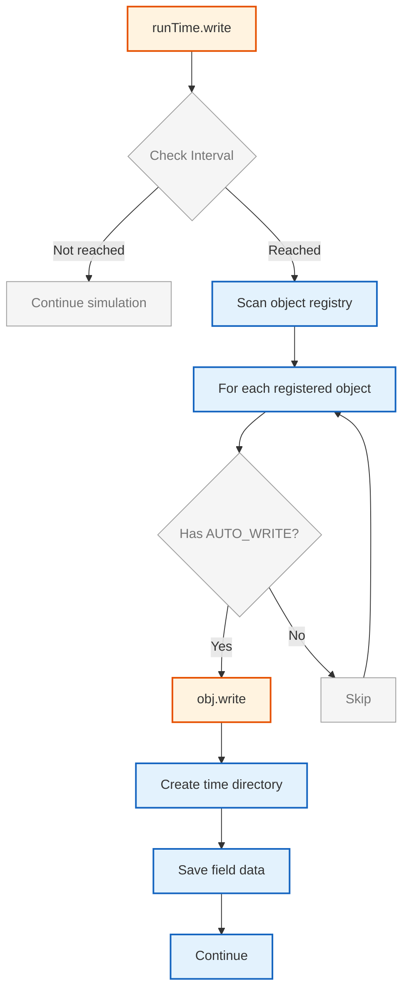
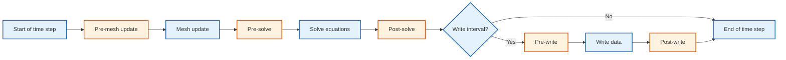

# Functional Logic: Write Control and Function Objects

## Learning Objectives

By the end of this document, you should be able to:

1. **Explain** the write mechanism flow when `runTime.write()` is called
2. **Configure** output control parameters in `system/controlDict`
3. **Implement** selective field writing using IOobject flags
4. **Control** function object execution timing within the time loop

---

## 1. Write Mechanism

The `Time` class implements a write mechanism that automatically outputs registered objects with appropriate flags.

### 1.1 Write Execution Flow

The write process follows a deterministic sequence when `runTime.write()` is called:



**Figure 1:** Write mechanism flow when `runTime.write()` is called.

**Key Steps:**

| Step | Action | Method Call |
|------|--------|-------------|
| 1 | Interval check | `Time::writeTime()` |
| 2 | Registry scan | `objectRegistry::iterator` |
| 3 | Flag check | `IOobject::writeOpt()` |
| 4 | Directory creation | `Time::path()` |
| 5 | Data serialization | `regIOobject::write()` |

### 1.2 Write Control Parameters

**In `system/controlDict`:**

```cpp
writeControl    timeStep;         // timeStep, runTime, adjustableRunTime, clockTime
writeInterval   100;              // Output every 100 steps
purgeWrite      5;                // Keep only last 5 time directories
timePrecision   6;                // Decimal places in time folder names
writeFormat     binary;          // binary or ascii
writePrecision  6;               // Significant figures for ascii
writeCompression off;            // off, compressed, uncompressed
```

**Write Control Modes:**

| Mode | Behavior | Example |
|------|----------|---------|
| `timeStep` | Output every N steps | `writeInterval 100;` → steps 100, 200, 300... |
| `runTime` | Output every T seconds | `writeInterval 0.5;` → t=0.5, 1.0, 1.5... |
| `adjustableRunTime` | Adaptive to actual time | `writeInterval 0.5;` |
| `clockTime` | Based on wall-clock time | `writeInterval 60;` (seconds) |

---

## 2. Time Directory Management

### 2.1 Directory Structure

```
caseDirectory/
├── 0/                    # Initial conditions (never deleted by purgeWrite)
├── 0.1/                  # First output
├── 0.2/                  # Second output
├── 0.3/                  # Third output
├── constant/
│   └── polyMesh/
└──/
```

**Key Properties:**

- `runTime.timeName()` returns current time as string (e.g., "0.1")
- Directories created automatically during write
- **Existing directories are NOT overwritten** (OpenFOAM will error)
- Use `foamListTimes` command to list available time directories

### 2.2 Time Precision Control

**Problem:** Floating-point arithmetic causes long directory names

```bash
0/
0.10000000000000001/
0.20000000000000001/
0.30000000000000001/
```

**Solution:** Use `timePrecision` in controlDict

```cpp
timePrecision  6;    // Limits to 6 decimal places
// Result: 0.1/, 0.2/, 0.3/
```

### 2.3 Purging Old Results

```cpp
purgeWrite  3;       // Keep only 3 most recent directories
```

**Example:**

- Before: `0/, 0.1/, 0.2/, 0.3/, 0.4/, 0.5/, 0.6/`
- After writing 0.6: `0/, 0.4/, 0.5/, 0.6/` (0.1, 0.2, 0.3 deleted)

**Important:** The `0/` directory (initial conditions) is **never** deleted by `purgeWrite`.

---

## 3. Selective Field Writing

Control field output behavior using `IOobject` write options.

### 3.1 Write Option Flags

```cpp
// AUTO_WRITE - written automatically by runTime.write()
volScalarField p
(
    IOobject
    (
        "p",
        runTime.timeName(),
        mesh,
        IOobject::MUST_READ,
        IOobject::AUTO_WRITE     // Auto-written
    ),
    mesh
);

// NO_WRITE - manual control only
volScalarField pTemp
(
    IOobject
    (
        "pTemp",
        runTime.timeName(),
        mesh,
        IOobject::NO_READ,
        IOobject::NO_WRITE       // Not auto-written
    ),
    mesh,
    dimensionedScalar("pTemp", dimPressure, 0)
);
```

### 3.2 Manual Write Pattern

```cpp
// Conditional manual write
if (shouldWriteTemperature)
{
    pTemp.write();
}

// Write with different name
pTemp.rename("pTempFinal");
pTemp.write();
```

### 3.3 Write Format Comparison

| Format | File Size | Precision | Human Readable | Speed |
|--------|-----------|-----------|----------------|-------|
| `binary` | Smaller | Machine | No | Faster |
| `ascii` | Larger | Configurable | Yes | Slower |

---

## 4. Function Object Execution Timing

Function objects execute at specific points within the time loop for monitoring, sampling, and analysis.

### 4.1 Execution Points



**Figure 2:** Function object execution points within a time step.

### 4.2 Function Object Control

**Example Configuration in `system/controlDict`:**

```cpp
functions
{
    forces
    {
        type            forces;
        libs            ("libforces.so");
        writeControl    timeStep;
        writeInterval   1;
        
        // Execute at specific points
        executeAt       start;      // Execute at simulation start
        executeAt       write;      // Execute when writing
        executeAt       end;        // Execute at simulation end
    }
    
    probes
    {
        type            probes;
        libs            ("libsampling.so");
        writeControl    outputTime;  // Execute only at write intervals
        
        // Probe locations
        probeLocations
        (
            (0.01 0.01 0.01)
            (0.05 0.05 0.05)
        );
    }
}
```

**Execution Control Options:**

| Option | Description |
|--------|-------------|
| `executeAt start` | Execute once at simulation start |
| `executeAt write` | Execute when writing output |
| `executeAt end` | Execute once at simulation end |
| `writeControl timeStep` | Execute every N steps |
| `writeControl outputTime` | Execute only at output times |

---

## 5. Common Patterns

### 5.1 Checkpointing and Restart

```cpp
// Write control for checkpointing
writeControl    runTime;
writeInterval   500;             // Checkpoint every 500 seconds

// Restart from latest time
startFrom       latestTime;
```

### 5.2 Adaptive Time Stepping

```cpp
adjustTimeStep  yes;
maxCo           0.9;             // Max Courant number
maxDeltaT       1;               // Maximum time step

// Solver automatically adjusts deltaT based on:
// - Courant number (transient cases)
// - Maximum deltaT limit
// - Other stability criteria
```

### 5.3 Debug Output Control

```cpp
// Write every time step for debugging
writeControl    timeStep;
writeInterval   1;

// Minimize disk usage
writeFormat     ascii;
purgeWrite      2;
```

---

## Key Takeaways

- [**Write Mechanism**] `runTime.write()` scans registry and writes objects with `IOobject::AUTO_WRITE` flag
- [**Time Directories**] Named chronologically (e.g., `0.1/`, `0.2/`), created automatically
- [**PurgeWrite**] Keeps only N most recent directories, never deletes `0/`
- [**Selective Writing**] Use `IOobject::NO_WRITE` for manual control, call `field.write()` explicitly
- [**Function Objects**] Execute at specific time-step points via `executeAt` and `writeControl` settings

---

## Concept Check

<details>
<summary><b>1. What's the difference between `writeControl timeStep` and `writeControl runTime`?</b></summary>

**`timeStep`:**
- Outputs every N iterations
- `writeInterval 100;` → Write at steps 100, 200, 300...
- Best for steady-state or fixed-step simulations

**`runTime`:**
- Outputs every T seconds of simulation time
- `writeInterval 0.5;` → Write at t=0.5, 1.0, 1.5...
- Best for transient simulations with variable time steps

</details>

<details>
<summary><b>2. How do you prevent a field from being written automatically?</b></summary>

Use `IOobject::NO_WRITE` when constructing the field:

```cpp
volScalarField intermediateField
(
    IOobject
    (
        "intermediate",
        runTime.timeName(),
        mesh,
        IOobject::NO_READ,
        IOobject::NO_WRITE    // Not auto-written
    ),
    mesh,
    dimensionedScalar("zero", dimless, 0)
);
```

Then manually write only when needed:

```cpp
if (specialCondition)
{
    intermediateField.write();
}
```

</details>

<details>
<summary><b>3. What does `purgeWrite 5` do?</b></summary>

Automatically deletes old time directories, keeping only the 5 most recent:

- Before: `0/, 0.1/, 0.2/, 0.3/, 0.4/, 0.5/, 0.6/`
- After writing 0.6: `0/, 0.2/, 0.3/, 0.4/, 0.5/, 0.6/` (0.1 deleted)

**Important:** The `0/` directory (initial conditions) is never deleted by `purgeWrite`.

</details>

---

## Related Documentation

- **Overview:** [00_Overview.md](00_Overview.md) — Time Databases overview
- **Previous:** [03_Object_Registry.md](03_Object_Registry.md) — Object registry system
- **Related:** [05_Summary_and_Exercises.md](05_Summary_and_Exercises.md) — Summary and exercises