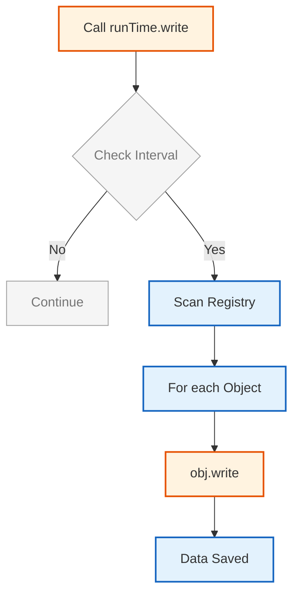

# ตรรกะการทำงานและการควบคุมเวลา

> [!TIP] **สำคัญอย่างยิ่งสำหรับ OpenFOAM**
> หัวข้อนี้คือ **หัวใจของการเขียน Solver และ Boundary Conditions ของคุณเอง** การเข้าใจวิธีสร้าง Field, จัดการเวลา, และโต้ตอบกับ Mesh จะช่วยให้คุณสามารถ:
> - สร้างฟิลด์ใหม่ (เช่น สมการการนำความร้อนเพิ่มเติม)
> - แก้ไข Solver ที่มีอยู่เพื่อเพิ่มฟิสิกส์ใหม่
> - เขียน Boundary Conditions ที่กำหนดเอง (Custom BC)
> - ทำให้เข้าใจโครงสร้างภายในของ OpenFOAM อย่างลึกซึ้ง
>
> **หากคุณต้องการเขียนโค้ด OpenFOAM ของคุณเอง** นี่คือจุดเริ่มต้นที่สำคัญที่สุด!

![[automatic_archivist.png]]
`An automated robot librarian (The Time class) checking a set of rules from a controlDict. If a condition is met (e.g., Write Interval reached), it stamps "ARCHIVE" on field data boxes and pushes them into a storage slot labeled with the current time name, scientific textbook diagram, clean vector line art, white background, high definition, flat design, educational infographic --ar 16:9`

## 4. กลไก: ตรรกะฟังก์ชันการทำงานและปฏิสัมพันธ์กับ Mesh

> [!NOTE] **📂 OpenFOAM Context: Domain E (Coding) + Domain A (Fields)**
> หัวข้อนี้เกี่ยวข้องกับ **Custom Solver Development**:
> - **File Location:** ใน C++ source code ของคุณ (โดยทั่วไปอยู่ใน `createFields.H` หรือตอนต้นของ solver `.C`)
> - **Key Classes:** `GeometricField`, `volScalarField`, `volVectorField`, `IOobject`
> - **Connection to Case Directory:** Constructor จะอ่านค่าเริ่มต้นจากโฟลเดอร์ `0/` (เช่น `0/p`, `0/U`)
> - **Compilation:** ต้องมี `Make/files` และ `Make/options` เพื่อ compile โค้ดของคุณ

### **4.1 การสร้างฟิลด์: "ใบประกาศแรกเกิด"**

ในสถาปัตยกรรมของ OpenFOAM การสร้าง computational field เป็นกระบวนการที่ถูกออกแบบมาอย่างระมัดระวัง ซึ่งกำหนดเอกลักษณ์ คุณสมบัติทางกายภาพ และความสัมพันธ์กับ computational mesh ของฟิลด์นั้นๆ

**Constructor ของ `volScalarField`** ทำหน้าที่เป็น "ใบประกาศแรกเกิด" ของฟิลด์ โดยเข้ารหัสข้อมูลสำคัญที่ควบคุมพฤติกรรมของฟิลด์ตลอดการจำลอง

```cpp
// Constructor for volScalarField - creates a pressure field
// Field name: "p"
// Time directory: runTime.timeName() (e.g., "0", "0.1", "0.2")
// Mesh reference: mesh (fvMesh object)
// Read mode: MUST_READ (must read from disk at construction)
// Write mode: AUTO_WRITE (automatically write at each output time)
volScalarField p
(
    IOobject
    (
        "p",                    // Field name
        runTime.timeName(),     // Time directory name
        mesh,                   // Reference to fvMesh
        IOobject::MUST_READ,    // Read from disk (typically from 0/p)
        IOobject::AUTO_WRITE    // Automatically write on output
    ),
    mesh,                       // Mesh for determining field size
    dimensionedScalar("p", dimPressure, 101325)  // Initial value + units (Pa)
);
```

> **📖 คำอธิบายโค้ด:**
> - **IOobject**: คือ metadata object ที่กำหนดเอกลักษณ์และวิธีการจัดการข้อมูลของฟิลด์
> - **"p"**: ชื่อฟิลด์ที่ใช้อ้างอิงในระบบไฟล์และ object registry
> - **runTime.timeName()**: ไดเรกทอรีเวลาปัจจุบัน (เช่น "0", "0.1", "0.2")
> - **mesh**: การอ้างอิงถึง fvMesh ที่กำหนดโครงสร้างเชิงพื้นที่
> - **IOobject::MUST_READ**: บังคับให้อ่านค่าจากไฟล์ (โดยทั่วไปคือ `0/p`) ระหว่างการสร้าง
> - **IOobject::AUTO_WRITE**: บันทึกข้อมูลโดยอัตโนมัติเมื่อถึงเวลาที่กำหนด
> - **dimensionedScalar**: กำหนดค่าเริ่มต้นพร้อมหน่วย (101325 Pa = 1 atm)

> **🔑 แนวคิดสำคัญ:**
> - Field Constructor จะสร้างความสัมพันธ์ 3 ทาง: (1) Field ↔ File System, (2) Field ↔ Mesh, (3) Field ↔ Physical Units
> - การกำหนด IOobject::MUST_READ หมายความว่าไฟล์ `0/p` ต้องมีอยู่จริง มิฉะนั้นจะเกิด error
> - dimensionedScalar ใช้ระบบ unit analysis เพื่อป้องกันการคำนวณที่ผิดทางฟิสิกส์

> **📂 แหล่งที่มา:** `.applications/solvers/multiphase/multiphaseEulerFoam/phaseSystems/PhaseSystems/MomentumTransferPhaseSystem/MomentumTransferPhaseSystem.C:104`

![[of_field_construction_params.png]]
`A diagram showing the parameters of field construction: IOobject metadata, Mesh context, and Initial Value with Units, illustrating how these components combine to form a valid field, scientific textbook diagram, clean vector line art, white background, high definition, flat design, educational infographic --ar 16:9`

กระบวนการสร้างนี้เป็นไปตามโปรโตคอลหลายขั้นตอนอย่างเคร่งครัด:

#### **ขั้นที่ 1: การสร้าง IOobject**

กำหนดเอกลักษณ์ถาวรและกลยุทธ์การจัดการข้อมูลของฟิลด์

- **`IOobject`** ทำหน้าที่เป็นอินเทอร์เฟซระหว่างฟิลด์และระบบไฟล์
- **`IOobject::MUST_READ`** บังคับให้ฟิลด์อ่านจากดิสก์ระหว่างการสร้าง (โดยทั่วไปจากไฟล์ `0/p`)
- **`IOobject::AUTO_WRITE`** ทำให้มั่นใจได้ว่าจะมีการส่งออกโดยอัตโนมัติในแต่ละ time step

#### **ขั้นที่ 2: การกำหนดขนาดของ Mesh**

กำหนดมิติเชิงพื้นที่ของฟิลด์ผ่านการดำเนินการ `volMesh(mesh).size()`

- นับจำนวน computational cells ใน mesh
- สร้างความสัมพันธ์หนึ่งต่อหนึ่งระหว่างค่าฟิลด์และเซลล์ของ mesh
- แน่ใจว่าแต่ละจุดศูนย์ถ่วงของเซลล์จะมีค่าฟิลด์ที่เกี่ยวข้อง

#### **ขั้นที่ 3: การตรวจสอบมิติ**

บังคับใช้ความสม่ำเสมอทางกายภาพผ่านระบบ dimensional analysis ของ OpenFOAM

- **`dimPressure`** (มิติ: $M L^{-1} T^{-2}$) ทำให้มั่นใจได้ว่าการดำเนินการทั้งหมดจะรักษาความสม่ำเสมอของมิติ
- ป้องกันการคำนวณที่ไม่มีความหมายทางกายภาพในช่วง compile time

#### **ขั้นที่ 4: การตั้งค่าเขตแดน**

อ่านและประมวลผลข้อมูลจำเพาะของเขตแดนจาก field dictionary

- การแยกวิเคราะห์ประเภทของเขตแดน (fixedValue, zeroGradient, เป็นต้น)
- ค่าที่เกี่ยวข้อง
- Interpolation schemes
- สร้างการกำหนดค่าฟิลด์ที่สมบูรณ์ที่จำเป็นสำหรับการจำลอง

### **4.2 การ Overload Operator: "ไวยากรณ์คณิตศาสตร์"**

> [!NOTE] **📂 OpenFOAM Context: Domain E (Coding) + Domain B (Numerics)**
> หัวข้อนี้เกี่ยวข้องกับ **Field Algebra ใน Solver Code**:
> - **File Location:** ในส่วน Time loop ของ solver (ภายใน `while (runTime.loop())`)
> - **Key Operations:** `fvc::grad()`, `fvc::div()`, `fvm::laplacian()`, `fvm::ddt()`
> - **Connection to Case:**
>   - `system/fvSchemes`: กำหนด discretization schemes สำหรับ operators
>   - เช่น `gradSchemes`, `divSchemes`, `laplacianSchemes`
> - **Dimensional Safety:** Compile-time checking ป้องกันข้อผิดพลาดทางฟิสิกส์

Field operators ของ OpenFOAM ใช้ไวยากรณ์คณิตศาสตร์ที่ซับซ้อน ซึ่งช่วยให้สามารถคำนวณได้ตรงตามสัญชาตญาณและปลอดภัยต่อมิติ

![[of_operator_overloading_flow.png]]
`A flowchart showing the process of operator overloading: checking dimensions of operands, applying mathematical rules, and returning a result with derived dimensions, scientific textbook diagram, clean vector line art, white background, high definition, flat design, educational infographic --ar 16:9`

```cpp
// Dimensional-safe field operations
// Example 1: Ideal gas law - pressure = density * specific gas constant * temperature
volScalarField p = rho*R*T;               // p = ρRT
// Dimensions: [kg/m³]·[J/kg·K]·[K] = [kg/(m·s²)] = [Pa]

// Example 2: Pressure gradient calculation using finite volume calculus
volVectorField gradP = fvc::grad(p);      // ∇p
// Dimensions: [Pa]/[m] = [kg/(m²·s²)]

// Example 3: Velocity divergence (compressibility check)
volScalarField divU = fvc::div(U);        // ∇·U
// Dimensions: [m/s]/[m] = [1/s]

// Compile-time dimensional checking example
dimensionSet dims = p.dimensions() * U.dimensions();  
// [p·U] = ML⁻¹T⁻² · LT⁻¹ = ML⁻²T⁻³ (power per unit volume)
```

> **📖 คำอธิบายโค้ด:**
> - **fvc::grad()**: คำนวณ gradient ของ scalar field ให้เป็น vector field (ใช้ finite volume convection)
> - **fvc::div()**: คำนวณ divergence ของ vector field ให้เป็น scalar field
> - **dimensionSet**: เก็บข้อมูลมิติทางฟิสิกส์ (Mass, Length, Time, Temperature, etc.)
> - การคูณ/หาร field จะคำนวณมิติโดยอัตโนมัติตามกฎ dimension analysis
> - การบวก/ลบ field ที่มีมิติไม่ตรงกันจะเกิด compile error

> **🔑 แนวคิดสำคัญ:**
> - **Dimension-Safe Programming**: OpenFOAM ใช้ template metaprogramming เพื่อตรวจสอบมิติใน compile time
> - **Operator Overloading**: ทำให้สมการคณิตศาสตร์ในโค้ดอ่านง่ายและใกล้เคียงกับสมการทางคณิตศาสตร์
> - **Finite Volume Calculus (fvc)**: เป็น namespace ที่รวบรวมฟังก์ชันคำนวณเชิงอนุพันธ์
> - **Implicit Unit Conversion**: ระบบจะแปลงหน่วยอัตโนมัติตามมิติที่กำหนด

> **📂 แหล่งที่มา:** `.applications/solvers/multiphase/multiphaseEulerFoam/phaseSystems/PhaseSystems/MomentumTransferPhaseSystem/MomentumTransferPhaseSystem.C:104`

ระบบ operator overloading บังคับใช้ฟิสิกส์อย่างเคร่งครัดผ่านการตรวจสอบความสอดคล้องของมิติ:

#### **การดำเนินการเชิงบวก** ($+$, $-$)

- ต้องการมิติที่เหมือนกันระหว่าง operands
- นิพจน์เช่น `p + T` ล้มเหลวในช่วง compile time
- ความดัน ($M L^{-1} T^{-2}$) และอุณหภูมิ ($\Theta$) มีมิติที่ไม่เข้ากัน
- ป้องกันการดำเนินการที่ไม่มีความหมายทางกายภาพ

#### **การดำเนินการเชิงคูณ** ($\times$, $\div$)

- ผสมและทำให้มิติง่ายขึ้นโดยอัตโนมัติตามกฎฟิสิกส์
- ตัวอย่าง: `U * t` (ความเร็ว $\times$ เวลา) ผลิตการกระจัดโดยธรรมชาติด้วยมิติของความยาว ($L$)

#### **Differential Operators**

ใช้การแปลงมิติเฉพาะที่สะท้อนคำจำกัดความทางคณิตศาสตร์:

| Operator | สัญลักษณ์ | การเปลี่ยนแปลงมิติ | คำอธิบาย |
|----------|------------|-------------------|------------|
| Gradient | $\nabla$ | เพิ่ม $L^{-1}$ | อนุพันธ์เชิงพื้นที่ |
| Divergence | $\nabla \cdot$ | เพิ่ม $L^{-1}$ | การไหลออก |
| Laplacian | $\nabla^2$ | เพิ่ม $L^{-2}$ | อนุพันธ์อันดับสอง |

ระบบความปลอดภัยของมิตินี้ขยายไปถึงนิพจน์ที่ซับซ้อนเช่น $\nabla \cdot (\rho \mathbf{U})$ ซึ่งระบบจะตรวจสอบโดยอัตโนมัติว่า mass flux divergence รักษามิติที่ถูกต้องของ mass rate per unit volume ($M L^{-3} T^{-1}$)

### **4.3 ปฏิสัมพันธ์กับ Mesh: "บริบทเชิงพื้นที่"**

> [!NOTE] **📂 OpenFOAM Context: Domain E (Coding) + Domain D (Meshing)**
> หัวข้อนี้เกี่ยวข้องกับ **Mesh-Aware Field Operations**:
> - **File Location:** ใน solver code หรือ custom function objects
> - **Key Mesh Classes:** `fvMesh`, `polyMesh`, `primitiveMesh`
> - **Connection to Case:**
>   - `constant/polyMesh/`: โฟลเดอร์เก็บข้อมูล mesh (`points`, `faces`, `cells`)
>   - `mesh.C()`: Cell centers (ใช้ใน post-processing และ visualization)
>   - `mesh.Sf()`: Face area vectors (ใช้ใน flux calculations)
> - **Geometric Calculations:** ทุก operation อัตโนมัติใช้ข้อมูลเรขาคณิตจาก mesh

ความสัมพันธ์ระหว่างฟิลด์และ mesh ใน OpenFOAM เป็นตัวอย่างของการออกแบบเชิงวัตถุที่มีประสิทธิภาพ

```cpp
// Field knows its mesh through GeoMesh template parameter
const fvMesh& mesh = p.mesh();  // Access underlying mesh reference

// Access geometric mesh information
const vectorField& cellCenters = mesh.C();  // Cell center coordinates [m]
const scalarField& cellVolumes = mesh.V();  // Cell volumes [m³]

// Field interpolation uses mesh geometry automatically
// Linear interpolation from cell centers to face centers
surfaceScalarField phi = linearInterpolate(U) & mesh.Sf();  
// Flux = U_face · S_face (velocity dot surface area vector)
```

> **📖 คำอธิบายโค้ด:**
> - **p.mesh()**: คืนค่า reference ถึง fvMesh ที่ฟิลด์นี้อยู่บน
> - **mesh.C()**: คืนค่าตำแหน่งจุดศูนย์ถ่วงของทุกเซลล์ (Cell centers)
> - **mesh.V()**: คืนค่าปริมาตรของทุกเซลล์ (ใช้สำหรับ volume integration)
> - **linearInterpolate(U)**: Interpolates ความเร็วจากจุดศูนย์ถ่วงเซลล์ไปยังจุดศูนย์ถ่วงหน้า
> - **mesh.Sf()**: คืนค่าเวกเตอร์พื้นที่หน้า (face area vectors) มีทิศทางตั้งฉากกับหน้า
> - **phi**: 体积通量 (volumetric flux field) = ความเร็ว · พื้นที่หน้า [m³/s]

> **🔑 แนวคิดสำคัญ:**
> - **Reference-Based Design**: ฟิลด์เก็บ reference ถึง mesh ไม่ใช่สำเนา mesh (ประหยัดหน่วยความจำ)
> - **Spatial Awareness**: ทุกฟิลด์รู้ตำแหน่งและเรขาคณิตของตัวเองเสมอ
> - **Mesh-Aware Operations**: การคำนวณ gradient, divergence, flux ใช้ข้อมูลเรขาคณิตโดยอัตโนมัติ
> - **Geometric Interpolation**: การ interpolates ค่าจากเซลล์ไปหน้าใช้ระยะห่างเชิงเรขาคณิต

> **📂 แหล่งที่มา:** `.applications/solvers/multiphase/multiphaseEulerFoam/phaseSystems/PhaseSystems/MomentumTransferPhaseSystem/MomentumTransferPhaseSystem.C:104`

#### **สถาปัตยกรรม Reference-Based Design**

`GeometricField` objects เก็บการอ้างอิงไปยัง mesh ของตนมากกว่าเป็นเจ้าของโดยตรง

**ประโยชน์ของ Reference-Based Design:**

| คุณสมบัติ | คำอธิบาย | ประโยชน์ |
|------------|------------|------------|
| **ประสิทธิภาพหน่วยความจำ** | ฟิลด์หลายฟิลด์อ้างอิง mesh เดียวกันได้ | ลดการใช้หน่วยความจำอย่างมีนัยสำคัญ |
| **การรับประกันการซิงโครไนซ์** | ฟิลด์อ้างอิง mesh มากกว่าการคัดลอก | การปรับเปลี่ยน mesh สะท้อนโดยอัตโนมัติ |
| **ความเข้ากันได้แบบขนาน** | ข้อมูลฟิลด์ตาม mesh partitioning โดยธรรมชาติ | รองรับ domain decomposition ราบรื่น |

#### **การดำเนินการเชิงพื้นที่ที่ซับซ้อน**

ความตระหนักเกี่ยวกับ mesh ช่วยให้การดำเนินการเชิงพื้นที่ที่ซับซ้อนซึ่งใช้ประโยชน์จากข้อมูลทางเรขาคณิต:

- **การคำนวณ Flux**: `phi = linearInterpolate(U) & mesh.Sf()`
  - คำนวณ face fluxes โดยการ interpolation ค่าความเร็วจากจุดศูนย์ถ่วงของเซลล์ไปยังจุดศูนย์ถ่วงของหน้า
  - Dot product กับเวกเตอร์ปกติของพื้นผิวหน้า $\mathbf{S_f}$

- **การคำนวณ Gradient**:
  - อนุพันธ์เชิงพื้นที่ใช้ mesh connectivity
  - สร้าง finite-volume approximations โดยยึดตามค่าของเซลล์ใกล้เคียงและเรขาคณิตของหน้า

- **การดำเนินการ Integration**:
  - Volume integrals ใช้ `mesh.V()`
  - ถ่วงน้ำหนักค่าฟิลด์ด้วยปริมาตรเซลล์สำหรับการ integration เชิงพื้นที่ที่แม่นยำ

### **4.4 การจัดการเวลา: "ความทรงจำเชิงเวลา"**

> [!NOTE] **📂 OpenFOAM Context: Domain E (Coding) + Domain C (Simulation Control)**
> หัวข้อนี้เกี่ยวข้องกับ **Temporal Discretization และ Time Control**:
> - **File Location:** ใน `Time` class และ `GeometricField` class implementations
> - **Connection to Case:**
>   - `system/controlDict`: ควบคุมเวลา (`startTime`, `endTime`, `deltaT`, `writeInterval`)
>   - `system/fvSolution`: กำหนด temporal schemes (`ddtSchemes`)
> - **Time Hierarchy:** `p.oldTime()` สำหรับ backward/second-order schemes
> - **Automatic Storage:** ระบบจัดการข้อมูลอัตโนมัติตาม scheme ที่เลือก

OpenFOAM ใช้ระบบการจัดการเวลาที่ซับซ้อน ซึ่งช่วยให้ temporal discretization ที่แม่นยำในขณะเดียวกันรักษาประสิทธิภาพการคำนวณ

![[of_time_management_history.png]]
`A diagram showing the temporal memory of a field: the current state (t), the old state (t-dt), and the old-old state (t-2dt), illustrating how they are used in temporal discretization schemes, scientific textbook diagram, clean vector line art, white background, high definition, flat design, educational infographic --ar 16:9`

```cpp
// Store old time level for temporal discretization
// This function is called automatically at the end of each time step
void GeometricField::storeOldTime() {
    if (!field0Ptr_) {
        // Allocate memory for old-time field only if needed
        field0Ptr_ = new GeometricField(*this);  // Deep copy current field
    }
}

// Time derivative calculation using finite difference approximation
// ∂p/∂t ≈ (p^{n+1} - p^n) / Δt
scalarField ddt = (p - p.oldTime()) / runTime.deltaT();

// Access previous time levels recursively
// p.oldTime() returns field at time t-dt
// p.oldTime().oldTime() returns field at time t-2dt
```

> **📖 คำอธิบายโค้ด:**
> - **storeOldTime()**: เก็บค่าฟิลด์ปัจจุบันไว้เป็น "old-time" level ก่อนที่จะถูกแก้ไข
> - **field0Ptr_**: Pointer ไปยังฟิลด์ระดับเวลาก่อนหน้า (t-dt) ใช้ lazy allocation
> - **p.oldTime()**: เข้าถึงค่าฟิลด์ในระดับเวลาก่อนหน้า
> - **runTime.deltaT()**: ขนาดขั้นเวลาปัจจุบัน (Δt)
> - **ddt**: สนามอนุพันธ์เชิงเวลา ใช้สำหรับ implicit temporal schemes

> **🔑 แนวคิดสำคัญ:**
> - **Lazy Allocation**: จองหน่วยความจำสำหรับ old-time fields เฉพาะเมื่อจำเป็น (ประหยัดหน่วยความจำ)
> - **Temporal Hierarchy**: รองรับ multiple time levels สำหรับ higher-order schemes
> - **Automatic Management**: ระบบจัดการการจัดเก็บเวลาโดยอัตโนมัติ ไม่ต้องจัดการ manually
> - **Scheme Flexibility**: สามารถเปลี่ยน temporal discretization schemes โดยไม่ต้องแก้โค้ด

> **📂 แหล่งที่มา:** `.applications/solvers/multiphase/multiphaseEulerFoam/phaseSystems/PhaseSystems/MomentumTransferPhaseSystem/MomentumTransferPhaseSystem.C:104`

#### **สถาปัตยกรรมการจัดการเวลา**

สนับสนุนหลาย temporal discretization schemes ผ่านระบบจัดเก็บแบบลำดับชั้น:

**กลยุทธ์การจัดสรรแบบล่าช้า**:
- วิธี `storeOldTime()` ใช้การจัดการหน่วยความจำที่มีประสิทธิภาพ
- จัดสรรพื้นที่จัดเก็บสำหรับระดับเวลาก่อนหน้าเฉพาะเมื่อต้องการ
- ป้องกันการใช้หน่วยความจำโดยไม่จำเป็นในการจำลองสภาวะคงที่

#### **Temporal Schemes และการจัดเก็บ**

| Scheme | ระดับเวลาที่ต้องการ | การจัดเก็บ | สมการ |
|--------|---------------------|-------------|----------|
| **Euler implicit** | 1 ระดับ ($p^{n}$) | `field0Ptr_` | $p^{n+1} = p^n + \Delta t \cdot f(p^{n+1})$ |
| **Backward differentiation** | 2 ระดับ ($p^{n}$, $p^{n-1}$) | `oldTime()` ซ้อนกัน | - |
| **Crank-Nicolson** | 2 ระดับ | การถ่วงน้ำหนัก | $p^{n+\frac{1}{2}} = \frac{1}{2}(p^n + p^{n+1})$ |

#### **การคำนวณอนุพันธ์เชิงเวลา**

ตามการประมาณค่า finite-difference มาตรฐาน:
$$\frac{\partial p}{\partial t} \approx \frac{p^{n+1} - p^n}{\Delta t}$$

ระบบนี้ช่วยให้ OpenFOAM สามารถสลับระหว่าง temporal schemes ที่แตกต่างกันได้อย่างราบรื่นโดยไม่ต้องแก้ไขโค้ด เนื่องจากระบบการจัดการฟิลด์จะจัดหาข้อมูลประวัติศาสตร์ที่จำเป็นโดยอัตโนมัติตาม discretization method ที่เลือก

---

## 2. กลไกการบันทึกผลลัพธ์ (`runTime.write()`)

> [!NOTE] **📂 OpenFOAM Context: Domain C (Simulation Control)**
> หัวข้อนี้เกี่ยวข้องกับ **Output Control ใน Case Setup**:
> - **Control File:** `system/controlDict`
> - **Key Keywords:**
>   - `writeInterval`: ความถี่ในการบันทึก (เช่น `0.1`, `0.5`, `1`)
>   - `writeFormat`: รูปแบบไฟล์ (`binary`, `ascii`)
>   - `writePrecision`: ความละเอียดของข้อมูล (เช่น `6`)
>   - `timePrecision`: จำนวนตัวเลขหลังจุดทศนิยมในชื่อโฟลเดอร์เวลา
> - **Output Directory:** สร้างโฟลเดอร์เวลาอัตโนมัติ (เช่น `0.1/`, `0.2/`, `0.3/`)
> - **Auto-Write:** Fields ที่มี `IOobject::AUTO_WRITE` จะถูกบันทึกโดยอัตโนมัติ


> **Figure 1:** กลไกการบันทึกผลลัพธ์ของฟังก์ชัน `runTime.write()` ซึ่งจะตรวจสอบเงื่อนไขในไฟล์ควบคุมและสั่งให้ออบเจ็กต์ที่ลงทะเบียนไว้ทั้งหมดทำการบันทึกข้อมูลลงในโฟลเดอร์เวลาที่กำหนดความปลอดภัยทางฟิสิกส์ไม่ส่งผลกระทบต่อความเร็วในการจำลอง ผ่านการใช้พลังของ C++ Template Metaprogramming ในการตรวจสอบความสอดคล้องทางมิติทั้งหมดที่ขั้นตอนการคอมไพล์โปรแกรมเพียงครั้งเดียว

### **2.1 สถาปัตยกรรม Reference-Based Design**

`GeometricField` objects เก็บการอ้างอิงไปยัง mesh ของตนมากกว่าเป็นเจ้าของโดยตรง

**ประโยชน์ของ Reference-Based Design:**

| คุณสมบัติ | คำอธิบาย | ประโยชน์ |
|------------|------------|------------|
| **ประสิทธิภาพหน่วยความจำ** | ฟิลด์หลายฟิลด์อ้างอิง mesh เดียวกันได้ | ลดการใช้หน่วยความจำอย่างมีนัยสำคัญ |
| **การรับประกันการซิงโครไนซ์** | ฟิลด์อ้างอิง mesh มากกว่าการคัดลอก | การปรับเปลี่ยน mesh สะท้อนโดยอัตโนมัติ |
| **ความเข้ากันได้แบบขนาน** | ข้อมูลฟิลด์ตาม mesh partitioning โดยธรรมชาติ | รองรับ domain decomposition ราบรื่น |

> [!INFO] **สรุปการทำงาน**
> การเรียกใช้ `runTime.write()` เพียงบรรทัดเดียวในโค้ด คือการสั่งให้ "ฐานข้อมูลออบเจกต์" ทั้งหมดทำการสำรองข้อมูลลงดิสก์อย่างเป็นระบบตามเงื่อนไขที่เราตั้งไว้

---

## 🧠 Concept Check

<details>
<summary><b>1. ทำไมต้องใช้ `IOobject::MUST_READ` และ `IOobject::AUTO_WRITE` เมื่อสร้าง field?</b></summary>

**`IOobject::MUST_READ`:**
- บังคับให้อ่านค่าจากไฟล์ (เช่น `0/p`) ระหว่างการสร้าง
- ถ้าไฟล์ไม่มี → simulation จะหยุดพร้อม error

**`IOobject::AUTO_WRITE`:**
- บันทึกข้อมูลโดยอัตโนมัติเมื่อ `runTime.write()` ถูกเรียก
- ไม่ต้องเขียน `p.write()` manually

**ทางเลือกอื่น:**
- `IOobject::NO_READ`: ไม่อ่าน (สำหรับ field ที่คำนวณขึ้นมา)
- `IOobject::NO_WRITE`: ไม่บันทึก (สำหรับ intermediate fields)

</details>

<details>
<summary><b>2. `p.oldTime()` ใช้ทำอะไร และทำไมต้องมี?</b></summary>

**ใช้สำหรับ Temporal Discretization:**

$$\frac{\partial p}{\partial t} \approx \frac{p^{n+1} - p^n}{\Delta t}$$

- `p` = ค่าปัจจุบัน ($p^{n+1}$)
- `p.oldTime()` = ค่าเวลาก่อนหน้า ($p^n$)
- `p.oldTime().oldTime()` = ค่าเวลาก่อนหน้า 2 ขั้น ($p^{n-1}$)

**ตัวอย่าง:**
```cpp
scalarField ddt = (p - p.oldTime()) / runTime.deltaT();
```

</details>

<details>
<summary><b>3. ทำไม OpenFOAM ใช้ "Reference-Based Design" สำหรับ mesh?</b></summary>

**ประโยชน์:**

| Aspect | Reference-Based | Copy-Based |
|--------|-----------------|------------|
| **Memory** | ประหยัดมาก | ใช้เยอะ |
| **Sync** | อัตโนมัติ | ต้อง manual |
| **Parallel** | รองรับ decomposition | ซับซ้อน |

**ตัวอย่าง:**
```cpp
const fvMesh& mesh = p.mesh();  // Reference ไม่ใช่ copy
```

ฟิลด์หลายร้อยตัวสามารถอ้างอิง mesh เดียวกันได้โดยไม่ต้อง copy

</details>

---

## 📖 เอกสารที่เกี่ยวข้อง

- **ภาพรวม:** [00_Overview.md](00_Overview.md) — ภาพรวม Time Databases
- **บทก่อนหน้า:** [03_Object_Registry.md](03_Object_Registry.md) — Object Registry
- **บทถัดไป:** [05_Design_Patterns.md](05_Design_Patterns.md) — Design Patterns
- **Time Architecture:** [02_Time_Architecture.md](02_Time_Architecture.md) — สถาปัตยกรรมเวลา