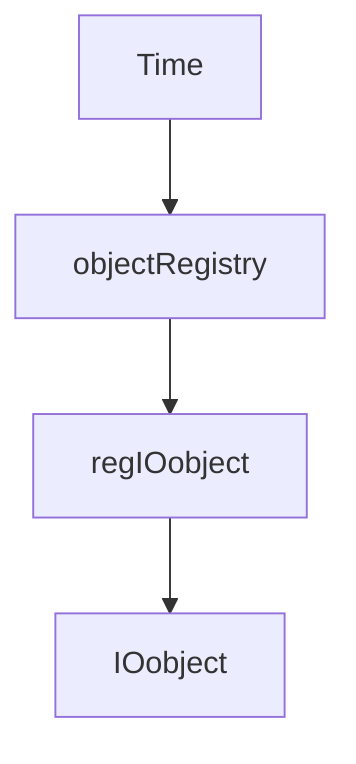

# Time Databases - Design Patterns

Design Patterns ใน OpenFOAM Time Management

> [!TIP] ทำไม Time Management สำคัญ?
> **Time Control** คือหัวใจของการควบคุมการทำงานของ OpenFOAM solver ทุกตัว
> - กำหนด **ความมั่นคง (Stability)** ผ่านการควบคุม `deltaT` และ Courant number
> - ควบคุม **การเก็บข้อมูล (Data Output)** ผ่าน `writeControl` เพื่อประหยัดพื้นที่ดิสก์
> - เชื่อมโยง **Object Registry** กับการจัดการ field ทุกตัวในกระบวนการ solve
> - ใช้งานอยู่ในทุก solver ผ่าน `runTime` object ที่ถูกสร้างใน `createFields.H`

---

## Overview

> Time class = Central controller for simulation time and I/O

---

## 1. Time Class Hierarchy

> [!NOTE] **📂 OpenFOAM Context**
> ส่วนนี้เกี่ยวข้องกับ **C++ Class Structure** ในซอร์สโค้ด OpenFOAM:
> - **ตำแหน่งไฟล์:** `src/OpenFOAM/db/Time/Time.H` และ `Time.C`
> - **ความสัมพันธ์:** `Time` สืบทอดจาก `objectRegistry` → `regIOobject` → `IOobject`
> - **การใช้งาน:** ทุก solver สร้าง `runTime` object ในไฟล์หลัก (เช่น `simpleFoam.C`, `interFoam.C`)
> - **Keywords:** `Time`, `objectRegistry`, `regIOobject`, `IOobject`



---

## 2. Core Responsibilities

> [!NOTE] **📂 OpenFOAM Context**
> ส่วนนี้แสดง **Method ที่ใช้งานบ่อย** ใน Solver Code:
> - **ตำแหน่งไฟล์:** ใช้ในทุก solver ที่อยู่ใน `applications/solvers/`
> - **ตัวอย่าง:** ไฟล์ `*.C` ของ solver จะมีการเรียก `runTime.value()`, `runTime.deltaT()`, `runTime.loop()` อยู่ภายใน time loop
> - **Keywords:** `runTime.value()`, `runTime.deltaT()`, `runTime.timeName()`, `runTime.loop()`, `runTime.write()`

| Responsibility | Method |
|----------------|--------|
| Current time | `runTime.value()` |
| Time step | `runTime.deltaT()` |
| Time name | `runTime.timeName()` |
| Loop control | `runTime.loop()` |
| Write control | `runTime.write()` |

---

## 3. Time Loop Pattern

> [!NOTE] **📂 OpenFOAM Context**
> ส่วนนี้แสดง **รูปแบบ Time Loop หลัก** ที่ใช้ในทุก OpenFOAM solver:
> - **ตำแหน่งไฟล์:** ใช้ในไฟล์ `.C` ของ solver (เช่น `simpleFoam.C`, `pimpleFoam.C`)
> - **ตัวอย่าง:** `applications/solvers/incompressible/simpleFoam/simpleFoam.C`
> - **Keywords:** `while (runTime.loop())`, `runTime.write()`, `Time`

```cpp
while (runTime.loop())
{
    Info << "Time = " << runTime.timeName() << endl;

    // Solve equations
    ...

    // Write if scheduled
    runTime.write();
}
```

---

## 4. Object Registry

> [!NOTE] **📂 OpenFOAM Context**
> ส่วนนี้แสดง **การจัดการ Field ผ่าน Object Registry** ใน OpenFOAM:
> - **ตำแหน่งไฟล์:** ใช้ใน `createFields.H` ของทุก solver (อยู่ใน `*/createFields.H`)
> - **ตัวอย่าง:** `applications/solvers/incompressible/simpleFoam/createFields.H`
> - **Keywords:** `objectRegistry`, `IOobject`, `MUST_READ`, `AUTO_WRITE`, `lookupObject`

### Field Registration

```cpp
volScalarField T
(
    IOobject
    (
        "T",
        runTime.timeName(),    // Time directory
        mesh,                   // Registry (objectRegistry)
        IOobject::MUST_READ,
        IOobject::AUTO_WRITE
    ),
    mesh
);
// T is automatically registered with mesh (objectRegistry)
```

### Lookup

```cpp
// Find registered field
const volScalarField& T = mesh.lookupObject<volScalarField>("T");

// Check existence
if (mesh.foundObject<volScalarField>("T")) { ... }
```

---

## 5. Write Control

> [!NOTE] **📂 OpenFOAM Context**
> ส่วนนี้เกี่ยวข้องกับ **การควบคุมการเขียนข้อมูล** ใน Case ของคุณ:
> - **ตำแหน่งไฟล์:** `system/controlDict`
> - **การใช้งาน:** กำหนดความถี่ในการเขียนผลลัพธ์ (time directories) เพื่อประหยัด disk space
> - **Keywords:** `writeControl`, `writeInterval`, `timeStep`, `runTime`, `adjustableRunTime`, `clockTime`

### controlDict Settings

```cpp
// system/controlDict
writeControl    timeStep;
writeInterval   100;

// or
writeControl    runTime;
writeInterval   0.1;  // Every 0.1 seconds
```

### Write Options

| writeControl | writeInterval Meaning |
|--------------|----------------------|
| `timeStep` | Every N time steps |
| `runTime` | Every T seconds |
| `adjustableRunTime` | Adjusted for output |
| `clockTime` | Wall clock seconds |

---

## 6. Time Stepping

> [!NOTE] **📂 OpenFOAM Context**
> ส่วนนี้เกี่ยวข้องกับ **การควบคุม Time Step** ใน Case ของคุณ:
> - **ตำแหน่งไฟล์:** `system/controlDict`
> - **การใช้งาน:** กำหนด `deltaT` แบบ **Fixed** หรือ **Adaptive** (ผ่าน Courant number) เพื่อความมั่นคงของการคำนวณ
> - **Keywords:** `deltaT`, `adjustTimeStep`, `maxCo`, `maxDeltaT`

### Fixed Time Step

```cpp
deltaT          0.001;
adjustTimeStep  no;
```

### Adaptive Time Step

```cpp
adjustTimeStep  yes;
maxCo           0.5;
maxDeltaT       0.01;
```

### Access in Code

```cpp
scalar dt = runTime.deltaT().value();
scalar t = runTime.value();
```

---

## 7. Function Objects

> [!NOTE] **📂 OpenFOAM Context**
> ส่วนนี้เกี่ยวข้องกับ **การใช้ Function Objects** สำหรับ runtime post-processing:
> - **ตำแหน่งไฟล์:** `system/controlDict` (ภายใต้ `functions` sub-dictionary)
> - **การใช้งาน:** คำนวณค่าเฉลี่ย, forces, sampling, probes และอื่นๆ ระหว่าง simulation
> - **Keywords:** `functions`, `type`, `fieldAverage`, `writeControl`, `forces`, `probes`, `sets`

```cpp
// system/controlDict
functions
{
    fieldAverage
    {
        type            fieldAverage;
        writeControl    writeTime;
        fields
        (
            U { mean on; prime2Mean on; }
        );
    }
}
```

---

## Quick Reference

| Need | Code |
|------|------|
| Current time | `runTime.value()` |
| Time step | `runTime.deltaT().value()` |
| Time name | `runTime.timeName()` |
| End time | `runTime.endTime().value()` |
| Force write | `runTime.write()` |
| Register field | Use `IOobject` with registry |
| Lookup field | `mesh.lookupObject<Type>("name")` |

---

## Concept Check

<details>
<summary><b>1. objectRegistry ทำหน้าที่อะไร?</b></summary>

เป็น **database** ที่เก็บ registered objects — ทำให้ lookup by name ได้
</details>

<details>
<summary><b>2. AUTO_WRITE vs NO_WRITE ต่างกันอย่างไร?</b></summary>

- **AUTO_WRITE**: เขียนออกตาม writeControl
- **NO_WRITE**: ไม่เขียนออก (เช่น intermediate fields)
</details>

<details>
<summary><b>3. adjustTimeStep ทำงานอย่างไร?</b></summary>

**Adjusts dt** based on CFL: $\Delta t = Co_{max} \cdot \frac{\Delta x}{U}$
</details>

---

## Related Documents

- **ภาพรวม:** [00_Overview.md](00_Overview.md)
- **IOobject:** [02_IOobject.md](02_IOobject.md)