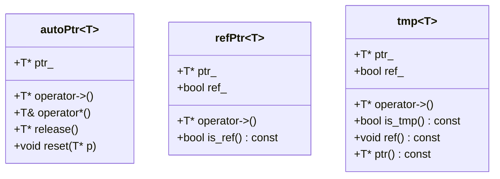
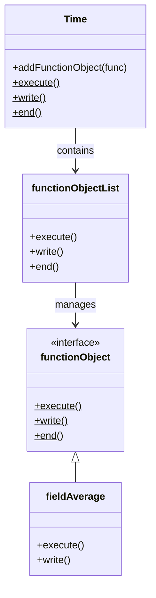

# Time Databases - Design Patterns

## Learning Objectives

By the end of this file, you should be able to:

1. **Identify** core C++ design patterns used in OpenFOAM's Time architecture
2. **Explain** how RAII governs Time object lifecycle and resource management
3. **Apply** smart pointer patterns when working with objectRegistry
4. **Distinguish** between compile-time polymorphism (templates) and runtime polymorphism in Time classes
5. **Implement** proper exception-safe patterns for Time-dependent objects

> [!SUCCESS] How You'll Know You've Mastered This
> - You can trace the complete lifecycle of a Time object from construction to destruction
> - You understand why smart pointers prevent memory leaks in registry operations
> - You can write exception-safe code that creates Time-dependent fields
> - You recognize when to use templates vs. virtual functions in Time-related code

---

## Overview

> [!NOTE] Position in This Module
> This file focuses on **software engineering patterns** in OpenFOAM's Time architecture. For time loop mechanics, registry operations, and writeControl, see **02_Time_Architecture.md**. For database structure, see **03_Object_Registry.md**.

**Design patterns** in OpenFOAM's Time subsystem represent proven solutions to recurring C++ challenges in CFD simulation:

- **RAII (Resource Acquisition Is Initialization)**: Automatic resource management
- **Smart Pointers**: Safe ownership semantics for registered objects
- **Template Metaprogramming**: Compile-time type safety in field lookups
- **Factory Pattern**: Dynamic Time object creation from dictionaries
- **Observer Pattern**: Function object notifications at time events

These patterns distinguish **robust, production-grade OpenFOAM code** from quick scripts that crash under edge cases.

---

## 1. RAII Pattern in Time Class

### RAII Fundamentals

**RAII** binds resource lifecycle to object scope:

```cpp
// Resource acquired in constructor
Time runTime
(
    Time::controlDictName,
    args.rootPath(),
    args.caseName()
);

// ... use runTime ...

// Resource automatically released in destructor when runTime goes out of scope
// No manual cleanup needed!
```

**Why RAII matters in OpenFOAM:**

| Benefit | Without RAII | With RAII |
|---------|--------------|-----------|
| Memory safety | Manual `delete` — easy to forget | Automatic destruction |
| Exception safety | leaked resources on throw | Cleanup guaranteed |
| Code clarity | Cleanup scattered | One constructor, one destructor |
| Thread safety | Manual synchronization | Scope-based locking |

### Time Object Lifecycle

```mermaid
stateDiagram-v2
    [*] --> Constructing: Time::Time(controlDict, rootPath, caseName)
    Constructing --> ReadingDictionary: Open controlDict
    ReadingDictionary --> InitializingRegistry: Create objectRegistry
    InitializingRegistry --> Ready: Load startTime, endTime, deltaT
    Ready --> Running: while(runTime.loop())
    Running --> Writing: runTime.write() if scheduled
    Writing --> Running: Continue simulation
    Running --> Destructing: End of scope or exception
    Destructing --> [*]: Flush output, close files, free memory
```

**Key RAII guarantees:**

1. **Constructor establishes invariants** — Time object is fully initialized or throws
2. **Destructor releases all resources** — file handles, registry memory, function objects
3. **Copy prevention** — Time is non-copyable (deleted copy constructor/assignment)
4. **Exception safety** — partial construction still triggers destructor

### Common Pitfall: Manual Time Management

❌ **Wrong: Manual new/delete**

```cpp
Time* runTime = new Time(...);  // Bad: Who deletes this?

try {
    solve(*runTime);
    delete runTime;              // Easy to forget!
} catch (...) {
    // runTime leaked if exception thrown before delete
}
```

✅ **Correct: RAII with automatic storage**

```cpp
Time runTime(...);  // Automatic storage duration

try {
    solve(runTime);  // Pass by reference
    // No cleanup needed — destructor runs automatically
} catch (...) {
    // runTime destructor still called
}
```

---

## 2. Smart Pointer Patterns

### Smart Pointer Hierarchy

OpenFOAM predates `std::unique_ptr` and implements its own smart pointers:



### Ownership Semantics

| Smart Pointer | Ownership | Use Case | OpenFOAM Example |
|---------------|-----------|----------|------------------|
| `autoPtr<T>` | Exclusive | Factory returns, optional objects | `autoPtr<time>` from `Time::New()` |
| `refPtr<T>` | Shared or reference | Conditional ownership | Registry lookups that may borrow |
| `tmp<T>` | Temporary | Expression results, field algebra | `tmp<volScalarField> tRes = ...` |

### Registry Lookup Pattern

```cpp
// Raw pointer lookup (dangerous)
volScalarField* T = mesh.lookupObjectPtr<volScalarField>("T");
// Who owns this? Can it become dangling?

// Smart pointer lookup (safe)
const volScalarField& T = mesh.lookupObject<volScalarField>("T");
// Returns reference — lifetime guaranteed by registry

// Optional lookup with smart pointer
autoPtr<volScalarField> TOpt;
if (mesh.found("T")) {
    TOpt.reset(const_cast<volScalarField&>(mesh.lookupObject<volScalarField>("T")));
}
if (TOpt.valid()) { /* use TOpt() */ }
```

### RAII with Smart Pointers

```cpp
// Function object creation (factory pattern)
autoPtr<functionObject> funcPtr = functionObject::New(name, dict, time);

if (funcPtr.valid()) {
    funcPtr()->execute();  // operator->() dereferences smart pointer
}
// funcPtr destroyed here, deletes functionObject automatically
```

---

## 3. Template Metaprogramming in Time

### Type-Safe Lookup Pattern

OpenFOAM uses **templates** to make registry lookups type-safe at compile time:

```cpp
// objectRegistry.H (simplified)
template<class Type>
const Type& lookupObject(const word& name) const
{
    const objectRegistry& obj = lookupObjectPtr(name);
    
    // Runtime type check (RTTI)
    const Type* ptr = dynamic_cast<const Type*>(&obj);
    if (!ptr) {
        FatalErrorInFunction
            << "Object " << name << " is not of type " << Type::typeName
            << abort(FatalError);
    }
    
    return *ptr;
}
```

**Why templates instead of virtual functions?**

| Approach | Pros | Cons |
|----------|------|------|
| **Templates** | Type-safe at compile time, no runtime overhead | Code bloat (instantiation for each type) |
| **Virtual functions** | Single code path, dynamic dispatch | No type safety, runtime overhead |
| **void* + casts** | Universal storage | No type safety, error-prone |

### Compile-Time vs. Runtime Polymorphism

```cpp
// Compile-time polymorphism (templates)
template<class Type>
void processField(const word& name, const objectRegistry& registry)
{
    const Type& field = registry.lookupObject<Type>(name);
    // Type known at compile time — compiler optimizes
    process(field);
}

// Usage
processField<volScalarField>("T", mesh);  // T must be volScalarField
processField<volVectorField>("U", mesh);  // U must be volVectorField

// Runtime polymorphism (virtual functions)
void processFieldGeneric(const word& name, const objectRegistry& registry)
{
    const regIOobject& obj = registry.lookupObject<regIOobject>(name);
    obj.write();  // Virtual call dispatched at runtime
}
```

### Template Metaprogramming for Function Objects

```cpp
// Function object factory uses templates
template<class Type>
class FunctionObjectFactory
{
public:
    static autoPtr<functionObject> New
    (
        const word& type,
        const Time& runTime,
        const dictionary& dict
    )
    {
        typename ConstructorTable::iterator cstrIter =
            ConstructorTablePtr_->find(type);
        
        if (cstrIter == ConstructorTablePtr_->end()) {
            // ... error handling
        }
        
        return cstrIter()(runTime, dict);  // Call constructor
    }
};
```

---

## 4. Factory Pattern for Time Creation

### Time Factory Methods

OpenFOAM uses **static factory methods** to create Time objects:

```cpp
// Time.H
class Time
{
public:
    // Factory method from controlDict
    static autoPtr<Time> New
    (
        const word& name,
        const fileName& rootPath,
        const fileName& caseName
    );
    
    // Factory method from dictionary
    static autoPtr<Time> New(const dictionary& dict);
};
```

### Factory Usage in Solvers

```cpp
// simpleFoam.C (simplified)
Foam::autoPtr<Foam::Time> runTimePtr = Foam::Time::New
(
    Foam::Time::controlDictName,
    args.rootPath(),
    args.caseName()
);

Foam::Time& runTime = runTimePtr();  // Dereference to get reference
```

**Why use factories?**

1. **Centralized construction logic** — Single point for Time creation
2. **Error handling** — Factory can return nullPtr on failure
3. **Smart pointer return** — Enforces RAII ownership
4. **Future flexibility** — Easy to add subclass support (e.g., `ParallelTime`)

---

## 5. Observer Pattern for Function Objects

### Observer Pattern Structure



### Event Notification Flow

```cpp
// Time.C (simplified)
bool Time::loop()
{
    bool continueLoop = /* ... time step logic ... */;
    
    if (continueLoop) {
        // Notify observers
        functionObjects_.execute();  // Call all registered functionObjects
    }
    
    return continueLoop;
}

void Time::write()
{
    // Write Time state
    // ...
    
    // Notify observers
    functionObjects_.write();
}
```

### Implementing a Function Object

```cpp
// Custom function object
class myStats : public functionObject
{
public:
    myStats(const word& name, const Time& runTime, const dictionary& dict)
        : functionObject(name), runTime_(runTime)
    {
        // Read configuration
    }
    
    virtual bool execute() override
    {
        // Called every time step
        // Calculate statistics
        return true;
    }
    
    virtual bool write() override
    {
        // Called when results are written
        // Output statistics
        return true;
    }
    
private:
    const Time& runTime_;
};
```

---

## 6. Exception Safety Patterns

### Exception Safety Levels

C++ defines three levels of exception safety:

| Level | Guarantee | OpenFOAM Example |
|-------|-----------|------------------|
| **Basic** | No leaks, object may be invalid | Time constructor throws but cleans up |
| **Strong** | Operation succeeds or state unchanged | `lookupObject` throws if not found |
| **No-throw** | Operation never throws | `runTime.value()` never throws |

### Strong Exception Safety in Lookups

```cpp
// Strong guarantee: Either returns valid reference or throws
const volScalarField& T = mesh.lookupObject<volScalarField>("T");
// If T not found, exception thrown and state unchanged
```

### Exception-Safe Field Creation

```cpp
// ❌ Bad: Not exception-safe
volScalarField* T = nullptr;
try {
    T = new volScalarField(IOobject(...), mesh);
    // If constructor throws, T leaked
} catch (...) {
    delete T;  // Too late
}

// ✅ Good: RAII handles exceptions
volScalarField T
(
    IOobject
    (
        "T",
        runTime.timeName(),
        mesh,
        IOobject::MUST_READ,
        IOobject::AUTO_WRITE
    ),
    mesh
);
// If constructor throws, T destructor never runs, but no leak
// If constructor succeeds, T managed automatically
```

---

## Quick Reference

| Pattern | Implementation | When to Use |
|---------|---------------|-------------|
| **RAII** | Automatic object storage | Always — avoid manual new/delete |
| **Smart Pointers** | `autoPtr<T>`, `refPtr<T>` | Factory returns, optional objects |
| **Templates** | `lookupObject<Type>()` | Type-safe registry lookups |
| **Factory** | `Time::New()` | Creating Time or function objects |
| **Observer** | `functionObject::execute()` | Runtime calculations at time events |

---

## 🧠 Concept Check

<details>
<summary><b>1. Why is Time non-copyable?</b></summary>

**Resource ownership conflict** — Only one owner should manage file handles, registry memory, and function object lifecycle. Copying would create duplicate ownership, leading to double-deletion or leaks.

```cpp
// Time.H
Time(const Time&) = delete;              // No copy constructor
Time& operator=(const Time&) = delete;   // No copy assignment
```

If copying were allowed:
```cpp
Time runTime1(...);
Time runTime2 = runTime1;  // Both manage same resources?
// Disaster: double-free when both destructors run
```

</details>

<details>
<summary><b>2. What's the difference between autoPtr and tmp?</b></summary>

| Aspect | autoPtr<T> | tmp<T> |
|--------|------------|--------|
| **Purpose** | Exclusive ownership | Temporary objects in expressions |
| **Can be empty** | Yes (default constructed) | No (must point to valid object) |
| **Copy behavior** | Move-only (transfers ownership) | Can reference-count (ref() method) |
| **Use case** | Factory return values | Field algebra results |

Example:
```cpp
// Factory returns autoPtr (ownership transfer)
autoPtr<functionObject> func = functionObject::New(...);

// Expression creates tmp (temporary result)
tmp<volScalarField> tRhs = fvc::ddt(T) + fvc::laplacian(DT, T);
```

</details>

<details>
<summary><b>3. Why does lookupObject use templates instead of returning regIOobject*?</b></summary>

**Type safety at compile time vs. runtime**:

```cpp
// With templates (compile-time check)
const volScalarField& T = mesh.lookupObject<volScalarField>("T");
// Compiler error if "T" is not volScalarField

// Without templates (runtime check only)
const regIOobject& obj = mesh.lookupObject<regIOobject>("T");
const volScalarField& T = dynamic_cast<const volScalarField&>(obj);
// Crashes at runtime if cast fails
```

Templates also enable compiler optimizations — the compiler knows the exact type and can inline calls.

</details>

<details>
<summary><b>4. How does the observer pattern prevent coupling between Time and function objects?</b></summary>

**Loose coupling via interface**:

- Time doesn't know about specific function object types
- Function objects only know about the `functionObject` interface
- Communication happens through virtual methods (`execute()`, `write()`)

```cpp
// Time รู้แค่ว่ามี "function objects" แต่ไม่รู้ว่าเป็น type อะไร
functionObjects_.execute();

// Function object เรียกใช้แค่ interface ไม่ขึ้นอยู่กับ implementation ของ Time
class myStats : public functionObject {
    bool execute() override { /* ... */ }
};
```

Adding a new function object type requires no changes to `Time` class — **open/closed principle**.

</details>

---

## 📖 Related Documentation

- **Time Architecture:** [02_Time_Architecture.md](02_Time_Architecture.md) — Time loop mechanics and controlDict settings
- **Object Registry:** [03_Object_Registry.md](03_Object_Registry.md) — Registry operations and field management
- **Functional Logic:** [04_Functional_Logic.md](04_Functional_Logic.md) — Function objects and runtime calculations
- **Dimensioned Types:** [../../02_DIMENSIONED_TYPES/02_Physics_Aware_Type_System.md](../../02_DIMENSIONED_TYPES/02_Physics_Aware_Type_System.md) — Type systems in OpenFOAM

---

## Key Takeaways

✅ **RAII is the foundation** — Time objects manage resources automatically through constructors/destructors

✅ **Smart pointers prevent leaks** — Use `autoPtr`, `refPtr`, and `tmp` for ownership semantics

✅ **Templates provide type safety** — `lookupObject<Type>()` catches errors at compile time

✅ **Factories centralize creation** — Use `Time::New()` instead of direct constructors

✅ **Observers decouple components** — Function objects react to Time events without tight coupling

✅ **Exception safety matters** — RAII + smart pointers = guaranteed cleanup on errors