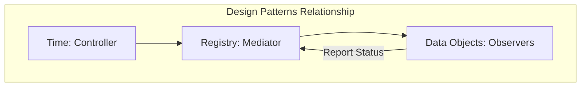

# Design Patterns in OpenFOAM

![[of_framework_lego_concept.png]]
`A conceptual architectural framework diagram showing different modules (Physics, Mesh, I/O) being plugged in like Lego blocks into a central hub (objectRegistry), scientific textbook diagram, clean vector line art, white background, high definition, flat design, educational infographic --ar 16:9`

## 5. Template Metaprogramming: Physics at Compile Time

OpenFOAM's extensive use of **Template Metaprogramming** represents one of the most sophisticated architectural decisions in the codebase.

**Fundamental Principles:**
- Compilers can deduce types and optimize based on mathematical properties
- Mathematical operations maintain dimensional consistency automatically at compile time
- No reliance on runtime type checking

![[of_template_metaprogramming_flow.png]]
`A flowchart showing the compile-time process of Template Metaprogramming: Type Deduction, Dimensional Checking, and Code Optimization, resulting in zero-overhead binaries, scientific textbook diagram, clean vector line art, white background, high definition, flat design, educational infographic --ar 16:9`

### Inner Product Operator Implementation

```cpp
template<class Type1, class Type2>
typename innerProduct<Type1, Type2>::type
operator&(const GeometricField<Type1, PatchField, GeoMesh>& f1,
          const GeometricField<Type2, PatchField, GeoMesh>& f2);
```

The `innerProduct` trait class determines result types based on input types:

| Input Type 1 | Input Type 2 | Result Type | Operation |
|--------------|--------------|-------------|-----------|
| `vector` | `vector` | `scalar` | Dot product |
| `vector` | `tensor` | `vector` | Tensor-vector multiplication |
| `tensor` | `tensor` | `tensor` | Tensor-tensor multiplication |

### Benefits of Template Metaprogramming

**✅ Type Safety:**
- Physically meaningless operations become **compiler errors** instead of runtime bugs
- Example: `scalar & scalar` fails compilation because `innerProduct<scalar, scalar>::type` is undefined

**⚡ Performance:**
- Compiler generates optimized code for each specific type combination
- Eliminates runtime type checking overhead
- Template instantiation at compile time creates highly efficient machine code

**🎯 Expressiveness:**
- Code reads as mathematical expressions while maintaining strict type checking
- Users write `U & U` for kinetic energy or `tau & gradU` for stress work without worrying about type conversions

### Complex Field Algebra

```cpp
template<class Type>
class GeometricField {
    template<class Type2>
    tmp<GeometricField<typename product<Type, Type2>::type, PatchField, GeoMesh>>
    operator*(const GeometricField<Type2, PatchField, GeoMesh>&) const;
};
```

The `product` trait ensures:
- Multiplying velocity field (vector) by density field (scalar)
- Creates momentum flux field (vector) with correct dimensional units automatically

---

## 5.2 Policy-Based Design: Boundary Condition Flexibility

OpenFOAM's **Policy-Based Design** intelligently applies template parameters to achieve runtime flexibility without sacrificing compile-time optimization.


> **Figure 1:** ความสัมพันธ์ระหว่างรูปแบบการออกแบบ (Design Patterns) ต่างๆ ใน OpenFOAM โดยมีคลาส Time เป็นตัวควบคุม และ Registry เป็นตัวกลางในการสื่อสารระหว่างออบเจ็กต์ข้อมูลความปลอดภัยทางฟิสิกส์ไม่ส่งผลกระทบต่อความเร็วในการจำลอง ผ่านการใช้พลังของ C++ Template Metaprogramming ในการตรวจสอบความสอดคล้องทางมิติทั้งหมดที่ขั้นตอนการคอมไพล์โปรแกรมเพียงครั้งเดียว

This architecture allows the same `GeometricField` implementation to work seamlessly across different discretization methods:

| Field Type | Template Parameters | Usage |
|-----------|---------------------|-------|
| Finite Volume | `GeometricField<Type, fvPatchField, volMesh>` | Standard FV discretization |
| Finite Element | `GeometricField<Type, femPatchField, femMesh>` | Finite element formulations |
| Finite Area | `GeometricField<Type, faPatchField, faMesh>` | Surface-based simulations |
| Point-Based | `GeometricField<Type, pointPatchField, pointMesh>` | Mesh-less particle methods |

### Policy Template Structure

```cpp
template<template<class> class PatchField, class GeoMesh>
class GeometricField {
    // Core field operations independent of boundary treatment
    // Boundary behavior delegated to PatchField<Type> policy
};
```

### Concrete Policy Implementation

```cpp
template<class Type>
class fvPatchField : public Field<Type> {
    const fvPatch& patch_;           // Geometric boundary information
    const DimensionedField<Type, volMesh>& internalField_;  // Connection to interior

    // Policy-specific boundary evaluation
    virtual void evaluate(const Pstream::commsTypes) = 0;
};
```

**Specific Boundary Condition Types:**

```cpp
template<class Type>
class fixedValueFvPatchField : public fvPatchField<Type> {
    virtual void evaluate(const Pstream::commsTypes) {
        // Set boundary values to fixed prescribed values
        this->operator==(this->refValue());
    }
};

template<class Type>
class zeroGradientFvPatchField : public fvPatchField<Type> {
    virtual void evaluate(const Pstream::commsTypes) {
        // Copy interior gradient to boundary (zero gradient condition)
        this->operator==(this->internalField().boundaryField()[this->patchIndex()].patchNeighbourField());
    }
};
```

### Extensibility

Users can create custom boundary condition types without modifying core field algebra:

```cpp
template<class Type>
class customBoundaryFvPatchField : public fvPatchField<Type> {
    // Custom boundary evaluation logic
    virtual void evaluate(const Pstream::commsTypes) {
        // User-defined boundary behavior
        this->operator==(customEvaluationFunction(this->internalField()));
    }
};
```

**Benefits of Policy-Based Design:**
- **Flexibility**: Supports a wide range of boundary conditions
- **Uniform Interface**: Same mathematical operators work regardless of specific boundary condition implementation
- **Independent Development**: New boundary conditions can be developed without affecting core field operations

---

## 5.3 RAII (Resource Acquisition Is Initialization)

OpenFOAM's **memory management strategy** relies heavily on RAII principles to ensure exception safety and prevent resource leaks in complex CFD simulations.

![[of_raii_memory_management.png]]
`A diagram illustrating RAII memory management: the lifecycle of autoPtr and tmp objects, showing automatic resource acquisition at construction and certain deletion at destruction, scientific textbook diagram, clean vector line art, white background, high definition, flat design, educational infographic --ar 16:9`

### The `autoPtr` Class: Exclusive Ownership

```cpp
template<class T>
class autoPtr {
private:
    T* ptr_;  // Raw pointer to managed object

public:
    // Constructor takes ownership
    explicit autoPtr(T* p = nullptr) : ptr_(p) {}

    // Destructor automatically deletes managed object
    ~autoPtr() { delete ptr_; }

    // Move transfer (no copy - exclusive ownership)
    autoPtr(autoPtr&& ap) noexcept : ptr_(ap.ptr_) { ap.ptr_ = nullptr; }

    // Access operators
    T& operator*() const { return *ptr_; }
    T* operator->() const { return ptr_; }
    T* get() const { return ptr_; }

    // Release ownership
    T* release() { T* tmp = ptr_; ptr_ = nullptr; return tmp; }
};
```

**Usage in Solver Algorithm:**

```cpp
// Create temporary field with automatic cleanup
autoPtr<volScalarField> pField
(
    new volScalarField
    (
        IOobject("p", runTime.timeName(), mesh, IOobject::NO_READ),
        mesh,
        dimensionedScalar("p", dimPressure, 0.0)
    )
);

// Field automatically destroyed when pField goes out of scope
// No need for manual delete, even if exceptions occur
```

### The `tmp` Class: Reference Counting for Temporary Fields

```cpp
template<class T>
class tmp {
private:
    mutable T* ptr_;
    mutable bool refCount_;

public:
    // Constructor from raw pointer (takes ownership)
    tmp(T* p, bool transfer = true) : ptr_(p), refCount_(!transfer) {}

    // Constructor from object (creates reference)
    tmp(T& t) : ptr_(&t), refCount_(true) {}

    // Copy constructor increments reference count
    tmp(const tmp<T>& t) : ptr_(t.ptr_), refCount_(true) {
        if (t.refCount_) t.refCount_ = false;
    }

    // Destructor manages cleanup based on reference count
    ~tmp() {
        if (ptr_ && !refCount_) delete ptr_;
    }

    // Automatic conversion to underlying type
    operator T&() const { return *ptr_; }
    T& operator()() const { return *ptr_; }
};
```

**Efficient Field Algebra Operations:**

```cpp
// tmp enables efficient temporary field chaining
tmp<volScalarField> magU = mag(U);                    // Creates temporary
tmp<volScalarField> magU2 = sqr(magU);               // Reuses temporary without copy
tmp<volVectorField> gradP = fvc::grad(p);            // Automatic cleanup

// Field operations return tmp objects for efficiency
tmp<volScalarField> divPhi = fvc::div(phi);          // Temporary divergence field
tmp<volVectorField> U2 = U + U;                      // Temporary sum field
```

### RAII for File I/O

The RAII pattern extends to file I/O through the `regIOobject` base class:

```cpp
class regIOobject : public IOobject {
    virtual bool write() const = 0;          // Pure virtual write operation
    virtual bool read() = 0;                 // Pure virtual read operation

    // Automatic file handle management
    // Files opened in constructor, closed in destructor
};
```

### Benefits of Comprehensive RAII

**✅ Exception Safe**: Resources properly cleaned up when exceptions occur
**✅ Memory Leak Free**: Automatic garbage collection prevents memory leaks
**✅ Performance Optimized**: Reference counting eliminates unnecessary copies
**✅ Maintainable**: Clear ownership semantics reduce debugging complexity

---

## 5.4 Type Erasure Through Typedefs

**OpenFOAM strategically employs type erasure** through a carefully designed typedef hierarchy that hides template complexity while maintaining type safety and performance.

### Core Typedef Structure

```cpp
// Core field typedefs hiding template complexity
typedef GeometricField<scalar, fvPatchField, volMesh> volScalarField;
typedef GeometricField<vector, fvPatchField, volMesh> volVectorField;
typedef GeometricField<tensor, fvPatchField, volMesh> volTensorField;
typedef GeometricField<symmTensor, fvPatchField, volMesh> volSymmTensorField;

// Surface field equivalents
typedef GeometricField<scalar, fvsPatchField, surfaceMesh> surfaceScalarField;
typedef GeometricField<vector, fvsPatchField, surfaceMesh> surfaceVectorField;

// Point mesh fields
typedef GeometricField<scalar, pointPatchField, pointMesh> pointScalarField;
```

### Intuitive Usage

```cpp
// User code reads naturally without template syntax
volScalarField p    // Pressure field
(
    IOobject("p", runTime.timeName(), mesh, IOobject::MUST_READ),
    mesh
);

volVectorField U    // Velocity field
(
    IOobject("U", runTime.timeName(), mesh, IOobject::MUST_READ),
    mesh
);

volScalarField T    // Temperature field
(
    IOobject("T", runTime.timeName(), mesh, IOobject::MUST_READ),
    mesh
);

// Mathematical expressions maintain natural syntax
volScalarField magU = mag(U);                    // Velocity magnitude
volScalarField ke = 0.5 * magU * magU;           // Kinetic energy
tmp<volVectorField> gradT = fvc::grad(T);       // Temperature gradient
```

### Dimensional Analysis Through Specialized Typedefs

```cpp
// Dimensioned scalar fields with embedded unit information
typedef DimensionedField<scalar, volMesh> volScalarField::Internal;
typedef DimensionedField<vector, volMesh> volVectorField::Internal;

// User can create fields with physical dimensions
dimensionedScalar rho
(
    "rho",
    dimensionSet(1, -3, 0, 0, 0, 0, 0),  // [kg/m³]
    1.2                                  // Initial value
);

volScalarField rhoField
(
    IOobject("rho", runTime.timeName(), mesh, IOobject::NO_READ),
    mesh,
    rho                                  // Inherits dimensional information
);
```

### Generic Programming Through Type Traits

```cpp
// Type traits for field introspection
template<class Type>
struct isVolField : public std::false_type {};

template<>
struct isVolField<volScalarField> : public std::true_type {};

template<>
struct isVolField<volVectorField> : public std::true_type {};

// Enable template specialization based on field type
template<class FieldType>
typename std::enable_if<isVolField<FieldType>::value, void>::type
processVolField(const FieldType& field) {
    // Volume field specific processing
}
```

### Benefits of Type Erasure Strategy

**✅ Accessibility**: Engineers focus on physics and numerics rather than template syntax
**✅ Consistency**: All field types follow the same interface pattern
**✅ Maintainability**: Changes to underlying template implementation don't impact user code
**✅ Extensibility**: New field types can be added through typedef declarations
**✅ Performance**: Zero runtime overhead - typedefs are compile-time constructs only

The typedef hierarchy represents a smart balance between sophisticated template metaprogramming and practical usability.

---

## 5.5 Separation of Concerns

**OpenFOAM's architecture** exemplifies the principle of separation of concerns through modular class design, where each component has a clearly defined, single responsibility.

### Composition of `GeometricField` Class

```cpp
template<class Type, template<class> class PatchField, class GeoMesh>
class GeometricField
: public Field<Type>,                    // Data storage responsibility
  public GeoMesh::Mesh,                  // Geometric context responsibility
  public regIOobject                     // I/O and file management responsibility
{
private:
    // Dimensional analysis component
    dimensionSet dimensions_;            // Physical units responsibility

    // Boundary condition management
    GeometricBoundaryField<PatchField> boundaryField_;  // Boundary behavior responsibility

    // Temporal field management
    tmp<GeometricField<Type, PatchField, GeoMesh>> oldTime_;  // Time history responsibility
};
```

### Responsibilities of Each Component

**1. Field<Type>**: Pure data container
```cpp
template<class Type>
class Field : public List<Type> {
    // Responsibilities:
    // - Raw data storage as contiguous memory array
    // - Element-wise mathematical operations (+, -, *, /)
    // - Memory management for field data
    // - NO knowledge of mesh, boundaries, or I/O

    Type& operator[](const label i) { return this->operator[](i); }
    void operator+=(const Field<Type>&);
    void operator*=(const Field<Type>&);
};
```

**2. dimensionSet**: Physical unit management
```cpp
class dimensionSet {
private:
    scalar mass_[7];  // [M, L, T, Θ, N, J, I] exponents

public:
    // Responsibilities:
    // - Physical unit representation and validation
    // - Dimensional analysis for mathematical operations
    // - Unit conversion between different systems
    // - NO knowledge of field values or mesh topology

    dimensionSet operator*(const dimensionSet&) const;  // Dimensional multiplication
    bool dimensionless() const;                         // Check if dimensionless
    void read(const dictionary&);                       // Read units from dictionary
};
```

**3. GeoMesh**: Spatial context and mesh topology
```cpp
template<class Mesh>
class GeoMesh {
public:
    typedef Mesh MeshType;

    // Responsibilities:
    // - Mesh geometry and topology information
    // - Spatial discretization details
    // - Cell-to-face connectivity
    // - NO knowledge of field values or boundary conditions

    static const Mesh& mesh(const GeoMesh&);
    label size() const;                    // Number of mesh elements
    const pointField& points() const;      // Mesh point coordinates
};
```

**4. PatchField**: Boundary condition implementation and evaluation
```cpp
template<class Type>
class PatchField : public Field<Type> {
protected:
    const patch& patch_;                   // Geometric boundary information

public:
    // Responsibilities:
    // - Boundary condition evaluation and application
    // - Patch-specific mathematical operations
    // - Coupling with neighboring processors/patches
    // - NO knowledge of interior field storage or global mesh

    virtual void updateCoeffs() = 0;       // Update boundary condition coefficients
    virtual tmp<Field<Type>> snGrad() const;  // Surface normal gradient
};
```

**5. regIOobject**: File I/O management and object registration
```cpp
class regIOobject : public IOobject {
private:
    bool watchIndex_;                      // File system monitoring

public:
    // Responsibilities:
    // - File I/O operations (read/write to disk)
    // - Object registration in object registry
    // - Automatic file watching and reloading
    // - NO knowledge of field mathematics or mesh geometry

    virtual bool writeData(Ostream&) const = 0;
    bool readIfModified();
    bool store();
};
```

### Benefits of Separation of Concerns

**✅ Independent Evolution**:
- Mesh systems can update without affecting field mathematics
- Boundary condition algorithms can improve without changing I/O mechanisms

**✅ Focused Testing**:
```cpp
// Test pure field mathematics
Field<scalar> testField1(10, 1.0), testField2(10, 2.0);
testField1 += testField2;  // Test addition without mesh complexity

// Test dimensional analysis
dimensionSet velocity(dimLength, dimTime, -1, 0, 0, 0, 0);
dimensionSet time(dimTime, 1);
dimensionSet length = velocity * time;  // Test dimensional consistency

// Test boundary conditions independently
fvPatchField<scalar> testPatch(testPatch_, testField);
testPatch.evaluate();  // Test boundary logic without field storage
```

**✅ Code Reuse**:
- The same `Field` class works for scalar, vector, and tensor fields
- The same I/O system works for fields, meshes, and boundary conditions

**✅ Clear Interfaces**:
- Each component has well-defined public interfaces
- Implementation complexity hidden from users
- Users interact with boundary conditions through `boundaryField_`

**✅ Maintainability**:
- Bugs can be isolated to specific components
- New features can be added to one aspect without affecting others

### Extension to Solver Architecture

The principle of separation of concerns extends to solver architecture:

```cpp
class simpleFoam : public fvMesh {
    // Separate physics components
    autoPtr<incompressible::turbulenceModel> turbulence_;  // Turbulence modeling
    volScalarField p;                                      // Pressure field
    volVectorField U;                                      // Velocity field

    // Separate numerical components
    fvVectorMatrix UEqn;                                   // Momentum equation matrix
    fvScalarMatrix pEqn;                                   // Pressure equation matrix

    // Separate control components
    simpleControl control_;                                // Solution algorithm control
};
```

This modular design enables complex CFD applications to be built from clearly defined, independently testable components - a hallmark of professional software architecture.
