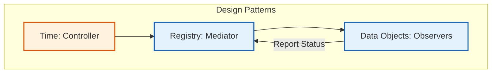

# Design Patterns in OpenFOAM

![[of_framework_lego_concept.png]]
`A conceptual architectural framework diagram showing different modules (Physics, Mesh, I/O) being plugged in like Lego blocks into a central hub (objectRegistry), scientific textbook diagram, clean vector line art, white background, high definition, flat design, educational infographic --ar 16:9`

## 5. Template Metaprogramming: Physics at Compile Time

OpenFOAM's extensive use of **Template Metaprogramming** represents one of the most sophisticated architectural decisions in the codebase.

**Fundamental Principles:**
- Compilers can deduce types and optimize based on mathematical properties
- Mathematical operations maintain dimensional consistency automatically at compile time
- No reliance on runtime type checking

![[of_template_metaprogramming_flow.png]]
`A flowchart showing the compile-time process of Template Metaprogramming: Type Deduction, Dimensional Checking, and Code Optimization, resulting in zero-overhead binaries, scientific textbook diagram, clean vector line art, white background, high definition, flat design, educational infographic --ar 16:9`

### Inner Product Operator Implementation

```cpp
// Template function for inner product operation between two geometric fields
// Type1 and Type2 are the field types (scalar, vector, tensor, etc.)
// The return type is automatically deduced based on input types
template<class Type1, class Type2>
typename innerProduct<Type1, Type2>::type
operator&(const GeometricField<Type1, PatchField, GeoMesh>& f1,
          const GeometricField<Type2, PatchField, GeoMesh>& f2);
```

> **📚 คำอธิบายภาษาไทย (Thai Explanation)**
>
> **แหล่งที่มา (Source):** ไฟล์นี้เป็นส่วนหนึ่งของระบบดำเนินการพีชคณิตเขตข้อมูล (field algebra operations) ใน OpenFOAM โดยมักจะพบได้ในไฟล์หัวข้อดังนี้:
> - 📂 `src/OpenFOAM/fields/GeometricFields/GeometricField/GeometricField.C`
> - 📂 `src/finiteVolume/fields/fvPatchFields/fvPatchField/fvPatchField.H`
>
> **คำอธิบาย (Explanation):**
> ฟังก์ชัน `operator&` เป็นการนำไปใช้งาน Template Metaprogramming เพื่อกำหนดประเภทผลลัพธ์โดยอัตโนมัติจากชนิดข้อมูลเข้า การดำเนินการนี้ทำให้คอมไพเลอร์สามารถตรวจสอบความสอดคล้องของมิติ (dimensional consistency) และประเภทข้อมูล (type safety) ได้ที่ขั้นตอนการคอมไพล์ แทนที่จะต้องตรวจสอบขณะโปรแกรมทำงาน (runtime)
>
> **แนวคิดสำคัญ (Key Concepts):**
> - **Type Deduction:** การอนุมานประเภทข้อมูลโดยคอมไพเลอร์
> - **Compile-time Type Checking:** การตรวจสอบชนิดข้อมูลที่ขั้นตอนการคอมไพล์
> - **Inner Product:** การคูณเชิงสเกลาร์ระหว่างเวกเตอร์หรือเทนเซอร์
> - **Trait Class:** คลาสที่กำหนดคุณสมบัติของประเภทข้อมูล

The `innerProduct` trait class determines result types based on input types:

| Input Type 1 | Input Type 2 | Result Type | Operation |
|--------------|--------------|-------------|-----------|
| `vector` | `vector` | `scalar` | Dot product |
| `vector` | `tensor` | `vector` | Tensor-vector multiplication |
| `tensor` | `tensor` | `tensor` | Tensor-tensor multiplication |

### Benefits of Template Metaprogramming

**✅ Type Safety:**
- Physically meaningless operations become **compiler errors** instead of runtime bugs
- Example: `scalar & scalar` fails compilation because `innerProduct<scalar, scalar>::type` is undefined

**⚡ Performance:**
- Compiler generates optimized code for each specific type combination
- Eliminates runtime type checking overhead
- Template instantiation at compile time creates highly efficient machine code

**🎯 Expressiveness:**
- Code reads as mathematical expressions while maintaining strict type checking
- Users write `U & U` for kinetic energy or `tau & gradU` for stress work without worrying about type conversions

### Complex Field Algebra

```cpp
// Template class for geometric field with generic type support
// Type: field data type (scalar, vector, tensor)
// PatchField: boundary condition policy
// GeoMesh: mesh type (finite volume, finite element, etc.)
template<class Type>
class GeometricField {
    // Template member function for multiplication operator
    // Type2: type of the right-hand operand field
    // Returns a temporary field object with the product result
    template<class Type2>
    tmp<GeometricField<typename product<Type, Type2>::type, PatchField, GeoMesh>>
    operator*(const GeometricField<Type2, PatchField, GeoMesh>&) const;
};
```

> **📚 คำอธิบายภาษาไทย (Thai Explanation)**
>
> **แหล่งที่มา (Source):** โครงสร้างพื้นฐานของคลาส GeometricField สามารถพบได้ที่:
> - 📂 `src/OpenFOAM/fields/GeometricFields/GeometricField/GeometricField.H`
> - 📂 `src/OpenFOAM/fields/GeometricFields/GeometricField/GeometricField.C`
>
> **คำอธิบาย (Explanation):**
> คลาส `GeometricField` เป็นคลาสเทมเพลตที่รองรับการดำเนินการทางคณิตศาสตร์ระหว่างเขตข้อมูลที่มีประเภทข้อมูลต่างกัน โดยมีการใช้ `product` trait เพื่อกำหนดประเภทข้อมูลของผลลัพธ์โดยอัตโนมัติ ทำให้สามารถคูณเขตข้อมูลความเร็ว (vector field) กับเขตข้อมูลความหนาแน่น (scalar field) เพื่อให้ได้เขตข้อมูลฟลักซ์โมเมนตัม (vector field) ที่มีหน่วยวัดที่ถูกต้อง
>
> **แนวคิดสำคัญ (Key Concepts):**
> - **Template Class:** คลาสที่รองรับหลายประเภทข้อมูล
> - **Type Traits:** กลไกการกำหนดคุณสมบัติของประเภทข้อมูล
> - **Field Algebra:** การดำเนินการทางคณิตศาสตร์บนเขตข้อมูล
> - **Dimensional Consistency:** ความสอดคล้องของมิติของหน่วยวัด
> - **tmp Object:** วัตถุชั่วคราวที่มีการจัดการหน่วยความจำอัตโนมัติ

The `product` trait ensures:
- Multiplying velocity field (vector) by density field (scalar)
- Creates momentum flux field (vector) with correct dimensional units automatically

---

## 5.2 Policy-Based Design: Boundary Condition Flexibility

OpenFOAM's **Policy-Based Design** intelligently applies template parameters to achieve runtime flexibility without sacrificing compile-time optimization.


> **Figure 1:** ความสัมพันธ์ระหว่างรูปแบบการออกแบบ (Design Patterns) ต่างๆ ใน OpenFOAM โดยมีคลาส Time เป็นตัวควบคุม และ Registry เป็นตัวกลางในการสื่อสารระหว่างออบเจ็กต์ข้อมูลความปลอดภัยทางฟิสิกส์ไม่ส่งผลกระทบต่อความเร็วในการจำลอง ผ่านการใช้พลังของ C++ Template Metaprogramming ในการตรวจสอบความสอดคล้องทางมิติทั้งหมดที่ขั้นตอนการคอมไพล์โปรแกรมเพียงครั้งเดียว

This architecture allows the same `GeometricField` implementation to work seamlessly across different discretization methods:

| Field Type | Template Parameters | Usage |
|-----------|---------------------|-------|
| Finite Volume | `GeometricField<Type, fvPatchField, volMesh>` | Standard FV discretization |
| Finite Element | `GeometricField<Type, femPatchField, femMesh>` | Finite element formulations |
| Finite Area | `GeometricField<Type, faPatchField, faMesh>` | Surface-based simulations |
| Point-Based | `GeometricField<Type, pointPatchField, pointMesh>` | Mesh-less particle methods |

### Policy Template Structure

```cpp
// Template class with policy-based design pattern
// PatchField: policy template parameter for boundary condition behavior
// GeoMesh: mesh type parameter (polymorphic base)
template<template<class> class PatchField, class GeoMesh>
class GeometricField {
    // Core field operations are independent of boundary treatment
    // Boundary behavior is delegated to PatchField<Type> policy class
    // This allows runtime flexibility with compile-time optimization
};
```

> **📚 คำอธิบายภาษาไทย (Thai Explanation)**
>
> **แหล่งที่มา (Source):** รูปแบบการออกแบบ Policy-Based สามารถพบได้ที่:
> - 📂 `src/OpenFOAM/fields/GeometricFields/GeometricField/GeometricField.H`
> - 📂 `src/finiteVolume/fields/fvPatchFields/fvPatchField/fvPatchField.H`
>
> **คำอธิบาย (Explanation):**
> Policy-Based Design Pattern เป็นการแยกพฤติกรรมของเงื่อนไขขอบ (boundary condition behavior) ออกจากคลาสหลักของเขตข้อมูล โดยใช้พารามิเตอร์เทมเพลต `PatchField` เป็น policy ที่สามารถเปลี่ยนแปลงได้ ทำให้สามารถใช้งานเขตข้อมูลเดียวกันกับเงื่อนไขขอบที่แตกต่างกันได้อย่างยืดหยุ่น โดยยังคงประสิทธิภาพการทำงานที่ขั้นตอนการคอมไพล์
>
> **แนวคิดสำคัญ (Key Concepts):**
> - **Policy Class:** คลาสที่กำหนดพฤติกรรมเฉพาะของ component
> - **Template Template Parameter:** พารามิเตอร์เทมเพลตที่เป็นเทมเพลตเอง
> - **Compile-time Polymorphism:** พหุนามแบบคอมไพล์ไทม์
> - **Code Reuse:** การนำโค้ดกลับมาใช้ใหม่
> - **Separation of Concerns:** การแยกความรับผิดชอบ

### Concrete Policy Implementation

```cpp
// Base class for finite volume patch field boundary conditions
// Type: field data type (scalar, vector, tensor, etc.)
template<class Type>
class fvPatchField : public Field<Type> {
    // Reference to the geometric boundary patch
    const fvPatch& patch_;
    
    // Reference to the internal field connected to this boundary
    const DimensionedField<Type, volMesh>& internalField_;

    // Pure virtual function for boundary condition evaluation
    // Must be implemented by derived classes for specific BC types
    virtual void evaluate(const Pstream::commsTypes) = 0;
};
```

> **📚 คำอธิบายภาษาไทย (Thai Explanation)**
>
> **แหล่งที่มา (Source):** การนำไปใช้งาน Policy-Based Design สามารถพบได้ที่:
> - 📂 `src/finiteVolume/fields/fvPatchFields/fvPatchField/fvPatchField.H`
> - 📂 `src/finiteVolume/fields/fvPatchFields/fvPatchField/fvPatchField.C`
> - 📂 `src/finiteVolume/fields/fvPatchFields/basic/fixedValue/fixedValueFvPatchField.H`
> - 📂 `src/finiteVolume/fields/fvPatchFields/basic/zeroGradient/zeroGradientFvPatchField.H`
>
> **คำอธิบาย (Explanation):**
> คลาส `fvPatchField` เป็นคลาสฐาน (base class) สำหรับการนำไปใช้งานเงื่อนไขขอบในระเบียบวิธีปริมาตรจำกัด (finite volume method) โดยมีการกำหนดฟังก์ชันเสมือน `evaluate()` ให้คลาสลูก (derived classes) ต้องนำไปใช้งานต่อ ทำให้สามารถสร้างเงื่อนไขขอบที่แตกต่างกันได้โดยไม่ต้องแก้ไขโครงสร้างหลักของคลาส
>
> **แนวคิดสำคัญ (Key Concepts):**
> - **Virtual Function:** ฟังก์ชันเสมือนที่รองรับพหุนามแบบรันไทม์
> - **Pure Virtual:** ฟังก์ชันเสมือนบริสุทธิ์ที่ต้องถูกนำไปใช้งาน
> - **Inheritance:** การสืบทอดคุณสมบัติของคลาส
> - **Boundary Patch:** ส่วนของเมชที่เป็นขอบ
> - **Internal Field:** เขตข้อมูลภายในที่เชื่อมต่อกับขอบ

**Specific Boundary Condition Types:**

```cpp
// Fixed value boundary condition implementation
// Sets boundary values to user-specified fixed values
template<class Type>
class fixedValueFvPatchField : public fvPatchField<Type> {
    // Implementation of fixed value boundary condition evaluation
    virtual void evaluate(const Pstream::commsTypes) {
        // Set boundary values to fixed prescribed values from user input
        this->operator==(this->refValue());
    }
};

// Zero gradient boundary condition implementation
// Sets boundary values to equal adjacent internal cell values
template<class Type>
class zeroGradientFvPatchField : public fvPatchField<Type> {
    // Implementation of zero gradient boundary condition evaluation
    virtual void evaluate(const Pstream::commsTypes) {
        // Copy interior gradient to boundary (zero gradient condition)
        // This ensures the field value at boundary equals neighboring internal value
        this->operator==(this->internalField().boundaryField()[this->patchIndex()].patchNeighbourField());
    }
};
```

> **📚 คำอธิบายภาษาไทย (Thai Explanation)**
>
> **แหล่งที่มา (Source):** การนำไปใช้งานเงื่อนไขขอบเฉพาะสามารถพบได้ที่:
> - 📂 `src/finiteVolume/fields/fvPatchFields/basic/fixedValue/fixedValueFvPatchField.C`
> - 📂 `src/finiteVolume/fields/fvPatchFields/basic/zeroGradient/zeroGradientFvPatchField.C`
>
> **คำอธิบาย (Explanation):**
> คลาสเหล่านี้เป็นการนำไปใช้งาน policy ที่เฉพาะเจาะจงสำหรับเงื่อนไขขอบที่พบบ่อย โดย `fixedValueFvPatchField` กำหนดค่าคงที่ที่ขอบ และ `zeroGradientFvPatchField` กำหนดให้ค่าที่ขอบเท่ากับค่าภายใน (gradient เป็นศูนย์) การแยกพฤติกรรมเหล่านี้ออกเป็นคลาสต่างหากทำให้สามารถเพิ่มเงื่อนไขขอบใหม่ๆ ได้โดยไม่กระทบต่อโค้ดหลัก
>
> **แนวคิดสำคัญ (Key Concepts):**
> - **Concrete Implementation:** การนำไปใช้งานจริงของ policy
> - **Dirichlet BC:** เงื่อนไขขอบประเภทกำหนดค่า (fixed value)
> - **Neumann BC:** เงื่อนไขขอบประเภทกำหนด gradient (zero gradient)
> - **Boundary Cell:** เซลล์ที่อยู่ติดกับขอบ
> - **Patch Index:** ดัชนีที่ระบุตำแหน่งของขอบ

### Extensibility

Users can create custom boundary condition types without modifying core field algebra:

```cpp
// Custom boundary condition implementation example
// Users can extend fvPatchField to create specialized BC types
template<class Type>
class customBoundaryFvPatchField : public fvPatchField<Type> {
    // Custom boundary evaluation logic
    virtual void evaluate(const Pstream::commsTypes) {
        // User-defined boundary behavior
        // Example: apply non-linear boundary condition or time-dependent BC
        this->operator==(customEvaluationFunction(this->internalField()));
    }
};
```

> **📚 คำอธิบายภาษาไทย (Thai Explanation)**
>
> **แหล่งที่มา (Source):** ผู้ใช้สามารถสร้างเงื่อนไขขอบแบบปรับแต่งเองได้ที่:
> - 📂 `src/finiteVolume/fields/fvPatchFields/` (สำหรับเพิ่มเงื่อนไขขอบใหม่)
> - 📂 `User` directory ใน case files สำหรับ BC แบบกำหนดเอง
>
> **คำอธิบาย (Explanation):**
> ความยืดหยุ่นของ Policy-Based Design ทำให้ผู้ใช้สามารถสร้างเงื่อนไขขอบแบบปรับแต่งเองได้โดยการสืบทอดจากคลาส `fvPatchField` และนำไปใช้งานฟังก์ชัน `evaluate()` ตามความต้องการ ทำให้ไม่ต้องแก้ไขโค้ดหลักของ OpenFOAM และยังคงประสิทธิภาพการทำงาน
>
> **แนวคิดสำคัญ (Key Concepts):**
> - **Extensibility:** ความสามารถในการขยายฟังก์ชันการทำงาน
> - **User-Defined BC:** เงื่อนไขขอบที่ผู้ใช้กำหนดเอง
> - **Non-linear BC:** เงื่อนไขขอบแบบไม่เชิงเส้น
> - **Time-Dependent BC:** เงื่อนไขขอบที่ขึ้นกับเวลา
> - **Plugin Architecture:** สถาปัตยกรรมปลั๊กอินที่รองรับการเพิ่มความสามารถ

**Benefits of Policy-Based Design:**
- **Flexibility**: Supports a wide range of boundary conditions
- **Uniform Interface**: Same mathematical operators work regardless of specific boundary condition implementation
- **Independent Development**: New boundary conditions can be developed without affecting core field operations

---

## 5.3 RAII (Resource Acquisition Is Initialization)

OpenFOAM's **memory management strategy** relies heavily on RAII principles to ensure exception safety and prevent resource leaks in complex CFD simulations.

![[of_raii_memory_management.png]]
`A diagram illustrating RAII memory management: the lifecycle of autoPtr and tmp objects, showing automatic resource acquisition at construction and certain deletion at destruction, scientific textbook diagram, clean vector line art, white background, high definition, flat design, educational infographic --ar 16:9`

### The `autoPtr` Class: Exclusive Ownership

```cpp
// Smart pointer class for exclusive ownership management
// T: type of managed object
template<class T>
class autoPtr {
private:
    T* ptr_;  // Raw pointer to the managed object

public:
    // Constructor takes ownership of the raw pointer
    explicit autoPtr(T* p = nullptr) : ptr_(p) {}

    // Destructor automatically deletes the managed object
    // Ensures no memory leaks even when exceptions occur
    ~autoPtr() { delete ptr_; }

    // Move constructor transfers ownership (no copy - exclusive ownership)
    // Transfers pointer ownership from ap to this object
    autoPtr(autoPtr&& ap) noexcept : ptr_(ap.ptr_) { ap.ptr_ = nullptr; }

    // Dereference operators for accessing the managed object
    T& operator*() const { return *ptr_; }      // Dereference to get reference
    T* operator->() const { return ptr_; }     // Arrow operator for member access
    T* get() const { return ptr_; }            // Get raw pointer without releasing

    // Release ownership of the managed object
    // Returns the raw pointer and sets internal pointer to null
    T* release() { T* tmp = ptr_; ptr_ = nullptr; return tmp; }
};
```

> **📚 คำอธิบายภาษาไทย (Thai Explanation)**
>
> **แหล่งที่มา (Source):** การนำไปใช้งาน RAII สามารถพบได้ที่:
> - 📂 `src/OpenFOAM/memory/autoPtr/autoPtr.H`
> - 📂 `src/OpenFOAM/memory/autoPtr/autoPtr.C`
>
> **คำอธิบาย (Explanation):**
> คลาส `autoPtr` เป็น smart pointer ที่ใช้หลักการ RAII (Resource Acquisition Is Initialization) เพื่อจัดการหน่วยความจำอัตโนมัติ โดยมีการถือครองแบบ exclusive (ไม่สามารถมี owner มากกว่าหนึ่ง) และมีการทำลายออบเจ็กต์อัตโนมัติเมื่อไม่ได้ใช้งาน ทำให้ไม่เกิดปัญหา memory leak แม้ในสถานการณ์ที่เกิด exception
>
> **แนวคิดสำคัญ (Key Concepts):**
> - **RAII:** การจัดการทรัพยากรผ่าน constructor/destructor
> - **Smart Pointer:** พอยเตอร์อัจฉริยะที่จัดการหน่วยความจำอัตโนมัติ
> - **Exclusive Ownership:** การถือครองแบบเฉพาะเจาะจง
> - **Move Semantics:** การเคลื่อนย้ายความเป็นเจ้าของ
> - **Exception Safety:** ความปลอดภัยเมื่อเกิดข้อผิดพลาด
> - **Memory Leak Prevention:** การป้องกันการรั่วไหลของหน่วยความจำ

**Usage in Solver Algorithm:**

```cpp
// Create temporary field with automatic cleanup
// autoPtr ensures the field is deleted when going out of scope
autoPtr<volScalarField> pField
(
    new volScalarField
    (
        // IOobject for field I/O configuration
        IOobject("p", runTime.timeName(), mesh, IOobject::NO_READ),
        mesh,  // Mesh reference
        dimensionedScalar("p", dimPressure, 0.0)  // Initial value
    )
);

// Field automatically destroyed when pField goes out of scope
// No need for manual delete, even if exceptions occur
// This is the power of RAII in OpenFOAM
```

> **📚 คำอธิบายภาษาไทย (Thai Explanation)**
>
> **แหล่งที่มา (Source):** การใช้งาน autoPtr ใน solver สามารถพบได้ที่:
> - 📂 `applications/solvers/incompressible/simpleFoam/createFields.H`
> - 📂 `applications/solvers/basic/potentialFoam/createFields.H`
>
> **คำอธิบาย (Explanation):**
> ในการสร้างเขตข้อมูลชั่วคราวสำหรับการคำนวณ การใช้ `autoPtr` ช่วยให้มั่นใจได้ว่าหน่วยความจำจะถูกคืนอัตโนมัติเมื่อเขตข้อมูลไม่ได้ถูกใช้งาน ไม่ว่าจะเป็นการจบฟังก์ชันปกติหรือเกิด exception ทำให้ไม่ต้องเขียนโค้ดสำหรับลบหน่วยความจำด้วยตนเอง
>
> **แนวคิดสำคัญ (Key Concepts):**
> - **Automatic Cleanup:** การทำความสะอาดอัตโนมัติ
> - **Scope-based Management:** การจัดการตามขอบเขต
> - **Exception Guarantee:** การรับประกันความปลอดภัยเมื่อเกิด exception
> - **No Manual Delete:** ไม่ต้องลบหน่วยความจำด้วยตนเอง
> - **Deterministic Destruction:** การทำลายที่แน่นอนตามขอบเขต

### The `tmp` Class: Reference Counting for Temporary Fields

```cpp
// Template class for temporary field management with reference counting
// T: type of managed object (usually a field type)
template<class T>
class tmp {
private:
    mutable T* ptr_;        // Raw pointer to managed object
    mutable bool refCount_; // Reference count flag for ownership tracking

public:
    // Constructor from raw pointer (takes ownership if transfer=true)
    tmp(T* p, bool transfer = true) : ptr_(p), refCount_(!transfer) {}

    // Constructor from object reference (creates reference, doesn't take ownership)
    tmp(T& t) : ptr_(&t), refCount_(true) {}

    // Copy constructor increments reference count
    // Transfers ownership from t to this object if t owns the pointer
    tmp(const tmp<T>& t) : ptr_(t.ptr_), refCount_(true) {
        if (t.refCount_) t.refCount_ = false;
    }

    // Destructor manages cleanup based on reference count
    // Deletes object only if this is the last reference (refCount_ == false)
    ~tmp() {
        if (ptr_ && !refCount_) delete ptr_;
    }

    // Automatic conversion to underlying type reference
    operator T&() const { return *ptr_; }
    
    // Function call operator for accessing underlying object
    T& operator()() const { return *ptr_; }
};
```

> **📚 คำอธิบายภาษาไทย (Thai Explanation)**
>
> **แหล่งที่มา (Source):** การนำไปใช้งาน tmp สามารถพบได้ที่:
> - 📂 `src/OpenFOAM/memory/tmp/tmp.H`
> - 📂 `src/OpenFOAM/memory/tmp/tmp.C`
>
> **คำอธิบาย (Explanation):**
> คลาส `tmp` ใช้ reference counting เพื่อจัดการหน่วยความจำของวัตถุชั่วคราว โดยอนุญาตให้มีการอ้างอิงหลายแห่งโดยไม่ต้องคัดลอกข้อมูล เมื่อไม่มีการอ้างอิงเหลืออยู่ วัตถุจะถูกทำลายโดยอัตโนมัติ ทำให้เหมาะสำหรับการดำเนินการเขตข้อมูลที่สร้างค่าชั่วคราวหลายครั้ง
>
> **แนวคิดสำคัญ (Key Concepts):**
> - **Reference Counting:** การนับจำนวนการอ้างอิง
> - **Shared Ownership:** การถือครองแบบแชร์
> - **Copy-on-Write:** การคัดลอกเมื่อมีการเขียน
> - **Lazy Evaluation:** การประเมินผลแบบล่าช้า
> - **Zero-Copy Abstraction:** การนามธรรมแบบไม่คัดลอก
> - **Temporary Object:** วัตถุชั่วคราว

**Efficient Field Algebra Operations:**

```cpp
// tmp enables efficient temporary field chaining
// Each operation returns a tmp object that can be reused
tmp<volScalarField> magU = mag(U);                    // Creates temporary magnitude field
tmp<volScalarField> magU2 = sqr(magU);               // Reuses temporary without copying
tmp<volVectorField> gradP = fvc::grad(p);            // Automatic cleanup after gradient

// Field operations return tmp objects for efficiency
tmp<volScalarField> divPhi = fvc::div(phi);          // Temporary divergence field
tmp<volVectorField> U2 = U + U;                      // Temporary sum field

// All tmp objects automatically cleaned up at end of scope
// No manual memory management required
```

> **📚 คำอธิบายภาษาไทย (Thai Explanation)**
>
> **แหล่งที่มา (Source):** การใช้งาน tmp ในการดำเนินการเขตข้อมูลสามารถพบได้ที่:
> - 📂 `src/finiteVolume/fvc/fvcGrad.C`
> - 📂 `src/finiteVolume/fvc/fvcDiv.C`
> - 📂 `src/OpenFOAM/fields/Fields/Field/FieldFunctions.C`
>
> **คำอธิบาย (Explanation):**
> การใช้ `tmp` ในการดำเนินการเขตข้อมูลทำให้สามารถเชื่อมโยงการคำนวณได้อย่างมีประสิทธิภาพโดยไม่ต้องคัดลอกข้อมูล แต่ละการดำเนินการสร้างวัตถุ `tmp` ที่สามารถนำกลับมาใช้ใหม่ได้ และจะถูกทำลายโดยอัตโนมัติเมื่อไม่ได้ใช้งาน ทำให้ประหยัดหน่วยความจำและเพิ่มประสิทธิภาพ
>
> **แนวคิดสำคัญ (Key Concepts):**
> - **Expression Templates:** เทมเพลตนิพจน์สำหรับการปรับให้เหมาะสม
> - **Operator Overloading:** การโหลด operator ซ้ำ
> - **Temporary Chaining:** การเชื่อมโยงการดำเนินการชั่วคราว
> - **Memory Efficiency:** ประสิทธิภาพการใช้หน่วยความจำ
> - **Automatic Cleanup:** การทำความสะอาดอัตโนมัติ
> - **Zero-Overhead Abstraction:** การนามธรรมแบบไม่มีค่าใช้จ่ายเพิ่มเติม

### RAII for File I/O

The RAII pattern extends to file I/O through the `regIOobject` base class:

```cpp
// Base class for registered I/O objects with automatic file management
// Inherits from IOobject for file I/O configuration
class regIOobject : public IOobject {
    // Pure virtual function for writing data to disk
    // Derived classes must implement specific write behavior
    virtual bool write() const = 0;
    
    // Pure virtual function for reading data from disk
    // Derived classes must implement specific read behavior
    virtual bool read() = 0;

    // Automatic file handle management
    // Files are opened in constructor and closed in destructor
    // This ensures proper resource cleanup even when exceptions occur
};
```

> **📚 คำอธิบายภาษาไทย (Thai Explanation)**
>
> **แหล่งที่มา (Source):** การนำไปใช้งาน RAII สำหรับ File I/O สามารถพบได้ที่:
> - 📂 `src/OpenFOAM/db/regIOobject/regIOobject.H`
> - 📂 `src/OpenFOAM/db/regIOobject/regIOobject.C`
>
> **คำอธิบาย (Explanation):**
> คลาส `regIOobject` ใช้หลักการ RAII สำหรับการจัดการไฟล์ I/O โดยมีการเปิดไฟล์ใน constructor และปิดไฟล์ใน destructor ทำให้มั่นใจได้ว่าไฟล์จะถูกปิดอย่างถูกต้องแม้ในสถานการณ์ที่เกิด exception ทำให้ไม่เกิดปัญหา file handle leak
>
> **แนวคิดสำคัญ (Key Concepts):**
> - **File Handle Management:** การจัดการ file handle
> - **Automatic Resource Management:** การจัดการทรัพยากรอัตโนมัติ
> - **Exception Safety:** ความปลอดภัยเมื่อเกิดข้อผิดพลาด
> - **Resource Leak Prevention:** การป้องกันการรั่วไหลของทรัพยากร
> - **Deterministic Cleanup:** การทำความสะอาดที่แน่นอน
> - **Scope-bound Resource Management:** การจัดการทรัพยากรตามขอบเขต

### Benefits of Comprehensive RAII

**✅ Exception Safe**: Resources properly cleaned up when exceptions occur
**✅ Memory Leak Free**: Automatic garbage collection prevents memory leaks
**✅ Performance Optimized**: Reference counting eliminates unnecessary copies
**✅ Maintainable**: Clear ownership semantics reduce debugging complexity

---

## 5.4 Type Erasure Through Typedefs

**OpenFOAM strategically employs type erasure** through a carefully designed typedef hierarchy that hides template complexity while maintaining type safety and performance.

### Core Typedef Structure

```cpp
// Core field typedefs hiding template complexity from users
// These typedefs provide simple names for complex template instantiations

// Volume field typedefs for finite volume method
typedef GeometricField<scalar, fvPatchField, volMesh> volScalarField;
typedef GeometricField<vector, fvPatchField, volMesh> volVectorField;
typedef GeometricField<tensor, fvPatchField, volMesh> volTensorField;
typedef GeometricField<symmTensor, fvPatchField, volMesh> volSymmTensorField;

// Surface field typedefs for face-based calculations
typedef GeometricField<scalar, fvsPatchField, surfaceMesh> surfaceScalarField;
typedef GeometricField<vector, fvsPatchField, surfaceMesh> surfaceVectorField;

// Point mesh fields for particle-based simulations
typedef GeometricField<scalar, pointPatchField, pointMesh> pointScalarField;
```

> **📚 คำอธิบายภาษาไทย (Thai Explanation)**
>
> **แหล่งที่มา (Source):** การนิยาม typedef เหล่านี้สามารถพบได้ที่:
> - 📂 `src/finiteVolume/fields/volFields/volFields.H`
> - 📂 `src/finiteVolume/fields/surfaceFields/surfaceFields.H`
> - 📂 `src/finiteVolume/fields/pointFields/pointFields.H`
>
> **คำอธิบาย (Explanation):**
> การใช้ typedef ช่วยซ่อนความซับซ้อนของ template ทำให้ผู้ใช้สามารถเขียนโค้ดที่อ่านง่ายและเข้าใจได้โดยไม่ต้องรู้รายละเอียดของ template parameters ทั้งหมด นี่เป็นตัวอย่างของ Type Erasure ที่ยังคงประสิทธิภาพการทำงาน
>
> **แนวคิดสำคัญ (Key Concepts):**
> - **Type Erasure:** การซ่อนประเภทข้อมูลที่ซับซ้อน
> - **Typedef:** การนิยามชื่อแทนสำหรับประเภทข้อมูล
> - **Template Instantiation:** การสร้างอินสแตนซ์ของ template
> - **Code Readability:** ความสามารถในการอ่านโค้ด
> - **User Interface:** ส่วนติดต่อผู้ใช้ที่เรียบง่าย
> - **Zero-Cost Abstraction:** การนามธรรมแบบไม่มีค่าใช้จ่าย

### Intuitive Usage

```cpp
// User code reads naturally without complex template syntax
// These typedefs make CFD code look like mathematical notation

// Create pressure field (volScalarField)
volScalarField p    // Pressure field
(
    IOobject("p", runTime.timeName(), mesh, IOobject::MUST_READ),
    mesh
);

// Create velocity field (volVectorField)
volVectorField U    // Velocity field
(
    IOobject("U", runTime.timeName(), mesh, IOobject::MUST_READ),
    mesh
);

// Create temperature field (volScalarField)
volScalarField T    // Temperature field
(
    IOobject("T", runTime.timeName(), mesh, IOobject::MUST_READ),
    mesh
);

// Mathematical expressions maintain natural syntax
// Operators work exactly like in mathematical equations
volScalarField magU = mag(U);                    // Velocity magnitude
volScalarField ke = 0.5 * magU * magU;           // Kinetic energy
tmp<volVectorField> gradT = fvc::grad(T);       // Temperature gradient
```

> **📚 คำอธิบายภาษาไทย (Thai Explanation)**
>
> **แหล่งที่มา (Source):** การใช้งาน typedef ใน solver สามารถพบได้ที่:
> - 📂 `applications/solvers/heatTransfer/chtMultiRegionFoam/createFields.H`
> - 📂 `applications/solvers/incompressible/pimpleFoam/createFields.H`
>
> **คำอธิบาย (Explanation):**
> การใช้ typedef ทำให้โค้ด CFD อ่านง่ายและใกล้เคียงกับสมการคณิตศาสตร์ โดยผู้ใช้ไม่ต้องกังวลกับความซับซ้อนของ template ทำให้สามารถมุ่งเน้นที่ฟิสิกส์และเคมีการคำนวณมากกว่ารายละเอียดของภาษา C++
>
> **แนวคิดสำคัญ (Key Concepts):**
> - **Mathematical Notation:** สัญลักษณ์ทางคณิตศาสตร์
> - **Domain-Specific Language:** ภาษาเฉพาะทางโดเมน
> - **Operator Overloading:** การโหลด operator ซ้ำ
> - **Expressive Code:** โค้ดที่แสดงความหมายได้ชัดเจน
> - **Field Operations:** การดำเนินการบนเขตข้อมูล
> - **Physical Intuition:** ความเข้าใจทางฟิสิกส์

### Dimensional Analysis Through Specialized Typedefs

```cpp
// Dimensioned scalar fields with embedded unit information
// DimensionedField provides dimensional analysis capabilities

// Volume field internal types for dimensional fields
typedef DimensionedField<scalar, volMesh> volScalarField::Internal;
typedef DimensionedField<vector, volMesh> volVectorField::Internal;

// User can create fields with physical dimensions
// DimensionedScalar combines value with dimensional information
dimensionedScalar rho
(
    "rho",  // Name
    dimensionSet(1, -3, 0, 0, 0, 0, 0),  // [kg/m³] Mass density units
    1.2                                  // Initial value in kg/m³
);

// Create density field with dimensional information
// The field inherits dimensional information from dimensionedScalar
volScalarField rhoField
(
    IOobject("rho", runTime.timeName(), mesh, IOobject::NO_READ),
    mesh,
    rho  // Inherits dimensional information automatically
);
```

> **📚 คำอธิบายภาษาไทย (Thai Explanation)**
>
> **แหล่งที่มา (Source):** การนำไปใช้งาน DimensionedField สามารถพบได้ที่:
> - 📂 `src/OpenFOAM/fields/DimensionedFields/DimensionedField/DimensionedField.H`
> - 📂 `src/OpenFOAM/dimensionSet/dimensionSet.H`
> - 📂 `src/OpenFOAM/dimensionedTypes/dimensionedScalar/dimensionedScalar.H`
>
> **คำอธิบาย (Explanation):**
> OpenFOAM มีระบบวิเคราะห์มิติ (dimensional analysis) ที่ฝังอยู่ในประเภทข้อมูล ทำให้คอมไพเลอร์สามารถตรวจสอบความสอดคล้องของหน่วยวัดได้ที่ขั้นตอนการคอมไพล์ ช่วยป้องกันข้อผิดพลาดจากการใช้หน่วยวัดที่ไม่ถูกต้อง
>
> **แนวคิดสำคัญ (Key Concepts):**
> - **Dimensional Analysis:** การวิเคราะห์มิติ
> - **Physical Units:** หน่วยวัดทางฟิสิกส์
> - **Unit Consistency:** ความสอดคล้องของหน่วยวัด
> - **Compile-time Checking:** การตรวจสอบที่ขั้นตอนการคอมไพล์
> - **Type Safety:** ความปลอดภัยของประเภทข้อมูล
> - **SI Units:** ระบบหน่วยวัดสากล

### Generic Programming Through Type Traits

```cpp
// Type traits for field introspection and compile-time type checking
// Enable template specialization based on field type

// Default template: isVolField is false for all types
template<class Type>
struct isVolField : public std::false_type {};

// Specialization for volScalarField: isVolField is true
template<>
struct isVolField<volScalarField> : public std::true_type {};

// Specialization for volVectorField: isVolField is true
template<>
struct isVolField<volVectorField> : public std::true_type {};

// Enable template specialization based on field type
// This function only compiles for volume field types
template<class FieldType>
typename std::enable_if<isVolField<FieldType>::value, void>::type
processVolField(const FieldType& field) {
    // Volume field specific processing
    // This code only exists for volume fields, not surface or point fields
}
```

> **📚 คำอธิบายภาษาไทย (Thai Explanation)**
>
> **แหล่งที่มา (Source):** การใช้งาน Type Traits สามารถพบได้ที่:
> - 📂 `src/OpenFOAM/fields/Fields/Field/Field.H`
> - 📂 `src/OpenFOAM/primitives/Lists/Lists.H`
>
> **คำอธิบาย (Explanation):**
> Type Traits เป็นเทคนิคที่ใช้ในการตรวจสอบคุณสมบัติของประเภทข้อมูลที่ขั้นตอนการคอมไพล์ ทำให้สามารถเขียนโค้ดที่มีพฤติกรรมต่างกันขึ้นอยู่กับประเภทข้อมูล โดยไม่ต้องใช้ runtime type checking
>
> **แนวคิดสำคัญ (Key Concepts):**
> - **Type Traits:** ลักษณะของประเภทข้อมูล
> - **Compile-time Introspection:** การตรวจสอบประเภทที่ขั้นตอนการคอมไพล์
> - **Template Specialization:** การเขียน template แบบเฉพาะ
> - **SFINAE:** Substitution Failure Is Not An Error
> - **Enable_if:** เงื่อนไขการคอมไพล์ตามประเภทข้อมูล
> - **Generic Programming:** การเขียนโปรแกรมแบบสามัญ

### Benefits of Type Erasure Strategy

**✅ Accessibility**: Engineers focus on physics and numerics rather than template syntax
**✅ Consistency**: All field types follow the same interface pattern
**✅ Maintainability**: Changes to underlying template implementation don't impact user code
**✅ Extensibility**: New field types can be added through typedef declarations
**✅ Performance**: Zero runtime overhead - typedefs are compile-time constructs only

The typedef hierarchy represents a smart balance between sophisticated template metaprogramming and practical usability.

---

## 5.5 Separation of Concerns

**OpenFOAM's architecture** exemplifies the principle of separation of concerns through modular class design, where each component has a clearly defined, single responsibility.

### Composition of `GeometricField` Class

```cpp
// Template class for geometric field with multiple inheritance
// Each base class provides a specific responsibility
template<class Type, template<class> class PatchField, class GeoMesh>
class GeometricField
: public Field<Type>,                    // Data storage responsibility
  public GeoMesh::Mesh,                  // Geometric context responsibility
  public regIOobject                     // I/O and file management responsibility
{
private:
    // Dimensional analysis component
    dimensionSet dimensions_;            // Physical units responsibility

    // Boundary condition management
    GeometricBoundaryField<PatchField> boundaryField_;  // Boundary behavior responsibility

    // Temporal field management
    tmp<GeometricField<Type, PatchField, GeoMesh>> oldTime_;  // Time history responsibility
};
```

> **📚 คำอธิบายภาษาไทย (Thai Explanation)**
>
> **แหล่งที่มา (Source):** โครงสร้างของ GeometricField สามารถพบได้ที่:
> - 📂 `src/OpenFOAM/fields/GeometricFields/GeometricField/GeometricField.H`
> - 📂 `src/OpenFOAM/fields/GeometricFields/GeometricField/GeometricField.C`
>
> **คำอธิบาย (Explanation):**
> คลาส `GeometricField` ใช้ multiple inheritance เพื่อแยกความรับผิดชอบออกเป็นส่วนๆ ที่ชัดเจน แต่ละ base class มีหน้าที่เฉพาะทางของตัวเอง ทำให้สามารถพัฒนาและบำรุงรักษาแต่ละส่วนได้อย่างอิสระ
>
> **แนวคิดสำคัญ (Key Concepts):**
> - **Multiple Inheritance:** การสืบทอดหลายแหล่ง
> - **Single Responsibility Principle:** หลักการรับผิดชอบเดียว
> - **Modular Design:** การออกแบบแบบโมดูลาร์
> - **Composition over Inheritance:** การเรียบเรียงมากกว่าการสืบทอด
> - **Interface Segregation:** การแยกส่วนติดต่อ
> - **Code Organization:** การจัดระเบียบโค้ด

### Responsibilities of Each Component

**1. Field<Type>**: Pure data container

```cpp
// Template class for pure data storage and element-wise operations
// Inherits from List<Type> for contiguous memory storage
template<class Type>
class Field : public List<Type> {
    // Responsibilities:
    // - Raw data storage as contiguous memory array
    // - Element-wise mathematical operations (+, -, *, /)
    // - Memory management for field data
    // - NO knowledge of mesh, boundaries, or I/O

    // Access operator for individual elements
    Type& operator[](const label i) { return this->operator[](i); }
    
    // Compound assignment operators for in-place operations
    void operator+=(const Field<Type>&);  // Add another field element-wise
    void operator*=(const Field<Type>&);  // Multiply element-wise
};
```

> **📚 คำอธิบายภาษาไทย (Thai Explanation)**
>
> **แหล่งที่มา (Source):** คลาส Field สามารถพบได้ที่:
> - 📂 `src/OpenFOAM/fields/Fields/Field/Field.H`
> - 📂 `src/OpenFOAM/fields/Fields/Field/Field.C`
>
> **คำอธิบาย (Explanation):**
> คลาส `Field` เป็นคลาสที่รับผิดชอบเกี่ยวกับการจัดเก็บข้อมูลและการดำเนินการทางคณิตศาสตร์เชิงองค์ประกอบเท่านั้น โดยไม่มีความรู้เกี่ยวกับ mesh, boundary conditions หรือ I/O ทำให้สามารถทดสอบและนำกลับมาใช้ใหม่ได้ง่าย
>
> **แนวคิดสำคัญ (Key Concepts):**
> - **Data Container:** คอนเทนเนอร์สำหรับเก็บข้อมูล
> - **Contiguous Memory:** หน่วยความจำต่อเนื่อง
> - **Element-wise Operations:** การดำเนินการเชิงองค์ประกอบ
> - **Compound Assignment:** การกำหนดค่าแบบผสม
> - **Memory Efficiency:** ประสิทธิภาพการใช้หน่วยความจำ
> - **Pure Data:** ข้อมูลบริสุทธิ์โดยไม่มีความรู้อื่น

**2. dimensionSet**: Physical unit management

```cpp
// Class for representing and managing physical units
// Uses SI unit system with 7 base dimensions
class dimensionSet {
private:
    scalar mass_[7];  // Exponents for [M, L, T, Θ, N, J, I] base dimensions
                      // Mass, Length, Time, Temperature, Amount, Current, Luminous intensity

public:
    // Responsibilities:
    // - Physical unit representation and validation
    // - Dimensional analysis for mathematical operations
    // - Unit conversion between different systems
    // - NO knowledge of field values or mesh topology

    // Dimensional multiplication operator
    dimensionSet operator*(const dimensionSet&) const;
    
    // Check if the quantity is dimensionless
    bool dimensionless() const;
    
    // Read units from dictionary file
    void read(const dictionary&);
};
```

> **📚 คำอธิบายภาษาไทย (Thai Explanation)**
>
> **แหล่งที่มา (Source):** คลาส dimensionSet สามารถพบได้ที่:
> - 📂 `src/OpenFOAM/dimensionSet/dimensionSet.H`
> - 📂 `src/OpenFOAM/dimensionSet/dimensionSet.C`
>
> **คำอธิบาย (Explanation):**
> คลาส `dimensionSet` รับผิดชอบในการจัดการหน่วยวัดทางฟิสิกส์ โดยใช้ระบบหน่วยวัด SI กับ 7 มิติพื้นฐาน ทำให้สามารถตรวจสอบความสอดคล้องของหน่วยวัดในการดำเนินการทางคณิตศาสตร์ได้อัตโนมัติ
>
> **แนวคิดสำคัญ (Key Concepts):**
> - **SI Units:** ระบบหน่วยวัดสากล
> - **Base Dimensions:** มิติพื้นฐาน 7 มิติ
> - **Dimensional Homogeneity:** ความเป็นเนื้อเดียวกันทางมิติ
> - **Unit Conversion:** การแปลงหน่วยวัด
> - **Physical Consistency:** ความสอดคล้องทางฟิสิกส์
> - **Dimensional Analysis:** การวิเคราะห์มิติ

**3. GeoMesh**: Spatial context and mesh topology

```cpp
// Template class providing mesh geometry and topology information
// Mesh: specific mesh type (fvMesh, femMesh, faMesh, etc.)
template<class Mesh>
class GeoMesh {
public:
    typedef Mesh MeshType;

    // Responsibilities:
    // - Mesh geometry and topology information
    // - Spatial discretization details
    // - Cell-to-face connectivity
    // - NO knowledge of field values or boundary conditions

    // Static function to get mesh reference
    static const Mesh& mesh(const GeoMesh&);
    
    // Get number of mesh elements (cells, faces, points)
    label size() const;
    
    // Get mesh point coordinates
    const pointField& points() const;
};
```

> **📚 คำอธิบายภาษาไทย (Thai Explanation)**
>
> **แหล่งที่มา (Source):** คลาส GeoMesh สามารถพบได้ที่:
> - 📂 `src/OpenFOAM/meshes/Meshes/GeoMesh/GeoMesh.H`
> - 📂 `src/finiteVolume/fvMesh/fvMesh.H`
>
> **คำอธิบาย (Explanation):**
> คลาส `GeoMesh` รับผิดชอบเกี่ยวกับเรขาคณิตและโทโพโลยีของเมช โดยให้ข้อมูลเกี่ยวกับตำแหน่งเชิงพื้นที่และการเชื่อมต่อระหว่างเซลล์ โดยไม่มีความรู้เกี่ยวกับค่าของเขตข้อมูลหรือเงื่อนไขขอบ
>
> **แนวคิดสำคัญ (Key Concepts):**
> - **Mesh Topology:** โทโพโลยีของเมช
> - **Spatial Context:** บริบทเชิงพื้นที่
> - **Connectivity:** การเชื่อมต่อระหว่างส่วนประกอบ
> - **Geometric Information:** ข้อมูลเรขาคณิต
> - **Discretization Details:** รายละเอียดการกระจาย
> - **Cell-to-Face Mapping:** การแม็ปเซลล์ไปยังหน้า

**4. PatchField**: Boundary condition implementation and evaluation

```cpp
// Template class for boundary condition implementation
// Type: field data type (scalar, vector, tensor, etc.)
template<class Type>
class PatchField : public Field<Type> {
protected:
    const patch& patch_;  // Geometric boundary information

public:
    // Responsibilities:
    // - Boundary condition evaluation and application
    // - Patch-specific mathematical operations
    // - Coupling with neighboring processors/patches
    // - NO knowledge of interior field storage or global mesh

    // Update boundary condition coefficients
    virtual void updateCoeffs() = 0;
    
    // Calculate surface normal gradient
    virtual tmp<Field<Type>> snGrad() const;
};
```

> **📚 คำอธิบายภาษาไทย (Thai Explanation)**
>
> **แหล่งที่มา (Source):** คลาส PatchField สามารถพบได้ที่:
> - 📂 `src/finiteVolume/fields/fvPatchFields/fvPatchField/fvPatchField.H`
> - 📂 `src/finiteVolume/fields/fvPatchFields/fvPatchField/fvPatchField.C`
>
> **คำอธิบาย (Explanation):**
> คลาส `PatchField` รับผิดชอบเกี่ยวกับการนำไปใช้งานและประเมินผลเงื่อนไขขอบ โดยมีฟังก์ชันสำหรับการอัปเดตสัมประสิทธิผลและการคำนวณ gradient แบบปกติ โดยไม่มีความรู้เกี่ยวกับการจัดเก็บเขตข้อมูลภายในหรือเมชทั้งหมด
>
> **แนวคิดสำคัญ (Key Concepts):**
> - **Boundary Condition:** เงื่อนไขขอบ
> - **Patch Evaluation:** การประเมินผลแพตช์
> - **Normal Gradient:** กราเดียนต์แบบปกติ
> - **Processor Coupling:** การเชื่อมต่อระหว่างโปรเซสเซอร์
> - **Boundary Coefficients:** สัมประสิทธิผลขอบ
> - **Local Operations:** การดำเนินการเฉพาะที่

**5. regIOobject**: File I/O management and object registration

```cpp
// Base class for registered I/O objects with file management
// Inherits from IOobject for I/O configuration
class regIOobject : public IOobject {
private:
    bool watchIndex_;  // File system monitoring index

public:
    // Responsibilities:
    // - File I/O operations (read/write to disk)
    // - Object registration in object registry
    // - Automatic file watching and reloading
    // - NO knowledge of field mathematics or mesh geometry

    // Pure virtual function for writing data
    virtual bool writeData(Ostream&) const = 0;
    
    // Read data if file has been modified
    bool readIfModified();
    
    // Register object in object registry
    bool store();
};
```

> **📚 คำอธิบายภาษาไทย (Thai Explanation)**
>
> **แหล่งที่มา (Source):** คลาส regIOobject สามารถพบได้ที่:
> - 📂 `src/OpenFOAM/db/regIOobject/regIOobject.H`
> - 📂 `src/OpenFOAM/db/regIOobject/regIOobject.C`
>
> **คำอธิบาย (Explanation):**
> คลาส `regIOobject` รับผิดชอบเกี่ยวกับการจัดการไฟล์ I/O และการลงทะเบียนออบเจ็กต์ใน object registry โดยมีฟังก์ชันสำหรับการอ่านและเขียนข้อมูล รวมถึงการตรวจสอบการเปลี่ยนแปลงของไฟล์ โดยไม่มีความรู้เกี่ยวกับคณิตศาสตร์ของเขตข้อมูลหรือเรขาคณิตของเมช
>
> **แนวคิดสำคัญ (Key Concepts):**
> - **File I/O:** การอ่านและเขียนไฟล์
> - **Object Registry:** รีจิสทรีของออบเจ็กต์
> - **File Watching:** การตรวจสอบไฟล์
> - **Automatic Reloading:** การโหลดใหม่อัตโนมัติ
> - **Persistent Storage:** การจัดเก็บแบบถาวร
> - **Object Management:** การจัดการออบเจ็กต์

### Benefits of Separation of Concerns

**✅ Independent Evolution**:
- Mesh systems can update without affecting field mathematics
- Boundary condition algorithms can improve without changing I/O mechanisms

**✅ Focused Testing**:

```cpp
// Test pure field mathematics without mesh complexity
Field<scalar> testField1(10, 1.0), testField2(10, 2.0);
testField1 += testField2;  // Test addition without mesh

// Test dimensional analysis independently
dimensionSet velocity(dimLength, dimTime, -1, 0, 0, 0, 0);
dimensionSet time(dimTime, 1);
dimensionSet length = velocity * time;  // Test dimensional consistency

// Test boundary conditions independently
fvPatchField<scalar> testPatch(testPatch_, testField);
testPatch.evaluate();  // Test boundary logic without field storage
```

> **📚 คำอธิบายภาษาไทย (Thai Explanation)**
>
> **แหล่งที่มา (Source):** การทดสอบแยกส่วนสามารถพบได้ที่:
> - 📂 `tests/` directory ใน OpenFOAM source
> - 📂 `tutorials/` สำหรับการทดสอบแบบบูรณาการ
>
> **คำอธิบาย (Explanation):**
> การแยกความรับผิดชอบทำให้สามารถทดสอบแต่ละส่วนได้อย่างอิสระโดยไม่ต้องกังวลกับความซับซ้อนของส่วนอื่น ทำให้สามารถค้นหาและแก้ไขข้อผิดพลาดได้ง่าย
>
> **แนวคิดสำคัญ (Key Concepts):**
> - **Unit Testing:** การทดสอบยูนิต
> - **Isolated Testing:** การทดสอบแบบแยก
> - **Test Independence:** ความเป็นอิสระของการทดสอบ
> - **Debugging:** การค้นหาข้อผิดพลาด
> - **Code Quality:** คุณภาพของโค้ด
> - **Validation:** การตรวจสอบความถูกต้อง

**✅ Code Reuse**:
- The same `Field` class works for scalar, vector, and tensor fields
- The same I/O system works for fields, meshes, and boundary conditions

**✅ Clear Interfaces**:
- Each component has well-defined public interfaces
- Implementation complexity hidden from users
- Users interact with boundary conditions through `boundaryField_`

**✅ Maintainability**:
- Bugs can be isolated to specific components
- New features can be added to one aspect without affecting others

### Extension to Solver Architecture

The principle of separation of concerns extends to solver architecture:

```cpp
// Example solver class showing separation of concerns
// simpleFoam: steady-state incompressible flow solver
class simpleFoam : public fvMesh {
    // Separate physics components
    autoPtr<incompressible::turbulenceModel> turbulence_;  // Turbulence modeling
    volScalarField p;                                      // Pressure field
    volVectorField U;                                      // Velocity field

    // Separate numerical components
    fvVectorMatrix UEqn;                                   // Momentum equation matrix
    fvScalarMatrix pEqn;                                   // Pressure equation matrix

    // Separate control components
    simpleControl control_;                                // Solution algorithm control
};
```

> **📚 คำอธิบายภาษาไทย (Thai Explanation)**
>
> **แหล่งที่มา (Source):** สถาปัตยกรรม solver สามารถพบได้ที่:
> - 📂 `applications/solvers/incompressible/simpleFoam/simpleFoam.C`
> - 📂 `applications/solvers/incompressible/pimpleFoam/pimpleFoam.C`
>
> **คำอธิบาย (Explanation):**
> หลักการแยกความรับผิดชอบขยายไปถึงสถาปัตยกรรมของ solver โดยมีการแยกส่วนฟิสิกส์ ส่วนตัวเลข และส่วนควบคุมออกจากกัน ทำให้สามารถพัฒนาและแก้ไขแต่ละส่วนได้อย่างอิสระ
>
> **แนวคิดสำคัญ (Key Concepts):**
> - **Solver Architecture:** สถาปัตยกรรม solver
> - **Physics Separation:** การแยกส่วนฟิสิกส์
> - **Numerical Methods:** วิธีเชิงตัวเลข
> - **Algorithm Control:** การควบคุมอัลกอริทึม
> - **Modular Design:** การออกแบบแบบโมดูลาร์
> - **Code Organization:** การจัดระเบียบโค้ด

This modular design enables complex CFD applications to be built from clearly defined, independently testable components - a hallmark of professional software architecture.