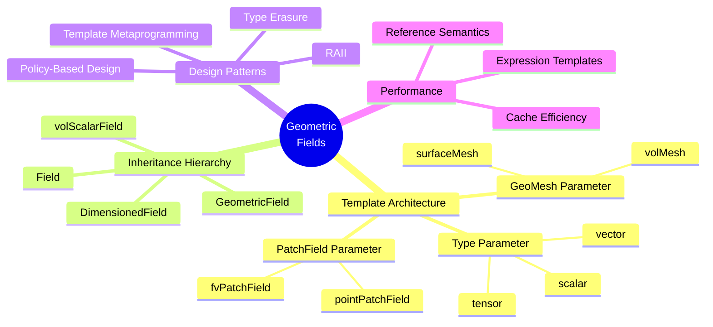
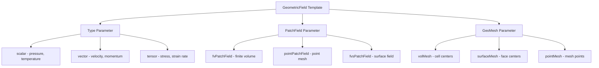
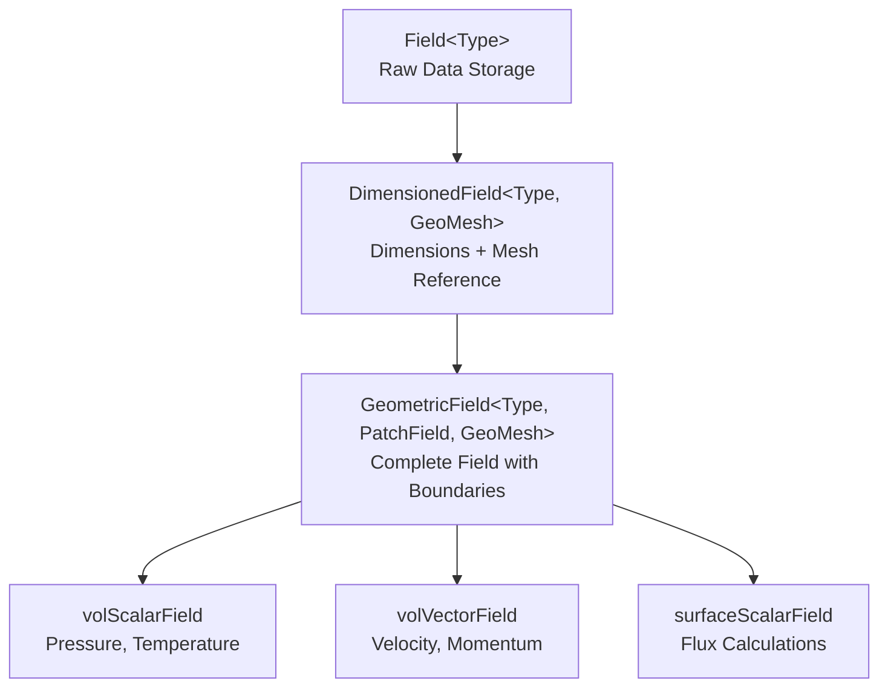
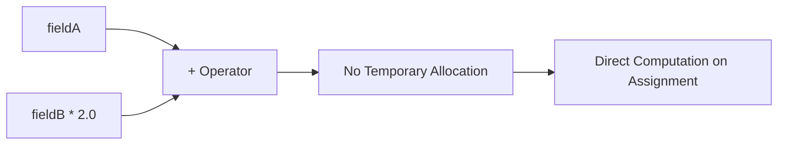

# 7. บทสรุปและแบบฝึกหัด



## 7.1 สรุปประเด็นสำคัญ

### **สถาปัตยกรรมเทมเพลต `GeometricField`**

คลาส `GeometricField` แสดงถึงการนำเสนอนามธรรมพื้นฐานของ OpenFOAM สำหรับปริมาณที่กระจายอยู่ในปริภูมิ ถูกออกแบบเป็นเทมเพลตไตรภาคี `<Type, PatchField, GeoMesh>` โดยที่พารามิเตอร์แต่ละตัวมีวัตถุประสงค์ที่แตกต่างกัน:

- **Type**: กำหนดลักษณะทางคณิตศาสตร์ของฟิลด์ (สเกลาร์, เวกเตอร์, เทนเซอร์, เป็นต้น)
- **PatchField**: ระบุวิธีการจัดการและประเมินเงื่อนไขขอบเขต
- **GeoMesh**: กำหนดการแบ่งส่วนทางเรขาคณิต (finite volume, finite element, เป็นต้น)



ระบบเทมเพลตสามพารามิเตอร์นี้ทำให้ OpenFOAM สามารถสร้างประเภทฟิลด์ที่เหมาะสมที่รวบรวมได้ในเวลาคอมไพล์ ในขณะที่ยังคงความปลอดภัยของประเภทตลอดทั้งกรอบงาน

### **ลำดับชั้นการถ่ายทอด**

ฟิลด์ OpenFOAM ทำตามรูปแบบการถ่ายทอดแบบต่อเนื่อง โดยที่แต่ละชั้นเพิ่มความสามารถเฉพาะ:

```cpp
// Base field - raw data storage
Field<Type> data;

// Physical dimensions added
DimensionedField<Type, GeoMesh> dimensionalField(data, dimensions);

// Geometric context and boundary handling
GeometricField<Type, PatchField, GeoMesh> geometricField(dimensionalField, mesh);
```



ความคืบหน้าของลำดับชั้นช่วยให้:
- **ประสิทธิภาพหน่วยความจำ**: ฟังก์ชันการทำงานร่วมกันได้รับการถ่ายทอดมากกว่าซ้ำซ้อน
- **ความสอดคล้องของอินเทอร์เฟซ**: ประเภทฟิลด์ทั้งหมดแชร์การดำเนินงานพื้นฐาน
- **พฤติกรรมเฉพาะ**: แต่ละระดับเพิ่มความสามารถเฉพาะโดเมน

### **รูปแบบการโต้ตอบกับเมช**

ฟิลด์อ้างอิงข้อมูลเมชผ่านพารามิเตอร์เทมเพลต `GeoMesh` แทนที่จะเป็นเจ้าของเรขาคณิตเมชโดยตรง:

```cpp
template<class Type, class GeoMesh>
class GeometricField
{
    const GeoMesh& mesh_;  // Reference to mesh, not ownership

    // Field data stored separately from topology
    DimensionedField<Type, GeoMesh> field_;

    // Boundary conditions aware of mesh structure
    GeometricBoundaryField<PatchField, GeoMesh> boundaryField_;
};
```

> [!INFO] Reference-Based Design
> การออกแบบที่ใช้การอ้างอิงนี้ให้:
> - **ประสิทธิภาพหน่วยความจำ**: ฟิลด์หลายฟิลด์แชร์การอ้างอิงเมชเดียวกัน
> - **ความสอดคล้อง**: ฟิลด์ทั้งหมดติดตามการอัปเดตเมชโดยอัตโนมัติ
> - **ความยืดหยุ่น**: ประเภทฟิลด์ที่แตกต่างกันสามารถอยู่ร่วมกันบนเมชเดียวกัน

### **กลไกความปลอดภัยมิติ**

OpenFOAM ใช้การวิเคราะห์มิติเวลาคอมไพล์ผ่านคลาส `dimensionSet`:

```cpp
dimensionSet dimKinematicViscosity(0, 2, -1, 0, 0, 0, 0);  // L²/T
dimensionSet dimPressure(1, -1, -2, 0, 0, 0, 0);          // M/(L·T²)

// Compile-time error if dimensions incompatible
volScalarField nu("nu", dimKinematicViscosity, mesh);
volScalarField p("p", dimPressure, mesh);
// auto invalid = nu + p;  // Compilation error!
```

ระบบมิติติดตามหน่วยพื้นฐานเจ็ดหน่วย:

| ลำดับ | หน่วยฐาน | สัญลักษณ์ | ตัวอย่าง |
|--------|-----------|-----------|-----------|
| 1 | มวล | $[M]$ | kg |
| 2 | ความยาว | $[L]$ | m |
| 3 | เวลา | $[T]$ | s |
| 4 | อุณหภูมิ | $[\Theta]$ | K |
| 5 | ปริมาณของสาร | $[n]$ | mol |
| 6 | กระแส | $[I]$ | A |
| 7 | ความเข้มแสง | $[J]$ | cd |

### **สถาปัตยกรรมเงื่อนไขขอบเขต**

ฟิลด์ขอบเขตได้รับการจัดการผ่านสมาชิก `boundaryField_` ซึ่งรักษาคอลเลกชันของวัตถุฟิลด์เฉพาะแพตช์:

```cpp
template<class Type, class PatchField, class GeoMesh>
class GeometricField
{
    // Container for boundary conditions
    GeometricBoundaryField<PatchField, GeoMesh> boundaryField_;

public:
    // Access boundary field by patch index
    const PatchField<Type>& operator[](const label patchi) const
    {
        return boundaryField_[patchi];
    }
};
```

แพตช์ขอบเขตแต่ละแพตช์สามารถมีประเภทเงื่อนไขที่แตกต่างกัน (ค่าคงที่, การไล่ระดับ, ผสม, เป็นต้น) ในขณะที่ยังคงอินเทอร์เฟซที่สม่ำเสมอผ่านพารามิเตอร์เทมเพลต `PatchField`

## 7.2 รูปแบบการออกแบบในการใช้งาน

### **การเขียนโปรแกรมเทมเพลตเมตาสำหรับประเภทฟิลด์**

OpenFOAM ใช้การเขียนโปรแกรมเทมเพลตเมตาอย่างกว้างขวางเพื่อสร้างชุดค่าผสมฟิลด์ที่เหมาะสม:

```cpp
// Compile-time generation of field type matrix
template<class Type>
class fieldTypes
{
public:
    typedef GeometricField<Type, fvPatchField, volMesh> volFieldType;
    typedef GeometricField<Type, fvsPatchField, surfaceMesh> surfaceFieldType;
    typedef GeometricField<Type, pointPatchField, pointMesh> pointFieldType;
};

// Usage generates zero-overhead abstractions
volScalarField p;      // pressure at cell centers
surfaceScalarField phi; // flux at face centers
pointVectorField U;    // velocity at mesh points
```

> [!TIP] ประโยชน์ของ Template Metaprogramming
> - **ไม่มีค่าใช้จ่ายรันไทม์**: การแก้ไขประเภททั้งหมดเวลาคอมไพล์
> - **ความปลอดภัยของประเภท**: ตรวจจับชุดค่าผสมฟิลด์ที่ไม่เข้ากันได้ตั้งแต่เนิ่นๆ
> - **การนำรหัสกลับมาใช้ใหม่**: การใช้งานเดียวทำงานสำหรับประเภทฟิลด์ทั้งหมด

### **การออกแบบตามนโยบายสำหรับเงื่อนไขขอบเขต**

พารามิเตอร์เทมเพลต `PatchField` ใช้การออกแบบตามนโยบาย อนุญาตกลยุทธ์เงื่อนไขขอบเขตที่แตกต่างกัน:

```cpp
// Policy interface
template<class Type>
class fvPatchField
{
public:
    virtual void updateCoeffs() = 0;  // Policy-specific behavior
    virtual tmp<Field<Type>> snGrad() const = 0;
};

// Concrete policy implementations
template<class Type>
class fixedValueFvPatchField : public fvPatchField<Type>
{
    // Policy: fixed values on boundary
    void updateCoeffs() override { /* Update from external data */ }
};

template<class Type>
class zeroGradientFvPatchField : public fvPatchField<Type>
{
    // Policy: zero gradient (Neumann) condition
    void updateCoeffs() override { /* No update needed */ }
};
```

| ประโยชน์ | คำอธิบาย |
|-----------|-----------|
| **ความยืดหยุ่นรันไทม์** | เงื่อนไขขอบเขตสามารถเปลี่ยนแปลงได้โดยไม่ต้องคอมไพล์ใหม่ |
| **การขยายตัว** | ประเภทเงื่อนไขขอบเขตใหม่เพิ่มได้ง่าย |
| **ประสิทธิภาพ** | การเพิ่มประสิทธิภาพเฉพาะนโยบายเป็นไปได้ |

### **การจัดการ RAII และ Smart Pointer**

OpenFOAM ใช้การจัดการหน่วยความจำอัตโนมัติอย่างครอบคลุมผ่าน smart pointers:

```cpp
// RAII for field ownership
class tmp
{
private:
    T* ptr_;
    mutable bool refCount_;

public:
    // Constructor takes ownership
    tmp(T* p) : ptr_(p), refCount_(false) {}

    // Destructor automatically deletes if owned
    ~tmp() { if (ptr_ && !refCount_) delete ptr_; }

    // Prevent copying, enable moving
    tmp(const tmp&) = delete;
    tmp(tmp&& other) noexcept : ptr_(other.ptr_), refCount_(other.refCount_)
    {
        other.ptr_ = nullptr;
    }
};

// Usage ensures automatic cleanup
{
    tmp<volScalarField> TField = new volScalarField(mesh);
    // Field automatically deleted when scope ends
}
```

> [!WARNING] ข้อดีของ RAII
> - **ความปลอดภัยข้อยกเว้น**: ทรัพยากรถูกล้างข้อมูลแม้ว่าจะเกิดข้อยกเว้น
> - **การเป็นเจ้าของที่ชัดเจน**: การโอนสถานะที่ชัดเจน
> - **ไม่มีการรั่วไหลของหน่วยความจำ**: การล้างข้อมูลอัตโนมัติได้รับการรับประกัน

### **การลบประเภทสำหรับอินเทอร์เฟซผู้ใช้**

OpenFOAM ใช้ typedef และนามแฝงประเภทเพื่อให้อินเทอร์เฟซที่ง่ายขึ้นในขณะที่ยังคงความยืดหยุ่นของเทมเพลต:

```cpp
// Type erasure through typedefs
typedef GeometricField<scalar, fvPatchField, volMesh> volScalarField;
typedef GeometricField<vector, fvPatchField, volMesh> volVectorField;
typedef GeometricField<tensor, fvPatchField, volMesh> volTensorField;

// Users work with concrete types, implementation remains generic
volScalarField p(mesh, dimensionSet(1, -1, -2, 0, 0, 0, 0));
volVectorField U(mesh, dimensionSet(0, 1, -1, 0, 0, 0, 0));
```

**ประโยชน์ของการลบประเภท:**
- **ไวยากรณ์ที่ง่ายขึ้น**: ผู้ใช้ไม่จำเป็นต้องระบุพารามิเตอร์เทมเพลต
- **ความสอดคล้อง**: การตั้งชื่อที่สม่ำเสมอในประเภทฟิลด์
- **การบำรุงรักษา**: การเปลี่ยนแปลงการใช้งานไม่ส่งผลต่อรหัสผู้ใช้

## 7.3 ผลกระทบต่อประสิทธิภาพ

### **สถาปัตยกรรมการอ้างอิงความหมาย**

ฟิลด์ OpenFOAM ใช้การอ้างอิงความหมายเพื่อลดการใช้หน่วยความจำและปรับปรุงประสิทธิภาพแคช:

```cpp
class GeometricField
{
private:
    // Multiple fields share the same mesh reference
    const fvMesh& mesh_;

    // Field data stored contiguously
    DimensionedField<Type, fvMesh> field_;

public:
    // Copy constructor shares mesh, duplicates data only
    GeometricField(const GeometricField& gf)
    : mesh_(gf.mesh_), field_(gf.field_), boundaryField_(gf.boundaryField_)
    {
        // No mesh copying - shared reference
    }
};

// Memory efficient field creation
fvMesh mesh(caseMesh);
volScalarField p(mesh, pressureDimensions);    // References mesh
volScalarField T(mesh, temperatureDimensions); // References mesh
// Both fields share mesh data, no duplication
```

**ประโยชน์หน่วยความจำ:**
- **การแชร์เมช**: ฟิลด์หลายฟิลด์อ้างอิงโครงสร้างเมชเดียวกัน
- **ประสิทธิภาพแคช**: ข้อมูลฟิลด์ถูกเก็บในบล็อกหน่วยความจำติดต่อกัน
- **ลดการจัดสรร**: ไม่มีการคัดลอกเมชที่ไม่จำเป็นระหว่างฟิลด์

### **ระบบเทมเพลตนิพจน์**

OpenFOAM ใช้เทมเพลตนิพจน์สำหรับการประเมินแบบ lazy และการกำจัดตัวแปรชั่วคราว:

```cpp
// Expression template for addition
template<class Field1, class Field2>
class plusOp
{
private:
    const Field1& f1_;
    const Field2& f2_;

public:
    // No computation in constructor - lazy evaluation
    plusOp(const Field1& f1, const Field2& f2) : f1_(f1), f2_(f2) {}

    // Computation performed only when needed
    typename Field1::value_type operator[](const label i) const
    {
        return f1_[i] + f2_[i];
    }

    // Size information forwarded from operand fields
    label size() const { return f1_.size(); }
};

// Usage creates expression tree, no temporary fields
auto result = fieldA + fieldB * 2.0;  // Expression template constructed
// Actual computation deferred until assignment or access
```



**ประโยชน์ด้านประสิทธิภาพ:**
- **ไม่มีตัวแปรชั่วคราว**: ผลลัพธ์ระดับกลางถูกคำนวณโดยตรง
- **การดำเนินการแบบฟิวส์**: การดำเนินการหลายอย่างรวมเป็นการผ่านครั้งเดียว
- **การเพิ่มประสิทธิภาพแคช**: รูปแบบการเข้าถึงหน่วยความจำถูกเพิ่มประสิทธิภาพโดยอัตโนมัติ

### **การจัดเรียงข้อมูลที่รับรู้แคช**

ข้อมูลฟิลด์ถูกจัดระเบียบเพื่อประสิทธิภาพแคชที่เหมาะสม:

```cpp
template<class Type>
class Field
{
private:
    // Contiguous memory layout for cache efficiency
    Type* v_;
    label size_;

public:
    // Sequential access optimized for prefetching
    inline const Type& operator[](const label i) const
    {
        return v_[i];  // Predictable memory access pattern
    }

    // Iterator-based algorithms benefit from locality
    Type* begin() { return v_; }
    Type* end() { return v_ + size_; }
};
```

**ประโยชน์ของแคช:**
- **ความใกล้ชิดเชิงพื้นที่**: ข้อมูลที่เกี่ยวข้องถูกเก็บติดต่อกัน
- **การ prefetching**: ฮาร์ดแวร์สามารถคาดการณ์รูปแบบการเข้าถึงหน่วยความจำ
- **ลดการพลาด**: แคชมิสน้อยลงในระหว่างการดำเนินการฟิลด์

## 7.4 แบบฝึกหัดปฏิบัติ

### **แบบฝึกหัดที่ 1: การสร้างฟิลด์พื้นฐาน**

**วัตถุประสงค์**: สร้างและจัดการ `volScalarField` สำหรับการแก้สมการความร้อน

**โจทย์**:
1. สร้างฟิลด์อุณหภูมิ `T` พร้อมมิติที่ถูกต้อง
2. กำหนดเงื่อนไขขอบเขต: ผนังด้านหนึ่งมีอุณหภูมิคงที่ 300K, อีกด้านหนึ่งเป็น zero gradient
3. เขียนโค้ดเพื่อตรวจสอบค่าฟิลด์ (min, max, average)

**โครงสร้างโค้ด**:
```cpp
// 1. สร้างฟิลด์อุณหภูมิ
volScalarField T
(
    IOobject
    (
        "T",
        runTime.timeName(),
        mesh,
        IOobject::MUST_READ,
        IOobject::AUTO_WRITE
    ),
    mesh,
    dimensionedScalar("T", dimTemperature, 300.0)
);

// 2. ตรวจสอบเงื่อนไขขอบเขต
forAll(T.boundaryField(), patchi)
{
    Info << "Patch " << patchi << ": "
         << T.boundaryField()[patchi].type() << endl;
}

// 3. คำนวณสถิติ
scalar TMin = min(T).value();
scalar TMax = max(T).value();
scalar TAvg = sum(T * mesh.V()) / sum(mesh.V()).value();

Info << "Temperature stats - Min: " << TMin
     << " Max: " << TMax << " Avg: " << TAvg << endl;
```

### **แบบฝึกหัดที่ 2: การดำเนินการฟิลด์ที่ซับซ้อน**

**วัตถุประสงค์**: ใช้ตัวดำเนินการเชิงอนุพันธ์และการคำนวณฟลักซ์

**โจทย์**:
1. คำนวณ gradient ของความดัน: $\nabla p$
2. คำนวณ flux ผ่านหน้า: $\phi = \mathbf{U} \cdot \mathbf{S}_f$
3. คำนวณ divergence ของฟลักซ์: $\nabla \cdot \phi$

**โครงสร้างโค้ด**:
```cpp
// 1. Gradient of pressure
volVectorField gradP = fvc::grad(p);

// 2. Flux calculation
surfaceScalarField phi = fvc::flux(U);

// 3. Divergence of flux
volScalarField divPhi = fvc::div(phi);

// 4. ตรวจสอบความสอดคล้องทางมิติ
Info << "gradP dimensions: " << gradP.dimensions() << endl;
Info << "phi dimensions: " << phi.dimensions() << endl;
Info << "divPhi dimensions: " << divPhi.dimensions() << endl;
```

### **แบบฝึกหัดที่ 3: การพัฒนาเงื่อนไขขอบเขตแบบกำหนดเอง**

**วัตถุประสงค์**: สร้างเงื่อนไขขอบเขตที่ขึ้นกับเวลา

**โจทย์**:
สร้างเงื่อนไขขอบเขตที่ผนังซึ่งอุณหภูมิเปลี่ยนแปลงตามฟังก์ชัน:
$$T_{wall}(t) = T_0 + A \sin(\omega t)$$

โดยที่:
- $T_0 = 300$ K (อุณหภูมิพื้นฐาน)
- $A = 50$ K (amplitude)
- $\omega = 0.1$ rad/s (ความถี่เชิงมุม)

**โครงสร้างคลาส**:
```cpp
template<class Type>
class timeVaryingTemperatureFvPatchField : public fvPatchField<Type>
{
private:
    Type T0_;      // Base temperature
    Type A_;       // Amplitude
    scalar omega_; // Angular frequency

public:
    // Construction
    timeVaryingTemperatureFvPatchField
    (
        const fvPatch& p,
        const DimensionedField<Type, volMesh>& iF,
        const dictionary& dict
    );

    // Update coefficients
    virtual void updateCoeffs()
    {
        if (this->updated())
        {
            return;
        }

        const scalar t = this->db().time().timeOutputValue();
        this->operator==() = T0_ + A_ * Foam::sin(omega_ * t);

        fvPatchField<Type>::updateCoeffs();
    }
};
```

### **แบบฝึกหัดที่ 4: การวิเคราะห์ประสิทธิภาพ**

**วัตถุประสงค์**: เปรียบเทียบประสิทธิภาพของการดำเนินการฟิลด์

**โจทย์**:
1. วัดเวลาการคำนวณสำหรับการดำเนินการ gradient, divergence, และ Laplacian
2. เปรียบเทียบประสิทธิภาพระหว่างการใช้ `tmp<>` และการคัดลอกตรง
3. วิเคราะห์การใช้หน่วยความจำสำหรับขนาด mesh ที่แตกต่างกัน

**โครงสร้างโค้ด**:
```cpp
// 1. Performance measurement
clockTime timer;

timer.timeIncrement();
volVectorField gradP1 = fvc::grad(p);
scalar gradTime1 = timer.timeIncrement();

// Using tmp
timer.timeIncrement();
tmp<volVectorField> tGradP2 = fvc::grad(p);
scalar gradTime2 = timer.timeIncrement();

Info << "Copy time: " << gradTime1 << " s" << endl;
Info << "tmp time: " << gradTime2 << " s" << endl;

// 2. Memory usage analysis
Info << "Field size: " << p.size() * sizeof(scalar) / 1024.0
     << " KB" << endl;
```

## 7.5 เส้นทางการเรียนรู้ต่อยอด

### **หัวข้อที่ควรศึกษาต่อ**

1. **Surface Fields และการคำนวณฟลักซ์**
   - การแปลงค่าจาก cell-centered ไปยัง face-centered
   - รูปแบบการแทรก interpolaton ที่แตกต่างกัน (linear, upwind, etc.)
   - การคำนวณ flux ผ่านหน้าสำหรับสมการขนส่ง

2. **การพัฒนา Boundary Condition ขั้นสูง**
   - เงื่อนไขขอบเขตที่ขึ้นกับเวลา
   - เงื่อนไขขอบเขตแบบ coupled (fluid-structure interaction)
   - เงื่อนไขขอบเขตแบบไม่เป็นเชิงเส้น

3. **การเพิ่มประสิทธิภาพด้วย Expression Templates**
   - การทำความเข้าใจกลไกการทำงานของเทมเพลตนิพจน์
   - การปรับปรุงประสิทธิภาพการดำเนินการฟิลด์
   - การใช้ `tmp<>` สำหรับการจัดการหน่วยความจำที่มีประสิทธิภาพ

4. **การขยายระบบฟิลด์**
   - การสร้างประเภทฟิลด์แบบกำหนดเอง
   - การผสานกับ solver ที่มีอยู่
   - การพัฒนา discretization schemes ใหม่

### **แหล่งข้อมูลที่เกี่ยวข้อง**

- **Source Code**: `src/OpenFOAM/fields/GeometricFields/GeometricField/`
- **Wiki**: [OpenFOAM Field Documentation](https://openfoamwiki.net/index.php/Field_GeometricField)
- **บทเรียนที่เกี่ยวข้อง**:
  - [[04.4 OpenFOAM Containers]]
  - [[06.1 Field Types and Dimensions]]
  - [[06.2 Field Operations and Algebra]]

---

> [!TIP] เคล็ดลับการเรียนรู้
> การเข้าใจ `GeometricField` คือกุญแจสำคัญในการควบคุม OpenFOAM อย่างมืออาชีพ เริ่มต้นจากฟิลด์พื้นฐาน แล้วค่อยๆ ขยายไปสู่แนวคิดที่ซับซ้อนกว่า เช่น boundary conditions แบบกำหนดเอง และการเพิ่มประสิทธิภาพการดำเนินการ
