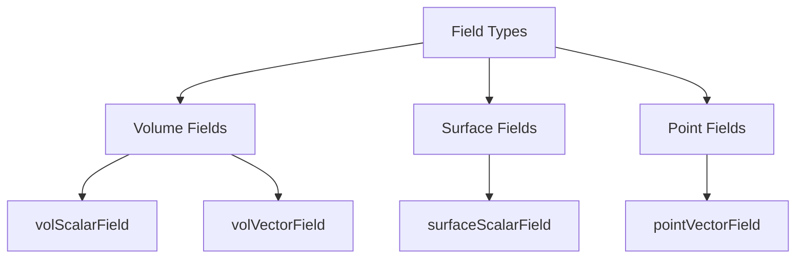

# Field Types - Overview

ภาพรวม Field Types

---

## Overview



---

## 1. Three Locations

| Type | Location | Example |
|------|----------|---------|
| `vol*Field` | Cell centers | p, U, T |
| `surface*Field` | Face centers | phi |
| `point*Field` | Vertices | displacement |

---

## 2. Template Structure

```cpp
GeometricField<Type, PatchField, GeoMesh>
```

| Parameter | Options |
|-----------|---------|
| Type | scalar, vector, tensor |
| GeoMesh | volMesh, surfaceMesh, pointMesh |

---

## 3. Common Types

### Volume

| Alias | Use |
|-------|-----|
| `volScalarField` | p, T, k, ε |
| `volVectorField` | U, F |
| `volTensorField` | stress |

### Surface

| Alias | Use |
|-------|-----|
| `surfaceScalarField` | phi (flux) |
| `surfaceVectorField` | Sf (areas) |

### Point

| Alias | Use |
|-------|-----|
| `pointVectorField` | displacement |

---

## 4. Module Contents

| File | Topic |
|------|-------|
| 01_Introduction | Basics |
| 02_Volume_Fields | Cell-centered |
| 03_Surface_Fields | Face-centered |
| 04_Dimensional_Checking | Units |
| 05_Point_Fields | Vertex-based |
| 06_Dimensioned_Fields | Internal fields |
| 07_Pitfalls | Errors |
| 08_Summary | Exercises |

---

## Quick Reference

| Need | Type |
|------|------|
| Pressure | `volScalarField` |
| Velocity | `volVectorField` |
| Flux | `surfaceScalarField` |
| Displacement | `pointVectorField` |

---

## Concept Check

<details>
<summary><b>1. vol vs surface field?</b></summary>

- **vol**: Cell centers (state)
- **surface**: Face centers (flux)
</details>

<details>
<summary><b>2. ทำไม flux เป็น surface?</b></summary>

**Flux ผ่าน faces** ไม่ใช่ cells
</details>

<details>
<summary><b>3. point field ใช้เมื่อไหร่?</b></summary>

**Mesh motion** และ nodal quantities
</details>

---

## Related Documents

- **Introduction:** [01_Introduction.md](01_Introduction.md)
- **Volume Fields:** [02_Volume_Fields.md](02_Volume_Fields.md)
