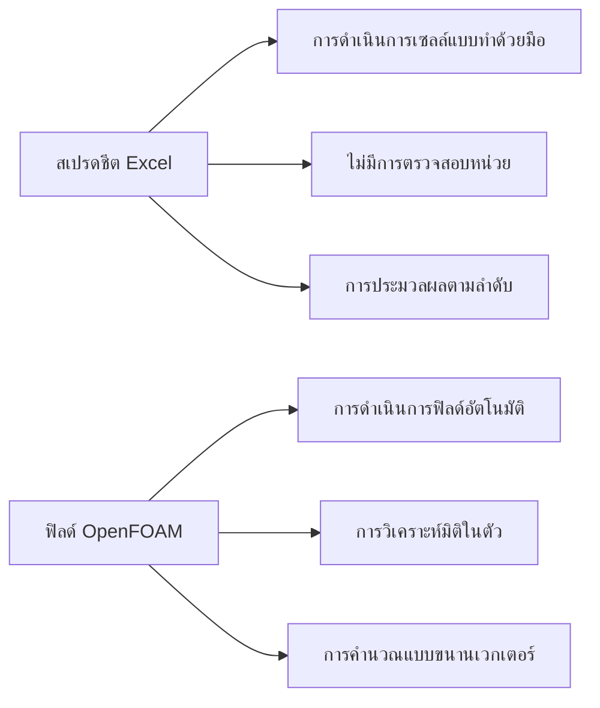
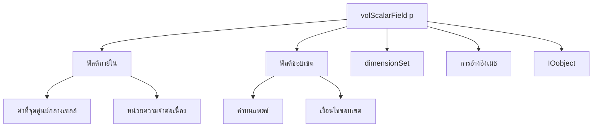
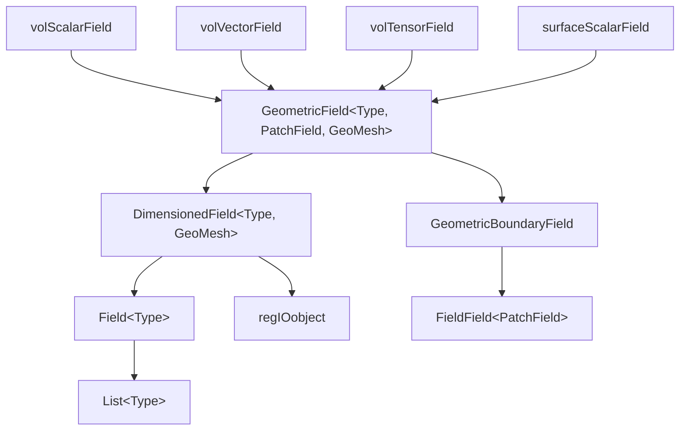
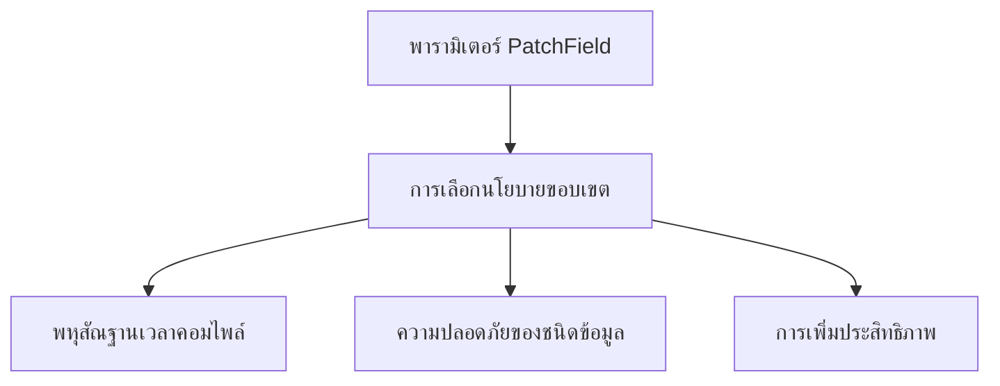

# ภาพรวม: ประเภทฟิลด์ใน OpenFOAM (Field Types in OpenFOAM)

> [!INFO] ภาพรวม
> ส่วนนี้เป็นการแนะนำระบบประเภทฟิลด์ที่ซับซ้อนของ OpenFOAM ซึ่งเป็นรากฐานสำหรับการจำลองพลศาสตร์ของไหลเชิงคำนวณ (CFD)

---

## 🎯 วัตถุประสงค์การเรียนรู้

เมื่อเรียนจบส่วนนี้ คุณจะสามารถ:

- ✅ เข้าใจลำดับชั้นการสืบทอดของประเภทฟิลด์ใน OpenFOAM
- ✅ เชี่ยวชาญการวิเคราะห์มิติด้วย `dimensionSet`
- ✅ สร้างและเริ่มต้นฟิลด์ได้อย่างถูกต้อง
- ✅ เข้าใจประเภทฟิลด์พื้นผิว (Surface) และฟิลด์จุด (Point)
- ✅ เข้าใจลักษณะประสิทธิภาพและโครงสร้างหน่วยความจำ

---

## 📋 ข้อกำหนดเบื้องต้น

### ความรู้พื้นฐานที่จำเป็น

**ศึกษา [บทที่ 4: การเขียนโปรแกรม C++ ใน OpenFOAM](../../Chapter_04_Cpp_Programming_in_OpenFOAM/README.md) ให้ครบถ้วน** - บทพื้นฐานนี้ให้แนวคิดการเขียนโปรแกรม C++ ที่สำคัญซึ่งเฉพาะเจาะจงสำหรับสถาปัตยกรรมของ OpenFOAM ได้แก่:

- **ข้อกำหนดการเขียนโค้ด (Coding conventions)** และแนวทางการจัดรูปแบบของ OpenFOAM
- **การจัดการหน่วยความจำ** โดยใช้ `autoPtr`, `tmp` และการนับการอ้างอิง (Reference counting)
- **การเขียนโปรแกรมเชิงเทมเพลต (Template metaprogramming)** ที่ใช้ทั่วทั้ง OpenFOAM
- **ลำดับชั้นของคลาส** สำหรับคลาสเรขาคณิตและคลาสฟิลด์

### แนวคิด C++ ขั้นสูง

**การเขียนโปรแกรมเชิงเทมเพลต (Template Programming)**
ความเข้าใจอย่างลึกซึ้งเกี่ยวกับเทมเพลต C++ เป็นสิ่งสำคัญเนื่องจาก OpenFOAM ใช้เทมเพลตอย่างแพร่หลายสำหรับ:

| การใช้งาน | ตัวอย่าง |
|-------|---------|
| การนิยามประเภทฟิลด์ | `volScalarField`, `volVectorField`, `surfaceTensorField` |
| คลาสเรขาคณิต | `Vector<T>`, `Tensor<T>`, `SymmTensor<T>` |
| การดำเนินการทางคณิตศาสตร์ | การตรวจสอบมิติ (Dimension checking) |
| พหุสัณฐานเวลาคอมไพล์ (Compile-time polymorphism) | การสร้างตัวแก้สมการ (Solver implementations) |

**การสืบทอดและพหุสัณฐาน (Inheritance and Polymorphism)**
ความเชี่ยวชาญในรูปแบบการสืบทอดของ C++ จะช่วยให้คุณ:

- เข้าใจลำดับชั้นคลาสของ OpenFOAM (เช่น การสร้างคลาส `fvPatchField`)
- ขยายคลาสฐานสำหรับเงื่อนไขขอบเขตที่กำหนดเอง
- ทำงานกับอินเทอร์เฟซนามธรรม (Abstract interfaces) สำหรับโมเดลความปั่นป่วนและคุณสมบัติทางเทอร์โมไดนามิก
- สร้างโมเดลทางฟิสิกส์ที่กำหนดเองตามรูปแบบที่กำหนดไว้

### ความรู้ด้านสถาปัตยกรรม OpenFOAM

**ความรู้เรื่องโครงสร้างเคส (Case Structure)**
ความเข้าใจอย่างครอบคลุมเกี่ยวกับการจัดระเบียบเคสของ OpenFOAM:

| ไดเรกทอรี | คำอธิบาย |
|-----------|-------------|
| `0/` | เงื่อนไขเริ่มต้นและการระบุเงื่อนไขขอบเขต |
| `constant/` | ข้อมูลเมช, คุณสมบัติทางกายภาพ และพารามิเตอร์การจำลอง |
| `system/` | การควบคุมผลเฉลย (Solution control), รูปแบบเชิงตัวเลข และการตั้งค่าตัวแก้สมการ |

**แนวคิดเรื่องเมช (Mesh Concepts)**
ความเข้าใจที่แม่นยำเกี่ยวกับพื้นฐานของเมชเชิงคำนวณ:

- **โทโพโลยีของเมช** ของการดิสครีตแบบไฟไนต์วอลุ่ม (`polyMesh`, `fvMesh`)
- **ความสัมพันธ์** ระหว่างเซลล์, หน้า และแพตช์ (Patches)
- **การจัดการเงื่อนไขขอบเขต** และการระบุแพตช์
- **ข้อกำหนดด้านคุณภาพเมช** สำหรับเสถียรภาพเชิงตัวเลข
- **ขั้นตอนการสร้างเมช** (`blockMesh`, `snappyHexMesh`)

---

## 1. "จุดดึงดูด": ตาราง Excel เทียบกับฟิลด์ CFD

ลองนึกภาพว่าคุณมีสเปรดชีต Excel ขนาดมหึมาที่แต่ละเซลล์บรรจุปริมาณทางกายภาพ (ความดัน, ความเร็ว, อุณหภูมิ) ณ ตำแหน่งเฉพาะในโดเมนการไหลของคุณ

ตอนนี้ลองจินตนาการว่าคุณต้องดำเนินการทางคณิตศาสตร์กับเซลล์นับล้านเซลล์พร้อมกันในขณะที่ยังคงรักษาความสอดคล้องของหน่วยทางกายภาพไว้

**นี่คือสิ่งที่ระบบฟิลด์ของ OpenFOAM ทำ**—มันคือ **สเปรดชีตประสิทธิภาพสูงที่คำนึงถึงมิติและมีความปลอดภัยของประเภทข้อมูลสำหรับ CFD**


> **รูปที่ 1:** การเปรียบเทียบระหว่างสเปรดชีต Excel ทั่วไปกับระบบฟิลด์ของ OpenFOAM ซึ่งโดดเด่นด้วยการตรวจสอบมิติอัตโนมัติและการประมวลผลแบบขนานประสิทธิภาพสูงความปลอดภัยทางฟิสิกส์ไม่ส่งผลกระทบต่อความเร็วในการจำลอง ผ่านการใช้พลังของ C++ Template Metaprogramming ในการตรวจสอบความสอดคล้องทางมิติทั้งหมดที่ขั้นตอนการคอมไพล์โปรแกรมเพียงครั้งเดียว

### สถาปัตยกรรมฟิลด์: เหนือกว่าอาร์เรย์ธรรมดา

ในขณะที่เซลล์ Excel เป็นคอนเทนเนอร์เก็บค่าแบบง่าย ฟิลด์ OpenFOAM เป็นออบเจ็กต์การคำนวณที่ซับซ้อนซึ่งสะท้อนถึงความเข้มงวดทางคณิตศาสตร์และกายภาพที่จำเป็นสำหรับการจำลอง CFD

**ฟิลด์ OpenFOAM** เช่น `volScalarField p` เป็นมากกว่าแค่อาร์เรย์ของค่าความดัน:

```cpp
// ตัวอย่าง: การสร้างฟิลด์ความดันใน OpenFOAM
volScalarField p
(
    IOobject
    (
        "p",                           // ชื่อฟิลด์
        runTime.timeName(),            // ไดเรกทอรีเวลา
        mesh,                          // อ้างอิงเมช
        IOobject::MUST_READ,           // อ่านจากไฟล์ถ้ามีอยู่
        IOobject::AUTO_WRITE           // เขียนอัตโนมัติระหว่างการจำลอง
    ),
    mesh                              // ออบเจ็กต์เมชที่จะเชื่อมโยง
);
```

> **📂 แหล่งที่มา:** `.applications/solvers/basic/potentialFoam/potentialFoam.C`

> **📖 คำอธิบาย:**
> โค้ดด้านบนสาธิตการสร้างฟิลด์ความดันใน OpenFOAM ซึ่งเป็นตัวอย่างที่ชัดเจนของการสร้างฟิลด์เรขาคณิตที่เชื่อมโยงกับเมช การสร้างฟิลด์ใน OpenFOAM ไม่ได้เป็นเพียงการประกาศตัวแปรแบบง่าย แต่เป็นการสร้างออบเจ็กต์ที่ซับซ้อนที่ประกอบด้วย:
> - **IOobject**: จัดการการอ่าน/เขียนไฟล์และการลงทะเบียนกับระบบฐานข้อมูล
> - **Mesh linkage**: การเชื่อมโยงกับโครงสร้างเมชคอมพิวเตชัน
> - **Internal & Boundary fields**: ค่าภายในเซลล์และค่าบนขอบเขต
> - **Dimensional information**: ข้อมูลมิติทางฟิสิกส์อัตโนมัติ
> 
> การออกแบบนี้ทำให้ฟิลด์ OpenFOAM มีความสามารถในการจัดการข้อมูลฟิสิกส์ที่สมบูรณ์แบบ พร้อมการตรวจสอบความถูกต้องของมิติและหน่วยอัตโนมัติ

> **🔑 แนวคิดสำคัญ:**
> - **IOobject management**: ระบบจัดการอินพุต/เอาต์พุตของ OpenFOAM
> - **Field-mesh coupling**: การเชื่อมโยงฟิลด์กับโครงสร้างเมช
> - **Automatic I/O**: การอ่านและเขียนข้อมูลอัตโนมัติ
> - **Constructor initialization**: การเริ่มต้นฟิลด์ด้วยพารามิเตอร์ที่สมบูรณ์

การประกาศเพียงครั้งเดียวนี้จะสร้าง:

- **ค่าฟิลด์ภายใน (Internal field values)**: ความดันที่จุดศูนย์กลางของแต่ละเซลล์ภายในปริมาตรควบคุม
- **ค่าฟิลด์ขอบเขต (Boundary field values)**: ค่าความดันบนแพตช์ขอบเขต (Boundary patches)
- **ความสอดคล้องทางมิติ (Dimensional consistency)**: รับประกันหน่วยเป็น $\text{kg} \cdot \text{m}^{-1} \cdot \text{s}^{-2}$
- **การเชื่อมโยงเมช (Mesh linkage)**: เชื่อมต่อโดยตรงกับโทโพโลยีของเมชเชิงคำนวณ
- **การจัดการเวลา (Time management)**: ความสามารถในการอ่าน/เขียนอัตโนมัติระหว่างการจำลอง


> **รูปที่ 2:** องค์ประกอบภายในของฟิลด์ความดัน (`volScalarField p`) ซึ่งประกอบด้วยค่าภายในเซลล์ ค่าที่ขอบเขต มิติทางฟิสิกส์ และการเชื่อมโยงกับเมชคำนวณความปลอดภัยทางฟิสิกส์ไม่ส่งผลกระทบต่อความเร็วในการจำลอง ผ่านการใช้พลังของ C++ Template Metaprogramming ในการตรวจสอบความสอดคล้องทางมิติทั้งหมดที่ขั้นตอนการคอมไพล์โปรแกรมเพียงครั้งเดียว

### การดำเนินการทางคณิตศาสตร์: สัญกรณ์ฟิสิกส์ที่เป็นธรรมชาติ

**พลังของระบบฟิลด์ใน OpenFOAM** อยู่ที่ความสามารถในการแสดงนิพจน์ทางคณิตศาสตร์ที่ซับซ้อนโดยใช้สัญกรณ์ที่เป็นธรรมชาติในขณะที่ยังคงความสอดคล้องทางมิติ:

```cpp
// ส่วนประกอบของสมการโมเมนตัมใน OpenFOAM
volVectorField U = ...;                    // ฟิลด์ความเร็ว
volScalarField p = ...;                    // ฟิลด์ความดัน
dimensionedScalar rho("rho", dimDensity, 1.2);    // ความหนาแน่น

// นิพจน์ทางคณิตศาสตร์ที่เป็นธรรมชาติ
fvVectorMatrix UEqn
(
    fvm::ddt(rho, U)                     // เทอมไม่คงที่: ∂(ρU)/∂t
  + fvm::div(rho*U, U)                   // เทอมการพา: ∇·(ρUU)
 ==
  - fvc::grad(p)                         // เกรเดียนต์ความดัน: -∇p
);
```

> **📂 แหล่งที่มา:** `.applications/solvers/incompressible/simpleFoam/UEqn.H`

> **📖 คำอธิบาย:**
> โค้ดนี้สาธิตพลังของระบบฟิลด์ OpenFOAM ในการแสดงสมการ Navier-Stokes ด้วยสัญกรณ์ทางคณิตศาสตร์ที่เป็นธรรมชาติ โดยแต่ละเทอมในสมการถูกแทนด้วย operator ที่ออกแบบมาให้ใกล้เคียงกับสัญกรณ์ทางคณิตศาสตร์มากที่สุด:
> - **`fvm::ddt(rho, U)`**: เทอมอนุพันธ์เวลาของโมเมนตัม (∂(ρU)/∂t) ใช้ fvm (finite volume method) สำหรับการจัดการแบบ implicit
> - **`fvm::div(rho*U, U)`**: เทอมการพา (Convection) (∇·(ρUU)) ใช้ fvm เพื่อให้สามารถแก้สมการแบบ implicit
> - **`fvc::grad(p)`**: เทอมเกรเดียนต์ของความดัน (-∇p) ใช้ fvc (finite volume calculus) สำหรับการจัดการแบบ explicit
> 
> ความสามารถพิเศษคือระบบจะตรวจสอบความสอดคล้องของมิติโดยอัตโนมัติ หากมิติของแต่ละเทอมไม่ตรงกัน คอมไพเลอร์จะแจ้งเตือนทันที

> **🔑 แนวคิดสำคัญ:**
> - **Implicit vs Explicit operators**: fvm (implicit) สำหรับเทอมในเมทริกซ์ และ fvc (explicit) สำหรับเทอมแหล่งกำเนิด (Source)
> - **Dimensional consistency checking**: การตรวจสอบความสอดคล้องของมิติอัตโนมัติ
> - **Operator overloading**: การโอเวอร์โหลดตัวดำเนินการให้ทำงานกับฟิลด์ได้โดยตรง
> - **Field algebra**: การดำเนินการทางคณิตศาสตร์บนฟิลด์ทั้งฟิลด์

**ตัวดำเนินการหลัก (Key Operators):**
- `fvm::ddt`: อนุพันธ์เวลาแบบ implicit
- `fvm::div`: ไดเวอร์เจนซ์แบบ implicit
- `fvc::grad`: เกรเดียนต์แบบ explicit

---

## 2. ลำดับชั้นประเภทฟิลด์: พิมพ์เขียว

OpenFOAM จัดระเบียบข้อมูลฟิลด์ผ่านลำดับชั้นเทมเพลตที่ซับซ้อน ซึ่งช่วยให้สามารถจัดเก็บ จัดการ และดำเนินการทางคณิตศาสตร์กับข้อมูล CFD ได้อย่างมีประสิทธิภาพ

### สถาปัตยกรรมลำดับชั้นคลาส

ลำดับชั้นประเภทฟิลด์ใน OpenFOAM เป็นไปตามโครงสร้างการสืบทอดที่เป็นระบบ เริ่มต้นจากคอนเทนเนอร์ข้อมูลอย่างง่ายไปจนถึงฟิลด์เรขาคณิตที่ซับซ้อน:


> **รูปที่ 3:** ลำดับชั้นการสืบทอดของคลาสฟิลด์ใน OpenFOAM แสดงความสัมพันธ์ระหว่างคอนเทนเนอร์ข้อมูลพื้นฐานไปจนถึงฟิลด์เรขาคณิตที่ซับซ้อนความปลอดภัยทางฟิสิกส์ไม่ส่งผลกระทบต่อความเร็วในการจำลอง ผ่านการใช้พลังของ C++ Template Metaprogramming ในการตรวจสอบความสอดคล้องทางมิติทั้งหมดที่ขั้นตอนการคอมไพล์โปรแกรมเพียงครั้งเดียว

**ที่ระดับพื้นฐาน:**
- `List<Type>` ให้คอนเทนเนอร์อาร์เรย์แบบไดนามิกสำหรับประเภทข้อมูลใดๆ
- `Field<Type>` ขยายส่วนนี้ด้วยการดำเนินการทางคณิตศาสตร์เฉพาะสำหรับการคำนวณ CFD
- รองรับการดำเนินการเวกเตอร์, การดำเนินการเทนเซอร์ และพีชคณิตทั่วทั้งฟิลด์

### ส่วนประกอบฟิลด์หลัก

#### **`GeometricField<Type, PatchField, GeoMesh>`**
คลาสฟิลด์ที่สมบูรณ์ซึ่งรวมทั้งค่าฟิลด์ภายในและเงื่อนไขขอบเขต

**พารามิเตอร์เทมเพลต:**
- `Type`: เอนทิตีทางคณิตศาสตร์ (สเกลาร์, เวกเตอร์, เทนเซอร์ และอื่นๆ)
- `PatchField`: ประเภทฟิลด์ขอบเขตสำหรับการจัดการเงื่อนไขขอบเขต
- `GeoMesh`: ประเภทเมช (volMesh สำหรับฟิลด์ที่จุดศูนย์กลางเซลล์, surfaceMesh สำหรับฟิลด์ที่จุดศูนย์กลางหน้า)

#### **`DimensionedField<Type, GeoMesh>`**
ขยายฟิลด์พื้นฐานด้วย:
- ข้อมูลมิติ (Dimensional information)
- การเชื่อมโยงเมช
- สืบทอดมาจาก `Field<Type>` (การจัดเก็บข้อมูล) และ `regIOobject` (I/O ไฟล์)
- สามารถอ่านและเขียนข้อมูลฟิลด์โดยอัตโนมัติ

#### **`GeometricBoundaryField`**
คอนเทนเนอร์เฉพาะทางที่จัดการ:
- แพตช์ขอบเขตทั้งหมดสำหรับฟิลด์เรขาคณิต
- คอลเลกชันของออบเจ็กต์เงื่อนไขขอบเขต
- การเข้าถึงค่าขอบเขตและเกรเดียนต์ที่สม่ำเสมอ

### นิยามประเภทข้อมูลทั่วไป

ประเภทฟิลด์ที่ใช้บ่อยที่สุดใน OpenFOAM ถูกกำหนดให้เป็น template specializations:

| ประเภทฟิลด์ | Template Specialization | การใช้งานทั่วไป |
|------------|------------------------|--------------|
| `volScalarField` | `GeometricField<scalar, fvPatchField, volMesh>` | ความดัน, อุณหภูมิ |
| `volVectorField` | `GeometricField<vector, fvPatchField, volMesh>` | ความเร็ว, การกระจัด |
| `volTensorField` | `GeometricField<tensor, fvPatchField, volMesh>` | ความเค้น, อัตราความเครียด |
| `surfaceScalarField` | `GeometricField<scalar, fvsPatchField, surfaceMesh>` | ฟลักซ์, อัตราการถ่ายโอนความร้อน |

**การเลือกประเภทฟิลด์:**
- **ฟิลด์ปริมาตร (`vol*`)**: ปริมาณที่กำหนดโดยธรรมชาติที่จุดศูนย์กลางเซลล์
- **ฟิลด์พื้นผิว (`surface*`)**: ปริมาณที่กำหนดโดยธรรมชาติที่หน้าเซลล์

---

## 3. กลไกภายใน: คำอธิบายพารามิเตอร์เทมเพลต

### ลายเซ็นเทมเพลต (Template Signature)
```cpp
template<class Type, template<class> class PatchField, class GeoMesh>
class GeometricField : public DimensionedField<Type, GeoMesh>
{
    // สืบทอดการจัดเก็บจาก DimensionedField
    // เพิ่มการจัดการฟิลด์ขอบเขตผ่าน PatchField
    // เชื่อมโยงกับโทโพโลยีของเมชผ่าน GeoMesh
};
```

> **📂 แหล่งที่มา:** `.src/OpenFOAM/fields/GeometricField/GeometricField.H`

> **📖 คำอธิบาย:**
> นี่คือลายเซ็นหลักของคลาส `GeometricField` ซึ่งเป็นคลาสเทมเพลตที่มีความยืดหยุ่นสูงมาก การออกแบบเทมเพลตนี้ใช้พารามิเตอร์เทมเพลตของเทมเพลต (PatchField) ซึ่งเป็นเทคนิคขั้นสูงใน C++:
> 
> - **พารามิเตอร์ Type**: กำหนดชนิดข้อมูลทางคณิตศาสตร์ (สเกลาร์, เวกเตอร์, เทนเซอร์) ที่เก็บในฟิลด์
> - **พารามิเตอร์ PatchField**: เป็นพารามิเตอร์เทมเพลตของเทมเพลตที่กำหนดนโยบายการจัดการขอบเขต ช่วยให้สามารถเปลี่ยนพฤติกรรมขอบเขตได้โดยไม่ต้องแก้ไขคลาสหลัก
> - **พารามิเตอร์ GeoMesh**: กำหนดโครงสร้างเมช (volMesh, surfaceMesh) ที่ฟิลด์จะเชื่อมโยงด้วย
> 
> การออกแบบนี้ทำให้สามารถสร้างฟิลด์ได้หลากหลายประเภทโดยไม่ต้องเขียนโค้ดซ้ำ และยังคงความปลอดภัยในด้านชนิดข้อมูลที่ระดับคอมไพล์ (Compile-time)

> **🔑 แนวคิดสำคัญ:**
> - **Template metaprogramming**: เทคนิคการใช้เทมเพลตเพื่อสร้างโค้ดที่ยืดหยุ่น
> - **Template template parameter**: พารามิเตอร์เทมเพลตที่รับคลาสเทมเพลตอื่นเป็นพารามิเตอร์
> - **Compile-time polymorphism**: การกำหนดพฤติกรรมที่ระดับคอมไพล์
> - **Type safety**: การรับประกันความถูกต้องของชนิดข้อมูล

คลาส `GeometricField` เป็นหนึ่งในคลาสเทมเพลตพื้นฐานที่สุดของ OpenFOAM ซึ่งให้กรอบการทำงานที่ยืดหยุ่นสำหรับการแทนค่าฟิลด์ข้อมูลประเภทต่างๆ บนเมชที่แตกต่างกัน

### พารามิเตอร์ที่ 1: `Type` - เราจัดเก็บข้อมูลอะไร?

พารามิเตอร์ `Type` กำหนดธรรมชาติทางคณิตศาสตร์ของข้อมูลที่จัดเก็บในแต่ละตำแหน่งของเมช

| พารามิเตอร์ Type | คำอธิบาย | ตัวอย่างการใช้งาน | คลาสฟิลด์ที่เป็นผลลัพธ์ |
|----------------|-------------|----------------|----------------------|
| **`scalar`** | ค่าทศนิยมความแม่นยำสองชั้นตัวเดียว | `volScalarField p` - ความดัน<br>`volScalarField T` - อุณหภูมิ | ฟิลด์สเกลาร์ตามปริมาตร |
| **`vector`** | เวกเตอร์ 3 มิติ (x, y, z) | `volVectorField U` - ความเร็ว<br>`volVectorField F` - แรง | ฟิลด์เวกเตอร์ตามปริมาตร |
| **`tensor`** | เมทริกซ์ 3×3 (ปริมาณอันดับสอง) | `volTensorField tau` - ความเค้น<br>`volTensorField D` - อัตราความเครียด | ฟิลด์เทนเซอร์ตามปริมาตร |

### พารามิเตอร์ที่ 2: `PatchField` - เราจัดการขอบเขตอย่างไร?

พารามิเตอร์ `PatchField` เป็น **พารามิเตอร์เทมเพลตของเทมเพลต**—คลาสเทมเพลตที่รับ `Type` เป็นพารามิเตอร์ ช่วยให้สามารถทำพหุสัณฐานเวลาคอมไพล์สำหรับเงื่อนไขขอบเขตได้

| ประเภท PatchField | เมชที่ใช้ | การจัดการ | ตัวอย่าง |
|-----------------|-----------|------------|---------|
| **`fvPatchField<Type>`** | `volMesh` | ค่าที่จุดศูนย์กลางเซลล์ | `fvPatchField<scalar>` |
| **`fvsPatchField<Type>`** | `surfaceMesh` | ค่าที่จุดศูนย์กลางหน้า | `fvsPatchField<scalar>` |
| **`pointPatchField<Type>`** | `pointMesh` | ค่าที่จุดยอดเมช | `pointPatchField<vector>` |


> **รูปที่ 4:** แผนผังการเลือกนโยบายขอบเขต (PatchField Policy) ซึ่งช่วยให้ระบบสามารถจัดการเงื่อนไขขอบเขตที่หลากหลายได้ผ่านพหุสัณฐานในเวลาคอมไพล์ (Compile-time Polymorphism)ความปลอดภัยทางฟิสิกส์ไม่ส่งผลกระทบต่อความเร็วในการจำลอง ผ่านการใช้พลังของ C++ Template Metaprogramming ในการตรวจสอบความสอดคล้องทางมิติทั้งหมดที่ขั้นตอนการคอมไพล์โปรแกรมเพียงครั้งเดียว

### พารามิเตอร์ที่ 3: `GeoMesh` - ข้อมูลอยู่ที่ไหน?

พารามิเตอร์ `GeoMesh` กำหนดโทโพโลยีการดิสครีตและให้ข้อมูลทางเรขาคณิต

| ประเภท GeoMesh | ตำแหน่งข้อมูล | ลักษณะพิเศษ | การใช้งานหลัก |
|--------------|---------------|-------------------------|------------|
| **`volMesh`** | จุดศูนย์กลางเซลล์ | ปริมาตรเซลล์, จุดศูนย์กลางเซลล์, การเชื่อมต่อ | วิธีไฟไนต์วอลุ่ม |
| **`surfaceMesh`** | จุดศูนย์กลางหน้า | พื้นที่หน้า, จุดศูนย์กลางหน้า, แนวฉาก | การคำนวณฟลักซ์ |
| **`pointMesh`** | จุดยอดเมช | พิกัดจุด, การเชื่อมต่อจุด | การเปลี่ยนรูปเมช |

### ตัวอย่างการสร้างอินสแตนซ์เทมเพลต (Template Instantiation Example)

```cpp
// ฟิลด์สเกลาร์ที่จุดศูนย์กลางปริมาตร (ความดัน)
typedef GeometricField<scalar, fvPatchField, volMesh> volScalarField;

// ฟิลด์เวกเตอร์ที่จุดศูนย์กลางปริมาตร (ความเร็ว)
typedef GeometricField<vector, fvPatchField, volMesh> volVectorField;

// ฟิลด์สเกลาร์ที่พื้นผิว (ฟลักซ์มวล)
typedef GeometricField<scalar, fvsPatchField, surfaceMesh> surfaceScalarField;

// ฟิลด์เทนเซอร์ที่จุดศูนย์กลางปริมาตร (ความเค้น)
typedef GeometricField<tensor, fvPatchField, volMesh> volTensorField;
```

> **📂 แหล่งที่มา:** `.src/OpenFOAM/fields/GeometricField/GeometricField.H`

> **📖 คำอธิบาย:**
> โค้ดนี้แสดงการใช้ typedef ในการสร้างชื่อย่อสำหรับ template specialization ที่ใช้บ่อยใน OpenFOAM:
> 
> - **volScalarField**: ฟิลด์สเกลาร์บนเมชปริมาตร (เช่น ความดัน อุณหภูมิ) เก็บค่าที่จุดศูนย์กลางเซลล์
> - **volVectorField**: ฟิลด์เวกเตอร์บนเมชปริมาตร (เช่น ความเร็ว) เก็บค่าเวกเตอร์ 3 มิติที่จุดศูนย์กลางเซลล์
> - **surfaceScalarField**: ฟิลด์สเกลาร์บนเมชพื้นผิว (เช่น ฟลักซ์) เก็บค่าที่จุดศูนย์กลางหน้า
> - **volTensorField**: ฟิลด์เทนเซอร์บนเมชปริมาตร (เช่น ความเค้น) เก็บค่าเทนเซอร์ 3×3 ที่จุดศูนย์กลางเซลล์
> 
> การใช้ typedef ทำให้โค้ดอ่านง่ายขึ้นและลดความผิดพลาดจากการพิมพ์พารามิเตอร์เทมเพลตซ้ำๆ

> **🔑 แนวคิดสำคัญ:**
> - **Template specialization**: การสร้างรูปแบบเฉพาะของเทมเพลต
> - **Type aliases**: การสร้างชื่อย่อสำหรับชนิดข้อมูลที่ซับซ้อน
> - **Field classification**: การจัดประเภทฟิลด์ตามตำแหน่งและชนิดข้อมูล
> - **Mesh association**: การเชื่อมโยงฟิลด์กับประเภทเมช

### ประโยชน์ของการออกแบบ

การออกแบบเทมเพลตแบบสามพารามิเตอร์นี้ให้ประโยชน์ที่สำคัญ:

1. **ความปลอดภัยของชนิดข้อมูล (Type Safety)**: การตรวจสอบเวลาคอมไพล์ช่วยป้องกันการผสมประเภทฟิลด์ที่เข้ากันไม่ได้
2. **ประสิทธิภาพ (Performance)**: Template specialization ช่วยเพิ่มประสิทธิภาพการดำเนินการ
3. **ความยืดหยุ่น (Flexibility)**: สามารถสร้างประเภทฟิลด์ใหม่ๆ ได้โดยการรวมพารามิเตอร์ที่มีอยู่
4. **ความสามารถในการขยาย (Extensibility)**: สามารถเพิ่มประเภทเมชหรือเงื่อนไขขอบเขตใหม่ๆ ได้โดยไม่ต้องแก้ไขคลาสฟิลด์หลัก
5. **ความชัดเจนทางคณิตศาสตร์**: การดำเนินการฟิลด์เคารพคุณสมบัติทางคณิตศาสตร์ของแต่ละประเภทข้อมูล

---

## 4. กลไก: วิธีที่ฟิลด์แมปเข้ากับเมช

### ฟิลด์ภายในเทียบกับฟิลด์ขอบเขต

คลาส `GeometricField` ของ OpenFOAM ใช้ **โครงสร้างข้อมูลแบบคู่ (Dual data structure)** ที่ซับซ้อน ซึ่งจัดการการจับคู่ปริมาณทางกายภาพเข้ากับเมชคอมพิวเตอร์ การออกแบบนี้แยกค่าโดเมนภายในออกจากเงื่อนไขขอบเขต ช่วยให้สามารถ **เข้าถึงหน่วยความจำได้อย่างเหมาะสม** และ **จัดการเงื่อนไขขอบเขตได้อย่างยืดหยุ่น**

```cpp
// มุมมองอย่างง่ายของสมาชิกข้อมูล GeometricField
class GeometricField
{
private:
    // ฟิลด์ภายใน (ค่าของเซลล์)
    DimensionedField<Type, GeoMesh> internalField_;

    // ฟิลด์ขอบเขต (ค่าบนแพตช์)
    GeometricBoundaryField<Type, PatchField, GeoMesh> boundaryField_;

    // การติดตามเวลาสำหรับการจำลองแบบชั่วคราว (Transient)
    mutable label timeIndex_;
    mutable GeometricField* field0Ptr_;          // ตัวชี้ไปยังฟิลด์เวลาเก่า (Old-time)
    mutable GeometricField* fieldPrevIterPtr_;   // ตัวชี้ไปยังรอบการทำซ้ำก่อนหน้า
};
```

> **📂 แหล่งที่มา:** `.src/OpenFOAM/fields/GeometricField/GeometricField.H`

> **📖 คำอธิบาย:**
> โครงสร้างข้อมูลแบบคู่นี้เป็นหัวใจของระบบฟิลด์ใน OpenFOAM ซึ่งแยกเก็บค่าภายในและค่าขอบเขตอย่างชัดเจน:
> 
> - **internalField_**: เก็บค่าที่จุดศูนย์กลางเซลล์ทั้งหมดในหน่วยความจำที่ต่อเนื่องกัน (Contiguous memory) ทำให้การประมวลผลมีประสิทธิภาพสูง
> - **boundaryField_**: เก็บค่าบนขอบเขตของแต่ละแพตช์ (Patch) โดยแต่ละแพตช์สามารถมีเงื่อนไขขอบเขตที่แตกต่างกันได้
> - **การติดตามเวลา (Time tracking)**: จัดการค่าในเวลาต่างๆ สำหรับการแก้สมการแบบขั้นตอนเวลา (Time-marching)
> 
> การแยกเก็บแบบนี้ทำให้สามารถจัดวางหน่วยความจำ (Memory layout) ได้เหมาะสมกับลักษณะการใช้งาน และช่วยให้การประมวลผลแบบขนาน (Parallel) มีประสิทธิภาพ

> **🔑 แนวคิดสำคัญ:**
> - **Dual data structure**: โครงสร้างข้อมูลสองส่วน (ภายในและขอบเขต)
> - **Contiguous memory**: หน่วยความจำที่ต่อเนื่องกันสำหรับฟิลด์ภายใน
> - **Patch management**: การจัดการขอบเขตที่แบ่งเป็นแพตช์
> - **Time level storage**: การเก็บค่าในหลายระดับเวลาสำหรับรูปแบบที่เปลี่ยนตามเวลา

### สถาปัตยกรรมหน่วยความจำ

สถาปัตยกรรมการจัดเก็บข้อมูลภายในเป็นไปตามเลย์เอาต์ที่ได้รับการปรับแต่งอย่างระมัดระวัง ซึ่งสะท้อนถึงโทโพโลยีของเมชคอมพิวเตอร์:

```
┌─────────────────────────────────────────────┐
│              GeometricField                 │
├─────────────────────┬───────────────────────┤
│     ฟิลด์ภายใน      │     ฟิลด์ขอบเขต       │
│    (ต่อเนื่อง)       │    (ตามแพตช์)         │
│                     │                       │
│  [เซลล์ 0]          │  แพตช์ 0: [หน้า 0]    │
│  [เซลล์ 1]          │           [หน้า 1]    │
│  ...                │           ...         │
│  [เซลล์ N-1]        │                       │
│                     │  แพตช์ 1: [หน้า 0]    │
│                     │           ...         │
└─────────────────────┴───────────────────────┘
```

**ฟิลด์ภายใน:**
- **ประเภท**: `List<Type>` แบบต่อเนื่องตัวเดียว
- **การจัดเก็บ**: ค่าสำหรับเซลล์เมชทั้งหมด
- **ข้อดี**:
  - การดำเนินการเวกเตอร์ที่มีประสิทธิภาพ
  - การใช้แคชอย่างเหมาะสม
- **การใช้งาน**: ตัวแปรไม่ทราบค่าหลักในการจำลอง CFD มักจะถูกเก็บไว้ที่จุดศูนย์กลางเซลล์ตามการจัดวางกริดแบบ collocated

**ฟิลด์ขอบเขต:**
- **ประเภท**: `FieldField<PatchField, Type>`
- **โครงสร้าง**: คอนเทนเนอร์แบบลำดับชั้นที่จัดการเงื่อนไขขอบเขตต่อแพตช์
- **การทำงาน**: แต่ละแพตช์สอดคล้องกับพื้นที่ทางเรขาคณิตที่แตกต่างกันของขอบเขตเมช และสามารถรักษาประเภทเงื่อนไขขอบเขตที่แยกจากกันได้อย่างอิสระ

### ประโยชน์ของสถาปัตยกรรมฟิลด์ขอบเขต

| คุณลักษณะ | คำอธิบาย |
|---------|-------------|
| **เงื่อนไขขอบเขตที่ยืดหยุ่น** | แพตช์ที่ต่างกันสามารถใช้ fixedValue, zeroGradient, mixed หรือเงื่อนไขขอบเขตที่กำหนดเองพร้อมกันได้ |
| **ประสิทธิภาพหน่วยความจำ** | ต้องการพื้นที่จัดเก็บสำหรับเฉพาะหน้าขอบเขตเท่านั้น หลีกเลี่ยงการจัดสรรสำหรับหน้าภายใน |
| **พฤติกรรมพหุสัณฐาน** | ฟิลด์แพตช์แต่ละอันสามารถสืบทอดมาจากคลาสเงื่อนไขขอบเขตเฉพาะที่ใช้อัลกอริทึมอัปเดตที่เป็นเอกลักษณ์ |

---

## 5. การวิเคราะห์มิติ: ตาข่ายนิรภัย

OpenFOAM รวมการวิเคราะห์มิติเข้ากับการดำเนินการฟิลด์โดยตรงผ่านคลาส `dimensionSet` ช่วยให้สามารถตรวจสอบความสอดคล้องได้ทั้งในเวลาคอมไพล์และเวลาทำงานสำหรับการดำเนินการทางคณิตศาสตร์ทั้งหมด

### คลาส dimensionSet

```cpp
// dimensionSet จัดเก็บมิติพื้นฐานเจ็ดอย่าง:
// [มวล, ความยาว, เวลา, อุณหภูมิ, โมล, กระแสไฟฟ้า, ความเข้มแสง]
class dimensionSet
{
private:
    scalar exponents_[7];  // เลขชี้กำลังสำหรับแต่ละมิติพื้นฐาน

public:
    // คอนสตรัคเตอร์จากเลขชี้กำลังแต่ละตัว
    dimensionSet(
        scalar mass,
        scalar length,
        scalar time,
        scalar temperature,
        scalar moles,
        scalar current,
        scalar luminousIntensity
    );

    // การดำเนินการทางคณิตศาสตร์ของมิติ
    dimensionSet operator+(const dimensionSet&) const;
    dimensionSet operator*(const dimensionSet&) const;
    dimensionSet operator/(const dimensionSet&) const;
    dimensionSet pow(const scalar) const;
};
```

> **📂 แหล่งที่มา:** `.src/OpenFOAM/dimensionSet/dimensionSet.H`

> **📖 คำอธิบาย:**
> คลาส `dimensionSet` เป็นหัวใจของระบบตรวจสอบมิติของ OpenFOAM ซึ่งใช้ 7 มิติพื้นฐานของระบบ SI:
> 
> - **มวล (Mass - M)**: มิติมวล [kg]
> - **ความยาว (Length - L)**: มิติความยาว [m]
> - **เวลา (Time - T)**: มิติเวลา [s]
> - **อุณหภูมิ (Temperature - Θ)**: มิติอุณหภูมิ [K]
> - **โมล (Moles - N)**: มิติปริมาณสาร [mol]
> - **กระแสไฟฟ้า (Current - I)**: มิติกระแสไฟฟ้า [A]
> - **ความเข้มแสง (Luminous Intensity - J)**: มิติความเข้มแสง [cd]
> 
> ระบบจะเก็บเลขชี้กำลังของแต่ละมิติพื้นฐาน และตรวจสอบความสอดคล้องเมื่อมีการดำเนินการทางคณิตศาสตร์กับฟิลด์ หากมิติไม่ตรงกัน ระบบจะแจ้งเตือนทั้งที่เวลาคอมไพล์และเวลาทำงาน

> **🔑 แนวคิดสำคัญ:**
> - **SI base dimensions**: 7 มิติพื้นฐานของระบบ SI
> - **Dimensional homogeneity**: ความสอดคล้องของมิติในสมการ
> - **Compile-time checking**: การตรวจสอบในขั้นตอนคอมไพล์
> - **Physical unit safety**: ความปลอดภัยในด้านหน่วยทางฟิสิกส์

### มิติพื้นฐานและตัวอย่าง

ระบบมิติทำงานบนหน่วยฐาน SI เจ็ดหน่วย ช่วยให้สามารถแทนปริมาณทางกายภาพใดๆ ได้อย่างสมบูรณ์ผ่านสัญกรณ์เลขชี้กำลัง:

**มิติพื้นฐาน:**
- **มวล** $[M]$: กิโลกรัม (kg)
- **ความยาว** $[L]$: เมตร (m)
- **เวลา** $[T]$: วินาที (s)
- **อุณหภูมิ** $[
The-ta]$: เคลวิน (K)
- **ปริมาณสาร** $[N]$: โมล (mol)
- **กระแสไฟฟ้า** $[I]$: แอมแปร์ (A)
- **ความเข้มแสง** $[J]$: แคนเดลา (cd)

**ตัวอย่างมิติ:**

| ปริมาณทางกายภาพ | เวกเตอร์มิติ | สัญลักษณ์ | หน่วย SI |
|-----------------|------------------|---------|---------|
| **ความเร็ว** | `[0 1 -1 0 0 0 0]` | $L^1 T^{-1}$ | m/s |
| **ความดัน** | `[1 -1 -2 0 0 0 0]` | $M L^{-1} T^{-2}$ | N/m² |
| **อุณหภูมิ** | `[0 0 0 1 0 0 0]` | $
The-ta$ | K |
| **แรง** | `[1 1 -2 0 0 0 0]` | $M L T^{-2}$ | N |
| **พลังงาน** | `[1 2 -2 0 0 0 0]` | $M L^2 T^{-2}$ | J |
| **ความหนืดไดนามิก** | `[1 -1 -1 0 0 0 0]` | $M L^{-1} T^{-1}$ | Pa·s |

### การตรวจสอบมิติอัตโนมัติ

ระบบวิเคราะห์มิติของ OpenFOAM ให้การตรวจสอบความสอดคล้องโดยอัตโนมัติผ่านการเขียนโปรแกรมเมตาเทมเพลต:

```cpp
// การสร้างฟิลด์ที่มีมิติพร้อมหน่วยที่ถูกต้อง
volScalarField p(
    IOobject("p", runTime.timeName(), mesh, IOobject::MUST_READ),
    mesh,
    dimensionSet(1, -1, -2, 0, 0, 0, 0)  // มิติความดัน: [M L^-1 T^-2]
);

volVectorField U(
    IOobject("U", runTime.timeName(), mesh, IOobject::MUST_READ),
    mesh,
    dimensionSet(0, 1, -1, 0, 0, 0, 0)  // มิติความเร็ว: [L T^-1]
);

volScalarField rho(
    IOobject("rho", runTime.timeName(), mesh, IOobject::MUST_READ),
    mesh,
    dimensionSet(1, -3, 0, 0, 0, 0, 0)  // มิติความหนาแน่น: [M L^-3]
);

// การตรวจสอบมิติโดยอัตโนมัติในการดำเนินการทางคณิตศาสตร์
volScalarField dynamicPressure = 0.5 * rho * magSqr(U);  // ✓ สอดคล้อง
// rho [M L^-3] * U^2 [L^2 T^-2] = [M L^-1 T^-2] = มิติความดัน

// การตรวจพบข้อผิดพลาดของมิติ (เวลาคอมไพล์หรือเวลาทำงาน)
// volScalarField invalid = p * U;  // ✗ ข้อผิดพลาด: มิติไม่ตรงกัน
// [M L^-1 T^-2] * [L T^-1] = [M L^0 T^-3] ≠ มิติฟิลด์ที่ถูกต้อง
```

> **📂 แหล่งที่มา:** `.applications/solvers/incompressible/simpleFoam/createFields.H`

> **📖 คำอธิบาย:**
> โค้ดนี้สาธิตพลังของระบบตรวจสอบมิติของ OpenFOAM:
> 
> - **ฟิลด์ความดัน** `p`: มีมิติ $[M L^{-1} T^{-2}]$ (kg/(m·s²))
> - **ฟิลด์ความเร็ว** `U`: มีมิติ $[L T^{-1}]$ (m/s)
> - **ฟิลด์ความหนาแน่น** `rho`: มีมิติ $[M L^{-3}]$ (kg/m³)
> 
> เมื่อคำนวณ dynamic pressure ($0.5 \rho U^2$):
> - $\rho$ มีมิติ $[M L^{-3}]$
> - $U^2$ มีมิติ $[L^2 T^{-2}]$
> - ผลคูณมีมิติ $[M L^{-1} T^{-2}]$ ซึ่งตรงกับความดัน ✅
> 
> หากพยายามคำนวณ $p \times U$:
> - ผลคูณจะมีมิติ $[M L^0 T^{-3}]$ ซึ่งไม่สอดคล้องกับหลักฟิสิกส์
> - คอมไพเลอร์จะแจ้งข้อผิดพลาดทันที ✗

> **🔑 แนวคิดสำคัญ:**
> - **Dimension vectors**: เวกเตอร์มิติ 7 ค่าสำหรับแต่ละปริมาณ
> - **Dimension arithmetic**: การคำนวณมิติเมื่อดำเนินการทางคณิตศาสตร์
> - **Compile-time safety**: ความปลอดภัยที่ระดับคอมไพล์
> - **Physical consistency**: ความสอดคล้องทางฟิสิกส์

### การวิเคราะห์มิติในสมการ Navier-Stokes

ระบบวิเคราะห์มิติขยายไปถึงการตรวจสอบความสอดคล้องของสมการทั้งหมด เพื่อให้แน่ใจว่าสมการที่ควบคุมยังคงถูกต้องทางกายภาพ:

**สมการโมเมนตัม Navier-Stokes:**
$$\rho \frac{\partial \mathbf{u}}{\partial t} + \rho (\mathbf{u} \cdot \nabla) \mathbf{u} = -\nabla p + \mu \nabla^2 \mathbf{u} + \mathbf{f}$$

**การวิเคราะห์มิติของแต่ละเทอม:**
- **LHS** (เทอมความเฉื่อย): $[M L^{-3}][L T^{-2}] = [M L^{-2} T^{-2}]$
- **RHS** (เกรเดียนต์ความดัน): $[L^{-1}][M L^{-1} T^{-2}] = [M L^{-2} T^{-2}]$
- **เทอมความหนืด**: $[M L^{-1} T^{-1}][L^{-2}][L T^{-1}] = [M L^{-2} T^{-2}]$
- **แรงภายนอก (Body force)**: $[M L^{-2} T^{-2}]$ (แรงต่อหน่วยปริมาตร)

**ผลลัพธ์**: ทุกเทอมมีมิติที่สอดคล้องกัน: $[M L^{-2} T^{-2}]$ ✅

### ประโยชน์ของระบบวิเคราะห์มิติ

การตรวจสอบความสอดคล้องของมิติที่เข้มงวดนี้ช่วย:

- **ป้องกันข้อผิดพลาดในการสร้างโค้ด** ในการจำลอง CFD ที่ซับซ้อน
- **รับประกันความถูกต้องทางคณิตศาสตร์** ตลอดการจำลอง
- **ตรวจสอบความถูกต้องของระบบฟิสิกส์หลายสมการ** ที่เชื่อมโยงกัน
- **ช่วยในการดีบักและพัฒนา** โดยตรวจพบข้อผิดพลาดของมิติตั้งแต่เริ่มแรก

---

## 6. ฟิลด์ปริมาตรเทียบกับฟิลด์พื้นผิว

### ความแตกต่างพื้นฐาน

ความแตกต่างพื้นฐานในระบบฟิลด์ของ OpenFOAM คือระหว่าง **ฟิลด์ปริมาตร (Volume fields)** และ **ฟิลด์พื้นผิว (Surface fields)** ฟิลด์ปริมาตร (`vol*Field`) เก็บค่าที่จุดศูนย์กลางเซลล์และแทนปริมาณที่ถูกอินทิเกรตตามปริมาตรควบคุม ในขณะที่ฟิลด์พื้นผิว (`surface*Field`) เก็บค่าที่จุดศูนย์กลางหน้าและแทนฟลักซ์หรือปริมาณที่ถูกอินทิเกรตตามพื้นที่ผิวควบคุม

สำหรับฟิลด์ปริมาตร $\phi$ การประมาณค่าแบบไม่ต่อเนื่องของฟิลด์ต่อเนื่อง $\phi(\mathbf{x})$ คือ:

$$\phi(\mathbf{x}) \approx \phi_P \quad \text{สำหรับ } \mathbf{x} \in V_P$$

โดยที่:
- $\phi_P$ คือค่าที่เก็บไว้ที่จุดศูนย์กลางเซลล์ $P$
- $V_P$ คือปริมาตรควบคุมรอบเซลล์นั้น

ฟิลด์พื้นผิวมีความสำคัญอย่างยิ่งสำหรับปริมาณฟลักซ์ โดยการอินทิเกรตตามพื้นผิวของหน้าจะถูกประมาณค่าดังนี้:

$$\int_{S_f} \mathbf{F} \cdot \mathbf{n}_f \, \mathrm{d}S \approx \mathbf{F}_f \cdot \mathbf{S}_f$$

โดยที่:
- $\mathbf{F}_f$ คือค่าฟิลด์พื้นผิวที่จุดศูนย์กลางหน้า
- $\mathbf{S}_f = \mathbf{n}_f A_f$ คือเวกเตอร์พื้นที่หน้า

### การเปรียบเทียบประเภทฟิลด์

| ประเภท | ตำแหน่ง | การใช้งาน | ตัวอย่าง |
|------|----------|-------|---------|
| **ฟิลด์ปริมาตร** (`vol*Field`) | ค่าที่จุดศูนย์กลางเซลล์ | ฟิลด์ตัวแปรไม่ทราบค่าหลัก | `volScalarField p` |
| **ฟิลด์พื้นผิว** (`surface*Field`) | ค่าที่จุดศูนย์กลางหน้า | เทอมฟลักซ์, เกรเดียนต์ | `surfaceScalarField phi` |
| **ฟิลด์จุด** (`point*Field`) | จุดยอดเมช | การเปลี่ยนรูปเมช | `pointVectorField pointDisplacement` |

### ความสัมพันธ์ทางคณิตศาสตร์

ความสัมพันธ์ทางคณิตศาสตร์ระหว่างฟิลด์เหล่านี้คือ:

$$\phi_f = \int_{S_f} \mathbf{u} \cdot \mathbf{n}_f \, \mathrm{d}S_f$$

โดยที่:
- $\phi_f$ = ฟลักซ์พื้นผิวที่หน้า $f$
- $\mathbf{u}$ = ฟิลด์ความเร็วตามปริมาตร
- $\mathbf{n}_f$ = เวกเตอร์หน่วยแนวฉากต่อหน้า $f$
- $S_f$ = พื้นที่ของหน้า $f$

### ตัวอย่างการใช้งาน

```cpp
// ฟิลด์ปริมาตร - สำหรับปริมาณที่จุดศูนย์กลางเซลล์
volScalarField p(
    "p",
    mesh,
    dimensionSet(1, -1, -2, 0, 0, 0, 0)  // มิติความดัน
);

// ฟิลด์พื้นผิว - สำหรับฟลักซ์ (คำนวณจากฟิลด์ความเร็ว)
surfaceScalarField phi(
    "phi",
    linearInterpolate(U) & mesh.Sf()  // ฟลักซ์ผ่านหน้า
);

// ฟิลด์จุด - สำหรับการเปลี่ยนรูปเมช
pointVectorField pointDisplacement(
    "pointD",
    pointMesh::New(mesh)
);
```

> **📂 แหล่งที่มา:** `.applications/solvers/incompressible/icoFoam/createFields.H`

> **📖 คำอธิบาย:**
> โค้ดนี้แสดงการสร้างฟิลด์ 3 ประเภทหลักใน OpenFOAM:
> 
> - **volScalarField p**: ฟิลด์ความดันบนเมชปริมาตร เก็บค่าที่จุดศูนย์กลางเซลล์ เป็นตัวแปรหลัก (Primary variable) ที่ต้องแก้สมการ
> - **surfaceScalarField phi**: ฟิลด์ฟลักซ์บนเมชพื้นผิว เก็บค่าที่จุดศูนย์กลางหน้า คำนวณจากฟิลด์ความเร็วผ่านการอินเทอร์โพลชัน (Interpolate)
> - **pointVectorField pointDisplacement**: ฟิลด์การกระจัดของจุดเมช ใช้สำหรับการเปลี่ยนรูปเมชหรือ FSI
> 
> การแยกประเภทฟิลด์นี้ทำให้สามารถเลือกใช้โครงสร้างข้อมูล (Data structure) ที่เหมาะสมกับลักษณะการใช้งาน และช่วยให้การคำนวณมีประสิทธิภาพ

> **🔑 แนวคิดสำคัญ:**
> - **Field location**: ตำแหน่งการเก็บข้อมูล (เซลล์, หน้า, จุด)
> - **Flux calculation**: การคำนวณฟลักซ์ผ่านหน้าเซลล์
> - **Field interpolation**: การแปลงค่าระหว่างตำแหน่งต่างๆ
> - **Mesh deformation**: การเปลี่ยนรูปเมชสำหรับ FSI

---

## 7. ลำดับชั้นอันดับเทนเซอร์ทางคณิตศาสตร์

ฟิลด์ใน OpenFOAM ถูกจัดระเบียบตามอันดับเทนเซอร์ทางคณิตศาสตร์ (Mathematical tensor rank) ซึ่งเป็นตัวกำหนดคุณสมบัติการแปลงภายใต้การหมุนพิกัดและพฤติกรรมทางพีชคณิต:

### ฟิลด์สเกลาร์ (อันดับ 0)

แทนปริมาณที่มีเพียงขนาดโดยไม่มีทิศทาง ในทางคณิตศาสตร์ ปริมาณเหล่านี้จะไม่เปลี่ยนแปลงภายใต้การแปลงพิกัด ฟิลด์สเกลาร์ทั่วไป ได้แก่:

- **ความดัน (Pressure)**: $p(\mathbf{x},t)$
- **อุณหภูมิ (Temperature)**: $T(\mathbf{x},t)$
- **สัดส่วนปริมาตร (Volume Fraction)**: $\alpha(\mathbf{x},t)$
- **พลังงานจลน์ความปั่นป่วน (Turbulent Kinetic Energy)**: $k(\mathbf{x},t)$

### ฟิลด์เวกเตอร์ (อันดับ 1)

แทนปริมาณที่มีทั้งขนาดและทิศทาง ปริมาณเหล่านี้จะเปลี่ยนไปในฐานะเทนเซอร์อันดับหนึ่งภายใต้การหมุนพิกัด ฟิลด์เวกเตอร์หลัก ได้แก่:

- **ความเร็ว (Velocity)**: $\mathbf{u}(\mathbf{x},t) = [u_x, u_y, u_z]$
- **โมเมนตัม (Momentum)**: $\rho\mathbf{u}(\mathbf{x},t)$
- **ความหนาแน่นของแรง (Force Density)**: $\mathbf{f}(\mathbf{x},t)$
- **ฟลักซ์ความร้อน (Heat Flux)**: $\mathbf{q}(\mathbf{x},t)$

### ฟิลด์เทนเซอร์ (อันดับ 2)

แทนตัวดำเนินการเชิงเส้น (Linear operators) ที่แปลงเวกเตอร์เป็นเวกเตอร์ ปริมาณเหล่านี้จะเปลี่ยนไปในฐานะเทนเซอร์อันดับสองภายใต้การหมุนพิกัด ฟิลด์เทนเซอร์ที่สำคัญ ได้แก่:

- **เทนเซอร์เกรเดียนต์ความเร็ว**: $\nabla\mathbf{u} = \frac{\partial u_i}{\partial x_j}$
- **เทนเซอร์อัตราความเครียด**: $\mathbf{S} = \frac{1}{2}(\nabla\mathbf{u} + (\nabla\mathbf{u})^T)$
- **เทนเซอร์ความเค้น (Stress Tensor)**: $\boldsymbol{\tau}$
- **เทนเซอร์ความหนืด (Viscosity Tensor)**: $\boldsymbol{\mu}$

### ฟิลด์เทนเซอร์สมมาตร (Symmetric Tensor Fields)

เทนเซอร์อันดับสองที่มีความสมมาตร หมายถึง $\mathbf{A}_{ij} = \mathbf{A}_{ji}$ ปริมาณเหล่านี้พบบ่อยในกลศาสตร์ของไหล:

- **เทนเซอร์ความเค้นเรย์โนลด์ (Reynolds Stress Tensor)**: $\mathbf{R} = \overline{\mathbf{u}'\mathbf{u}'}$
- **เทนเซอร์ความหนืดเอ็ดดี้ (Eddy Viscosity Tensor)**: $\boldsymbol{\mu}_t$
- **เทนเซอร์อัตราความเครียด**: $\mathbf{S}$ (สมมาตรเสมอ)

### ฟิลด์เทนเซอร์ทรงกลม (Spherical Tensor Fields)

เทนเซอร์แนวทแยงที่มีองค์ประกอบแนวทแยงเท่ากัน แทนปริมาณที่มีสมบัติเหมือนกันทุกทิศทาง (Isotropic):

- **เทนเซอร์เอกลักษณ์ (Identity Tensor)**: $\mathbf{I}$ (องค์ประกอบแนวทแยง = 1)
- **ส่วนสนับสนุนความเค้นความดัน (Pressure Stress Support)**: $p\mathbf{I}$
- **ความเค้นความปั่นป่วนแบบไอโซโทรปิก**: $\frac{2}{3}k\mathbf{I}$

---

## 8. ประสิทธิภาพและสถาปัตยกรรมหน่วยความจำ

### ข้อพิจารณาเกี่ยวกับการวางเลย์เอาต์หน่วยความจำ

**การจัดเก็บภายในแบบต่อเนื่อง (Contiguous Internal Storage)** เพื่อประสิทธิภาพแคชสูงสุด:

```cpp
// โครงสร้างการจัดเก็บฟิลด์ภายใน
class GeometricField
{
private:
    // ฟิลด์ภายใน - บรรจุแน่นเพื่อประสิทธิภาพแคช
    Field<Type> field_;                        // อาร์เรย์แบบต่อเนื่อง

    // ฟิลด์ขอบเขต - การจัดสรรแยกต่างหาก จัดระเบียบตามแพตช์
    PtrList<PatchField<Type>> boundaryField_;  // การจัดเก็บต่อแพตช์

public:
    // ตัวดำเนินการเข้าถึงที่มีพฤติกรรมเป็นมิตรกับแคช
    const Type& operator[](const label i) const
    {
        return field_[i];  // เข้าถึงอาร์เรย์โดยตรง
    }

    Type& operator[](const label i)
    {
        return field_[i];  // เข้าถึงอาร์เรย์โดยตรง
    }
};
```

> **📂 แหล่งที่มา:** `.src/OpenFOAM/fields/GeometricField/GeometricField.C`

> **📖 คำอธิบาย:**
> โครงสร้างหน่วยความจำของ `GeometricField` ถูกออกแบบมาเพื่อประสิทธิภาพสูงสุด:
> 
> - **field_**: ฟิลด์ภายในเก็บในหน่วยความจำที่ต่อเนื่องกัน (Contiguous) ทำให้แคชของ CPU ทำงานได้มีประสิทธิภาพ
> - **boundaryField_**: ฟิลด์ขอบเขตเก็บแยกเป็นแพตช์ ช่วยลดการใช้หน่วยความจำสำหรับหน้าที่อยู่ภายใน
> - **operator[]**: การเข้าถึงแบบอาร์เรย์โดยตรงมีโอเวอร์เฮด (Overhead) ต่ำมาก
> 
> การออกแบบเลย์เอาต์หน่วยความจำแบบนี้สำคัญมากสำหรับประสิทธิภาพของการจำลอง CFD ที่มีการเข้าถึงหน่วยความจำปริมาณมหาศาล

> **🔑 แนวคิดสำคัญ:**
> - **Contiguous memory**: หน่วยความจำที่ต่อเนื่องกันเพื่อประสิทธิภาพแคช
> - **Cache locality**: การจัดเรียงข้อมูลให้เข้ากับแคชของ CPU
> - **Direct access**: การเข้าถึงแบบตรงไม่ผ่านการอ้างอิงทางอ้อม
> - **Memory alignment**: การจัดวางหน่วยความจำให้สอดคล้องกับสถาปัตยกรรม CPU

**รูปแบบการเข้าถึงหน่วยความจำ:**
- **การเข้าถึงฟิลด์ภายใน**: $O(N)$ พร้อมความใกล้ชิดเชิงพื้นที่ (Spatial locality) ที่ดีเยี่ยม
- **การเข้าถึงฟิลด์ขอบเขต**: $O(N_{boundary})$ พร้อมการจัดกลุ่มตามแพตช์
- **อัตราส่วนทั่วไป**: $N_{boundary} \approx 0.1 \times N$ สำหรับปัญหาที่กำหนดขอบเขตมาอย่างดี

### การเพิ่มประสิทธิภาพด้วยเทมเพลตนิพจน์ (Expression Template Optimization)

คลาส `tmp<T>` ใช้การเพิ่มประสิทธิภาพแบบ **เทมเพลตนิพจน์ (Expression template-like optimization)**:

```cpp
// หากไม่มีการเพิ่มประสิทธิภาพด้วย tmp<T> - จะสร้างวัตถุชั่วคราวหลายตัว
volScalarField a = b + c + d;  
// สร้าง: tmp1 = b + c, tmp2 = tmp1 + d, a = tmp2
// รวม: การจัดสรรหน่วยความจำชั่วคราว 2 ครั้ง

// เมื่อมีการเพิ่มประสิทธิภาพด้วย tmp<T> - จะประเมินค่าเพียงครั้งเดียว
volScalarField a = b + c + d;
// ลำดับนิพจน์: a = (b + c + d) ประเมินค่าครั้งเดียว
// รวม: ไม่มีการจัดสรรหน่วยความจำชั่วคราว (ดำเนินการในพื้นที่เดิม)

// tmp<T> จะจัดการอายุขัยของวัตถุชั่วคราวโดยอัตโนมัติ
tmp<volScalarField> tsum = b + c + d;
volScalarField a = tsum();  // การถ่ายโอนที่มีประสิทธิภาพ
```

> **📂 แหล่งที่มา:** `.src/OpenFOAM/fields/tmp/tmp.H`

> **📖 คำอธิบาย:**
> คลาส `tmp<T>` เป็นหัวใจของการเพิ่มประสิทธิภาพใน OpenFOAM:
> 
> - **Expression templates**: สร้างแผนผังนิพจน์ (Expression tree) แทนการสร้างวัตถุชั่วคราว (Temporary objects)
> - **Lazy evaluation**: เลื่อนการคำนวณออกไปจนกว่าจะจำเป็นต้องใช้จริงๆ
> - **Reference counting**: การนับจำนวนการอ้างอิงเพื่อจัดการอายุขัยของวัตถุ
> - **Move semantics**: การโอนย้ายความเป็นเจ้าของข้อมูลโดยไม่ต้องคัดลอก (Copy)
> 
> การใช้ `tmp<T>` ช่วยลดจำนวนการจัดสรรหน่วยความจำ (Memory allocation) ลงอย่างมาก และเพิ่มประสิทธิภาพของการคำนวณ

> **🔑 แนวคิดสำคัญ:**
> - **Expression templates**: เทคนิคการเพิ่มประสิทธิภาพด้วยการคำนวณเมื่อต้องการ
> - **Reference counting**: การนับการอ้างอิงเพื่อการล้างข้อมูลอัตโนมัติ
> - **Memory efficiency**: การลดจำนวนวัตถุชั่วคราว
> - **Move semantics**: การโอนย้ายข้อมูลโดยไม่คัดลอก

### ประโยชน์ด้านประสิทธิภาพ

| คุณลักษณะ | วิธีการเพิ่มประสิทธิภาพ | ผลกระทบ |
|---------|---------------------|--------|
| **หน่วยความจำต่อเนื่อง** | บรรจุค่าฟิลด์ภายในอย่างแน่นหนา | ประสิทธิภาพแคชดีขึ้น |
| **การคำนวณเมื่อต้องการ** | คลาส `tmp` สำหรับเทมเพลตนิพจน์ | ลดจำนวนวัตถุชั่วคราว |
| **การเพิ่มประสิทธิภาพ SIMD** | การดำเนินการเวกเตอร์ | ใช้คำสั่งเวกเตอร์ของโปรเซสเซอร์ |
| **การสื่อสารแบบขนาน** | รูปแบบการสื่อสารแบบไม่ปิดกั้น (Non-blocking) | ลดการส่งข้อมูลระหว่างโปรเซสเซอร์ |

---

## 9. เงื่อนไขขอบเขต: มากกว่าแค่เซลล์ที่ขอบ

ขอบเขตฟิลด์ของ OpenFOAM เป็นออบเจ็กต์ที่ซับซ้อนซึ่งสามารถ:

- **บังคับใช้ข้อจำกัดทางกายภาพ**: `fixedValue`, `zeroGradient`, `fixedFluxPressure`
- **จัดการเรขาคณิตที่ซับซ้อน**: `wall`, `symmetry`, `cyclic`, `empty`
- **ปรับเปลี่ยนแบบไดนามิก**: `timeVaryingMappedFixedValue`, `activePressureForceBaffleVelocity`

### ตัวอย่างเงื่อนไขขอบเขต

```cpp
// ตัวอย่างการระบุเงื่อนไขขอบเขต
dimensions      [0 1 -1 0 0 0 0];                    // ความเร็ว: [m/s]
internalField   uniform (0 0 0);                   // ค่าเริ่มต้นภายในโดเมน

boundaryField
{
    inlet
    {
        type            fixedValue;                 // ระบุค่าความเร็ว
        value           uniform (10 0 0);           // 10 m/s ในแนวแกน x
    }

    outlet
    {
        type            zeroGradient;               // ไม่มีการเปลี่ยนแปลงตามแนวฉากที่ขอบเขต
    }

    walls
    {
        type            noSlip;                     // ความเร็วเป็นศูนย์ที่ผนัง
    }

    symmetryPlane
    {
        type            symmetry;                   // เงื่อนไขขอบเขตความสมมาตร
    }
}
```

> **📂 แหล่งที่มา:** `.tutorials/incompressible/icoFoam/cavity/0/U`

> **📖 คำอธิบาย:**
> ไฟล์นี้แสดงการระบุเงื่อนไขขอบเขตสำหรับฟิลด์ความเร็วใน OpenFOAM:
> 
> - **dimensions**: ระบุมิติของฟิลด์ [L T^-1] สำหรับความเร็ว
> - **internalField**: ค่าเริ่มต้นภายในโดเมน (0 0 0)
> - **boundaryField**: ระบุเงื่อนไขขอบเขตสำหรับแต่ละแพตช์ (Patch)
>   - **inlet**: ใช้ fixedValue กำหนดค่าความเร็ว = (10 0 0) m/s
>   - **outlet**: ใช้ zeroGradient หมายถึงไม่มีการเปลี่ยนแปลงในแนวตั้งฉาก
>   - **walls**: ใช้ noSlip หมายถึงความเร็วเป็นศูนย์ที่ผนัง
>   - **symmetryPlane**: ใช้เงื่อนไขความสมมาตร
> 
> ระบบเงื่อนไขขอบเขตของ OpenFOAM มีความยืดหยุ่นสูงและสามารถปรับแต่งได้ตามต้องการ

> **🔑 แนวคิดสำคัญ:**
> - **Patch types**: ประเภทของแพตช์ต่างๆ
> - **BC types**: ประเภทของเงื่อนไขขอบเขต
> - **Fixed vs gradient**: การกำหนดค่าเทียบกับการกำหนดเกรเดียนต์
> - **Physical constraints**: เงื่อนไขและข้อจำกัดทางฟิสิกส์ต่างๆ

### ประเภทเงื่อนไขขอบเขตหลัก

| ประเภท | การใช้งาน | สมการ |
|------|-------|----------|
| `fixedValue` | ระบุค่าที่ขอบเขต | $\phi = \phi_{\text{specified}}$ |
| `zeroGradient` | อนุพันธ์แนวฉากเป็นศูนย์ | $\frac{\partial \phi}{\partial n} = 0$ |
| `noSlip` | ความเร็วเป็นศูนย์ที่ผนัง | $\mathbf{U} = 0$ |
| `symmetry` | ความสมมาตร | $\frac{\partial \phi}{\partial n} = 0$, $\mathbf{U}_n = 0$ |

---

## 10. ฟิลด์ที่ขึ้นกับเวลา (Time-Dependent Fields)

### การดิสครีตเชิงเวลา

ระบบฟิลด์ของ OpenFOAM จัดการปริมาณที่ขึ้นกับเวลาผ่านประเภทฟิลด์เฉพาะและตัวดำเนินการเชิงเวลา รูปแบบการหาปริพันธ์เวลา (Time integration schemes) ถูกนำมาใช้กับฟิลด์เพื่อเลื่อนผลเฉลยจากขั้นตอนเวลาหนึ่งไปยังขั้นตอนถัดไป

**ประเภทฟิลด์ที่ขึ้นกับเวลา:**

```cpp
// เข้าถึงฟิลด์ระดับเวลาเก่า (n-1)
volScalarField p_old = p.oldTime();

// เข้าถึงฟิลด์ระดับเวลาเก่ามาก (n-2) สำหรับรูปแบบอันดับสอง
volScalarField p_oldOld = p.oldTime().oldTime();

// คำนวณฟิลด์อัตราการเปลี่ยนแปลง
volScalarField dU_dt = fvc::ddt(U);

// อนุพันธ์เวลาแบบ implicit สำหรับการประกอบเมทริกซ์
fvScalarMatrix pDDT = fvm::ddt(p);
```

> **📂 แหล่งที่มา:** `.src/finiteVolume/finiteVolume/ddtSchemes/ddtScheme.C`

> **📖 คำอธิบาย:**
> ระบบจัดการฟิลด์ที่ขึ้นกับเวลาใน OpenFOAM:
> 
> - **oldTime()**: เข้าถึงค่าในเวลาปัจจุบันลบหนึ่ง (n-1) ใช้สำหรับรูปแบบอันดับสอง
> - **fvc::ddt()**: คำนวณอนุพันธ์เวลาแบบชัดเจน (Explicit) สำหรับเทอมแหล่งกำเนิด
> - **fvm::ddt()**: สร้างเทอมไม่ชัดเจน (Implicit) สำหรับการประกอบเมทริกซ์
> - **Time indexing**: ระบบจัดเก็บค่าหลายระดับเวลาโดยอัตโนมัติ
> 
> ระบบนี้ทำให้สามารถใช้รูปแบบการหาปริพันธ์เวลาที่หลากหลายได้อย่างสะดวก

> **🔑 แนวคิดสำคัญ:**
> - **Time levels**: ระดับเวลาต่างๆ (n, n-1, n-2)
> - **Implicit vs explicit**: การแก้สมการแบบไม่ชัดเจนและแบบชัดเจน
> - **Time schemes**: รูปแบบการหาปริพันธ์เวลาต่างๆ
> - **Memory management**: การจัดการหน่วยความจำสำหรับหลายระดับเวลา

### รูปแบบการหาปริพันธ์เวลา (Time Integration Schemes)

**Euler Explicit** (อันดับหนึ่ง):
$$\frac{\partial \phi}{\partial t} \approx \frac{\phi^{n+1} - \phi^n}{\Delta t}$$

**Euler Implicit** (อันดับหนึ่ง, เสถียรอย่างไม่มีเงื่อนไข):
$$\frac{\partial \phi}{\partial t} \approx \frac{\phi^{n+1} - \phi^n}{\Delta t}$$

**Crank-Nicolson** (อันดับสอง):
$$\frac{\partial \phi}{\partial t} \approx \frac{2\phi^{n+1} - \phi^n - \phi^{n-1}}{\Delta t}$$

**Backward Differencing** (อันดับสอง):
$$\frac{\partial \phi}{\partial t} \approx \frac{3\phi^{n+1} - 4\phi^n + \phi^{n-1}}{2\Delta t}$$

---

## 11. การอินเทอร์โพลชันฟิลด์ (Field Interpolation)

OpenFOAM ให้การอินเทอร์โพลชันอัตโนมัติสำหรับการแปลงฟิลด์ที่ไร้รอยต่อ:

```cpp
// การอินเทอร์โพลชันจากจุดศูนย์กลางเซลล์ไปยังหน้าเซลล์
surfaceScalarField phi = linearInterpolate(U) & mesh.Sf();

// การอินเทอร์โพลชันจากเซลล์ไปยังจุดเพื่อการสร้างภาพ
pointScalarField p_points = linearInterpolate(p);

// การแปลงฟิลด์ปริมาตรเป็นฟิลด์พื้นผิว
surfaceVectorField Uf = linearInterpolate(U);

// การใช้รูปแบบการอินเทอร์โพลชันเฉพาะ
surfaceScalarField phi_upwind = upwind<scalar>(mesh).interpolate(U) & mesh.Sf();
```

> **📂 แหล่งที่มา:** `.src/finiteVolume/interpolation/interpolation/interpolation.C`

> **📖 คำอธิบาย:**
> ระบบการอินเทอร์โพลชัน (Interpolation) ของ OpenFOAM ใช้สำหรับแปลงค่าระหว่างตำแหน่งต่างๆ:
> 
> - **linearInterpolate()**: การอินเทอร์โพลชันเชิงเส้นจากจุดศูนย์กลางเซลล์ไปยังหน้าเซลล์
> - **mesh.Sf()**: เวกเตอร์พื้นที่หน้าเซลล์ ใช้สำหรับคำนวณฟลักซ์ (Flux)
> - **upwind scheme**: การอินเทอร์โพลชันแบบย้อนต้นลม (Upwind) เพื่อความเสถียร
> - **รูปแบบต่างๆ**: รองรับรูปแบบการอินเทอร์โพลชันที่หลากหลาย
> 
> การอินเทอร์โพลชันมีความสำคัญมากสำหรับวิธีการ FVM ที่ต้องคำนวณฟลักซ์ผ่านหน้าเซลล์

> **🔑 แนวคิดสำคัญ:**
> - **Interpolation schemes**: รูปแบบการอินเทอร์โพลชันต่างๆ
> - **Flux calculation**: การคำนวณฟลักซ์ผ่านหน้าเซลล์
> - **Scheme selection**: การเลือกรูปแบบที่เหมาะสม
> - **Numerical diffusion**: ความแม่นยำเทียบกับความเสถียร

### ประเภทการอินเทอร์โพลชัน

| วิธีการ | ความแม่นยำ | เสถียรภาพ | ความเร็ว |
|--------|----------|-----------|-------|
| Linear | อันดับสอง | ดี | เร็ว |
| Upwind | อันดับหนึ่ง | ดีเยี่ยม | เร็วมาก |
| Central | อันดับสอง | ปานกลาง | ปานกลาง |
| Quadratic | อันดับสูงกว่า | ปานกลาง | ช้า |

---

## 12. รูปแบบสถาปัตยกรรมที่สำคัญ

### การออกแบบตามนโยบาย (Policy-Based Design): พารามิเตอร์ PatchField

ลำดับชั้นของ `PatchField` เป็นตัวอย่างของการออกแบบตามนโยบาย โดยพฤติกรรมที่ขอบเขตจะถูกกำหนดพารามิเตอร์ผ่าน template specialization:

```cpp
template<class Type>
class PatchField
:
    public Field<Type>,
    public refCount
{
    // อินเทอร์เฟซนโยบายสำหรับเงื่อนไขขอบเขต
    virtual void updateCoeffs() = 0;
    virtual void evaluate() = 0;
    
    // รูปแบบเมธอดเทมเพลต (Template method pattern)
    void updateCoeffs()
    {
        if (needUpdate())
        {
            updateCoeffs();
            updated_ = true;
        }
    }
};
```

> **📂 แหล่งที่มา:** `.src/finiteVolume/fields/fvPatchFields/fvPatchField/fvPatchField.H`

> **📖 คำอธิบาย:**
> รูปแบบการออกแบบตามนโยบาย (Policy-based design) ใน `PatchField`:
> 
> - **อินเทอร์เฟซนโยบาย (Policy interface)**: กำหนดอินเทอร์เฟซสำหรับนโยบายเงื่อนไขขอบเขต
> - **เทมเพลตเมธอด**: ใช้รูปแบบเมธอดเทมเพลตสำหรับตรรกะการอัปเดต
> - **ฟังก์ชันเสมือน (Virtual functions)**: ใช้ฟังก์ชันเสมือนสำหรับพหุสัณฐาน
> - **คอมไพล์ + รันไทม์**: ผสมผสานพหุสัณฐานทั้งในเวลาคอมไพล์และเวลาทำงาน
> 
> การออกแบบนี้ทำให้สามารถเพิ่มเงื่อนไขขอบเขตใหม่ๆ ได้โดยไม่ต้องแก้ไขคลาสหลัก

> **🔑 แนวคิดสำคัญ:**
> - **Policy-based design**: การออกแบบโดยเน้นที่นโยบายการทำงาน
> - **Template method pattern**: รูปแบบการทำงานผ่านเมธอดเทมเพลต
> - **Virtual interfaces**: อินเทอร์เฟซแบบเสมือน
> - **Open-closed principle**: เปิดสำหรับการขยาย (Extension) แต่ปิดสำหรับการแก้ไข (Modification)

**การออกแบบนี้ช่วยให้:**
- ปรับแต่งพฤติกรรมเงื่อนไขขอบเขตได้ในเวลาคอมไพล์
- รักษาอินเทอร์เฟซให้สอดคล้องกัน
- เพิ่มประเภทเงื่อนไขขอบเขตใหม่ได้โดยไม่ต้องแก้ไขคลาสฟิลด์หลัก
- รองรับหลักการ Open-Closed Principle

### รูปแบบประกอบ (Composite Pattern): โครงสร้าง GeometricField

คลาส `GeometricField` ใช้รูปแบบประกอบโดยการรวมส่วนประกอบฟิลด์หลายส่วนเข้าเป็นอินเทอร์เฟซเดียว:

$$\text{GeometricField<Type, PatchField, GeoMesh>} = \underbrace{\text{Field<Type>}}_{\text{ภายใน}} + \underbrace{\text{Field<PatchField<Type>>}}_{\text{ขอบเขต}}$$

### RAII และการนับการอ้างอิง: การจัดการ tmp<T>

คลาสเทมเพลต `tmp<T>` ใช้ RAII (Resource Acquisition Is Initialization) ร่วมกับการนับการอ้างอิงเพื่อการจัดการวัตถุฟิลด์ชั่วคราวที่มีประสิทธิภาพ:

```cpp
template<class T>
class tmp
{
    T* ptr_;
    mutable bool refPtr_;

public:
    // คอนสตรัคเตอร์จากตัวชี้ (Pointer)
    explicit tmp(T* t = nullptr)
    :
        ptr_(t),
        refPtr_(false)
    {}

    // Destructor - การล้างข้อมูลอัตโนมัติ
    ~tmp()
    {
        if (ptr_ && !refPtr_)
        {
            delete ptr_;
        }
    }

    // Move constructor เพื่อการถ่ายโอนที่มีประสิทธิภาพ
    tmp(tmp<T>&& t) noexcept
    :
        ptr_(t.ptr_),
        refPtr_(t.refPtr_)
    {
        t.ptr_ = nullptr;
    }

    // Move assignment
    tmp<T>& operator=(tmp<T>&& t) noexcept
    {
        if (this != &t)
        {
            if (ptr_ && !refPtr_)
            {
                delete ptr_;
            }
            ptr_ = t.ptr_;
            refPtr_ = t.refPtr_;
            t.ptr_ = nullptr;
        }
        return *this;
    }

    // ตัวดำเนินการถอดรหัสตัวชี้ (Dereference operators)
    T& operator()()
    {
        return *ptr_;
    }

    const T& operator()() const
    {
        return *ptr_;
    }
};
```

> **📂 แหล่งที่มา:** `.src/OpenFOAM/fields/tmp/tmp.H`

> **📖 คำอธิบาย:**
> คลาส `tmp<T>` ใช้ RAII และการนับการอ้างอิง:
> 
> - **RAII**: จัดการอายุขัยของทรัพยากรโดยอัตโนมัติ
> - **Reference counting**: นับจำนวนการอ้างอิงเพื่อการเป็นเจ้าของร่วมกัน (Shared ownership)
> - **Move semantics**: ถ่ายโอนความเป็นเจ้าของโดยไม่ต้องคัดลอกข้อมูล
> - **Automatic cleanup**: คืนหน่วยความจำโดยอัตโนมัติเมื่อไม่ใช้งาน
> 
> การออกแบบนี้ช่วยลดโอเวอร์เฮด (Overhead) ของวัตถุชั่วคราวลงได้อย่างมาก

> **🔑 แนวคิดสำคัญ:**
> - **RAII**: การจัดการทรัพยากรตามอายุขัยของวัตถุ
> - **Reference counting**: การนับการอ้างอิง
> - **Move semantics**: การโอนย้ายความเป็นเจ้าของ
> - **Smart pointers**: ตัวชี้อัจฉริยะที่จัดการหน่วยความจำอัตโนมัติ

---

## 📚 ข้อมูลเพิ่มเติม

### ไฟล์ส่วนหัวหลัก (Core Header Files)

1. **`GeometricField.H`**: คลาสฟิลด์ฐานสำหรับฟิลด์ทั้งหมดใน OpenFOAM
2. **`DimensionedField.H`**: ฟิลด์ภายในที่มีความสอดคล้องทางมิติ
3. **`Field.H`**: การดำเนินการทางคณิตศาสตร์บนรายการ (Lists)
4. **`dimensionSet.H`**: ระบบวิเคราะห์มิติ
5. **`tmp.H`**: คลาสวัตถุชั่วคราวที่มีการนับการอ้างอิง

### แนวคิดหลัก

- **ความปลอดภัยของชนิดข้อมูล (Type Safety)**: การตรวจสอบเวลาคอมไพล์ช่วยป้องกันการผสมประเภทฟิลด์ที่เข้ากันไม่ได้
- **ความสอดคล้องทางมิติ (Dimensional Consistency)**: การตรวจสอบหน่วยทางกายภาพโดยอัตโนมัติ
- **ประสิทธิภาพหน่วยความจำ (Memory Efficiency)**: การจัดเก็บแบบต่อเนื่องเพื่อประสิทธิภาพแคชสูงสุด
- **การคำนวณแบบขนาน (Parallel Computation)**: การดำเนินการแบบกระจายผ่านโปรเซสเซอร์หลายตัว

---

## 🔄 ขั้นตอนถัดไป

ไปยัง [[Section 6.2: Basic Field Algebra]] เพื่อเรียนรู้เกี่ยวกับการดำเนินการทางคณิตศาสตร์บนฟิลด์

### สิ่งที่คุณจะได้เรียนรู้ต่อไป

**การดำเนินการฟิลด์ (Field Operations)**
- **การดำเนินการฟิลด์สเกลาร์**: การบวก, การลบ, การคูณ และการหาร ออบเจ็กต์ `volScalarField`
- **คณิตศาสตร์ฟิลด์เวกเตอร์**: ผลคูณแบบดอท (Dot products), ผลคูณแบบครอส (Cross products) และการดำเนินการแคลคูลัสบนออบเจ็กต์ `volVectorField`
- **การจัดการฟิลด์เทนเซอร์**: การหดตัว (Contractions), การคูณ และพีชคณิตเทนเซอร์ขั้นสูงสำหรับออบเจ็กต์ `volTensorField`

### รากฐานทางคณิตศาสตร์

การดำเนินการทางคณิตศาสตร์ใน OpenFOAM ถูกสร้างขึ้นบนโครงสร้างการดิสครีตแบบไฟไนต์วอลุ่ม:

$$\text{Field Operation: } (\phi \psi)_P = \phi_P \psi_P$$

$$\text{Gradient Operation: } \nabla \phi = \frac{1}{V_P} \sum_{f} \phi_f \mathbf{S}_f$$

$$\text{Divergence Operation: } \nabla \cdot \boldsymbol{\phi} = \frac{1}{V_P} \sum_{f} \boldsymbol{\phi}_f \cdot \mathbf{S}_f$$

---

## 💡 สรุป

ระบบประเภทฟิลด์ที่ซับซ้อนของ OpenFOAM เปลี่ยนจากเพียงตัวแก้สมการเชิงตัวเลขธรรมดาให้เป็นกรอบงานฟิสิกส์เชิงคำนวณที่ทรงพลัง ซึ่ง:

- **ช่วยให้แสดงนิพจน์ทางคณิตศาสตร์ได้อย่างเป็นธรรมชาติ**
- **รับประกันความสอดคล้องทางมิติ**
- **เพิ่มประสิทธิภาพการคำนวณสูงสุด**
- **จัดการขอบเขตและเวลาที่ซับซ้อนได้**
- **ให้การอินเทอร์โพลชันและการแปลงฟิลด์โดยอัตโนมัติ**

ระบบฟิลด์นี้เป็นรากฐานที่แข็งแกร่งสำหรับการจำลอง CFD ที่เชื่อถือได้และซับซ้อนใน OpenFOAM
