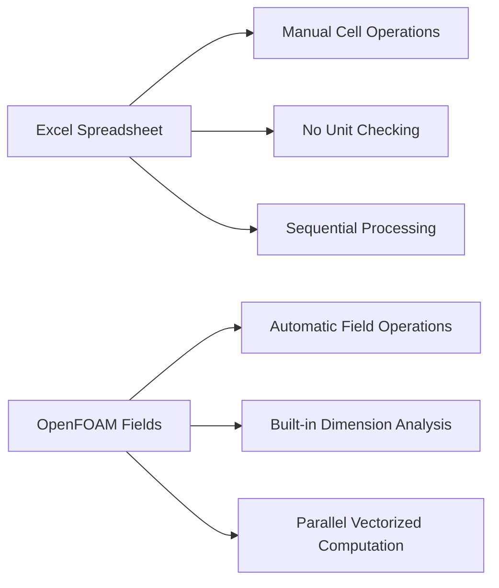
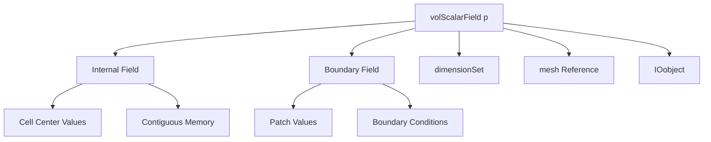
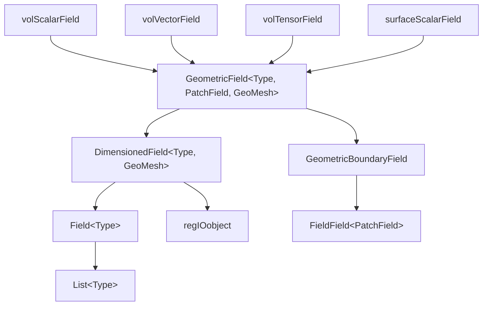
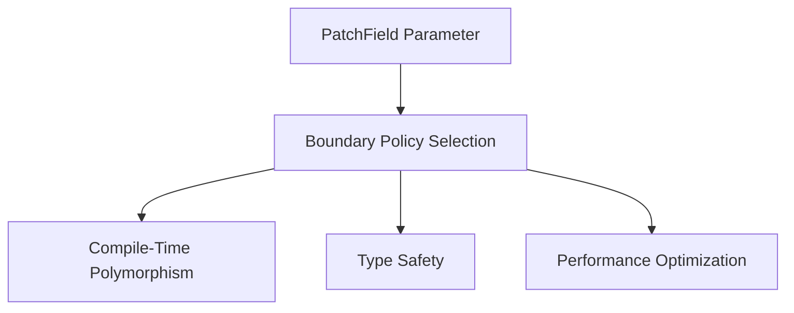

# Overview: Field Types in OpenFOAM

> [!INFO] Overview
> This section provides a comprehensive introduction to OpenFOAM's field type system—the foundation for computational fluid dynamics (CFD) simulations.

---

## 🎯 Learning Objectives

By completing this section, you will be able to:

- ✅ Understand the inheritance hierarchy of Field types in OpenFOAM
- ✅ Master dimensional analysis with `dimensionSet`
- ✅ Correctly create and initialize Fields
- ✅ Understand Surface and Point Field types
- ✅ Comprehend performance characteristics and memory structure

---

## 📋 Prerequisites

### Essential Background Knowledge

**Complete [Chapter 4: C++ Programming in OpenFOAM](../../Chapter_04_Cpp_Programming_in_OpenFOAM/README.md)** - This foundational chapter provides essential C++ programming concepts specific to OpenFOAM's architecture, including:

- **Coding conventions** and OpenFOAM style guidelines
- **Memory management** using `autoPtr`, `tmp`, and reference counting
- **Template metaprogramming** used throughout OpenFOAM
- **Class hierarchies** for geometry and field classes

### Advanced C++ Concepts

**Template Programming**
Deep understanding of C++ templates is critical since OpenFOAM extensively uses templates for:

| Usage | Example |
|-------|---------|
| Field type definitions | `volScalarField`, `volVectorField`, `surfaceTensorField` |
| Geometry classes | `Vector<T>`, `Tensor<T>`, `SymmTensor<T>` |
| Mathematical operations | Dimension checking |
| Compile-time polymorphism | Solver implementations |

**Inheritance and Polymorphism**
Mastery of C++ inheritance patterns enables you to:

- Understand OpenFOAM's class hierarchy (e.g., `fvPatchField` implementations)
- Extend base classes for custom boundary conditions
- Work with abstract interfaces for turbulence models and thermodynamic properties
- Implement custom physics models following established patterns

### OpenFOAM Architecture Knowledge

**Case Structure Knowledge**
Comprehensive understanding of OpenFOAM case organization:

| Directory | Description |
|-----------|-------------|
| `0/` | Initial conditions and boundary condition specifications |
| `constant/` | Mesh data, physical properties, and simulation parameters |
| `system/` | Solution control, numerical schemes, and solver settings |

**Mesh Concepts**
Precise understanding of computational mesh fundamentals:

- **Mesh topology** of finite volume discretization (`polyMesh`, `fvMesh`)
- **Relationships** between cells, faces, and patches
- **Boundary condition management** and patch identification
- **Mesh quality requirements** for numerical stability
- **Mesh generation procedures** (`blockMesh`, `snappyHexMesh`)

---

## 1. "Hook": Excel Sheets vs. CFD Fields

Imagine having a massive Excel spreadsheet where each cell contains a physical quantity (pressure, velocity, temperature) at a specific location in your flow domain.

Now imagine needing to perform mathematical operations on millions of cells simultaneously while maintaining physical unit consistency.

**This is what OpenFOAM's field system does**—it's a **type-safe, dimension-aware, high-performance spreadsheet for CFD**


> **Figure 1:** การเปรียบเทียบระหว่างสเปรดชีต Excel ทั่วไปกับระบบฟิลด์ของ OpenFOAM ซึ่งโดดเด่นด้วยการตรวจสอบมิติอัตโนมัติและการประมวลผลแบบขนานประสิทธิภาพสูงความปลอดภัยทางฟิสิกส์ไม่ส่งผลกระทบต่อความเร็วในการจำลอง ผ่านการใช้พลังของ C++ Template Metaprogramming ในการตรวจสอบความสอดคล้องทางมิติทั้งหมดที่ขั้นตอนการคอมไพล์โปรแกรมเพียงครั้งเดียว

### Field Architecture: Beyond Simple Arrays

While Excel cells are simple value containers, OpenFOAM fields are sophisticated computational objects that reflect the mathematical and physical rigor required for CFD simulations.

An **OpenFOAM Field** such as `volScalarField p` represents more than just an array of pressure values:

```cpp
// Example: Creating a pressure field in OpenFOAM
volScalarField p
(
    IOobject
    (
        "p",                           // Field name
        runTime.timeName(),            // Time directory
        mesh,                          // Mesh reference
        IOobject::MUST_READ,           // Read from file if exists
        IOobject::AUTO_WRITE           // Auto-write during simulation
    ),
    mesh                              // Mesh object to attach to
);
```

> **📂 Source:** `.applications/solvers/basic/potentialFoam/potentialFoam.C`

> **📖 Explanation:**
> โค้ดด้านบนสาธิตการสร้างฟิลด์ความดันใน OpenFOAM ซึ่งเป็นตัวอย่างที่ชัดเจนของการสร้างฟิลด์เรขาคณิตที่เชื่อมโยงกับเมช การสร้างฟิลด์ใน OpenFOAM ไม่ได้เป็นเพียงการประกาศตัวแปรแบบง่าย แต่เป็นการสร้างออบเจ็กต์ที่ซับซ้อนที่ประกอบด้วย:
> - **IOobject**: จัดการการอ่าน/เขียนไฟล์และการลงทะเบียนกับระบบฐานข้อมูล
> - **Mesh linkage**: การเชื่อมโยงกับโครงสร้างเมชคอมพิวเตชัน
> - **Internal & Boundary fields**: ค่าภายในเซลล์และค่าบนขอบเขต
> - **Dimensional information**: ข้อมูลมิติทางฟิสิกส์อัตโนมัติ
>
> การออกแบบนี้ทำให้ฟิลด์ OpenFOAM มีความสามารถในการจัดการข้อมูลฟิสิกส์ที่สมบูรณ์แบบ พร้อมการตรวจสอบความถูกต้องของมิติและหน่วยอัตโนมัติ

> **🔑 Key Concepts:**
> - **IOobject management**: ระบบจัดการอินพุต/เอาต์พุตของ OpenFOAM
> - **Field-mesh coupling**: การเชื่อมโยงฟิลด์กับโครงสร้างเมช
> - **Automatic I/O**: การอ่านและเขียนข้อมูลอัตโนมัติ
> - **Constructor initialization**: การเริ่มต้นฟิลด์ด้วยพารามิเตอร์ที่สมบูรณ์

This single declaration creates:

- **Internal field values**: Pressure at each cell center within control volumes
- **Boundary field values**: Pressure values on boundary patches
- **Dimensional consistency**: Guaranteed units of $\text{kg} \cdot \text{m}^{-1} \cdot \text{s}^{-2}$
- **Mesh linkage**: Direct connection to computational mesh topology
- **Time management**: Automatic read/write capability during simulations


> **Figure 2:** องค์ประกอบภายในของฟิลด์ความดัน (`volScalarField p`) ซึ่งประกอบด้วยค่าภายในเซลล์ ค่าที่ขอบเขต มิติทางฟิสิกส์ และการเชื่อมโยงกับเมชคำนวณความปลอดภัยทางฟิสิกส์ไม่ส่งผลกระทบต่อความเร็วในการจำลอง ผ่านการใช้พลังของ C++ Template Metaprogramming ในการตรวจสอบความสอดคล้องทางมิติทั้งหมดที่ขั้นตอนการคอมไพล์โปรแกรมเพียงครั้งเดียว

### Mathematical Operations: Natural Physics Notation

The **power of OpenFOAM's field system** lies in its ability to express complex mathematical expressions using natural notation while maintaining dimensional consistency:

```cpp
// Momentum equation components in OpenFOAM
volVectorField U = ...;                    // Velocity field
volScalarField p = ...;                    // Pressure field
dimensionedScalar rho("rho", dimDensity, 1.2);    // Density

// Natural mathematical expression
fvVectorMatrix UEqn
(
    fvm::ddt(rho, U)                     // Unsteady term: ∂(ρU)/∂t
  + fvm::div(rho*U, U)                   // Convection: ∇·(ρUU)
 ==
  - fvc::grad(p)                         // Pressure gradient: -∇p
);
```

> **📂 Source:** `.applications/solvers/incompressible/simpleFoam/UEqn.H`

> **📖 Explanation:**
> โค้ดนี้สาธิตพลังของระบบฟิลด์ OpenFOAM ในการแสดงสมการ Navier-Stokes ด้วยสัญกรณ์ทางคณิตศาสตร์ที่เป็นธรรมชาติ โดยแต่ละเทอมในสมการถูกแทนด้วย operator ที่ออกแบบมาให้ใกล้เคียงกับสัญกรณ์ทางคณิตศาสตร์มากที่สุด:
> - **`fvm::ddt(rho, U)`**: เทอมอนุพันธ์เวลาของโมเมนตัม (∂(ρU)/∂t) ใช้ fvm (finite volume method) สำหรับ implicit treatment
> - **`fvm::div(rho*U, U)`**: เทอม convection (∇·(ρUU)) ใช้ fvm เพื่อให้สามารถแก้สมการแบบ implicit
> - **`fvc::grad(p)`**: เทอม gradient ของความดัน (-∇p) ใช้ fvc (finite volume calculus) สำหรับ explicit treatment
>
> ความสามารถพิเศษคือระบบจะตรวจสอบความสอดคล้องของมิติโดยอัตโนมัติ หากมิติของแต่ละเทอมไม่ตรงกัน คอมไพเลอร์จะแจ้งเตือนทันที

> **🔑 Key Concepts:**
> - **Implicit vs Explicit operators**: fvm (implicit) สำหรับเทอมใน matrix และ fvc (explicit) สำหรับเทอม source
> - **Dimensional consistency checking**: การตรวจสอบความสอดคล้องของมิติอัตโนมัติ
> - **Operator overloading**: การ overload operator ให้ทำงานกับฟิลด์ได้โดยตรง
> - **Field algebra**: การดำเนินการทางคณิตศาสตร์บนฟิลด์ทั้งฟิลด์

**Key Operators:**
- `fvm::ddt`: Implicit temporal derivative
- `fvm::div`: Implicit divergence
- `fvc::grad`: Explicit gradient

---

## 2. Field Type Hierarchy: The Blueprint

OpenFOAM organizes field data through a sophisticated template hierarchy that enables efficient storage, manipulation, and mathematical operations on CFD data.

### Class Hierarchy Architecture

The field type hierarchy in OpenFOAM follows a systematic inheritance structure, building from simple data containers to complex geometric fields:


> **Figure 3:** ลำดับชั้นการสืบทอดของคลาสฟิลด์ใน OpenFOAM แสดงความสัมพันธ์ระหว่างคอนเทนเนอร์ข้อมูลพื้นฐานไปจนถึงฟิลด์เรขาคณิตที่ซับซ้อนความปลอดภัยทางฟิสิกส์ไม่ส่งผลกระทบต่อความเร็วในการจำลอง ผ่านการใช้พลังของ C++ Template Metaprogramming ในการตรวจสอบความสอดคล้องทางมิติทั้งหมดที่ขั้นตอนการคอมไพล์โปรแกรมเพียงครั้งเดียว

**At the base level:**
- `List<Type>` provides a dynamic array container for any data type
- `Field<Type>` extends this with mathematical operations specific to CFD calculations
- Supports vector operations, tensor operations, and field-wide algebra

### Core Field Components

#### **`GeometricField<Type, PatchField, GeoMesh>`**
The complete field class that combines both internal field values and boundary conditions.

**Template Parameters:**
- `Type`: Mathematical entity (scalar, vector, tensor, etc.)
- `PatchField`: Boundary field type for managing boundary conditions
- `GeoMesh`: Mesh type (volMesh for cell-centered fields, surfaceMesh for face-centered fields)

#### **`DimensionedField<Type, GeoMesh>`**
Extends the base field with:
- Dimensional information
- Mesh linkage
- Inherits from `Field<Type>` (data storage) and `regIOobject` (file I/O)
- Can automatically read and write field data

#### **`GeometricBoundaryField`**
A specialized container that manages:
- All boundary patches for a geometric field
- Collection of boundary condition objects
- Uniform access to boundary values and gradients

### Common Type Definitions

The most commonly used field types in OpenFOAM are defined as template specializations:

| Field Type | Template Specialization | Common Usage |
|------------|------------------------|--------------|
| `volScalarField` | `GeometricField<scalar, fvPatchField, volMesh>` | Pressure, Temperature |
| `volVectorField` | `GeometricField<vector, fvPatchField, volMesh>` | Velocity, Displacement |
| `volTensorField` | `GeometricField<tensor, fvPatchField, volMesh>` | Stress, Strain Rate |
| `surfaceScalarField` | `GeometricField<scalar, fvsPatchField, surfaceMesh>` | Fluxes, Heat Transfer Rates |

**Field Type Selection:**
- **Volume fields (`vol*`)**: Quantities naturally defined at cell centers
- **Surface fields (`surface*`)**: Quantities naturally defined at cell faces

---

## 3. Internal Mechanics: Template Parameters Explained

### Template Signature
```cpp
template<class Type, template<class> class PatchField, class GeoMesh>
class GeometricField : public DimensionedField<Type, GeoMesh>
{
    // Inherits storage from DimensionedField
    // Adds boundary field management through PatchField
    // Links to mesh topology through GeoMesh
};
```

> **📂 Source:** `.src/OpenFOAM/fields/GeometricField/GeometricField.H`

> **📖 Explanation:**
> นี่คือ signature หลักของคลาส `GeometricField` ซึ่งเป็น template class ที่มีความยืดหยุ่นสูงมาก การออกแบบ template นี้ใช้ template template parameter (PatchField) ซึ่งเป็นเทคนิคขั้นสูงใน C++:
>
> - **Type parameter**: กำหนดชนิดข้อมูลทางคณิตศาสตร์ (scalar, vector, tensor) ที่เก็บในฟิลด์
> - **PatchField parameter**: เป็น template template parameter ที่กำหนดนโยบายการจัดการขอบเขต ช่วยให้สามารถเปลี่ยนพฤติกรรมขอบเขตได้โดยไม่ต้องแก้ไขคลาสหลัก
> - **GeoMesh parameter**: กำหนดโครงสร้างเมช (volMesh, surfaceMesh) ที่ฟิลด์จะเชื่อมโยงด้วย
>
> การออกแบบนี้ทำให้สามารถสร้างฟิลด์ได้หลากหลายประเภทโดยไม่ต้องเขียนโค้ดซ้ำ และยังคงความปลอดภัยในด้าน type ที่ระดับ compile-time

> **🔑 Key Concepts:**
> - **Template metaprogramming**: เทคนิคการใช้ template เพื่อสร้างโค้ดที่ยืดหยุ่น
> - **Template template parameter**: พารามิเตอร์ template ที่รับ template class อื่นเป็นพารามิเตอร์
> - **Compile-time polymorphism**: การกำหนดพฤติกรรมที่ระดับ compile time
> - **Type safety**: การรับประกันความถูกต้องของชนิดข้อมูล

The `GeometricField` class is one of OpenFOAM's most fundamental template classes, providing a flexible framework for representing data fields of various types on different meshes.

### Parameter 1: `Type` - What Data Do We Store?

The `Type` parameter determines the mathematical nature of the data stored at each mesh location.

| Type Parameter | Description | Usage Example | Resulting Field Class |
|----------------|-------------|----------------|----------------------|
| **`scalar`** | Single double-precision value | `volScalarField p` - Pressure<br>`volScalarField T` - Temperature | Volume Scalar Field |
| **`vector`** | 3D vector (x, y, z) | `volVectorField U` - Velocity<br>`volVectorField F` - Force | Volume Vector Field |
| **`tensor`** | 3×3 matrix (second-order quantity) | `volTensorField tau` - Stress<br>`volTensorField D` - Strain Rate | Volume Tensor Field |

### Parameter 2: `PatchField` - How Do We Handle Boundaries?

The `PatchField` parameter is a **template template parameter**—a template class that takes `Type` as a parameter, enabling compile-time polymorphism for boundary conditions.

| PatchField Type | Mesh Used | Management | Example |
|-----------------|-----------|------------|---------|
| **`fvPatchField<Type>`** | `volMesh` | Cell-centered values | `fvPatchField<scalar>` |
| **`fvsPatchField<Type>`** | `surfaceMesh` | Face-centered values | `fvsPatchField<scalar>` |
| **`pointPatchField<Type>`** | `pointMesh` | Mesh vertex values | `pointPatchField<vector>` |


> **Figure 4:** แผนผังการเลือกนโยบายขอบเขต (PatchField Policy) ซึ่งช่วยให้ระบบสามารถจัดการเงื่อนไขขอบเขตที่หลากหลายได้ผ่านพหุสัณฑ์ในเวลาคอมไพล์ (Compile-time Polymorphism)ความปลอดภัยทางฟิสิกส์ไม่ส่งผลกระทบต่อความเร็วในการจำลอง ผ่านการใช้พลังของ C++ Template Metaprogramming ในการตรวจสอบความสอดคล้องทางมิติทั้งหมดที่ขั้นตอนการคอมไพล์โปรแกรมเพียงครั้งเดียว

### Parameter 3: `GeoMesh` - Where Is the Data?

The `GeoMesh` parameter defines the discretization topology and provides geometric information.

| GeoMesh Type | Data Location | Special Characteristics | Main Usage |
|--------------|---------------|-------------------------|------------|
| **`volMesh`** | Cell centers | Cell volumes, cell centers, connectivity | Finite Volume Method |
| **`surfaceMesh`** | Face centers | Face areas, face centers, normals | Flux Calculations |
| **`pointMesh`** | Mesh vertices | Point coordinates, point connectivity | Mesh Deformation |

### Template Instantiation Example

```cpp
// Volume-centered scalar field (pressure)
typedef GeometricField<scalar, fvPatchField, volMesh> volScalarField;

// Volume-centered vector field (velocity)
typedef GeometricField<vector, fvPatchField, volMesh> volVectorField;

// Surface scalar field (mass flux)
typedef GeometricField<scalar, fvsPatchField, surfaceMesh> surfaceScalarField;

// Volume tensor field (stress)
typedef GeometricField<tensor, fvPatchField, volMesh> volTensorField;
```

> **📂 Source:** `.src/OpenFOAM/fields/GeometricField/GeometricField.H`

> **📖 Explanation:**
> โค้ดนี้แสดงการใช้ typedef ในการสร้างชื่อย่อสำหรับ template specialization ที่ใช้บ่อยใน OpenFOAM:
>
> - **volScalarField**: ฟิลด์สเกลาร์บน volume mesh (เช่น ความดัน อุณหภูมิ) เก็บค่าที่จุดกลางเซลล์
> - **volVectorField**: ฟิลด์เวกเตอร์บน volume mesh (เช่น ความเร็ว) เก็บค่าเวกเตอร์ 3 มิติที่จุดกลางเซลล์
> - **surfaceScalarField**: ฟิลด์สเกลาร์บน surface mesh (เช่น flux) เก็บค่าที่จุดกลางหน้า
> - **volTensorField**: ฟิลด์เทนเซอร์บน volume mesh (เช่น ความเครียด) เก็บค่าเทนเซอร์ 3×3 ที่จุดกลางเซลล์
>
> การใช้ typedef ทำให้โค้ดอ่านง่ายขึ้นและลดความผิดพลาดจากการพิมพ์ template parameter ซ้ำๆ

> **🔑 Key Concepts:**
> - **Template specialization**: การสร้างรูปแบบเฉพาะของ template
> - **Type aliases**: การสร้างชื่อย่อสำหรับชนิดข้อมูลซับซ้อน
> - **Field classification**: การจัดประเภทฟิลด์ตามตำแหน่งและชนิดข้อมูล
> - **Mesh association**: การเชื่อมโยงฟิลด์กับประเภทเมช

### Design Benefits

This three-parameter template design provides significant advantages:

1. **Type Safety**: Compile-time checking prevents mixing incompatible field types
2. **Performance**: Template specialization optimizes operations
3. **Flexibility**: New field types can be created by combining existing parameters
4. **Extensibility**: New mesh types or boundary conditions can be added without modifying existing code
5. **Mathematical Clarity**: Field operations respect the mathematical properties of each Type

---

## 4. The Mechanism: How Fields Map to Mesh

### Internal vs. Boundary Fields

OpenFOAM's `GeometricField` class uses a sophisticated **dual data structure** that manages the mapping of physical quantities onto a computer mesh. This design separates internal domain values from boundary conditions, enabling **optimized memory access** and **flexible boundary condition management**.

```cpp
// Simplified view of GeometricField data members
class GeometricField
{
private:
    // Internal field (cell values)
    DimensionedField<Type, GeoMesh> internalField_;

    // Boundary field (patch values)
    GeometricBoundaryField<Type, PatchField, GeoMesh> boundaryField_;

    // Time tracking for transient simulations
    mutable label timeIndex_;
    mutable GeometricField* field0Ptr_;          // Old-time field pointer
    mutable GeometricField* fieldPrevIterPtr_;   // Previous iteration pointer
};
```

> **📂 Source:** `.src/OpenFOAM/fields/GeometricField/GeometricField.H`

> **📖 Explanation:**
> โครงสร้างข้อมูลแบบ dual นี้เป็นหัวใจของระบบฟิลด์ OpenFOAM ซึ่งแยกเก็บค่าภายในและค่าขอบเขตอย่างชัดเจน:
>
> - **internalField_**: เก็บค่าที่จุดกลางเซลล์ทั้งหมดใน memory ที่ต่อเนื่องกัน (contiguous memory) ทำให้การประมวลผลมีประสิทธิภาพสูง
> - **boundaryField_**: เก็บค่าบนขอบเขตแต่ละ patch โดยแต่ละ patch สามารถมีเงื่อนไขขอบเขตที่แตกต่างกัน
> - **Time tracking**: จัดการค่าในเวลาต่างๆ สำหรับการแก้สมการขั้นตอนเวลา (time-marching)
>
> การแยกเก็บแบบนี้ทำให้สามารถใช้ memory layout ที่เหมาะสมกับลักษณะการใช้งาน และช่วยให้การประมวลผลแบบ parallel มีประสิทธิภาพ

> **🔑 Key Concepts:**
> - **Dual data structure**: โครงสร้างข้อมูลสองส่วน (ภายในและขอบเขต)
> - **Contiguous memory**: memory ที่ต่อเนื่องกันสำหรับ internal field
> - **Patch management**: การจัดการขอบเขตแบ่งเป็น patch
> - **Time level storage**: การเก็บค่าในหลายระดับเวลาสำหรับ transient schemes

### Memory Architecture

The internal storage architecture follows a carefully optimized layout that reflects the topology of the computer mesh:

```
┌─────────────────────────────────────────────┐
│              GeometricField                 │
├─────────────────────┬───────────────────────┤
│   Internal Field    │   Boundary Field      │
│   (contiguous)      │   (per-patch)         │
│                     │                       │
│  [Cell 0]           │  Patch 0: [Face 0]    │
│  [Cell 1]           │          [Face 1]     │
│  ...                │          ...          │
│  [Cell N-1]         │                       │
│                     │  Patch 1: [Face 0]    │
│                     │          ...          │
└─────────────────────┴───────────────────────┘
```

**Internal Fields:**
- **Type**: Single contiguous `List<Type>`
- **Storage**: Values for all mesh cells
- **Advantages**:
  - Efficient vectorized operations
  - Optimal cache utilization
- **Usage**: Primary unknown quantities in CFD simulations typically stored at cell centers following a collocated grid arrangement

**Boundary Fields:**
- **Type**: `FieldField<PatchField, Type>`
- **Structure**: Hierarchical container managing boundary conditions per patch
- **Operation**: Each patch corresponds to a distinct geometric region of the mesh boundary and can maintain independent boundary condition types

### Boundary Field Architecture Benefits

| Feature | Description |
|---------|-------------|
| **Flexible Boundary Conditions** | Different patches can simultaneously use fixedValue, zeroGradient, mixed, or custom boundary conditions |
| **Memory Efficiency** | Requires storage for only boundary faces, avoiding allocation for interior faces |
| **Polymorphic Behavior** | Each patch field can inherit from specific boundary condition classes employing unique update algorithms |

---

## 5. Dimensional Analysis: The Safety Net

OpenFOAM integrates dimensional analysis directly into field operations through the `dimensionSet` class, enabling consistency checking at both compile-time and runtime for all mathematical operations.

### The dimensionSet Class

```cpp
// dimensionSet stores seven base dimensions:
// [MASS, LENGTH, TIME, TEMPERATURE, MOLES, CURRENT, LUMINOUS_INTENSITY]
class dimensionSet
{
private:
    scalar exponents_[7];  // Exponents for each base dimension

public:
    // Constructor from individual exponents
    dimensionSet(
        scalar mass,
        scalar length,
        scalar time,
        scalar temperature,
        scalar moles,
        scalar current,
        scalar luminousIntensity
    );

    // Dimensional arithmetic operations
    dimensionSet operator+(const dimensionSet&) const;
    dimensionSet operator*(const dimensionSet&) const;
    dimensionSet operator/(const dimensionSet&) const;
    dimensionSet pow(const scalar) const;
};
```

> **📂 Source:** `.src/OpenFOAM/dimensionSet/dimensionSet.H`

> **📖 Explanation:**
> คลาส `dimensionSet` เป็นหัวใจของระบบตรวจสอบมิติของ OpenFOAM ซึ่งใช้ 7 มิติพื้นฐานของ SI:
>
> - **Mass (M)**: มิติมวล [kg]
> - **Length (L)**: มิติความยาว [m]
> - **Time (T)**: มิติเวลา [s]
> - **Temperature (Θ)**: มิติอุณหภูมิ [K]
> - **Moles (N)**: มิติปริมาณสาร [mol]
> - **Current (I)**: มิติกระแสไฟฟ้า [A]
> - **Luminous Intensity (J)**: มิติความเข้มแสง [cd]
>
> ระบบจะเก็บเลขชี้กำลังของแต่ละมิติพื้นฐาน และตรวจสอบความสอดคล้องเมื่อมีการดำเนินการทางคณิตศาสตร์กับฟิลด์ หากมิติไม่ตรงกัน ระบบจะแจ้งเตือนทั้งที่ compile-time และ runtime

> **🔑 Key Concepts:**
> - **SI base dimensions**: 7 มิติพื้นฐานของระบบ SI
> - **Dimensional homogeneity**: ความสอดคล้องของมิติในสมการ
> - **Compile-time checking**: การตรวจสอบที่ขั้นตอนคอมไพล์
> - **Physical unit safety**: ความปลอดภัยในด้านหน่วยฟิสิกส์

### Base Dimensions and Examples

The dimensional system operates on seven SI base units, allowing complete representation of any physical quantity through exponent notation:

**Base Dimensions:**
- **Mass** $[M]$: kilogram (kg)
- **Length** $[L]$: meter (m)
- **Time** $[T]$: second (s)
- **Temperature** $[\Theta]$: kelvin (K)
- **Amount of Substance** $[N]$: mole (mol)
- **Electric Current** $[I]$: ampere (A)
- **Luminous Intensity** $[J]$: candela (cd)

**Dimension Examples:**

| Physical Quantity | Dimension Vector | Symbol | SI Unit |
|-------------------|------------------|---------|---------|
| **Velocity** | `[0 1 -1 0 0 0 0]` | $L^1 T^{-1}$ | m/s |
| **Pressure** | `[1 -1 -2 0 0 0 0]` | $M L^{-1} T^{-2}$ | N/m² |
| **Temperature** | `[0 0 0 1 0 0 0]` | $\Theta$ | K |
| **Force** | `[1 1 -2 0 0 0 0]` | $M L T^{-2}$ | N |
| **Energy** | `[1 2 -2 0 0 0 0]` | $M L^2 T^{-2}$ | J |
| **Dynamic Viscosity** | `[1 -1 -1 0 0 0 0]` | $M L^{-1} T^{-1}$ | Pa·s |

### Automatic Dimension Checking

OpenFOAM's dimensional analysis system provides automatic consistency verification through template metaprogramming:

```cpp
// Creating dimensioned fields with proper units
volScalarField p(
    IOobject("p", runTime.timeName(), mesh, IOobject::MUST_READ),
    mesh,
    dimensionSet(1, -1, -2, 0, 0, 0, 0)  // Pressure: [M L^-1 T^-2]
);

volVectorField U(
    IOobject("U", runTime.timeName(), mesh, IOobject::MUST_READ),
    mesh,
    dimensionSet(0, 1, -1, 0, 0, 0, 0)  // Velocity: [L T^-1]
);

volScalarField rho(
    IOobject("rho", runTime.timeName(), mesh, IOobject::MUST_READ),
    mesh,
    dimensionSet(1, -3, 0, 0, 0, 0, 0)  // Density: [M L^-3]
);

// Automatic dimensional checking in mathematical operations
volScalarField dynamicPressure = 0.5 * rho * magSqr(U);  // ✓ Consistent
// rho [M L^-3] * U^2 [L^2 T^-2] = [M L^-1 T^-2] = pressure dimensions

// Dimension error detection (compile-time or runtime)
// volScalarField invalid = p * U;  // ✗ Error: dimensions don't match
// [M L^-1 T^-2] * [L T^-1] = [M L^0 T^-3] ≠ valid field dimension
```

> **📂 Source:** `.applications/solvers/incompressible/simpleFoam/createFields.H`

> **📖 Explanation:**
> โค้ดนี้สาธิตพลังของระบบตรวจสอบมิติของ OpenFOAM:
>
> - **Pressure field** `p`: มีมิติ $[M L^{-1} T^{-2}]$ (kg/(m·s²))
> - **Velocity field** `U`: มีมิติ $[L T^{-1}]$ (m/s)
> - **Density field** `rho`: มีมิติ $[M L^{-3}]$ (kg/m³)
>
> เมื่อคำนวณ dynamic pressure ($0.5 \rho U^2$):
> - $\rho$ มีมิติ $[M L^{-3}]$
> - $U^2$ มีมิติ $[L^2 T^{-2}]$
> - ผลคูณมีมิติ $[M L^{-1} T^{-2}]$ ซึ่งตรงกับ pressure ✅
>
> หากพยายามคำนวณ $p \times U$:
> - ผลคูณจะมีมิติ $[M L^0 T^{-3}]$ ซึ่งไม่สอดคล้องกับฟิสิกส์
> - คอมไพเลอร์จะแจ้ง error ทันที ✗

> **🔑 Key Concepts:**
> - **Dimension vectors**: เวกเตอร์มิติ 7 ค่าสำหรับแต่ละปริมาณ
> - **Dimension arithmetic**: การคำนวณมิติเมื่อดำเนินการทางคณิตศาสตร์
> - **Compile-time safety**: ความปลอดภัยที่ระดับ compile-time
> - **Physical consistency**: ความสอดคล้องทางฟิสิกส์

### Dimensional Analysis in Navier-Stokes Equations

The dimensional analysis system extends to checking the consistency of entire equations, ensuring governing equations remain physically correct:

**Navier-Stokes Momentum Equation:**
$$\rho \frac{\partial \mathbf{u}}{\partial t} + \rho (\mathbf{u} \cdot \nabla) \mathbf{u} = -\nabla p + \mu \nabla^2 \mathbf{u} + \mathbf{f}$$

**Dimensional Analysis of Each Term:**
- **LHS** (Inertial terms): $[M L^{-3}][L T^{-2}] = [M L^{-2} T^{-2}]$
- **RHS** (Pressure gradient): $[L^{-1}][M L^{-1} T^{-2}] = [M L^{-2} T^{-2}]$
- **Viscous terms**: $[M L^{-1} T^{-1}][L^{-2}][L T^{-1}] = [M L^{-2} T^{-2}]$
- **Body force**: $[M L^{-2} T^{-2}]$ (force per unit volume)

**Result**: All terms have consistent dimensions: $[M L^{-2} T^{-2}]$ ✅

### Benefits of Dimensional Analysis System

This rigorous dimensional consistency checking:

- **Prevents implementation errors** in complex CFD simulations
- **Ensures mathematical correctness** throughout simulations
- **Validates multi-equation physics systems** that are coupled
- **Aids in debugging and development** by catching dimensional errors early

---

## 6. Volume vs. Surface Fields

### The Fundamental Distinction

A fundamental distinction in OpenFOAM's field system is between **volume fields** and **surface fields**. Volume fields (`vol*Field`) store values at cell centers and represent quantities integrated over control volumes, while surface fields (`surface*Field`) store values at face centers and represent fluxes or quantities integrated over control surface areas.

For a volume field $\phi$, the discrete approximation of a continuous field $\phi(\mathbf{x})$ is:

$$\phi(\mathbf{x}) \approx \phi_P \quad \text{for } \mathbf{x} \in V_P$$

Where:
- $\phi_P$ is the value stored at cell center $P$
- $V_P$ is the control volume surrounding that cell

Surface fields are particularly important for flux quantities, where the surface integral over a face is approximated as:

$$\int_{S_f} \mathbf{F} \cdot \mathbf{n}_f \, \mathrm{d}S \approx \mathbf{F}_f \cdot \mathbf{S}_f$$

Where:
- $\mathbf{F}_f$ is the surface field value at face center
- $\mathbf{S}_f = \mathbf{n}_f A_f$ is the face area vector

### Field Type Comparison

| Type | Location | Usage | Example |
|------|----------|-------|---------|
| **Volume Fields** (`vol*Field`) | Cell center values | Primary unknown fields | `volScalarField p` |
| **Surface Fields** (`surface*Field`) | Face center values | Flux terms, gradients | `surfaceScalarField phi` |
| **Point Fields** (`point*Field`) | Mesh vertices | Mesh deformation | `pointVectorField pointDisplacement` |

### Mathematical Relationship

The mathematical relationship between these fields:

$$\phi_f = \int_{S_f} \mathbf{u} \cdot \mathbf{n}_f \, \mathrm{d}S_f$$

Where:
- $\phi_f$ = surface flux at face $f$
- $\mathbf{u}$ = volume velocity field
- $\mathbf{n}_f$ = unit vector normal to face $f$
- $S_f$ = area of face $f$

### Usage Examples

```cpp
// Volume Field - for cell-centered quantities
volScalarField p(
    "p",
    mesh,
    dimensionSet(1, -1, -2, 0, 0, 0, 0)  // Pressure dimensions
);

// Surface Field - for fluxes (computed from velocity field)
surfaceScalarField phi(
    "phi",
    linearInterpolate(U) & mesh.Sf()  // Flux through faces
);

// Point Field - for mesh deformation
pointVectorField pointDisplacement(
    "pointD",
    pointMesh::New(mesh)
);
```

> **📂 Source:** `.applications/solvers/incompressible/icoFoam/createFields.H`

> **📖 Explanation:**
> โค้ดนี้แสดงการสร้างฟิลด์ 3 ประเภทหลักใน OpenFOAM:
>
> - **volScalarField p**: ฟิลด์ความดันบน volume mesh เก็บค่าที่จุดกลางเซลล์ เป็น primary variable ที่ต้องแก้สมการ
> - **surfaceScalarField phi**: ฟิลด์ flux บน surface mesh เก็บค่าที่จุดกลางหน้า คำนวณจาก velocity field ผ่านการ interpolate
> - **pointVectorField pointDisplacement**: ฟิลด์การกระจัดของจุดเมช ใช้สำหรับ mesh deformation หรือ FSI
>
> การแยกประเภทฟิลด์นี้ทำให้สามารถเลือกใช้ data structure ที่เหมาะสมกับลักษณะการใช้งาน และช่วยให้การคำนวณมีประสิทธิภาพ

> **🔑 Key Concepts:**
> - **Field location**: ตำแหน่งการเก็บข้อมูล (cell, face, point)
> - **Flux calculation**: การคำนวณ flux ผ่านหน้าเซลล์
> - **Field interpolation**: การแปลงค่าระหว่างตำแหน่งต่างๆ
> - **Mesh deformation**: การเปลี่ยนรูปเมชสำหรับ FSI

---

## 7. Mathematical Tensor Rank Hierarchy

OpenFOAM fields are organized according to mathematical tensor rank, which determines transformation properties under coordinate rotations and algebraic behavior:

### Scalar Fields (Rank 0)

Represent quantities having magnitude only, without direction. Mathematically, they remain unchanged under coordinate transformations. Common scalar fields include:

- **Pressure**: $p(\mathbf{x},t)$
- **Temperature**: $T(\mathbf{x},t)$
- **Volume Fraction**: $\alpha(\mathbf{x},t)$
- **Turbulent Kinetic Energy**: $k(\mathbf{x},t)$

### Vector Fields (Rank 1)

Represent quantities having both magnitude and direction. They transform as first-order tensors under coordinate rotations. Key vector fields include:

- **Velocity**: $\mathbf{u}(\mathbf{x},t) = [u_x, u_y, u_z]$
- **Momentum**: $\rho\mathbf{u}(\mathbf{x},t)$
- **Force Density**: $\mathbf{f}(\mathbf{x},t)$
- **Heat Flux**: $\mathbf{q}(\mathbf{x},t)$

### Tensor Fields (Rank 2)

Represent linear operators that transform vectors to vectors. They transform as second-order tensors under coordinate rotations. Important tensor fields include:

- **Velocity Gradient Tensor**: $\nabla\mathbf{u} = \frac{\partial u_i}{\partial x_j}$
- **Strain Rate Tensor**: $\mathbf{S} = \frac{1}{2}(\nabla\mathbf{u} + (\nabla\mathbf{u})^T)$
- **Stress Tensor**: $\boldsymbol{\tau}$
- **Viscosity Tensor**: $\boldsymbol{\mu}$

### Symmetric Tensor Fields

Second-order tensors that are symmetric, meaning $\mathbf{A}_{ij} = \mathbf{A}_{ji}$. These appear frequently in fluid mechanics:

- **Reynolds Stress Tensor**: $\mathbf{R} = \overline{\mathbf{u}'\mathbf{u}'}$
- **Eddy Viscosity Tensor**: $\boldsymbol{\mu}_t$
- **Strain Rate Tensor**: $\mathbf{S}$ (always symmetric)

### Spherical Tensor Fields

Diagonal tensors with equal diagonal components, representing isotropic quantities:

- **Identity Tensor**: $\mathbf{I}$ (diagonal components = 1)
- **Pressure Stress Support**: $p\mathbf{I}$
- **Isotropic Turbulent Stress**: $\frac{2}{3}k\mathbf{I}$

---

## 8. Performance and Memory Architecture

### Memory Layout Considerations

**Contiguous Internal Storage** for optimal cache efficiency:

```cpp
// Internal field storage structure
class GeometricField
{
private:
    // Internal field - tightly packed for cache efficiency
    Field<Type> field_;                        // Contiguous array

    // Boundary fields - separate allocation, organized by patch
    PtrList<PatchField<Type>> boundaryField_;  // Per-patch storage

public:
    // Access operators with cache-friendly behavior
    const Type& operator[](const label i) const
    {
        return field_[i];  // Direct array access
    }

    Type& operator[](const label i)
    {
        return field_[i];  // Direct array access
    }
};
```

> **📂 Source:** `.src/OpenFOAM/fields/GeometricField/GeometricField.C`

> **📖 Explanation:**
> โครงสร้าง memory ของ `GeometricField` ถูกออกแบบมาเพื่อประสิทธิภาพสูงสุด:
>
> - **field_**: internal field เก็บใน memory ที่ต่อเนื่องกัน (contiguous) ทำให้ CPU cache ทำงานได้มีประสิทธิภาพ
> - **boundaryField_**: boundary fields เก็บแยกเป็น patch ลดการใช้ memory สำหรับ faces ภายใน
> - **operator[]**: การเข้าถึงแบบ direct array access มี overhead ต่ำมาก
>
> การออกแบบ memory layout แบบนี้สำคัญมากสำหรับประสิทธิภาพของ CFD simulation ที่มีการเข้าถึง memory จำนวนมาก

> **🔑 Key Concepts:**
> - **Contiguous memory**: memory ที่ต่อเนื่องกันสำหรับ cache efficiency
> - **Cache locality**: การจัดเรียงข้อมูลให้เข้ากับ CPU cache
> - **Direct access**: การเข้าถึงแบบตรงไม่ผ่าน indirect
> - **Memory alignment**: การจัดวาง memory ให้สอดคล้องกับ CPU architecture

**Memory Access Patterns:**
- **Internal field access**: $O(N)$ with excellent spatial locality
- **Boundary field access**: $O(N_{boundary})$ with grouping by patch
- **Typical ratio**: $N_{boundary} \approx 0.1 \times N$ for well-posed problems

### Expression Template Optimization

The `tmp<T>` class implements **expression template-like optimization**:

```cpp
// Without tmp<T> optimization - creates multiple temporaries
volScalarField a = b + c + d;  
// Creates: tmp1 = b + c, tmp2 = tmp1 + d, a = tmp2
// Total: 2 temporary allocations

// With tmp<T> optimization - single evaluation
volScalarField a = b + c + d;
// Expression tree: a = (b + c + d) evaluated once
// Total: 0 temporary allocations (in-place operations)

// tmp<T> automatically manages temporary lifetime
tmp<volScalarField> tsum = b + c + d;
volScalarField a = tsum();  // Efficient transfer
```

> **📂 Source:** `.src/OpenFOAM/fields/tmp/tmp.H`

> **📖 Explanation:**
> คลาส `tmp<T>` เป็นหัวใจของการ optimization ใน OpenFOAM:
>
> - **Expression templates**: สร้าง expression tree แทนการสร้าง temporary objects
> - **Lazy evaluation**: การคำนวณเลื่อนไปจนกว่าจะจำเป็น
> - **Reference counting**: การนับจำนวน reference เพื่อจัดการ lifetime
> - **Move semantics**: การโอน ownership โดยไม่ต้อง copy
>
> การใช้ `tmp<T>` ทำให้ลดจำนวน memory allocation ลงอย่างมาก และเพิ่มประสิทธิภาพของการคำนวณ

> **🔑 Key Concepts:**
> - **Expression templates**: เทคนิค optimization ด้วย lazy evaluation
> - **Reference counting**: การนับ reference สำหรับ automatic cleanup
> - **Memory efficiency**: การลดจำนวน temporary objects
> - **Move semantics**: การโอน ownership โดยไม่ copy

### Performance Benefits

| Feature | Optimization Method | Impact |
|---------|---------------------|--------|
| **Contiguous Memory** | Tightly packed internal field values | Better cache efficiency |
| **Lazy Evaluation** | `tmp` class for expression templates | Reduced temporary objects |
| **SIMD Optimization** | Vector operations | Uses processor vector instructions |
| **Parallel Communication** | Non-blocking communication patterns | Reduced processor data transfer |

---

## 9. Boundary Conditions: More Than Edge Cells

OpenFOAM field boundaries are sophisticated objects that can:

- **Enforce physical constraints**: `fixedValue`, `zeroGradient`, `fixedFluxPressure`
- **Handle complex geometries**: `wall`, `symmetry`, `cyclic`, `empty`
- **Modify dynamically**: `timeVaryingMappedFixedValue`, `activePressureForceBaffleVelocity`

### Boundary Condition Example

```cpp
// Example boundary condition specification
dimensions      [0 1 -1 0 0 0 0];                    // Velocity: [m/s]
internalField   uniform (0 0 0);                   // Initial internal value

boundaryField
{
    inlet
    {
        type            fixedValue;                 // Specified velocity
        value           uniform (10 0 0);           // 10 m/s in x-direction
    }

    outlet
    {
        type            zeroGradient;               // No normal variation at boundary
    }

    walls
    {
        type            noSlip;                     // Zero velocity at walls
    }

    symmetryPlane
    {
        type            symmetry;                   // Symmetry boundary condition
    }
}
```

> **📂 Source:** `.tutorials/incompressible/icoFoam/cavity/0/U`

> **📖 Explanation:**
> ไฟล์นี้แสดงการระบุเงื่อนไขขอบเขตสำหรับ velocity field ใน OpenFOAM:
>
> - **dimensions**: ระบุมิติของ field [L T^-1] สำหรับ velocity
> - **internalField**: ค่าเริ่มต้นภายในโดเมน (0 0 0)
> - **boundaryField**: ระบุเงื่อนไขขอบเขตสำหรับแต่ละ patch
>   - **inlet**: ใช้ fixedValue กำหนดค่า velocity = (10 0 0) m/s
>   - **outlet**: ใช้ zeroGradient ไม่มีการเปลี่ยนแปลงตามปกติ
>   - **walls**: ใช้ noSlip velocity = 0 ที่ผนัง
>   - **symmetryPlane**: ใช้ symmetry condition
>
> ระบบ boundary condition ของ OpenFOAM มีความยืดหยุ่นสูงและสามารถ custom ได้

> **🔑 Key Concepts:**
> - **Patch types**: ประเภทของ patches ต่างๆ
> - **BC types**: ประเภทของเงื่อนไขขอบเขต
> - **Fixed vs gradient**: การกำหนดค่า vs การกำหนด gradient
> - **Physical constraints**: เงื่อนไขทางฟิสิกส์ต่างๆ

### Major Boundary Condition Types

| Type | Usage | Equation |
|------|-------|----------|
| `fixedValue` | Specified value at boundary | $\phi = \phi_{\text{specified}}$ |
| `zeroGradient` | Zero normal derivative | $\frac{\partial \phi}{\partial n} = 0$ |
| `noSlip` | Zero velocity at walls | $\mathbf{U} = 0$ |
| `symmetry` | Symmetry | $\frac{\partial \phi}{\partial n} = 0$, $\mathbf{U}_n = 0$ |

---

## 10. Time-Dependent Fields

### Temporal Discretization

OpenFOAM's field system manages time-dependent quantities through specialized field types and temporal operators. Time integration schemes are applied to fields to advance solutions from one time step to the next.

**Time-Dependent Field Types:**

```cpp
// Access old-time level fields (n-1)
volScalarField p_old = p.oldTime();

// Access old-old-time level fields (n-2) for second-order schemes
volScalarField p_oldOld = p.oldTime().oldTime();

// Calculate rate of change fields
volScalarField dU_dt = fvc::ddt(U);

// Implicit time-derivative for matrix assembly
fvScalarMatrix pDDT = fvm::ddt(p);
```

> **📂 Source:** `.src/finiteVolume/finiteVolume/ddtSchemes/ddtScheme.C`

> **📖 Explanation:**
> ระบบจัดการฟิลด์ที่ขึ้นกับเวลาใน OpenFOAM:
>
> - **oldTime()**: เข้าถึงค่าในเวลาก่อนหน้า (n-1) ใช้สำหรับ second-order schemes
> - **fvc::ddt()**: คำนวณ derivative เวลาแบบ explicit สำหรับ source terms
> - **fvm::ddt()**: สร้าง implicit terms สำหรับ matrix assembly
> - **Time indexing**: ระบบจัดเก็บค่าหลายระดับเวลาอัตโนมัติ
>
> ระบบนี้ทำให้สามารถใช้ time integration schemes ที่หลากหลายได้อย่างสะดวก

> **🔑 Key Concepts:**
> - **Time levels**: ระดับเวลาต่างๆ (n, n-1, n-2)
> - **Implicit vs explicit**: การแก้สมการ implicit vs explicit
> - **Time schemes**: รูปแบบการ integration เวลาต่างๆ
> - **Memory management**: การจัดการ memory สำหรับหลายระดับเวลา

### Time Integration Schemes

**Euler Explicit** (First-order):
$$\frac{\partial \phi}{\partial t} \approx \frac{\phi^{n+1} - \phi^n}{\Delta t}$$

**Euler Implicit** (First-order, unconditionally stable):
$$\frac{\partial \phi}{\partial t} \approx \frac{\phi^{n+1} - \phi^n}{\Delta t}$$

**Crank-Nicolson** (Second-order):
$$\frac{\partial \phi}{\partial t} \approx \frac{2\phi^{n+1} - \phi^n - \phi^{n-1}}{\Delta t}$$

**Backward Differencing** (Second-order):
$$\frac{\partial \phi}{\partial t} \approx \frac{3\phi^{n+1} - 4\phi^n + \phi^{n-1}}{2\Delta t}$$

---

## 11. Field Interpolation

OpenFOAM provides automatic interpolation for seamless field transformation:

```cpp
// Interpolation from cell centers to faces
surfaceScalarField phi = linearInterpolate(U) & mesh.Sf();

// Interpolation from cells to points for visualization
pointScalarField p_points = linearInterpolate(p);

// Converting volume fields to surface fields
surfaceVectorField Uf = linearInterpolate(U);

// Using specific interpolation schemes
surfaceScalarField phi_upwind = upwind<scalar>(mesh).interpolate(U) & mesh.Sf();
```

> **📂 Source:** `.src/finiteVolume/interpolation/interpolation/interpolation.C`

> **📖 Explanation:**
> ระบบ interpolation ของ OpenFOAM ใช้แปลงค่าระหว่างตำแหน่งต่างๆ:
>
> - **linearInterpolate()**: interpolation เชิงเส้นจาก cell centers ไป faces
> - **mesh.Sf()**: face area vectors ใช้คำนวณ flux
> - **upwind scheme**: interpolation แบบ upwind สำหรับความเสถียร
> - **Various schemes**: รองรับ interpolation schemes หลายแบบ
>
> การ interpolation สำคัญมากสำหรับ FVM method ที่ต้องคำนวณ flux ผ่าน faces

> **🔑 Key Concepts:**
> - **Interpolation schemes**: รูปแบบการ interpolation ต่างๆ
> - **Flux calculation**: การคำนวณ flux ผ่าน faces
> - **Scheme selection**: การเลือก scheme ที่เหมาะสม
> - **Numerical diffusion**: ความแม่นยำ vs ความเสถียร

### Interpolation Types

| Method | Accuracy | Stability | Speed |
|--------|----------|-----------|-------|
| Linear | Second-order | Good | Fast |
| Upwind | First-order | Excellent | Very Fast |
| Central | Second-order | Moderate | Moderate |
| Quadratic | Higher-order | Moderate | Slow |

---

## 12. Key Architectural Patterns

### Policy-Based Design: PatchField Parameter

The `PatchField` hierarchy exemplifies policy-based design, where boundary behavior is parameterized through template specialization:

```cpp
template<class Type>
class PatchField
:
    public Field<Type>,
    public refCount
{
    // Policy interface for boundary conditions
    virtual void updateCoeffs() = 0;
    virtual void evaluate() = 0;
    
    // Template method pattern
    void updateCoeffs()
    {
        if (needUpdate())
        {
            updateCoeffs();
            updated_ = true;
        }
    }
};
```

> **📂 Source:** `.src/finiteVolume/fields/fvPatchFields/fvPatchField/fvPatchField.H`

> **📖 Explanation:**
> รูปแบบ Policy-based design ใน `PatchField`:
>
> - **Policy interface**: กำหนด interface สำหรับ boundary condition policies
> - **Template method**: ใช้ template method pattern สำหรับ update logic
> - **Virtual functions**: ใช้ virtual functions สำหรับ polymorphism
> - **Compile-time + runtime**: ผสมผสาน compile-time และ runtime polymorphism
>
> การออกแบบนี้ทำให้สามารถเพิ่ม boundary condition ใหม่ได้โดยไม่ต้องแก้ไขคลาสหลัก

> **🔑 Key Concepts:**
> - **Policy-based design**: การออกแบบด้วย policies
> - **Template method pattern**: รูปแบบ template method
> - **Virtual interfaces**: interfaces แบบ virtual
> - **Open-closed principle**: เปิดสำหรับ extension ปิดสำหรับ modification

**This design enables:**
- Compile-time customization of boundary condition behavior
- Consistent interface maintenance
- Addition of new boundary condition types without modifying main field classes
- Support for Open-Closed Principle

### Composite Pattern: GeometricField Structure

The `GeometricField` class uses the composite pattern by combining multiple field components into a single interface:

$$\text{GeometricField<Type, PatchField, GeoMesh>} = \underbrace{\text{Field<Type>}}_{\text{Internal}} + \underbrace{\text{Field<PatchField<Type>>}}_{\text{Boundary}}$$

### RAII and Reference Counting: tmp<T> Management

The `tmp<T>` template class uses RAII (Resource Acquisition Is Initialization) combined with reference counting for efficient temporary field object management:

```cpp
template<class T>
class tmp
{
    T* ptr_;
    mutable bool refPtr_;

public:
    // Constructor from pointer
    explicit tmp(T* t = nullptr)
    :
        ptr_(t),
        refPtr_(false)
    {}

    // Destructor - automatic cleanup
    ~tmp()
    {
        if (ptr_ && !refPtr_) 
        {
            delete ptr_;
        }
    }

    // Move constructor for efficient transfer
    tmp(tmp<T>&& t) noexcept
    :
        ptr_(t.ptr_),
        refPtr_(t.refPtr_)
    {
        t.ptr_ = nullptr;
    }

    // Move assignment
    tmp<T>& operator=(tmp<T>&& t) noexcept
    {
        if (this != &t)
        {
            if (ptr_ && !refPtr_) 
            {
                delete ptr_;
            }
            ptr_ = t.ptr_;
            refPtr_ = t.refPtr_;
            t.ptr_ = nullptr;
        }
        return *this;
    }

    // Dereference operators
    T& operator()()
    {
        return *ptr_;
    }

    const T& operator()() const
    {
        return *ptr_;
    }
};
```

> **📂 Source:** `.src/OpenFOAM/fields/tmp/tmp.H`

> **📖 Explanation:**
> คลาส `tmp<T>` ใช้ RAII และ reference counting:
>
> - **RAII**: จัดการ lifetime ของ resources อัตโนมัติ
> - **Reference counting**: นับจำนวน references สำหรับ shared ownership
> - **Move semantics**: โอน ownership โดยไม่ต้อง copy
> - **Automatic cleanup**: คืน memory อัตโนมัติเมื่อไม่ใช้งาน
>
> การออกแบบนี้ลด overhead ของ temporary objects อย่างมาก

> **🔑 Key Concepts:**
> - **RAII**: Resource Acquisition Is Initialization
> - **Reference counting**: การนับ reference
> - **Move semantics**: การโอน ownership
> - **Smart pointers**: pointers ที่จัดการ memory อัตโนมัติ

---

## 📚 Further Reading

### Core Header Files

1. **`GeometricField.H`**: Base field class for all OpenFOAM fields
2. **`DimensionedField.H`**: Internal fields with dimensional consistency
3. **`Field.H`**: Mathematical operations on lists
4. **`dimensionSet.H`**: Dimensional analysis system
5. **`tmp.H`**: Reference-counted temporary class

### Key Concepts

- **Type Safety**: Compile-time checking prevents mixing incompatible field types
- **Dimensional Consistency**: Automatic verification of physical units
- **Memory Efficiency**: Contiguous storage for optimal cache performance
- **Parallel Computation**: Distributed operations across multiple processors

---

## 🔄 Next Steps

Proceed to [[Section 6.2: Basic Field Algebra]] to learn about mathematical operations on fields.

### What You'll Learn Next

**Field Operations**
- **Scalar Field Operations**: Addition, subtraction, multiplication, and division of `volScalarField` objects
- **Vector Field Mathematics**: Dot products, cross products, and calculus operations on `volVectorField` objects
- **Tensor Field Manipulation**: Contractions, multiplications, and advanced tensor algebra for `volTensorField` objects

### Mathematical Foundations

Mathematical operations in OpenFOAM are built upon the finite volume discretization framework:

$$\text{Field Operation: } (\phi \psi)_P = \phi_P \psi_P$$

$$\text{Gradient Operation: } \nabla \phi = \frac{1}{V_P} \sum_{f} \phi_f \mathbf{S}_f$$

$$\text{Divergence Operation: } \nabla \cdot \boldsymbol{\phi} = \frac{1}{V_P} \sum_{f} \boldsymbol{\phi}_f \cdot \mathbf{S}_f$$

---

## 💡 Summary

OpenFOAM's sophisticated field type system transforms it from a simple numerical equation solver into a powerful computational physics framework that:

- **Enables natural mathematical expression**
- **Guarantees dimensional consistency**
- **Maximizes computational efficiency**
- **Handles complex boundary and time management**
- **Provides automatic field interpolation and transformation**

This field system forms the robust foundation for reliable and complex CFD simulations in OpenFOAM.