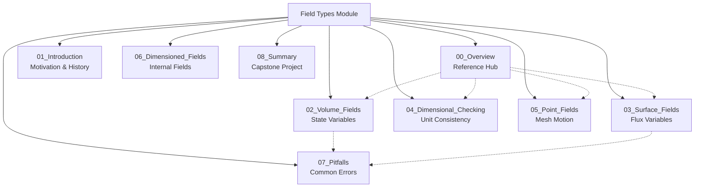

# Field Types - Overview

> **Module Information**
> - **Difficulty:** Beginner
> - **Prerequisites:** Basic C++ knowledge, understanding of OpenFOAM mesh structure
> - **Estimated Reading Time:** 15 minutes
> - **Files in this Module:** 8 (02-08)

---

## Learning Objectives

By the end of this module, you will be able to:

1. **Identify** the three fundamental field storage locations in OpenFOAM (volume, surface, point)
2. **Select** the appropriate field type for different physical quantities
3. **Understand** the template structure `GeometricField<Type, PatchField, GeoMesh>`
4. **Distinguish** between state variables (volume) and flux variables (surface)
5. **Apply** dimensional awareness when creating and using fields
6. **Avoid** common pitfalls related to field selection and interpolation

---

## Why Field Types Matter

> **💡 Critical Concept: Wrong Field Type = Wrong Physics**
>
> Choosing the incorrect field type leads to:
> - **Non-physical results** (interpolating fluxes incorrectly)
> - **Convergence problems** (mixing state and flux variables)
> - **Memory inefficiency** (storing data at unnecessary locations)
> - **Solver bugs** (operations between incompatible fields)

**Key Insight:** OpenFOAM enforces **spatial awareness** — you must know WHERE your data lives:
- **Cell centers** (volField) → State variables: pressure, velocity, temperature
- **Face centers** (surfaceField) → Flux variables: mass flux, face fluxes
- **Vertices** (pointField) → Mesh motion: displacement, nodal values

---

## Module Architecture



**Navigation Strategy:**
- **Start here** (00_Overview) for complete reference tables and quick lookup
- **Proceed to 01** for historical context and motivation (optional reading)
- **Deep dive 02-06** for specific field type mechanics
- **Consult 07** when debugging errors
- **Complete 08** for integration practice

---

## Field Type Reference

### 1. Storage Locations Comparison

| Aspect | Volume Fields (`vol*Field`) | Surface Fields (`surface*Field`) | Point Fields (`point*Field`) |
|--------|----------------------------|----------------------------------|------------------------------|
| **Data Location** | Cell centers | Face centers | Mesh vertices |
| **Physical Meaning** | State variables | Flux variables | Mesh motion/nodal values |
| **Primary Use** | Conservation equations | Transport (convection) | Dynamic mesh |
| **Examples** | `p`, `U`, `T` | `phi`, `Sf` | `displacement` |
| **Interpolation** | `fvc::interpolate()` → surface | `fvc::reconstruct()` → volume | `pointFields` ↔ `volFields` |
| **Operators** | `fvm::`, `fvc::div()` | `fvc::flux()` | `pointFields` API |
| **Memory** | Largest (NCells) | Medium (NFaces) | Smallest (NPoints) |
| **Boundary Storage** | PatchField on faces | Implicit (already on faces) | PointPatchField |

### 2. Template Structure Deep Dive

```cpp
GeometricField<Type, PatchField, GeoMesh>
```

**Template Parameters:**

| Parameter | Possible Values | Description |
|-----------|-----------------|-------------|
| **Type** | `scalar`, `vector`, `tensor`, `symmTensor` | Mathematical rank of the field |
| **PatchField** | `calculated`, `fixedValue`, `zeroGradient`, etc. | Boundary condition type |
| **GeoMesh** | `volMesh`, `surfaceMesh`, `pointMesh` | Spatial discretization |

**Common Type Aliases:**

| Full Type | Alias | Typical Usage |
|-----------|--------|---------------|
| `GeometricField<scalar, fvPatchField, volMesh>` | `volScalarField` | Pressure, temperature, turbulent quantities |
| `GeometricField<vector, fvPatchField, volMesh>` | `volVectorField` | Velocity, body forces |
| `GeometricField<tensor, fvPatchField, volMesh>` | `volTensorField` | Stress tensors, velocity gradients |
| `GeometricField<scalar, fvsPatchField, surfaceMesh>` | `surfaceScalarField` | Mass flux, face fluxes |
| `GeometricField<vector, fvsPatchField, surfaceMesh>` | `surfaceVectorField` | Face area vectors |
| `GeometricField<vector, pointPatchField, pointMesh>` | `pointVectorField` | Mesh displacement |

### 3. Physical Quantity → Field Type Mapping

| Physical Quantity | Field Type | Why? |
|-------------------|------------|------|
| **Pressure (p)** | `volScalarField` | Thermodynamic state at cell centers |
| **Velocity (U)** | `volVectorField` | Momentum state at cell centers |
| **Mass Flux (phi)** | `surfaceScalarField` | Flux THROUGH faces (U · Sf) |
| **Temperature (T)** | `volScalarField` | Thermodynamic state at cell centers |
| **Turbulent k** | `volScalarField` | State variable at cell centers |
| **Face Area (Sf)** | `surfaceVectorField` | Geometric property of faces |
| **Displacement** | `pointVectorField` | Vertex motion for dynamic mesh |
| **Vorticity** | `volVectorField` | Derived from velocity field |
| **Divergence (div U)** | `volScalarField` | Computed from surface fluxes |

---

## Quick Reference: Decision Tree

```
Need to store a field?
│
├─ Is it a flux through faces?
│  └─ YES → surfaceScalarField (e.g., phi)
│
├─ Is it mesh motion/vertex data?
│  └─ YES → pointVectorField (e.g., displacement)
│
└─ Is it a state variable?
   └─ YES → vol*Field
      ├─ Scalar? → volScalarField (p, T, k)
      ├─ Vector? → volVectorField (U, F)
      └─ Tensor? → volTensorField (stress)
```

**Common Operations Reference:**

| Operation | Input | Output | Code Example |
|-----------|-------|--------|--------------|
| Interpolate vol→surface | `volVectorField` | `surfaceVectorField` | `surfaceVectorField Uf = fvc::interpolate(U);` |
| Reconstruct surface→vol | `surfaceScalarField` | `volVectorField` | `volVectorField Ur = fvc::reconstruct(phi);` |
| Compute flux | `volVectorField` × `surfaceVectorField` | `surfaceScalarField` | `surfaceScalarField phi = fvc::flux(U);` |
| Divergence | `surfaceScalarField` | `volScalarField` | `volScalarField divU = fvc::div(phi);` |
| Gradient | `volScalarField` | `volVectorField` | `volVectorField gradp = fvc::grad(p);` |
| Laplacian | `volScalarField` | `volScalarField` | `volScalarField lapT = fvc::laplacian(T);` |

---

## Module Contents

| File | Content | Focus |
|------|---------|-------|
| **00_Overview** | **THIS FILE** | Complete reference tables, quick lookup, decision trees |
| **01_Introduction** | Motivation & History | Why OpenFOAM uses this design, historical context |
| **02_Volume_Fields** | `vol*Field` Deep Dive | State variables, fvMatrix operations, boundary conditions |
| **03_Surface_Fields** | `surface*Field` Deep Dive | Flux calculations, interpolation, reconstruction |
| **04_Dimensional_Checking** | Unit Consistency | `dimensionSet`, dimensional analysis, error prevention |
| **05_Point_Fields** | `point*Field` Deep Dive | Mesh motion, dynamic mesh solvers |
| **06_Dimensioned_Fields** | Internal Fields | `DimensionedField<>`, internal storage mechanisms |
| **07_Pitfalls** | Common Errors | Debugging guide, typical mistakes, solutions |
| **08_Summary** | Capstone Project | Integration exercises, comprehensive case study |

**Cross-Reference Strategy:**
- Each file (02-06) covers ONE field type in depth
- Files link to specific sections (e.g., "See 03_Surface_Fields.md:§4.2 for interpolation methods")
- **No duplication** — each concept lives in ONE primary location

---

## Concept Check

<details>
<summary><b>1. Why is mass flux (phi) a surfaceScalarField instead of a volScalarField?</b></summary>

**Physical Reason:** Flux represents the quantity flowing THROUGH faces (mass flow rate = velocity × area). It's inherently a face-based quantity because:
- Conservation is enforced across cell boundaries (faces)
- Finite volume method uses face fluxes for transport equations
- Interpolating cell-center velocity to faces is required anyway

**Code Consequence:** `surfaceScalarField phi` is the primary variable in convection terms:
```cpp
fvm::div(phi, T)  // Convection of temperature using surface flux
```
</details>

<details>
<summary><b>2. When should I use pointVectorField instead of volVectorField?</b></summary>

**Use pointVectorField when:**
- Implementing dynamic mesh motion (vertices move, not cells)
- Storing nodal quantities for visualization
- Working with finite element methods (FEM) in OpenFOAM
- Need data at vertices for post-processing

**Stick with volVectorField when:**
- Solving standard fluid dynamics equations
- Working with finite volume method
- Data represents cell-centered state variables
</details>

<details>
<summary><b>3. What happens if I perform operations between incompatible field types?</b></summary>

**Compilation Error:** OpenFOAM's type system prevents this at compile time:
```cpp
volScalarField p(mesh);
surfaceScalarField phi(mesh);
auto result = p + phi;  // ❌ COMPILATION ERROR
```

**Why This is Good:** It forces you to be explicit about interpolation/reconstruction:
```cpp
auto result = p + fvc::reconstruct(phi);  // ✅ Explicit operation
```

**Runtime Risk:** If you manually interpolate incorrectly, you get non-physical results.
</details>

<details>
<summary><b>4. How do I know which boundary condition type to use in the template?</b></summary>

**It's automatic based on GeoMesh:**
- `volMesh` → `fvPatchField` (finite volume boundary conditions)
- `surfaceMesh` → `fvsPatchField` (surface field boundary conditions)
- `pointMesh` → `pointPatchField` (point field boundary conditions)

You rarely specify this explicitly — the alias handles it:
```cpp
volScalarField p  // Uses fvPatchField automatically
```
</details>

---

## Key Takeaways

✓ **Spatial awareness is critical** — data location determines physical meaning
✓ **State variables = volume fields**, **flux variables = surface fields**
✓ **Template structure encodes physics**: `GeometricField<Type, PatchField, GeoMesh>`
✓ **Type system prevents bugs** — incompatible operations fail at compile time
✓ **Interpolation is explicit** — must convert between vol/surface/point
✓ **Dimensional consistency is enforced** — units checked at runtime

---

## Next Steps

1. **For beginners:** Read [01_Introduction.md](01_Introduction.md) for motivation
2. **For practitioners:** Jump to [02_Volume_Fields.md](02_Volume_Fields.md) for practical implementation
3. **For debugging:** Bookmark [07_Pitfalls.md](07_Pitfalls.md) for troubleshooting

**Recommended Learning Path:**
- **Linear:** 00 → 01 → 02 → 03 → 04 → 05 → 06 → 07 → 08
- **Fast Track:** 00 → 02 → 03 → 07 (reference others as needed)
- **Debug Focus:** 00 → 07 → specific topic file