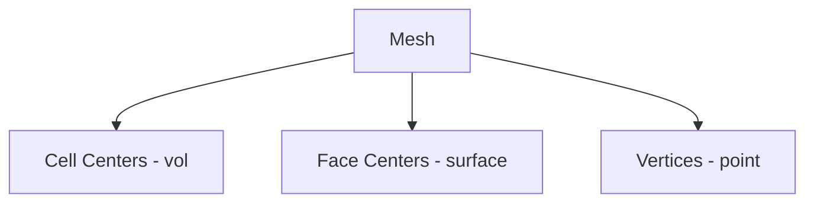

# Field Types - Introduction

บทนำ Field Types

---

## Overview

> **Field Types** = Different data locations on mesh



---

## 1. Three Main Locations

| Type | Location | Example |
|------|----------|---------|
| `vol*Field` | Cell center | p, U, T |
| `surface*Field` | Face center | phi (flux) |
| `point*Field` | Vertex | displacement |

---

## 2. Template Structure

```cpp
GeometricField<Type, PatchField, GeoMesh>
```

| Mesh Type | GeoMesh | PatchField |
|-----------|---------|------------|
| Volume | `volMesh` | `fvPatchField` |
| Surface | `surfaceMesh` | `fvsPatchField` |
| Point | `pointMesh` | `pointPatchField` |

---

## 3. Value Types

| Rank | Type | Components |
|------|------|------------|
| 0 | `scalar` | 1 |
| 1 | `vector` | 3 |
| 2 | `tensor` | 9 |
| 2 (sym) | `symmTensor` | 6 |

---

## 4. Common Field Types

### Volume Fields

```cpp
volScalarField p;   // Pressure
volVectorField U;   // Velocity
volTensorField R;   // Reynolds stress
```

### Surface Fields

```cpp
surfaceScalarField phi;  // Mass flux
surfaceVectorField Sf;   // Face area vectors
```

### Point Fields

```cpp
pointVectorField pointD;  // Point displacement
```

---

## 5. Relationship

```cpp
// Volume → Surface (interpolation)
surfaceScalarField rhof = fvc::interpolate(rho);

// Face values → Cell (averaging)
volScalarField avgT = fvc::average(Tf);
```

---

## Quick Reference

| Field | Location | Use |
|-------|----------|-----|
| `volScalarField` | Cell | p, T, k |
| `volVectorField` | Cell | U |
| `surfaceScalarField` | Face | phi |
| `pointVectorField` | Vertex | displacement |

---

## 🧠 Concept Check

<details>
<summary><b>1. vol vs surface field?</b></summary>

- **vol**: Cell-centered (state variables)
- **surface**: Face-centered (fluxes)
</details>

<details>
<summary><b>2. ทำไม flux เป็น surface field?</b></summary>

เพราะ **flux ผ่าน faces** ไม่ใช่ cells
</details>

<details>
<summary><b>3. point field ใช้เมื่อไหร่?</b></summary>

**Mesh motion** และ nodal displacement
</details>

---

## 📖 เอกสารที่เกี่ยวข้อง

- **ภาพรวม:** [00_Overview.md](00_Overview.md)
- **Volume Fields:** [02_Volume_Fields.md](02_Volume_Fields.md)
