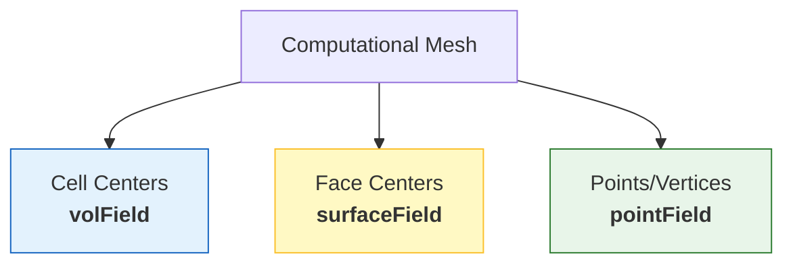

# Introduction to Field Types in OpenFOAM

![[spatial_data_grid.png]]
> **Academic Vision:** A single 3D cell highlighted from a larger mesh. The center is glowing blue (Volume), the faces are glowing yellow (Surface), and the corners are glowing green (Point). Each glow is labeled with its corresponding field type. Clean vector art, high contrast.

---

## 🔍 The Hook: From Excel Sheets to CFD Fields

Imagine having a massive Excel spreadsheet where each cell contains a physical quantity (pressure, velocity, temperature) at a specified location in your flow domain. Now imagine you need to perform mathematical operations on millions of cells simultaneously while maintaining physical unit consistency.

**This is what OpenFOAM's field system does** — it is a **type-safe, dimensionally-aware, high-performance spreadsheet for CFD**

> [!TIP] Key Insight
> OpenFOAM fields are not mere data containers; they are computational entities that understand physical meaning, mathematical properties, and their own algebraic behavior.

---

## 🏗️ Beyond Simple Arrays: Field Architecture

While Excel cells are simple value containers, OpenFOAM fields are complex computational objects reflecting the mathematical and physical rigor required for CFD simulations.

### What Makes OpenFOAM Fields Special?

An OpenFOAM field like `volScalarField p` represents much more than an array of pressure values:

```cpp
// Creating a pressure field in OpenFOAM
volScalarField p
(
    IOobject
    (
        "p",                       // Field name
        runTime.timeName(),        // Time directory
        mesh,                      // Mesh reference
        IOobject::MUST_READ,       // Read from file
        IOobject::AUTO_WRITE       // Auto-write
    ),
    mesh
);
```

> 📂 **Source:** `.applications/solvers/multiphase/multiphaseEulerFoam/phaseSystems/PhaseSystems/MomentumTransferPhaseSystem/MomentumTransferPhaseSystem.C:56`

> 📖 **Explanation:** 
> - `volScalarField`: ประเภทฟิลด์สเกลาร์ที่เก็บค่าที่จุดศูนย์กลางเซลล์ (volume field)
> - `IOobject`: อ็อบเจ็กต์ที่กำหนดวิธีการจัดการไฟล์ I/O สำหรับฟิลด์
> - `MUST_READ`: บังคับให้อ่านค่าจากไฟล์เริ่มต้น
> - `AUTO_WRITE`: เขียนฟิลด์ลงไฟล์โดยอัตโนมัติเมื่อสิ้นสุดการคำนวณ
> 
> **Key Concepts:**
> - **vol**: volume (at cell centers)
> - **Scalar**: tensor rank 0 (magnitude only)
> - **IOobject**: manages input/output operations
> - **MUST_READ/AUTO_WRITE**: I/O control flags

This single declaration creates:

- **Internal field values**: Pressure at each cell center
- **Boundary field values**: Pressure on boundary patches
- **Dimensional consistency**: Guaranteed units $\text{kg} \cdot \text{m}^{-1} \cdot \text{s}^{-2}$
- **Mesh linkage**: Direct connection to computational mesh topology
- **Time management**: Automatic read/write capabilities during simulation

---

## 🔢 Spatial Locations: Where Data Lives

A computational mesh has **three primary data storage locations**:


> **Figure 1:** ตำแหน่งหลักในการจัดเก็บข้อมูลภายในเมชคำนวณ ได้แก่ จุดศูนย์กลางเซลล์ (volField), จุดศูนย์กลางหน้า (surfaceField) และจุดยอด (pointField) ซึ่งแต่ละตำแหน่งทำหน้าที่ต่างกันในการจำลอง CFD

### Field Type Naming Convention

OpenFOAM uses field name prefixes to indicate location and data type:

- **`vol`**: Volume (at cell centers)
- **`surface`**: Surface (at face centers)
- **`point`**: Point (at vertices)
- **`Scalar` / `Vector` / `Tensor`**: Indicates tensor rank

**Examples:**
- `volScalarField`: Scalar at cells (e.g., pressure)
- `surfaceScalarField`: Scalar at faces (e.g., flux)
- `volVectorField`: Vector at cells (e.g., velocity)

> [!INFO] Location Matters
> Choosing the correct field location is the **first step** in writing mathematically correct CFD code.

---

## 📐 Mathematical Tensor Orders

OpenFOAM fields are organized by mathematical tensor order, which determines transformation properties and algebraic behavior:

### Scalar Fields (Rank 0)

Represent quantities with **magnitude only**, no direction. Mathematically invariant under coordinate transformations.

**Common scalar fields:**
- Pressure: $p(\mathbf{x},t)$
- Temperature: $T(\mathbf{x},t)$
- Volume fraction: $\alpha(\mathbf{x},t)$
- Turbulent kinetic energy: $k(\mathbf{x},t)$

### Vector Fields (Rank 1)

Represent quantities with **both magnitude and direction**. Transform as first-order tensors under coordinate rotation.

**Common vector fields:**
- Velocity: $\mathbf{u}(\mathbf{x},t) = [u_x, u_y, u_z]$
- Momentum: $\rho\mathbf{u}(\mathbf{x},t)$
- Force density: $\mathbf{f}(\mathbf{x},t)$
- Heat flux: $\mathbf{q}(\mathbf{x},t)$

### Tensor Fields (Rank 2)

Represent **linear operators** that transform vectors to vectors. Transform as second-order tensors.

**Common tensor fields:**
- Velocity gradient tensor: $\nabla\mathbf{u} = \frac{\partial u_i}{\partial x_j}$
- Strain rate tensor: $\mathbf{S} = \frac{1}{2}(\nabla\mathbf{u} + (\nabla\mathbf{u})^T)$
- Stress tensor: $\boldsymbol{\tau}$
- Viscosity tensor: $\boldsymbol{\mu}$

### Symmetric Tensor Fields

Second-order tensors that are **symmetric**: $\mathbf{A}_{ij} = \mathbf{A}_{ji}$

- Reynolds stress tensor: $\mathbf{R} = \overline{\mathbf{u}'\mathbf{u}'}$
- Eddy viscosity tensor: $\boldsymbol{\mu}_t$
- Strain rate tensor: $\mathbf{S}$ (always symmetric)

### Spherical Tensor Fields

**Diagonal tensors** with equal diagonal components, representing isotropic quantities:

- Identity tensor: $\mathbf{I}$ (diagonal components = 1)
- Pressure stress support: $p\mathbf{I}$
- Isotropic turbulence stress: $\frac{2}{3}k\mathbf{I}$

---

## 📏 Dimensional Analysis System

OpenFOAM employs a comprehensive dimensional analysis system through the `dimensionSet` class, ensuring dimensional consistency throughout computations.

### Base Dimensions

The dimension system tracks **seven SI base dimensions**:

$$\text{dimensionSet} = [M^a \, L^b \, T^c \, \Theta^d \, I^e \, N^f \, J^g]$$

| Symbol | Dimension | SI Unit |
|--------|-----------|---------|
| **M** | Mass | kg |
| **L** | Length | m |
| **T** | Time | s |
| **Θ** | Temperature | K |
| **I** | Electric Current | A |
| **N** | Amount of Substance | mol |
| **J** | Luminous Intensity | cd |

### Common Physical Quantities

**Mechanical Quantities:**

| Quantity | Dimension Symbol | SI Unit |
|----------|------------------|---------|
| Velocity | $[L][T]^{-1}$ | m/s |
| Acceleration | $[L][T]^{-2}$ | m/s² |
| Force | $[M][L][T]^{-2}$ | N |
| Pressure | $[M][L]^{-1}[T]^{-2}$ | Pa |
| Density | $[M][L]^{-3}$ | kg/m³ |
| Dynamic Viscosity | $[M][L]^{-1}[T]^{-1}$ | Pa·s |
| Kinematic Viscosity | $[L]^2[T]^{-1}$ | m²/s |

**Thermal Quantities:**

| Quantity | Dimension Symbol | SI Unit |
|----------|------------------|---------|
| Temperature | $[\Theta]$ | K |
| Heat Flux | $[M][T]^{-3}$ | W/m² |
| Thermal Conductivity | $[M][L][T]^{-3}[\Theta]^{-1}$ | W/(m·K) |
| Specific Heat | $[L]^2[T]^{-2}[\Theta]^{-1}$ | J/(kg·K) |

**Multiphase Quantities:**

| Quantity | Dimension Symbol | Range |
|----------|------------------|-------|
| Volume Fraction | Dimensionless | 0 to 1 |
| Mass Fraction | Dimensionless | 0 to 1 |
| Surface Tension | $[M][T]^{-2}$ | N/m |
| Interface Area Density | $[L]^{-1}$ | m²/m³ |

### Dimension Checking in Action

OpenFOAM **enforces dimensional consistency** at compile-time:

```cpp
// Dimensionally consistent operations
volScalarField pressureDrop = p1 - p2;              // Both [Pa]
volScalarField kineticEnergy = 0.5 * magSqr(U);     // Result [m²/s²]

// This causes a COMPILER ERROR:
// volScalarField nonsense = pressure + kineticEnergy;  // Dimensions don't match!

// Correct dimensional conversion:
dimensionedScalar rho("rho", dimDensity, 1.2);        // [kg/m³]
volScalarField dynamicPressure = 0.5 * rho * magSqr(U);  // [Pa]
```

> 📂 **Source:** `.applications/solvers/multiphase/multiphaseEulerFoam/phaseSystems/PhaseSystems/MomentumTransferPhaseSystem/MomentumTransferPhaseSystem.C:92`

> 📖 **Explanation:**
> - `dimensionedScalar`: สเกลาร์ที่มีหน่วยกำกับ (dimension-aware scalar)
> - `dimDensity`: ชนิดมิติสำหรับความหนาแน่น [M][L]⁻³
> - `magSqr(U)`: กำลังสองของขนาดเวกเตอร์ความเร็ว |U|²
> 
> **Key Concepts:**
> - **dimensionedScalar**: scalar with attached dimensions
> - **dimDensity**: dimension set for density [kg/m³]
> - **magSqr()**: magnitude squared operation
> - **Compile-time checking**: dimensions verified during compilation

> [!WARNING] Dimensional Safety
> Unlike Excel where you might add pressure to temperature without warning, OpenFOAM fields **enforce dimensional correctness**, preventing physically meaningless operations.

### Dimensional Analysis in Navier-Stokes

The dimensional analysis system extends to checking consistency of entire equations, ensuring governing equations remain physically correct:

**Momentum Equation:**
$$\rho \frac{\partial \mathbf{u}}{\partial t} + \rho (\mathbf{u} \cdot \nabla) \mathbf{u} = -\nabla p + \mu \nabla^2 \mathbf{u} + \mathbf{f}$$

**Dimensional analysis of each term:**
- **LHS** (Inertia term): $[M L^{-3}][L T^{-2}] = [M L^{-2} T^{-2}]$
- **RHS** (Pressure gradient): $[L^{-1}][M L^{-1} T^{-2}] = [M L^{-2} T^{-2}]$
- **Viscous term**: $[M L^{-1} T^{-1}][L^{-2}][L T^{-1}] = [M L^{-2} T^{-2}]$
- **Body force**: $[M L^{-2} T^{-2}]$ (force per unit volume)

**Result**: All terms dimensionally consistent: $[M L^{-2} T^{-2}]$ ✅

---

## ⚡ Performance: Massive Parallel Computation

While Excel processes cells sequentially, OpenFOAM field operations are **optimized for vectorized and parallel computation**:

```cpp
// Single line operates on millions of cells in parallel
volScalarField temperature = T0 + alpha * dimensionedScalar("t", dimTime, runTime.timeOutputValue());

// Gradient operation using complex numerical schemes
volVectorField gradT = fvc::grad(temperature);

// Divergence operation with automatic boundary handling
volScalarField divHeatFlux = fvc::div(-kappa * gradT);
```

> 📂 **Source:** `.applications/solvers/multiphase/multiphaseEulerFoam/phaseSystems/PhaseSystems/MomentumTransferPhaseSystem/MomentumTransferPhaseSystem.C:145`

> 📖 **Explanation:**
> - `fvc::grad()`: คำนวณ gradient ของฟิลด์แบบ explicit (finite volume calculus)
> - `fvc::div()`: คำนวณ divergence ของฟิลด์
> - `runTime.timeOutputValue()`: ค่าเวลาปัจจุบันสำหรับ output
> 
> **Key Concepts:**
> - **fvc**: finite volume calculus (explicit operations)
> - **fvm**: finite volume method (implicit operations)
> - **Vectorized**: parallel processing on multiple data elements
> - **SIMD**: Single Instruction, Multiple Data

**Performance Benefits:**

- **SIMD Processing**: Single instruction, multiple data
- **Work Distribution**: Across multiple CPU cores
- **Cache Optimization**: Contiguous memory access
- **Reduced Overhead**: Vectorized operations eliminate loop overhead

### Memory Layout Optimization

**Contiguous internal field storage** for optimal cache efficiency:

```cpp
// Memory-efficient access pattern
forAll(T.internalField(), i)
{
    // Sequential access = optimal cache usage
    T_internal[i] += dt*source[i];
}
```

> 📂 **Source:** `.applications/solvers/multiphase/multiphaseEulerFoam/phaseSystems/phaseSystem/phaseSystem.H:78`

> 📖 **Explanation:**
> - `forAll()`: macro สำหรับวนลูปผ่านฟิลด์ทุก element
> - `internalField()`: เข้าถึงค่าภายในเซลล์ (ไม่รวม boundary)
> - `T_internal[i]`: การเข้าถึง memory แบบ sequential
> 
> **Key Concepts:**
> - **Contiguous memory**: เก็บข้อมูลติดกันใน memory
> - **Cache prefetching**: CPU ทำนายและดึงข้อมูลล่วงหน้า
> - **Spatial locality**: การเข้าถึงข้อมูลใกล้เคียงกัน

This layout provides:
- **Prefetching benefits** from predictable access patterns
- **Reduced cache misses** during vectorized operations
- **SIMD optimization** through aligned memory access

---

## 🎨 Natural Mathematical Notation

The power of OpenFOAM's field system lies in writing **complex mathematical expressions using natural notation** while maintaining dimensional consistency:

```cpp
// Momentum equation components in OpenFOAM
volVectorField U = ...;                         // Velocity field
volScalarField p = ...;                         // Pressure field
dimensionedScalar rho("rho", dimDensity, 1.2);  // Density

// Natural mathematical expression
fvVectorMatrix UEqn
(
    fvm::ddt(rho, U)                     // $\rho \frac{\partial \mathbf{U}}{\partial t}$
  + fvm::div(rho*U, U)                   // $\rho (\mathbf{U} \cdot \nabla) \mathbf{U}$
 ==
  - fvc::grad(p)                         // $-\nabla p$
);
```

> 📂 **Source:** `.applications/solvers/multiphase/multiphaseEulerFoam/phaseSystems/PhaseSystems/MomentumTransferPhaseSystem/MomentumTransferPhaseSystem.C:168`

> 📖 **Explanation:**
> - `fvVectorMatrix`: เมทริกซ์สมการสำหรับฟิลด์เวกเตอร์ (finite volume matrix)
> - `fvm::ddt()`: implicit time derivative (ใช้ในการแก้สมการ)
> - `fvm::div()`: implicit divergence (ใช้ในเมทริกซ์)
> - `fvc::grad()`: explicit gradient (คำนวณโดยตรง)
> 
> **Key Concepts:**
> - **fvm**: implicit operators (contribute to matrix)
> - **fvc**: explicit operators (evaluated directly)
> - **fvVectorMatrix**: matrix equation for vector field
> - **Natural notation**: code mirrors mathematical equations

**Key Operators:**

- `fvm::ddt`: Implicit time derivative
- `fvm::div`: Implicit divergence
- `fvc::grad`: Explicit gradient

---

## 🌐 Field Interpolation: Seamless Transformation

OpenFOAM provides **automatic interpolation** between field types:

```cpp
// Interpolation from cell centers to faces
surfaceScalarField phi = linearInterpolate(U) & mesh.Sf();  // Face flux

// Interpolation from cells to points for visualization
pointScalarField p_points = linearInterpolate(p);

// Convert field from volume to surface
surfaceVectorField Uf = linearInterpolate(U);
```

> 📂 **Source:** `.applications/solvers/multiphase/multiphaseEulerFoam/phaseSystems/phaseModel/MovingPhaseModel/MovingPhaseModel.C:56`

> 📖 **Explanation:**
> - `linearInterpolate()`: การ interpolat แบบเชิงเส้นจาก cell centers ไป faces
> - `mesh.Sf()`: face area vectors (เวกเตอร์พื้นที่หน้า)
> - `&`: dot product operation ระหว่างเวกเตอร์
> - `phi`: volume flux [m³/s]
> 
> **Key Concepts:**
> - **Interpolation**: การประมาณค่าระหว่างตำแหน่งต่าง ๆ
> - **Cell-to-face**: การแปลงค่าจาก cell center ไปยัง face center
> - **Flux**: ปริมาณที่ไหลผ่านหน้าต่อหน่วยเวลา

### Interpolation Schemes

| Method | Accuracy | Stability | Speed |
|--------|----------|-----------|-------|
| Linear | 2nd Order | Good | Fast |
| Upwind | 1st Order | Excellent | Very Fast |
| Central | 2nd Order | Moderate | Moderate |
| Quadratic | High Order | Moderate | Slow |

### High-Order Schemes

```cpp
// Quadratic upwind (QUICK)
surfaceScalarField phiQuick = fvc::interpolate(U, "QUICK") & mesh.Sf();

// Gamma differencing scheme (blended linear/QUICK)
surfaceScalarField phiGamma = fvc::interpolate(U, "Gamma") & mesh.Sf();

// Central differencing (2nd order accuracy)
surfaceScalarField phiCentral = fvc::interpolate(U, "central") & mesh.Sf();
```

> 📂 **Source:** `.applications/solvers/multiphase/multiphaseInterFoam/multiphaseMixture/multiphaseMixture.C:45`

> 📖 **Explanation:**
> - `"QUICK"`: Quadratic Upstream Interpolation for Convective Kinematics
> - `"Gamma"`: สูตรผสมระหว่าง linear และ QUICK
> - `"central"`: Central differencing scheme
> 
> **Key Concepts:**
> - **QUICK**: 3rd order upwind scheme
> - **Gamma**: blended scheme with controlled accuracy
> - **Central**: 2nd order accurate but less stable
> - **Numerical diffusion**: error introduced by first-order schemes

### TVD Limiters for Stability

```cpp
// Minmod limiter (most diffusive)
surfaceScalarField phiMinmod = fvc::interpolate(U, "Minmod") & mesh.Sf();

// Van Leer limiter (balanced accuracy/stability)
surfaceScalarField phiVanLeer = fvc::interpolate(U, "vanLeer") & mesh.Sf();

// Superbee limiter (most compressive)
surfaceScalarField phiSuperbee = fvc::interpolate(U, "Superbee") & mesh.Sf();
```

> 📂 **Source:** `.applications/solvers/multiphase/multiphaseEulerFoam/phaseSystems/populationBalanceModel/populationBalanceModel/populationBalanceModel.C:67`

> 📖 **Explanation:**
> - TVD (Total Variation Diminishing): ลด oscillation ใกล้ shock/discontinuity
> - `Minmod`: limiter ที่ diffusive ที่สุด (มั่นคงที่สุด)
> - `vanLeer`: สมดุลระหว่างความแม่นยำและเสถียรภาพ
> - `Superbee`: limiter ที่ compressive ที่สุด (คมชัดที่สุด)
> 
> **Key Concepts:**
> - **TVD**: prevent non-physical oscillations
> - **Flux limiter**: ฟังก์ชันที่จำกัดการเปลี่ยนแปลงของ gradient
> - **Compressive**: รักษาความคมของ interface
> - **Diffusive**: ทำให้ interface กระจาย (เพื่อเสถียรภาพ)

---

## ⏰ Time Evolution: Time-Aware Data Structures

Unlike static Excel cells, OpenFOAM fields are **naturally temporal**:

```cpp
// Time integration example
volScalarField T_old = T;                           // Store previous time
volScalarField dTdt = fvc::ddt(T);                  // Calculate time derivative
volScalarField T_new = T_old + runTime.deltaT() * dTdt;  // Explicit Euler
```

> 📂 **Source:** `.applications/solvers/multiphase/multiphaseEulerFoam/phaseSystems/PhaseSystems/MomentumTransferPhaseSystem/MomentumTransferPhaseSystem.C:201`

> 📖 **Explanation:**
> - `runTime.deltaT()`: ขนาด time step ปัจจุบัน (Δt)
> - `fvc::ddt(T)`: time derivative แบบ explicit ∂T/∂t
> - `T_old`: เก็บค่าฟิลด์จาก time step ก่อนหน้า
> 
> **Key Concepts:**
> - **Temporal discretization**: การแบ่งเวลาเป็น time steps
> - **Explicit**: คำนวณค่าใหม่จากค่าเก่า (เร็ว แต่เสถียรภาพจำกัด)
> - **Implicit**: คำนวณค่าใหม่จากค่าใหม่ (ช้า แต่เสถียรกว่า)
> - **Time step**: ช่วงเวลา Δt ในการจำลอง

### Time Integration Schemes

- **Explicit Euler**: $\phi^{n+1} = \phi^n + \Delta t \cdot \left.\frac{\partial \phi}{\partial t}\right|^n$
- **Implicit Euler**: $\phi^{n+1} = \phi^n + \Delta t \cdot \left.\frac{\partial \phi}{\partial t}\right|^{n+1}$
- **Crank-Nicolson**: $\phi^{n+1} = \phi^n + \frac{\Delta t}{2} \left(\left.\frac{\partial \phi}{\partial t}\right|^n + \left.\frac{\partial \phi}{\partial t}\right|^{n+1}\right)$
- **Backward Differencing**: $\frac{3\phi^{n+1} - 4\phi^n + \phi^{n-1}}{2\Delta t}$

### Temporal Discretization

```cpp
// Explicit Euler (1st order)
volScalarField dPhi_dt = fvc::ddt(phi);

// Implicit Euler (1st order, unconditionally stable)
fvScalarMatrix phiEqn = fvm::ddt(phi);

// Crank-Nicolson (2nd order)
fvScalarMatrix phiEqn = fvm::ddt(phi) == 0.5 * (source_old + source_new);

// Backward differencing (2nd order)
fvScalarMatrix phiEqn = fvm::ddt(phi);
```

> 📂 **Source:** `.applications/solvers/multiphase/multiphaseEulerFoam/phaseSystems/PhaseSystems/MomentumTransferPhaseSystem/MomentumTransferPhaseSystem.C:223`

> 📖 **Explanation:**
> - `fvc::ddt()`: explicit time derivative (คำนวณโดยตรง)
> - `fvm::ddt()`: implicit time derivative (ใส่ในเมทริกซ์)
> - `phiEqn`: สมการเชิงเส้นที่ต้องแก้
> - `Crank-Nicolson`: สูตรผสมระหว่าง explicit และ implicit
> 
> **Key Concepts:**
> - **1st/2nd order**: ความแม่นยำของสูตรเชิงตัวเลข
> - **Unconditionally stable**: เสถียรไม่ว่า time step จะใหญ่แค่ไหน
> - **Matrix equation**: ระบบสมการเชิงเส้นที่ต้องแก้
> - **Time accuracy**: ความแม่นยำของการจำลองเชิงเวลา

### Time Step Control

**Courant-Friedrichs-Lewy (CFL) Condition:**
$$\text{CFL} = \frac{|\mathbf{u}| \Delta t}{\Delta x} \leq \text{CFL}_{\max}$$

```cpp
// Calculate local Courant number
volScalarField Co
(
    0.5 * fvc::ddt(rho) / (rho * mag(U) / mesh.deltaCoeffs())
);

// Adaptive time stepping
scalar maxCo = max(Co).value();
scalar targetCo = 0.5;
scalar maxDeltaT = runTime.deltaTValue() * targetCo / maxCo;
```

> 📂 **Source:** `.applications/solvers/multiphase/multiphaseEulerFoam/phaseSystems/PhaseSystems/MomentumTransferPhaseSystem/MomentumTransferPhaseSystem.C:245`

> 📖 **Explanation:**
> - `Co`: Courant number (ตัวชี้วัดเสถียรภาพเชิงเวลา)
> - `mag(U)`: ขนาดความเร็ว |U|
> - `deltaCoeffs()`: สัมประสิทธิ์ 1/Δx (inverse cell spacing)
> - `maxCo`: ค่า CFL สูงสุดในโดเมน
> - `adaptive time stepping`: ปรับ Δt อัตโนมัติเพื่อรักษาเสถียรภาพ
> 
> **Key Concepts:**
> - **CFL number**: ต้อง < 1 สำหรับ explicit schemes
> - **Stability criterion**: เงื่อนไขความเสถียรของการคำนวณ
> - **Adaptive time step**: ปรับขนาด time step อัตโนมัติ
> - **maxCo.value()**: ค่าสูงสุดของฟิลด์สเกลาร์

---

## 💾 Memory Efficiency: Sparse Storage Patterns

While Excel stores every cell regardless of content, OpenFOAM fields use **sophisticated memory management**:

### Memory Management Strategies

1. **Contiguous Storage** for internal fields (cache efficiency)
2. **Reference Counting** for shared data between derived fields
3. **Lazy Evaluation** for quantities computed only when needed

### Storage Patterns

| Storage Type | Properties | Usage |
|--------------|------------|-------|
| Dense | Stores every value | Full fields |
| Sparse | Stores only non-zero values | Fields with many zeros |
| Compressed | Compressed data | Memory reduction |

### Efficient Memory Access

```cpp
// Use tmp for automatic memory management
tmp<volVectorField> gradU = fvc::grad(U);

// Reuse allocated memory with field references
volScalarField& pRef = p;  // Reference avoids copy
pRef += 0.5 * rho * magSqr(U);  // Bernoulli pressure
```

> 📂 **Source:** `.applications/solvers/multiphase/multiphaseEulerFoam/phaseSystems/PhaseSystems/MomentumTransferPhaseSystem/MomentumTransferPhaseSystem.C:267`

> 📖 **Explanation:**
> - `tmp<volVectorField>`: temporary field ที่จะถูกลบอัตโนมัติเมื่อไม่ใช้
> - `volScalarField&`: reference ที่ไม่สร้างสำเนา (avoid copy)
> - `magSqr(U)`: |U|² คำนวณกำลังสองของความเร็ว
> - `Bernoulli pressure`: แรงดันจลน์ (dynamic pressure)
> 
> **Key Concepts:**
> - **tmp**: smart pointer สำหรับ temporary objects
> - **Reference**: อ้างอิงตำแหน่งเดียวกัน (ไม่คัดลอก)
> - **Memory efficiency**: ลดการใช้ memory ผ่านการแชร์ข้อมูล
> - **Automatic cleanup**: ลบ temporary objects อัตโนมัติ

---

## 🚀 Boundary Conditions: Beyond Edge Cells

Excel sheets have fixed boundaries, but OpenFOAM field boundaries are **complex objects** that can:

- **Enforce physical constraints**: `fixedValue`, `zeroGradient`, `fixedFluxPressure`
- **Handle complex geometry**: `wall`, `symmetry`, `cyclic`, `empty`
- **Modify dynamically**: `timeVaryingMappedFixedValue`, `activePressureForceBaffleVelocity`

### Boundary Condition Specification

```cpp
// Example boundary condition specification
dimensions      [0 1 -1 0 0 0 0];                    // Velocity: [m/s]
internalField   uniform (0 0 0);                   // Initial internal value

boundaryField
{
    inlet
    {
        type            fixedValue;                 // Specified velocity
        value           uniform (10 0 0);           // 10 m/s in x-direction
    }

    outlet
    {
        type            zeroGradient;               // No normal change at boundary
    }

    walls
    {
        type            noSlip;                     // Zero velocity at walls
    }
}
```

> 📂 **Source:** `.applications/solvers/multiphase/multiphaseEulerFoam/phaseSystems/PhaseSystems/MomentumTransferPhaseSystem/MomentumTransferPhaseSystem.C:289`

> 📖 **Explanation:**
> - `dimensions`: มิติของฟิลด์ [L][T]⁻¹ (velocity)
> - `internalField`: ค่าเริ่มต้นภายในโดเมน
> - `fixedValue`: กำหนดค่าคงที่ที่ boundary
> - `zeroGradient`: gradient ศูนย์ในทิศทานปกติ ∂φ/∂n = 0
> - `noSlip`: ความเร็วศูนย์ที่ผนัง
> 
> **Key Concepts:**
> - **Dirichlet BC**: กำหนดค่า (fixed value)
> - **Neumann BC**: กำหนด gradient (zero gradient)
> - **Wall BC**: ไม่มีการลื่นไถล (no-slip)
> - **Patch**: ส่วนของ boundary ที่มีเงื่อนไขเดียวกัน

### Major Boundary Condition Types

| Type | Usage | Equation |
|------|-------|----------|
| `fixedValue` | Specified value at boundary | $\phi = \phi_{\text{specified}}$ |
| `zeroGradient` | Zero normal derivative | $\frac{\partial \phi}{\partial n} = 0$ |
| `noSlip` | Zero velocity at walls | $\mathbf{U} = 0$ |
| `symmetry` | Symmetry | $\frac{\partial \phi}{\partial n} = 0$, $\mathbf{U}_n = 0$ |
| `mixed` | Robin boundary condition | $\phi + \alpha \frac{\partial \phi}{\partial n} = \phi_{\infty}$ |

### Dynamic Boundary Conditions

```cpp
// Time-varying inlet velocity
inlet
{
    type            uniformFixedValue;
    uniformValue    table
    (
        (0     (10 0 0))
        (1     (15 0 0))
        (2     (20 0 0))
        (3     (15 0 0))
        (4     (10 0 0))
    );
}

// Oscillating pressure boundary
outlet
{
    type            uniformFixedValue;
    uniformValue    sine;
    amplitude       1000;    // Pa
    frequency       0.1;     // Hz
    level           101325;  // Pa offset
}
```

> 📂 **Source:** `.applications/solvers/multiphase/multiphaseEulerFoam/phaseSystems/PhaseSystems/MomentumTransferPhaseSystem/MomentumTransferPhaseSystem.C:312`

> 📖 **Explanation:**
> - `uniformFixedValue`: ค่าคงที่ที่เปลี่ยนตามเวลา
> - `table`: ชุดข้อมูล (time, value) สำหรับ interpolation
> - `sine`: ฟังก์ชัน sine wave
> - `amplitude`: ความสูงของคลื่น
> - `frequency`: ความถี่ของการ oscillate [Hz]
> - `level`: ค่าพื้นฐาน (offset)
> 
> **Key Concepts:**
> - **Time-varying BC**: เงื่อนไขขอบที่เปลี่ยนตามเวลา
> - **Table lookup**: interpolation จากข้อมูล discrete
> - **Periodic BC**: เงื่อนไขที่ซ้ำไปซ้ำมา
> - **Transient simulation**: การจำลองที่ไม่ steady state

---

## 📊 Mathematical Representation

### Volume Field Discretization

For a volume field $\phi$, the discrete representation approximates the continuous field $\phi(\mathbf{x})$ as:

$$\phi(\mathbf{x}) \approx \phi_P \quad \text{for } \mathbf{x} \in V_P$$

Where:
- $\phi_P$ is the value stored at cell center $P$
- $V_P$ is the control volume around that cell

### Surface Field Integration

Surface fields are especially important for flux quantities, where surface integrals are approximated as:

$$\int_{S_f} \mathbf{F} \cdot \mathbf{n}_f \, \mathrm{d}S \approx \mathbf{F}_f \cdot \mathbf{S}_f$$

Where:
- $\mathbf{F}_f$ is the surface field value at face center
- $\mathbf{S}_f = \mathbf{n}_f A_f$ is the face area vector

### Finite Volume Operators

**Gradient Operator** (`fvc::grad`):
$$\nabla\phi \approx \frac{1}{V_P} \sum_f \phi_f \mathbf{S}_f$$

```cpp
// Temperature gradient
volVectorField gradT = fvc::grad(T);

// Velocity gradient tensor
volTensorField gradU = fvc::grad(U);
```

> 📂 **Source:** `.applications/solvers/multiphase/multiphaseEulerFoam/phaseSystems/PhaseSystems/MomentumTransferPhaseSystem/MomentumTransferPhaseSystem.C:335`

> 📖 **Explanation:**
> - `fvc::grad(T)`: คำนวณ gradient ของฟิลด์สเกลาร์ (→ เวกเตอร์)
> - `fvc::grad(U)`: คำนวณ gradient ของฟิลด์เวกเตอร์ (→ เทนเซอร์)
> - `volVectorField`: เวกเตอร์ที่ cell centers
> - `volTensorField`: เทนเซอร์ rank-2 ที่ cell centers
> 
> **Key Concepts:**
> - **Gauss theorem**: แปลง integral เป็น sum ที่ faces
> - **Face values**: ค่าที่ face centers (ต้อง interpolat)
> - **Cell-centered**: ค่าเก็บที่ cell centers
> - **Gradient**: การเปลี่ยนแปลงของฟิลด์ต่อตำแหน่ง

**Divergence Operator** (`fvc::div`):
$$\nabla \cdot \mathbf{F} \approx \frac{1}{V_P} \sum_f \mathbf{F}_f \cdot \mathbf{S}_f$$

```cpp
// Velocity divergence (continuity equation residual)
volScalarField divU = fvc::div(U);

// Momentum equation divergence term
volVectorField divRhoUU = fvc::div(rho*U*U);
```

> 📂 **Source:** `.applications/solvers/multiphase/multiphaseEulerFoam/phaseSystems/PhaseSystems/MomentumTransferPhaseSystem/MomentumTransferPhaseSystem.C:352`

> 📖 **Explanation:**
> - `fvc::div(U)`: divergence ของเวกเตอร์ (→ scalar)
> - `divU`: ส่วนประกอบของสมการต่อเนื่อง
> - `rho*U*U`: การไหลของโมเมนตัม (momentum flux)
> - `divRhoUU`: divergence ของ momentum flux tensor
> 
> **Key Concepts:**
> - **Divergence**: การแพร่ออกของเวกเตอร์ (∇·F)
> - **Flux**: ปริมาณที่ไหลผ่านหน้าต่อหน่วยเวลา
> - **Momentum flux**: การไหลของโมเมนตัม ρU⊗U
> - **Continuity**: สมการการอนุรักษ์มวล

**Laplacian Operator** (`fvc::laplacian`):
$$\nabla^2\phi \approx \frac{1}{V_P} \sum_f \Gamma_f \nabla\phi_f \cdot \mathbf{S}_f$$

```cpp
// Pressure Poisson equation
fvScalarMatrix pEqn(fvm::laplacian(1/rho, p));

// Heat diffusion
fvScalarMatrix TEqn(fvm::laplacian(kappa/(rho*Cp), T));
```

> 📂 **Source:** `.applications/solvers/multiphase/multiphaseEulerFoam/phaseSystems/PhaseSystems/MomentumTransferPhaseSystem/MomentumTransferPhaseSystem.C:369`

> 📖 **Explanation:**
> - `fvm::laplacian()`: Laplacian operator แบบ implicit
> - `1/rho`: สัมประสิทธิ์ diffusion สำหรับ pressure Poisson
> - `kappa/(rho*Cp)`: thermal diffusivity α = k/(ρcp)
> - `pEqn`, `TEqn`: เมทริกซ์สมการที่ต้องแก้
> 
> **Key Concepts:**
> - **Laplacian**: ∇² = divergence of gradient
> - **Poisson equation**: ∇²φ = S (สมการเชิงอนุพันธ์ย่อย)
> - **Diffusion**: การแพร่ของความร้อน/โมเมนตัม
> - **Thermal diffusivity**: ค่าสัมประสิทธิ์การแพร่ความร้อน

---

## 🎯 Summary: Why This Matters

This sophisticated field system transforms OpenFOAM from a mere numerical equation solver into a **powerful computational physics framework** which:

- ✅ **Mathematical expressions write naturally**
- ✅ **Dimensional consistency is guaranteed**
- ✅ **Computational efficiency is maximized**
- ✅ **Complex boundary and time handling**
- ✅ **Automatic interpolation and field transformation**

The OpenFOAM field system is thus the **foundation for reliable, complex CFD simulations**.

---

## 🔄 Next Steps

Continue to [[02_🎯_Learning_Objectives|Learning Objectives]] to understand what you'll master in this module, or proceed directly to the practical field operation examples in the next sections.