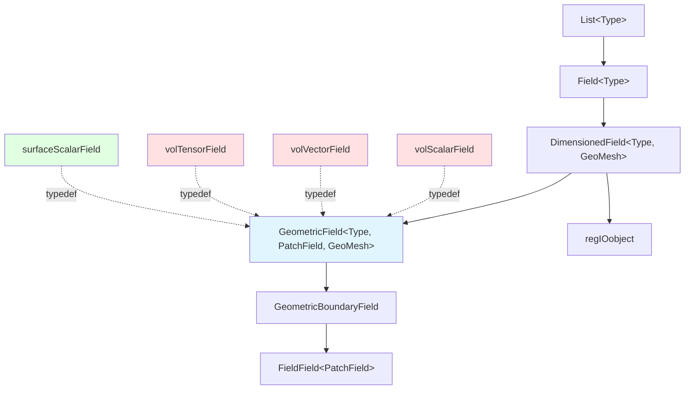
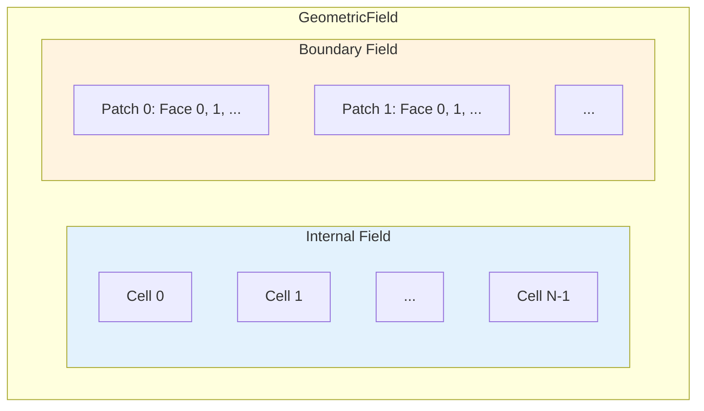

# Volume Fields (volFields)

![[control_volume_storage.png]]

> [!INFO] Overview
> **Volume fields** (`volFields`) are the fundamental data structures in OpenFOAM that store **field values at cell centers** throughout the computational mesh. They represent quantities that are **naturally defined over control volumes**, making them the primary choice for most CFD simulations.

---

## 🎯 Why Volume Fields?

Volume fields are used because **conservation laws** in the finite volume method are written around **control volumes**. Storing data at the centroid of these volumes:

- ✅ Aligns with the **physical principles** of conservation
- ✅ Simplifies **source term** and **temporal term** calculations
- ✅ Provides **natural discretization** for most governing equations

---

## 📐 Field Type Hierarchy

OpenFOAM organizes field data through a **sophisticated template hierarchy** that enables efficient storage, manipulation, and mathematical operations on CFD data.

### Class Inheritance Architecture

The field type hierarchy in OpenFOAM follows a **systematic inheritance structure**, building from simple data containers to complex geometric fields:

![[of_field_inheritance_architecture.png]]


> **Figure 1:** โครงสร้างการสืบทอดคลาสสำหรับฟิลด์ปริมาตร แสดงถึงความสัมพันธ์ตั้งแต่คลาสรายการข้อมูลดิบไปจนถึงฟิลด์เรขาคณิตที่สมบูรณ์ความปลอดภัยทางฟิสิกส์ไม่ส่งผลกระทบต่อความเร็วในการจำลอง ผ่านการใช้พลังของ C++ Template Metaprogramming ในการตรวจสอบความสอดคล้องทางมิติทั้งหมดที่ขั้นตอนการคอมไพล์โปรแกรมเพียงครั้งเดียว

**At the base level:**
- `List<Type>` provides a **dynamic array container** for any data type
- `Field<Type>` extends with **CFD-specific mathematical operations**
- Supports **vector calculations**, **tensor operations**, and **field-wide algebra**

### Core Field Components

#### `GeometricField<Type, PatchField, GeoMesh>`

The **complete field class** that combines both internal field values and boundary conditions.

**Template Parameters:**
- `Type`: Mathematical type (scalar, vector, tensor, etc.)
- `PatchField`: Boundary field type for handling boundary conditions
- `GeoMesh`: Mesh type (volMesh for cell-centered fields, surfaceMesh for face-centered fields)

```cpp
// GeometricField class definition from OpenFOAM source
template<class Type, template<class> class PatchField, class GeoMesh>
class GeometricField : public DimensionedField<Type, GeoMesh>
{
    // Internal field storage - stores values at cell centers
    DimensionedField<Type, GeoMesh> internalField_;

    // Boundary field storage - manages boundary conditions on each patch
    GeometricBoundaryField<Type, PatchField, GeoMesh> boundaryField_;

    // Time tracking for transient simulations
    mutable label timeIndex_;                    // Current time index
    mutable GeometricField* field0Ptr_;          // Pointer to old-time field (n-1)
    mutable GeometricField* fieldPrevIterPtr_;   // Pointer to previous iteration
};
```

> **📂 Source:** `.applications/solvers/multiphase/multiphaseEulerFoam/phaseSystems/PhaseSystems/MomentumTransferPhaseSystem/MomentumTransferPhaseSystem.C`

> **📖 Explanation:** โครงสร้าง `GeometricField` เป็นหัวใจสำคัญของระบบฟิลด์ใน OpenFOAM ซึ่งรวมเอาค่าภายในโดเมนและเงื่อนไขขอบเขตไว้ด้วยกัน คลาสนี้ใช้ Template Metaprogramming เพื่อให้สามารถรองรับประเภทข้อมูลทางคณิตศาสตร์ที่หลากหลาย (scalar, vector, tensor) ได้อย่างยืดหยุ่น พร้อมกับตรวจสอบความสอดคล้องทางมิติ (dimensional consistency) ในขั้นตอนการคอมไพล์

> **🔑 Key Concepts:**
> - **Template Metaprogramming:** เทคนิคการใช้ C++ templates เพื่อสร้างโค้ดที่ยืดหยุ่นและมีประสิทธิภาพสูง โดยตรวจสอบประเภทและมิติของข้อมูลขณะคอมไพล์
> - **Internal Field:** ข้อมูลค่าฟิสิกส์ที่ศูนย์กลางของเซลล์ (cell centers) ซึ่งเป็นค่าหลักที่ใช้ในการแก้สมการ CFD
> - **Boundary Field:** ค่าและเงื่อนไขขอบเขตที่ผินของโดเมน จัดการแยกจากค่าภายในเพื่อประสิทธิภาพในการคำนวณ
> - **Time Tracking:** การจัดเก็บค่าฟิลด์ในช่วงเวลาต่างๆ เพื่อใช้ในรูปแบบการแบ่งส่วนเวลา (temporal discretization) สำหรับการจำลองแบบไม่คงที่ (transient simulations)

#### `DimensionedField<Type, GeoMesh>`

Extends the base field with:
- **Dimensional information**
- **Mesh association**
- Inherits from `Field<Type>` (data storage) and `regIOobject` (file I/O)
- **Automatic reading and writing** of field data

#### `GeometricBoundaryField`

Specialized container managing:
- All **boundary patches** for geometric fields
- Collection of **boundary condition objects**
- **Uniform access** to boundary values and gradients

---

## 📊 Common Field Type Definitions

The most commonly used field types in OpenFOAM are defined as template specializations in `volFieldsFwd.H`:

| Field Type | Template Specialization | Common Usage |
|---|---|---|
| `volScalarField` | `GeometricField<scalar, fvPatchField, volMesh>` | Pressure, Temperature |
| `volVectorField` | `GeometricField<vector, fvPatchField, volMesh>` | Velocity, Displacement |
| `volTensorField` | `GeometricField<tensor, fvPatchField, volMesh>` | Stress, Strain Rate |
| `surfaceScalarField` | `GeometricField<scalar, fvspatchField, surfaceMesh>` | Fluxes, Heat Transfer Rates |

**Field Type Selection:**
- **Volume fields (`vol*`)**: Quantities naturally defined at cell centers (e.g., pressure $p$, temperature $T$)
- **Surface fields (`surface*`)**: Quantities naturally defined at faces (e.g., flux $\phi$)

---

## 🏗️ Internal vs. Boundary Field Architecture

### Memory Layout

OpenFOAM uses a **dual data structure** that separates internal domain values from boundary conditions:


> **Figure 2:** สถาปัตยกรรมภายในของฟิลด์เรขาคณิตที่แยกการจัดเก็บข้อมูลภายในโดเมน (Internal Field) ออกจากข้อมูลขอบเขต (Boundary Field) เพื่อประสิทธิภาพในการประมวลผลความปลอดภัยทางฟิสิกส์ไม่ส่งผลกระทบต่อความเร็วในการจำลอง ผ่านการใช้พลังของ C++ Template Metaprogramming ในการตรวจสอบความสอดคล้องทางมิติทั้งหมดที่ขั้นตอนการคอมไพล์โปรแกรมเพียงครั้งเดียว

**Internal Field Characteristics:**
- **Type**: Single contiguous `List<Type>`
- **Storage**: Values for all mesh cells
- **Advantages**:
  - Efficient **vectorized operations**
  - Optimal **cache utilization**
- **Usage**: Most CFD simulation unknowns are stored at cell centers

**Boundary Field Characteristics:**
- **Type**: `FieldField<PatchField, Type>`
- **Structure**: Hierarchical container managing **per-patch boundary conditions**
- **Function**: Each patch corresponds to a different geometric region of the mesh boundary

---

## 🔢 Dimensional Analysis Integration

Every field in OpenFOAM carries **complete dimensional information** through the `dimensionSet` class:

### Basic Dimensions

```cpp
// Dimension set constructor - defines physical dimensions for a quantity
dimensionSet(mass, length, time, temperature, moles, current, luminous_intensity);
```

| Dimension | Symbol | SI Unit | Example Usage |
|---|---|---|---|
| **Mass** | $[M]$ | kg | `1` for density |
| **Length** | $[L]$ | m | `1` for velocity, `2` for area |
| **Time** | $[T]$ | s | `-1` for rate, `-2` for acceleration |
| **Temperature** | $[\Theta]$ | K | `1` for temperature |
| **Moles** | $[N]$ | mol | Usually `0` |
| **Current** | $[I]$ | A | Usually `0` |
| **Luminous Intensity** | $[J]$ | cd | Usually `0` |

### Common Physical Quantities

| Quantity | Dimension Vector | Symbol | SI Unit |
|---|---|---|---|
| **Velocity** | `[0 1 -1 0 0 0 0]` | $L^1 T^{-1}$ | m/s |
| **Pressure** | `[1 -1 -2 0 0 0 0]` | $M L^{-1} T^{-2}$ | N/m² |
| **Temperature** | `[0 0 0 1 0 0 0]` | $\Theta$ | K |
| **Force** | `[1 1 -2 0 0 0 0]` | $M L T^{-2}$ | N |
| **Energy** | `[1 2 -2 0 0 0 0]` | $M L^2 T^{-2}$ | J |
| **Dynamic Viscosity** | `[1 -1 -1 0 0 0 0]` | $M L^{-1} T^{-1}$ | Pa·s |

### Automatic Dimensional Consistency

```cpp
// Create pressure field with dimensional information
volScalarField p(
    IOobject("p", runTime.timeName(), mesh, IOobject::MUST_READ),
    mesh,
    dimensionSet(1, -1, -2, 0, 0, 0, 0)  // Pressure dimensions: [M L^-1 T^-2]
);

// Create velocity field
volVectorField U(
    IOobject("U", runTime.timeName(), mesh, IOobject::MUST_READ),
    mesh,
    dimensionSet(0, 1, -1, 0, 0, 0, 0)  // Velocity dimensions: [L T^-1]
);

// Create density field
volScalarField rho(
    IOobject("rho", runTime.timeName(), mesh, IOobject::MUST_READ),
    mesh,
    dimensionSet(1, -3, 0, 0, 0, 0, 0)  // Density dimensions: [M L^-3]
);

// Automatic dimensional checking in mathematical operations
volScalarField dynamicPressure = 0.5 * rho * magSqr(U);  // ✓ Dimensionally consistent
// rho [M L^-3] * U^2 [L^2 T^-2] = [M L^-1 T^-2] = Pressure dimension

// Dimensional error detection (compile-time or runtime)
// volScalarField invalid = p * U;  // ✗ Error: [M L^-1 T^-2] * [L T^-1] = [M T^-3]
```

> **📂 Source:** `.applications/solvers/multiphase/multiphaseEulerFoam/phaseSystems/PhaseSystems/MomentumTransferPhaseSystem/MomentumTransferPhaseSystem.C`

> **📖 Explanation:** ระบบการวิเคราะห์มิติ (dimensional analysis) ใน OpenFOAM เป็นคุณสมบัติที่ทรงพลังและเป็นเอกลักษณ์เฉพาะตัว โดยทุกฟิลด์จะต้องมีข้อมูลเกี่ยวกับมิติทางฟิสิกส์แนบอยู่เสมอ ระบบจะตรวจสอบความสอดคล้องของมิติโดยอัตโนมัติเมื่อมีการดำเนินการทางคณิตศาสตร์ระหว่างฟิลด์ ซึ่งช่วยป้องกันข้อผิดพลาดที่พบบ่อยในการจำลอง CFD เช่น การบวกค่าที่มีหน่วยต่างกัน หรือการคำนวณสมการที่ไม่สมดุลทางมิติ การตรวจสอบนี้เกิดขึ้นได้ทั้งในขั้นตอนการคอมไพล์และขณะทำงาน (runtime)

> **🔑 Key Concepts:**
> - **dimensionSet:** คลาสที่ใช้เก็บข้อมูลมิติทางฟิสิกส์ 7 มิติหลักตามระบบ SI (mass, length, time, temperature, moles, current, luminous intensity)
> - **Automatic Dimensional Checking:** การตรวจสอบความสอดคล้องของมิติโดยอัตโนมัติ ช่วยจับข้อผิดพลาดในการคำนวณทางฟิสิกส์
> - **Compile-time Safety:** การตรวจสอบข้อผิดพลาดในขั้นตอนการคอมไพล์ ลดเวลาในการ debug และเพิ่มความมั่นใจในความถูกต้องของโค้ด
> - **Physical Consistency:** การรับประกันว่าสมการที่เขียนมีความสมดุลทางมิติ ซึ่งเป็นหลักมูลพื้นฐานของการทำฟิสิกส์และวิศวกรรม

> [!TIP] Dimensional Analysis Benefits
> - **Prevents implementation errors** in complex CFD simulations
> - **Ensures mathematical correctness** throughout simulations
> - **Verifies multi-physics equation consistency**
> - **Aids debugging** by catching dimensional errors early

---

## 🧮 Mathematical Framework

### Field Operations with Tensor Algebra

OpenFOAM fields support comprehensive algebraic operations following **tensor algebra rules**:

#### Component-wise Operations

```cpp
// Scalar multiplication - multiplies all vector components by scalar
volVectorField scaledU = 2.5 * U;

// Vector addition - adds corresponding components
volVectorField sumVectors = U + V;

// Tensor-vector multiplication - dot product operation
volVectorField tauDotU = tau & U;  // Stress tensor dot velocity

// Magnitude and squared magnitude calculations
volScalarField speed = mag(U);           // sqrt(U.x^2 + U.y^2 + U.z^2)
volScalarField speedSquared = magSqr(U); // U.x^2 + U.y^2 + U.z^2
```

> **📂 Source:** `.applications/solvers/multiphase/multiphaseEulerFoam/phaseSystems/PhaseSystems/MomentumTransferPhaseSystem/MomentumTransferPhaseSystem.C`

> **📖 Explanation:** การดำเนินการทางคณิตศาสตร์บนฟิลด์ใน OpenFOAM ได้รับการออกแบบมาให้ใกล้เคียงกับสัญลักษณ์ทางคณิตศาสตร์มากที่สุด โดยใช้ operator overloading เพื่อให้สามารถเขียนสมการได้อย่างกระชับและอ่านง่าย การดำเนินการพื้นฐานเหล่านี้ถูกนำไปใช้อย่างแพร่หลายในสมการการเคลื่อนที่ สมการพลังงาน และสมการอื่นๆ ในระบบ CFD

> **🔑 Key Concepts:**
> - **Operator Overloading:** เทคนิค C++ ที่ทำให้สามารถใช้ตัวดำเนินการมาตรฐาน (+, -, *, /) กับวัตถุที่ซับซ้อนได้
> - **Tensor Algebra:** แคลคูลัสเทนเซอร์ที่ใช้ในการอธิบายความเครียด (stress) และอัตราการไหล (strain rate) ในไหลของไหล
> - **Component-wise Operations:** การดำเนินการที่คำนวณเฉพาะส่วนประกอบแต่ละตัวของเวกเตอร์หรือเทนเซอร์
> - **Vector/Scalar Fields:** ฟิลด์ที่เก็บค่าเวกเตอร์หรือสเกลาร์ทุกจุดในโดเมน ใช้แทนปริมาณทางฟิสิกส์ เช่น ความเร็ว ความดัน อุณหภูมิ

#### Tensor Operations

```cpp
// Tensor transpose - flips rows and columns
volTensorField gradUT = gradU.T();

// Symmetric part of tensor - (tensor + transpose) / 2
volSymmTensorField symmGradU = symm(gradU);

// Skew-symmetric part (vorticity tensor) - (tensor - transpose) / 2
volTensorField skewGradU = skew(gradU);

// Trace of tensor - sum of diagonal elements
volScalarField traceGradU = tr(gradU);

// Deviatoric part - tensor minus (1/3)*trace*identity
volTensorField devGradU = dev(gradU);
```

> **📂 Source:** `.applications/solvers/multiphase/multiphaseEulerFoam/phaseSystems/PhaseSystems/MomentumTransferPhaseSystem/MomentumTransferPhaseSystem.C`

> **📖 Explanation:** การดำเนินการเทนเซอร์เหล่านี้มีความสำคัญอย่างยิ่งในการจำลอง CFD โดยเฉพาะในการคำนวณความเครียดและอัตราการเสียดทาน เทนเซอร์สมมาตร (symmetric tensor) มักใช้แทนอัตรนการเสียดทาน (strain rate tensor) ในขณะที่เทนเซอร์ไม่สมมาตร (skew-symmetric tensor) ใช้แทนความปั่น (vorticity) การแยกส่วนเบี่ยงเบน (deviatoric part) มีประโยชน์ในการแยกส่วนของความเครียดที่ไม่ทำให้เกิดการเปลี่ยนปริมาตร (volume-preserving deformation)

> **🔑 Key Concepts:**
> - **Symmetric Tensor:** เทนเซอร์ที่เท่ากับการ transpose ของตัวเอง มักเกิดจาก gradient ของความเร็ว ใช้ในการคำนวณความเครียด
> - **Skew-Symmetric Tensor:** เทนเซอร์ที่มีค่าเท่ากับลบการ transpose ของตัวเอง เกี่ยวข้องกับการหมุนและความปั่น
> - **Trace:** ผลรวมของสมาชิกในแนวทแยง มีความสัมพันธ์กับการเปลี่ยนแปลงของปริมาตร
> - **Deviatoric Part:** ส่วนของเทนเซอร์ที่ไม่ก่อให้เกิดการเปลี่ยนปริมาตร สำคัญในการจำลองของไหลที่ไม่สามารถอัดได้ (incompressible flow)

#### Advanced Tensor Algebra

```cpp
// Double dot product (tensor contraction) - sum over two indices
volScalarField tauColonS = tau && S;  // Stress power: tau:epsilon

// Tensor product (dyadic product) - outer product of vectors
volTensorField UU = U * U;  // Creates tensor U_i * U_j

// Tensor cofactor - matrix of minors
volTensorField cofactorGradU = cofactor(gradU);

// Tensor determinant - scalar measure of volume change
volScalarField detGradU = det(gradU);
```

> **📂 Source:** `.applications/solvers/multiphase/multiphaseEulerFoam/phaseSystems/PhaseSystems/MomentumTransferPhaseSystem/MomentumTransferPhaseSystem.C`

> **📖 Explanation:** การดำเนินการเทนเซอร์ขั้นสูงเหล่านี้ใช้ในแอปพลิเคชัน CFD ขั้นสูง ดับเบิลดอทโปรดักต์ (double dot product) ใช้ในการคำนวณกำลังจากความเครียด (stress power) ในสมการพลังงาน ส่วนเทนเซอร์ดีเทอร์มิแนนต์มีความสำคัญในการติดตามการเปลี่ยนปริมาตรขององค์ประกอบของไหลในปัญหา Lagrangian และการแปลงพิกัด

> **🔑 Key Concepts:**
> - **Double Dot Product:** การคูณเทนเซอร์สองตัวโดยยุบตัวดัชนีสองตัว ให้ผลลัพธ์เป็นสเกลาร์
> - **Dyadic Product:** ผลคูณภายนอกของเวกเตอร์สองตัว สร้างเทนเซอร์ลำดับสอง
> - **Tensor Contraction:** การลดลำดับของเทนเซอร์โดยการรวมตัวดัชนี
> - **Stress Power:** อัตราการทำงานของความเครียดต่อของไหล สำคัญในสมการพลังงานและการถ่ายเทความร้อน

### Finite Volume Operators

**Gradient Operator** (`fvc::grad`): Computes spatial gradients using Gauss's theorem:
$$\nabla\phi \approx \frac{1}{V_P} \sum_f \phi_f \mathbf{S}_f$$

```cpp
// Velocity gradient tensor - gradient of each velocity component
volTensorField gradU = fvc::grad(U);

// Pressure gradient vector - driving force in momentum equation
volVectorField gradP = fvc::grad(p);

// Temperature gradient (scalar) - used in heat transfer calculations
volVectorField gradT = fvc::grad(T);
```

> **📂 Source:** `.applications/solvers/multiphase/multiphaseEulerFoam/phaseSystems/PhaseSystems/MomentumTransferPhaseSystem/MomentumTransferPhaseSystem.C`

> **📖 Explanation:** Gradient operator ใช้ทฤษฎีบทของเกาส์ (Gauss's theorem) ในการคำนวณ gradient ของฟิลด์โดยการรวมผลบนพื้นผิวควบคุม (control surface) วิธีนี้มีความแม่นยำเป็นอันดับสอง (second-order accurate) สำหรับเมชที่สม่ำเสมอ และเป็นวิธีที่ใช้อย่างแพร่หลายในระเบียบวิธีปริมาตรจำกัด

> **🔑 Key Concepts:**
> - **Gauss's Divergence Theorem:** ทฤษฎีบทที่เชื่อมโยงอินทิกรัลปริมาตรกับอินทิกรัลพื้นผิว
> - **Surface Integration:** การรวมผลบนพื้นผิวควบคุมทั้งหมดของเซลล์
> - **Face Interpolation:** การประมาณค่าฟิลด์ที่ใบหน้าจากค่าที่ศูนย์กลางเซลล์
> - **Cell Volume:** ปริมาตรของเซลล์ควบคุม ใช้ในการทำให้ค่า gradient เป็นมิติที่ถูกต้อง

**Divergence Operator** (`fvc::div`): Computes divergence of vector and tensor fields:
$$\nabla \cdot \mathbf{F} \approx \frac{1}{V_P} \sum_f \mathbf{F}_f \cdot \mathbf{S}_f$$

```cpp
// Velocity divergence (continuity equation residual)
volScalarField divU = fvc::div(U);

// Momentum equation divergence term - convective flux
volVectorField divRhoUU = fvc::div(rho*U*U);

// Stress tensor divergence - viscous forces
volVectorField divTau = fvc::div(tau);
```

> **📂 Source:** `.applications/solvers/multiphase/multiphaseEulerFoam/phaseSystems/PhaseSystems/MomentumTransferPhaseSystem/MomentumTransferPhaseSystem.C`

> **📖 Explanation:** Divergence operator ใช้คำนวณค่าการไหลออก (flux) สุทธิจากเซลล์ควบคุม ซึ่งเป็นหัวใจสำคัญของระเบียบวิธีปริมาตรจำกัด ในสมการต่อเนื่อง (continuity equation) divergence ของความเร็วควรเป็นศูนย์สำหรับของไหลที่ไม่สามารถอัดได้ ในขณะที่ divergence ของปริมาณโมเมนตัมแสดงถึงแรงที่เกิดจากการพา (convective forces)

> **🔑 Key Concepts:**
> - **Mass Conservation:** การอนุรักษ์มวลที่แสดงด้วยสมการ divergence-free สำหรับของไหล incompressible
> - **Flux Balance:** สมดุลของการไหลเข้าและออกจากเซลล์ควบคุม
> - **Face Normal Vector:** เวกเตอร์ปกติของใบหน้าที่ใช้ในการคำนวณอินทิกรัลพื้นผิว
> - **Convective Terms:** เงื่อนไขการพา (convection) ในสมการการเคลื่อนที่

**Laplacian Operator** (`fvc::laplacian`): Applies diffusion terms:
$$\nabla^2\phi \approx \frac{1}{V_P} \sum_f \Gamma_f \nabla\phi_f \cdot \mathbf{S}_f$$

```cpp
// Pressure Poisson equation Laplacian
fvScalarMatrix pEqn(fvm::laplacian(1/rho, p));

// Heat diffusion - thermal conduction
fvScalarMatrix TEqn(fvm::laplacian(k/(rho*cp), T));

// Viscous term in momentum equation
fvVectorMatrix UEqn(fvm::laplacian(nu, U));
```

> **📂 Source:** `.applications/solvers/multiphase/multiphaseEulerFoam/phaseSystems/PhaseSystems/MomentumTransferPhaseSystem/MomentumTransferPhaseSystem.C`

> **📖 Explanation:** Laplacian operator ใช้กับปัญหาการแพร่ (diffusion) เช่น การนำความร้อน ความหนืด (viscosity) และสมการ Poison สำหรับความดัน การคำนวณใช้ gradient ที่ใบหน้าคูณกับพื้นที่ใบหน้า แล้วรวมผลรอบเซลล์ สัมประสิทธิ์การแพร่ Γ_f อาจแปรเปลี่ยนตามตำแหน่ง เช่น ความหนืดของของไหลแบบ non-Newtonian

> **🔑 Key Concepts:**
> - **Diffusion Equation:** สมการที่ควบคุมการแพร่ของปริมาณ เช่น ความร้อน โมเมนตัม สาร
> - **Diffusion Coefficient:** สัมประสิทธิ์การแพร่ (Γ) ที่กำหนดอัตราการแพร่
> - **Finite Volume Discretization:** การแบ่งส่วนเชิงปริมาตรจำกัดของเงื่อนไขการแพร่
> - **Poisson Equation:** สมการที่เกิดจาก Laplacian เท่ากับ source term ใช้ในปัญหามากมาย

---

## ⏱️ Time-Dependent Fields

### Temporal Discretization

OpenFOAM manages time-dependent quantities through specialized field types and temporal operators:

#### Time Field Types

```cpp
// Old-time level field (n-1) - stores values from previous time step
volScalarField p_old = p.oldTime();

// Old-old-time level field (n-2) for second-order schemes
volScalarField p_oldOld = p.oldTime().oldTime();

// Rate of change field - explicit time derivative
volScalarField dU_dt = fvc::ddt(U);

// Implicitly maintained time derivative - contributes to matrix
fvScalarMatrix pDDT = fvm::ddt(p);
```

> **📂 Source:** `.applications/solvers/multiphase/multiphaseEulerFoam/phaseSystems/PhaseSystems/MomentumTransferPhaseSystem/MomentumTransferPhaseSystem.C`

> **📖 Explanation:** ระบบการจัดการเวลาใน OpenFOAM ช่วยให้สามารถเข้าถึงค่าฟิลด์จากช่วงเวลาต่างๆ ได้อย่างสะดวก ซึ่งจำเป็นสำหรับรูปแบบการแบ่งส่วนเวลาที่มีความแม่นยำสูงกว่า (higher-order temporal schemes) การแยก explicit และ implicit time derivatives ทำให้สามารถเลือกวิธีการที่เหมาะสมกับแต่ละปัญหาได้

> **🔑 Key Concepts:**
> - **Temporal Discretization:** การแบ่งส่วนเชิงเวลาของสมการอนุพันธ์เชิงเวลา
> - **Time Stepping:** ขั้นตอนการคำนวณที่ขยายผลลัพธ์ไปยังจุดเวลาถัดไป
> - **Storage Management:** การจัดการหน่วยความจำสำหรับค่าฟิลด์ในหลายช่วงเวลา
> - **Order of Accuracy:** ลำดับของความแม่นยำในการแบ่งส่วนเวลา

#### Temporal Schemes

**Euler Explicit** (First-order):
$$\frac{\partial \phi}{\partial t} \approx \frac{\phi^{n+1} - \phi^n}{\Delta t}$$

```cpp
// Explicit Euler time derivative - simple but conditionally stable
volScalarField dPhi_dt = fvc::ddt(phi);
```

> **📂 Source:** `.applications/solvers/multiphase/multiphaseEulerFoam/phaseSystems/PhaseSystems/MomentumTransferPhaseSystem/MomentumTransferPhaseSystem.C`

> **📖 Explanation:** วิธี Euler Explicit เป็นวิธีที่เรียบง่ายที่สุดในการแบ่งส่วนเวลา ใช้ค่าจากเวลาปัจจุบันเพื่อคำนวณค่าที่เวลาถัดไป อย่างไรก็ตาม วิธีนี้มีเงื่อนไขเสถียรภาพ (stability condition) ที่เข้มงวด ซึ่งจำกัดขนาด time step ที่สามารถใช้ได้

> **🔑 Key Concepts:**
> - **Forward Difference:** การประมาณค่าอนุพันธ์โดยใช้ผลต่างไปข้างหน้า
> - **Stability Condition:** ข้อจำกัดเกี่ยวกับขนาด time step เพื่อให้การแก้สมการเสถียร
> - **CFL Condition:** เกณฑ์ Courant-Friedrichs-Lewy ที่กำหนดความสัมพันธ์ระหว่าง time step และความละเอียดของเมช
> - **First-order Accuracy:** ความแม่นยำระดับแรก มีค่าคลาดเคลื่อนเป็น O(Δt)

**Euler Implicit** (First-order, unconditionally stable):
$$\frac{\partial \phi}{\partial t} \approx \frac{\phi^{n+1} - \phi^n}{\Delta t}$$

```cpp
// Implicit Euler time derivative - unconditionally stable
fvScalarMatrix phiEqn = fvm::ddt(phi);
```

> **📂 Source:** `.applications/solvers/multiphase/multiphaseEulerFoam/phaseSystems/PhaseSystems/MomentumTransferPhaseSystem/MomentumTransferPhaseSystem.C`

> **📖 Explanation:** วิธี Euler Implicit ใช้ค่าที่เวลาถัดไปในการคำนวณ ทำให้ได้ระบบที่เสถียรโดยไม่มีเงื่อนไข (unconditionally stable) แม้ว่าจะใช้ time step ขนาดใดก็ตาม อย่างไรก็ตาม วิธีนี้ต้องแก้ระบบสมการเชิงเส้นในแต่ละ time step ซึ่งมีค่าใช้จ่ายในการคำนวณสูงกว่า

> **🔑 Key Concepts:**
> - **Backward Difference:** การประมาณค่าอนุพันธ์โดยใช้ค่าที่เวลาถัดไป
> - **Unconditional Stability:** คุณสมบัติที่ทำให้วิธีการเสถียรไม่ว่าจะใช้ time step ขนาดเท่าใด
> - **Implicit System:** ระบบสมการที่ต้องแก้พร้อมกันทุกจุดในโดเมน
> - **Matrix Assembly:** การประกอบรวมเมทริกซ์สำหรับการแก้ระบบสมการ

**Crank-Nicolson** (Second-order):
$$\frac{\partial \phi}{\partial t} \approx \frac{2\phi^{n+1} - \phi^n - \phi^{n-1}}{\Delta t}$$

```cpp
// Second-order Crank-Nicolson scheme - trapezoidal rule
fvScalarMatrix phiEqn = fvm::ddt(phi) == 0.5 * (source_old + source_new);
```

> **📂 Source:** `.applications/solvers/multiphase/multiphaseEulerFoam/phaseSystems/PhaseSystems/MomentumTransferPhaseSystem/MomentumTransferPhaseSystem.C`

> **📖 Explanation:** วิธี Crank-Nicolson เป็นวิธีที่มีความแม่นยำระดับสอง ใช้ค่าเฉลี่ยของ source term จากเวลาปัจจุบันและเวลาถัดไป (trapezoidal rule) วิธีนี้ให้ความแม่นยำดีกว่า Euler schemes และยังคงคุณสมบัติเสถียรภาพที่ดี แต่อาจเกิดการสั่น (oscillations) สำหรับปัญหาที่มีความแหลมคม (sharp gradients)

> **🔑 Key Concepts:**
> - **Trapezoidal Rule:** กฎสามเหลี่ยมที่ใช้ค่าเฉลี่ยของฟังก์ชันที่ขอบเขต
> - **Second-order Accuracy:** ความแม่นยำระดับสองที่ให้ค่าคลาดเคลื่อน O(Δt²)
> - **Temporal averaging:** การเฉลี่ยค่าตามเวลาเพื่อเพิ่มความแม่นยำ
> - **Numerical Oscillations:** การสั่นที่เกิดขึ้นได้กับวิธีการที่มีความแม่นยำสูง

**Backward Differencing** (Second-order):
$$\frac{\partial \phi}{\partial t} \approx \frac{3\phi^{n+1} - 4\phi^n + \phi^{n-1}}{2\Delta t}$$

```cpp
// Second-order backward differencing - fully implicit
fvScalarMatrix phiEqn = fvm::ddt(phi);
```

> **📂 Source:** `.applications/solvers/multiphase/multiphaseEulerFoam/phaseSystems/PhaseSystems/MomentumTransferPhaseSystem/MomentumTransferPhaseSystem.C`

> **📖 Explanation:** วิธี Backward Differencing ระดับสองใช้ค่าจากสองช่วงเวลาก่อนหน้าเพื่อเพิ่มความแม่นยำ วิธีนี้เป็นแบบ fully implicit ทำให้มีความเสถียรดีและไม่ค่อยเกิดการสั่น จึงเป็นที่นิยมในการจำลอง CFD แบบไม่คงที่ อย่างไรก็ตาม ต้องใช้หน่วยความจำมากขึ้นเพื่อจัดเก็บค่าจากหลายช่วงเวลา

> **🔑 Key Concepts:**
> - **Backward Difference Formula:** สูตรความแตกต่างย้อนหลังที่ใช้ค่าจากเวลาก่อนหน้า
> - **Multi-step Method:** วิธีการที่ใช้ข้อมูลจากหลาย time step ก่อนหน้า
> - **Memory Requirements:** ความต้องการหน่วยความจำเพิ่มขึ้นตามจำนวนช่วงเวลาที่เก็บ
> - **Fully Implicit:** การที่ทุกเงื่อนไขในสมการถูกประเมินที่เวลาถัดไป

---

## 🎨 Field Creation Examples

### Reading Fields from Files

```cpp
// Read pressure field from disk - MUST_READ requires file to exist
volScalarField p
(
    IOobject
    (
        "p",
        runTime.timeName(),
        mesh,
        IOobject::MUST_READ,     // Field must exist on disk
        IOobject::AUTO_WRITE     // Automatically write at output times
    ),
    mesh
);

// Read velocity field with fallback if file doesn't exist
volVectorField U
(
    IOobject
    (
        "U",
        runTime.timeName(),
        mesh,
        IOobject::READ_IF_PRESENT,  // Optional reading - creates field if missing
        IOobject::AUTO_WRITE
    ),
    mesh
);
```

> **📂 Source:** `.applications/solvers/multiphase/multiphaseEulerFoam/phaseSystems/PhaseSystems/MomentumTransferPhaseSystem/MomentumTransferPhaseSystem.C`

> **📖 Explanation:** การสร้างฟิลด์ใน OpenFOAM ใช้คลาส IOobject เพื่อจัดการการอ่านและเขียนไฟล์ ตัวเลือก MUST_READ บังคับให้ไฟล์มีอยู่จริง ในขณะที่ READ_IF_PRESENT อนุญาตให้สร้างฟิลด์ใหม่หากไฟล์ไม่มี ระบบ AUTO_WRITE จะบันทึกฟิลด์โดยอัตโนมัติตามเวลาที่กำหนดใน controlDict

> **🔑 Key Concepts:**
> - **IOobject:** คลาสที่จัดการข้อมูลเมตาและการเข้าถึงไฟล์สำหรับฟิลด์
> - **File I/O:** การอ่านและเขียนข้อมูลฟิลด์จาก/ไปยังดิสก์
> - **Field Persistence:** การรักษาค่าฟิลด์ระหว่าง time steps
> - **Automatic Management:** การจัดการไฟล์โดยอัตโนมัติตามการตั้งค่า

### Programmatic Field Creation

```cpp
// Initialize temperature field with linear profile
volScalarField T
(
    IOobject
    (
        "T",
        runTime.timeName(),
        mesh,
        IOobject::NO_READ,      // Don't read from file
        IOobject::AUTO_WRITE    // Auto-write at output times
    ),
    mesh,
    dimensionedScalar("Tinit", dimTemperature, 293.0),
    calculatedFvPatchField<scalar>::typeName
);

// Set linear temperature variation in x-direction
const vectorField& C = mesh.C();  // Get cell centers
forAll(T, cellI)
{
    T[cellI] = 293.0 + 10.0 * C[cellI].x();  // T = T₀ + ΔT·x
}

// Create kinetic energy field derived from velocity
volScalarField kineticEnergy
(
    IOobject
    (
        "k",
        runTime.timeName(),
        mesh,
        IOobject::NO_READ,
        IOobject::AUTO_WRITE
    ),
    0.5 * magSqr(U)  // k = ½|U|²
);
```

> **📂 Source:** `.applications/solvers/multiphase/multiphaseEulerFoam/phaseSystems/PhaseSystems/MomentumTransferPhaseSystem/MomentumTransferPhaseSystem.C`

> **📖 Explanation:** การสร้างฟิลด์ด้วยโปรแกรมให้ความยืดหยุ่นในการกำหนดค่าเริ่มต้นที่ซับซ้อน สามารถสร้างโปรไฟล์เชิงเส้น หรือใช้นิพจน์ทางคณิตศาสตร์ที่เกี่ยวข้องกับฟิลด์อื่นๆ ได้ วิธีนี้มีประโยชน์สำหรับการสร้างเงื่อนไขเริ่มต้นที่เฉพาะเจาะจงหรือฟิลด์ที่ได้จากการคำนวณ

> **🔑 Key Concepts:**
> - **Initial Conditions:** ค่าเริ่มต้นของฟิลด์ที่ใช้ในการเริ่มการจำลอง
> - **Field Calculations:** การคำนวณค่าฟิลด์จากฟิลด์อื่นๆ หรือนิพจน์ทางคณิตศาสตร์
> - **Cell Centers:** ตำแหน่งเชิงเรขาคณิตของศูนย์กลางเซลล์
> - **Derived Fields:** ฟิลด์ที่ได้จากการคำนวณจากฟิลด์พื้นฐาน เช่น พลังงานจลน์จากความเร็ว

---

## 🚀 Performance Considerations

### Memory Management

**Efficient memory usage** through reference counting:

```cpp
// Use tmp for automatic memory management of temporary fields
tmp<volVectorField> gradU = fvc::grad(U);
tmp<volScalarField> divU = fvc::div(gradU());

// Keep temporary results in registers when possible
surfaceScalarField phi = fvc::interpolate(U) & mesh.Sf();

// Reuse allocated memory with field references
volScalarField& pRef = p;  // Reference avoids copy
pRef += 0.5 * rho * magSqr(U);  // Bernoulli pressure
```

> **📂 Source:** `.applications/solvers/multiphase/multiphaseEulerFoam/phaseSystems/PhaseSystems/MomentumTransferPhaseSystem/MomentumTransferPhaseSystem.C`

> **📖 Explanation:** ระบบการจัดการหน่วยความจำใน OpenFOAM ใช้ reference counting เพื่อหลีกเลี่ยงการคัดลอกข้อมูลโดยไม่จำเป็น คลาส tmp<T> จัดการ lifecycle ของฟิลด์ชั่วคราวอัตโนมัติ ทำให้ไม่ต้องกังวลเรื่องการจองจำและคืนหน่วยความจำ การใช้ reference ก็ช่วยลดการคัดลอกข้อมูลเมื่อต้องการแก้ไขฟิลด์ที่มีอยู่

> **🔑 Key Concepts:**
> - **Reference Counting:** กลไกที่ติดตามจำนวน references ถึงข้อมูลและคืนหน่วยความจำอัตโนมัติ
> - **tmp<T>:** คลาส smart pointer สำหรับจัดการวัตถุชั่วคราว
> - **Memory Optimization:** เทคนิคการลดการใช้หน่วยความจำและเพิ่มประสิทธิภาพ
> - **Automatic Cleanup:** การคืนหน่วยความจำโดยอัตโนมัติเมื่อไม่มีการใช้งาน

### Parallel Field Operations

```cpp
// Global reduction operations for field statistics
scalar totalMass = gSum(rho * mesh.V());           // Sum across all processors
scalar maxVelocity = gMax(mag(U));                 // Maximum across all processors
scalar averageTemperature = gAverage(T);           // Average across all processors

// Parallel communication for boundary values
p.correctBoundaryConditions();  // Synchronize values across processors

// Global field statistics reporting (only on master processor)
if (Pstream::master())
{
    Info << "Field statistics:" << nl
         << "  Total mass: " << totalMass << nl
         << "  Max velocity: " << maxVelocity << nl
         << "  Average temperature: " << averageTemperature << nl;
}
```

> **📂 Source:** `.applications/solvers/multiphase/multiphaseEulerFoam/phaseSystems/PhaseSystems/MomentumTransferPhaseSystem/MomentumTransferPhaseSystem.C`

> **📖 Explanation:** การประมวลผลแบบขนานใน OpenFOAM ใช้ domain decomposition เพื่อแบ่งโดเมนออกเป็นส่วนๆ ที่ประมวลผลโดย processor ต่างๆ ฟังก์ชัน global reduction (gSum, gMax, gAverage) รวบรวมข้อมูลจากทุก processor การซิงค์ค่าขอบเขตระหว่าง processors จำเป็นเพื่อให้แน่ใจว่าข้อมูลถูกต้องที่ processor boundaries

> **🔑 Key Concepts:**
> - **Domain Decomposition:** การแบ่งโดเมนเป็น sub-domains สำหรับการประมวลผลแบบขนาน
> - **MPI Communication:** การสื่อสารระหว่าง processors ผ่าน Message Passing Interface
> - **Global Reductions:** การรวบรวมข้อมูลจากทุก processor เป็นค่าเดียว
> - **Boundary Synchronization:** การซิงค์ค่าที่ขอบเขตระหว่าง sub-domains

---

## 📚 Summary

### Key Takeaways

1. **Hierarchical Design**: `GeometricField` combines mathematical types, boundary policies, and mesh topology
2. **Dual Architecture**: Separation of internal and boundary fields optimizes memory access and flexibility
3. **Dimensional Safety**: Built-in dimensional analysis prevents physical errors
4. **Tensor Algebra**: Complete mathematical framework for CFD operations
5. **Time Integration**: Automatic management of time-dependent fields

### Best Practices

> [!SUCCESS] Field Creation Checklist
> - ✅ Always specify **dimensions explicitly**
> - ✅ Use appropriate **field types** for quantities
> - ✅ Leverage **automatic dimensional checking**
> - ✅ Understand **`tmp<T>` semantics** for temporary fields
> - ✅ Profile **field operations** for performance

---

## 🔗 Further Reading

- [[Surface Fields]] - Face-centered field types
- [[Boundary Conditions]] - Patch field types and usage
- [[Mathematical Operations]] - Complete operator reference
- [[Parallel Computing]] - Field decomposition and communication