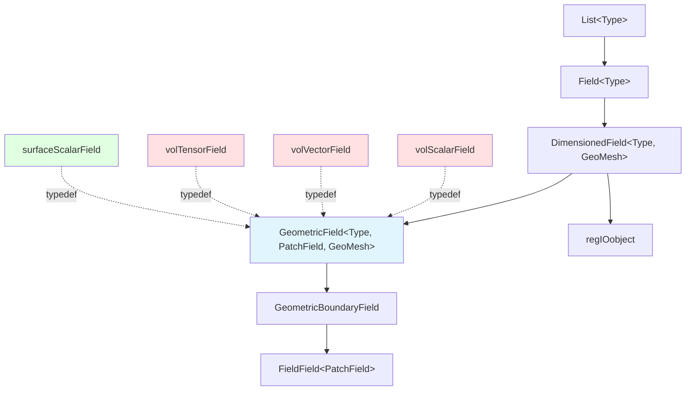
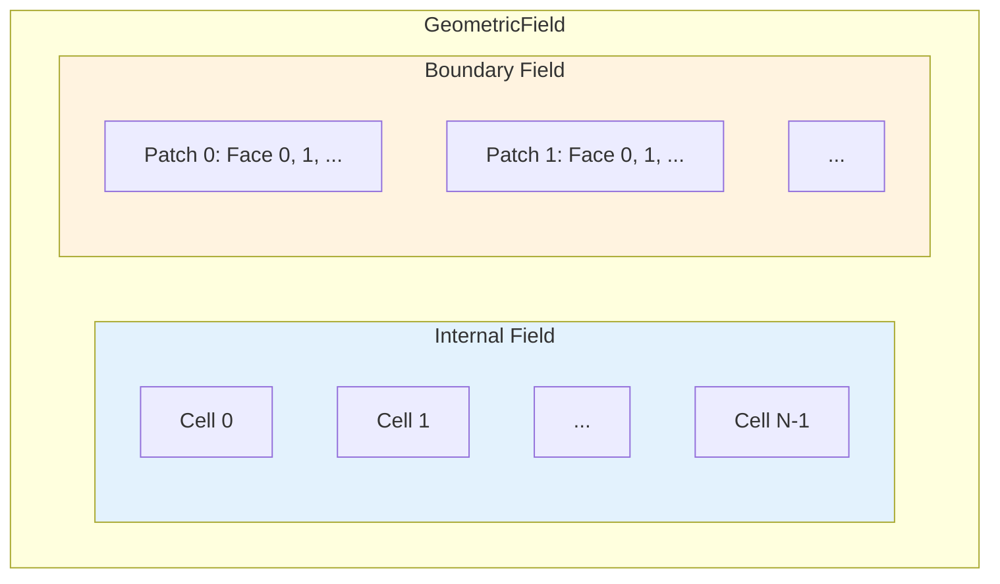

# Volume Fields (volFields)

![[control_volume_storage.png]]

> [!INFO] Overview
> **Volume fields** (`volFields`) are the fundamental data structures in OpenFOAM that store **field values at cell centers** throughout the computational mesh. They represent quantities that are **naturally defined over control volumes**, making them the primary choice for most CFD simulations.

---

## 🎯 Why Volume Fields?

Volume fields are used because **conservation laws** in the finite volume method are written around **control volumes**. Storing data at the centroid of these volumes:

- ✅ Aligns with the **physical principles** of conservation
- ✅ Simplifies **source term** and **temporal term** calculations
- ✅ Provides **natural discretization** for most governing equations

---

## 📐 Field Type Hierarchy

OpenFOAM organizes field data through a **sophisticated template hierarchy** that enables efficient storage, manipulation, and mathematical operations on CFD data.

### Class Inheritance Architecture

The field type hierarchy in OpenFOAM follows a **systematic inheritance structure**, building from simple data containers to complex geometric fields:

![[of_field_inheritance_architecture.png]]



**At the base level:**
- `List<Type>` provides a **dynamic array container** for any data type
- `Field<Type>` extends with **CFD-specific mathematical operations**
- Supports **vector calculations**, **tensor operations**, and **field-wide algebra**

### Core Field Components

#### `GeometricField<Type, PatchField, GeoMesh>`

The **complete field class** that combines both internal field values and boundary conditions.

**Template Parameters:**
- `Type`: Mathematical type (scalar, vector, tensor, etc.)
- `PatchField`: Boundary field type for handling boundary conditions
- `GeoMesh`: Mesh type (volMesh for cell-centered fields, surfaceMesh for face-centered fields)

```cpp
template<class Type, template<class> class PatchField, class GeoMesh>
class GeometricField : public DimensionedField<Type, GeoMesh>
{
    // Internal field storage
    DimensionedField<Type, GeoMesh> internalField_;

    // Boundary field storage
    GeometricBoundaryField<Type, PatchField, GeoMesh> boundaryField_;

    // Time tracking
    mutable label timeIndex_;
    mutable GeometricField* field0Ptr_;          // Old-time field
    mutable GeometricField* fieldPrevIterPtr_;   // Previous iteration
};
```

#### `DimensionedField<Type, GeoMesh>`

Extends the base field with:
- **Dimensional information**
- **Mesh association**
- Inherits from `Field<Type>` (data storage) and `regIOobject` (file I/O)
- **Automatic reading and writing** of field data

#### `GeometricBoundaryField`

Specialized container managing:
- All **boundary patches** for geometric fields
- Collection of **boundary condition objects**
- **Uniform access** to boundary values and gradients

---

## 📊 Common Field Type Definitions

The most commonly used field types in OpenFOAM are defined as template specializations in `volFieldsFwd.H`:

| Field Type | Template Specialization | Common Usage |
|---|---|---|
| `volScalarField` | `GeometricField<scalar, fvPatchField, volMesh>` | Pressure, Temperature |
| `volVectorField` | `GeometricField<vector, fvPatchField, volMesh>` | Velocity, Displacement |
| `volTensorField` | `GeometricField<tensor, fvPatchField, volMesh>` | Stress, Strain Rate |
| `surfaceScalarField` | `GeometricField<scalar, fvsPatchField, surfaceMesh>` | Fluxes, Heat Transfer Rates |

**Field Type Selection:**
- **Volume fields (`vol*`)**: Quantities naturally defined at cell centers (e.g., pressure $p$, temperature $T$)
- **Surface fields (`surface*`)**: Quantities naturally defined at faces (e.g., flux $\phi$)

---

## 🏗️ Internal vs. Boundary Field Architecture

### Memory Layout

OpenFOAM uses a **dual data structure** that separates internal domain values from boundary conditions:



**Internal Field Characteristics:**
- **Type**: Single contiguous `List<Type>`
- **Storage**: Values for all mesh cells
- **Advantages**:
  - Efficient **vectorized operations**
  - Optimal **cache utilization**
- **Usage**: Most CFD simulation unknowns are stored at cell centers

**Boundary Field Characteristics:**
- **Type**: `FieldField<PatchField, Type>`
- **Structure**: Hierarchical container managing **per-patch boundary conditions**
- **Function**: Each patch corresponds to a different geometric region of the mesh boundary

---

## 🔢 Dimensional Analysis Integration

Every field in OpenFOAM carries **complete dimensional information** through the `dimensionSet` class:

### Basic Dimensions

```cpp
dimensionSet(mass, length, time, temperature, moles, current, luminous_intensity);
```

| Dimension | Symbol | SI Unit | Example Usage |
|---|---|---|---|
| **Mass** | $[M]$ | kg | `1` for density |
| **Length** | $[L]$ | m | `1` for velocity, `2` for area |
| **Time** | $[T]$ | s | `-1` for rate, `-2` for acceleration |
| **Temperature** | $[\Theta]$ | K | `1` for temperature |
| **Moles** | $[N]$ | mol | Usually `0` |
| **Current** | $[I]$ | A | Usually `0` |
| **Luminous Intensity** | $[J]$ | cd | Usually `0` |

### Common Physical Quantities

| Quantity | Dimension Vector | Symbol | SI Unit |
|---|---|---|---|
| **Velocity** | `[0 1 -1 0 0 0 0]` | $L^1 T^{-1}$ | m/s |
| **Pressure** | `[1 -1 -2 0 0 0 0]` | $M L^{-1} T^{-2}$ | N/m² |
| **Temperature** | `[0 0 0 1 0 0 0]` | $\Theta$ | K |
| **Force** | `[1 1 -2 0 0 0 0]` | $M L T^{-2}$ | N |
| **Energy** | `[1 2 -2 0 0 0 0]` | $M L^2 T^{-2}$ | J |
| **Dynamic Viscosity** | `[1 -1 -1 0 0 0 0]` | $M L^{-1} T^{-1}$ | Pa·s |

### Automatic Dimensional Consistency

```cpp
volScalarField p(
    IOobject("p", runTime.timeName(), mesh, IOobject::MUST_READ),
    mesh,
    dimensionSet(1, -1, -2, 0, 0, 0, 0)  // Pressure dimensions
);

volVectorField U(
    IOobject("U", runTime.timeName(), mesh, IOobject::MUST_READ),
    mesh,
    dimensionSet(0, 1, -1, 0, 0, 0, 0)  // Velocity dimensions
);

volScalarField rho(
    IOobject("rho", runTime.timeName(), mesh, IOobject::MUST_READ),
    mesh,
    dimensionSet(1, -3, 0, 0, 0, 0, 0)  // Density dimensions
);

// Automatic dimensional checking in mathematical operations
volScalarField dynamicPressure = 0.5 * rho * magSqr(U);  // ✓ Dimensionally consistent
// rho [M L^-3] * U^2 [L^2 T^-2] = [M L^-1 T^-2] = Pressure dimension

// Dimensional error detection (compile-time or runtime)
// volScalarField invalid = p * U;  // ✗ Error: [M L^-1 T^-2] * [L T^-1] = [M T^-3]
```

> [!TIP] Dimensional Analysis Benefits
> - **Prevents implementation errors** in complex CFD simulations
> - **Ensures mathematical correctness** throughout simulations
> - **Verifies multi-physics equation consistency**
> - **Aids debugging** by catching dimensional errors early

---

## 🧮 Mathematical Framework

### Field Operations with Tensor Algebra

OpenFOAM fields support comprehensive algebraic operations following **tensor algebra rules**:

#### Component-wise Operations

```cpp
// Scalar multiplication
volVectorField scaledU = 2.5 * U;

// Vector addition
volVectorField sumVectors = U + V;

// Tensor-vector multiplication
volVectorField tauDotU = tau & U;  // Stress tensor dot velocity

// Magnitude and squared magnitude
volScalarField speed = mag(U);
volScalarField speedSquared = magSqr(U);
```

#### Tensor Operations

```cpp
// Tensor transpose
volTensorField gradUT = gradU.T();

// Symmetric part of tensor
volSymmTensorField symmGradU = symm(gradU);

// Skew-symmetric part (vorticity tensor)
volTensorField skewGradU = skew(gradU);

// Trace of tensor
volScalarField traceGradU = tr(gradU);

// Deviatoric part
volTensorField devGradU = dev(gradU);
```

#### Advanced Tensor Algebra

```cpp
// Double dot product (tensor contraction)
volScalarField tauColonS = tau && S;  // Stress power

// Tensor product (dyadic product)
volTensorField UU = U * U;  // Dyadic product

// Tensor cofactor
volTensorField cofactorGradU = cofactor(gradU);

// Tensor determinant
volScalarField detGradU = det(gradU);
```

### Finite Volume Operators

**Gradient Operator** (`fvc::grad`): Computes spatial gradients using Gauss's theorem:
$$\nabla\phi \approx \frac{1}{V_P} \sum_f \phi_f \mathbf{S}_f$$

```cpp
// Velocity gradient tensor
volTensorField gradU = fvc::grad(U);

// Pressure gradient vector
volVectorField gradP = fvc::grad(p);

// Temperature gradient (scalar)
volVectorField gradT = fvc::grad(T);
```

**Divergence Operator** (`fvc::div`): Computes divergence of vector and tensor fields:
$$\nabla \cdot \mathbf{F} \approx \frac{1}{V_P} \sum_f \mathbf{F}_f \cdot \mathbf{S}_f$$

```cpp
// Velocity divergence (continuity equation residual)
volScalarField divU = fvc::div(U);

// Momentum equation divergence term
volVectorField divRhoUU = fvc::div(rho*U*U);

// Stress tensor divergence
volVectorField divTau = fvc::div(tau);
```

**Laplacian Operator** (`fvc::laplacian`): Applies diffusion terms:
$$\nabla^2\phi \approx \frac{1}{V_P} \sum_f \Gamma_f \nabla\phi_f \cdot \mathbf{S}_f$$

```cpp
// Pressure Poisson equation Laplacian
fvScalarMatrix pEqn(fvm::laplacian(1/rho, p));

// Heat diffusion
fvScalarMatrix TEqn(fvm::laplacian(k/(rho*cp), T));

// Viscous term in momentum equation
fvVectorMatrix UEqn(fvm::laplacian(nu, U));
```

---

## ⏱️ Time-Dependent Fields

### Temporal Discretization

OpenFOAM manages time-dependent quantities through specialized field types and temporal operators:

#### Time Field Types

```cpp
// Old-time level field (n-1)
volScalarField p_old = p.oldTime();

// Old-old-time level field (n-2) for second-order schemes
volScalarField p_oldOld = p.oldTime().oldTime();

// Rate of change field
volScalarField dU_dt = fvc::ddt(U);

// Implicitly maintained time derivative
fvScalarMatrix pDDT = fvm::ddt(p);
```

#### Temporal Schemes

**Euler Explicit** (First-order):
$$\frac{\partial \phi}{\partial t} \approx \frac{\phi^{n+1} - \phi^n}{\Delta t}$$

```cpp
// Explicit Euler time derivative
volScalarField dPhi_dt = fvc::ddt(phi);
```

**Euler Implicit** (First-order, unconditionally stable):
$$\frac{\partial \phi}{\partial t} \approx \frac{\phi^{n+1} - \phi^n}{\Delta t}$$

```cpp
// Implicit Euler time derivative (contributes to matrix)
fvScalarMatrix phiEqn = fvm::ddt(phi);
```

**Crank-Nicolson** (Second-order):
$$\frac{\partial \phi}{\partial t} \approx \frac{2\phi^{n+1} - \phi^n - \phi^{n-1}}{\Delta t}$$

```cpp
// Second-order Crank-Nicolson scheme
fvScalarMatrix phiEqn = fvm::ddt(phi) == 0.5 * (source_old + source_new);
```

**Backward Differencing** (Second-order):
$$\frac{\partial \phi}{\partial t} \approx \frac{3\phi^{n+1} - 4\phi^n + \phi^{n-1}}{2\Delta t}$$

```cpp
// Second-order backward differencing
fvScalarMatrix phiEqn = fvm::ddt(phi);
```

---

## 🎨 Field Creation Examples

### Reading Fields from Files

```cpp
// Read pressure field from disk
volScalarField p
(
    IOobject
    (
        "p",
        runTime.timeName(),
        mesh,
        IOobject::MUST_READ,     // Must exist on disk
        IOobject::AUTO_WRITE     // Auto-write
    ),
    mesh
);

// Read with fallback to calculated if missing
volVectorField U
(
    IOobject
    (
        "U",
        runTime.timeName(),
        mesh,
        IOobject::READ_IF_PRESENT,  // Optional reading
        IOobject::AUTO_WRITE
    ),
    mesh
);
```

### Programmatic Field Creation

```cpp
// Initialize temperature field with linear profile
volScalarField T
(
    IOobject
    (
        "T",
        runTime.timeName(),
        mesh,
        IOobject::NO_READ,
        IOobject::AUTO_WRITE
    ),
    mesh,
    dimensionedScalar("Tinit", dimTemperature, 293.0),
    calculatedFvPatchField<scalar>::typeName
);

// Set linear temperature variation in x-direction
const vectorField& C = mesh.C();  // Cell centers
forAll(T, cellI)
{
    T[cellI] = 293.0 + 10.0 * C[cellI].x();  // T = T₀ + ΔT·x
}

// Create field derived from existing fields
volScalarField kineticEnergy
(
    IOobject
    (
        "k",
        runTime.timeName(),
        mesh,
        IOobject::NO_READ,
        IOobject::AUTO_WRITE
    ),
    0.5 * magSqr(U)  // k = ½|U|²
);
```

---

## 🚀 Performance Considerations

### Memory Management

**Efficient memory usage** through reference counting:

```cpp
// Use tmp for automatic memory management
tmp<volVectorField> gradU = fvc::grad(U);
tmp<volScalarField> divU = fvc::div(gradU());

// Keep temporary results in registers when possible
surfaceScalarField phi = fvc::interpolate(U) & mesh.Sf();

// Reuse allocated memory with field references
volScalarField& pRef = p;  // Reference avoids copy
pRef += 0.5 * rho * magSqr(U);  // Bernoulli pressure
```

### Parallel Field Operations

```cpp
// Global reduction operations for field statistics
scalar totalMass = gSum(rho * mesh.V());
scalar maxVelocity = gMax(mag(U));
scalar averageTemperature = gAverage(T);

// Parallel communication for boundary values
p.correctBoundaryConditions();  // Sync across processors

// Global field statistics reporting
if (Pstream::master())
{
    Info << "Field statistics:" << nl
         << "  Total mass: " << totalMass << nl
         << "  Max velocity: " << maxVelocity << nl
         << "  Average temperature: " << averageTemperature << nl;
}
```

---

## 📚 Summary

### Key Takeaways

1. **Hierarchical Design**: `GeometricField` combines mathematical types, boundary policies, and mesh topology
2. **Dual Architecture**: Separation of internal and boundary fields optimizes memory access and flexibility
3. **Dimensional Safety**: Built-in dimensional analysis prevents physical errors
4. **Tensor Algebra**: Complete mathematical framework for CFD operations
5. **Time Integration**: Automatic management of time-dependent fields

### Best Practices

> [!SUCCESS] Field Creation Checklist
> - ✅ Always specify **dimensions explicitly**
> - ✅ Use appropriate **field types** for quantities
> - ✅ Leverage **automatic dimensional checking**
> - ✅ Understand **`tmp<T>` semantics** for temporary fields
> - ✅ Profile **field operations** for performance

---

## 🔗 Further Reading

- [[Surface Fields]] - Face-centered field types
- [[Boundary Conditions]] - Patch field types and usage
- [[Mathematical Operations]] - Complete operator reference
- [[Parallel Computing]] - Field decomposition and communication
