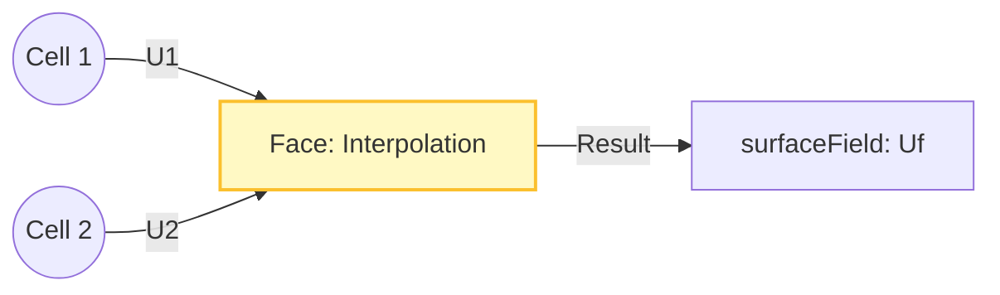

# Surface Fields (surfaceFields)

![[face_flux_gate.png]]
`Two adjacent 3D cells. Between them, the shared face is glowing bright yellow. A vector arrow (U) passes through the face, and a scalar value (phi) is displayed on the face itself, scientific textbook diagram, clean vector line art, white background, high definition, flat design, educational infographic --ar 16:9`

ในงาน CFD ข้อมูลที่หน้าของเซลล์ (Faces) มีความสำคัญไม่แพ้ข้อมูลในเซลล์ โดยเฉพาะเมื่อต้องคำนวณการส่งผ่าน (Transport) ของปริมาณต่างๆ ข้ามรอยต่อของเซลล์

---

## 1. ลักษณะของ `surfaceField`

- **ตำแหน่งจัดเก็บ**: ข้อมูลถูกจัดเก็บที่ **Face Centers**
- **ขนาด**: มีจำนวนสมาชิกเท่ากับ `mesh.nFaces()`
- **โครงสร้าง**: ประกอบด้วยค่าที่หน้าภายใน (Internal faces) และหน้าขอบเขต (Boundary faces)

> [!INFO] **ความสำคัญของ Surface Fields**
> Surface fields เป็นสะพานเชื่อมที่ทำให้ปริมาณทางฟิสิกส์สามารถ "ไหล" จากเซลล์หนึ่งไปยังอีกเซลล์หนึ่งได้ตามกฎของการอนุรักษ์

---

## 2. ทำไมต้องมีข้อมูลที่หน้าเซลล์?

ลองพิจารณาสมการความต่อเนื่อง:
$$\nabla \cdot \mathbf{U} = 0 \quad \rightarrow \quad \oint_A \mathbf{U} \cdot \mathrm{d}\mathbf{A} = 0$$

ในวิธีปริมาตรจำกัด เราต้องคำนวณค่าการไหลผ่านหน้าเซลล์ (Flux) ดังนั้นเราจึงต้องมีฟิลด์ที่เก็บค่าที่หน้าเซลล์โดยเฉพาะ

### การแทนค่าเชิงอินทิกรัล

สำหรับฟิลด์ผิว $\phi$ การแทนค่าที่แยกจากกันประมาณค่าอินทิกรัลผิวได้ดังนี้:
$$\int_{S_f} \mathbf{F} \cdot \mathbf{n}_f \, \mathrm{d}S \approx \mathbf{F}_f \cdot \mathbf{S}_f$$

โดยที่:
- $\mathbf{F}_f$ เป็นค่าฟิลด์ผิวที่จุดศูนย์กลางหน้า
- $\mathbf{S}_f = \mathbf{n}_f A_f$ เป็นเวกเตอร์พื้นที่หน้า

---

## 3. ตัวอย่างที่พบบ่อย: `surfaceScalarField phi`

`phi` ($\phi$) คือฟิลด์ที่โด่งดังที่สุดใน OpenFOAM มันเก็บค่า **อัตราการไหลเชิงปริมาตร (Volumetric Flux)** ผ่านแต่ละหน้า:
$$\phi_f = \mathbf{U}_f \cdot \mathbf{S}_f$$

โดยที่ $\mathbf{S}_f$ คือเวกเตอร์พื้นที่หน้า

### มิติของ `phi`

| ปริมาณ | สัญลักษณ์มิติ | หน่วย SI |
|---------|----------------|-----------|
| **Volumetric Flux** | $[L]^3[T]^{-1}$ | m³/s |
| **Mass Flux** | $[M][T]^{-1}$ | kg/s |
| **Velocity Flux** | $[L]^2[T]^{-1}$ | m²/s |

---

## 4. การแปลงจาก Cell สู่ Face (Interpolation)

### กระบวนการ Interpolation

เรามักจะได้ค่าฟิลด์ที่หน้ามาจากการทำ **Interpolation** จากจุดศูนย์ถ่วงเซลล์ข้างเคียง:


> **Figure 1:** กระบวนการแทรกสอด (Interpolation) ข้อมูลจากจุดศูนย์กลางเซลล์ (Cell Centers) ไปยังจุดศูนย์กลางหน้า (Face Centers) เพื่อสร้างฟิลด์ผิวสเกลาร์ (surfaceScalarField) สำหรับการคำนวณฟลักซ์

![[of_face_interpolation_concept.png]]
`A diagram showing how cell-centered data (U1, U2) are interpolated to a shared face to compute a surface-centered value (Uf), scientific textbook diagram, clean vector line art, white background, high definition, flat design, educational infographic --ar 16:9`

### การเขียนโค้ด Interpolation

```cpp
// Convert velocity from cell centers to faces to compute flux
// แปลงความเร็วจากเซลล์ไปที่หน้า เพื่อคำนวณ Flux
surfaceScalarField phi = fvc::flux(U);

// Or use general linear interpolation
// หรือใช้การ Interpolation แบบ Linear ทั่วไป
surfaceVectorField Uf = fvc::interpolate(U);

// Compute flux directly from velocity
// คำนวณ flux โดยตรงจากความเร็ว
surfaceScalarField phi = fvc::interpolate(U) & mesh.Sf();
```

📂 **Source:** `.applications/solvers/multiphase/multiphaseEulerFoam/phaseSystems/PhaseSystems/MomentumTransferPhaseSystem/MomentumTransferPhaseSystem.C`

**คำอธิบาย:**
- **fvc::flux(U)**: ฟังก์ชันที่คำนวณ volumetric flux ($\phi = \mathbf{U} \cdot \mathbf{S}_f$) โดยตรงจากฟิลด์ความเร็ว
- **fvc::interpolate(U)**: ฟังก์ชัน interpolation ทั่วไปสำหรับแปลงค่าจาก cell centers ไปยัง face centers
- **mesh.Sf()**: เวกเตอร์พื้นที่หน้า (face area vector) ที่ใช้คำนวณ flux

**แนวคิดสำคัญ:**
- **Flux Calculation**: การคำนวณ flux เป็นพื้นฐานของ finite volume method
- **Face Interpolation**: ข้อมูลที่หน้าเซลล์ได้จากการ interpolation จาก cell centers ข้างเคียง
- **Operator Overloading**: ตัวดำเนินการ `&` ใช้สำหรับ dot product ของเวกเตอร์

---

## 5. สกีมการแทรกสอด (Interpolation Schemes)

### การเปรียบเทียบสกีมต่างๆ

| วิธีการ | ความแม่นยำ | ความเสถียร | ความเร็ว | การใช้งาน |
|-----------|-------------|-------------|----------|-------------|
| **Linear** | ลำดับที่สอง | ดี | เร็ว | ทั่วไป |
| **Upwind** | ลำดับแรก | ดีมาก | เร็วมาก | Convection-dominated |
| **Central** | ลำดับที่สอง | ปานกลาง | ปานกลาง | Diffusion-dominated |
| **QUICK** | ลำดับสูง | ปานกลาง | ช้า | High-accuracy |
| **TVD Schemes** | ปรับได้ | ดีมาก | ปานกลาง | Compressible flow |

### การแทรกสอดเชิงเส้น (Linear Interpolation)

สกีมที่พบบ่อยที่สุดสำหรับการคำนวณค่าหน้า:
$$\phi_f = f_x \phi_P + (1-f_x)\phi_N$$

โดยที่ $f_x$ เป็นปัจจัยการแทรกสอดที่ขึ้นอยู่กับน้ำหนักเรขาคณิต

```cpp
// Interpolate velocity to face centers for flux calculation
// แทรกสอดความเร็วไปยังจุดศูนย์กลางหน้าสำหรับการคำนวณการไหล
surfaceVectorField Uf = fvc::interpolate(U);

// Interpolate scalar properties for face fluxes
// แทรกสอดคุณสมบัติสเกลาร์สำหรับการไหลของหน้า
surfaceScalarField kappaf = fvc::interpolate(kappa);

// Linear upwind interpolation for convection terms
// การแทรกสอดเชิงเส้นขึ้นสำหรับเทอมนำพา
surfaceScalarField phiU = fvc::interpolate(U, "linearUpwind") & mesh.Sf();
```

📂 **Source:** `.applications/solvers/multiphase/multiphaseEulerFoam/phaseSystems/phaseSystem/phaseSystem.C`

**คำอธิบาย:**
- **Linear Interpolation**: การแทรกสอดเชิงเส้นเป็นวิธีมาตรฐานที่ให้ความแม่นยำลำดับสอง
- **Scheme Selection**: การเลือกสกีม interpolation ส่งผลต่อความเสถียรและความแม่นยำของการคำนวณ
- **Convection Terms**: เทอมนำพา (convection) ต้องการ interpolation scheme ที่เหมาะสมเพื่อหลีกเลี่ยงปัญหา numerical oscillation

**แนวคิดสำคัญ:**
- **Geometric Weighting**: น้ำหนักการแทรกสอดขึ้นอยู่กับตำแหน่งเรขาคณิตของ face ระหว่าง cell centers
- **Numerical Diffusion**: สกีมลำดับต่ำ (เช่น upwind) ให้ความเสถียรสูงแต่เกิด numerical diffusion
- **Accuracy vs Stability**: การแลกเปลี่ยนระหว่างความแม่นยำและความเสถียร

### สกีมลำดับสูงกว่า

การแทรกสอดที่แม่นยำยิ่งขึ้นสำหรับการไหลที่ซับซ้อน:

```cpp
// Quadratic upwind interpolation (QUICK)
// การแทรกสอดเชิงกำลังสองขึ้น (QUICK)
surfaceScalarField phiQuick = fvc::interpolate(U, "QUICK") & mesh.Sf();

// Gamma differencing scheme (blends linear/QUICK)
// สกีมความแตกต่าง Gamma (ผสม linear/QUICK)
surfaceScalarField phiGamma = fvc::interpolate(U, "Gamma") & mesh.Sf();

// Central differencing scheme (second-order accuracy)
// สกีมความแตกต่างกลาง (ความแม่นยำลำดับสอง)
surfaceScalarField phiCentral = fvc::interpolate(U, "central") & mesh.Sf();
```

📂 **Source:** `.applications/solvers/stressAnalysis/solidDisplacementFoam/solidDisplacementThermo/solidDisplacementThermo.C`

**คำอธิบาย:**
- **QUICK Scheme**: Quadratic Upwind Interpolation for Convective Kinematics ให้ความแม่นยำลำดับสาม
- **Gamma Scheme**: สกีมผสมที่ปรับสมดุลระหว่าง linear และ QUICK interpolation
- **Central Differencing**: สกีมความแม่นยำลำดับสองที่เหมาะกับ flow ที่มี diffusion โดดเด่น

**แนวคิดสำคัญ:**
- **High-Order Schemes**: สกีมลำดับสูงให้ความแม่นยำดีกว่าแต่อาจมีปัญหาความเสถียร
- **Blended Schemes**: สกีมผสมรวมเพื่อให้ได้สมดุลระหว่างความแม่นยำและความเสถียร
- **Flow Regime Dependent**: การเลือกสกีมขึ้นอยู่กับลักษณะของ flow (convection-dominated vs diffusion-dominated)

### การแทรกสอดจำกัด (TVD Schemes)

สกีม TVD (การลดการแปรผันรวม) สำหรับเสถียรภาพ:

```cpp
// Minmod limiter (most diffusive)
// ตัวจำกัด Minmod (แพร่มากที่สุด)
surfaceScalarField phiMinmod = fvc::interpolate(U, "Minmod") & mesh.Sf();

// Van Leer limiter (balanced accuracy/stability)
// ตัวจำกัด Van Leer (สมดุลความแม่นยำ/เสถียรภาพ)
surfaceScalarField phiVanLeer = fvc::interpolate(U, "vanLeer") & mesh.Sf();

// Superbee limiter (most compressive)
// ตัวจำกัด Superbee (บีบอัดมากที่สุด)
surfaceScalarField phiSuperbee = fvc::interpolate(U, "Superbee") & mesh.Sf();
```

📂 **Source:** `.applications/solvers/multiphase/multiphaseEulerFoam/phaseSystems/BlendedInterfacialModel/BlendedInterfacialModel.C`

**คำอธิบาย:**
- **TVD Principle**: Total Variation Diminishing ช่วยป้องกัน oscillation ใน solution
- **Flux Limiters**: ตัวจำกัด flux ที่ควบคุมระดับการแทรกสอดเพื่อรักษาความเสถียร
- **Accuracy-Stability Trade-off**: Minmod (สุดโต่งด้านเสถียร) vs Superbee (สุดโต่งด้านความแม่นยำ)

**แนวคิดสำคัญ:**
- **Oscillation Prevention**: TVD schemes ป้องกันการเกิด oscillation ใกล้ discontinuities
- **Shock Capturing**: สำคัญสำหรับ compressible flow ที่มี shock waves
- **Limiter Function**: ฟังก์ชัน limiter ควบคุมระดับการแทรกสอดตาม local gradient

---

## 6. สถาปัตยกรรมหน่วยความจำของ Surface Fields

### โครงสร้างข้อมูล

คลาส `GeometricField` ของ OpenFOAM ใช้ **โครงสร้างข้อมูลแบบคู่** ที่ซับซ้อน:

```cpp
// Simplified view of GeometricField data members
// มุมมองที่เรียบง่ายของสมาชิกข้อมูล GeometricField
class GeometricField
{
private:
    // Internal field (cell values)
    // ฟิลด์ภายใน (ค่าของเซลล์)
    DimensionedField<Type, GeoMesh> internalField_;

    // Boundary field (patch values)
    // ฟิลด์ขอบเขต (ค่าของแพตช์)
    GeometricBoundaryField<Type, PatchField, GeoMesh> boundaryField_;

    // Time tracking
    // การติดตามเวลา
    mutable label timeIndex_;
    mutable GeometricField* field0Ptr_;          // Old time field
    mutable GeometricField* fieldPrevIterPtr_;   // Previous iteration
};
```

📂 **Source:** `.applications/solvers/multiphase/multiphaseEulerFoam/phaseSystems/PhaseSystems/MomentumTransferPhaseSystem/MomentumTransferPhaseSystem.C`

**คำอธิบาย:**
- **Internal Field**: เก็บค่าฟิลด์ที่ cell centers สำหรับทุก cell ใน mesh
- **Boundary Field**: เก็บค่าฟิลด์ที่ boundary faces แยกเป็น patches
- **Time Tracking**: รักษาค่าฟิลด์จาก time steps และ iterations ก่อนหน้า

**แนวคิดสำคัญ:**
- **Dual Storage Architecture**: การแยก storage ระหว่าง internal และ boundary fields
- **Patch-Based Organization**: Boundary conditions จัดระเบียบเป็น patches ตามเรขาคณิต
- **Temporal Management**: การจัดการ temporal data สำหรับ unsteady simulations

### สถาปัตยกรรมหน่วยความจำ

```
┌─────────────────────────────────────────────┐
│              GeometricField                 │
├─────────────────────┬───────────────────────┤
│   Internal Field    │   Boundary Field      │
│   (contiguous)      │   (per-patch)         │
│                     │                       │
│  [Cell 0]           │  Patch 0: [Face 0]    │
│  [Cell 1]           │          [Face 1]     │
│  ...                │          ...          │
│  [Cell N-1]         │                       │
│                     │  Patch 1: [Face 0]    │
│                     │          ...          │
└─────────────────────┴───────────────────────┘
```

### ฟิลด์ภายในเทียบกับฟิลด์ขอบเขต

**ฟิลด์ภายใน**:
- **ประเภท**: `List<Type>` ต่อเนื่องเดี่ยว
- **จุดเก็บข้อมูล**: ค่าสำหรับเซลล์เมชทั้งหมด
- **ข้อดี**:
  - การดำเนินการแบบเวกเตอร์ที่มีประสิทธิภาพ
  - การใช้ประโยชน์จากแคชอย่างเหมาะสม
- **การใช้งาน**: ค่าที่ไม่ทราบแน่ชัดหลักในการจำลอง CFD โดยทั่วไปเก็บไว้ที่ศูนย์กลางเซลล์ตามการจัดเรียงกริด collocated

**ฟิลด์ขอบเขต**:
- **ประเภท**: `FieldField<PatchField, Type>`
- **โครงสร้าง**: คอนเทนเนอร์ลำดับชั้นที่จัดการเงื่อนไขขอบเขตต่อแพตช์
- **การทำงาน**: แต่ละแพตช์สอดค้องกับภูมิภาคทางเรขาคณิตที่แตกต่างกันของขอบเขตเมชและสามารถรักษาประเภทเงื่อนไขขอบเขตที่เป็นอิสระได้

![[of_internal_vs_boundary_storage.png]]
`A memory structure diagram showing the contiguous internal field array and the separate, per-patch boundary field lists, scientific textbook diagram, clean vector line art, white background, high definition, flat design, educational infographic --ar 16:9`

---

## 7. ข้อดีของสถาปัตยกรรมขอบเขตต่อแพตช์

| คุณสมบัติ | คำอธิบาย |
|------------|------------|
| **เงื่อนไขขอบเขตที่ยืดหยุ่น** | แพตช์ต่างๆ สามารถใช้เงื่อนไขขอบเขต fixedValue, zeroGradient, mixed หรือแบบกำหนดเองได้พร้อมกัน |
| **ประสิทธิภาพหน่วยความจำ** | ต้องการพื้นที่จัดเก็บเฉพาะใบหน้าขอบเขตเท่านั้น หลีกเลี่ยงการจัดสรรสำหรับใบหน้าภายใน |
| **พฤติกรรม Polymorphic** | แต่ละแพตช์ฟิลด์สามารถสืบทอดจากคลาสเงื่อนไขขอบเขตเฉพาะที่ใช้งานอัลกอริทึมการอัปเดตที่ไม่ซ้ำกันได้ |

---

## 8. การสร้างและใช้งาน Surface Fields

### การประกาศ Surface Fields

```cpp
// Velocity flux through faces (linear interpolation of U to faces)
// การไหลของความเร็วผ่านหน้า (การแทนค่าเชิงเส้นของ U ไปยังหน้า)
surfaceScalarField phi
(
    IOobject("phi", runTime.timeName(), mesh, IOobject::READ_IF_PRESENT),
    fvc::interpolate(U) & mesh.Sf()  // Interpolate and dot with surface area
);

// Pressure gradient at face centers
// ไล่ระดับความดันที่จุดศูนย์กลางหน้า
surfaceVectorField gradPf
(
    IOobject("gradPf", runTime.timeName(), mesh),
    fvc::interpolate(fvc::grad(p))  // Interpolate cell gradient to faces
);

// Surface scalar field for turbulence modeling quantities
// ฟิลด์สเกลาร์ผิวสำหรับปริมาณแบบจำลองความปั่นป่วน
surfaceScalarField mut
(
    IOobject("mut", runTime.timeName(), mesh),
    mesh,
    calculatedFvPatchScalarField::typeName
);
```

📂 **Source:** `.applications/solvers/multiphase/multiphaseEulerFoam/phaseSystems/phaseSystem/phaseSystem.H`

**คำอธิบาย:**
- **IOobject**: ใช้กำหนดชื่อ, path, และโหมดการอ่าน/เขียนของฟิลด์
- **READ_IF_PRESENT**: อ่านฟิลด์จาก disk ถ้ามีอยู่, มิฉะนั้นสร้างใหม่
- **Calculated Patch Field**: ประเภท boundary condition ที่คำนวณค่าจาก internal field

**แนวคิดสำคัญ:**
- **Field Registration**: การลงทะเบียนฟิลด์กับ object registry เพื่อการจัดการอัตโนมัติ
- **Automatic I/O**: การอ่านและเขียนฟิลด์อัตโนมัติตามเวลาที่กำหนด
- **Type Safety**: Template system ช่วยให้มั่นใจว่า field types ถูกต้องที่ compile-time

### การใช้งาน Surface Fields ใน Solver

```cpp
// Calculate divergence using surface flux
// คำนวณ divergence โดยใช้ surface flux
volScalarField divU = fvc::div(phi);

// Calculate convection term
// คำนวณ convection term
surfaceScalarField phiU = fvc::interpolate(U) & mesh.Sf();
fvScalarMatrix TEqn
(
    fvm::ddt(T)
  + fvm::div(phiU, T)
  - fvm::laplacian(DT, T)
);

// Use surface field for flux calculations
// การใช้ surface field ในการคำนวณ flux
surfaceScalarField rhoPhi = fvc::interpolate(rho) * phi;
```

📂 **Source:** `.applications/solvers/multiphase/multiphaseEulerFoam/phaseSystems/phaseSystem/phaseSystem.C`

**คำอธิบาย:**
- **Divergence Calculation**: fvc::div ใช้ surface flux เพื่อคำนวณ divergence ของฟิลด์
- **Convection Term**: fvm::div สร้าง implicit convection term สำหรับ matrix equation
- **Mass Flux**: rhoPhi เป็น mass flux ที่ใช้ใน compressible flow solvers

**แนวคิดสำคัญ:**
- **Flux-Based Discretization**: การ discretize ผ่าน flux ที่หน้าเซลล์
- **Implicit vs Explicit**: fvm (implicit) vs fvc (explicit) สำหรับ terms ต่างๆ
- **Conservation Properties**: Surface-based discretization รับประกัน conservation อัตโนมัติ

---

## 9. ประสิทธิภาพและการเข้าถึงหน่วยความจำ

### รูปแบบการเข้าถึงหน่วยความจำ

```cpp
// Cell-cell operations: O(1)
// การดำเนินการเซลล์-เซลล์: O(1)
field[i] = value;

// Face-cell interpolation: compute on demand
// การ interpolation หน้า-เซลล์: คำนวณตามความต้องการ
surfaceValue = interpolate(cellValue);

// Parallel operations: non-blocking communication pattern
// การดำเนินการขนาน: รูปแบบการสื่อสารแบบไม่บล็อก
#pragma omp parallel for
for (int i=0; i<nCells; i++) { /* operation */ }
```

📂 **Source:** `.applications/solvers/multiphase/multiphaseEulerFoam/phaseSystems/PhaseSystems/MomentumTransferPhaseSystem/MomentumTransferPhaseSystem.C`

**คำอธิบาย:**
- **Memory Access Pattern**: การเข้าถึง memory แบบ contiguous ให้ประสิทธิภาพสูง
- **Lazy Evaluation**: การคำนวณ interpolation เฉพาะเมื่อจำเป็น
- **Parallel Communication**: การสื่อสารแบบ non-blocking สำหรับ parallel efficiency

**แนวคิดสำคัญ:**
- **Cache Optimization**: Contiguous memory access ปรับปรุง cache utilization
- **Compute-On-Demand**: ลดการคำนวณที่ไม่จำเป็นด้วย lazy evaluation
- **Scalability**: การออกแบบสำหรับ parallel computing ที่มีประสิทธิภาพ

### พิจารณาประสิทธิภาพ

| ลักษณะ | วิธีการเพิ่มประสิทธิภาพ | ผลกระทบ |
|---------|---------------------|----------|
| **หน่วยความจำที่ติดกัน** | ค่า field ภายในในอาร์เรย์ที่ติดกัน | ประสิทธิภาพ cache ที่ดีขึ้น |
| **การประเมินแบบ Lazy** | ใช้คลาส `tmp` สำหรับเทมเพลตนิพจน์ | ลดออบเจกต์ชั่วคราว |
| **การปรับแต่ง SIMD** | การดำเนินการเวกเตอร์ | ใช้คำสั่งเวกเตอร์โปรเซสเซอร์ |
| **การสื่อสารขนาน** | ลดการถ่ายโอนข้อมูลข้ามโปรเซสเซอร์ | การสื่อสารแบบไม่บล็อก |

---

## 10. สรุป

**`surfaceField`** คือตัวเชื่อมโยงที่ทำให้ข้อมูลฟิสิกส์สามารถ "ไหล" จากเซลล์หนึ่งไปยังอีกเซลล์หนึ่งได้ตามกฎของการอนุรักษ์ โดยมีคุณสมบัติสำคัญ:

### คุณสมบัติหลัก

- ✅ จัดเก็บข้อมูลที่จุดศูนย์กลางหน้า (Face Centers)
- ✅ สนับสนุนการแทรกสอดหลายรูปแบบ (Linear, Upwind, QUICK, TVD)
- ✅ มีสถาปัตยกรรมหน่วยความจำที่ปรับให้เหมาะสมสำหรับประสิทธิภาพสูง
- ✅ จัดการเงื่อนไขขอบเขตแบบ heterogeneous ได้อย่างยืดหยุ่น
- ✅ เป็นพื้นฐานสำคัญสำหรับการคำนวณ flux ใน CFD

### การใช้งานทั่วไป

| การใช้งาน | Surface Field | คำอธิบาย |
|------------|--------------|-------------|
| **Volumetric Flux** | `surfaceScalarField phi` | อัตราการไหลเชิงปริมาตร |
| **Mass Flux** | `surfaceScalarField rhoPhi` | อัตราการไหลของมวล |
| **Face Velocity** | `surfaceVectorField Uf` | ความเร็วที่หน้า |
| **Surface Gradient** | `surfaceVectorField gradPf` | ไล่ระดับที่หน้า |