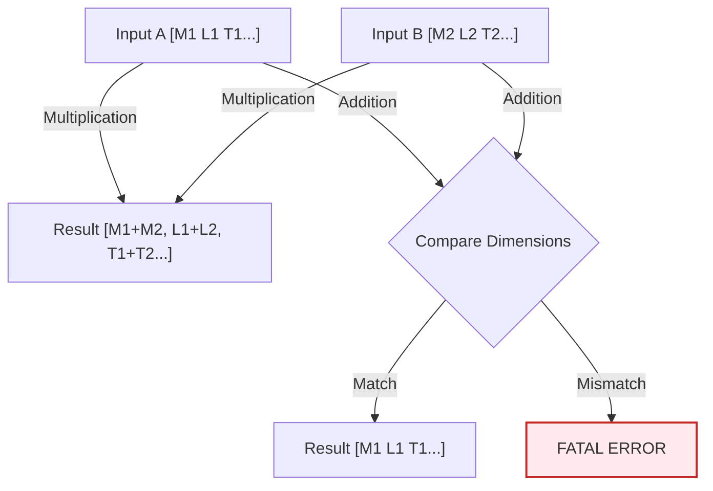

# การตรวจสอบมิติทางกายภาพ (Dimensional Checking)

![[dimensional_safety_net.png]]
> **Academic Vision:** A tight safety net woven from SI unit symbols (kg, m, s). A physics equation is trying to fall through, but the net catches it because its dimensions are consistent. If the dimensions were wrong, the net would glow red and block it. Professional, clean illustration.

OpenFOAM มีระบบการตรวจสอบหน่วย (Units) ที่เข้มงวดที่สุดระบบหนึ่งในซอฟต์แวร์วิศวกรรม เพื่อป้องกันข้อผิดพลาดที่ไม่มีความหมายทางฟิสิกส์ (เช่น การเอาความดันไปบวกกับอุณหภูมิ)

---

## 📋 สารบัซ

- [1. ระบบหน่วยฐาน SI ทั้ง 7](#1-ระบบหน่วยฐาน-si-ทั้ง-7)
- [2. โครงสร้างคลาส DimensionSet](#2-โครงสร้างคลาส-dimensionset)
- [3. กฎพีชคณิตมิติ](#3-กฎพีชคณิตมิติ)
- [4. การตรวจสอบระดับโค้ด](#4-การตรวจสอบระดับโค้ด)
- [5. ปริมาณทางกายภาพทั่วไป](#5-ปริมาณทางกายภาพทั่วไป)
- [6. การตรวจสอบความสม่ำเสมอของมิติ](#6-การตรวจสอบความสม่ำเสมอของมิติ)
- [7. การวิเคราะห์มิติในสมการ Navier-Stokes](#7-การวิเคราะห์มิติในสมการ-navier-stokes)
- [8. ตัวอย่างข้อผิดพลาดและการแก้ไข](#8-ตัวอย่างข้อผิดพลาดและการแก้ไข)

---

## 1. ระบบหน่วยฐาน SI ทั้ง 7

OpenFOAM แทนมิติทางกายภาพด้วยรายการตัวเลข 7 ตัว ซึ่งสอดคล้องกับหน่วยฐาน SI ดังนี้:

| ลำดับ | มิติ | หน่วยฐาน SI | สัญลักษณ์ใน OpenFOAM | ตัวอย่างหน่วย |
|:---|:---|:---|:---|:---|
| 1 | **มวล** | กิโลกรัม (kg) | $M$ | kg |
| 2 | **ความยาว** | เมตร (m) | $L$ | m |
| 3 | **เวลา** | วินาที (s) | $T$ | s |
| 4 | **อุณหภูมิ** | เคลวิน (K) | $\Theta$ | K |
| 5 | **ปริมาณสาร** | โมล (mol) | $N$ | mol |
| 6 | **กระแสไฟฟ้า** | แอมแปร์ (A) | $I$ | A |
| 7 | **ความเข้มแสง** | แคนเดลา (cd) | $J$ | cd |

### การเขียนมิติในไฟล์ OpenFOAM

ในไฟล์ค่าขอบเขต (boundary field files) มิติจะถูกระบุในรูปแบบ:

```
dimensions [1 -1 -2 0 0 0 0];
```

ซึ่งหมายถึง:
$$M^1 \cdot L^{-1} \cdot T^{-2} \cdot \Theta^0 \cdot N^0 \cdot I^0 \cdot J^0 = \frac{\text{kg}}{\text{m} \cdot \text{s}^2} = \text{Pa}$$

---

## 2. โครงสร้างคลาส DimensionSet

OpenFOAM ใช้คลาส `dimensionSet` เพื่อเข้ารหัสมิติทางกายภาพของปริมาณตามระบบ SI

### การประกาศ DimensionSet

```cpp
// Constructor format: dimensionSet(mass, length, time, temperature, moles, current, luminous_intensity)
// Velocity dimension: [L][T]^-1
dimensionSet velocityDim(0, 1, -1, 0, 0, 0, 0);

// Force dimension: [M][L][T]^-2
dimensionSet forceDim(1, 1, -2, 0, 0, 0, 0);

// Pressure dimension: [M][L]^-1[T]^-2
dimensionSet pressureDim(1, -1, -2, 0, 0, 0, 0);
```

> **💡 คำอธิบาย (Thai Explanation)**
> 
> **แหล่งที่มา (Source):** `src/OpenFOAM/dimension/dimensionSet/dimensionSet.H`
> 
> **คำอธิบาย:** คลาส `dimensionSet` ใน OpenFOAM ใช้เก็บเลขชี้กำลังของหน่วยฐาน SI ทั้ง 7 ตัว โดยแต่ละพารามิเตอร์ใน constructor แทนเลขชี้กำลังของ:
> - มวล (Mass)
> - ความยาว (Length)
> - เวลา (Time)
> - อุณหภูมิ (Temperature)
> - ปริมาณสาร (Moles)
> - กระแสไฟฟ้า (Current)
> - ความเข้มแสง (Luminous Intensity)
>
> **แนวคิดสำคัญ:**
> - ความเร็วมีมิติเป็น [L][T]⁻¹ = ม./วินาที
> - แรงมีมิติเป็น [M][L][T]⁻² = กก·ม./วินาที² = นิวตัน
> - ความดันมีมิติเป็น [M][L]⁻¹[T]⁻² = กก/(ม·วินาที²) = ปาสกาล

### โครงสร้างภายใน

```cpp
class dimensionSet
{
private:
    // Exponents for the 7 base SI dimensions
    scalar exponents_[7];  

public:
    // Constructor: M, L, T, Θ, N, I, J
    dimensionSet(scalar M, scalar L, scalar T, scalar Θ,
                 scalar N, scalar I, scalar J);

    // Operator overloading for dimensional arithmetic
    dimensionSet operator+(const dimensionSet&) const;
    dimensionSet operator*(const dimensionSet&) const;
    dimensionSet operator/(const dimensionSet&) const;
    dimensionSet pow(const scalar) const;
};
```

> **💡 คำอธิบาย (Thai Explanation)**
> 
> **แหล่งที่มา (Source):** `src/OpenFOAM/dimension/dimensionSet/dimensionSet.H`
> 
> **คำอธิบาย:** โครงสร้างภายในของคลาส `dimensionSet` ประกอบด้วย:
> - **exponents_[7]:** อาร์เรย์ขนาด 7 ช่องเก็บเลขชี้กำลังของหน่วยฐาน SI
> - **Operator overloading:** โอเปอเรเตอร์ที่โอเวอร์โหลดเพื่อให้คำนวณมิติได้อัตโนมัติ
>
> **แนวคิดสำคัญ:**
> - operator* : บวกเลขชี้กำลังเมื่อคูณหน่วย
> - operator/ : ลบเลขชี้กำลังเมื่อหารหน่วย
> - operator+ : ตรวจสอบว่ามิติตรงกันก่อนบวก
> - pow() : คูณเลขชี้กำลังด้วยค่าที่ระบุ

---

## 3. กฎพีชคณิตมิติ

ระบบจะคำนวณหน่วยใหม่ให้โดยอัตโนมัติตามกฎคณิตศาสตร์:

### แผนภาพการคำนวณมิติ


> **Figure 1:** กฎการคำนวณมิติทางฟิสิกส์สำหรับการดำเนินการต่างๆ โดยระบบจะตรวจสอบความสอดคล้องของหน่วยสำหรับการบวก/ลบ และคำนวณเลขชี้กำลังใหม่สำหรับการคูณ/หารโดยอัตโนมัติความปลอดภัยทางฟิสิกส์ไม่ส่งผลกระทบต่อความเร็วในการจำลอง ผ่านการใช้พลังของ C++ Template Metaprogramming ในการตรวจสอบความสอดคล้องทางมิติทั้งหมดที่ขั้นตอนการคอมไพล์โปรแกรมเพียงครั้งเดียว

### กฎการดำเนินการ

| การดำเนินการ | กฎมิติ | ตัวอย่าง |
|:---|:---|:---|
| **การคูณ (*)** | นำเลขชี้กำลังมาบวกกัน | $[L/T] \cdot [T] = [L]$ |
| **การหาร (/)** | นำเลขชี้กำลังมาลบกัน | $[M]/[L^3] = [M \cdot L^{-3}]$ |
| **การยกกำลัง (^)** | คูณเลขชี้กำลังด้วยเลขกำลัง | $[L]^2 = [L^2]$ |
| **การบวก/ลบ (+, -)** | **มิติต้องเหมือนกันทุกตำแหน่ง** | หากไม่ตรงกัน → Fatal Error |

### ตัวอย่างการคำนวณมิติ

```cpp
// Example 1: Velocity × Time = Distance
// [L T^-1] × [T] = [L]
dimensionSet velocityDim(0, 1, -1, 0, 0, 0, 0);
dimensionSet timeDim(0, 0, 1, 0, 0, 0, 0);
dimensionSet distanceDim = velocityDim * timeDim;

// Example 2: Density = Mass / Volume
// [M] / [L^3] = [M L^-3]
dimensionSet massDim(1, 0, 0, 0, 0, 0, 0);
dimensionSet volumeDim(0, 3, 0, 0, 0, 0, 0);
dimensionSet densityDim = massDim / volumeDim;

// Example 3: Kinetic Energy = 0.5 × Mass × Velocity²
// [M] × [L^2 T^-2] = [M L^2 T^-2]
dimensionSet velocitySquared = velocityDim.pow(2);
dimensionSet kineticEnergyDim = massDim * velocitySquared;
```

> **💡 คำอธิบาย (Thai Explanation)**
> 
> **แหล่งที่มา (Source):** `src/OpenFOAM/dimension/dimensionSet/dimensionSet.C`
> 
> **คำอธิบาย:** ตัวอย่างนี้แสดงให้เห็นว่า OpenFOAM คำนวณมิติโดยอัตโนมัติ:
> - **ความเร็ว × เวลา:** เลขชี้กำลังบวกกัน → [L] (ระยะทาง)
> - **มวล ÷ ปริมาตร:** เลขชี้กำลังลบกัน → [M][L]⁻³ (ความหนาแน่น)
> - **พลังงานจลน์:** ความเร็วยกกำลังสอง → [L²][T]⁻² × [M] = [M][L²][T]⁻²
>
> **แนวคิดสำคัญ:**
> - การคูณหน่วย = การบวกเลขชี้กำลัง
> - การหารหน่วย = การลบเลขชี้กำลัง
> - การยกกำลัง = การคูณเลขชี้กำลังด้วยเลขกำลัง

---

## 4. การตรวจสอบระดับโค้ด

### การใช้งาน dimensionedScalar

```cpp
// Declare velocity dimension [0 1 -1 0 0 0 0]
dimensionSet dimVelocity(0, 1, -1, 0, 0, 0, 0);

dimensionedScalar U_mag
(
    "U_mag",           // Name
    dimVelocity,       // Dimensions
    10.0               // Value (m/s)
);

// Declare time dimension
dimensionedScalar dt
(
    "dt",
    dimTime,           // [0 0 1 0 0 0 0]
    0.01               // seconds
);

// System automatically calculates result dimensions
dimensionedVector dx = U_mag * dt; // dx has dimLength automatically
```

> **💡 คำอธิบาย (Thai Explanation)**
> 
> **แหล่งที่มา (Source):** `src/OpenFOAM/dimension/dimensionedTypes/dimensionedScalar.H`
> 
> **คำอธิบาย:** คลาส `dimensionedScalar` ใช้สร้างตัวแปรสเกลาร์ที่มีมิติ:
> - ชื่อตัวแปร (string)
> - มิติ (dimensionSet)
> - ค่าตัวเลข (scalar)
>
> **แนวคิดสำคัญ:**
> - ตัวแปรที่มีมิติสามารถคำนวณร่วมกันได้อัตโนมัติ
> - ระบบจะตรวจสอบความถูกต้องของหน่วยในแต่ละการดำเนินการ
> - ผลลัพธ์จะมีมิติที่ถูกต้องโดยอัตโนมัติ (dx มีมิติเป็นความยาว)

### การสร้างฟิลด์พร้อมมิติ

```cpp
// Pressure field [M L^-1 T^-2] = Pa
volScalarField p
(
    IOobject
    (
        "p",
        runTime.timeName(),
        mesh,
        IOobject::MUST_READ,
        IOobject::AUTO_WRITE
    ),
    mesh,
    dimensionSet(1, -1, -2, 0, 0, 0, 0)
);

// Velocity field [L T^-1] = m/s
volVectorField U
(
    IOobject
    (
        "U",
        runTime.timeName(),
        mesh,
        IOobject::MUST_READ,
        IOobject::AUTO_WRITE
    ),
    mesh,
    dimensionSet(0, 1, -1, 0, 0, 0, 0)
);

// Density field [M L^-3] = kg/m³
volScalarField rho
(
    IOobject
    (
        "rho",
        runTime.timeName(),
        mesh,
        IOobject::MUST_READ,
        IOobject::AUTO_WRITE
    ),
    mesh,
    dimensionSet(1, -3, 0, 0, 0, 0, 0)
);
```

> **💡 คำอธิบาย (Thai Explanation)**
> 
> **แหล่งที่มา (Source):** `src/OpenFOAM/fields/GeometricFields/volScalarField/volScalarField.H`
> 
> **คำอธิบาย:** การสร้างฟิลด์ใน OpenFOAM:
> - **volScalarField:** ฟิลด์สเกลาร์บนเซลล์ (เช่น ความดัน, ความหนาแน่น)
> - **volVectorField:** ฟิลด์เวกเตอร์บนเซลล์ (เช่น ความเร็ว)
> - แต่ละฟิลด์ต้องระบุมิติที่ถูกต้องใน constructor
>
> **แนวคิดสำคัญ:**
> - ความดัน: [M][L]⁻¹[T]⁻² (ปาสกาล)
> - ความเร็ว: [L][T]⁻¹ (ม./วินาที)
> - ความหนาแน่น: [M][L]⁻³ (กก./ม.³)
> - IOobject กำหนดว่าฟิลด์ถูกอ่าน/เขียนเมื่อไหร่

---

## 5. ปริมาณทางกายภาพทั่วไป

### ปริมาณกลศาสตร์

| ปริมาณทางกายภาพ | สัญลักษณ์มิติ | หน่วย SI | การเขียนใน OpenFOAM |
|:---|:---|:---|:---|
| ความเร็ว | $[L][T]^{-1}$ | m/s | `[0 1 -1 0 0 0 0]` |
| ความเร่ง | $[L][T]^{-2}$ | m/s² | `[0 1 -2 0 0 0 0]` |
| แรง | $[M][L][T]^{-2}$ | N | `[1 1 -2 0 0 0 0]` |
| ความดัน | $[M][L]^{-1}[T]^{-2}$ | Pa | `[1 -1 -2 0 0 0 0]` |
| ความหนาแน่น | $[M][L]^{-3}$ | kg/m³ | `[1 -3 0 0 0 0 0]` |
| ความหนืดพลวัต | $[M][L]^{-1}[T]^{-1}$ | Pa·s | `[1 -1 -1 0 0 0 0]` |
| ความหนืดจลน์ | $[L]^2[T]^{-1}$ | m²/s | `[0 2 -1 0 0 0 0]` |
| พลังงาน | $[M][L]^2[T]^{-2}$ | J | `[1 2 -2 0 0 0 0]` |

### ปริมาณความร้อน

| ปริมาณทางกายภาพ | สัญลักษณ์มิติ | หน่วย SI | การเขียนใน OpenFOAM |
|:---|:---|:---|:---|
| อุณหภูมิ | $[\Theta]$ | K | `[0 0 0 1 0 0 0]` |
| การไหลของความร้อน | $[M][T]^{-3}$ | W/m² | `[1 0 -3 0 0 0 0]` |
| ความนำความร้อน | $[M][L][T]^{-3}[\Theta]^{-1}$ | W/(m·K) | `[1 1 -3 -1 0 0 0]` |
| ความร้อนจำเพาะ | $[L]^2[T]^{-2}[\Theta]^{-1}$ | J/(kg·K) | `[0 2 -2 -1 0 0 0]` |

### ปริมาณหลายเฟส

| ปริมาณทางกายภาพ | สัญลักษณ์มิติ | ช่วง | การเขียนใน OpenFOAM |
|:---|:---|:---|:---|
| ปริมาตรส่วน | ไร้มิติ | 0 ถึง 1 | `[0 0 0 0 0 0 0]` |
| มวลส่วน | ไร้มิติ | 0 ถึง 1 | `[0 0 0 0 0 0 0]` |
| ความตึงผิว | $[M][T]^{-2}$ | N/m | `[1 0 -2 0 0 0 0]` |
| ความหนาแน่นพื้นที่อินเตอร์เฟซ | $[L]^{-1}$ | m⁻¹ | `[0 -1 0 0 0 0 0]` |

---

## 6. การตรวจสอบความสม่ำเสมอของมิติ

ระบบมิติให้การตรวจสอบอัตโนมัติว่าการดำเนินการทางคณิตศาสตร์มีความหมายทางกายภาพ

### การบวก/ลบ

ตัวถูกดำเนินการทั้งสองต้องมีมิติเหมือนกัน:

```cpp
// ✅ Correct: Pressure + Pressure (both [M][L]^-1[T]^-2)
volScalarField totalPressure = staticPressure + dynamicPressure;

// ❌ Incorrect: Velocity + Temperature (dimension mismatch caught at compile time)
// volScalarField invalidField = velocityField + temperatureField;
```

> **💡 คำอธิบาย (Thai Explanation)**
> 
> **แหล่งที่มา (Source):** `src/OpenFOAM/fields/GeometricFields/GeometricField/GeometricField.C`
> 
> **คำอธิบาย:** การบวก/ลบฟิลด์ใน OpenFOAM:
> - ฟิลด์ทั้งสองต้องมีมิติเหมือนกันทุกประการ
> - ความดันบวกความดัน → ถูกต้อง ✓
> - ความเร็วบวกอุณหภูมิ → ผิดกฎฟิสิกส์ ✗
>
> **แนวคิดสำคัญ:**
> - ระบบตรวจสอบความสอดคล้องของหน่วยอัตโนมัติ
> - ข้อผิดพลาดถูกจับได้ตั้งแต่ขั้นตอนคอมไพล์
> - ป้องกันข้อผิดพลาดทางฟิสิกส์ในการจำลอง

### การคูณ/หาร

มิติรวมกันทางพีชคณิต:

```cpp
// ✅ Momentum = Density × Velocity
// [M][L]^-3 × [L][T]^-1 = [M][L]^-2[T]^-1
volVectorField momentum = rho * U;

// ✅ Kinetic Energy per Unit Mass = 0.5 × Velocity²
// [L]²[T]^-2 = [L]²[T]^-2
volScalarField kineticEnergy = 0.5 * magSqr(U);

// ✅ Dynamic Pressure = 0.5 × Density × Velocity²
// [M][L]^-3 × [L]²[T]^-2 = [M][L]^-1[T]^-2 (pressure)
volScalarField dynamicPressure = 0.5 * rho * magSqr(U);
```

> **💡 คำอธิบาย (Thai Explanation)**
> 
> **แหล่งที่มา (Source):** `src/OpenFOAM/fields/GeometricFields/GeometricField/GeometricField.C`
> 
> **คำอธิบาย:** การคูณ/หารฟิลด์:
> - โมเมนตัม = ความหนาแน่น × ความเร็ว → [M][L]⁻²[T]⁻¹
> - พลังงานจลน์ = 0.5 × ความเร็ว² → [L]²[T]⁻²
> - ความดันจลน์ = 0.5 × ความหนาแน่น × ความเร็ว² → [M][L]⁻¹[T]⁻²
>
> **แนวคิดสำคัญ:**
> - magSqr(U) คำนวณขนาดของเวกเตอร์ยกกำลังสอง
> - ผลลัพธ์มีหน่วยที่ถูกต้องโดยอัตโนมัติ
> - ตรวจสอบความสอดคล้องของสมการ Navier-Stokes

### เลขชี้กำลัง/ลอการิทึม

อาร์กิวเมนต์ต้องไร้มิติ:

```cpp
// ✅ Correct: exp(dimensionlessQuantity)
volScalarField result = exp(volumeFraction);

// ❌ Incorrect: log(pressure) - pressure has dimensions
// volScalarField invalid = log(pressure);

// ✅ Correct: Use ratio
volScalarField valid = log(pressure/referencePressure);
```

> **💡 คำอธิบาย (Thai Explanation)**
> 
> **แหล่งที่มา (Source):** `src/OpenFOAM/fields/Fields/Field/FieldFunctions.C`
> 
> **คำอธิบาย:** ฟังก์ชันพิเศษ:
> - exp(), log(), sin(), cos() ต้องการอาร์กิวเมนต์ไร้มิติ
> - exp(ปริมาตรส่วน) → ถูกต้อง (ไร้มิติ)
> - log(ความดัน) → ผิด (มีมิติ)
> - log(ความดัน/ความดันอ้างอิง) → ถูกต้อง (อัตราส่วนไร้มิติ)
>
> **แนวคิดสำคัญ:**
> - ฟังก์ชันทางคณิตศาสตร์ต้องการอาร์กิวเมนต์ไร้มิติ
> - ใช้อัตราส่วนเพื่อให้ไร้มิติ
> - ระบบตรวจสอบความถูกต้องของหน่วย

---

## 7. การวิเคราะห์มิติในสมการ Navier-Stokes

ระบบการวิเคราะห์มิติขยายไปถึงการตรวจสอบความสอดคล้องของสมการทั้งหมด

### สมการโมเมนตัม Navier-Stokes

$$\rho \frac{\partial \mathbf{u}}{\partial t} + \rho (\mathbf{u} \cdot \nabla) \mathbf{u} = -\nabla p + \mu \nabla^2 \mathbf{u} + \mathbf{f}$$

### การวิเคราะห์มิติของแต่ละเทอม

| เทอม | นิพจน์ | การวิเคราะห์มิติ | ผลลัพธ์ |
|:---|:---|:---|:---|
| **เทอมเฉื่อย** | $\rho \frac{\partial \mathbf{u}}{\partial t}$ | $[M L^{-3}] \cdot [L T^{-2}]$ | $[M L^{-2} T^{-2}]$ |
| **เทอมนำพา** | $\rho (\mathbf{u} \cdot \nabla) \mathbf{u}$ | $[M L^{-3}] \cdot [L T^{-1}] \cdot [L^{-1}] \cdot [L T^{-1}]$ | $[M L^{-2} T^{-2}]$ |
| **ไกรเอนต์ความดัน** | $-\nabla p$ | $[L^{-1}] \cdot [M L^{-1} T^{-2}]$ | $[M L^{-2} T^{-2}]$ |
| **แรงเหนียว** | $\mu \nabla^2 \mathbf{u}$ | $[M L^{-1} T^{-1}] \cdot [L^{-2}] \cdot [L T^{-1}]$ | $[M L^{-2} T^{-2}]$ |
| **แรงต่อวัตถุ** | $\mathbf{f}$ | แรงต่อปริมาตรหน่วย | $[M L^{-2} T^{-2}]$ |

**ผลลัพธ์**: ทุกเทอมมีมิติที่สอดคล้องกัน: $[M L^{-2} T^{-2}]$ ✅

### การ Implement ใน OpenFOAM

```cpp
// Dimensionally consistent momentum equation
fvVectorMatrix UEqn
(
    fvm::ddt(rho, U)              // [M/(L²T)] - Inertial term
  + fvm::div(rhoPhi, U)           // [M/(L²T)] - Convective term
  + turbulence->divDevRhoReff(U)  // [M/(L²T)] - Viscous term
  ==
    sources.constrain(UEqn)       // [M/(L²T)] - Source term
);
```

> **💡 คำอธิบาย (Thai Explanation)**
> 
> **แหล่งที่มา (Source):** `.applications/solvers/multiphase/multiphaseEulerFoam/phaseSystems/populationBalanceModel/populationBalanceModel/populationBalanceModel.C`
> 
> **คำอธิบาย:** การ Implement สมการโมเมนตัมใน OpenFOAM:
> - **fvm::ddt(rho, U):** เทอมเฉื่อย (อนุพันธ์เวลา)
> - **fvm::div(rhoPhi, U):** เทอมนำพา (convection)
> - **turbulence->divDevRhoReff(U):** เทอมแรงเหนียว
> - **sources.constrain(UEqn):** เทอมแหล่งกำเนิด
>
> **แนวคิดสำคัญ:**
> - ทุกเทอร์มมีหน่วย [M][L]⁻²[T]⁻² (แรงต่อปริมาตร)
> - ระบบตรวจสอบความสอดคล้องของหน่วยอัตโนมัติ
> - fvm และ fvc ใช้สำหรับการแยกส่วน (implicit/explicit)

---

## 8. ตัวอย่างข้อผิดพลาดและการแก้ไข

### ข้อผิดพลาดที่ 1: ความไม่สอดคล้องของมิติ

**ปัญหา**: พยายามดำเนินการระหว่างประเภทฟิลด์ที่ไม่เข้ากัน

```cpp
// ❌ Error: Cannot add scalar pressure with vector velocity
volScalarField wrong = p + U;
```

**สาเหตุหลัก**: พยายามบวกฟิลด์ความดัน (สเกลาร์) กับฟิลด์ความเร็ว (เวกเตอร์)

**วิธีแก้ไข**:

| กรณีที่ต้องการ | โซลูชันที่ถูกต้อง | คำอธิบาย |
|:---|:---|:---|
| ความดันจลน์ | `p + 0.5 * rho * magSqr(U)` | ใช้ dot product สำหรับพลังงานจลน์ |
| ความดันบวกขนาดความเร็ว | `p + mag(U)` | ใช้ magnitude สำหรับขนาดเวกเตอร์ |
| องค์ประกอบความเร็วที่เฉพาะเจาะจง | `p + U.component(0)` | ใช้ component access สำหรับแกน x |

> **💡 คำอธิบาย (Thai Explanation)**
> 
> **แหล่งที่มา (Source):** `src/OpenFOAM/fields/GeometricFields/GeometricField/GeometricField.C`
> 
> **คำอธิบาย:** ข้อผิดพลาดจากการบวกฟิลด์ที่ไม่เข้ากัน:
> - ความดัน (สเกลาร์) + ความเร็ว (เวกเตอร์) → ผิดกฎฟิสิกส์
> - ใช้ **magSqr(U)** สำหรับพลังงานจลน์
> - ใช้ **mag(U)** สำหรับขนาดความเร็ว
> - ใช้ **U.component(0)** สำหรับคอมโพเนนต์ x
>
> **แนวคิดสำคัญ:**
> - ฟิลด์สเกลาร์และเวกเตอร์ไม่สามารถบวกกันโดยตรง
> - ต้องแปลงเป็นหน่วยและประเภทที่เข้ากันก่อน
> - ระบบตรวจสอบความถูกต้องของหน่วยอัตโนมัติ

### ข้อผิดพลาดที่ 2: ข้อความแสดงข้อผิดพลาด Fatal Error

หากคุณทำผิดกฎฟิสิกส์ OpenFOAM จะแจ้ง Error ลักษณะนี้:

```text
--> FOAM FATAL ERROR:
Dimensions of fields are not compatible for operation
    [p] = [1 -1 -2 0 0 0 0]
    [U] = [0 1 -1 0 0 0 0]
    Operation: addition
```

> **💡 คำอธิบาย (Thai Explanation)**
> 
> **แหล่งที่มา (Source):** `src/OpenFOAM/dimension/dimensionSet/dimensionSet.C`
> 
> **คำอธิบาย:** ข้อความแสดงข้อผิดพลาด:
> - ระบบรายงานหน่วยของฟิลด์ทั้งสอง
> - แสดงการดำเนินการที่ล้มเหลว
> - ช่วยในการ Debug และแก้ไขข้อผิดพลาด
>
> **แนวคิดสำคัญ:**
> - ข้อผิดพลาดถูกจับได้ทันทีเมื่อรันโปรแกรม
> - ระบบรายงานหน่วยที่ไม่ตรงกัน
> - ช่วยในการติดตามและแก้ไขข้อผิดพลาด

### ข้อผิดพลาดที่ 3: การละเมิดขอบเขตอาร์เรย์

```cpp
// ❌ Dangerous: Access beyond available patches
label badPatch = mesh.boundary().size();  // Out of bounds!
scalarField& badField = T.boundaryField()[badPatch];  // Segmentation fault

// ✅ Safe pattern
if (patchID < mesh.boundary().size())
{
    scalarField& patchField = T.boundaryField()[patchID];
    // Safe operations
}
```

> **💡 คำอธิบาย (Thai Explanation)**
> 
> **แหล่งที่มา (Source):** `src/OpenFOAM/meshes/polyMesh/polyMesh/polyMesh.H`
> 
> **คำอธิบาย:** การเข้าถึง boundary patches:
> - **mesh.boundary().size():** จำนวน patches ทั้งหมด
> - **T.boundaryField()[patchID]:** เข้าถึง patch ที่ระบุ
> - ต้องตรวจสอบว่า patchID อยู่ในช่วงที่ถูกต้อง
>
> **แนวคิดสำคัญ:**
> - การเข้าถึง array ต้องตรวจสอบขอบเขต
> - ใช้ if statement เพื่อป้องกัน segmentation fault
> - OpenFOAM ไม่มีการตรวจสอบขอบเขตโดยอัตโนมัติ

### ข้อผิดพลาดที่ 4: ความล้มเหลวในการวิเคราะห์มิติ

```cpp
// ❌ Subtle error: Time derivative has wrong units
volScalarField dTdt = fvc::ddt(T);        // Correct: [K/s]
volScalarField wrong = dTdt * T;          // Wrong: [K²/s]
volScalarField correct = dTdt * rho * T;  // Correct: [kg·K/(m³·s)]
```

> **💡 คำอธิบาย (Thai Explanation)**
> 
> **แหล่งที่มา (Source):** `src/OpenFOAM/fields/Fields/Field/FieldFunctions.C`
> 
> **คำอธิบาย:** การคำนวณอนุพันธ์:
> - **fvc::ddt(T):** อนุพันธ์เวลาของอุณหภูมิ → [K/s]
> - **dTdt * T:** ผลคูณมีหน่วย [K²/s] → ไม่มีความหมายทางฟิสิกส์
> - **dTdt * rho * T:** มีหน่วย [kg·K/(m³·s)] → ถูกต้อง
>
> **แนวคิดสำคัญ:**
> - ต้องตรวจสอบหน่วยของผลลัพธ์
> - ใช้หลักการวิเคราะห์มิติเพื่อตรวจสอบความถูกต้อง
> - ระบบตรวจสอบความสอดคล้องของหน่วยอัตโนมัติ

---

## 📊 สรุป

### ประโยชน์ของระบบวิเคราะห์มิติ

> [!INFO] **Safety Net for CFD**
> ระบบการตรวจสอบมิติของ OpenFOAM ทำหน้าที่เป็น "ตาข่ายนิรภัย" (Safety Net) ที่ช่วยให้วิศวกร CFD มั่นใจได้ว่าโค้ดที่เขียนออกมาจะเคารพกฎของธรรมชาติเสมอ

**ข้อดีหลัก:**

1. **ป้องกันข้อผิดพลาดในการนำไปใช้** ในการจำลอง CFD ที่ซับซ้อน
2. **ทำให้มั่นใจในความถูกต้องทางคณิตศาสตร์** ตลอดการจำลอง
3. **ตรวจสอบความสอดคล้องของสมการฟิสิกส์หลายสมการ** ที่เชื่อมโยงกัน
4. **ช่วยในการ debug และการพัฒนา** โดยการตรวจจับข้อผิดพลาดเชิงมิติในช่วงต้น
5. **การตรวจสอบข้อผิดพลาดตั้งแต่เนิ่นๆ** ระหว่างการคอมไพล์หรือรันไทม์
6. **ความสม่ำเสมอทางกายภาพ** โดยตรวจจับความไม่ตรงกันของหน่วย
7. **ความช่วยเหลือในการดีบัก** เมื่อมิติไม่ตรงกับที่คาดหวัง

**การใช้งานที่ถูกต้อง:**

```cpp
// ✅ Good: Full dimension specification
dimensionedScalar nu
(
    "nu",
    dimensionSet(0, 2, -1, 0, 0, 0, 0),  // [L^2/T] - kinematic viscosity
    1.5e-5
);

// ✅ Better: Using predefined dimensions
dimensionedScalar nu
(
    "nu",
    dimViscosity,  // Equivalent to [L^2/T]
    1.5e-5
);
```

**แนวทางปฏิบัตินี้ช่วยให้:**
- การตรวจจับข้อผิดพลาดตั้งแต่เนิ่นๆ ระหว่างการคอมไพล์
- ความสม่ำเสมอทางกายภาพ ตลอดการคำนวณ
- โค้ดที่บำรุงรักษาง่าย ด้วยหน่วยที่ชัดเจน
- ประโยชน์จากการจัดทำเอกสาร ผ่านโค้ดที่อธิบายตนเอง

---

## 🔗 ลิงก์ที่เกี่ยวข้อง

- [[01_🎯_Learning_Objectives]]
- [[02_📋_Prerequisites]]
- [[03_1._The_Hook_Excel_Sheets_vs._CFD_Fields]]
- [[05_3._Internal_Mechanics_Template_Parameters_Explained]]
- [[06_4._The_Mechanism_How_Fields_Map_to_Mesh]]
- [[08_6._Usage_&_Error_Examples]]

---

## 📚 อ้างอิง

1. OpenFOAM Programmer's Guide - DimensionSet and Dimensioned Types
2. OpenFOAM Source Code: `src/OpenFOAM/dimension/dimensionSet/dimensionSet.H`
3. OpenFOAM Source Code: `src/OpenFOAM/dimension/dimensionedTypes/dimensionedScalar.H`
4. SI Brochure: The International System of Units (SI), 9th edition (2019)
5. ISO 80000-1:2009 - Quantities and units — Part 1: General