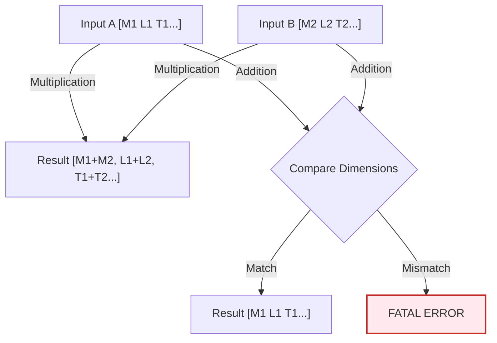

# การตรวจสอบมิติทางกายภาพ (Dimensional Checking)

![[dimensional_safety_net.png]]
> **Academic Vision:** A tight safety net woven from SI unit symbols (kg, m, s). A physics equation is trying to fall through, but the net catches it because its dimensions are consistent. If the dimensions were wrong, the net would glow red and block it. Professional, clean illustration.

OpenFOAM มีระบบการตรวจสอบหน่วย (Units) ที่เข้มงวดที่สุดระบบหนึ่งในซอฟต์แวร์วิศวกรรม เพื่อป้องกันข้อผิดพลาดที่ไม่มีความหมายทางฟิสิกส์ (เช่น การเอาความดันไปบวกกับอุณหภูมิ)

---

## 📋 สารบัซ

- [1. ระบบหน่วยฐาน SI ทั้ง 7](#1-ระบบหน่วยฐาน-si-ทั้ง-7)
- [2. โครงสร้างคลาส DimensionSet](#2-โครงสร้างคลาส-dimensionset)
- [3. กฎพีชคณิตมิติ](#3-กฎพีชคณิตมิติ)
- [4. การตรวจสอบระดับโค้ด](#4-การตรวจสอบระดับโค้ด)
- [5. ปริมาณทางกายภาพทั่วไป](#5-ปริมาณทางกายภาพทั่วไป)
- [6. การตรวจสอบความสม่ำเสมอของมิติ](#6-การตรวจสอบความสม่ำเสมอของมิติ)
- [7. การวิเคราะห์มิติในสมการ Navier-Stokes](#7-การวิเคราะห์มิติในสมการ-navier-stokes)
- [8. ตัวอย่างข้อผิดพลาดและการแก้ไข](#8-ตัวอย่างข้อผิดพลาดและการแก้ไข)

---

## 1. ระบบหน่วยฐาน SI ทั้ง 7

OpenFOAM แทนมิติทางกายภาพด้วยรายการตัวเลข 7 ตัว ซึ่งสอดคล้องกับหน่วยฐาน SI ดังนี้:

| ลำดับ | มิติ | หน่วยฐาน SI | สัญลักษณ์ใน OpenFOAM | ตัวอย่างหน่วย |
|:---|:---|:---|:---|:---|
| 1 | **มวล** | กิโลกรัม (kg) | $M$ | kg |
| 2 | **ความยาว** | เมตร (m) | $L$ | m |
| 3 | **เวลา** | วินาที (s) | $T$ | s |
| 4 | **อุณหภูมิ** | เคลวิน (K) | $\Theta$ | K |
| 5 | **ปริมาณสาร** | โมล (mol) | $N$ | mol |
| 6 | **กระแสไฟฟ้า** | แอมแปร์ (A) | $I$ | A |
| 7 | **ความเข้มแสง** | แคนเดลา (cd) | $J$ | cd |

### การเขียนมิติในไฟล์ OpenFOAM

ในไฟล์ค่าขอบเขต (boundary field files) มิติจะถูกระบุในรูปแบบ:

```
dimensions [1 -1 -2 0 0 0 0];
```

ซึ่งหมายถึง:
$$M^1 \cdot L^{-1} \cdot T^{-2} \cdot \Theta^0 \cdot N^0 \cdot I^0 \cdot J^0 = \frac{\text{kg}}{\text{m} \cdot \text{s}^2} = \text{Pa}$$

---

## 2. โครงสร้างคลาส DimensionSet

OpenFOAM ใช้คลาส `dimensionSet` เพื่อเข้ารหัสมิติทางกายภาพของปริมาณตามระบบ SI

### การประกาศ DimensionSet

```cpp
// รูปแบบการประกาศ
dimensionSet dims(mass, length, time, temperature, moles, current, luminous_intensity);

// ตัวอย่าง: ความเร็วมีมิติ [L][T]^-1
dimensionSet velocityDim(0, 1, -1, 0, 0, 0, 0);

// ตัวอย่าง: แรงมีมิติ [M][L][T]^-2
dimensionSet forceDim(1, 1, -2, 0, 0, 0, 0);

// ตัวอย่าง: ความดันมีมิติ [M][L]^-1[T]^-2
dimensionSet pressureDim(1, -1, -2, 0, 0, 0, 0);
```

### โครงสร้างภายใน

```cpp
class dimensionSet
{
private:
    scalar exponents_[7];  // เลขชี้กำลังสำหรับแต่ละมิติพื้นฐาน

public:
    // Constructor
    dimensionSet(scalar M, scalar L, scalar T, scalar Θ,
                 scalar N, scalar I, scalar J);

    // Operator overloading สำหรับการคำนวณมิติ
    dimensionSet operator+(const dimensionSet&) const;
    dimensionSet operator*(const dimensionSet&) const;
    dimensionSet operator/(const dimensionSet&) const;
    dimensionSet pow(const scalar) const;
};
```

---

## 3. กฎพีชคณิตมิติ

ระบบจะคำนวณหน่วยใหม่ให้โดยอัตโนมัติตามกฎคณิตศาสตร์:

### แผนภาพการคำนวณมิติ


> **Figure 1:** กฎการคำนวณมิติทางฟิสิกส์สำหรับการดำเนินการต่างๆ โดยระบบจะตรวจสอบความสอดคล้องของหน่วยสำหรับการบวก/ลบ และคำนวณเลขชี้กำลังใหม่สำหรับการคูณ/หารโดยอัตโนมัติความปลอดภัยทางฟิสิกส์ไม่ส่งผลกระทบต่อความเร็วในการจำลอง ผ่านการใช้พลังของ C++ Template Metaprogramming ในการตรวจสอบความสอดคล้องทางมิติทั้งหมดที่ขั้นตอนการคอมไพล์โปรแกรมเพียงครั้งเดียว

### กฎการดำเนินการ

| การดำเนินการ | กฎมิติ | ตัวอย่าง |
|:---|:---|:---|
| **การคูณ (*)** | นำเลขชี้กำลังมาบวกกัน | $[L/T] \cdot [T] = [L]$ |
| **การหาร (/)** | นำเลขชี้กำลังมาลบกัน | $[M]/[L^3] = [M \cdot L^{-3}]$ |
| **การยกกำลัง (^)** | คูณเลขชี้กำลังด้วยเลขกำลัง | $[L]^2 = [L^2]$ |
| **การบวก/ลบ (+, -)** | **มิติต้องเหมือนกันทุกตำแหน่ง** | หากไม่ตรงกัน → Fatal Error |

### ตัวอย่างการคำนวณมิติ

```cpp
// ตัวอย่างที่ 1: ความเร็ว × เวลา = ระยะทาง
dimensionSet velocityDim(0, 1, -1, 0, 0, 0, 0);  // [L T^-1]
dimensionSet timeDim(0, 0, 1, 0, 0, 0, 0);       // [T]
dimensionSet distanceDim = velocityDim * timeDim; // [L T^-1 × T] = [L]

// ตัวอย่างที่ 2: ความหนาแน่น = มวล / ปริมาตร
dimensionSet massDim(1, 0, 0, 0, 0, 0, 0);        // [M]
dimensionSet volumeDim(0, 3, 0, 0, 0, 0, 0);      // [L^3]
dimensionSet densityDim = massDim / volumeDim;    // [M L^-3]

// ตัวอย่างที่ 3: พลังงานจลน์ = 0.5 × มวล × ความเร็ว²
dimensionSet velocitySquared = velocityDim.pow(2); // [L^2 T^-2]
dimensionSet kineticEnergyDim = massDim * velocitySquared; // [M L^2 T^-2]
```

---

## 4. การตรวจสอบระดับโค้ด

### การใช้งาน dimensionedScalar

```cpp
// การประกาศหน่วยความเร็ว [0 1 -1 0 0 0 0]
dimensionSet dimVelocity(0, 1, -1, 0, 0, 0, 0);

dimensionedScalar U_mag
(
    "U_mag",           // ชื่อ
    dimVelocity,       // มิติ
    10.0               // ค่า (m/s)
);

// การประกาศหน่วยเวลา
dimensionedScalar dt
(
    "dt",
    dimTime,           // [0 0 1 0 0 0 0]
    0.01               // วินาที
);

// ระบบจะคำนวณหน่วยของผลลัพธ์ให้อัตโนมัติ
dimensionedVector dx = U_mag * dt; // dx จะมีหน่วยเป็น dimLength โดยอัตโนมัติ
```

### การสร้างฟิลด์พร้อมมิติ

```cpp
// ฟิลด์ความดัน
volScalarField p
(
    IOobject
    (
        "p",
        runTime.timeName(),
        mesh,
        IOobject::MUST_READ,
        IOobject::AUTO_WRITE
    ),
    mesh,
    dimensionSet(1, -1, -2, 0, 0, 0, 0)  // [M L^-1 T^-2] = Pa
);

// ฟิลด์ความเร็ว
volVectorField U
(
    IOobject
    (
        "U",
        runTime.timeName(),
        mesh,
        IOobject::MUST_READ,
        IOobject::AUTO_WRITE
    ),
    mesh,
    dimensionSet(0, 1, -1, 0, 0, 0, 0)  // [L T^-1] = m/s
);

// ฟิลด์ความหนาแน่น
volScalarField rho
(
    IOobject
    (
        "rho",
        runTime.timeName(),
        mesh,
        IOobject::MUST_READ,
        IOobject::AUTO_WRITE
    ),
    mesh,
    dimensionSet(1, -3, 0, 0, 0, 0, 0)  // [M L^-3] = kg/m³
);
```

---

## 5. ปริมาณทางกายภาพทั่วไป

### ปริมาณกลศาสตร์

| ปริมาณทางกายภาพ | สัญลักษณ์มิติ | หน่วย SI | การเขียนใน OpenFOAM |
|:---|:---|:---|:---|
| ความเร็ว | $[L][T]^{-1}$ | m/s | `[0 1 -1 0 0 0 0]` |
| ความเร่ง | $[L][T]^{-2}$ | m/s² | `[0 1 -2 0 0 0 0]` |
| แรง | $[M][L][T]^{-2}$ | N | `[1 1 -2 0 0 0 0]` |
| ความดัน | $[M][L]^{-1}[T]^{-2}$ | Pa | `[1 -1 -2 0 0 0 0]` |
| ความหนาแน่น | $[M][L]^{-3}$ | kg/m³ | `[1 -3 0 0 0 0 0]` |
| ความหนืดพลวัต | $[M][L]^{-1}[T]^{-1}$ | Pa·s | `[1 -1 -1 0 0 0 0]` |
| ความหนืดจลน์ | $[L]^2[T]^{-1}$ | m²/s | `[0 2 -1 0 0 0 0]` |
| พลังงาน | $[M][L]^2[T]^{-2}$ | J | `[1 2 -2 0 0 0 0]` |

### ปริมาณความร้อน

| ปริมาณทางกายภาพ | สัญลักษณ์มิติ | หน่วย SI | การเขียนใน OpenFOAM |
|:---|:---|:---|:---|
| อุณหภูมิ | $[\Theta]$ | K | `[0 0 0 1 0 0 0]` |
| การไหลของความร้อน | $[M][T]^{-3}$ | W/m² | `[1 0 -3 0 0 0 0]` |
| ความนำความร้อน | $[M][L][T]^{-3}[\Theta]^{-1}$ | W/(m·K) | `[1 1 -3 -1 0 0 0]` |
| ความร้อนจำเพาะ | $[L]^2[T]^{-2}[\Theta]^{-1}$ | J/(kg·K) | `[0 2 -2 -1 0 0 0]` |

### ปริมาณหลายเฟส

| ปริมาณทางกายภาพ | สัญลักษณ์มิติ | ช่วง | การเขียนใน OpenFOAM |
|:---|:---|:---|:---|
| ปริมาตรส่วน | ไร้มิติ | 0 ถึง 1 | `[0 0 0 0 0 0 0]` |
| มวลส่วน | ไร้มิติ | 0 ถึง 1 | `[0 0 0 0 0 0 0]` |
| ความตึงผิว | $[M][T]^{-2}$ | N/m | `[1 0 -2 0 0 0 0]` |
| ความหนาแน่นพื้นที่อินเตอร์เฟซ | $[L]^{-1}$ | m⁻¹ | `[0 -1 0 0 0 0 0]` |

---

## 6. การตรวจสอบความสม่ำเสมอของมิติ

ระบบมิติให้การตรวจสอบอัตโนมัติว่าการดำเนินการทางคณิตศาสตร์มีความหมายทางกายภาพ

### การบวก/ลบ

ตัวถูกดำเนินการทั้งสองต้องมีมิติเหมือนกัน:

```cpp
// ✅ ถูกต้อง: ความดัน + ความดัน (ทั้งสองมีมิติ [M][L]^-1[T]^-2)
volScalarField totalPressure = staticPressure + dynamicPressure;

// ❌ ไม่ถูกต้อง: ความเร็ว + อุณหภูมิ (ความไม่ตรงกันของมิติจะถูกจับในเวลาคอมไพล์)
// volScalarField invalidField = velocityField + temperatureField;  // ข้อผิดพลาดคอมไพเลอร์
```

### การคูณ/หาร

มิติรวมกันทางพีชคณิต:

```cpp
// ✅ โมเมนตัม = ความหนาแน่น × ความเร็ว
// [M][L]^-3 × [L][T]^-1 = [M][L]^-2[T]^-1
volVectorField momentum = rho * U;

// ✅ พลังงานจลน์ต่อหน่วยมวล = 0.5 × ความเร็ว²
// [L]²[T]^-2 = [L]²[T]^-2
volScalarField kineticEnergy = 0.5 * magSqr(U);

// ✅ ความดันจลน์ = 0.5 × ความหนาแน่น × ความเร็ว²
// [M][L]^-3 × [L]²[T]^-2 = [M][L]^-1[T]^-2 (ความดัน)
volScalarField dynamicPressure = 0.5 * rho * magSqr(U);
```

### เลขชี้กำลัง/ลอการิทึม

อาร์กิวเมนต์ต้องไร้มิติ:

```cpp
// ✅ ถูกต้อง: exp(dimensionlessQuantity)
volScalarField result = exp(volumeFraction);

// ❌ ไม่ถูกต้อง: log(pressure) - ความดันมีมิติ ต้องใช้อัตราส่วนไร้มิติ
// volScalarField invalid = log(pressure);  // ข้อผิดพลาดรันไทม์

// ✅ ถูกต้อง: ใช้อัตราส่วน
volScalarField valid = log(pressure/referencePressure);
```

---

## 7. การวิเคราะห์มิติในสมการ Navier-Stokes

ระบบการวิเคราะห์มิติขยายไปถึงการตรวจสอบความสอดคล้องของสมการทั้งหมด

### สมการโมเมนตัม Navier-Stokes

$$\rho \frac{\partial \mathbf{u}}{\partial t} + \rho (\mathbf{u} \cdot \nabla) \mathbf{u} = -\nabla p + \mu \nabla^2 \mathbf{u} + \mathbf{f}$$

### การวิเคราะห์มิติของแต่ละเทอม

| เทอม | นิพจน์ | การวิเคราะห์มิติ | ผลลัพธ์ |
|:---|:---|:---|:---|
| **เทอมเฉื่อย** | $\rho \frac{\partial \mathbf{u}}{\partial t}$ | $[M L^{-3}] \cdot [L T^{-2}]$ | $[M L^{-2} T^{-2}]$ |
| **เทอมนำพา** | $\rho (\mathbf{u} \cdot \nabla) \mathbf{u}$ | $[M L^{-3}] \cdot [L T^{-1}] \cdot [L^{-1}] \cdot [L T^{-1}]$ | $[M L^{-2} T^{-2}]$ |
| **ไกรเอนต์ความดัน** | $-\nabla p$ | $[L^{-1}] \cdot [M L^{-1} T^{-2}]$ | $[M L^{-2} T^{-2}]$ |
| **แรงเหนียว** | $\mu \nabla^2 \mathbf{u}$ | $[M L^{-1} T^{-1}] \cdot [L^{-2}] \cdot [L T^{-1}]$ | $[M L^{-2} T^{-2}]$ |
| **แรงต่อวัตถุ** | $\mathbf{f}$ | แรงต่อปริมาตรหน่วย | $[M L^{-2} T^{-2}]$ |

**ผลลัพธ์**: ทุกเทอมมีมิติที่สอดคล้องกัน: $[M L^{-2} T^{-2}]$ ✅

### การ Implement ใน OpenFOAM

```cpp
// สมการโมเมนตัมที่มีความสม่ำเสมอทางมิติ
fvVectorMatrix UEqn
(
    fvm::ddt(rho, U)           // [M/(L²T)] - เทอมเฉื่อย
  + fvm::div(rhoPhi, U)        // [M/(L²T)] - เทอมนำพา
  + turbulence->divDevRhoReff(U) // [M/(L²T)] - แรงเหนียว
  ==
    sources.constrain(UEqn)    // [M/(L²T)] - แหล่งกำเนิด
);
```

---

## 8. ตัวอย่างข้อผิดพลาดและการแก้ไข

### ข้อผิดพลาดที่ 1: ความไม่สอดคล้องของมิติ

**ปัญหา**: พยายามดำเนินการระหว่างประเภทฟิลด์ที่ไม่เข้ากัน

```cpp
// ❌ ข้อผิดพลาด
volScalarField wrong = p + U;  // ไม่สามารถบวกสเกลาร์กับเวกเตอร์ได้
```

**สาเหตุหลัก**: พยายามบวกฟิลด์ความดัน (สเกลาร์) กับฟิลด์ความเร็ว (เวกเตอร์)

**วิธีแก้ไข**:

| กรณีที่ต้องการ | โซลูชันที่ถูกต้อง | คำอธิบาย |
|:---|:---|:---|
| ความดันจลน์ | `p + 0.5 * rho * magSqr(U)` | ใช้ dot product สำหรับพลังงานจลน์ |
| ความดันบวกขนาดความเร็ว | `p + mag(U)` | ใช้ magnitude สำหรับขนาดเวกเตอร์ |
| องค์ประกอบความเร็วที่เฉพาะเจาะจง | `p + U.component(0)` | ใช้ component access สำหรับแกน x |

### ข้อผิดพลาดที่ 2: ข้อความแสดงข้อผิดพลาด Fatal Error

หากคุณทำผิดกฎฟิสิกส์ OpenFOAM จะแจ้ง Error ลักษณะนี้:

```text
--> FOAM FATAL ERROR:
Dimensions of fields are not compatible for operation
    [p] = [1 -1 -2 0 0 0 0]
    [U] = [0 1 -1 0 0 0 0]
    Operation: addition
```

### ข้อผิดพลาดที่ 3: การละเมิดขอบเขตอาร์เรย์

```cpp
// ❌ อันตราย: เข้าถึงขอบเขตเกิน patches ที่มี
label badPatch = mesh.boundary().size();  // นอกขอบเขต!
scalarField& badField = T.boundaryField()[badPatch];  // Segmentation fault

// ✅ รูปแบบที่ปลอดภัย
if (patchID < mesh.boundary().size())
{
    scalarField& patchField = T.boundaryField()[patchID];
    // การดำเนินการที่ปลอดภัย
}
```

### ข้อผิดพลาดที่ 4: ความล้มเหลวในการวิเคราะห์มิติ

```cpp
// ❌ ข้อผิดพลาดที่ละเอียด: อนุพันธ์ตามเวลามีหน่วยผิด
volScalarField dTdt = fvc::ddt(T);  // ถูกต้อง: [K/s]
volScalarField wrong = dTdt * T;    // ผิด: [K²/s]
volScalarField correct = dTdt * rho*T;  // ถูกต้อง: [kg·K/(m³·s)]
```

---

## 📊 สรุป

### ประโยชน์ของระบบวิเคราะห์มิติ

> [!INFO] **Safety Net for CFD**
> ระบบการตรวจสอบมิติของ OpenFOAM ทำหน้าที่เป็น "ตาข่ายนิรภัย" (Safety Net) ที่ช่วยให้วิศวกร CFD มั่นใจได้ว่าโค้ดที่เขียนออกมาจะเคารพกฎของธรรมชาติเสมอ

**ข้อดีหลัก:**

1. **ป้องกันข้อผิดพลาดในการนำไปใช้** ในการจำลอง CFD ที่ซับซ้อน
2. **ทำให้มั่นใจในความถูกต้องทางคณิตศาสตร์** ตลอดการจำลอง
3. **ตรวจสอบความสอดคล้องของสมการฟิสิกส์หลายสมการ** ที่เชื่อมโยงกัน
4. **ช่วยในการ debug และการพัฒนา** โดยการตรวจจับข้อผิดพลาดเชิงมิติในช่วงต้น
5. **การตรวจสอบข้อผิดพลาดตั้งแต่เนิ่นๆ** ระหว่างการคอมไพล์หรือรันไทม์
6. **ความสม่ำเสมอทางกายภาพ** โดยตรวจจับความไม่ตรงกันของหน่วย
7. **ความช่วยเหลือในการดีบัก** เมื่อมิติไม่ตรงกับที่คาดหวัง

**การใช้งานที่ถูกต้อง:**

```cpp
// ✅ ดี: การระบุมิติแบบเต็ม
dimensionedScalar nu
(
    "nu",
    dimensionSet(0, 2, -1, 0, 0, 0, 0),  // [L^2/T] - ความหนืดเคลื่อนที่
    1.5e-5
);

// ✅ ดีกว่า: การใช้มิติที่กำหนดไว้ล่วงหน้า
dimensionedScalar nu
(
    "nu",
    dimViscosity,  // เทียบเท่ากับ [L^2/T]
    1.5e-5
);
```

**แนวทางปฏิบัตินี้ช่วยให้:**
- การตรวจจับข้อผิดพลาดตั้งแต่เนิ่นๆ ระหว่างการคอมไพล์
- ความสม่ำเสมอทางกายภาพ ตลอดการคำนวณ
- โค้ดที่บำรุงรักษาง่าย ด้วยหน่วยที่ชัดเจน
- ประโยชน์จากการจัดทำเอกสาร ผ่านโค้ดที่อธิบายตนเอง

---

## 🔗 ลิงก์ที่เกี่ยวข้อง

- [[01_🎯_Learning_Objectives]]
- [[02_📋_Prerequisites]]
- [[03_1._The_Hook_Excel_Sheets_vs._CFD_Fields]]
- [[05_3._Internal_Mechanics_Template_Parameters_Explained]]
- [[06_4._The_Mechanism_How_Fields_Map_to_Mesh]]
- [[08_6._Usage_&_Error_Examples]]

---

## 📚 อ้างอิง

1. OpenFOAM Programmer's Guide - DimensionSet and Dimensioned Types
2. OpenFOAM Source Code: `src/OpenFOAM/dimension/dimensionSet/dimensionSet.H`
3. OpenFOAM Source Code: `src/OpenFOAM/dimension/dimensionedTypes/dimensionedScalar.H`
4. SI Brochure: The International System of Units (SI), 9th edition (2019)
5. ISO 80000-1:2009 - Quantities and units — Part 1: General
