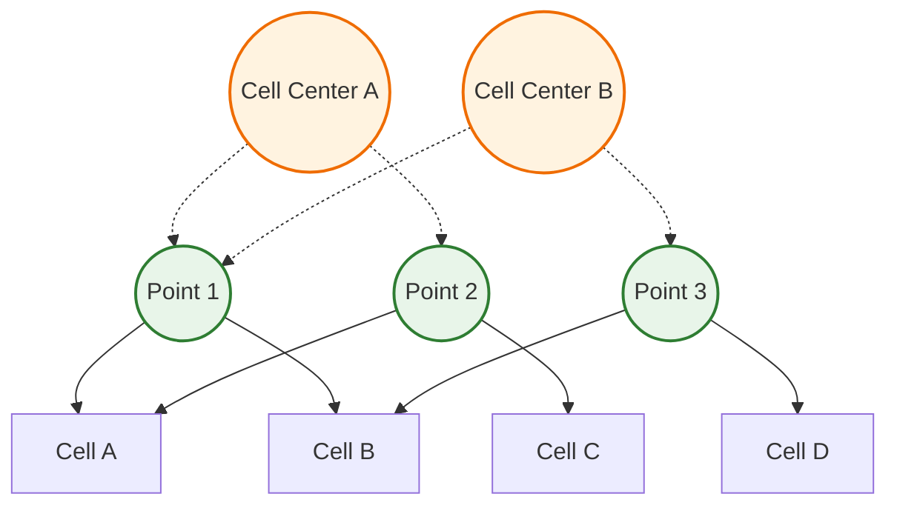

# Point Fields (pointFields)

![[vertices_skeleton.png]]

> [!INFO] Overview
> **Point fields** store values at mesh vertices (points/vertices) rather than cell centers or face centers. They are essential for mesh deformation, mesh motion, and certain visualization/interpolation operations.

---

## 📋 Table of Contents

1. [[04_Point_Fields#what-are-point-fields|What Are Point Fields?]]
2. [[04_Point_Fields#pointmesh-geometry|PointMesh Geometry]]
3. [[04_Point_Fields#point-field-types|Point Field Types]]
4. [[04_Point_Fields#when-to-use-point-fields|When to Use Point Fields]]
5. [[04_Point_Fields#internal-vs-boundary|Internal vs Boundary]]
6. [[04_Point_Fields#code-examples|Code Examples]]
7. [[04_Point_Fields#common-operations|Common Operations]]
8. [[04_Point_Fields#performance-considerations|Performance Considerations]]

---

## What Are Point Fields?

### Definition

Point fields are geometric fields defined on the **pointMesh**, which represents the mesh vertices (corner points of cells). Unlike `volFields` (cell-centered) or `surfaceFields` (face-centered), point fields store one value per mesh point.

### Template Signature

```cpp
template<class Type, template<class> class PatchField, class GeoMesh>
class GeometricField;
```

For point fields, this becomes:
```cpp
GeometricField<Type, pointPatchField, pointMesh>
```

### Key Characteristics

| Property | Description |
|----------|-------------|
| **Data Location** | Mesh vertices (points) |
| **Number of Values** | Equals number of mesh points |
| **Patch Type** | `pointPatchField<Type>` |
| **Mesh Type** | `pointMesh` |
| **Primary Use** | Mesh deformation, motion, displacement |

---

## PointMesh Geometry

### Relationship to Cell Centers



### Mathematical Representation

For a point field $\phi_p$ at each mesh point $p$:

$$\phi_p = \phi(\mathbf{x}_p)$$

where $\mathbf{x}_p$ are the coordinates of point $p$.

The number of points $N_p$ relates to cells and faces by:
$$N_p \approx N_c + N_f$$

where $N_c$ is the number of cells and $N_f$ is the number of faces (for typical 3D meshes).

---

## Point Field Types

### Available Point Field Types

| Field Type | Template Definition | Usage Example |
|-----------|---------------------|---------------|
| **pointScalarField** | `GeometricField<scalar, pointPatchField, pointMesh>` | Point displacement magnitude |
| **pointVectorField** | `GeometricField<vector, pointPatchField, pointMesh>` | Mesh displacement, motion |
| **pointTensorField** | `GeometricField<tensor, pointPatchField, pointMesh>` | Point deformation gradients |

### Common Point Field Applications

```cpp
// Displacement field (most common)
pointVectorField pointDisplacement
(
    IOobject
    (
        "pointDisplacement",
        runTime.timeName(),
        mesh,
        IOobject::MUST_READ,
        IOobject::AUTO_WRITE
    ),
    pMesh  // pointMesh reference
);

// Velocity at points
pointVectorField pointU
(
    IOobject("pointU", runTime.timeName(), mesh),
    pMesh,
    dimensionedVector("pointU", dimVelocity, vector::zero)
);

// Scalar field at points
pointScalarField pointAlpha
(
    IOobject("pointAlpha", runTime.timeName(), mesh),
    pMesh,
    dimensionedScalar("pointAlpha", dimless, 0.0)
);
```

---

## When to Use Point Fields

### Use Cases

> [!TIP] Primary Use Case
> **Mesh Deformation**: Point fields are primarily used in dynamic mesh simulations where the mesh itself moves or deforms.

| Application | Point Field Type | Purpose |
|------------|-----------------|---------|
| **Dynamic Meshes** | `pointVectorField` | Store displacement of each point |
| **Moving Boundaries** | `pointVectorField` | Control boundary motion |
| **Mesh Quality** | `pointScalarField` | Monitor point-based quality metrics |
| **Visualization** | Any | Interpolate cell data to points for rendering |
| **Finite Element** | Any | Node-based field storage |

### When NOT to Use Point Fields

- ❌ **Standard CFD calculations** (use `volFields`)
- ❌ **Flux calculations** (use `surfaceFields`)
- ❌ **Most turbulence modeling** (use `volFields`)
- ❌ **Transport equations** (use `volFields`)

---

## Internal vs Boundary

### Memory Layout

Point fields follow the same `GeometricField` architecture:

```cpp
class GeometricField
{
private:
    // Internal point values (all mesh points)
    DimensionedField<Type, pointMesh> internalField_;

    // Boundary point values
    GeometricBoundaryField<Type, pointPatchField, pointMesh> boundaryField_;
};
```

### PointMesh Construction

```cpp
// pointMesh is constructed from the base fvMesh
const fvMesh& mesh = ...;
pointMesh pMesh(mesh);

// Info about pointMesh
Info << "Number of points: " << pMesh.nPoints() << nl;
Info << "Number of boundary points: " << pMesh.boundary().nPoints() << nl;
```

### Accessing Point Data

```cpp
// Access all internal points
const vectorField& points = pMesh.points();

// Access point field values
pointVectorField pointDisplacement(pMesh);
forAll(pointDisplacement, pointI)
{
    pointDisplacement[pointI] = vector::zero;  // Initialize
}

// Access boundary patch points
label patchID = mesh.boundaryMesh().findPatchID("movingWall");
const pointPatch& pp = pMesh.boundary()[patchID];
```

---

## Code Examples

### Creating a Point Field

```cpp
// Example 1: Create displacement field from file
pointVectorField pointDisplacement
(
    IOobject
    (
        "pointDisplacement",
        runTime.timeName(),
        mesh,
        IOobject::MUST_READ,      // Read from file
        IOobject::AUTO_WRITE      // Write automatically
    ),
    pointMesh::New(mesh)          // Construct pointMesh
);

// Example 2: Create programmatically
pointVectorField pointVelocity
(
    IOobject
    (
        "pointVelocity",
        runTime.timeName(),
        mesh,
        IOobject::NO_READ,        // Don't read from file
        IOobject::AUTO_WRITE
    ),
    pointMesh::New(mesh),
    dimensionedVector("pointVelocity", dimVelocity, vector::zero)
);

// Example 3: Create from existing field
pointScalarField pointMagU
(
    IOobject
    (
        "pointMagU",
        runTime.timeName(),
        mesh,
        IOobject::NO_READ,
        IOobject::AUTO_WRITE
    ),
    pointMesh::New(mesh),
    mag(pointU)  // Magnitude of point velocity
);
```

### Setting Boundary Conditions

```cpp
// Fixed value on boundary
label patchID = mesh.boundaryMesh().findPatchID("movingWall");
pointVectorField::Boundary& pointDispBF =
    pointDisplacement.boundaryFieldRef();

pointDispBF[patchID] = vector(0, 0, 0.01*sin(runTime.value()));  // Oscillating
```

### Interpolating to Points

```cpp
// Interpolate cell-centered field to points
volVectorField U(mesh);  // Cell-centered velocity
pointVectorField pointU
(
    IOobject("pointU", runTime.timeName(), mesh),
    pointMesh::New(mesh),
    dimensionedVector("0", dimVelocity, vector::zero)
);

// Simple interpolation (average of neighbor cells)
const labelListList& pointCells = mesh.pointCells();
forAll(pointU, pointI)
{
    vector avgU = vector::zero;
    const labelList& cells = pointCells[pointI];
    forAll(cells, cellI)
    {
        avgU += U[cells[cellI]];
    }
    pointU[pointI] = avgU / cells.size();
}
```

### Mesh Deformation Example

```cpp
// Apply sinusoidal motion to points
pointVectorField pointDisplacement
(
    IOobject("pointDisplacement", runTime.timeName(), mesh),
    pointMesh::New(mesh)
);

const vectorField& points = mesh.points();
forAll(pointDisplacement, pointI)
{
    scalar x = points[pointI].x();
    scalar y = points[pointI].y();

    // Sinusoidal displacement in z-direction
    pointDisplacement[pointI] = vector
    (
        0,
        0,
        0.01 * Foam::sin(2*pi*x) * Foam::sin(2*pi*y)
    );
}

// Update mesh points
vectorField newPoints = points + pointDisplacement;
polyMesh::movePoints(newPoints);
```

---

## Common Operations

### Field Operations

```cpp
// Magnitude
pointScalarField magDisp = mag(pointDisplacement);

// Component access
pointScalarField dispZ = pointDisplacement.component(2);

// Addition
pointVectorField totalDisp = pointDisplacement1 + pointDisplacement2;

// Scaling
pointVectorField scaledDisp = 2.5 * pointDisplacement;

// Inner product
pointScalarField dotProd = pointDisplacement & pointNormal;
```

### Gradient and Divergence

```cpp
// Gradient at points (requires interpolation)
volVectorField cellU(mesh);
pointVectorField pointU = interpolate(cellU);

// Gradient is typically computed on cells, then interpolated
volTensorField gradU = fvc::grad(cellU);
pointTensorField pointGradU = interpolateToPoints(gradU);

// Divergence
volScalarField divU = fvc::div(cellU);
pointScalarField pointDivU = interpolateToPoints(divU);
```

### Time Integration

```cpp
// Old time field access
pointVectorField& pointDisp = pointDisplacement;
pointVectorField pointDispOld = pointDisp.oldTime();

// First-order time derivative
pointVectorField dDispDt =
    (pointDisp - pointDispOld) / runTime.deltaTValue();

// Backward difference
pointVectorField pointDispOldOld = pointDisp.oldTime().oldTime();
pointVectorField dDispDt_secondOrder =
    (1.5*pointDisp - 2.0*pointDispOld + 0.5*pointDispOldOld)
    / runTime.deltaTValue();
```

---

## Performance Considerations

### Memory Usage

Point fields typically have **more values** than cell-centered fields:

$$N_{points} \approx 1.5 \times N_{cells} \quad \text{(for 3D hex meshes)}$$

| Field Type | Typical Size (vs. Cells) |
|-----------|------------------------|
| `volScalarField` | $1.0 \times N_{cells}$ |
| `pointScalarField` | $1.5 \times N_{cells}$ |
| `surfaceScalarField` | $0.5 \times N_{cells}$ |

### Cache Efficiency

```cpp
// GOOD: Sequential access
forAll(pointField, pointI)
{
    pointField[pointI] = value;
}

// AVOID: Random access patterns
forAll(cells, cellI)
{
    label pointI = mesh.cells()[cellI][0];  // Indirect
    pointField[pointI] = value;  // Cache miss
}
```

### Interpolation Cost

Interpolating from cell-centered to point fields is expensive:

```cpp
// Expensive operation - avoid in tight loops
pointVectorField pointU = interpolateToPoints(cellU);  // O(N_points)
```

**Optimization**: Cache interpolated values when used multiple times.

---

## 🎯 Summary: Key Takeaways

> [!INFO] Main Points
>
> 1. **Point fields store values at mesh vertices**, not cell centers
> 2. **Primary use**: Mesh deformation and motion (dynamic meshes)
> 3. **Template**: `GeometricField<Type, pointPatchField, pointMesh>`
> 4. **Memory**: ~1.5× larger than equivalent volFields
> 5. **Performance**: Avoid frequent cell→point interpolation
> 6. **Access**: Use `pointMesh::New(mesh)` to construct point mesh

---

## 📚 Further Reading

- [[11_📚_Further_Reading|Further Reading]] - Additional resources
- [[03_1._The_Hook_Excel_Sheets_vs._CFD_Fields|The Hook]] - Field concept introduction
- [[00_Overview|Module Overview]] - Full module context

---

**Next**: [[05_3._Internal_Mechanics_Template_Parameters_Explained|Template Parameters Explained]] →
