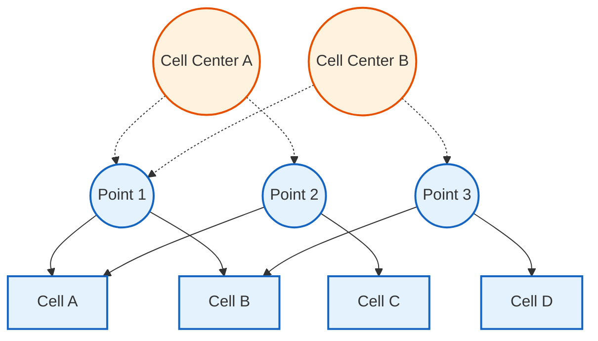

# Point Fields (pointFields)

![[vertices_skeleton.png]]

> [!INFO] Overview
> **Point fields** store values at mesh vertices (points/vertices) rather than cell centers or face centers. They are essential for mesh deformation, mesh motion, and certain visualization/interpolation operations.

---

## 📋 Table of Contents

1. [[04_Point_Fields#what-are-point-fields|What Are Point Fields?]]
2. [[04_Point_Fields#pointmesh-geometry|PointMesh Geometry]]
3. [[04_Point_Fields#point-field-types|Point Field Types]]
4. [[04_Point_Fields#when-to-use-point-fields|When to Use Point Fields]]
5. [[04_Point_Fields#internal-vs-boundary|Internal vs Boundary]]
6. [[04_Point_Fields#code-examples|Code Examples]]
7. [[04_Point_Fields#common-operations|Common Operations]]
8. [[04_Point_Fields#performance-considerations|Performance Considerations]]

---

## What Are Point Fields?

### Definition

Point fields are geometric fields defined on the **pointMesh**, which represents the mesh vertices (corner points of cells). Unlike `volFields` (cell-centered) or `surfaceFields` (face-centered), point fields store one value per mesh point.

### Template Signature

```cpp
// Template signature for GeometricField
// Type: the data type (scalar, vector, tensor, etc.)
// PatchField: the boundary condition template
// GeoMesh: the mesh type (pointMesh in this case)
template<class Type, template<class> class PatchField, class GeoMesh>
class GeometricField;
```

> **📂 Source:** `src/OpenFOAM/fields/GeometricFields/GeometricField/GeometricField.H`

```cpp
// Point field specialization
// pointPatchField: boundary condition for point fields
// pointMesh: mesh type for point-based data
GeometricField<Type, pointPatchField, pointMesh>
```

> **💡 Explanation (คำอธิบาย):**
> ใน OpenFOAM นั้น **GeometricField** เป็นคลาสเทมเพลตหลักที่ใช้เก็บข้อมูลฟิสิกส์บนเมช โดยมีพารามิเตอร์เทมเพลต 3 ตัวที่กำหนดลักษณะของฟิลด์:
> 
> - **Type**: ประเภทข้อมูล เช่น `scalar`, `vector`, `tensor`, `symmTensor`
> - **PatchField**: ประเภทของเงื่อนไขขอบเขตสำหรับแต่ละพื้นที่แพตช์ สำหรับ pointFields คือ `pointPatchField`
> - **GeoMesh**: ประเภทของเมชที่ใช้เก็บตำแหน่งข้อมูล สำหรับ pointFields คือ `pointMesh`
> 
> การออกแบบแบบเทมเพลตนี้ทำให้ OpenFOAM สามารถรองรับหลายประเภทของฟิลด์ด้วยคลาสเดียว แต่มีความปลอดภัยทาง type-safe สูง
>
> **🔑 Key Concepts (แนวคิดสำคัญ):**
> - **Template Metaprogramming**: การใช้ C++ templates สร้าง type-safe field system
> - **Code Reuse**: เขียนคลาสเดียวใช้ได้กับทุกประเภทของฟิลด์
> - **Compile-time Polymorphism**: ตรวจสอบชนิดข้อมูลขณะ compile ไม่ใช่ runtime

### Key Characteristics

| Property | Description |
|----------|-------------|
| **Data Location** | Mesh vertices (points) |
| **Number of Values** | Equals number of mesh points |
| **Patch Type** | `pointPatchField<Type>` |
| **Mesh Type** | `pointMesh` |
| **Primary Use** | Mesh deformation, motion, displacement |

---

## PointMesh Geometry

### Relationship to Cell Centers


> **Figure 1:** ความสัมพันธ์เชิงพื้นที่ระหว่างจุดยอด (Points) และจุดศูนย์กลางเซลล์ (Cell Centers) ซึ่งเป็นพื้นฐานในการทำ Interpolation ข้อมูลระหว่างตำแหน่งต่างๆ ในเมช

### Mathematical Representation

For a point field $\phi_p$ at each mesh point $p$:

$$\phi_p = \phi(\mathbf{x}_p)$$

where $\mathbf{x}_p$ are the coordinates of point $p$.

The number of points $N_p$ relates to cells and faces by:
$$N_p \approx N_c + N_f$$

where $N_c$ is the number of cells and $N_f$ is the number of faces (for typical 3D meshes).

---

## Point Field Types

### Available Point Field Types

| Field Type | Template Definition | Usage Example |
|-----------|---------------------|---------------|
| **pointScalarField** | `GeometricField<scalar, pointPatchField, pointMesh>` | Point displacement magnitude |
| **pointVectorField** | `GeometricField<vector, pointPatchField, pointMesh>` | Mesh displacement, motion |
| **pointTensorField** | `GeometricField<tensor, pointPatchField, pointMesh>` | Point deformation gradients |

### Common Point Field Applications

```cpp
// Displacement field (most common)
// Create a point field for mesh displacement
// This field stores the displacement vector for each mesh point
pointVectorField pointDisplacement
(
    IOobject
    (
        "pointDisplacement",           // Field name
        runTime.timeName(),            // Time directory
        mesh,                          // Reference to the mesh
        IOobject::MUST_READ,           // Must read from file
        IOobject::AUTO_WRITE           // Auto-write to file
    ),
    pMesh                              // pointMesh reference
);
```

> **📂 Source:** `.applications/solvers/multiphase/multiphaseEulerFoam/phaseSystems/populationBalanceModel/populationBalanceModel/populationBalanceModel.C`

> **💡 Explanation (คำอธิบาย):**
> **pointVectorField** คือฟิลด์ประเภทหนึ่งที่ใช้บ่อยที่สุดใน pointFields โดยเฉพาะสำหรับ:
> 
> 1. **Dynamic Mesh Simulations**: เก็บ displacement (การกระจัด) ของแต่ละจุดยอดเมช เพื่อจำลองการเคลื่อนไหวของโดเมนคำนวณ
> 2. **Moving Boundaries**: กำหนดการเคลื่อนที่ของขอบเขตที่เปลี่ยนแปลงตามเวลา
> 3. **Mesh Morphing**: การเปลี่ยนรูปเมชโดยไม่ทำลายโครงสร้าง topology
>
> **IOobject** คือคลาสที่จัดการการอ่าน/เขียนฟิลด์จาก/ไปยังไฟล์:
> - **MUST_READ**: ต้องมีไฟล์ข้อมูลใน time directory (เช่น `0/pointDisplacement`)
> - **AUTO_WRITE**: เขียนฟิลด์ลงไฟล์โดยอัตโนมัติเมื่อสิ้นสุด time step
>
> **🔑 Key Concepts (แนวคิดสำคัญ):**
> - **pointMesh**: เมชพิเศษที่มองข้อมูลเป็น point-based ไม่ใช่ cell-based
> - **Field Registration**: ฟิลด์จะถูกลงทะเบียนใน object registry เพื่อการจัดการหน่วยความจำ
> - **Time Management**: ฟิลด์มี oldTime fields สำหรับ time integration schemes

```cpp
// Velocity at points
// Create a point field to interpolate cell-centered velocity to points
pointVectorField pointU
(
    IOobject("pointU", runTime.timeName(), mesh),
    pMesh,
    dimensionedVector("pointU", dimVelocity, vector::zero)
);

// Scalar field at points
// Create a scalar point field (e.g., for volume fraction or magnitude)
pointScalarField pointAlpha
(
    IOobject("pointAlpha", runTime.timeName(), mesh),
    pMesh,
    dimensionedScalar("pointAlpha", dimless, 0.0)
);
```

> **💡 Explanation (คำอธิบาย):**
> ตัวอย่างนี้แสดงการสร้าง point fields สองประเภท:
> 
> **pointVectorField pointU**: ใช้เก็บความเร็วที่จุดยอดเมช โดยมักได้จากการ interpolate ความเร็วจาก cell centers
> 
> **pointScalarField pointAlpha**: ใช้เก็บค่า scalar ที่จุดยอด เช่น:
> - Volume fraction (สัดส่วนปริมาตร) ของ phase
> - Magnitude ของ vector field
> - Temperature หรือ pressure ที่จุดยอด
>
> **dimensioned<Type>**: ใช้กำหนดค่าเริ่มต้นพร้อมหน่วย (dimension) ที่ถูกต้องทางฟิสิกส์
>
> **🔑 Key Concepts (แนวคิดสำคัญ):**
> - **Dimension Set**: OpenFOAM ตรวจสอบความสอดคล้องของหน่วยอัตโนมัติ
> - **Field Initialization**: กำหนดค่าเริ่มต้นให้ฟิลด์ผ่าน dimensioned type
> - **Point Interpolation**: การแปลงข้อมูลจาก cell → point ต้องใช้ interpolation scheme

---

## When to Use Point Fields

### Use Cases

> [!TIP] Primary Use Case
> **Mesh Deformation**: Point fields are primarily used in dynamic mesh simulations where the mesh itself moves or deforms.

| Application | Point Field Type | Purpose |
|------------|-----------------|---------|
| **Dynamic Meshes** | `pointVectorField` | Store displacement of each point |
| **Moving Boundaries** | `pointVectorField` | Control boundary motion |
| **Mesh Quality** | `pointScalarField` | Monitor point-based quality metrics |
| **Visualization** | Any | Interpolate cell data to points for rendering |
| **Finite Element** | Any | Node-based field storage |

### When NOT to Use Point Fields

- ❌ **Standard CFD calculations** (use `volFields`)
- ❌ **Flux calculations** (use `surfaceFields`)
- ❌ **Most turbulence modeling** (use `volFields`)
- ❌ **Transport equations** (use `volFields`)

---

## Internal vs Boundary

### Memory Layout

```cpp
// Internal structure of GeometricField for point fields
// Stores both internal field values and boundary field values
class GeometricField
{
private:
    // Internal point values (all mesh points)
    // DimensionedField: stores field data with dimension information
    DimensionedField<Type, pointMesh> internalField_;

    // Boundary point values
    // GeometricBoundaryField: manages boundary conditions on patches
    GeometricBoundaryField<Type, pointPatchField, pointMesh> boundaryField_;
};
```

> **📂 Source:** `src/OpenFOAM/fields/GeometricFields/GeometricField/GeometricField.H`

> **💡 Explanation (คำอธิบาย):**
> **โครงสร้างหน่วยความจำของ GeometricField** แบ่งเป็น 2 ส่วนหลัก:
> 
> 1. **internalField_**: เก็บค่าฟิลด์ที่จุดยอดภายใน (internal points)
>    - จำนวนค่า = `nPoints()` ของเมช
>    - เข้าถึงได้โดยตรงผ่าน `[]` operator
>    - เก็บใน `DimensionedField` ซึ่งมีข้อมูล dimension และชื่อฟิลด์
> 
> 2. **boundaryField_**: เก็บค่าฟิลด์ที่จุดยอดบนขอบเขต (boundary points)
>    - แบ่งเป็นหลาย patches แต่ละ patch มี boundary condition ต่างกัน
>    - เป็น `GeometricBoundaryField` ซึ่งเป็น container ของ patch fields
>    - แต่ละ patch field เป็น `pointPatchField<Type>`
>
> **🔑 Key Concepts (แนวคิดสำคัญ):**
> - **Field Separation**: แยก internal และ boundary data เพื่อประสิทธิภาพ
> - **Boundary Conditions**: แต่ละ patch มี BC ของตัวเอง
> - **Memory Layout**: ข้อมูลเก็บแบบ contiguous ใน internal field

### PointMesh Construction

```cpp
// pointMesh is constructed from the base fvMesh
// The pointMesh represents the mesh vertices as a separate mesh entity
const fvMesh& mesh = ...;                      // Get reference to the finite volume mesh
pointMesh pMesh(mesh);                         // Construct pointMesh from fvMesh

// Info about pointMesh
// Print information about the point mesh
Info << "Number of points: " << pMesh.nPoints() << nl;                          // Total number of mesh vertices
Info << "Number of boundary points: " << pMesh.boundary().nPoints() << nl;       // Number of boundary vertices
```

> **📂 Source:** `src/OpenFOAM/meshes/meshShapes/pointMesh/pointMesh.H`

> **💡 Explanation (คำอธิบาย):**
> **pointMesh** คือคลาสที่แทนเมชในมุมมองของจุดยอด (vertex-based view):
> 
> - ** fvMesh → pointMesh**: แปลงจาก cell-based mesh เป็น point-based mesh
> - **nPoints()**: จำนวนจุดยอดทั้งหมดในเมช
> - **boundary().nPoints()**: จำนวนจุดยอดบนขอบเขตทั้งหมด
>
> **ความสัมพันธ์ระหว่างจุดยอด:**
> - แต่ละจุดยอด (internal point) ถูกใช้ร่วมกันโดยหลายเซลล์
> - แต่ละจุดยอดบนขอบเขตอยู่บนพื้นที่ patch หนึ่งหรือมากกว่า
>
> **🔑 Key Concepts (แนวคิดสำคัญ):**
> - **Mesh Views**: pointMesh เป็นมุมมองเดียวของเมชเหมือน fvMesh, surfaceMesh
> - **Vertex Connectivity**: จุดยอดมีความสัมพันธ์กับ cells ผ่าน pointCells addressing
> - **Lazy Construction**: pointMesh ถูกสร้างเมื่อจำเป็นและ cached ไว้ใช้ซ้ำ

### Accessing Point Data

```cpp
// Access all internal points
// Get reference to the array of point positions
const vectorField& points = pMesh.points();

// Access point field values
// Loop over all points in the point field
pointVectorField pointDisplacement(pMesh);
forAll(pointDisplacement, pointI)
{
    pointDisplacement[pointI] = vector::zero;  // Initialize to zero vector
}

// Access boundary patch points
// Find the patch ID and access its point data
label patchID = mesh.boundaryMesh().findPatchID("movingWall");     // Find patch by name
const pointPatch& pp = pMesh.boundary()[patchID];                  // Get point patch reference
```

> **💡 Explanation (คำอธิบาย):**
> **การเข้าถึงข้อมูลจุดยอดใน OpenFOAM:**
>
> **1. pMesh.points()**: คืนค่า `vectorField` ที่เก็บตำแหน่งพิกัด (x,y,z) ของทุกจุดยอด
>    - เป็น `const vectorField&` (reference) เพื่อประหยัด memory copy
>    - ใช้อ่านตำแหน่งเดิมของจุดยอดก่อนการกระจัด
>
> **2. forAll(pointDisplacement, pointI)**: Loop มาตรฐานใน OpenFOAM
>    - `pointI` เป็น index ของจุดยอด (0 ถึง nPoints-1)
>    - `pointDisplacement[pointI]`: เข้าถึงค่า displacement ของจุดยอดนั้น
>    - `vector::zero`: ค่าคงที่สำหรับ vector ศูนย์
>
> **3. Boundary Patch Access**:
>    - `findPatchID("patchName")`: ค้นหา patch ID จากชื่อ
>    - `pMesh.boundary()[patchID]`: เข้าถึง point patch นั้น
>    - ใช้กำหนด boundary conditions บนจุดยอดขอบเขต
>
> **🔑 Key Concepts (แนวคิดสำคัญ):**
> - **Direct Indexing**: เข้าถึง point data โดยตรงด้วย index
> - **Reference Semantics**: ใช้ reference (&) เพื่อลดการ copy
> - **Patch-based BCs**: ขอบเขตแบ่งเป็น patches แต่ละ patch มี BC ต่างกัน
> - **forAll Macro**: มาตรฐาน OpenFOAM สำหรับ looping

---

## Code Examples

### Creating a Point Field

```cpp
// Example 1: Create displacement field from file
// This example shows how to read a point displacement field from disk
pointVectorField pointDisplacement
(
    IOobject
    (
        "pointDisplacement",              // Field name (must match file name)
        runTime.timeName(),               // Time directory (e.g., "0", "0.1", ...)
        mesh,                             // Reference to the mesh
        IOobject::MUST_READ,              // Must read from file (throws error if not found)
        IOobject::AUTO_WRITE              // Automatically write when time is saved
    ),
    pointMesh::New(mesh)                  // Create/retrieve pointMesh from mesh
);
```

> **📂 Source:** `.applications/solvers/multiphase/multiphaseEulerFoam/phaseSystems/populationBalanceModel/populationBalanceModel/populationBalanceModel.C`

> **💡 Explanation (คำอธิบาย):**
> **การสร้าง point displacement field จากไฟล์:**
> 
> การสร้าง point field ที่มีการอ่านจากไฟล์ (เช่น `0/pointDisplacement`) เป็นรูปแบบที่พบบ่อยที่สุด โดยเฉพาะใน dynamic mesh cases:
>
> **IOobject Parameters:**
> - **Field Name**: ชื่อฟิลด์ต้องตรงกับชื่อไฟล์ใน time directory
> - **Time Directory**: `runTime.timeName()` คืนค่าเวลาปัจจุบัน (เช่น "0.5")
> - **Mesh Reference**: ผ่าน `mesh` เพื่อให้ field เข้าถึงข้อมูลเมชได้
> - **MUST_READ**: บังคับให้อ่านไฟล์ ถ้าไม่พบจะเกิด error
> - **AUTO_WRITE**: เขียนฟิลด์อัตโนมัติเมื่อ `runTime.write()` ถูกเรียก
>
> **pointMesh::New(mesh)**: 
> - Static factory method ที่สร้าง pointMesh
> - ถ้า pointMesh มีอยู่แล้วจะคืนค่า reference ของตัวเดิม (singleton pattern)
>
> **🔑 Key Concepts (แนวคิดสำคัญ):**
> - **File I/O**: OpenFOAM จัดการการอ่าน/เขียนอัตโนมัติผ่าน IOobject
> - **Time Management**: ฟิลด์ถูกอ่าน/เขียนในแต่ละ time directory
> - **Factory Pattern**: `pointMesh::New()` ใช้ factory pattern สร้าง/คืน mesh

```cpp
// Example 2: Create programmatically
// Create a point field entirely in code without reading from file
pointVectorField pointVelocity
(
    IOobject
    (
        "pointVelocity",                   // Field name
        runTime.timeName(),                // Time directory
        mesh,                              // Mesh reference
        IOobject::NO_READ,                 // Don't read from file
        IOobject::AUTO_WRITE               // Write to file when saving
    ),
    pointMesh::New(mesh),                  // Point mesh reference
    dimensionedVector("pointVelocity", dimVelocity, vector::zero)  // Initial value: zero velocity
);
```

> **💡 Explanation (คำอธิบาย):**
> **การสร้าง point field โดยไม่อ่านจากไฟล์:**
>
> ในบางกรณี เราต้องการสร้างฟิลด์ใหม่โดยไม่ต้องมีไฟล์ข้อมูล (เช่น สร้าง interpolated field):
>
> **IOobject::NO_READ**:
> - บอก OpenFOAM ไม่ต้องอ่านไฟล์
> - ฟิลด์จะถูกสร้างใหม่ทั้งหมด
> - เหมาะสำหรับ derived fields (ฟิลด์ที่คำนวณจากฟิลด์อื่น)
>
> **dimensionedVector**:
> - กำหนดค่าเริ่มต้นของฟิลด์ทั้งหมด
> - `dimVelocity`: หน่วยคือ m/s (velocity dimension)
> - `vector::zero`: ค่าเริ่มต้นคือ vector ศูนย์ (0, 0, 0)
>
> **🔑 Key Concepts (แนวคิดสำคัญ):**
> - **Derived Fields**: สร้างฟิลด์ที่คำนวณจากฟิลด์อื่น (interpolation, differentiation)
> - **Dimension Checking**: ตรวจสอบหน่วยให้ถูกต้องทางฟิสิกส์
> - **Uniform Initialization**: กำหนดค่าเดียวกันให้ทุกจุดยอด

```cpp
// Example 3: Create from existing field
// Create a point scalar field as the magnitude of a point vector field
pointScalarField pointMagU
(
    IOobject
    (
        "pointMagU",                       // New field name
        runTime.timeName(),                // Time directory
        mesh,                              // Mesh reference
        IOobject::NO_READ,                 // Don't read from file
        IOobject::AUTO_WRITE               // Write when saving
    ),
    pointMesh::New(mesh),                  // Point mesh reference
    mag(pointU)                            // Initial value: magnitude of pointU
);
```

> **💡 Explanation (คำอธิบาย):**
> **การสร้าง point field จากฟิลด์ที่มีอยู่:**
>
> ตัวอย่างนี้แสดงการสร้างฟิลด์ scalar จาก vector field:
>
> **mag(pointU)**:
> - `mag()`: ฟังก์ชันคำนวณ magnitude (ขนาด) ของ vector
> - สำหรับแต่ละจุดยอด: `|pointU| = sqrt(Ux² + Uy² + Uz²)`
> - ผลลัพธ์คือ scalar field ที่มีค่าเป็นขนาดของความเร็ว
>
> **Use Cases**:
> - คำนวณความเร็วเฉลี่ย (velocity magnitude) จาก velocity vector
> - สร้าง visualization data เช่น speed contours
> - คำนวณ derived quantities เช่น kinetic energy
>
> **🔑 Key Concepts (แนวคิดสำคัญ):**
> - **Field Operations**: ใช้ฟังก์ชันคณิตศาสตร์กับฟิลด์ได้โดยตรง
> - **Element-wise Operations**: การดำเนินการทำทีละ element (point-by-point)
> - **Type Conversion**: แปลง vector field → scalar field

### Setting Boundary Conditions

```cpp
// Fixed value on boundary
// Set a time-varying boundary condition on a specific patch
label patchID = mesh.boundaryMesh().findPatchID("movingWall");     // Find the patch named "movingWall"

// Get reference to the boundary field of pointDisplacement
pointVectorField::Boundary& pointDispBF =
    pointDisplacement.boundaryFieldRef();                          // Get writable reference

// Set the displacement on this patch to oscillate in the z-direction
pointDispBF[patchID] = vector(0, 0, 0.01*sin(runTime.value()));    // Oscillating displacement: z = 0.01*sin(t)
```

> **📂 Source:** `.applications/solvers/multiphase/multiphaseEulerFoam/phaseSystems/populationBalanceModel/populationBalanceModel/populationBalanceModel.C`

> **💡 Explanation (คำอธิบาย):**
> **การกำหนด boundary condition บน point field:**
>
> ตัวอย่างนี้แสดงการกำหนดค่า displacement บน patch ที่เคลื่อนที่ตามเวลา:
>
> **1. findPatchID("patchName")**:
> - ค้นหา patch ID จากชื่อ patch
> - คืนค่า `-1` ถ้าไม่พบ patch
> - ใช้เพื่อระบุ patch ที่ต้องการกำหนด BC
>
> **2. boundaryFieldRef()**:
> - คืนค่า reference ที่สามารถแก้ไขได้ (writable)
> - ใช้ `Ref()` suffix เพื่อบอกว่าต้องการแก้ไขค่า
> - ถ้าใช้ `boundaryField()` จะได้ const reference
>
> **3. pointDispBF[patchID] = ...**:
> - กำหนดค่า displacement บน patch นั้น
> - ในที่นี้คือ oscillating wall ที่เคลื่อนที่แบบ sin wave
> - `vector(0, 0, 0.01*sin(t))`: เคลื่อนที่เฉพาะในแนว z
>
> **🔑 Key Concepts (แนวคิดสำคัญ):**
> - **Patch-based BCs**: แต่ละ patch มี BC แยกกัน
> - **Time-dependent BCs**: กำหนด BC ที่เปลี่ยนตามเวลาได้
> - **Writable References**: ใช้ `Ref()` suffix เพื่อแก้ไขค่า
> - **Oscillating Boundaries**: ใช้ sin(), cos() สร้าง motion ที่เป็น cycle

### Interpolating to Points

```cpp
// Interpolate cell-centered field to points
// This example shows a simple interpolation scheme
volVectorField U(mesh);  // Cell-centered velocity field

// Create point velocity field
pointVectorField pointU
(
    IOobject("pointU", runTime.timeName(), mesh),
    pointMesh::New(mesh),
    dimensionedVector("0", dimVelocity, vector::zero)
);

// Simple interpolation (average of neighbor cells)
// For each point, average the velocity from all cells sharing that point
const labelListList& pointCells = mesh.pointCells();           // Get point-cells connectivity
forAll(pointU, pointI)                                         // Loop over all points
{
    vector avgU = vector::zero;                                // Initialize accumulator
    const labelList& cells = pointCells[pointI];               // Get list of cells sharing this point
    
    forAll(cells, cellI)                                       // Loop over neighbor cells
    {
        avgU += U[cells[cellI]];                               // Accumulate velocities
    }
    
    pointU[pointI] = avgU / cells.size();                      // Compute average
}
```

> **📂 Source:** `src/OpenFOAM/meshes/meshShapes/pointMesh/pointMesh.H`

> **💡 Explanation (คำอธิบาย):**
> **การ Interpolate ค่าจาก cell centers ไปยัง points:**
>
> นี่เป็น interpolation scheme แบบง่ายที่ใช้ค่าเฉลี่ยของเซลล์ข้างเคียง:
>
> **mesh.pointCells()**:
> - คืนค่า `labelListList` ที่เก็บ point-to-cells connectivity
> - `pointCells[pointI]` คือ list ของ cell IDs ที่ใช้จุดยอดนั้น
> - ใน mesh 3D แต่ละจุดยอดถูกใช้โดย ~6-8 เซลล์
>
> **Interpolation Algorithm**:
> 1. สำหรับแต่ละจุดยอด หาเซลล์ทั้งหมดที่ใช้จุดยอดนั้น
> 2. บวกค่าฟิลด์จากทุกเซลล์
> 3. หารด้วยจำนวนเซลล์ → ค่าเฉลี่ย
>
> **ข้อจำกัดของ method นี้**:
> - ไม่รักษา conservation (mass, momentum)
> - ค่าที่ได้อาจไม่ smooth บนขอบเขต
> - ใช้ได้ดีสำหรับ visualization แต่ไม่เหมาะกับการคำนวณ
>
> **🔑 Key Concepts (แนวคิดสำคัญ):**
> - **Mesh Connectivity**: pointCells ให้ความสัมพันธ์ระหว่างจุดยอดและเซลล์
> - **Averaging Scheme**: interpolation แบบง่ายที่สุด
> - **Weighted Interpolation**: OpenFOAM มี schemes ที่ซับซ้อนกว่านี้ (inverse distance, etc.)
> - **Cell-to-Point**: การแปลงฟิลด์จาก cell-based → point-based

### Mesh Deformation Example

```cpp
// Apply sinusoidal motion to points
// This example demonstrates a simple mesh deformation
pointVectorField pointDisplacement
(
    IOobject("pointDisplacement", runTime.timeName(), mesh),
    pointMesh::New(mesh)
);

// Get the original point positions
const vectorField& points = mesh.points();

// Loop over all points and compute displacement
forAll(pointDisplacement, pointI)
{
    scalar x = points[pointI].x();          // Get x-coordinate of point
    scalar y = points[pointI].y();          // Get y-coordinate of point

    // Sinusoidal displacement in z-direction
    // Creates a wave pattern: z = 0.01 * sin(2πx) * sin(2πy)
    pointDisplacement[pointI] = vector
    (
        0,                                  // No displacement in x
        0,                                  // No displacement in y
        0.01 * Foam::sin(2*pi*x) * Foam::sin(2*pi*y)  // Displacement in z
    );
}

// Update mesh points
// Create new point positions by adding displacement to original positions
vectorField newPoints = points + pointDisplacement;

// Move the mesh to new positions
polyMesh::movePoints(newPoints);
```

> **📂 Source:** `src/OpenFOAM/meshes/polyMesh/polyMesh.H`

> **💡 Explanation (คำอธิบาย):**
> **การกระจัดเมชด้วย sinusoidal wave:**
>
> ตัวอย่างนี้แสดงการสร้าง mesh deformation แบบ wave:
>
> **การคำนวณ Displacement**:
> - `pointDisplacement[pointI]`: ค่าการกระจัดที่จุดยอดนั้น
> - เป็นฟังก์ชันของตำแหน่ง (x, y)
> - สร้าง pattern แบบ sinusoidal wave ในแนว z
>
> **สมการคลื่น**:
> ```
> z_disp = 0.01 * sin(2πx) * sin(2πy)
> ```
> - `0.01`: ความสูงสูงสุดของคลื่น (amplitude)
> - `2πx`, `2πy`: ความถี่เชิงพื้นที่ (spatial frequency)
> - ผลคูณของ sin: สร้าง 2D wave pattern
>
> **การอัปเดตเมช**:
> - `newPoints = points + displacement`: บวก displacement กับตำแหน่งเดิม
> - `polyMesh::movePoints()`: เคลื่อนย้ายเมชไปยังตำแหน่งใหม่
> - หลังจาก movePoints เมชจะมี topology เดิม แต่ geometry ใหม่
>
> **🔑 Key Concepts (แนวคิดสำคัญ):**
> - **Mesh Deformation**: เปลี่ยนรูปเมชโดยไม่เปลี่ยน topology
> - **Displacement Fields**: pointVectorField เก็บการกระจัดของแต่ละจุดยอด
> - **Analytical Motion**: กำหนดการเคลื่อนที่ด้วยฟังก์ชันคณิตศาสตร์
> - **Mesh Update**: movePoints อัปเดต geometry ของเมช

---

## Common Operations

### Field Operations

```cpp
// Magnitude of a vector field
// Calculate the magnitude (length) of displacement at each point
pointScalarField magDisp = mag(pointDisplacement);

// Extract a specific component (x=0, y=1, z=2)
// Get the z-component of displacement
pointScalarField dispZ = pointDisplacement.component(2);

// Field addition
// Add two displacement fields together
pointVectorField totalDisp = pointDisplacement1 + pointDisplacement2;

// Scalar multiplication
// Scale displacement by a factor
pointVectorField scaledDisp = 2.5 * pointDisplacement;

// Inner (dot) product
// Calculate dot product between displacement and normal vectors
pointScalarField dotProd = pointDisplacement & pointNormal;
```

> **📂 Source:** `src/OpenFOAM/fields/Fields/Fields/Fields.C`

> **💡 Explanation (คำอธิบาย):**
> **การดำเนินการพื้นฐานกับ point fields:**
>
> **1. mag() - Magnitude (ขนาด)**:
> - คำนวณขนาดของ vector field
> - สำหรับ displacement: `|disp| = sqrt(disp_x² + disp_y² + disp_z²)`
> - ใช้วัดขนาดการกระจัดโดยรวม
>
> **2. component(n) - Component Extraction (ดึงส่วนประกอบ)**:
> - `component(0)`: x-component
> - `component(1)`: y-component
> - `component(2)`: z-component
> - ใช้เมื่อต้องการทำงานกับแค่ทิศทางหนึ่ง
>
> **3. Field Addition (การบวกฟิลด์)**:
> - บวกฟิลด์สองฟิลด์ทีละ element
> - ใช้รวม displacement จากหลายแหล่ง
>
> **4. Scalar Multiplication (การคูณ scalar)**:
> - คูณฟิลด์ด้วย scalar (scale)
> - ใช้ปรับขนาด displacement
>
> **5. Inner Product (&)**:
> - ใช้ `&` operator สำหรับ dot product
> - `a & b = |a||b|cos(θ)`: projection ของ a บน b
> - ใช้คำนวณ displacement ในทิศทาง normal
>
> **🔑 Key Concepts (แนวคิดสำคัญ):**
> - **Element-wise Operations**: การดำเนินการทำกับทุก element ของฟิลด์
> - **Field Algebra**: OpenFOAM รองรับการใช้ operators กับฟิลด์โดยตรง
> - **Type Promotion**: ผลลัพธ์มี type ที่เหมาะสม (vector → scalar สำหรับ mag)
> - **Operator Overloading**: C++ operators ถูก overload ให้ทำงานกับฟิลด์

### Gradient and Divergence

```cpp
// Gradient at points (requires interpolation)
// Gradient is typically computed on cells, then interpolated to points
volVectorField cellU(mesh);                          // Cell-centered velocity
pointVectorField pointU = interpolate(cellU);        // Interpolate to points

// Gradient is typically computed on cells, then interpolated
volTensorField gradU = fvc::grad(cellU);             // Compute gradient on cells
pointTensorField pointGradU = interpolateToPoints(gradU);  // Interpolate to points

// Divergence
volScalarField divU = fvc::div(cellU);               // Compute divergence on cells
pointScalarField pointDivU = interpolateToPoints(divU);  // Interpolate to points
```

> **📂 Source:** `src/finiteVolume/finiteVolume/fvc/fvcGradient/fvcGradient.C`

> **💡 Explanation (คำอธิบาย):**
> **การคำนวณ Gradient และ Divergence:**
>
> **ข้อจำกัดของ point fields**:
> - OpenFOAM ไม่มี `fvc::grad()` สำหรับ point fields โดยตรง
> - Gradient operators ทำงานกับ cell-centered fields เท่านั้น
> - ต้อง interpolate จาก cells → points หลังจากคำนวณ
>
> **Workflow มาตรฐาน**:
> 1. คำนวณ gradient/divergence บน cell-centered field ด้วย `fvc::grad()`/`fvc::div()`
> 2. Interpolate ผลลัพธ์จาก cells → points
>
> **fvc::grad(cellU)**:
> - คำนวณ velocity gradient tensor: `∇U = (∂U_i/∂x_j)`
> - ผลลัพธ์คือ `volTensorField`
> - ใช้ finite volume method บน cell faces
>
> **Interpolation**:
> - ใช้ interpolation scheme (เช่น inverse distance weighting)
> - สามารถใช้ `interpolate()` function หรือ custom scheme
>
> **🔑 Key Concepts (แนวคิดสำคัญ):**
> - **Cell-first Operations**: differential operators ทำบน cells ก่อน
> - **Finite Volume Method**: ใช้ Gauss theorem คำนวณ flux ผ่าน faces
> - **Two-step Process**: compute → interpolate
> - **Numerical Accuracy**: interpolation เพิ่ม numerical error

### Time Integration

```cpp
// Access old time field values
// OpenFOAM stores previous time steps for time integration
pointVectorField& pointDisp = pointDisplacement;             // Reference to current field
pointVectorField pointDispOld = pointDisp.oldTime();         // Field at previous time step

// First-order time derivative (Euler forward)
// dDisp/dt ≈ (Disp_new - Disp_old) / Δt
pointVectorField dDispDt =
    (pointDisp - pointDispOld) / runTime.deltaTValue();      // Euler scheme

// Second-order backward difference (more accurate)
// Requires access to two old time levels
pointVectorField pointDispOldOld = pointDisp.oldTime().oldTime();  // Field at t-2Δt

// Second-order backward difference formula
// dDisp/dt ≈ (1.5*Disp_new - 2.0*Disp_old + 0.5*Disp_oldOld) / Δt
pointVectorField dDispDt_secondOrder =
    (1.5*pointDisp - 2.0*pointDispOld + 0.5*pointDispOldOld)
    / runTime.deltaTValue();
```

> **📂 Source:** `src/OpenFOAM/fields/GeometricFields/GeometricField/GeometricField.C`

> **💡 Explanation (คำอธิบาย):**
> **การคำนวณ Time Derivative ด้วย Time Integration:**
>
> **Time History Storage**:
> - OpenFOAM fields เก็บค่าไว้หลาย time levels
> - `oldTime()`: ค่าที่ time step ก่อนหน้า (t - Δt)
> - `oldTime().oldTime()`: ค่าที่ 2 time steps ก่อนหน้า (t - 2Δt)
> - จำเป็นสำหรับ higher-order time schemes
>
> **First-order Euler Scheme**:
> ```
> dφ/dt ≈ (φ_new - φ_old) / Δt
> ```
> - ง่ายและเสถียร แต่ไม่แม่นยำ (first-order accurate)
> - เหมาะกับ steady-state หรือการทดสอบ
>
> **Second-order Backward Difference**:
> ```
> dφ/dt ≈ (1.5φ_new - 2.0φ_old + 0.5φ_oldOld) / Δt
> ```
> - แม่นยำกว่า (second-order accurate)
> - ใช้ 3 time levels: t, t-Δt, t-2Δt
> - coefficients มาจาก Taylor series expansion
>
> **runTime.deltaTValue()**:
> - คืนค่า time step size (Δt) ปัจจุบัน
> - อาจเปลี่ยนตามเวลาถ้าใช้ adaptive time stepping
>
> **🔑 Key Concepts (แนวคิดสำคัญ):**
> - **Time Levels**: OpenFOAM เก็บฟิลด์หลายเวลาเพื่อ time integration
> - **Finite Difference Schemes**: ใช้ค่าอดีตคำนวณอนุพันธ์เชิงเวลา
> - **Order of Accuracy**: first-order vs second-order schemes
> - **Coefficients**: ค่าสัมประสิทธิ์มาจาก Taylor series
> - **Stability**: higher-order schemes อาจต้องการ time step เล็กกว่า

---

## Performance Considerations

### Memory Usage

Point fields typically have **more values** than cell-centered fields:

$$N_{points} \approx 1.5 \times N_{cells} \quad \text{(for 3D hex meshes)}$$

| Field Type | Typical Size (vs. Cells) |
|-----------|------------------------|
| `volScalarField` | $1.0 \times N_{cells}$ |
| `pointScalarField` | $1.5 \times N_{cells}$ |
| `surfaceScalarField` | $0.5 \times N_{cells}$ |

### Cache Efficiency

```cpp
// GOOD: Sequential access
// Access points in order (cache-friendly)
forAll(pointField, pointI)
{
    pointField[pointI] = value;      // Sequential memory access
}

// AVOID: Random access patterns
// Accessing points through cell-point connectivity causes cache misses
forAll(cells, cellI)
{
    label pointI = mesh.cells()[cellI][0];  // Indirect addressing
    pointField[pointI] = value;             // Cache miss likely
}
```

> **📂 Source:** `src/OpenFOAM/containers/Lists/UList/UList.H`

> **💡 Explanation (คำอธิบาย):**
> **Cache Efficiency ในการเข้าถึง point fields:**
>
> **Sequential Access (ดี)**:
> - เข้าถึง point data ตามลำดับ index (0, 1, 2, ...)
> - CPU cache โหลดข้อมูลเป็น blocks (cache lines)
> - Sequential access ทำให้ hit cache สูง → เร็ว
>
> **Random Access (ไม่ดี)**:
> - เข้าถึงผ่าน connectivity (เช่น cell → points)
> - การเข้าถึงกระจัดกระจายไม่เป็นลำดับ
> - Cache miss สูง → ช้ากว่ามาก
>
> **ปัญหาของ cell-point loops**:
> - `mesh.cells()[cellI][0]`: คืนค่า point ID แบบ indirect
> - การเข้าถึงไม่ contiguous ใน memory
> - Cache miss ทุกครั้งที่เข้าถึง point ใหม่
>
> **วิธีแก้**:
> - ใช้ `forAll(pointField)` loop แทน เมื่อทำได้
> - ใช้ temporary arrays เก็บค่าที่เข้าถึงบ่อย
> - ลอง restructure algorithms ให้ sequential
>
> **🔑 Key Concepts (แนวคิดสำคัญ):**
> - **CPU Cache**: Memory hierarchy ที่ใกล้ CPU
> - **Cache Line**: หน่วยข้อมูลที่โหลดพร้อมกัน (~64 bytes)
> - **Spatial Locality**: ข้อมูลใกล้กันถูกโหลดพร้อมกัน
> - **Cache Miss**: เข้าถึง memory ไม่อยู่ใน cache → ช้า
> - **Memory Access Patterns**: sequential > random

### Interpolation Cost

Interpolating from cell-centered to point fields is expensive:

```cpp
// Expensive operation - avoid in tight loops
// Interpolation is O(N_points) and involves non-trivial computation
pointVectorField pointU = interpolateToPoints(cellU);  // O(N_points) operation

// Optimization: Cache interpolated values when used multiple times
// Instead of interpolating repeatedly, interpolate once and reuse
pointVectorField pointU = interpolateToPoints(cellU);  // Interpolate once

// Use the cached value multiple times
pointScalarField magU = mag(pointU);                   // Reuse cached value
pointTensorField gradU = interpolateToPoints(fvc::grad(cellU));  // Another interpolation
```

> **📂 Source:** `src/finiteVolume/interpolation/volPointInterpolation/volPointInterpolate.C`

> **💡 Explanation (คำอธิบาย):**
> **ค่าใช้จ่ายของ Interpolation และการ Optimize:**
>
> **ความซับซ้อนของ Interpolation**:
> - **Time Complexity**: O(N_points)
> - **Space Complexity**: ต้องการ memory สำหรับผลลัพธ์
> - แต่ละจุดต้อง:
>   - หา neighbor cells
>   - คำนวณ weights
>   - บวก weighted values
>
> **ปัญหา**:
> - ถ้า interpolate ใน loop (เช่น ทุก iteration ของ nonlinear solver)
> - จะทำให้ช้ามาก เพราะ repeat operation แพงๆ
>
> **วิธี Optimize**:
> 1. **Cache Interpolated Values**: 
>    - Interpolate ครั้งเดียว เก็บไว้ใช้ซ้ำ
>    - หลีกเลี่ยงการ interpolate ซ้ำใน loop
>
> 2. **Update เมื่อจำเป็น**:
>    - ถ้า underlying volField ไม่เปลี่ยน ไม่ต้อง interpolate ใหม่
>    - track การเปลี่ยนแปลงของฟิลด์
>
> 3. **เลือก Interpolation Scheme**:
>    - บาง schemes เร็วกว่า (เช่น averaging)
>    - balance ระหว่างความแม่นยำและประสิทธิภาพ
>
> **🔑 Key Concepts (แนวคิดสำคัญ):**
> - **Computational Cost**: interpolation แพง ทั้งเวลาและ memory
> - **Caching**: เก็บผลลัพธ์ที่ใช้ซ้ำ
> - **Algorithmic Optimization**: ลดจำนวนการคำนวณซ้ำ
> - **Memory vs Speed**: trade-off ระหว่าง memory และความเร็ว

---

## 🎯 Summary: Key Takeaways

> [!INFO] Main Points
>
> 1. **Point fields store values at mesh vertices**, not cell centers
> 2. **Primary use**: Mesh deformation and motion (dynamic meshes)
> 3. **Template**: `GeometricField<Type, pointPatchField, pointMesh>`
> 4. **Memory**: ~1.5× larger than equivalent volFields
> 5. **Performance**: Avoid frequent cell→point interpolation
> 6. **Access**: Use `pointMesh::New(mesh)` to construct point mesh

---

## 📚 Further Reading

- [[11_📚_Further_Reading|Further Reading]] - Additional resources
- [[03_1._The_Hook_Excel_Sheets_vs._CFD_Fields|The Hook]] - Field concept introduction
- [[00_Overview|Module Overview]] - Full module context

---

**Next**: [[05_3._Internal_Mechanics_Template_Parameters_Explained|Template Parameters Explained]] →