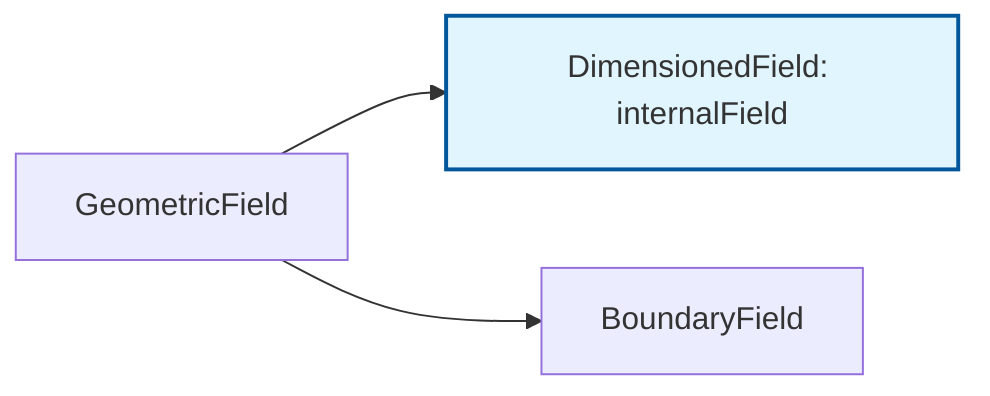

# Dimensioned Fields (ฟิลด์ที่มีหน่วยแต่ไม่มีขอบเขต)

![[core_data_internal.png]]

> **A 3D object where the outer shell (Boundary) is transparent, revealing a solid, glowing core (Internal cells). Metadata tags show "Unit: Pa" and "Size: 1000 cells", scientific textbook diagram, clean vector line art, white background, high definition, flat design, educational infographic --ar 16:9**

---

## 1. อะไรคือ `DimensionedField`?



`DimensionedField` คือฟิลด์ที่มี:

- **ข้อมูลตัวเลข** (เช่น `scalarField`)
- **หน่วยทางฟิสิกส์** (เช่น `dimensionSet`)
- **เมชที่อ้างอิง** (เพื่อรู้ขนาด)

**สิ่งที่หายไป**: มันไม่มี **เงื่อนไขขอบเขต (Boundary Field)**

---

## 2. ทำไมต้องใช้ประเภทนี้?

ในหลายกรณี เราต้องการคำนวณค่าฟิสิกส์ที่เกิดขึ้นเฉพาะภายในเซลล์ โดยไม่สนใจเรื่องขอบเขต เช่น:

- **Source Terms**: พจน์ต้นทางในสมการ (เช่น แรงเสียดทานภายใน)
- **Property Fields**: ตารางคุณสมบัติวัสดุที่คำนวณล่วงหน้า
- **Intermediate Results**: ผลลัพธ์ชั่วคราวในการคำนวณที่ซับซ้อน

---

## 3. โครงสร้างคลาส DimensionedField

### ลายเซ็นเทมเพลต

```cpp
template<class Type, class GeoMesh>
class DimensionedField
:
    public Field<Type>,
    public dimensioned<Type>
{
    // Internal field storage
    Field<Type> field_;

    // Mesh reference
    const GeoMesh& mesh_;

    // Dimensions
    dimensionSet dimensions_;

    // Field name
    word name_;
};
```

### ความรับผิดชอบหลัก

| คุณสมบัติ | คำอธิบาย |
|-----------|------------|
| **การเก็บข้อมูลฟิลด์ภายใน** | ค่าสำหรับเซลล์เมชทั้งหมด |
| **ความสอดคล้องของมิติ** | ผ่านการรวม `dimensionSet` |
| **การดำเนินการฟิลด์พื้นฐาน** | รวมถึงการกำหนดค่าและเลขคณิต |
| **การจัดการหน่วยความจำ** | พร้อมการเก็บข้อมูลและการเข้าถึงที่มีประสิทธิภาพ |

---

## 4. ระบบการวิเคราะห์มิติ

### โครงสร้างคลาส dimensionSet

OpenFOAM ใช้ระบบการวิเคราะห์มิติที่ครอบคลุมผ่านคลาส `dimensionSet`:

```cpp
// dimensionSet เก็บมิติพื้นฐาน 7 ประการ:
// [MASS, LENGTH, TIME, TEMPERATURE, MOLES, CURRENT, LUMINOUS_INTENSITY]
class dimensionSet
{
    scalar exponents_[7];  // เลขชี้กำลังสำหรับแต่ละมิติพื้นฐาน
};
```

### มิติพื้นฐานและตัวอย่าง

ระบบมิติทำงานบนหน่วยฐาน SI พื้นฐานเจ็ดหน่วย:

**มิติพื้นฐาน**:
- **มวล** $[M]$: กิโลกรัม (kg)
- **ความยาว** $[L]$: เมตร (m)
- **เวลา** $[T]$: วินาที (s)
- **อุณหภูมิ** $[\Theta]$: เคลวิน (K)
- **ปริมาณของสาร** $[N]$: โมล (mol)
- **กระแสไฟฟ้า** $[I]$: แอมแปร์ (A)
- **ความเข้มแสง** $[J]$: แคนเดลา (cd)

**ตัวอย่างมิติ**:

| ปริมาณทางกายภาพ | เวกเตอร์มิติ | สัญลักษณ์ | หน่วย SI |
|-------------------|----------------|-------------|-----------|
| **ความเร็ว** | `[0 1 -1 0 0 0 0]` | $L^1 T^{-1}$ | m/s |
| **ความดัน** | `[1 -1 -2 0 0 0 0]` | $M L^{-1} T^{-2}$ | N/m² |
| **อุณหภูมิ** | `[0 0 0 1 0 0 0]` | $\Theta$ | K |
| **แรง** | `[1 1 -2 0 0 0 0]` | $M L T^{-2}$ | N |
| **พลังงาน** | `[1 2 -2 0 0 0 0]` | $M L^2 T^{-2}$ | J |
| **ความหนืดไดนามิก** | `[1 -1 -1 0 0 0 0]` | $M L^{-1} T^{-1}$ | Pa·s |
| **ความหนืดจลน์** | `[0 2 -1 0 0 0 0]` | $L^2 T^{-1}$ | m²/s |

---

## 5. การตรวจสอบความสม่ำเสมอของมิติ

ระบบการวิเคราะห์มิติของ OpenFOAM ให้การตรวจสอบความสอดคล้องอัตโนมัติ:

### การบวก/ลบ

ตัวถูกดำเนินการทั้งสองต้องมีมิติเหมือนกัน:

```cpp
// ถูกต้อง: ความดัน + ความดัน (ทั้งสองมีมิติ [M][L]^-1[T]^-2)
volScalarField totalPressure = staticPressure + dynamicPressure;

// ไม่ถูกต้อง: ความเร็ว + อุณหภูมิ (ความไม่ตรงกันของมิติจะถูกจับในเวลาคอมไพล์)
// volVectorField invalidField = velocityField + temperatureField; // ข้อผิดพลาดคอมไพเลอร์
```

### การคูณ/หาร

มิติรวมกันทางพีชคณิต:

```cpp
// โมเมนตัม = ความหนาแน่น × ความเร็ว
// [M][L]^-3 × [L][T]^-1 = [M][L]^-2[T]^-1 ✓
volVectorField momentum = density * velocity;

// พลังงานจลน์ต่อหน่วยมวล = 0.5 × ความเร็ว²
// [L]²[T]^-2 = [L]²[T]^-2 ✓
volScalarField kineticEnergy = 0.5 * magSqr(velocity);
```

### เลขชี้กำลัง/ลอการิทึม

อาร์กิวเมนต์ต้องไร้มิติ:

```cpp
// ถูกต้อง: exp(dimensionlessQuantity)
volScalarField result = exp(volumeFraction);

// ไม่ถูกต้อง: log(pressure) - ความดันมีมิติ ต้องใช้อัตราส่วนไร้มิติ
// volScalarField invalid = log(pressure); // ข้อผิดพลาดรันไทม์
volScalarField valid = log(pressure/referencePressure); // ✓
```

---

## 6. การเข้าถึง Internal Field

### จาก GeometricField

```cpp
volScalarField p(...);  // GeometricField

// เข้าถึง internalField (DimensionedField)
const DimensionedField<scalar, volMesh>& internalP = p.internalField();

// หรือใช้ reference โดยตรง
const Field<scalar>& cellValues = p.internalField();
```

### การสร้าง DimensionedField โดยตรง

```cpp
// สร้าง DimensionedField สำหรับคุณสมบัติวัสดุ
DimensionedField<scalar, volMesh> viscosity
(
    IOobject
    (
        "nu",
        runTime.timeName(),
        mesh,
        IOobject::NO_READ,
        IOobject::NO_WRITE
    ),
    mesh,
    dimensionSet(0, 2, -1, 0, 0, 0, 0),  // [L²/T] = m²/s
    Field<scalar>(mesh.nCells(), 1.5e-5)  // ค่าเริ่มต้น
);
```

---

## 7. การใช้งานจริง

### ตัวอย่างที่ 1: Source Term ภายใน

```cpp
// สร้าง source term สำหรับสมการพลังงาน
DimensionedField<scalar, volMesh> heatSource
(
    IOobject("heatSource", runTime.timeName(), mesh),
    mesh,
    dimensionSet(1, 0, -3, 0, 0, 0, 0),  // [W/m³] = kg/(m·s³)
    calculatedFvPatchScalarField::typeName
);

// กำหนดค่า source term สำหรับแต่ละเซลล์
forAll(heatSource, cellI)
{
    // คำนวณค่า source ขึ้นอยู่กับตำแหน่ง
    const vector& C = mesh.C()[cellI];
    heatSource[cellI] = 1000.0 * exp(-mag(C)/0.1);  // แหล่งความร้อนที่ลดลงตามระยะทาง
}
```

### ตัวอย่างที่ 2: ตารางคุณสมบัติวัสดุ

```cpp
// สร้างตารางความหนืดที่ขึ้นกับอุณหภูมิ
DimensionedField<scalar, volMesh> viscosityTable
(
    IOobject("viscosityTable", runTime.timeName(), mesh),
    mesh,
    dimensionSet(0, 2, -1, 0, 0, 0, 0),  // [L²/T]
    zeroGradientFvPatchScalarField::typeName
);

const volScalarField& T = mesh.lookupObject<volScalarField>("T");

forAll(viscosityTable, cellI)
{
    // ความสัมพันธ์ความหนืด-อุณหภูมิ (Sutherland's law)
    scalar T_local = T[cellI];
    viscosityTable[cellI] = 1.458e-6 * pow(T_local, 1.5) / (T_local + 110.4);
}
```

### ตัวอย่างที่ 3: การคำนวณค่าชั่วคราว

```cpp
// ใช้ DimensionedField สำหรับค่า intermediate ในการคำนวณเทนเซอร์
tmp<volTensorField> gradU = fvc::grad(U);

// สร้าง DimensionedField สำหรับเก็บผลลัพธ์ intermediate
DimensionedField<scalar, volMesh> strainRateMag
(
    IOobject("strainRateMag", runTime.timeName(), mesh),
    mesh,
    dimensionSet(0, 0, -1, 0, 0, 0, 0),  // [1/s]
    calculatedFvPatchScalarField::typeName
);

const volSymmTensorField S = symm(gradU());  // Strain rate tensor

forAll(strainRateMag, cellI)
{
    // คำนวณขนาดของ strain rate tensor
    strainRateMag[cellI] = sqrt(2.0)*mag(S[cellI]);
}
```

---

## 8. สถาปัตยกรรมการแยกส่วน Internal vs. Boundary

### การแยกระหว่าง Internal และ Boundary Fields

การแยกนี้เป็นกลยุทธ์ **performance optimization strategy** โดยพื้นฐาน:

#### การพิจารณาประสิทธิภาพ Cache (Cache Efficiency)

Internal fields ใช้ **contiguous memory allocation** สำหรับประสิทธิภาพ cache ที่เหมาะสมที่สุด:

```cpp
class GeometricField
{
private:
    // Internal field - tightly packed for cache efficiency
    Field<Type> field_;

    // Boundary fields - separate allocation, organized by patch
    PtrList<PatchField<Type>> boundaryField_;
};
```

#### รูปแบบการเข้าถึง Memory (Memory Access Patterns)

- **Internal field access**: $O(N)$ กับ spatial locality ที่ยอดเยี่ยม
- **Boundary field access**: $O(N_{boundary})$ กับการจัดกลุ่มตาม patch
- **อัตราโดยทั่วไป**: $N_{boundary} \approx 0.1 \times N$ สำหรับปัญหาที่เหมาะสม

### ประโยชน์ของการแยก Internal Field

| คุณสมบัติ | คำอธิบาย |
|-----------|------------|
| **เงื่อนไขขอบเขตที่ยืดหยุ่น** | แพตช์ต่างๆ สามารถใช้เงื่อนไขขอบเขต fixedValue, zeroGradient, mixed หรือแบบกำหนดเองได้พร้อมกัน |
| **ประสิทธิภาพหน่วยความจำ** | ต้องการพื้นที่จัดเก็บเฉพาะใบหน้าขอบเขตเท่านั้น หลีกเลี่ยงการจัดสรรสำหรับใบหน้าภายใน |
| **พฤติกรรม Polymorphic** | แต่ละแพตช์ฟิลด์สามารถสืบทอดจากคลาสเงื่อนไขขอบเขตเฉพาะที่ใช้งานอัลกอริทึมการอัปเดตที่ไม่ซ้ำกันได้ |

---

## 9. การจัดการ Memory ที่เหมาะสม

### การใช้ tmp<T> กับ DimensionedField

```cpp
// สร้าง DimensionedField ชั่วคราวที่มีการจัดการหน่วยความจำอัตโนมัติ
tmp<DimensionedField<scalar, volMesh>> tmpField = fvc::grad(p) & U;

// ใช้งานฟิลด์
const DimensionedField<scalar, volMesh>& fieldRef = tmpField();

// ไม่ต้อง delete - tmp จัดการให้อัตโนมัติ
```

### การเพิ่มประสิทธิภาพการเข้าถึง Memory

```cpp
// ดี: การเข้าถึงหน่วยความจำที่ติดกัน (contiguous)
const Field<scalar>& internalField = dimensionedField.field();
forAll(internalField, i)
{
    internalField[i] += source[i];  // Sequential access = cache-friendly
}

// หลีกเลี่ยง: การเข้าถึงแบบสุ่ม
for (label i = 0; i < nCells; i += stride)
{
    dimensionedField[fieldIndices[i]] = value;  // Random access = cache-unfriendly
}
```

---

## 10. สรุป: เมื่อไหร่ควรใช้ DimensionedField

### ใช้เมื่อ:

- ✅ ต้องการคำนวณค่าเฉพาะภายในเซลล์โดยไม่เกี่ยวของกับขอบเขต
- ✅ สร้าง property fields หรือ lookup tables
- ✅ คำนวณ intermediate results ที่ไม่ต้องการ BCs
- ✅ ต้องการประสิทธิภาพสูงสุดจาก contiguous memory

### หลีกเลี่ยงเมื่อ:

- ❌ ต้องการเก็บข้อมูลที่ขอบเขต (ใช้ `GeometricField` แทน)
- ❌ ต้องการส่งออกข้อมูลไปยังไฟล์ (ใช้ `GeometricField`)
- ❌ ต้องการเงื่อนไขขอบเขตที่ซับซ้อน

> [!INFO] **จำไว้**: `DimensionedField` = `Field` + `dimensions` + `mesh` แต่ **ไม่มี** `boundaryField`
