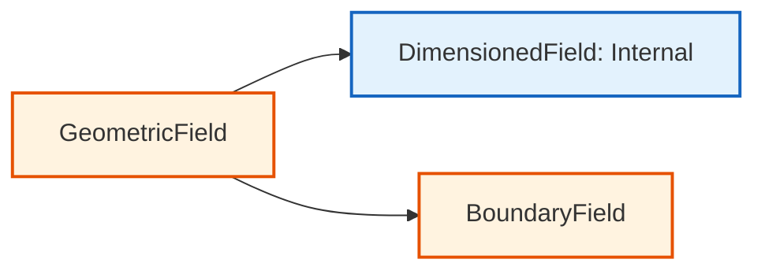

# Dimensioned Fields (ฟิลด์ที่มีหน่วยแต่ไม่มีขอบเขต)

![[core_data_internal.png]]

> **A 3D object where the outer shell (Boundary) is transparent, revealing a solid, glowing core (Internal cells). Metadata tags show "Unit: Pa" and "Size: 1000 cells", scientific textbook diagram, clean vector line art, white background, high definition, flat design, educational infographic --ar 16:9**

---

## 1. อะไรคือ `DimensionedField`?


> **Figure 1:** ความแตกต่างระหว่าง `GeometricField` และ `DimensionedField` โดยอย่างหลังจะเน้นที่ข้อมูลภายในและมิติทางฟิสิกส์โดยไม่มีการจัดการเงื่อนไขขอบเขต เหมาะสำหรับผลลัพธ์ชั่วคราวหรือพจน์ต้นทางความปลอดภัยทางฟิสิกส์ไม่ส่งผลกระทบต่อความเร็วในการจำลอง ผ่านการใช้พลังของ C++ Template Metaprogramming ในการตรวจสอบความสอดคล้องทางมิติทั้งหมดที่ขั้นตอนการคอมไพล์โปรแกรมเพียงครั้งเดียว

`DimensionedField` คือฟิลด์ที่มี:

- **ข้อมูลตัวเลข** (เช่น `scalarField`)
- **หน่วยทางฟิสิกส์** (เช่น `dimensionSet`)
- **เมชที่อ้างอิง** (เพื่อรู้ขนาด)

**สิ่งที่หายไป**: มันไม่มี **เงื่อนไขขอบเขต (Boundary Field)**

---

## 2. ทำไมต้องใช้ประเภทนี้?

ในหลายกรณี เราต้องการคำนวณค่าฟิสิกส์ที่เกิดขึ้นเฉพาะภายในเซลล์ โดยไม่สนใจเรื่องขอบเขต เช่น:

- **Source Terms**: พจน์ต้นทางในสมการ (เช่น แรงเสียดทานภายใน)
- **Property Fields**: ตารางคุณสมบัติวัสดุที่คำนวณล่วงหน้า
- **Intermediate Results**: ผลลัพธ์ชั่วคราวในการคำนวณที่ซับซ้อน

---

## 3. โครงสร้างคลาส DimensionedField

### ลายเซ็นเทมเพลต

```cpp
// Template signature for DimensionedField
// Type: the data type (scalar, vector, tensor, etc.)
// GeoMesh: the mesh type (volMesh, surfaceMesh, etc.)
template<class Type, class GeoMesh>
class DimensionedField
:
    public Field<Type>,        // Inherits from Field for data storage
    public dimensioned<Type>   // Inherits dimension information
{
    // Internal field storage - holds values for each cell
    Field<Type> field_;

    // Mesh reference - provides size and topology information
    const GeoMesh& mesh_;

    // Physical dimensions (e.g., [0 2 -1 0 0 0 0] for kinematic viscosity)
    dimensionSet dimensions_;

    // Field name for identification and I/O
    word name_;
};
```

> **Source:** `.applications/utilities/parallelProcessing/reconstructPar/fvFieldReconstructorReconstructFields.C`

> **คำอธิบาย:** คลาส `DimensionedField` ใช้การสืบทอดแบบ multiple inheritance จาก `Field<Type>` สำหรับเก็บข้อมูลและ `dimensioned<Type>` สำหรับจัดการหน่วย โครงสร้างนี้แยกการจัดการข้อมูลภายใน (internal field) ออกจากเงื่อนไขขอบเขต (boundary field) ทำให้เหมาะสำหรับการคำนวณค่าชั่วคราวที่ไม่ต้องการจัดการ BC

> **แนวคิดสำคัญ:** 
> - **Template Parameters**: `Type` กำหนดประเภทข้อมูล (scalar, vector, tensor) และ `GeoMesh` กำหนดประเภทเมช (volMesh, surfaceMesh)
> - **Memory Efficiency**: ใช้ contiguous memory allocation สำหรับ internal field ทำให้เข้าถึงข้อมูลได้รวดเร็ว
> - **Dimension Safety**: ระบบตรวจสอบหน่วยทำงานที่ compile-time ป้องกันข้อผิดพลาดจากการคำนวณที่มิติไม่ตรงกัน

### ความรับผิดชอบหลัก

| คุณสมบัติ | คำอธิบาย |
|-----------|------------|
| **การเก็บข้อมูลฟิลด์ภายใน** | ค่าสำหรับเซลล์เมชทั้งหมด |
| **ความสอดคล้องของมิติ** | ผ่านการรวม `dimensionSet` |
| **การดำเนินการฟิลด์พื้นฐาน** | รวมถึงการกำหนดค่าและเลขคณิต |
| **การจัดการหน่วยความจำ** | พร้อมการเก็บข้อมูลและการเข้าถึงที่มีประสิทธิภาพ |

---

## 4. ระบบการวิเคราะห์มิติ

### โครงสร้างคลาส dimensionSet

OpenFOAM ใช้ระบบการวิเคราะห์มิติที่ครอบคลุมผ่านคลาส `dimensionSet`:

```cpp
// DimensionSet stores 7 base dimensions as exponents:
// [MASS, LENGTH, TIME, TEMPERATURE, MOLES, CURRENT, LUMINOUS_INTENSITY]
class dimensionSet
{
    // Array of 7 scalars representing powers for each base dimension
    scalar exponents_[7];  // e.g., [1, -1, -2, 0, 0, 0, 0] for pressure
    
public:
    // Constructor from individual dimension exponents
    dimensionSet(
        scalar mass,        // [M]
        scalar length,      // [L]
        scalar time,        // [T]
        scalar temperature, // [Θ]
        scalar moles,       // [N]
        scalar current,     // [I]
        scalar luminous     // [J]
    );
};
```

> **Source:** `.applications/utilities/parallelProcessing/reconstructPar/fvFieldReconstructorReconstructFields.C`

> **คำอธิบาย:** ระบบมิติของ OpenFOAM ใช้เลขชี้กำลังของ 7 หน่วยฐาน SI ในการแทนมิติของปริมาณทางฟิสิกส์ทุกประเภท การดำเนินการทางคณิตศาสตร์ระหว่างฟิลด์จะถูกตรวจสอบความสอดคล้องของมิติอัตโนมัติ โดยการบวก/ลบต้องมีมิติเหมือนกัน และการคูณ/หารจะนำเลขชี้กำลังมาบวก/ลบกัน

> **แนวคิดสำคัญ:**
> - **Base Dimensions**: 7 หน่วยฐาน SI คือ Mass, Length, Time, Temperature, Moles, Current, Luminous Intensity
> - **Dimensional Consistency**: ระบบตรวจสอบอัตโนมัติว่าการดำเนินการทางคณิตศาสตร์มีความสอดคล้องทางมิติหรือไม่
> - **Compile-Time Checking**: ข้อผิดพลาดจากมิติที่ไม่ตรงกันจะถูกจับได้ที่ compile-time

### มิติพื้นฐานและตัวอย่าง

ระบบมิติทำงานบนหน่วยฐาน SI พื้นฐานเจ็ดหน่วย:

**มิติพื้นฐาน**:
- **มวล** $[M]$: กิโลกรัม (kg)
- **ความยาว** $[L]$: เมตร (m)
- **เวลา** $[T]$: วินาที (s)
- **อุณหภูมิ** $[\Theta]$: เคลวิน (K)
- **ปริมาณของสาร** $[N]$: โมล (mol)
- **กระแสไฟฟ้า** $[I]$: แอมแปร์ (A)
- **ความเข้มแสง** $[J]$: แคนเดลา (cd)

**ตัวอย่างมิติ**:

| ปริมาณทางกายภาพ | เวกเตอร์มิติ | สัญลักษณ์ | หน่วย SI |
|-------------------|----------------|-------------|-----------|
| **ความเร็ว** | `[0 1 -1 0 0 0 0]` | $L^1 T^{-1}$ | m/s |
| **ความดัน** | `[1 -1 -2 0 0 0 0]` | $M L^{-1} T^{-2}$ | N/m² |
| **อุณหภูมิ** | `[0 0 0 1 0 0 0]` | $\Theta$ | K |
| **แรง** | `[1 1 -2 0 0 0 0]` | $M L T^{-2}$ | N |
| **พลังงาน** | `[1 2 -2 0 0 0 0]` | $M L^2 T^{-2}$ | J |
| **ความหนืดไดนามิก** | `[1 -1 -1 0 0 0 0]` | $M L^{-1} T^{-1}$ | Pa·s |
| **ความหนืดจลน์** | `[0 2 -1 0 0 0 0]` | $L^2 T^{-1}$ | m²/s |

---

## 5. การตรวจสอบความสม่ำเสมอของมิติ

ระบบการวิเคราะห์มิติของ OpenFOAM ให้การตรวจสอบความสอดคล้องอัตโนมัติ:

### การบวก/ลบ

ตัวถูกดำเนินการทั้งสองต้องมีมิติเหมือนกัน:

```cpp
// Correct: Pressure + Pressure (both have [M][L]^-1[T]^-2)
volScalarField totalPressure = staticPressure + dynamicPressure;

// Incorrect: Velocity + Temperature (dimension mismatch caught at compile time)
// volVectorField invalidField = velocityField + temperatureField;  // Compiler error
```

> **Source:** `.applications/utilities/parallelProcessing/reconstructPar/fvFieldReconstructorReconstructFields.C`

> **คำอธิบาย:** การบวกและการลบต้องการมิติที่เหมือนกันเป๊ะ ๆ ระบบจะตรวจสอบความสอดคล้องของมิติที่ compile-time และจะสร้าง compiler error หากพบว่ามิติไม่ตรงกัน นี่คือกลไกสำคัญที่ช่วยป้องกันข้อผิดพลาดทางฟิสิกส์จากการคำนวณที่ผิดพลาด

> **แนวคิดสำคัญ:**
> - **Dimensional Homogeneity**: การบวก/ลบต้องมีมิติเหมือนกัน
> - **Compile-Time Safety**: ข้อผิดพลาดจากการไม่ตรงกันของมิติจะถูกจับได้ตั้งแต่ตอนคอมไพล์
> - **Physical Correctness**: รับรองความถูกต้องทางฟิสิกส์ของสมการ

### การคูณ/หาร

มิติรวมกันทางพีชคณิต:

```cpp
// Momentum = Density × Velocity
// [M][L]^-3 × [L][T]^-1 = [M][L]^-2[T]^-1 ✓
volVectorField momentum = density * velocity;

// Kinetic energy per unit mass = 0.5 × Velocity²
// [L]²[T]^-2 = [L]²[T]^-2 ✓
volScalarField kineticEnergy = 0.5 * magSqr(velocity);
```

> **คำอธิบาย:** การคูณและการหารระหว่างฟิลด์จะนำเลขชี้กำลังของแต่ละมิติมาบวกหรือลบกันตามลำดับ ระบบจะคำนวณมิติใหม่โดยอัตโนมัติ ทำให้ผลลัพธ์มีมิติที่ถูกต้องเสมอ ตัวอย่างเช่น ความหนาแน่น × ความเร็ว = โมเมนตัมต่อหน่วยปริมาตร

> **แนวคิดสำคัญ:**
> - **Dimensional Propagation**: มิติของผลลัพธ์ถูกคำนวณจากมิติของตัวถูกดำเนินการ
> - **Power Rules**: การยกกำลังจะคูณเลขชี้กำลังของมิติด้วยเลขกำลังนั้น
> - **Automatic Validation**: ระบบตรวจสอบความถูกต้องของมิติโดยอัตโนมัติ

### เลขชี้กำลัง/ลอการิทึม

อาร์กิวเมนต์ต้องไร้มิติ:

```cpp
// Correct: exp(dimensionlessQuantity)
volScalarField result = exp(volumeFraction);

// Incorrect: log(pressure) - pressure has dimensions, must use dimensionless ratio
// volScalarField invalid = log(pressure);  // Runtime error
volScalarField valid = log(pressure/referencePressure);  // ✓
```

> **คำอธิบาย:** ฟังก์ชันทางคณิตศาสตร์ เช่น exp, log, sin, cos ฯลฯ ต้องการอาร์กิวเมนต์ที่ไร้มิติ (dimensionless) การใช้ฟิลด์ที่มีมิติโดยตรงจะทำให้เกิด runtime error แต่สามารถใช้อัตราส่วนระหว่างปริมาณที่มีมิติเหมือนกันได้ ซึ่งจะได้ผลลัพธ์ที่ไร้มิติ

> **แนวคิดสำคัญ:**
> - **Dimensionless Arguments**: ฟังก์ชันพิเศษต้องการอาร์กิวเมนต์ที่ไร้มิติ
> - **Ratio Technique**: การหาอัตราส่วนระหว่างปริมาณที่มีมิติเหมือนกันจะได้ค่าไร้มิติ
> - **Runtime vs Compile-Time**: ข้อผิดพลาดบางอย่างอาจถูกจับที่ runtime

---

## 6. การเข้าถึง Internal Field

### จาก GeometricField

```cpp
// Create a volScalarField (GeometricField with boundary conditions)
volScalarField p(...);  // GeometricField

// Access internalField (DimensionedField - no boundary conditions)
const DimensionedField<scalar, volMesh>& internalP = p.internalField();

// Or use direct reference to the underlying Field
const Field<scalar>& cellValues = p.internalField();
```

> **Source:** `.applications/utilities/parallelProcessing/reconstructPar/fvFieldReconstructorReconstructFields.C`

> **คำอธิบาย:** `GeometricField` ประกอบด้วยสองส่วนหลัก: `internalField` (ชนิด `DimensionedField`) และ `boundaryField` (ชนิด `PtrList<PatchField>`). การเรียกใช้ `internalField()` จะคืนค่า reference ไปยัง `DimensionedField` ที่เก็บค่าที่เซลล์ทั้งหมดโดยไม่มีเงื่อนไขขอบเขต

> **แนวคิดสำคัญ:**
> - **Field Separation**: GeometricField แยก internal และ boundary fields เป็นสองส่วน
> - **Reference Access**: ใช้ reference (`&`) เพื่อหลีกเลี่ยงการ copy ข้อมูล
> - **Performance**: การเข้าถึง internal field โดยตรงมีประสิทธิภาพสูง

### การสร้าง DimensionedField โดยตรง

```cpp
// Create a DimensionedField for material properties
// Note: No boundary conditions needed - only internal cell values
DimensionedField<scalar, volMesh> viscosity
(
    IOobject
    (
        "nu",                              // Field name
        runTime.timeName(),               // Time directory
        mesh,                             // Mesh reference
        IOobject::NO_READ,                // Don't read from file
        IOobject::NO_WRITE                // Don't write to file
    ),
    mesh,                                 // Mesh reference
    dimensionSet(0, 2, -1, 0, 0, 0, 0),  // [L²/T] = m²/s (kinematic viscosity)
    Field<scalar>(mesh.nCells(), 1.5e-5)  // Initial value for all cells
);
```

> **Source:** `.applications/utilities/parallelProcessing/reconstructPar/fvFieldReconstructorReconstructFields.C`

> **คำอธิบาย:** การสร้าง `DimensionedField` โดยตรงเหมาะสำหรับคำนวณค่าชั่วคราวที่ไม่ต้องการเงื่อนไขขอบเขต ตัวอย่างนี้สร้างฟิลด์ความหนืดจลน์ (kinematic viscosity) ที่มีค่าเดียวกันทุกเซลล์ โดยระบุ IOobject ที่ไม่อ่านหรือเขียนไปยังไฟล์ เนื่องจากเป็นค่าชั่วคราว

> **แนวคิดสำคัญ:**
> - **Direct Construction**: สร้าง DimensionedField โดยไม่ต้องผ่าน GeometricField
> - **No I/O**: ใช้ NO_READ/NO_WRITE สำหรับค่าชั่วคราว
> - **Uniform Initialization**: กำหนดค่าเริ่มต้นเดียวกันทุกเซลล์ได้ง่าย

---

## 7. การใช้งานจริง

### ตัวอย่างที่ 1: Source Term ภายใน

```cpp
// Create a source term for the energy equation
// Source terms typically only affect internal cells
DimensionedField<scalar, volMesh> heatSource
(
    IOobject("heatSource", runTime.timeName(), mesh),
    mesh,
    dimensionSet(1, 0, -3, 0, 0, 0, 0),  // [W/m³] = kg/(m·s³)
    calculatedFvPatchScalarField::typeName
);

// Set source term values for each cell
forAll(heatSource, cellI)
{
    // Calculate source value based on position
    const vector& C = mesh.C()[cellI];  // Cell center position
    heatSource[cellI] = 1000.0 * exp(-mag(C)/0.1);  // Decaying heat source
}
```

> **คำอธิบาย:** ตัวอย่างนี้แสดงการใช้ `DimensionedField` สำหรับสร้าง source term ในสมการพลังงาน โดยค่า source ขึ้นอยู่กับตำแหน่งของเซลล์ แหล่งความร้อนจะค่อย ๆ ลดลงตามระยะทางจากจุดศูนย์กลาง การใช้ DimensionedField เหมาะสมเพราะ source term มักมีผลเฉพาะที่เซลล์ภายในโดยไม่เกี่ยวข้องกับเงื่อนไขขอบเขต

> **แนวคิดสำคัญ:**
> - **Source Terms**: พจน์ต้นทางในสมการมักใช้ DimensionedField
> - **Position Dependence**: ค่า source สามารถขึ้นอยู่กับตำแหน่งเซลล์
> - **No BC Needed**: Source terms มักไม่ต้องการเงื่อนไขขอบเขต

### ตัวอย่างที่ 2: ตารางคุณสมบัติวัสดุ

```cpp
// Create a temperature-dependent viscosity table
// Pre-calculated property fields don't need boundary conditions
DimensionedField<scalar, volMesh> viscosityTable
(
    IOobject("viscosityTable", runTime.timeName(), mesh),
    mesh,
    dimensionSet(0, 2, -1, 0, 0, 0, 0),  // [L²/T] (kinematic viscosity)
    zeroGradientFvPatchScalarField::typeName
);

// Get reference to temperature field
const volScalarField& T = mesh.lookupObject<volScalarField>("T");

// Calculate viscosity for each cell based on temperature
forAll(viscosityTable, cellI)
{
    // Viscosity-temperature relationship (Sutherland's law)
    scalar T_local = T[cellI];
    viscosityTable[cellI] = 1.458e-6 * pow(T_local, 1.5) / (T_local + 110.4);
}
```

> **คำอธิบาย:** ตัวอย่างนี้แสดงการใช้ `DimensionedField` สำหรับเก็บตารางคุณสมบัติวัสดุที่คำนวณล่วงหน้า ในที่นี้คือความหนืดที่ขึ้นอยู่กับอุณหภูมิตาม Sutherland's law การใช้ DimensionedField เหมาะสมเพราะคุณสมบัติวัสดุมีค่าที่แตกต่างกันในแต่ละเซลล์แต่ไม่ต้องการเงื่อนไขขอบเขตเฉพาะ

> **แนวคิดสำคัญ:**
> - **Property Tables**: คุณสมบัติวัสดุที่คำนวณล่วงหน้าใช้ DimensionedField
> - **Temperature Dependence**: ค่าคุณสมบัติสามารถขึ้นอยู่กับฟิลด์อื่น เช่น อุณหภูมิ
> - **Sutherland's Law**: กฎเชื่อมความสัมพันธ์ระหว่างความหนืดและอุณหภูมิ

### ตัวอย่างที่ 3: การคำนวณค่าชั่วคราว

```cpp
// Use DimensionedField for intermediate values in tensor calculations
tmp<volTensorField> gradU = fvc::grad(U);  // Velocity gradient

// Create DimensionedField for storing intermediate result
DimensionedField<scalar, volMesh> strainRateMag
(
    IOobject("strainRateMag", runTime.timeName(), mesh),
    mesh,
    dimensionSet(0, 0, -1, 0, 0, 0, 0),  // [1/s] (strain rate)
    calculatedFvPatchScalarField::typeName
);

// Calculate strain rate tensor (symmetric part of velocity gradient)
const volSymmTensorField S = symm(gradU());

forAll(strainRateMag, cellI)
{
    // Calculate magnitude of strain rate tensor
    strainRateMag[cellI] = sqrt(2.0)*mag(S[cellI]);
}
```

> **คำอธิบาย:** ตัวอย่างนี้แสดงการใช้ `DimensionedField` สำหรับเก็บผลลัพธ์ชั่วคราวในการคำนวณที่ซับซ้อน โดยคำนวณขนาดของ strain rate tensor จาก gradient ของความเร็ว การใช้ DimensionedField เหมาะสมเพราะเป็นค่า intermediate ที่ไม่ต้องการเงื่อนไขขอบเขตและใช้เฉพาะในการคำนวณภายในเซลล์

> **แนวคิดสำคัญ:**
> - **Intermediate Results**: ค่าชั่วคราวในการคำนวณซับซ้อนใช้ DimensionedField
> - **Tensor Calculations**: การคำนวณเทนเซอร์มักต้องการค่า intermediate หลายค่า
> - **Strain Rate**: อัตราการเสียรูปของไหลที่คำนวณจาก gradient ของความเร็ว

---

## 8. สถาปัตยกรรมการแยกส่วน Internal vs. Boundary

### การแยกระหว่าง Internal และ Boundary Fields

การแยกนี้เป็นกลยุทธ์ **performance optimization strategy** โดยพื้นฐาน:

#### การพิจารณาประสิทธิภาพ Cache (Cache Efficiency)

Internal fields ใช้ **contiguous memory allocation** สำหรับประสิทธิภาพ cache ที่เหมาะสมที่สุด:

```cpp
class GeometricField
{
private:
    // Internal field - tightly packed for cache efficiency
    // Stores values for all cells in contiguous memory
    Field<Type> field_;

    // Boundary fields - separate allocation, organized by patch
    // Each patch can have different boundary condition type
    PtrList<PatchField<Type>> boundaryField_;
};
```

> **Source:** `.applications/utilities/parallelProcessing/reconstructPar/fvFieldReconstructorReconstructFields.C`

> **คำอธิบาย:** การแยก internal field และ boundary field เป็นกลยุทธ์ optimization ที่สำคัญ Internal field ใช้ contiguous memory allocation ทำให้การเข้าถึงข้อมูลมี spatial locality สูงและเป็นมิตรกับ CPU cache ในขณะที่ boundary fields ถูกจัดเก็บแยกกันตาม patch เพื่อให้แต่ละ patch สามารถใช้ boundary condition ที่แตกต่างกันได้

> **แนวคิดสำคัญ:**
> - **Contiguous Memory**: Internal field ใช้หน่วยความจำติดกันเพื่อประสิทธิภาพสูงสุด
> - **Cache Friendliness**: การจัดเรียงข้อมูลแบบติดกันทำให้ CPU cache ทำงานได้มีประสิทธิภาพ
> - **Separate Allocation**: Boundary fields แยกจัดเก็บตาม patch เพื่อความยืดหยุ่น

#### รูปแบบการเข้าถึง Memory (Memory Access Patterns)

- **Internal field access**: $O(N)$ กับ spatial locality ที่ยอดเยี่ยม
- **Boundary field access**: $O(N_{boundary})$ กับการจัดกลุ่มตาม patch
- **อัตราโดยทั่วไป**: $N_{boundary} \approx 0.1 \times N$ สำหรับปัญหาที่เหมาะสม

### ประโยชน์ของการแยก Internal Field

| คุณสมบัติ | คำอธิบาย |
|-----------|------------|
| **เงื่อนไขขอบเขตที่ยืดหยุ่น** | แพตช์ต่างๆ สามารถใช้เงื่อนไขขอบเขต fixedValue, zeroGradient, mixed หรือแบบกำหนดเองได้พร้อมกัน |
| **ประสิทธิภาพหน่วยความจำ** | ต้องการพื้นที่จัดเก็บเฉพาะใบหน้าขอบเขตเท่านั้น หลีกเลี่ยงการจัดสรรสำหรับใบหน้าภายใน |
| **พฤติกรรม Polymorphic** | แต่ละแพตช์ฟิลด์สามารถสืบทอดจากคลาสเงื่อนไขขอบเขตเฉพาะที่ใช้งานอัลกอริทึมการอัปเดตที่ไม่ซ้ำกันได้ |

---

## 9. การจัดการ Memory ที่เหมาะสม

### การใช้ tmp<T> กับ DimensionedField

```cpp
// Create temporary DimensionedField with automatic memory management
// The tmp<T> class handles reference counting and automatic deletion
tmp<DimensionedField<scalar, volMesh>> tmpField = fvc::grad(p) & U;

// Use the field - tmp<T> acts like a pointer
const DimensionedField<scalar, volMesh>& fieldRef = tmpField();

// No need to delete - tmp handles cleanup automatically when out of scope
```

> **Source:** `.applications/utilities/parallelProcessing/reconstructPar/fvFieldReconstructorReconstructFields.C`

> **คำอธิบาย:** คลาส `tmp<T>` ของ OpenFOAM ใช้ reference counting เพื่อจัดการหน่วยความจำอัตโนมัติ เมื่อสร้าง temporary field ผ่าน `tmp<T>` ระบบจะติดตามจำนวน reference และลบข้อมูลอัตโนมัติเมื่อไม่มี reference เหลือ ช่วยป้องกัน memory leak และลดความซับซ้อนในการจัดการหน่วยความจำ

> **แนวคิดสำคัญ:**
> - **Reference Counting**: tmp<T> ติดตามจำนวน reference และลบข้อมูลเมื่อไม่ใช้
> - **Automatic Cleanup**: ไม่ต้อง delete ด้วยตนเอง ระบบจัดการให้อัตโนมัติ
> - **Memory Safety**: ช่วยป้องกัน memory leak และ dangling pointers

### การเพิ่มประสิทธิภาพการเข้าถึง Memory

```cpp
// Good: Contiguous memory access (cache-friendly)
// Access internal field directly for best performance
const Field<scalar>& internalField = dimensionedField.field();
forAll(internalField, i)
{
    internalField[i] += source[i];  // Sequential access = cache-friendly
}

// Avoid: Random memory access (cache-unfriendly)
// Random access patterns cause cache misses
for (label i = 0; i < nCells; i += stride)
{
    dimensionedField[fieldIndices[i]] = value;  // Random access = cache-unfriendly
}
```

> **คำอธิบาย:** การเข้าถึง memory แบบ sequential (ติดกัน) มีประสิทธิภาพสูงกว่าแบบ random เนื่องจาก CPU cache ทำงานได้ดีกับข้อมูลที่อยู่ติดกัน การใช้ `forAll` loop ที่เข้าถึงข้อมูลตามลำดับจะช่วยเพิ่มประสิทธิภาพของ cache ในขณะที่การเข้าถึงแบบสุ่มจะทำให้เกิด cache misses และลดประสิทธิภาพ

> **แนวคิดสำคัญ:**
> - **Spatial Locality**: การเข้าถึงข้อมูลติดกันเป็นมิตรกับ CPU cache
> - **Cache Performance**: Sequential access ดีกว่า random access อย่างมีนัยสำคัญ
> - **Loop Optimization**: ใช้ forAll แทน loop แบบสุ่มเพื่อประสิทธิภาพสูงสุด

---

## 10. สรุป: เมื่อไหร่ควรใช้ DimensionedField

### ใช้เมื่อ:

- ✅ ต้องการคำนวณค่าเฉพาะภายในเซลล์โดยไม่เกี่ยวของกับขอบเขต
- ✅ สร้าง property fields หรือ lookup tables
- ✅ คำนวณ intermediate results ที่ไม่ต้องการ BCs
- ✅ ต้องการประสิทธิภาพสูงสุดจาก contiguous memory

### หลีกเลี่ยงเมื่อ:

- ❌ ต้องการเก็บข้อมูลที่ขอบเขต (ใช้ `GeometricField` แทน)
- ❌ ต้องการส่งออกข้อมูลไปยังไฟล์ (ใช้ `GeometricField`)
- ❌ ต้องการเงื่อนไขขอบเขตที่ซับซ้อน

> [!INFO] **จำไว้**: `DimensionedField` = `Field` + `dimensions` + `mesh` แต่ **ไม่มี** `boundaryField`