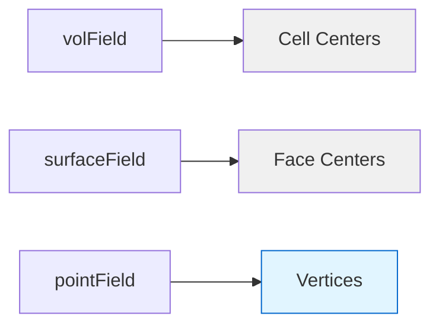

# Point Fields

> **Values stored at mesh vertices for mesh motion, nodal calculations, and interpolation**

---

## 📋 Learning Objectives

By the end of this section, you will be able to:
- **Differentiate** point fields from volume and surface fields based on storage location and use cases
- **Create and manipulate** pointVectorField for mesh motion applications
- **Perform** interpolation between volume and point fields efficiently
- **Apply** appropriate boundary conditions to point fields
- **Integrate** point fields with dynamic mesh operations in solvers

**Prerequisites:** Familiarity with [02_Volume_Fields.md](02_Volume_Fields.md) and [03_Surface_Fields.md](03_Surface_Fields.md)

**Difficulty:** Intermediate | **Reading Time:** 15 minutes

---

## 1. What Are Point Fields?

### Physical Meaning

Point fields store values at **mesh vertices** (points), unlike volume fields (cell-centered) and surface fields (face-centered). This makes them ideal for:

- **Mesh motion** - directly displacing vertices for dynamic mesh simulations
- **Nodal calculations** - vertex-based physics in fluid-structure interaction
- **Interpolation** - smoother visualization and boundary condition propagation

### Storage Architecture



**Field Type Comparison:**

| Field Type | Storage Location | Primary Use | Access Method | Typical Applications |
|------------|------------------|-------------|---------------|---------------------|
| **volField** | Cell centers | FV calculations | `mesh.C()` | Transport equations, turbulence |
| **surfaceField** | Face centers | Flux calculations | `mesh.Cf()` | Convection fluxes, boundary conditions |
| **pointField** | Vertices | Mesh motion, nodal data | `mesh.points()` | Dynamic mesh, structural mechanics |

---

## 2. Why Point Fields Matter

### Mesh Motion Physics

Point fields are essential for **dynamic mesh simulations** where geometry changes during solution:

- **Fluid-Structure Interaction (FSI):** Structural solver calculates displacements → applied to mesh vertices
- **6DOF Body Motion:** Rigid body motion calculated at center of mass → propagated to boundary vertices
- **Oscillating Boundaries:** Prescribed motion (pistons, wings) via boundary conditions
- **Thermal Expansion:** Temperature field → volumetric expansion → vertex displacement

**Physical significance:**
```
Standard FV: Geometry fixed, field evolves at cell centers
Dynamic FV:  Geometry evolves at vertices, field adapts to new mesh
```

### Use Case Decision Matrix

| Scenario | Field Type | Physics Reason |
|----------|------------|----------------|
| **Dynamic mesh motion** | `pointVectorField` | Displacement applied directly to vertices for geometry deformation |
| **Nodal displacement** | `pointVectorField` | Point-based structural mechanics (FSI, 6DOF body motion) |
| **Interpolation for viz** | `pointScalarField` | Smoother contour plots at vertices vs. cell centers |
| **Lagrangian tracking** | `pointVectorField` | Vertex-level velocity interpolation for particle tracking |
| **Mesh quality metrics** | `pointScalarField` | Calculate skewness/non-orthogonality at vertices |
| **Standard FV solve** | `volField` | Cell-centered finite volume calculations |
| **Flux calculations** | `surfaceField` | Face-centered flux computations |

**Decision Tree:**
```
Need to manipulate mesh geometry?
├─ Yes → pointVectorField
└─ No
   ├─ Need face fluxes? → surfaceField
   └─ Standard FV solve? → volField
```

---

## 3. How Point Fields Work

### Understanding pointMesh

```cpp
#include "pointMesh.H"

// pointMesh is derived from fvMesh but operates on vertices
const pointMesh& pMesh = pointMesh::New(mesh);

// Relationship hierarchy
fvMesh                    // Cell/face topology
    ↓
pointMesh                 // Vertex topology for point fields
```

**Key Architectural Differences:**

| Aspect | fvMesh | pointMesh |
|--------|--------|-----------|
| **Topology** | Cells, faces, points | Points only |
| **Field Types** | volFields, surfaceFields | pointFields |
| **Solver Context** | Standard FV solvers | Mesh motion, specialized solvers |
| **Memory Footprint** | Larger (cell + face data) | Smaller (vertex data only) |
| **Geometry Access** | `mesh.C()`, `mesh.Sf()` | `mesh.points()` |

### Creating Point Fields

```cpp
#include "pointMesh.H"

// Get point mesh reference (factory pattern)
const pointMesh& pMesh = pointMesh::New(mesh);

// Create point vector field for displacement
pointVectorField pointD
(
    IOobject
    (
        "pointDisplacement",           // Field name
        runTime.timeName(),            // Time directory
        mesh,                          // Database (use fvMesh, NOT pointMesh!)
        IOobject::MUST_READ,
        IOobject::AUTO_WRITE
    ),
    pMesh,
    dimensionedVector("zero", dimLength, vector::zero)
);

// Create point scalar field for nodal temperature
pointScalarField pointT
(
    IOobject
    (
        "pointTemperature", 
        runTime.timeName(), 
        mesh
    ),
    pMesh,
    dimensionedScalar("T0", dimTemperature, 293.0)
);
```

### Type Aliases and Full Types

| Alias | Full Type |
|-------|-----------|
| `pointScalarField` | `GeometricField<scalar, pointPatchField, pointMesh>` |
| `pointVectorField` | `GeometricField<vector, pointPatchField, pointMesh>` |
| `pointTensorField` | `GeometricField<tensor, pointPatchField, pointMesh>` |

**Factory Pattern Note:** Use `pointMesh::New(mesh)` **not** `pointMesh::New(pMesh)` - the input must be an `fvMesh` reference.

---

## 4. Interpolation Operations

### Volume → Point Interpolation

Convert cell-centered data to vertex data for visualization or boundary condition propagation:

```cpp
#include "volPointInterpolation.H"

// Create interpolator ONCE (expensive operation)
volPointInterpolation vpi(mesh);

// Interpolate volume field to points
volScalarField T = ...;  // Cell-centered temperature
pointScalarField Tpoints = vpi.interpolate(T);

// Access interpolation weights if needed
const List<List<scalar>>& weights = vpi.interpolationWeights();
```

**Applications:**
- **Post-processing:** Smoother contour plots (vertices vs. cell centers)
- **Boundary conditions:** Propagate internal field values to boundary vertices
- **Mesh motion:** Displace mesh based on solution field (e.g., thermal expansion)

### Point → Volume Interpolation

Rarely needed - typically `mesh.movePoints()` handles synchronization automatically:

```cpp
// Direct interpolation is uncommon
// Mesh motion automatically updates volField geometry
// See: 07_Time_Databases.md:4.2 for mesh motion in time loops
```

**Performance Note:** `volPointInterpolation` constructor is expensive (calculates interpolation weights). **Create once, reuse many times** - never inside time loops.

### Interpolation Performance Comparison

```cpp
// ❌ SLOW - Reconstructs weights every iteration
while (runTime.loop())
{
    volPointInterpolation vpi(mesh);  // Expensive! O(N_points)
    pointField pf = vpi.interpolate(vf);
}

// ✅ FAST - Construct weights once
volPointInterpolation vpi(mesh);  // One-time cost
while (runTime.loop())
{
    pointField pf = vpi.interpolate(vf);  // Fast lookup
}
```

---

## 5. Mesh Motion Implementation

### Complete Mesh Motion Workflow

```cpp
// 1. Declare point displacement field
pointVectorField pointDisplacement
(
    IOobject
    (
        "pointDisplacement",
        runTime.timeName(),
        mesh,
        IOobject::MUST_READ,
        IOobject::AUTO_WRITE
    ),
    pointMesh::New(mesh),
    dimensionedVector("zero", dimLength, vector::zero)
);

// 2. Set displacement values
//    Methods: BCs, coded conditions, physics-based (FSI, 6DOF)
pointDisplacement.correctBoundaryConditions();

// 3. Calculate new point positions
pointField newPoints = mesh.points() + pointDisplacement;

// 4. Move mesh (updates topology AND invalidates geometry)
mesh.movePoints(newPoints);

// 5. Verify mesh quality after motion
if (mesh.checkMesh(true))  // true = write report to file
{
    FatalErrorInFunction
        << "Mesh quality failed after motion"
        << exit(FatalError);
}
```

### Dynamic Mesh Solver Context

```cpp
// In dynamic mesh solver (e.g., pimpleDyMFoam, interDyMFoam)

volPointInterpolation vpi(mesh);  // Create once

while (runTime.loop())
{
    // Update point displacement from boundary conditions
    pointDisplacement.correctBoundaryConditions();
    
    // Calculate new point positions
    pointField newPoints = mesh.points();
    forAll(pointDisplacement, i)
    {
        newPoints[i] += pointDisplacement[i];
    }
    
    // Move mesh (invalidates geometry, updates all fields)
    mesh.movePoints(newPoints);
    
    // Solve with new mesh positions
    #include "UEqn.H"
    solve(UEqn == -fvc::grad(p));
}
```

### Mesh Motion Physics Applications

**Fluid-Structure Interaction (FSI):**
```cpp
// Structural solver calculates displacement → mesh motion
pointVectorField& pointD = ...;  // From FSI solver
forAll(pointD, i)
{
    pointD[i] = structuralDisplacement[i];  // Vertex-level displacement
}
mesh.movePoints(mesh.points() + pointD);
```

**6DOF Rigid Body Motion:**
```cpp
// Motion at center of mass → boundary vertices
vector CMvelocity = sixDOF.solve();
pointVectorField& pointD = ...;
// Apply rotation + translation to boundary patch vertices
```

**Prescribed Motion (Piston/Wing):**
```cpp
// Boundary condition driven
boundaryField
{
    movingWall
    {
        type            codedFixedValue;
        value           uniform (0 0 0);
        code
        #{
            const scalar t = db().time().value();
            const scalar amplitude = 0.01;  // 1cm
            const scalar frequency = 2.0;   // 2 Hz
            operator==(vector(0, 0, amplitude*sin(2*PI*frequency*t)));
        #};
    }
}
```

---

## 6. Boundary Conditions

### Available Point Patch Types

```cpp
// Common point field boundary conditions
boundaryField
{
    movingWall          // Fixed displacement (prescribed motion)
    {
        type            fixedValue;
        value           uniform (0 0 0.01);  // 1cm in z-direction
    }
    
    fixedWalls          // No displacement (stationary)
    {
        type            fixedValue;
        value           uniform (0 0 0);
    }
    
    symmetryPlane       // Symmetric boundary
    {
        type            symmetryPlane;
    }
    
    empty               // 2D cases or empty patches
    {
        type            empty;
    }
}
```

### BC Selection Guide

| BC Type | Physics Use Case | Example Application |
|---------|------------------|---------------------|
| `fixedValue` | Prescribed motion | Piston motion, rotating impeller |
| `slip` | Tangential motion allowed | Free surface sliding |
| `symmetryPlane` | Symmetric boundary | Axisymmetric flow |
| `codedFixedValue` | Complex time-varying motion | User-defined motion profiles |
| `empty` | 2D cases | Empty direction (2D planar) |

**Note:** Point field BCs differ from volField BCs - they operate on vertex values, not face fluxes.

---

## 7. Common Pitfalls

### ⚠️ Pitfall 1: Circular pointMesh Reference

```cpp
// ❌ WRONG
const pointMesh& pMesh = pointMesh::New(pMesh);  // Circular reference!

// ✅ CORRECT
const pointMesh& pMesh = pointMesh::New(mesh);   // Use fvMesh reference
```

**Why:** `pointMesh::New()` expects an `fvMesh` reference to create/register the point mesh.

---

### ⚠️ Pitfall 2: Updating Points Without Moving Mesh

```cpp
// ❌ WRONG - Displacement calculated but geometry unchanged
pointDisplacement += delta;
// Mesh geometry still references old point positions!

// ✅ CORRECT - Always move mesh to update geometry
pointDisplacement += delta;
mesh.movePoints(mesh.points() + pointDisplacement);
```

**Why:** `pointDisplacement` is just a field - mesh geometry only updates when `movePoints()` is called.

---

### ⚠️ Pitfall 3: Expensive Interpolation in Time Loops

```cpp
// ❌ WRONG - Creates interpolator every iteration (very slow!)
while (runTime.loop())
{
    volPointInterpolation vpi(mesh);  // Expensive construction
    pointField pf = vpi.interpolate(vf);
}

// ✅ CORRECT - Create once, reuse
volPointInterpolation vpi(mesh);  // Create outside loop
while (runTime.loop())
{
    pointField pf = vpi.interpolate(vf);  // Fast interpolation
}
```

**Why:** Interpolation weights are calculated in constructor - this is O(N_points) and should be done once.

---

### ⚠️ Pitfall 4: Not Checking Mesh Quality After Motion

```cpp
// After mesh motion, ALWAYS verify quality
mesh.movePoints(newPoints);

// Add this check
if (mesh.checkMesh(true))  // true = write detailed report
{
    FatalErrorInFunction
        << "Mesh quality check failed after motion" << nl
        << "High non-orthogonality or skewness detected"
        << exit(FatalError);
}
```

**Why:** Mesh motion can create invalid cells (negative volumes, high skewness) that cause solver divergence.

---

### ⚠️ Pitfall 5: Using Wrong Database in IOobject

```cpp
// ❌ WRONG
IOobject("pointD", runTime.timeName(), pMesh, ...)  // Don't use pointMesh

// ✅ CORRECT
IOobject("pointD", runTime.timeName(), mesh, ...)   // Use fvMesh
```

**Why:** Object registry is tied to `fvMesh` - `pointMesh` doesn't have its own registry.

---

### ⚠️ Pitfall 6: Assuming Field Values Update After Mesh Motion

```cpp
mesh.movePoints(newPoints);
// Common misconception: U.internalField() automatically updates

// Reality: Field values preserved at new locations
// Cell centers changed, but U values unchanged
volVectorField& U = ...;
// U.internalField() still has old values (now at new cell center locations!)
// May need to interpolate or map values for mesh quality
```

**Why:** `movePoints()` updates geometry (cell centers, face areas) but preserves field values. For large deformations, consider interpolation/remapping.

---

## 8. Quick Reference

### Task-Based API Commands

| Task | Code | Notes |
|------|------|-------|
| **Get point mesh** | `pointMesh::New(mesh)` | Factory pattern, use fvMesh input |
| **Create point field** | `pointVectorField(name, pMesh, ...)` | Requires IOobject with `mesh` as database |
| **Interpolate vol→point** | `volPointInterpolation(mesh).interpolate(T)` | Expensive construction, reuse |
| **Access points** | `mesh.points()` | Returns `pointField` |
| **Move mesh** | `mesh.movePoints(newPoints)` | Invalidates geometry, updates all fields |
| **Check mesh quality** | `mesh.checkMesh(true)` | Returns bool, `true` = report to file |

### Memory and Performance

- **pointMesh** is lighter than fvMesh (only vertex data)
- **volPointInterpolation** construction is O(N_points) - **create once, reuse**
- **pointDisplacement** should be registered with mesh for automatic updates
- **Mesh motion** invalidates all geometry-dependent fields

### Field Type Decision Flow

```
┌─────────────────────────────────────┐
│ Need field for mesh motion?         │
└──────────────┬──────────────────────┘
               │
       ┌───────┴───────┐
       │               │
      YES              NO
       │               │
       ▼               ▼
┌──────────────┐  ┌──────────────────┐
│ pointVectorField│ │ Need face fluxes?│
└──────────────┘  └──────┬─────────────┘
                         │
                  ┌──────┴──────┐
                  │             │
                 YES            NO
                  │             │
                  ▼             ▼
           ┌────────────┐  ┌────────────┐
           │surfaceField│  │  volField  │
           └────────────┘  └────────────┘
```

---

## 9. Concept Check

<details>
<summary><b>1. What's the fundamental difference between pointField and volField?</b></summary>

**Answer:**
- **volField:** Stores values at cell centers - used in finite volume calculations
- **pointField:** Stores values at mesh vertices - used for mesh motion and nodal data

**Visual representation:**
```
Cell Center (volField)    Face Center (surfaceField)
        ●                         ○
         \                       /
          \                     /
           ●━━━━━●━━━━━●     Mesh Vertex (pointField)
```
</details>

<details>
<summary><b>2. When should you use pointVectorField vs. volVectorField?</b></summary>

**Answer:** Use `pointVectorField` when:
- **Mesh motion** is required (displace vertices directly)
- **Nodal structural mechanics** (vertex-based displacement)
- **Vertex-level velocity interpolation** for Lagrangian particles

Use `volVectorField` for:
- Standard FV calculations (momentum, transport equations)
- Cell-based statistics and averaging

**Code example:**
```cpp
// Mesh motion context
pointVectorField pointD(...);
mesh.movePoints(mesh.points() + pointD);  // Direct vertex displacement

// FV calculation context
volVectorField U(...);
solve(fvm::ddt(U) + fvm::div(phi, U) == -fvc::grad(p));  // Cell-centered
```
</details>

<details>
<summary><b>3. Why use pointMesh::New(mesh) instead of creating pointMesh directly?</b></summary>

**Answer:** Factory pattern ensures:
1. **Single instance per fvMesh** - cached and reused
2. **Proper registration** with object registry
3. **Automatic destruction** when mesh is destroyed

**Internal implementation:**
```cpp
// pointMesh.C
const pointMesh& pointMesh::New(const fvMesh& fm)
{
    if (fm.foundObject<pointMesh>(pointMesh::typeName))
    {
        return fm.lookupObject<pointMesh>(pointMesh::typeName);  // Cached
    }
    return fm.store(new pointMesh(fm));  // Create and register
}
```
</details>

<details>
<summary><b>4. What happens to volFields when mesh.movePoints() is called?</b></summary>

**Answer:** All geometry-dependent fields are **invalidated** and their geometry is updated:
- Cell centers (`mesh.C()`) recalculated
- Face centers (`mesh.Cf()`) recalculated  
- Cell volumes recalculated
- Face area vectors recalculated

**Important:** Field values (e.g., velocity, pressure) are **preserved** but geometry changes. This is why mesh motion is expensive - all geometric data is recalculated.

```cpp
mesh.movePoints(newPoints);
// After this:
// - mesh.C() returns new cell centers
// - mesh.V() returns new volumes
// - U.internalField() still has old values (at new locations!)
```
</details>

<details>
<summary><b>5. Why is volPointInterpolation expensive and how do you optimize it?</b></summary>

**Answer:** The constructor calculates interpolation weights for all points:
- Finds all cells surrounding each point
- Calculates inverse distance weights
- Stores in `List<List<scalar>>`

**Optimization:**
```cpp
// ❌ SLOW - Reconstructs weights every iteration
while (runTime.loop())
{
    volPointInterpolation vpi(mesh);  // Expensive!
    pointField pf = vpi.interpolate(vf);
}

// ✅ FAST - Construct weights once
volPointInterpolation vpi(mesh);  // One-time cost
while (runTime.loop())
{
    pointField pf = vpi.interpolate(vf);  // Fast lookup
}
```
</details>

<details>
<summary><b>6. What physics applications require point fields?</b></summary>

**Answer:** 
- **FSI (Fluid-Structure Interaction):** Structural solver → point displacements → mesh deformation
- **6DOF (Six Degrees of Freedom):** Rigid body motion → boundary vertex displacement
- **Oscillating boundaries:** Prescribed motion (pistons, wings) via BCs
- **Thermal expansion:** Temperature field → volumetric expansion → vertex displacement
- **Lagrangian particles:** Vertex velocity interpolation → particle tracking

**Code example (FSI):**
```cpp
// Structural solver calculates displacement at vertices
pointVectorField& pointD = ...;
forAll(pointD, i)
{
    pointD[i] = structuralSolver.displacementAtVertex(i);
}
mesh.movePoints(mesh.points() + pointD);
// Now solve fluid equations on deformed mesh
```
</details>

---

## 10. Related Documentation

- **Overview:** [00_Overview.md](00_Overview.md) - Complete field type comparison
- **Volume Fields:** [02_Volume_Fields.md](02_Volume_Fields.md) - Cell-centered operations
- **Surface Fields:** [03_Surface_Fields.md](03_Surface_Fields.md) - Face-centered fluxes
- **Dimensional Checking:** [04_Dimensional_Checking.md](04_Dimensional_Checking.md) - Dimension consistency
- **Time Databases:** [07_Time_Databases.md](07_Time_Databases.md) - Mesh motion in time loops
- **Pitfalls:** [07_Common_Pitfalls.md](07_Common_Pitfalls.md) - Field operation errors

---

## 🎯 Key Takeaways

✅ **Point fields store data at mesh vertices** - essential for mesh motion, nodal calculations, and interpolation operations

✅ **pointVectorField is the primary mesh motion tool** - displacements applied directly to vertices via `mesh.movePoints(mesh.points() + pointDisplacement)`

✅ **pointMesh uses factory pattern** - always use `pointMesh::New(mesh)` not `pointMesh::New(pMesh)` to avoid circular reference

✅ **Interpolation is primarily vol→point** - for smoother visualization and BC propagation; point→vol is rare (mesh motion handles it)

✅ **volPointInterpolation is expensive to create** - constructor calculates O(N_points) weights; **create once outside time loops, reuse**

✅ **Always check mesh quality after motion** - `mesh.checkMesh(true)` to prevent solver failures from skewed/invalid cells

✅ **pointMesh and fvMesh share topology** - different field types but same underlying mesh; use `mesh` (fvMesh) in IOobject database

✅ **Boundary conditions differ for point fields** - specialized patch types like `fixedValue` for prescribed motion; operate on vertex values not face fluxes

✅ **mesh.movePoints() invalidates all geometry** - recalculate cell centers, face areas, volumes; field values preserved but at new locations

✅ **Physics applications drive point field usage** - FSI, 6DOF, thermal expansion, and oscillating boundaries all require vertex-level displacement control