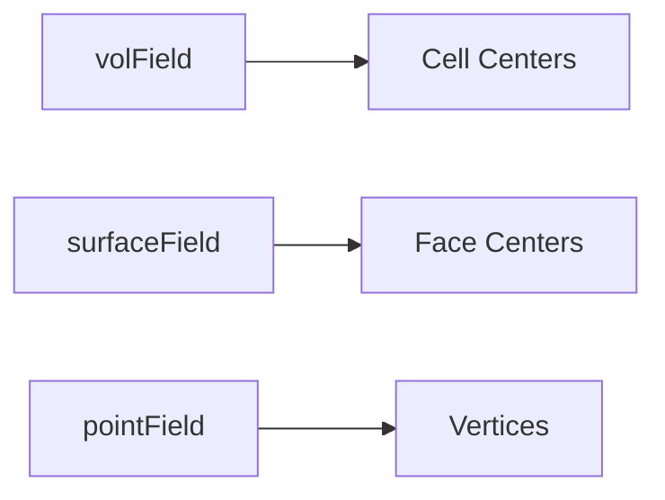

# Point Fields

Point Fields ใน OpenFOAM

---

## Overview

> **pointField** = Values stored at mesh vertices (points)



---

## 1. When to Use

| Use Case | Field Type |
|----------|------------|
| Mesh motion | `pointVectorField` |
| Nodal displacement | `pointVectorField` |
| Interpolation to post-proc | `pointScalarField` |

---

## 2. Point Mesh

```cpp
#include "pointMesh.H"

// Get point mesh
const pointMesh& pMesh = pointMesh::New(mesh);

// Create point field
pointVectorField pointD
(
    IOobject("pointDisplacement", runTime.timeName(), mesh),
    pMesh,
    dimensionedVector("zero", dimLength, vector::zero)
);
```

---

## 3. Common Types

| Alias | Type |
|-------|------|
| `pointScalarField` | `GeometricField<scalar, pointPatchField, pointMesh>` |
| `pointVectorField` | `GeometricField<vector, pointPatchField, pointMesh>` |

---

## 4. Interpolation

### Volume → Point

```cpp
#include "volPointInterpolation.H"

volPointInterpolation vpi(mesh);
pointScalarField Tpoints = vpi.interpolate(T);
```

### Point → Volume

```cpp
// Typically use mesh.movePoints instead
// Direct interpolation less common
```

---

## 5. Mesh Motion

```cpp
// Standard mesh motion uses pointVectorField
pointVectorField displacement = ...;

// Move mesh points
mesh.movePoints(mesh.points() + displacement);
```

---

## 6. Boundary Conditions

```cpp
// Point field boundary types
fixedValue
slip
symmetryPlane
empty
```

---

## Quick Reference

| Task | Method |
|------|--------|
| Get point mesh | `pointMesh::New(mesh)` |
| Interpolate vol→point | `volPointInterpolation` |
| Access points | `mesh.points()` |
| Move mesh | `mesh.movePoints(newPoints)` |

---

## 🧠 Concept Check

<details>
<summary><b>1. point vs vol field?</b></summary>

- **vol**: Cell centers
- **point**: Mesh vertices
</details>

<details>
<summary><b>2. pointMesh vs fvMesh?</b></summary>

- **fvMesh**: cell/face topology for FV
- **pointMesh**: vertex topology for point fields
</details>

<details>
<summary><b>3. ใช้ point field เมื่อไหร่?</b></summary>

**Mesh motion** และ **nodal-based calculations**
</details>

---

## 📖 เอกสารที่เกี่ยวข้อง

- **ภาพรวม:** [00_Overview.md](00_Overview.md)
- **Volume Fields:** [02_Volume_Fields.md](02_Volume_Fields.md)