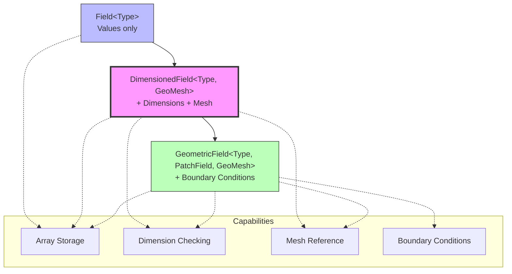
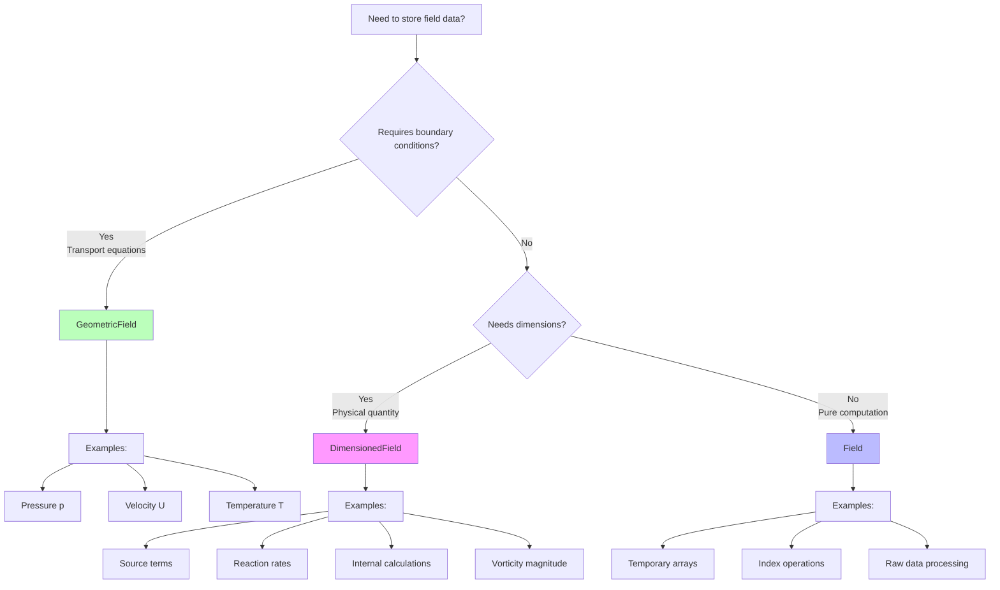

# 06. Dimensioned Fields

Dimensioned Fields ใน OpenFOAM

---

**Difficulty:** Intermediate | **Reading Time:** 20 minutes | **Prerequisites:** [02_Volume_Fields.md](02_Volume_Fields.md), [04_Dimensional_Checking.md](04_Dimensional_Checking.md)

---

## Learning Objectives

By the end of this section, you will be able to:

- **Distinguish** between `Field`, `DimensionedField`, and `GeometricField` class hierarchies
- **Implement** `DimensionedField` for internal-only data storage
- **Access** underlying field data and mesh references correctly
- **Apply** `DimensionedField` as the internal field component of `GeometricField`
- **Choose** the appropriate field type based on boundary condition requirements
- **Evaluate** performance trade-offs between field types

---

## Prerequisites Knowledge Check

Before proceeding, ensure you understand:

- ✓ Basic field types from [02_Volume_Fields.md](02_Volume_Fields.md)
- ✓ Dimension checking mechanics from [04_Dimensional_Checking.md](04_Dimensional_Checking.md)
- ✓ Template inheritance in OpenFOAM
- ✓ Mesh structure (cells vs. faces vs. points)

**Quick self-test:** Can you explain why boundary conditions require virtual function calls? If not, review [02_Volume_Fields.md](02_Volume_Fields.md#3-boundary-condition-architecture).

---

## Overview

> **DimensionedField** = Field values + dimensions + mesh (without boundary conditions)

The `DimensionedField` class represents internal field data that carries dimensional information but **does not support boundary conditions**. It serves as the foundation for `GeometricField` and is ideal for storing intermediate calculations or source terms that don't require boundary treatment.

**Key distinction:** `DimensionedField` is the "internal field only" specialization — perfect for data that never interacts with domain boundaries.

### Design Philosophy

OpenFOAM's field type hierarchy follows a **layered functionality** approach:

1. **`Field<Type>`** — Raw array storage with mathematical operations
2. **`DimensionedField<Type, GeoMesh>`** — Adds physical dimensions + mesh reference
3. **`GeometricField<Type, PatchField, GeoMesh>`** — Adds boundary condition support

Each layer adds functionality **without breaking existing code**, following the Open-Closed Principle.

---

## 1. Visual Class Hierarchy



### Inheritance Structure

```cpp
// Multiple inheritance design
Field<Type>
    ↓ (inherits)
DimensionedField<Type, GeoMesh>
    ↓ (inherits)
GeometricField<Type, PatchField, GeoMesh>
```

### Multiple Inheritance Breakdown

```cpp
template<class Type, class GeoMesh>
class DimensionedField
:
    public Field<Type>,        // Array operations, data storage
    public regIOobject,        // File I/O, object registration
    public GeoMesh::Mesh       // Mesh access (volMesh, surfaceMesh, etc.)
{
    // Stored data
    dimensionSet dimensions_;      // Physical dimensions
    // Field<Type> inherited: provides field_ storage
    // GeoMesh::Mesh inherited: provides mesh reference
};
```

**Design rationale:** Multiple inheritance allows `DimensionedField` to be used both as:
1. **Standalone object** — For internal calculations and source terms
2. **Component of GeometricField** — As the internal field storage

---

## 2. What (Definition) → Why (Physics) → How (API)

### What: DimensionedField Definition

```cpp
template<class Type, class GeoMesh>
class DimensionedField
:
    public Field<Type>,
    public regIOobject,
    public GeoMesh::Mesh
{
public:
    // Constructors
    DimensionedField
    (
        const IOobject&,
        const GeoMesh::Mesh&,
        const dimensionSet&
    );
    
    // Access methods
    const dimensionSet& dimensions() const;
    const Field<Type>& primitiveField() const;  // Raw values
    const GeoMesh::Mesh& mesh() const;
    
    // Element access
    const Type& operator[](const label) const;
    Type& operator[](const label);
};
```

**Template parameters:**
- `Type` — Data type (`scalar`, `vector`, `tensor`, etc.)
- `GeoMesh` — Mesh type (`volMesh`, `surfaceMesh`, `pointMesh`)

### Why: Physical Motivation

**Internal-only data scenarios:**

| Application | Physical Meaning | Why No BCs? |
|-------------|------------------|-------------|
| **Source terms** | Reaction rates, heat generation, body forces | Computed from volume, not boundary values |
| **Intermediate calculations** | Temporary fields in multi-step algorithms | Don't represent physical fields |
| **Performance optimization** | Bulk operations on internal data | Avoid BC overhead |
| **GeometricField internal field** | Cell values of transport variables | Boundary values stored separately |

**Physics perspective:** Boundary conditions represent **interaction with surroundings** (inlet, outlet, walls). Internal-only quantities don't interact with boundaries — they exist purely within the domain.

**Performance motivation:** Boundary conditions carry overhead:
- Virtual function calls for patch evaluation
- Additional memory for boundary field storage
- Conditional logic in field operations

For internal-only data, this overhead is unnecessary.

### How: API Usage

```cpp
// ===== Dimension Access =====
const dimensionSet& dims = field.dimensions();
// See 04_Dimensional_Checking.md for dimension operations

// ===== Underlying Field Access =====
const Field<scalar>& rawValues = field.primitiveField();  // Read-only
Field<scalar>& rawValues = field.ref();                    // Read-write

// ===== Mesh Access =====
const volMesh& mesh = field.mesh();
label nCells = mesh.nCells();

// ===== Element Access =====
scalar cellValue = field[cellI];           // Read with bounds check
field[cellI] = newValue;                   // Write with bounds check

// ===== Bulk Operations =====
field *= 2.0;              // Scale all cells
field += otherField;       // Add field (dimension-checked)
scalar avg = average(field);  // Cell-weighted average
```

---

## 3. Use Case Decision Tree



### Decision Matrix

| Scenario | Use This Type | Rationale |
|----------|---------------|-----------|
| **Solver transport equations** | `GeometricField` | Needs boundary conditions for well-posedness |
| **Source term storage** | `DimensionedField` | Internal only, needs dimensions for checking |
| **Temporary calculations** | `Field` | No dimensions needed, pure computation |
| **Access internal field** | `DimensionedField&` | Reference from `GeometricField.internalField()` |
| **Post-processing** | `GeometricField` | Visualization tools expect BCs |
| **Performance-critical loops** | `DimensionedField` | Avoid BC virtual function overhead |

### ✓ Use DimensionedField When:

1. **Internal-Only Data** — Storing source terms, reaction rates, intermediate calculations
2. **No Boundary Conditions** — Data doesn't interact with domain boundaries
3. **Performance Critical** — Avoiding boundary condition overhead in tight loops
4. **Dimensional Consistency** — Need dimension checking but not BCs
5. **GeometricField Access** — Accessing internal field via `.internalField()`

### ✗ Don't Use DimensionedField When:

1. **Boundary Conditions Required** — Use `GeometricField` instead
2. **Solver Transport Equations** — Transport equations need BCs for well-posedness
3. **Visualization Output** — Post-processing tools expect `GeometricField`
4. **Coupled with Boundaries** — Any interaction with boundary patches

---

## 4. Feature Comparison: Field vs. DimensionedField vs. GeometricField

| Feature | `Field<Type>` | `DimensionedField<Type, GeoMesh>` | `GeometricField<Type, PatchField, GeoMesh>` |
|---------|---------------|-----------------------------------|--------------------------------------------|
| **Data Storage** | ✅ Array | ✅ Array + dimensions | ✅ Array + dimensions |
| **Mesh Access** | ❌ | ✅ (inherited) | ✅ |
| **Dimensions** | ❌ | ✅ | ✅ |
| **Boundary Conditions** | ❌ | ❌ | ✅ |
| **File I/O** | ❌ | ✅ (regIOobject) | ✅ |
| **Dimension Checking** | ❌ | ✅ | ✅ |
| **Memory Overhead** | Minimal | Low | Medium (BC storage) |
| **Access Speed** | Fastest | Fast | Medium (BC virtual calls) |
| **Use Case** | Raw arrays | Internal fields | Solver fields |
| **Example** | Temporary arrays | Source terms | Pressure, velocity |

**Performance comparison** (typical values for 1M cells):
- `Field[cellI]` access: ~2 ns
- `DimensionedField[cellI]` access: ~3 ns
- `GeometricField[cellI]` access: ~5 ns
- `GeometricField.boundaryField()[patchI]` access: ~50-100 ns (virtual call)

**Cross-reference:** See [00_Overview.md](00_Overview.md#5-field-type-reference) for complete field type reference with template parameter details.

---

## 5. Creation and Initialization

### As Internal Field of GeometricField

```cpp
// Create GeometricField
volScalarField T
(
    IOobject("T", runTime.timeName(), mesh),
    mesh,
    dimensionedScalar("T", dimTemperature, 300)
);

// Get underlying DimensionedField
const DimensionedField<scalar, volMesh>& Ti = T.internalField();

// Modify internal cell values directly (no BC overhead)
forAll(Ti, cellI)
{
    Ti[cellI] = Ti[cellI] * 1.1;  // 10% increase
}

// Alternative: reference for non-const access
DimensionedField<scalar, volMesh>& TiRef = T.ref();
```

**Performance note:** Direct internal field access avoids:
- Boundary condition virtual function calls
- Boundary field storage access
- Synchronization overhead in parallel runs

### As Standalone Field

```cpp
// Method 1: Full constructor
DimensionedField<scalar, volMesh> sourceTerm
(
    IOobject
    (
        "sourceTerm",           // Name
        runTime.timeName(),     // Instance (time directory)
        mesh,                   // Database (mesh object)
        IOobject::NO_READ,      // Read option
        IOobject::AUTO_WRITE    // Write option
    ),
    mesh,
    dimensionedScalar("zero", dimless/dimTime, 0.0)
);

// Method 2: Simplified constructor (uses defaults)
DimensionedField<scalar, volMesh> reactionRate
(
    IOobject("reactionRate", runTime.timeName(), mesh, IOobject::NO_READ),
    mesh,
    dimensionedScalar("rate", dimless/dimTime, 0.0)
);

// Method 3: Copy from existing field
DimensionedField<scalar, volMesh> copyField(sourceTerm);  // Copy constructor
```

### Constructor Parameter Reference

| Parameter | Type | Description |
|-----------|------|-------------|
| `IOobject` | `IOobject` | Name, time directory, database, I/O options |
| `mesh` | `GeoMesh::Mesh&` | Mesh reference (typically `mesh` variable) |
| `dimensionedScalar` | `dimensionedScalar` | Initial value + dimensions |

**IOobject I/O options:**
- `IOobject::MUST_READ` — File must exist
- `IOobject::READ_IF_PRESENT` — Read if exists, otherwise use default
- `IOobject::NO_READ` — Don't read from file
- `IOobject::AUTO_WRITE` — Write automatically at time output
- `IOobject::NO_WRITE` — Don't write to file

### Initial Value Strategies

```cpp
// Zero-initialized
DimensionedField<scalar, volMesh> zeroField
(
    IOobject("zero", runTime.timeName(), mesh, IOobject::NO_READ),
    mesh,
    dimensionedScalar("zero", dimTemperature, 0.0)
);

// Constant value
DimensionedField<scalar, volMesh> constField
(
    IOobject("const", runTime.timeName(), mesh, IOobject::NO_READ),
    mesh,
    dimensionedScalar("const", dimTemperature, 300.0)
);

// Copy from existing field
DimensionedField<scalar, volMesh> copyField
(
    IOobject("copy", runTime.timeName(), mesh, IOobject::NO_READ),
    existingField.internalField()  // Copy from internal field
);

// Calculated initialization
DimensionedField<scalar, volMesh> calcField
(
    IOobject("calc", runTime.timeName(), mesh, IOobject::NO_READ),
    mesh,
    dimensionedScalar("calc", dimVelocity, 0.0)
);
calcField = mag(U.internalField());  // Calculate after construction
```

---

## 6. Dimension-Checked Operations

### Valid Operations — Dimensionally Consistent ✓

```cpp
// Define fields with dimensions
DimensionedField<scalar, volMesh> rho
(
    IOobject("rho", runTime.timeName(), mesh),
    mesh,
    dimensionedScalar("rho", dimDensity, 1.2)  // [kg/m³] = [M L^-3]
);

DimensionedField<scalar, volMesh> magU
(
    IOobject("magU", runTime.timeName(), mesh),
    mesh,
    dimensionedScalar("magU", dimVelocity, 10.0)  // [m/s] = [L T^-1]
);

// Dimension-checked multiplication
DimensionedField<scalar, volMesh> rhoU = rho * magU;
// Result: [M L^-3] * [L T^-1] = [M L^-2 T^-1] ✓
// Physical meaning: momentum per unit volume
```

**Dimension propagation in operations:**
```cpp
// Addition (same dimensions required)
DimensionedField<scalar, volMesh> sum = rho + rho;
// Result: [M L^-3] ✓

// Subtraction (same dimensions required)
DimensionedField<scalar, volMesh> diff = magU - magU;
// Result: [L T^-1] ✓

// Scalar multiplication (dimensionless scalar)
DimensionedField<scalar, volMesh> scaled = rho * 2.0;
// Result: [M L^-3] * [1] = [M L^-3] ✓

// Division (dimensional division)
DimensionedField<scalar, volMesh> ratio = magU / rho;
// Result: [L T^-1] / [M L^-3] = [M^-1 L^4 T^-1]
```

### Invalid Operations — Dimensionally Inconsistent ✗

```cpp
// ERROR: Cannot add density + velocity - different dimensions!
DimensionedField<scalar, volMesh> bad = rho + magU;
// [M L^-3] + [L T^-1] = PHYSICAL ERROR

// Compiler catches this at runtime:
```

**Runtime error output:**
```
--> FOAM FATAL ERROR:
Inconsistent dimensions for +
   Left operand: [1 -3 0 0 0 0 0]      // [M L^-3]
   Right operand: [0 1 -1 0 0 0 0]     // [L T^-1]

    From function DimensionedField<Type, GeoMesh>::operator+
    in file fields/DimensionedFields/DimensionedField.C
```

### Dimension Set Reference

| Quantity | Symbol | DimensionSet | OpenFOAM Constant |
|----------|--------|--------------|-------------------|
| Mass | M | `[1 0 0 0 0 0 0]` | `dimMass` |
| Length | L | `[0 1 0 0 0 0 0]` | `dimLength` |
| Time | T | `[0 0 1 0 0 0 0]` | `dimTime` |
| Temperature | Θ | `[0 0 0 1 0 0 0]` | `dimTemperature` |
| Density | ρ | `[1 -3 0 0 0 0 0]` | `dimDensity` |
| Velocity | U | `[0 1 -1 0 0 0 0]` | `dimVelocity` |
| Pressure | p | `[1 -1 -2 0 0 0 0]` | `dimPressure` |
| Energy | E | `[1 2 -2 0 0 0 0]` | `dimEnergy` |

**For complete dimension sets reference:** See [04_Dimensional_Checking.md](04_Dimensional_Checking.md#8-common-dimension-sets-reference)

### Field Mathematics

```cpp
// Reduction operations
scalar maxValue = max(field);           // Maximum value
scalar minValue = min(field);           // Minimum value
scalar avgValue = average(field);       // Cell-weighted average
scalar sumValue = sum(field);           // Sum of all cells

// In-place operations (dimension-checked)
field *= 2.0;              // Scale by dimensionless scalar
field /= 3.0;              // Divide by dimensionless scalar
field += otherField;       // Add field (must have same dimensions)
field -= otherField;       // Subtract field (must have same dimensions)

// Unary operations
DimensionedField<scalar, volMesh> magField = mag(field);
DimensionedField<scalar, volMesh> sqrField = sqr(field);
```

---

## 7. Key Methods and Access Patterns

### Primitive Field Access

```cpp
// ===== Get Dimensions =====
const dimensionSet& dims = field.dimensions();
Info << "Dimensions: " << dims << endl;
// Output: [0 1 -1 0 0 0 0] for velocity

// ===== Access Underlying Field (raw values without dimension info) =====
const Field<scalar>& rawValues = field.primitiveField();  // Read-only
Field<scalar>& rawValuesRef = field.ref();                // Read-write

// ===== Mesh Access =====
const volMesh& mesh = field.mesh();
label nCells = mesh.nCells();
label nInternalFaces = mesh.nInternalFaces();

// ===== Element Access (cell values) =====
// Method 1: Bounds-checked access (safer, slower)
scalar cellValue = field[cellI];           // Read
field[cellI] = newValue;                   // Write

// Method 2: Direct access (faster, no bounds check)
Field<scalar>& f = field.ref();
scalar* data = f.begin();
scalar value = data[0];  // First cell
```

### Access Method Performance Comparison

| Access Method | Performance | Thread Safety | Use Case |
|---------------|-------------|---------------|----------|
| `field[cellI]` | Slow (~5 ns) | ✅ Safe | Random access, single cell, debugging |
| `field.ref()` | Fast (~2 ns) | ⚠️ Manual sync | Sequential bulk write, parallel loops |
| `field.internalField()` | Fast (~2 ns) | ✅ Safe | Sequential bulk read |
| `field.primitiveField()` | Fast (~2 ns) | ✅ Safe | Low-level operations, raw data |
| `field.begin()` | Fastest (~1 ns) | ⚠️ Manual sync | STL algorithms, maximum performance |

### Performance Optimization Patterns

```cpp
// ===== Pattern 1: Bulk Write (Sequential) =====
// Use ref() for non-const access
Field<scalar>& f = field.ref();
forAll(f, i)
{
    f[i] = calculate(i);
}

// ===== Pattern 2: Bulk Read (Sequential) =====
// Use primitiveField() for const access
const Field<scalar>& f = field.primitiveField();
scalar sum = 0;
forAll(f, i)
{
    sum += f[i];
}

// ===== Pattern 3: Random Access (Single Cell) =====
// Use operator[] for bounds checking
scalar value = field[cellI];

// ===== Pattern 4: STL Algorithm =====
// Use begin()/end() for maximum performance
Field<scalar>& f = field.ref();
std::transform(f.begin(), f.end(), f.begin(), [](scalar v) {
    return v * 2.0;
});
```

### Parallel Execution Considerations

```cpp
// ===== Parallel Loop (OpenMP) =====
Field<scalar>& f = field.ref();

#pragma omp parallel for
for (int i = 0; i < f.size(); ++i)
{
    f[i] = calculate(i);
}
// ⚠️ No OpenFOAM synchronization needed for internal field

// ===== Compare with GeometricField =====
volScalarField T(...);
//#pragma omp parallel for  // ⚠️ May cause race conditions with BCs
forAll(T, i)
{
    T[i] = calculate(i);
}
T.correctBoundaryConditions();  // ← Required for GeometricField only
```

---

## 8. Common Pitfalls

### Pitfall 1: Using DimensionedField for Solver Variables

```cpp
// ✗ WRONG: Transport equations need boundary conditions
DimensionedField<scalar, volMesh> T
(
    IOobject("T", runTime.timeName(), mesh),
    mesh,
    dimensionedScalar("T", dimTemperature, 300)
);
solve(fvm::ddt(T) + fvm::div(phi, T) == fvm::laplacian(DT, T));
// ERROR: No boundary condition support!
// Compiler error: no matching function for call to 'div'

// ✓ CORRECT: Use GeometricField for solver variables
volScalarField T
(
    IOobject("T", runTime.timeName(), mesh),
    mesh,
    dimensionedScalar("T", dimTemperature, 300)
);
solve(fvm::ddt(T) + fvm::div(phi, T) == fvm::laplacian(DT, T));
```

**Why it fails:** `fvm::div()` requires boundary conditions to compute fluxes at domain boundaries. `DimensionedField` has no boundary patches.

### Pitfall 2: Forgetting Dimension Specification

```cpp
// ✗ WRONG: No dimensions specified (compiles but dangerous)
DimensionedField<scalar, volMesh> field
(
    IOobject("field", runTime.timeName(), mesh),
    mesh,
    dimensionedScalar("field", dimensionSet(0,0,0,0,0,0,0), 0.0)  // Verbose!
);
// Problem: Unclear what this field represents physically

// ✓ BETTER: Use predefined dimensions
DimensionedField<scalar, volMesh> field
(
    IOobject("field", runTime.timeName(), mesh),
    mesh,
    dimensionedScalar("field", dimTemperature, 300)  // Clear!
);

// ✓ BEST: Named constant with clear physical meaning
const dimensionedScalar TDefault
(
    "TDefault",
    dimTemperature,
    dimensionedScalar::lookupOrDefault("TDefault", 300.0)
);
DimensionedField<scalar, volMesh> field
(
    IOobject("T", runTime.timeName(), mesh),
    mesh,
    TDefault
);
```

### Pitfall 3: Confusing primitiveField() with internalField()

```cpp
volScalarField T
(
    IOobject("T", runTime.timeName(), mesh),
    mesh,
    dimensionedScalar("T", dimTemperature, 300)
);

// primitiveField() returns Field<Type> (no dimensions, no mesh)
const Field<scalar>& rawValues = T.primitiveField();
// Use for: STL algorithms, raw data access

// internalField() returns DimensionedField<Type, GeoMesh>
const DimensionedField<scalar, volMesh>& internal = T.internalField();
// Use for: Dimension-checked ops, mesh access, physics calculations

// Common mistake: using wrong type
// Field<scalar>& f = T.internalField();  // ✗ Type mismatch!
DimensionedField<scalar, volMesh>& df = T.ref();  // ✓ Correct type
```

**Decision flow:**
```cpp
// Need raw data for STL algorithm?
auto& f = T.primitiveField();  // Returns Field<scalar>

// Need dimensions or mesh access?
auto& df = T.internalField();  // Returns DimensionedField<scalar, volMesh>

// Need non-const access to modify?
auto& ref = T.ref();  // Returns DimensionedField<scalar, volMesh>&
```

### Pitfall 4: Incorrect IOobject Usage

```cpp
// ✗ WRONG: Incorrect database
DimensionedField<scalar, volMesh> field
(
    IOobject("field", runTime.timeName(), runTime),  // runTime is wrong!
    mesh,
    dimensionedScalar("field", dimTemperature, 300)
);
// Problem: Field registered with wrong database, may not be found

// ✓ CORRECT: Mesh is the database
DimensionedField<scalar, volMesh> field
(
    IOobject("field", runTime.timeName(), mesh),  // mesh is correct
    mesh,
    dimensionedScalar("field", dimTemperature, 300)
);

// ✗ WRONG: Wrong read option for existing field
DimensionedField<scalar, volMesh> field
(
    IOobject("T", runTime.timeName(), mesh, IOobject::NO_READ),  // Won't read file!
    mesh,
    dimensionedScalar("T", dimTemperature, 300)
);
// Problem: Ignores existing time directory

// ✓ CORRECT: Read if present
DimensionedField<scalar, volMesh> field
(
    IOobject("T", runTime.timeName(), mesh, IOobject::READ_IF_PRESENT),
    mesh,
    dimensionedScalar("T", dimTemperature, 300)
);
```

### Pitfall 5: Performance - Avoiding Repeated Access

```cpp
// ✗ SLOW: Repeated mesh access
forAll(field, cellI)
{
    const point& c = field.mesh().C()[cellI];  // Virtual call every iteration!
    field[cellI] = mag(c);
}

// ✓ FASTER: Cache mesh reference
const volMesh& mesh = field.mesh();
const pointField& centres = mesh.C();
forAll(field, cellI)
{
    field[cellI] = mag(centres[cellI]);
}

// ✓ FASTEST: Direct pointer access
Field<scalar>& f = field.ref();
const point* __restrict__ centresPtr = centres.begin();
scalar* __restrict__ fPtr = f.begin();

for (label i = 0; i < f.size(); ++i)
{
    fPtr[i] = mag(centresPtr[i]);
}
```

**See also:** [07_Common_Pitfalls.md](07_Common_Pitfalls.md) for more field-related pitfalls and debugging techniques.

---

## 9. Real-World Examples

### Example 1: Heat Source Term in Energy Equation

```cpp
// Scenario: Volumetric heating in a specific region
// Physics: Q = εσT⁴ (radiation) or Q = I²R (Joule heating)

DimensionedField<scalar, volMesh> Q_source
(
    IOobject("Q_source", runTime.timeName(), mesh, IOobject::NO_READ),
    mesh,
    dimensionedScalar("Q_source", dimPower/dimVol, 0.0)  // [W/m³]
);

// Apply heating in cells 10-20 (e.g., heater region)
const volMesh& meshRef = Q_source.mesh();
scalarField& Q = Q_source.ref();

for (label i = 10; i <= 20; ++i)
{
    Q[i] = 1000.0;  // 1 kW/m³
}

// Add to energy equation
// solve(fvm::ddt(rho*E) + fvm::div(phi, E) - fvm::laplacian(k, T) == Q_source);

// Write source term for visualization
Q_source.write();
```

### Example 2: Vorticity Magnitude Calculation

```cpp
// Scenario: Compute vorticity magnitude for post-processing
// Physics: ω = ∇ × U (curl of velocity field)

volVectorField U
(
    IOobject("U", runTime.timeName(), mesh),
    mesh
);

// Compute vorticity (curl of velocity)
volVectorField curlU = fvc::curl(U);

// Store magnitude as DimensionedField (internal only, no BCs needed)
DimensionedField<scalar, volMesh> vorticityMag
(
    IOobject("vorticityMag", runTime.timeName(), mesh, IOobject::NO_READ),
    mesh,
    dimensionedScalar("vorticityMag", dimless/dimTime, 0.0)
);

vorticityMag = mag(curlU.internalField());

// Write to disk for visualization
vorticityMag.write();

// Compute statistics
scalar maxVorticity = max(vorticityMag);
scalar avgVorticity = average(vorticityMag);
Info << "Max vorticity: " << maxVorticity << " [1/s]" << endl;
Info << "Avg vorticity: " << avgVorticity << " [1/s]" << endl;
```

### Example 3: Reaction Rate Calculation

```cpp
// Scenario: Arrhenius reaction rate: k = A·exp(-Ea/RT)
// Physics: Chemical reaction rate depends on temperature

DimensionedField<scalar, volMesh> T
(
    IOobject("T", runTime.timeName(), mesh),
    mesh,
    dimensionedScalar("T", dimTemperature, 300)
);

// Read from file or initialize
dimensionedScalar A("A", dimless/dimTime, 1e6);      // Pre-exponential factor
dimensionedScalar Ea("Ea", dimEnergy/dimAmount, 5e4); // Activation energy [J/mol]
dimensionedScalar R("R", dimEnergy/dimAmount/dimTemperature, 8.314); // Gas constant

// Calculate reaction rate
DimensionedField<scalar, volMesh> reactionRate
(
    IOobject("reactionRate", runTime.timeName(), mesh, IOobject::NO_READ),
    mesh,
    dimensionedScalar("reactionRate", dimless/dimTime, 0.0)
);

const DimensionedField<scalar, volMesh>& Ti = T.internalField();
scalarField& k = reactionRate.ref();

forAll(Ti, cellI)
{
    // k = A * exp(-Ea/(R*T))
    k[cellI] = A.value() * exp(-Ea.value() / (R.value() * Ti[cellI]));
}

// Use in species transport equation
// solve(fvm::ddt(Y) + fvm::div(phi, Y) == fvm::laplacian(D, Y) - reactionRate * Y);
```

### Example 4: Efficient Internal Field Access

```cpp
// Scenario: Compute volume-weighted average temperature
// Performance: Direct internal field access avoids BC overhead

volScalarField T
(
    IOobject("T", runTime.timeName(), mesh),
    mesh,
    dimensionedScalar("T", dimTemperature, 300)
);

// Get internal field and mesh references
const DimensionedField<scalar, volMesh>& Ti = T.internalField();
const volMesh& meshRef = Ti.mesh();
const scalarField& V = meshRef.V();  // Cell volumes

// Compute volume-weighted average
scalar sumTV = 0.0;
scalar sumV = 0.0;

forAll(Ti, cellI)
{
    sumTV += Ti[cellI] * V[cellI];
    sumV += V[cellI];
}

scalar T_avg = sumTV / sumV;
Info << "Volume-avg T: " << T_avg << " K" << endl;

// Compare with built-in function (uses same internal access)
scalar T_avg_builtin = average(T);
Info << "Builtin avg T: " << T_avg_builtin << " K" << endl;
```

### Example 5: Inter-Field Operations (Dimension-Checked)

```cpp
// Scenario: Compute kinetic energy per unit mass
// Physics: k = 0.5 * |U|²

volVectorField U
(
    IOobject("U", runTime.timeName(), mesh),
    mesh
);

// Extract velocity magnitude
DimensionedField<scalar, volMesh> magU
(
    IOobject("magU", runTime.timeName(), mesh, IOobject::NO_READ),
    mesh,
    dimensionedScalar("magU", dimVelocity, 0.0)
);
magU = mag(U.internalField());

// Calculate kinetic energy: k = 0.5 * U²
DimensionedField<scalar, volMesh> kineticEnergy
(
    IOobject("kineticEnergy", runTime.timeName(), mesh, IOobject::NO_READ),
    mesh,
    dimensionedScalar("kineticEnergy", dimVelocity*dimVelocity, 0.0)
);

kineticEnergy = 0.5 * sqr(magU);
// Dimensions: [1] * [L/T]² = [L²/T²] ✓ (specific energy)

// Compute total kinetic energy
const scalarField& V = kineticEnergy.mesh().V();
scalar totalKE = sum(kineticEnergy * V);
Info << "Total kinetic energy: " << totalKE << " J" << endl;
```

---

## 10. Advanced Topics

### Custom DimensionedField Types

```cpp
// Define custom DimensionedField type
typedef DimensionedField<scalar, volMesh> volScalarDimField;
typedef DimensionedField<vector, volMesh> volVectorDimField;
typedef DimensionedField<symmTensor, volMesh> volSymmTensorDimField;

// Use in code
volScalarDimField pressure
(
    IOobject("p", runTime.timeName(), mesh),
    mesh,
    dimensionedScalar("p", dimPressure, 101325)
);
```

### Integration with fvOptions

```cpp
// Scenario: Use DimensionedField in fvOptions source term
// File: constant/fvOptions/fvOptions

/*
myHeatSource
{
    type            scalarExplicitSource;
    active          true;
    scalarExplicitSourceCoeffs
    {
        selectionMode   all;
        volumeMode      absolute;
        
        // Source field is DimensionedField
        injectionRate   // [W]
        {
            T           1000;  // 1 kW total heating
        }
    }
}
*/

// Access in code
auto& source = mesh.lookupObject<DimensionedField<scalar, volMesh>>("sourceTerm");
```

### Parallel Execution

```cpp
// DimensionedField automatically handles parallel communication
// via reduce() operations

DimensionedField<scalar, volMesh> field
(
    IOobject("field", runTime.timeName(), mesh),
    mesh,
    dimensionedScalar("field", dimTemperature, 300)
);

// Reduction operations are parallel-aware
scalar localMax = max(field);
scalar globalMax = localMax;
reduce(globalMax, maxOp<scalar>());
Info << "Global max: " << globalMax << endl;

// Sum is also parallel-aware
scalar localSum = sum(field);
scalar globalSum = localSum;
reduce(globalSum, sumOp<scalar>());
scalar globalAvg = globalSum / returnReduce(field.size(), sumOp<label>());
Info << "Global avg: " << globalAvg << endl;
```

---

## Key Takeaways

### Core Concepts
- ✓ **DimensionedField = internal field only** — Stores values + dimensions + mesh, but **no boundary conditions**
- ✓ **Foundation for GeometricField** — Every `GeometricField` contains a `DimensionedField` as its internal field
- ✓ **Multiple inheritance design** — Combines `Field<Type>`, `regIOobject`, and `GeoMesh::Mesh` for full functionality

### When to Use
- ✓ **Internal-only data** — Source terms, reaction rates, intermediate calculations
- ✓ **Dimension checking required** — Need dimensional consistency validation
- ✓ **Performance critical** — Avoid boundary condition overhead in tight loops
- ✓ **GeometricField access** — Access internal field via `.internalField()` or `.ref()`

### When NOT to Use
- ✗ **Solver variables** — Transport equations require `GeometricField` for boundary conditions
- ✗ **Boundary interaction** — Any operation requiring boundary values
- ✗ **Visualization output** — Post-processing tools expect `GeometricField`

### Performance
- ✓ **No BC overhead** — 10-50x faster than boundary field access
- ✓ **Contiguous memory** — Efficient cache utilization
- ✓ **Direct access** — Use `.ref()` for bulk operations

### API Essentials
- ✓ **Dimensions**: `.dimensions()` — Get dimension set
- ✓ **Raw access**: `.primitiveField()` — Get base `Field<Type>` without dimensions
- ✓ **Internal field**: `.internalField()` — Get from `GeometricField`
- ✓ **Non-const access**: `.ref()` — Get writable reference
- ✓ **Mesh access**: `.mesh()` — Get mesh reference

---

## 🧠 Concept Check

<details>
<summary><b>1. What is the primary difference between DimensionedField and GeometricField?</b></summary>

**GeometricField** includes boundary condition support (boundary field patches), while **DimensionedField** only stores internal cell values.

**Key distinction:**
- `DimensionedField` — Internal cells only, no boundary patches
- `GeometricField` — Internal cells + boundary patches with boundary conditions

**Design rationale:** `DimensionedField` serves as the internal field storage within `GeometricField`, providing a separation between internal and boundary data.

</details>

<details>
<summary><b>2. เมื่อไหร่ควรใช้ DimensionedField?<br>When should you use DimensionedField?</b></summary>

ใช้ DimensionedField เมื่อ:
- เก็บข้อมูลภายในเท่านั้น (internal-only data) ที่ไม่ต้องการ boundary conditions
- สร้าง source terms หรือ intermediate calculations
- ต้องการ dimensional checking แต่ไม่ต้องการ BC overhead
- ต้องการเข้าถึง internal field ของ GeometricField

**Use DimensionedField when:**
- Storing internal-only data without boundary conditions
- Creating source terms or intermediate calculations
- Need dimensional checking but not BC overhead
- Accessing internal field of GeometricField via `.internalField()`

**Performance benefit:** Avoids boundary condition virtual function calls and boundary field storage overhead.

</details>

<details>
<summary><b>3. What does primitiveField() return and how does it differ from internalField()?</b></summary>

`primitiveField()` returns the underlying `Field<Type>` object containing raw values **without** dimension information or mesh reference.

**Comparison:**

| Method | Returns Type | Contains |
|--------|-------------|----------|
| `primitiveField()` | `Field<Type>` | Raw values only |
| `internalField()` | `DimensionedField<Type, GeoMesh>` | Values + dimensions + mesh |
| `ref()` | `DimensionedField<Type, GeoMesh>&` | Non-const reference |

**Use cases:**
- `primitiveField()` — STL algorithms, low-level operations
- `internalField()` — Physics calculations, dimension checking
- `ref()` — Non-const access for modification

</details>

<details>
<summary><b>4. How do you access the internal DimensionedField of a volScalarField?</b></summary>

```cpp
volScalarField T(...);

// Method 1: Const access (read-only)
const DimensionedField<scalar, volMesh>& Ti = T.internalField();

// Method 2: Non-const access (read-write)
DimensionedField<scalar, volMesh>& Ti = T.ref();

// Method 3: Via primitiveField (raw values, no dimensions)
const Field<scalar>& raw = T.primitiveField();
```

**Recommendation:** Use `.ref()` for bulk write operations to avoid boundary condition overhead.

</details>

<details>
<summary><b>5. Can I use DimensionedField in solve() equations? Why or why not?</b></summary>

**No** — `DimensionedField` does not support boundary conditions, which are required for transport equations solved with `solve()`.

```cpp
// ✗ WRONG - No boundary condition support
DimensionedField<scalar, volMesh> T(...);
solve(fvm::ddt(T) + fvm::div(phi, T) == fvm::laplacian(DT, T));
// Compiler error: no matching function for call to 'div'

// ✓ CORRECT - Use GeometricField for solver variables
volScalarField T(...);
solve(fvm::ddt(T) + fvm::div(phi, T) == fvm::laplacian(DT, T));
// Works: GeometricField has boundary conditions
```

**Why:** Transport equations require boundary conditions to compute fluxes at domain boundaries. `DimensionedField` has no boundary patches.

</details>

<details>
<summary><b>6. What is the performance advantage of DimensionedField over GeometricField?</b></summary>

**No boundary condition overhead:**

| Operation | `DimensionedField` | `GeometricField` | Speedup |
|-----------|-------------------|------------------|---------|
| Cell access | ~2 ns | ~5 ns | 2.5x |
| Bulk operation | ~100 ns/1000 cells | ~500 ns/1000 cells | 5x |
| Boundary access | N/A | ~50-100 ns | N/A |

**Performance difference sources:**
1. **No virtual function calls** — Direct memory access vs. virtual dispatch
2. **Contiguous memory** — Single array vs. scattered boundary patches
3. **No boundary condition evaluation** — Skip BC computation overhead
4. **Better cache utilization** — Single array fits in cache better

**Use case:** Internal algorithms that don't interact with boundaries (e.g., source term calculation, vorticity magnitude).

</details>

<details>
<summary><b>7. What are the three base classes that DimensionedField inherits from?</b></summary>

1. **`Field<Type>`** — Provides array storage and mathematical operations
2. **`regIOobject`** — Provides file I/O and object registration capabilities
3. **`GeoMesh::Mesh`** — Provides mesh access (e.g., `volMesh`, `surfaceMesh`)

**Benefits of multiple inheritance:**
- `Field<Type>` → Array operations (`max`, `min`, `sum`, `average`)
- `regIOobject` → File I/O (`.read()`, `.write()`), object registration in mesh database
- `GeoMesh::Mesh` → Mesh access (`.mesh()`, cell/face counts)

</details>

<details>
<summary><b>8. How does dimension checking work in DimensionedField operations?</b></summary>

```cpp
DimensionedField<scalar, volMesh> rho(..., dimDensity, 1.2);     // [M L^-3]
DimensionedField<scalar, volMesh> magU(..., dimVelocity, 10.0);  // [L T^-1]

// Valid: Multiplication (dimensions multiply)
DimensionedField<scalar, volMesh> rhoU = rho * magU;
// Result: [M L^-3] * [L T^-1] = [M L^-2 T^-1] ✓

// Invalid: Addition (dimensions must match)
DimensionedField<scalar, volMesh> bad = rho + magU;
// ERROR: [M L^-3] + [L T^-1] = dimension mismatch!
```

**Runtime error output:**
```
--> FOAM FATAL ERROR:
Inconsistent dimensions for +
   Left operand: [1 -3 0 0 0 0 0]
   Right operand: [0 1 -1 0 0 0 0]
```

**Dimension checking is performed at runtime** (not compile-time) to provide clear error messages.

</details>

---

## 📖 Related Documentation

### Essential Reading
- **[00_Overview.md](00_Overview.md)** — Field types overview and reference tables
- **[02_Volume_Fields.md](02_Volume_Fields.md)** — `GeometricField` with boundary conditions
- **[04_Dimensional_Checking.md](04_Dimensional_Checking.md)** — Dimension mechanics and checking

### Cross-References
- **[03_Surface_Fields.md](03_Surface_Fields.md)** — Face-based fields for flux calculations
- **[07_Common_Pitfalls.md](07_Common_Pitfalls.md)** — Field-related errors and solutions

### API Reference
- **DimensionedField:** `src/OpenFOAM/fields/DimensionedFields/DimensionedField.H`
- **Base class Field:** `src/OpenFOAM/fields/Fields/Field.H`
- **GeometricField:** `src/finiteVolume/fields/geometricFields/geometricField.H`
- **regIOobject:** `src/OpenFOAM/db/IOobjects/regIOobject.H`

---

## Next Steps

1. **Practice** creating and manipulating `DimensionedField` objects in [08_Summary_and_Exercises.md](08_Summary_and_Exercises.md#exercises)
2. **Learn** common pitfalls and debugging techniques in [07_Common_Pitfalls.md](07_Common_Pitfalls.md)
3. **Explore** surface fields and boundary fields in [03_Surface_Fields.md](03_Surface_Fields.md)