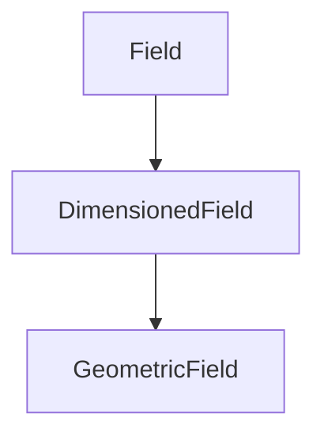

# Dimensioned Fields

Dimensioned Fields ใน OpenFOAM

---

## Overview

> **DimensionedField** = Field values + dimensions (without boundary)

---

## 1. Class Hierarchy



| Class | Has |
|-------|-----|
| `Field` | Values only |
| `DimensionedField` | + Dimensions + mesh |
| `GeometricField` | + Boundary conditions |

---

## 2. DimensionedField

```cpp
template<class Type, class GeoMesh>
class DimensionedField : public regIOobject
{
    dimensionSet dimensions_;
    Field<Type> field_;
    const GeoMesh::Mesh& mesh_;
};
```

### Access

```cpp
const dimensionSet& dims = field.dimensions();
const Field<Type>& vals = field.primitiveField();
const Mesh& m = field.mesh();
```

---

## 3. Common Uses

### Internal Field of GeometricField

```cpp
// volScalarField has internal DimensionedField
const DimensionedField<scalar, volMesh>& Ti = T.internalField();
```

### Standalone

```cpp
DimensionedField<scalar, volMesh> source
(
    IOobject("source", runTime.timeName(), mesh),
    mesh,
    dimensionedScalar("zero", dimless/dimTime, 0)
);
```

---

## 4. Dimension Access

```cpp
// Get dimensions
const dimensionSet& dims = field.dimensions();

// Check dimensionless
bool isDimless = dims.dimensionless();

// Set dimensions (usually in constructor)
field.dimensions() = dimTemperature;
```

---

## 5. Operations

### Arithmetic (dimension checked)

```cpp
DimensionedField<scalar, volMesh> rhoU = rho * magU;
// Dimensions: [M L^-3] * [L T^-1] = [M L^-2 T^-1]
```

### Field math

```cpp
scalar maxVal = max(field);
scalar avgVal = average(field);
```

---

## Quick Reference

| Class | Has Dimensions | Has Boundary |
|-------|----------------|--------------|
| `Field` | ❌ | ❌ |
| `DimensionedField` | ✅ | ❌ |
| `GeometricField` | ✅ | ✅ |

---

## 🧠 Concept Check

<details>
<summary><b>1. DimensionedField vs GeometricField?</b></summary>

**GeometricField** has boundary conditions, DimensionedField doesn't
</details>

<details>
<summary><b>2. เมื่อไหร่ใช้ DimensionedField?</b></summary>

**Internal-only data** ที่ไม่ต้องการ BC
</details>

<details>
<summary><b>3. primitiveField() คืออะไร?</b></summary>

**Underlying Field<Type>** without dimension info
</details>

---

## 📖 เอกสารที่เกี่ยวข้อง

- **ภาพรวม:** [00_Overview.md](00_Overview.md)
- **Dimensional Checking:** [04_Dimensional_Checking.md](04_Dimensional_Checking.md)