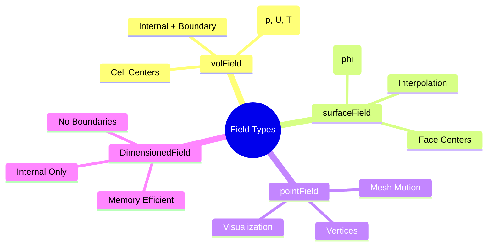

# 7. บทสรุปและแบบฝึกหัด



## 7.1 สรุปประเด็นสำคัญ

ส่วนนี้ครอบคลุมสถาปัตยกรรมฟิลด์ของ OpenFOAM ซึ่งเป็นรากฐานสำหรับการจำลอง CFD ทั้งหมด ระบบฟิลด์ของ OpenFOAM นำเสนอกรอบการทำงานที่ปลอดภัยต่อประเภท ตระหนักถึงมิติ และมีประสิทธิภาพสำหรับการแก้สมการอนุพันธ์ย่อย

---

## 7.2 แนวคิดสำคัญ

### 7.2.1 ลำดับชั้นเทมเพลต GeometricField

คลาส `GeometricField` เป็นฐานของระบบฟิลด์ทั้งหมด โดยมีเทมเพลตพารามิเตอร์สามตัว:

$$\text{GeometricField<Type, PatchField, GeoMesh>}$$

| พารามิเตอร์ | ความหมาย | ตัวอย่าง |
|:---------:|:---------|:---------|
| **`Type`** | ประเภททางคณิตศาสตร์ | `scalar`, `vector`, `tensor` |
| **`PatchField`** | การจัดการเงื่อนไขขอบเขต | `fvPatchField`, `fvsPatchField` |
| **`GeoMesh`** | ประเภทเมช | `volMesh`, `surfaceMesh`, `pointMesh` |

```cpp
// การประกาศประเภทฟิลด์ทั่วไป
typedef GeometricField<scalar, fvPatchField, volMesh> volScalarField;
typedef GeometricField<vector, fvPatchField, volMesh> volVectorField;
typedef GeometricField<scalar, fvsPatchField, surfaceMesh> surfaceScalarField;
```

### 7.2.2 ระบบการวิเคราะห์มิติ

OpenFOAM ผนวกการวิเคราะห์มิติเข้ากับการดำเนินการฟิลด์โดยตรง:

$$\text{dimensionSet} = [M^a \, L^b \, T^c \, \Theta^d \, I^e \, N^f \, J^g]$$

| มิติพื้นฐาน | สัญลักษณ์ | หน่วย SI |
|:------------:|:---------:|:---------:|
| มวล | $[M]$ | kg |
| ความยาว | $[L]$ | m |
| เวลา | $[T]$ | s |
| อุณหภูมิ | $[\Theta]$ | K |
| กระแสไฟฟ้า | $[I]$ | A |
| ปริมาณสาร | $[N]$ | mol |
| ความเข้มแสง | $[J]$ | cd |

```cpp
// การตรวจสอบมิติอัตโนมัติ
dimensionedScalar rho
(
    "rho",
    dimensionSet(1, -3, 0, 0, 0, 0, 0),  // [M][L]⁻³
    1.2                                  // kg/m³
);

volVectorField U
(
    IOobject("U", runTime.timeName(), mesh, IOobject::MUST_READ),
    mesh,
    dimensionSet(0, 1, -1, 0, 0, 0, 0)    // [L][T]⁻¹ = m/s
);

// นิพจน์ที่สอดคล้องทางมิติ
volScalarField dynamicPressure = 0.5 * rho * magSqr(U);  // ✓ [M][L]⁻¹[T]⁻²

// นิพจน์ที่ไม่สอดคล้องทางมิติ (จะเกิดข้อผิดพลาด)
// volScalarField wrong = p + U;  // ✗ ข้อผิดพลาด: [M][L]⁻¹[T]⁻² + [L][T]⁻¹
```

### 7.2.3 โครงสร้างฟิลด์: ภายในเทียบกับขอบเขต

`GeometricField` ใช้สถาปัตยกรรมแบบคู่:

```cpp
template<class Type, template<class> class PatchField, class GeoMesh>
class GeometricField
{
    // ฟิลด์ภายใน (ค่าที่จุดศูนย์กลางเซลล์)
    Field<Type> internalField_;

    // ฟิลด์ขอบเขต (ค่าบน patches)
    Field<PatchField<Type>> boundaryField_;

public:
    // ตัวดำเนินการเข้าถึงที่สม่ำเสมอ
    const Type& operator[](const label) const;      // เข้าถึงฟิลด์ภายใน
    const Type& operator()(const label) const;      // เข้าถึงฟิลด์ภายใน
};
```

> [!INFO] โครงสร้างหน่วยความจำ
> - **Internal Field**: การจัดเก็บแบบต่อเนื่องสำหรับการเข้าถึงที่เหมาะสมกับ cache
> - **Boundary Field**: การจัดเก็บแยกตาม patch สำหรับเงื่อนไขขอบเขตที่ยืดหยุ่น

### 7.2.4 รูปแบบการออกแบบ Policy-Based

เทมเพลตเทมเพลต `PatchField` ใช้ **policy-based design**:

```cpp
template<class Type>
class PatchField
{
    // ส่วนติดต่อนโยบายสำหรับเงื่อนไขขอบเขต
    virtual void updateCoeffs() = 0;
    virtual void evaluate() = 0;
    virtual tmp<Field<Type>> snGrad() const = 0;
};
```

| ประเภทเงื่อนไขขอบเขต | คำอธิบาย | การใช้งาน |
|:---------------------:|:---------|:---------|
| `fixedValueFvPatchField` | เงื่อนไข Dirichlet | ความเร็วคงที่ที่ inlet |
| `zeroGradientFvPatchField` | เงื่อนไข Neumann | Outlet การไหลแบบพัฒนาเต็ม |
| `mixedFvPatchField` | เงื่อนไข Robin | การถ่ายเทความร้อนผสม |
| `calculatedFvPatchField` | ค่าที่คำนวณแล้ว | ฟิลด์ที่ได้มาจากการคำนวณ |

### 7.2.5 การจัดการหน่วยความจำ: RAII และ Reference Counting

คลาส `tmp<T>` ใช้ RAII ร่วมกับการนับอ้างอิง:

```cpp
template<class T>
class tmp
{
    T* ptr_;
    mutable bool refPtr_;

public:
    ~tmp()
    {
        if (ptr_ && !refPtr_) delete ptr_;
    }

    // กลศาสตร์การย้าย
    tmp(tmp<T>&& t) noexcept;
    tmp<T>& operator=(tmp<T>&& t) noexcept;

    // การเข้าถึงข้อมูล
    T& operator()();
    const T& operator()() const;
};
```

> [!TIP] การใช้ tmp<T> อย่างถูกต้อง
> - ใช้ `tmp<T>` เพื่อหลีกเลี่ยงการคัดลอกฟิลด์ที่มีราคาแพง
> - ไม่ควรเก็บการอ้างอิงแบบไม่คงที่ไปยังออบเจ็กต์ชั่วคราว
> - ตัวดำเนินการ `()` ให้การเข้าถึงการอ้างอิงของวัตถุที่อยู่ฐาน

---

## 7.3 การพิจารณาด้านประสิทธิภาพ

### 7.3.1 ประสิทธิภาพ Cache

```cpp
// การจัดเก็บแบบต่อเนื่องของฟิลด์ภายใน
class Field
{
    Type* v_;           // อาร์เรย์ติดกัน: [data0, data1, data2, ...]
    label size_;        // จำนวนองค์ประกอบ
};

// รูปแบบการเข้าถึงที่เหมาะสมกับ cache
forAll(U.internalField(), i)
{
    // การเข้าถึงตามลำดับ = การใช้ cache ที่ดีที่สุด
    U_internal[i] += dt * acceleration[i];
}
```

### 7.3.2 การประเมินแบบ Lazy

```cpp
class GeometricField
{
    mutable tmp<GeometricField<Type>> field0_;   // ก้าวเวลาก่อนหน้า
    mutable tmp<GeometricField<Type>> field00_;  // สองก้าวเวลาที่แล้ว

public:
    const GeometricField<Type>& oldTime() const
    {
        // จัดสรรฟิลด์เวลาเก่าเฉพาะเมื่อเข้าถึงครั้งแรก
        if (!field0_.valid())
        {
            field0_ = clone();
            field0_->oldTime();  // เรียกซ้ำสำหรับ field00_
        }
        return field0_();
    }
};
```

> [!INFO] ประโยชน์ของ Lazy Evaluation
> - **การจัดสรรตามความต้องการ**: เฉพาะเมื่อต้องการข้อมูลเวลาเก่า
> - **การประหยัดหน่วยควาจำ**: สำหรับกรณีที่ไม่มีอนุพันธ์ตามเวลา
> - **การทำความสะอาดอัตโนมัติ**: เมื่อฟิลด์เวลาเก่าไม่จำเป็นอีกต่อไป

---

## 7.4 แนวทางปฏิบัติที่ดีที่สุด

### 7.4.1 การระบุมิติเสมอ

```cpp
// ✓ ดี: การระบุมิติแบบเต็ม
dimensionedScalar nu
(
    "nu",
    dimensionSet(0, 2, -1, 0, 0, 0, 0),  // [L²/T] - ความหนืดเคลื่อนที่
    1.5e-5
);

// ✓ ดีกว่า: ใช้มิติที่กำหนดไว้ล่วงหน้า
dimensionedScalar nu
(
    "nu",
    dimViscosity,  // เทียบเท่ากับ [L²/T]
    1.5e-5
);
```

### 7.4.2 การเลือกประเภทฟิลด์ที่เหมาะสม

| ประเภทฟิลด์ | ตัวอย่างการใช้งาน | มิติ |
|:------------:|:------------------|:-----|
| `volScalarField` | ความดัน, อุณหภูมิ, ปริมาตรส่วน | $[M/(LT^2)]$, $[\Theta]$, $[-]$ |
| `volVectorField` | ความเร็ว, การกระจัด | $[L/T]$, $[L]$ |
| `surfaceScalarField` | การไหล, การดำเนินการไล่ระดับ | $[L^3/T]$ |
| `volTensorField` | ความเค้น, อัตราการเคลื่อน | $[M/(LT^2)]$ |

### 7.4.3 การเข้าใจ tmp<T> Semantics

```cpp
// ✓ รูปแบบการใช้งานที่ถูกต้อง
tmp<volScalarField> magU = mag(U);

// การอ้างอิงยังคงใช้ได้ตราบใดที่ magU อยู่ใน scope
forAll(U, celli)
{
    if (magU()[celli] > Umax)
    {
        U[celli] *= Umax / magU()[celli];
    }
}

// การทำความสะอาดอัตโนมัติเมื่อฟังก์ชันสิ้นสุด
```

---

## 7.5 แบบฝึกหัดปฏิบัติ

### แบบฝึกหัดที่ 1: การระบุประเภทของฟิลด์

กำหนดสถานการณ์ต่อไปนี้ ให้ระบุประเภทฟิลด์ที่เหมาะสมและมิติของมัน:

#### 1. การกระจายของอุณหภูมิในเครื่องแลกเปลี่ยนความร้อน

<details>
<summary>คำตอบ</summary>

**คำตอบ:** `volScalarField T`

- **ประเภท:** ปริมาณสเกลาร์
- **ตำแหน่ง:** ค่าแปรผันไปตามปริมาตรของโดเมน
- **มิติ:** `dimensionSet(0, 0, 0, 1, 0, 0, 0)` — $[\Theta]$

```cpp
volScalarField T
(
    IOobject("T", runTime.timeName(), mesh, IOobject::MUST_READ),
    mesh,
    dimensionSet(0, 0, 0, 1, 0, 0, 0)  // [K]
);
```
</details>

#### 2. ฟิลด์ความเร็วในการไหลในท่อ

<details>
<summary>คำตอบ</summary>

**คำตอบ:** `volVectorField U`

- **ประเภท:** ปริมาณเวกเตอร์
- **องค์ประกอบ:** สามองค์ประกอบ: $U_x$, $U_y$, $U_z$
- **มิติ:** `dimensionSet(0, 1, -1, 0, 0, 0, 0)` — $[L/T]$

```cpp
volVectorField U
(
    IOobject("U", runTime.timeName(), mesh, IOobject::MUST_READ),
    mesh,
    dimensionSet(0, 1, -1, 0, 0, 0, 0)  // [m/s]
);
```
</details>

#### 3. เทนเซอร์ความเครียดในการจำลองกลศาสตร์ของแข็ง

<details>
<summary>คำตอบ</summary>

**คำตอบ:** `volTensorField sigma`

- **ประเภท:** เทนเซอร์อันดับสอง
- **องค์ประกอบ:** เก้าองค์ประกอบ: $\sigma_{ij}$ โดยที่ $i,j \in \{x,y,z\}$
- **มิติ:** `dimensionSet(1, -1, -2, 0, 0, 0, 0)` — $[M/(LT^2)]$

```cpp
volTensorField sigma
(
    IOobject("sigma", runTime.timeName(), mesh),
    mesh,
    dimensionSet(1, -1, -2, 0, 0, 0, 0)  // [Pa]
);
```
</details>

#### 4. ปริมาตรการไหลผ่านหน้าเซลล์

<details>
<summary>คำตอบ</summary>

**คำตอบ:** `surfaceScalarField phi`

- **ประเภท:** ฟิลด์ผิวสเกลาร์
- **ตำแหน่ง:** ค่าที่จุดศูนย์กลางหน้า
- **มิติ:** `dimensionSet(3, 0, -1, 0, 0, 0, 0)` — $[L^3/T]$

```cpp
surfaceScalarField phi
(
    IOobject("phi", runTime.timeName(), mesh, IOobject::READ_IF_PRESENT),
    fvc::interpolate(U) & mesh.Sf()  // [m³/s]
);
```
</details>

---

### แบบฝึกหัดที่ 2: การวิเคราะห์มิติ

ให้ระบุ `dimensionSet` ที่ถูกต้องสำหรับปริมาณต่อไปนี้:

#### 1. ความหนืดพลวัต ($\mu$)

<details>
<summary>คำตอบ</summary>

```cpp
dimensionSet(1, -1, -1, 0, 0, 0, 0);  // M·L⁻¹·T⁻¹
```

- **หน่วย:** kg/(m·s) หรือ Pa·s
- **ความหมาย:** แทนความต้านทานต่อการบิดเบือนของการไหล
- **สมการ:** $\tau = \mu \frac{\partial u}{\partial y}$
</details>

#### 2. ความนำความร้อน ($k$)

<details>
<summary>คำตอบ</summary>

```cpp
dimensionSet(1, 1, -3, -1, 0, 0, 0);  // M·L·T⁻³·Θ⁻¹
```

- **หน่วย:** W/(m·K)
- **กฎของฟูริเยร์:** $q = -k \nabla T$
</details>

#### 3. เรย์โนลด์สนัมเบอร์ ($Re$)

<details>
<summary>คำตอบ</summary>

```cpp
dimensionSet(0, 0, 0, 0, 0, 0, 0);  // ไม่มีมิติ
```

- **สมการ:** $Re = \frac{\rho u L}{\mu}$
- **ความหมาย:** อัตราส่วนของแรงเฉื่อยต่อแรงหนืด
</details>

#### 4. ความจุความร้อนจำเพาะ ($c_p$)

<details>
<summary>คำตอบ</summary>

```cpp
dimensionSet(0, 2, -2, -1, 0, 0, 0);  // L²·T⁻²·Θ⁻¹
```

- **หน่วย:** J/(kg·K)
- **ความหมาย:** พลังงานที่ต้องการเพื่อเพิ่มอุณหภูมิต่อหน่วยมวล
- **สมการ:** ปรากฏใน $\rho c_p \frac{\partial T}{\partial t}$
</details>

---

### แบบฝึกหัดที่ 3: การสร้างฟิลด์ฝึกปฏิบัติ

#### 1. ฟิลด์อุณหภูมิที่มีค่าเริ่มต้น 300 K

<details>
<summary>เฉลย</summary>

```cpp
volScalarField T
(
    IOobject
    (
        "T",
        runTime.timeName(),
        mesh,
        IOobject::MUST_READ,
        IOobject::AUTO_WRITE
    ),
    mesh,
    dimensionedScalar
    (
        "T",
        dimensionSet(0, 0, 0, 1, 0, 0, 0),  // [K]
        300.0
    ),
    fixedValueFvPatchScalarField::typeName
);
```
</details>

#### 2. ฟิลด์ความเร็วที่อ่านจากไฟล์พร้อมมิติ

<details>
<summary>เฉลย</summary>

```cpp
volVectorField U
(
    IOobject
    (
        "U",
        runTime.timeName(),
        mesh,
        IOobject::MUST_READ,
        IOobject::AUTO_WRITE
    ),
    mesh,
    dimensionedVector
    (
        "U",
        dimensionSet(0, 1, -1, 0, 0, 0, 0),  // [m/s]
        vector::zero
    )
);
```
</details>

#### 3. ฟิลด์สเกลาร์ผิวสำหรับการไหลมวล

<details>
<summary>เฉลย</summary>

```cpp
surfaceScalarField rhoPhi
(
    IOobject
    (
        "rhoPhi",
        runTime.timeName(),
        mesh,
        IOobject::NO_READ,
        IOobject::AUTO_WRITE
    ),
    mesh,
    dimensionedScalar
    (
        "zero",
        dimensionSet(1, 0, -1, 0, 0, 0, 0),  // [kg/s]
        0.0
    )
);

// คำนวณการไหลมวล
rhoPhi = fvc::interpolate(rho) * phi;
```
</details>

---

### แบบฝึกหัดที่ 4: การดีบักข้อผิดพลาดมิติ

#### ปัญหา

นิพจน์ต่อไปนี้มีปัญหาความไม่สอดคล้องของมิติ:

```cpp
volScalarField E = p + 0.5*rho*magSqr(U);
```

#### การวิเคราะห์มิติ

| ปริมาณ | มิติ | dimensionSet | หน่วย |
|:-------:|:-----:|:------------:|:-----:|
| $p$ | $[M][L]^{-1}[T]^{-2}$ | `(1, -1, -2, 0, 0, 0, 0)` | Pa |
| $\rho$ | $[M][L]^{-3}$ | `(1, -3, 0, 0, 0, 0, 0)` | kg/m³ |
| $|\mathbf{U}|^2$ | $[L]^2[T]^{-2}$ | `(0, 2, -2, 0, 0, 0, 0)` | m²/s² |
| $\rho \cdot |\mathbf{U}|^2$ | $[M][L]^{-1}[T]^{-2}$ | `(1, -1, -2, 0, 0, 0, 0)` | ✓ Pa |

<details>
<summary>วิธีแก้ไข</summary>

**การวิเคราะห์:** มิติจริงๆ แล้วถูกต้องแล้ว! ปัญหาอาจเกิดจาก:

1. **การประกาศฟิลด์ที่ไม่ถูกต้อง**
2. **การเริ่มต้นมิติที่หายไป**

**วิธีแก้ไขที่ 1: ให้แน่ใจว่าการเริ่มต้นฟิลด์ถูกต้อง**

```cpp
volScalarField rho
(
    IOobject("rho", runTime.timeName(), mesh),
    mesh,
    dimensionedScalar("rho", dimensionSet(1, -3, 0, 0, 0, 0, 0), 1.2)
);

volVectorField U
(
    IOobject("U", runTime.timeName(), mesh),
    mesh,
    dimensionedVector("U", dimensionSet(0, 1, -1, 0, 0, 0, 0), vector::zero)
);

volScalarField p
(
    IOobject("p", runTime.timeName(), mesh),
    mesh,
    dimensionedScalar("p", dimensionSet(1, -1, -2, 0, 0, 0, 0), 101325.0)
);

// นี่ควรจะใช้งานได้แล้ว
volScalarField E
(
    IOobject("E", runTime.timeName(), mesh),
    p + 0.5*rho*magSqr(U)  // พลังงานรวม (จลน์ + ความดัน)
);
```

**วิธีแก้ไขที่ 2: การระบุมิติอย่างชัดเจน**

```cpp
volScalarField E
(
    IOobject("E", runTime.timeName(), mesh),
    mesh,
    dimensionedScalar("E", dimensionSet(1, -1, -2, 0, 0, 0, 0), 0.0)
);

E = p + 0.5*rho*magSqr(U);
```
</details>

---

### แบบฝึกหัดที่ 5: การวิเคราะห์โค้ด

หากคุณเห็นโค้ดบรรทัดนี้:

```cpp
surfaceScalarField phi_new = fvc::interpolate(rho * U) & mesh.Sf();
```

<details>
<summary>คำอธิบาย</summary>

**คำถาม:** ฟังก์ชัน `interpolate` ทำหน้าที่อะไรในบริบทนี้? และหน่วยของ `phi_new` จะออกมาเป็นอย่างไร?

**คำตอบ:**

- `interpolate` ทำหน้าที่แปลงค่า $\rho \mathbf{U}$ จากจุดศูนย์กลางเซลล์ไปยังจุดศูนย์กลางหน้า
- การวิเคราะห์มิติ:
  - $\rho$: $[M][L]^{-3}$ (kg/m³)
  - $\mathbf{U}$: $[L][T]^{-1}$ (m/s)
  - $\mathbf{S}_f$: $[L]^2$ (m²) — เวกเตอร์พื้นที่หน้า
  - $\rho \mathbf{U} \cdot \mathbf{S}_f$: $[M][L]^{-3} \cdot [L][T]^{-1} \cdot [L]^2 = [M][T]^{-1}$

**หน่วยของ `phi_new`:** kg/s (การไหลมวล)
</details>

---

### แบบฝึกหัดที่ 6: การประยุกต์ใช้งาน

คุณต้องการเขียนฟังก์ชันเพื่อคำนวณแรงที่กระทำต่อผนัง (Wall) โดยใช้ข้อมูลจาก `volVectorField U`:

<details>
<summary>เฉลย</summary>

**คำถาม:**
1. คุณต้องใช้ฟังก์ชันใดเพื่อดึงค่าความเร็วจาก "เซลล์" ไปยัง "หน้า" ของขอบเขต?
2. ผลลัพธ์จากการคำนวณที่หน้าควรถูกเก็บไว้ในฟิลด์ประเภทใดระหว่าง `volField` และ `surfaceField`?

**คำตอบ:**

1. **การแปลงจากเซลล์ไปยังหน้า:**
   ```cpp
   // ใช้ fvc::interpolate() เพื่อแปลงค่าจาก cell center ไปยัง face center
   surfaceVectorField Uf = fvc::interpolate(U);

   // หรือเข้าถึงค่าที่ขอบเขตโดยตรง
   const fvPatchVectorField& U_patch = U.boundaryField()[patchID];
   ```

2. **การเลือกประเภทฟิลด์:**
   ```cpp
   // ควรเก็บค่าที่หน้าไว้ใน surfaceField
   surfaceVectorField wallShearStress
   (
       IOobject("wallShearStress", runTime.timeName(), mesh),
       mesh,
       dimensionedVector("zero", dimensionSet(1, -1, -2, 0, 0, 0, 0), vector::zero)
   );

   // คำนวณความเค้นเฉือนที่ผนัง
   wallShearStress.boundaryFieldRef()[patchID] =
       mu * fvc::interpolate(fvc::grad(U)).boundaryField()[patchID];
   ```
</details>

---

## 7.6 แบบฝึกหัดเพิ่มเติม

### แบบฝึกหัดที่ 7: การสร้างฟิลด์ Custom

สร้างฟิลด์ความเร็วหมุนวน ($\boldsymbol{\omega} = \nabla \times \mathbf{U}$) จากฟิลด์ความเร็ว $\mathbf{U}$:

<details>
<summary>เฉลย</summary>

```cpp
// คำนวณความเร็วหมุนวน
volVectorField vorticity = fvc::curl(U);

// หรือใช้นิยาม: ω = ∇ × U
tmp<volTensorField> gradU = fvc::grad(U);
volVectorField vorticity
(
    IOobject("vorticity", runTime.timeName(), mesh),
    mesh,
    dimensionSet(0, 0, -1, 0, 0, 0, 0)  // [1/s] หรือ [T]⁻¹
);

// คำนวณ curl จาก gradient tensor
vorticity = vector
(
    gradU().component(2) - gradU().component(5),  // ω_x = ∂U_z/∂y - ∂U_y/∂z
    gradU().component(3) - gradU().component(6),  // ω_y = ∂U_x/∂z - ∂U_z/∂x
    gradU().component(1) - gradU().component(4)   // ω_z = ∂U_y/∂x - ∂U_x/∂y
);
```
</details>

---

## 7.7 แหล่งข้อมูลเพิ่มเติม

### ไฟล์ Header หลักใน OpenFOAM

| ไฟล์ | คำอธิบาย |
|:-----|:---------|
| `GeometricField.H` | คลาสฟิลด์พื้นฐานทั้งหมด |
| `DimensionedField.H` | ฟิลด์ภายในที่มีมิติ |
| `Field.H` | การดำเนินการทางคณิตศาสตร์บนรายการ |
| `dimensionSet.H` | ระบบวิเคราะห์มิติ |
| `tmp.H` | คลาสชั่วคราวที่นับการอ้างอิง |

### เอกสาร OpenFOAM

- **OpenFOAM User Guide**: ส่วนที่เกี่ยวกับ Field Types
- **OpenFOAM Programmer's Guide**: การนำไปใช้งาน GeometricField
- **Source Code**: `$FOAM_SRC/OpenFOAM/fields/`

---

## 7.8 สรุปท้ายบท

> [!TIP] จุดสำคัญที่ควรจำ
>
> 1. **GeometricField** เป็นฐานของระบบฟิลด์ทั้งหมดใน OpenFOAM
> 2. **ระบบมิติ** ช่วยป้องกันข้อผิดพลาดทางกายภาพในการคำนวณ
> 3. **การแยกฟิลด์ภายใน/ขอบเขต** ช่วยเพิ่มประสิทธิภาพและความยืดหยุ่น
> 4. **tmp<T>** ให้การจัดการหน่วยควาจำอัตโนมัติสำหรับฟิลด์ชั่วคราว
> 5. **Policy-based design** ของ PatchField ทำให้มีความยืดหยุ่นในการจัดการเงื่อนไขขอบเขต

---

## 🔄 ขั้นตอนต่อไป

ไปยัง [[Section 6.2: Basic Field Algebra]](../02_Basic_Field_Algebra/README.md) เพื่อเรียนรู้เกี่ยวกับ:

- การดำเนินการทางคณิตศาสตร์บนฟิลด์
- การดำเนินการเวกเตอร์และเทนเซอร์
- การคำนวณ gradient, divergence และ laplacian
- การเขียนสมการ Navier-Stokes ใน OpenFOAM
