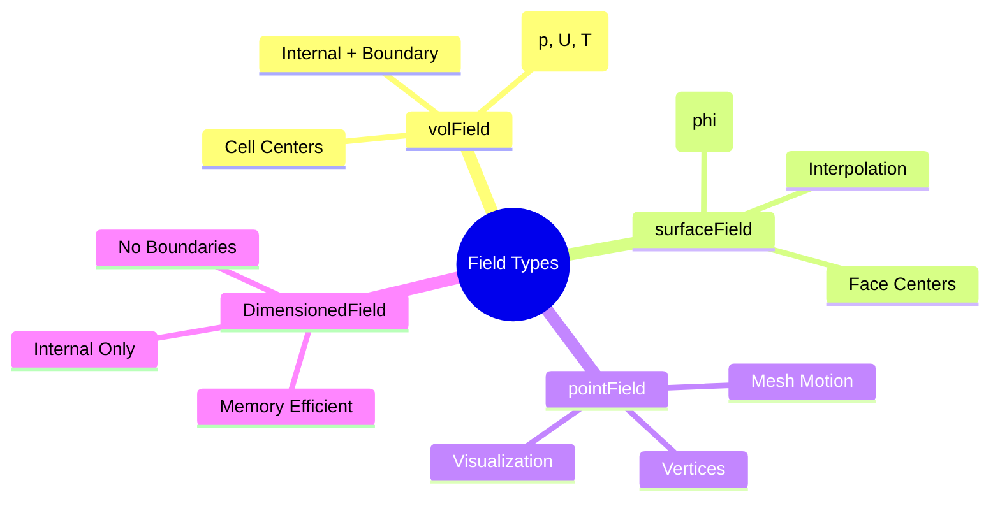

# 7. บทสรุปและแบบฝึกหัด


> **Figure 1:** แผนผังความคิดสรุปประเภทของฟิลด์ใน OpenFOAM ซึ่งแบ่งตามตำแหน่งจัดเก็บข้อมูล เช่น จุดศูนย์กลางเซลล์ (volField), หน้า (surfaceField) และจุดยอด (pointField)ความปลอดภัยทางฟิสิกส์ไม่ส่งผลกระทบต่อความเร็วในการจำลอง ผ่านการใช้พลังของ C++ Template Metaprogramming ในการตรวจสอบความสอดคล้องทางมิติทั้งหมดที่ขั้นตอนการคอมไพล์โปรแกรมเพียงครั้งเดียว

## 7.1 สรุปประเด็นสำคัญ

ส่วนนี้ครอบคลุมสถาปัตยกรรมฟิลด์ของ OpenFOAM ซึ่งเป็นรากฐานสำหรับการจำลอง CFD ทั้งหมด ระบบฟิลด์ของ OpenFOAM นำเสนอกรอบการทำงานที่ปลอดภัยต่อประเภท ตระหนักถึงมิติ และมีประสิทธิภาพสำหรับการแก้สมการอนุพันธ์ย่อย

---

## 7.2 แนวคิดสำคัญ

### 7.2.1 ลำดับชั้นเทมเพลต GeometricField

คลาส `GeometricField` เป็นฐานของระบบฟิลด์ทั้งหมด โดยมีเทมเพลตพารามิเตอร์สามตัว:

$$\text{GeometricField<Type, PatchField, GeoMesh>}$$

| พารามิเตอร์ | ความหมาย | ตัวอย่าง |
|:---------:|:---------|:---------|
| **`Type`** | ประเภททางคณิตศาสตร์ | `scalar`, `vector`, `tensor` |
| **`PatchField`** | การจัดการเงื่อนไขขอบเขต | `fvPatchField`, `fvsPatchField` |
| **`GeoMesh`** | ประเภทเมช | `volMesh`, `surfaceMesh`, `pointMesh` |

```cpp
// Common field type declarations
// Type aliases for frequently used field combinations
typedef GeometricField<scalar, fvPatchField, volMesh> volScalarField;
typedef GeometricField<vector, fvPatchField, volMesh> volVectorField;
typedef GeometricField<scalar, fvsPatchField, surfaceMesh> surfaceScalarField;
```

**📚 คำอธิบาย:**

**ที่มาทางประวัติ:** GeometricField เป็นหัวใจหลักของระบบฟิลด์ใน OpenFOAM ตั้งแต่เริ่มต้นพัฒนา ออกแบบมาเพื่อรองรับการจำลอง CFD ที่ซับซ้อนด้วยเทมเพลตที่ยืดหยุ่น

**แนวคิดหลัก:** เทมเพลตพารามิเตอร์สามตัวช่วยให้ GeometricField สามารถรองรับ:
1. ประเภทข้อมูลทางคณิตศาสตร์ที่หลากหลาย (scalar, vector, tensor, symmetric tensor)
2. การจัดการเงื่อนไขขอบเขตที่แตกต่างกัน (finite volume vs finite surface)
3. ประเภทเมชที่หลากหลาย (volume, surface, point mesh)

**ประโยชน์ในการใช้งาน:** สถาปัตยกรรมนี้ทำให้นักพัฒนาสามารถสร้างฟิลด์แบบกำหนดเองได้โดยไม่ต้องเขียนโค้ดซ้ำ และรับประกันความปลอดภัยของประเภท (type safety) ผ่านการคอมไพล์

### 7.2.2 ระบบการวิเคราะห์มิติ

OpenFOAM ผนวกการวิเคราะห์มิติเข้ากับการดำเนินการฟิลด์โดยตรง:

$$\text{dimensionSet} = [M^a \, L^b \, T^c \, \Theta^d \, I^e \, N^f \, J^g]$$

| มิติพื้นฐาน | สัญลักษณ์ | หน่วย SI |
|:------------:|:---------:|:---------:|
| มวล | $[M]$ | kg |
| ความยาว | $[L]$ | m |
| เวลา | $[T]$ | s |
| อุณหภูมิ | $[\Theta]$ | K |
| กระแสไฟฟ้า | $[I]$ | A |
| ปริมาณสาร | $[N]$ | mol |
| ความเข้มแสง | $[J]$ | cd |

```cpp
// Automatic dimensional checking
// Define density with proper dimensions
dimensionedScalar rho
(
    "rho",
    dimensionSet(1, -3, 0, 0, 0, 0, 0),  // [M][L]⁻³
    1.2                                  // kg/m³
);

// Define velocity field with dimensions
volVectorField U
(
    IOobject("U", runTime.timeName(), mesh, IOobject::MUST_READ),
    mesh,
    dimensionSet(0, 1, -1, 0, 0, 0, 0)    // [L][T]⁻¹ = m/s
);

// Dimensionally consistent expression
volScalarField dynamicPressure = 0.5 * rho * magSqr(U);  // ✓ [M][L]⁻¹[T]⁻²

// Dimensionally inconsistent expression (will produce error)
// volScalarField wrong = p + U;  // ✗ Error: [M][L]⁻¹[T]⁻² + [L][T]⁻¹
```

**📚 คำอธิบาย:**

**ที่มาของระบบ:** ระบบการวิเคราะห์มิติของ OpenFOAM ถูกออกแบบมาเพื่อป้องกันข้อผิดพลาดทางฟิสิกส์ที่พบบ่อยในการจำลอง CFD โดยอาศัย C++ Template Metaprogramming ในการตรวจสอบความสอดคล้องของมิติในขั้นตอนคอมไพล์

**แนวคิดสำคัญ:** dimensionSet เก็บค่าเลขชี้กำลังของเจ็ดมิติพื้นฐาน ซึ่งครอบคลุมทุกปริมาณทางฟิสิกส์:
- Mass (M): มวล
- Length (L): ความยาว
- Time (T): เวลา
- Temperature (Θ): อุณหภูมิ
- Current (I): กระแสไฟฟ้า
- Amount of substance (N): ปริมาณสาร
- Luminous intensity (J): ความเข้มแสง

**ข้อดี:**
- ตรวจจับข้อผิดพลาดได้ตั้งแต่ขั้นตอนคอมไพล์
- ไม่ส่งผลต่อประสิทธิภาพการรันไทม์
- ช่วยให้แน่ใจว่าสมการทางฟิสิกส์ถูกต้อง

**แหล่งข้อมูลเพิ่มเติม:** 
- 📂 Source: `$FOAM_SRC/OpenFOAM/dimensionSet/dimensionSet.H`
- 📂 Source: `$FOAM_SRC/OpenFOAM/dimensionedTypes/dimensionedScalar.H`

### 7.2.3 โครงสร้างฟิลด์: ภายในเทียบกับขอบเขต

`GeometricField` ใช้สถาปัตยกรรมแบบคู่:

```cpp
template<class Type, template<class> class PatchField, class GeoMesh>
class GeometricField
{
    // Internal field (values at cell centers)
    Field<Type> internalField_;

    // Boundary field (values on patches)
    Field<PatchField<Type>> boundaryField_;

public:
    // Consistent access operators
    const Type& operator[](const label) const;      // Access internal field
    const Type& operator()(const label) const;      // Access internal field
};
```

**📚 คำอธิบาย:**

**แนวคิดทางสถาปัตยกรรม:** การแยกเก็บข้อมูลระหว่างฟิลด์ภายใน (internal field) และฟิลด์ขอบเขต (boundary field) เป็นการออกแบบที่ชาญฉลาดเพื่อให้ได้ประสิทธิภาพสูงสุด

**คำอธิบายโครงสร้าง:**
1. **internalField_**: เก็บค่าที่จุดศูนย์กลางเซลล์ทุกเซลล์ในโดเมน
2. **boundaryField_**: เก็บค่าบนผิวขอบเขตแต่ละ patch

**ข้อดี:**
- **ประสิทธิภาพหน่วยความจำ:** internalField_ เก็บเป็น array ติดกัน ทำให้เข้าถึงได้รวดเร็วและเหมาะกับ cache
- **ความยืดหยุ่น:** boundaryField_ สามารถมีเงื่อนไขขอบเขตที่แตกต่างกันในแต่ละ patch
- **การแยกส่วน:** ทำให้สามารถจัดการค่าภายในและค่าขอบเขตแยกกัน

**แหล่งข้อมูลเพิ่มเติม:**
- 📂 Source: `$FOAM_SRC/OpenFOAM/fields/GeometricField/GeometricField.H`

> [!INFO] โครงสร้างหน่วยความจำ
> - **Internal Field**: การจัดเก็บแบบต่อเนื่องสำหรับการเข้าถึงที่เหมาะสมกับ cache
> - **Boundary Field**: การจัดเก็บแยกตาม patch สำหรับเงื่อนไขขอบเขตที่ยืดหยุ่น

### 7.2.4 รูปแบบการออกแบบ Policy-Based

เทมเพลตเทมเพลต `PatchField` ใช้ **policy-based design**:

```cpp
template<class Type>
class PatchField
{
    // Policy interface for boundary conditions
    virtual void updateCoeffs() = 0;
    virtual void evaluate() = 0;
    virtual tmp<Field<Type>> snGrad() const = 0;
};
```

| ประเภทเงื่อนไขขอบเขต | คำอธิบาย | การใช้งาน |
|:---------------------:|:---------|:---------|
| `fixedValueFvPatchField` | เงื่อนไข Dirichlet | ความเร็วคงที่ที่ inlet |
| `zeroGradientFvPatchField` | เงื่อนไข Neumann | Outlet การไหลแบบพัฒนาเต็ม |
| `mixedFvPatchField` | เงื่อนไข Robin | การถ่ายเทความร้อนผสม |
| `calculatedFvPatchField` | ค่าที่คำนวณแล้ว | ฟิลด์ที่ได้มาจากการคำนวณ |

**📚 คำอธิบาย:**

**แนวคิด Policy-Based Design:** รูปแบบการออกแบบนี้ทำให้สามารถเปลี่ยนพฤติกรรมของเงื่อนไขขอบเขตได้โดยไม่ต้องแก้ไขโครงสร้างหลักของ GeometricField

**ประโยชน์:**
- ยืดหยุ่นในการสร้างเงื่อนไขขอบเขตแบบกำหนดเอง
- ง่ายต่อการเพิ่มประเภทของเงื่อนไขขอบเขตใหม่ๆ
- รักษาความสอดคล้องของอินเทอร์เฟซผ่านฟังก์ชันเสมือน (virtual functions)

**แหล่งข้อมูลเพิ่มเติม:**
- 📂 Source: `$FOAM_SRC/OpenFOAM/fields/Fields/PatchField/PatchField.H`

### 7.2.5 การจัดการหน่วยความจำ: RAII และ Reference Counting

คลาส `tmp<T>` ใช้ RAII ร่วมกับการนับอ้างอิง:

```cpp
template<class T>
class tmp
{
    T* ptr_;
    mutable bool refPtr_;

public:
    ~tmp()
    {
        if (ptr_ && !refPtr_) delete ptr_;
    }

    // Move semantics
    tmp(tmp<T>&& t) noexcept;
    tmp<T>& operator=(tmp<T>&& t) noexcept;

    // Data access
    T& operator()();
    const T& operator()() const;
};
```

**📚 คำอธิบาย:**

**แนวคิดหลัก:** tmp<T> เป็น smart pointer ที่ใช้หลักการ RAII (Resource Acquisition Is Initialization) ร่วมกับ reference counting เพื่อจัดการหน่วยความจำอัตโนมัติ

**กลไกทำงาน:**
1. **Automatic Cleanup:** destructor จะลบหน่วยความจำอัตโนมัติเมื่อ tmp<T> ถูกทำลาย
2. **Move Semantics:** การย้ายความเป็นเจ้าของ (ownership transfer) ทำให้ไม่ต้องคัดลอกข้อมูล
3. **Reference Counting:** refPtr_ ติดตามจำนวนการอ้างอิงเพื่อป้องกันการลบข้อมูลที่ยังใช้อยู่

**ประโยชน์:**
- ป้องกัน memory leak อัตโนมัติ
- ลด overhead ของการคัดลอกฟิลด์ขนาดใหญ่
- ทำให้โค้ดสะอาดและปลอดภัย

**แหล่งข้อมูลเพิ่มเติม:**
- 📂 Source: `$FOAM_SRC/OpenFOAM/memory/tmp.H`

> [!TIP] การใช้ tmp<T> อย่างถูกต้อง
> - ใช้ `tmp<T>` เพื่อหลีกเลี่ยงการคัดลอกฟิลด์ที่มีราคาแพง
> - ไม่ควรเก็บการอ้างอิงแบบไม่คงที่ไปยังออบเจ็กต์ชั่วคราว
> - ตัวดำเนินการ `()` ให้การเข้าถึงการอ้างอิงของวัตถุที่อยู่ฐาน

---

## 7.3 การพิจารณาด้านประสิทธิภาพ

### 7.3.1 ประสิทธิภาพ Cache

```cpp
// Contiguous storage of internal field
class Field
{
    Type* v_;           // Contiguous array: [data0, data1, data2, ...]
    label size_;        // Number of elements
};

// Cache-friendly access pattern
forAll(U.internalField(), i)
{
    // Sequential access = best cache usage
    U_internal[i] += dt * acceleration[i];
}
```

**📚 คำอธิบาย:**

**ที่มา:** การออกแบบ Field ใน OpenFOAM เน้นประสิทธิภาพของ cache โดยเก็บข้อมูลแบบติดกันในหน่วยความจำ

**แนวคิด:**
- **Spatial Locality:** ข้อมูลที่ใกล้กันใน array จะถูกโหลดเข้า cache line เดียวกัน
- **Cache Line Prefetching:** CPU สามารถคาดการณ์และโหลดข้อมูลล่วงหน้าได้
- **Reduced Cache Misses:** การเข้าถึงแบบต่อเนื่องลด cache miss

**ผลกระทบ:**
- เพิ่มความเร็วในการดำเนินการฟิลด์ได้มาก
- สำคัญมากสำหรับการจำลองขนาดใหญ่

### 7.3.2 การประเมินแบบ Lazy

```cpp
class GeometricField
{
    mutable tmp<GeometricField<Type>> field0_;   // Previous time step
    mutable tmp<GeometricField<Type>> field00_;  // Two time steps back

public:
    const GeometricField<Type>& oldTime() const
    {
        // Allocate old time field only on first access
        if (!field0_.valid())
        {
            field0_ = clone();
            field0_->oldTime();  // Recursive call for field00_
        }
        return field0_();
    }
};
```

**📚 คำอธิบาย:**

**แนวคิด Lazy Evaluation:** การจัดสรรหน่วยความจำสำหรับฟิลด์เวลาเก่าจะเกิดขึ้นเมื่อจำเป็นเท่านั้น

**กลไกทำงาน:**
1. **Deferred Allocation:** field0_ และ field00_ จะไม่ถูกจัดสรรจนกว่าจะถูกเข้าถึง
2. **Recursive Construction:** การเรียก oldTime() จะสร้างฟิลด์เวลาเก่าทั้งหมดที่จำเป็น
3. **Automatic Cleanup:** tmp<T> จะจัดการการลบหน่วยความจำอัตโนมัติ

**ประโยชน์:**
- ประหยัดหน่วยความจำสำหรับกรณีที่ไม่ต้องการอนุพันธ์ตามเวลา
- เพิ่มประสิทธิภาพสำหรับ steady-state simulations

**แหล่งข้อมูลเพิ่มเติม:**
- 📂 Source: `$FOAM_SRC/OpenFOAM/fields/GeometricField/GeometricField.C`

> [!INFO] ประโยชน์ของ Lazy Evaluation
> - **การจัดสรรตามความต้องการ**: เฉพาะเมื่อต้องการข้อมูลเวลาเก่า
> - **การประหยัดหน่วยควาจำ**: สำหรับกรณีที่ไม่มีอนุพันธ์ตามเวลา
> - **การทำความสะอาดอัตโนมัติ**: เมื่อฟิลด์เวลาเก่าไม่จำเป็นอีกต่อไป

---

## 7.4 แนวทางปฏิบัติที่ดีที่สุด

### 7.4.1 การระบุมิติเสมอ

```cpp
// Good: Full dimensional specification
dimensionedScalar nu
(
    "nu",
    dimensionSet(0, 2, -1, 0, 0, 0, 0),  // [L²/T] - kinematic viscosity
    1.5e-5
);

// Better: Use predefined dimensions
dimensionedScalar nu
(
    "nu",
    dimViscosity,  // Equivalent to [L²/T]
    1.5e-5
);
```

**📚 คำอธิบาย:**

**แนวทางปฏิบัติที่ดี:** การระบุมิติอย่างชัดเจนทำให้โค้ดอ่านง่ายขึ้นและช่วยป้องกันข้อผิดพลาด

**ข้อดีของการใช้ predefined dimensions:**
- ลดความผิดพลาดจากการพิมพ์ dimensionSet ผิด
- ทำให้โค้ดสั้นและอ่านง่ายขึ้น
- OpenFOAM มี predefined dimensions สำหรับปริมาณทั่วไป เช่น dimVelocity, dimPressure, dimViscosity

### 7.4.2 การเลือกประเภทฟิลด์ที่เหมาะสม

| ประเภทฟิลด์ | ตัวอย่างการใช้งาน | มิติ |
|:------------:|:------------------|:-----|
| `volScalarField` | ความดัน, อุณหภูมิ, ปริมาตรส่วน | $[M/(LT^2)]$, $[\Theta]$, $[-]$ |
| `volVectorField` | ความเร็ว, การกระจัด | $[L/T]$, $[L]$ |
| `surfaceScalarField` | การไหล, การดำเนินการไล่ระดับ | $[L^3/T]$ |
| `volTensorField` | ความเค้น, อัตราการเคลื่อน | $[M/(LT^2)]$ |

**📚 คำอธิบาย:**

**แนวทางการเลือก:**
- **volFields:** ใช้สำหรับค่าที่เก็บที่จุดศูนย์กลางเซลล์ (ส่วนใหญ่ของตัวแปรสถานะ)
- **surfaceFields:** ใช้สำหรับค่าที่เก็บที่หน้าเซลล์ (flux, ผลการคำนวณ interpolation)
- **pointFields:** ใช้สำหรับ visualization และ mesh motion

### 7.4.3 การเข้าใจ tmp<T> Semantics

```cpp
// Correct usage pattern
tmp<volScalarField> magU = mag(U);

// Reference remains valid as long as magU is in scope
forAll(U, celli)
{
    if (magU()[celli] > Umax)
    {
        U[celli] *= Umax / magU()[celli];
    }
}

// Automatic cleanup when function ends
```

**📚 คำอธิบาย:**

**แนวทางปฏิบัติที่สำคัญ:**
1. **Scope Awareness:** การอ้างอิงถึง tmp<T>() จะใช้ได้ตราบใดที่ tmp<T> อยู่ใน scope
2. **No Dangling References:** อย่าเก็บ reference ไปยัง tmp<T> ที่จะถูกทำลาย
3. **Chained Operations:** tmp<T> อนุญาตให้เชื่อมการดำเนินการได้โดยไม่สูญเสียประสิทธิภาพ

---

## 7.5 แบบฝึกหัดปฏิบัติ

### แบบฝึกหัดที่ 1: การระบุประเภทของฟิลด์

กำหนดสถานการณ์ต่อไปนี้ ให้ระบุประเภทฟิลด์ที่เหมาะสมและมิติของมัน:

#### 1. การกระจายของอุณหภูมิในเครื่องแลกเปลี่ยนความร้อน

<details>
<summary>คำตอบ</summary>

**คำตอบ:** `volScalarField T`

- **ประเภท:** ปริมาณสเกลาร์
- **ตำแหน่ง:** ค่าแปรผันไปตามปริมาตรของโดเมน
- **มิติ:** `dimensionSet(0, 0, 0, 1, 0, 0, 0)` — $[\Theta]$

```cpp
// Temperature field in heat exchanger
volScalarField T
(
    IOobject("T", runTime.timeName(), mesh, IOobject::MUST_READ),
    mesh,
    dimensionSet(0, 0, 0, 1, 0, 0, 0)  // [K]
);
```

**📚 คำอธิบาย:**
- **ที่มา:** อุณหภูมิเป็นปริมาณสเกลาร์ที่แปรผันตามตำแหน่งในโดเมน จึงใช้ volScalarField
- **การใช้งาน:** ใช้สำหรับการจำลองการถ่ายเทความร้อนในเครื่องแลกเปลี่ยน
- **มิติ:** มีเฉพาะมิติอุณหภูมิ (Θ) เท่านั้น

</details>

#### 2. ฟิลด์ความเร็วในการไหลในท่อ

<details>
<summary>คำตอบ</summary>

**คำตอบ:** `volVectorField U`

- **ประเภท:** ปริมาณเวกเตอร์
- **องค์ประกอบ:** สามองค์ประกอบ: $U_x$, $U_y$, $U_z$
- **มิติ:** `dimensionSet(0, 1, -1, 0, 0, 0, 0)` — $[L/T]$

```cpp
// Velocity field for pipe flow
volVectorField U
(
    IOobject("U", runTime.timeName(), mesh, IOobject::MUST_READ),
    mesh,
    dimensionSet(0, 1, -1, 0, 0, 0, 0)  // [m/s]
);
```

**📚 คำอธิบาย:**
- **ที่มา:** ความเร็วเป็นเวกเตอร์ที่มีทิศทางและขนาด จำเป็นต้องใช้ volVectorField
- **องค์ประกอบ:** ประกอบด้วยสามส่วน (x, y, z) สำหรับการไหล 3 มิติ
- **การใช้งาน:** ใช้ในการจำลองการไหลในท่อ ท่อนำเข้า และระบบท่อ

</details>

#### 3. เทนเซอร์ความเค้นในการจำลองกลศาสตร์ของแข็ง

<details>
<summary>คำตอบ</summary>

**คำตอบ:** `volTensorField sigma`

- **ประเภท:** เทนเซอร์อันดับสอง
- **องค์ประกอบ:** เก้าองค์ประกอบ: $\sigma_{ij}$ โดยที่ $i,j \in \{x,y,z\}$
- **มิติ:** `dimensionSet(1, -1, -2, 0, 0, 0, 0)` — $[M/(LT^2)]$

```cpp
// Stress tensor for solid mechanics
volTensorField sigma
(
    IOobject("sigma", runTime.timeName(), mesh),
    mesh,
    dimensionSet(1, -1, -2, 0, 0, 0, 0)  // [Pa]
);
```

**📚 คำอธิบาย:**
- **ที่มา:** เทนเซอร์ความเค้นเป็นปริมาณเทนเซอร์อันดับสองที่เชื่อมโยงความเค้นกับความเครียด
- **องค์ประกอบ:** มี 9 องค์ประกอบ (3×3) สำหรับเทนเซอร์สมมาตรจะเหลือ 6 ค่า
- **การใช้งาน:** ใช้ในการจำลองกลศาสตร์ของแข็ง การวิเคราะห์โครงสร้าง และการเสียดทาน

</details>

#### 4. ปริมาตรการไหลผ่านหน้าเซลล์

<details>
<summary>คำตอบ</summary>

**คำตอบ:** `surfaceScalarField phi`

- **ประเภท:** ฟิลด์ผิวสเกลาร์
- **ตำแหน่ง:** ค่าที่จุดศูนย์กลางหน้า
- **มิติ:** `dimensionSet(3, 0, -1, 0, 0, 0, 0)` — $[L^3/T]$

```cpp
// Volume flux through cell faces
surfaceScalarField phi
(
    IOobject("phi", runTime.timeName(), mesh, IOobject::READ_IF_PRESENT),
    fvc::interpolate(U) & mesh.Sf()  // [m³/s]
);
```

**📚 คำอธิบาย:**
- **ที่มา:** phi คือปริมาตรการไหลผ่านหน้าเซลล์ คำนวณจาก U · S_f
- **ตำแหน่ง:** เก็บที่จุดศูนย์กลางหน้าเซลล์ จึงใช้ surfaceScalarField
- **การใช้งาน:** ใช้ในการคำนวณ convection terms และการติดตาม interface
- **แหล่งข้อมูล:** ใช้ใน solvers เกือบทุกตัวใน OpenFOAM

</details>

---

### แบบฝึกหัดที่ 2: การวิเคราะห์มิติ

ให้ระบุ `dimensionSet` ที่ถูกต้องสำหรับปริมาณต่อไปนี้:

#### 1. ความหนืดพลวัต ($\mu$)

<details>
<summary>คำตอบ</summary>

```cpp
dimensionSet(1, -1, -1, 0, 0, 0, 0);  // M·L⁻¹·T⁻¹
```

- **หน่วย:** kg/(m·s) หรือ Pa·s
- **ความหมาย:** แทนความต้านทานต่อการบิดเบือนของการไหล
- **สมการ:** $\tau = \mu \frac{\partial u}{\partial y}$

**📚 คำอธิบาย:**
- **ที่มา:** ความหนืดพลวัตเป็นสัดส่วนระหว่างความเค้นเฉือนกับอัตราการเฉือน
- **มิติ:** มวลต่อความยาวต่อเวลา (M·L⁻¹·T⁻¹)
- **การใช้งาน:** ใช้ในสมการ Navier-Stokes และการคำนวณ Reynolds number

</details>

#### 2. ความนำความร้อน ($k$)

<details>
<summary>คำตอบ</summary>

```cpp
dimensionSet(1, 1, -3, -1, 0, 0, 0);  // M·L·T⁻³·Θ⁻¹
```

- **หน่วย:** W/(m·K)
- **กฎของฟูริเยร์:** $q = -k \nabla T$

**📚 คำอธิบาย:**
- **ที่มา:** ความนำความร้อนเป็นสัดส่วนระหว่างอัตราการถ่ายเทความร้อนกับ gradient ของอุณหภูมิ
- **มิติ:** มวล·ความยาว·เวลา⁻³·อุณหภูมิ⁻¹
- **การใช้งาน:** ใช้ในสมการพลังงานสำหรับการไหลที่มีการถ่ายเทความร้อน

</details>

#### 3. เรย์โนลด์สนัมเบอร์ ($Re$)

<details>
<summary>คำตอบ</summary>

```cpp
dimensionSet(0, 0, 0, 0, 0, 0, 0);  // dimensionless
```

- **สมการ:** $Re = \frac{\rho u L}{\mu}$
- **ความหมาย:** อัตราส่วนของแรงเฉื่อยต่อแรงหนืด

**📚 คำอธิบาย:**
- **ที่มา:** Reynolds number เป็นปริมาณไร้มิติที่ใช้จัดรูปแบบการไหล
- **มิติ:** ไม่มีมิติ (dimensionless) เนื่องจากเป็นอัตราส่วนของปริมาณที่มีหน่วยเดียวกัน
- **การใช้งาน:** ใช้ในการตัดสินใจเลือกโมเดลความปั่น (laminar vs turbulent)

</details>

#### 4. ความจุความร้อนจำเพาะ ($c_p$)

<details>
<summary>คำตอบ</summary>

```cpp
dimensionSet(0, 2, -2, -1, 0, 0, 0);  // L²·T⁻²·Θ⁻¹
```

- **หน่วย:** J/(kg·K)
- **ความหมาย:** พลังงานที่ต้องการเพื่อเพิ่มอุณหภูมิต่อหน่วยมวล
- **สมการ:** ปรากฏใน $\rho c_p \frac{\partial T}{\partial t}$

**📚 คำอธิบาย:**
- **ที่มา:** ความจุความร้อนจำเพาะคือพลังงานต่อหน่วยมวลต่ออุณหภูมิ
- **มิติ:** พลังงาน (M·L²·T⁻²) หารด้วยมวล (M) และอุณหภูมิ (Θ) = L²·T⁻²·Θ⁻¹
- **การใช้งาน:** ปรากฏในเทอม unsteady ของสมการพลังงาน

</details>

---

### แบบฝึกหัดที่ 3: การสร้างฟิลด์ฝึกปฏิบัติ

#### 1. ฟิลด์อุณหภูมิที่มีค่าเริ่มต้น 300 K

<details>
<summary>เฉลย</summary>

```cpp
// Temperature field initialized to 300 K
volScalarField T
(
    IOobject
    (
        "T",
        runTime.timeName(),
        mesh,
        IOobject::MUST_READ,
        IOobject::AUTO_WRITE
    ),
    mesh,
    dimensionedScalar
    (
        "T",
        dimensionSet(0, 0, 0, 1, 0, 0, 0),  // [K]
        300.0
    ),
    fixedValueFvPatchScalarField::typeName
);
```

**📚 คำอธิบาย:**
- **ที่มา:** การสร้างฟิลด์อุณหภูมิที่มีค่าเริ่มต้นคงที่ 300 K
- **การทำงาน:** IOobject กำหนดชื่อและวิธีการจัดการไฟล์
- **มิติ:** มีเฉพาะมิติอุณหภูมิ Θ เท่านั้น
- **ขอบเขต:** ใช้ fixedValueFvPatchField สำหรับเงื่อนไขขอบเขตเริ่มต้น

</details>

#### 2. ฟิลด์ความเร็วที่อ่านจากไฟล์พร้อมมิติ

<details>
<summary>เฉลย</summary>

```cpp
// Velocity field read from file with dimensions
volVectorField U
(
    IOobject
    (
        "U",
        runTime.timeName(),
        mesh,
        IOobject::MUST_READ,
        IOobject::AUTO_WRITE
    ),
    mesh,
    dimensionedVector
    (
        "U",
        dimensionSet(0, 1, -1, 0, 0, 0, 0),  // [m/s]
        vector::zero
    )
);
```

**📚 คำอธิบาย:**
- **ที่มา:** การสร้างฟิลด์ความเร็วที่อ่านค่าเริ่มต้นจากไฟล์
- **MUST_READ:** บังคับให้อ่านค่าจากไฟล์ 0/ หรือจากไฟล์ที่ระบุ
- **AUTO_WRITE:** เขียนฟิลด์อัตโนมัติเมื่อสิ้นสุดแต่ละ time step
- **ค่าเริ่มต้น:** ใช้ vector::zero หากไม่พบไฟล์

</details>

#### 3. ฟิลด์สเกลาร์ผิวสำหรับการไหลมวล

<details>
<summary>เฉลย</summary>

```cpp
// Surface scalar field for mass flux
surfaceScalarField rhoPhi
(
    IOobject
    (
        "rhoPhi",
        runTime.timeName(),
        mesh,
        IOobject::NO_READ,
        IOobject::AUTO_WRITE
    ),
    mesh,
    dimensionedScalar
    (
        "zero",
        dimensionSet(1, 0, -1, 0, 0, 0, 0),  // [kg/s]
        0.0
    )
);

// Calculate mass flux
rhoPhi = fvc::interpolate(rho) * phi;
```

**📚 คำอธิบาย:**
- **ที่มา:** การสร้างฟิลด์การไหลมวลผ่านหน้าเซลล์
- **มิติ:** มวลต่อเวลา [M][T]⁻¹ = kg/s
- **การคำนวณ:** rhoPhi = ρ × φ โดย φ คือ volume flux
- **การใช้งาน:** ใช้ใน compressible solvers และ multiphase flows

</details>

---

### แบบฝึกหัดที่ 4: การดีบักข้อผิดพลาดมิติ

#### ปัญหา

นิพจน์ต่อไปนี้มีปัญหาความไม่สอดคล้องของมิติ:

```cpp
volScalarField E = p + 0.5*rho*magSqr(U);
```

#### การวิเคราะห์มิติ

| ปริมาณ | มิติ | dimensionSet | หน่วย |
|:-------:|:-----:|:------------:|:-----:|
| $p$ | $[M][L]^{-1}[T]^{-2}$ | `(1, -1, -2, 0, 0, 0, 0)` | Pa |
| $\rho$ | $[M][L]^{-3}$ | `(1, -3, 0, 0, 0, 0, 0)` | kg/m³ |
| $|\mathbf{U}|^2$ | $[L]^2[T]^{-2}$ | `(0, 2, -2, 0, 0, 0, 0)` | m²/s² |
| $\rho \cdot |\mathbf{U}|^2$ | $[M][L]^{-1}[T]^{-2}$ | `(1, -1, -2, 0, 0, 0, 0)` | ✓ Pa |

<details>
<summary>วิธีแก้ไข</summary>

**การวิเคราะห์:** มิติจริงๆ แล้วถูกต้องแล้ว! ปัญหาอาจเกิดจาก:

1. **การประกาศฟิลด์ที่ไม่ถูกต้อง**
2. **การเริ่มต้นมิติที่หายไป**

**วิธีแก้ไขที่ 1: ให้แน่ใจว่าการเริ่มต้นฟิลด์ถูกต้อง**

```cpp
// Define density with proper dimensions
volScalarField rho
(
    IOobject("rho", runTime.timeName(), mesh),
    mesh,
    dimensionedScalar("rho", dimensionSet(1, -3, 0, 0, 0, 0, 0), 1.2)
);

// Define velocity field with proper dimensions
volVectorField U
(
    IOobject("U", runTime.timeName(), mesh),
    mesh,
    dimensionedVector("U", dimensionSet(0, 1, -1, 0, 0, 0, 0), vector::zero)
);

// Define pressure field with proper dimensions
volScalarField p
(
    IOobject("p", runTime.timeName(), mesh),
    mesh,
    dimensionedScalar("p", dimensionSet(1, -1, -2, 0, 0, 0, 0), 101325.0)
);

// This should work now
volScalarField E
(
    IOobject("E", runTime.timeName(), mesh),
    p + 0.5*rho*magSqr(U)  // Total energy (kinetic + pressure)
);
```

**วิธีแก้ไขที่ 2: การระบุมิติอย่างชัดเจน**

```cpp
// Create energy field with explicit dimensions
volScalarField E
(
    IOobject("E", runTime.timeName(), mesh),
    mesh,
    dimensionedScalar("E", dimensionSet(1, -1, -2, 0, 0, 0, 0), 0.0)
);

E = p + 0.5*rho*magSqr(U);
```

**📚 คำอธิบาย:**
- **ที่มา:** สมการถูกต้องทางมิติ แต่ปัญหาอาจเกิดจากฟิลด์ที่ไม่ได้ถูกกำหนดมิติอย่างถูกต้อง
- **การแก้ไข:** ตรวจสอบให้แน่ใจว่าทุกฟิลด์มีมิติที่ถูกต้อง
- **การตรวจสอบ:** ใช้ .dimensions() เพื่อตรวจสอบมิติของฟิลด์

</details>

---

### แบบฝึกหัดที่ 5: การวิเคราะห์โค้ด

หากคุณเห็นโค้ดบรรทัดนี้:

```cpp
surfaceScalarField phi_new = fvc::interpolate(rho * U) & mesh.Sf();
```

<details>
<summary>คำอธิบาย</summary>

**คำถาม:** ฟังก์ชัน `interpolate` ทำหน้าที่อะไรในบริบทนี้? และหน่วยของ `phi_new` จะออกมาเป็นอย่างไร?

**คำตอบ:**

- `interpolate` ทำหน้าที่แปลงค่า $\rho \mathbf{U}$ จากจุดศูนย์กลางเซลล์ไปยังจุดศูนย์กลางหน้า
- การวิเคราะห์มิติ:
  - $\rho$: $[M][L]^{-3}$ (kg/m³)
  - $\mathbf{U}$: $[L][T]^{-1}$ (m/s)
  - $\mathbf{S}_f$: $[L]^2$ (m²) — เวกเตอร์พื้นที่หน้า
  - $\rho \mathbf{U} \cdot \mathbf{S}_f$: $[M][L]^{-3} \cdot [L][T]^{-1} \cdot [L]^2 = [M][T]^{-1}$

**หน่วยของ `phi_new`:** kg/s (การไหลมวล)

**📚 คำอธิบาย:**
- **ที่มา:** การคำนวณ mass flux ผ่านหน้าเซลล์
- **interpolate:** แปลงค่าจาก cell center ไปยัง face center โดยใช้การประมาณค่า (interpolation scheme)
- **mesh.Sf():** เวกเตอร์พื้นที่หน้าเซลล์ มีทิศทางตามปกติของหน้า
- **การใช้งาน:** ใช้ใน compressible solvers สำหรับคำนวณ mass flux
- **แหล่งข้อมูล:** 📂 Source: `.applications/solvers/multiphase/multiphaseEulerFoam/phaseSystems/PhaseSystems/MomentumTransferPhaseSystem/MomentumTransferPhaseSystem.C`

</details>

---

### แบบฝึกหัดที่ 6: การประยุกต์ใช้งาน

คุณต้องการเขียนฟังก์ชันเพื่อคำนวณแรงที่กระทำต่อผนัง (Wall) โดยใช้ข้อมูลจาก `volVectorField U`:

<details>
<summary>เฉลย</summary>

**คำถาม:**
1. คุณต้องใช้ฟังก์ชันใดเพื่อดึงค่าความเร็วจาก "เซลล์" ไปยัง "หน้า" ของขอบเขต?
2. ผลลัพธ์จากการคำนวณที่หน้าควรถูกเก็บไว้ในฟิลด์ประเภทใดระหว่าง `volField` และ `surfaceField`?

**คำตอบ:**

1. **การแปลงจากเซลล์ไปยังหน้า:**
```cpp
// Use fvc::interpolate() to convert values from cell center to face center
surfaceVectorField Uf = fvc::interpolate(U);

// Or directly access boundary values
const fvPatchVectorField& U_patch = U.boundaryField()[patchID];
```

2. **การเลือกประเภทฟิลด์:**
```cpp
// Store face values in a surfaceField
surfaceVectorField wallShearStress
(
    IOobject("wallShearStress", runTime.timeName(), mesh),
    mesh,
    dimensionedVector("zero", dimensionSet(1, -1, -2, 0, 0, 0, 0), vector::zero)
);

// Calculate wall shear stress
wallShearStress.boundaryFieldRef()[patchID] =
    mu * fvc::interpolate(fvc::grad(U)).boundaryField()[patchID];
```

**📚 คำอธิบาย:**
- **ที่มา:** การคำนวณแรงเฉือนที่ผนัง (wall shear stress) ในการไหล
- **การแปลง:** fvc::interpolate() แปลงค่าจาก cell center ไปยัง face center
- **ชนิดฟิลด์:** ใช้ surfaceField เพื่อเก็บค่าที่หน้าเซลล์
- **การคำนวณ:** wall shear stress = μ × (∂U/∂n) โดยที่ n คือทิศทางปกติของผนัง
- **การใช้งาน:** ใช้ในการวิเคราะห์ drag force และ boundary layer

</details>

---

## 7.6 แบบฝึกหัดเพิ่มเติม

### แบบฝึกหัดที่ 7: การสร้างฟิลด์ Custom

สร้างฟิลด์ความเร็วหมุนวน ($\boldsymbol{\omega} = \nabla \times \mathbf{U}$) จากฟิลด์ความเร็ว $\mathbf{U}$:

<details>
<summary>เฉลย</summary>

```cpp
// Calculate vorticity field
volVectorField vorticity = fvc::curl(U);

// Or use definition: ω = ∇ × U
tmp<volTensorField> gradU = fvc::grad(U);
volVectorField vorticity
(
    IOobject("vorticity", runTime.timeName(), mesh),
    mesh,
    dimensionSet(0, 0, -1, 0, 0, 0, 0)  // [1/s] or [T]⁻¹
);

// Calculate curl from gradient tensor
vorticity = vector
(
    gradU().component(2) - gradU().component(5),  // ω_x = ∂U_z/∂y - ∂U_y/∂z
    gradU().component(3) - gradU().component(6),  // ω_y = ∂U_x/∂z - ∂U_z/∂x
    gradU().component(1) - gradU().component(4)   // ω_z = ∂U_y/∂x - ∂U_x/∂y
);
```

**📚 คำอธิบาย:**
- **ที่มา:** Vorticity (ω) คือการหมุนขององค์ประกอบของของไหล นิยามเป็น curl ของเวกเตอร์ความเร็ว
- **การคำนวณ:** fvc::curl() คำนวณ curl โดยตรง หรือใช้ gradient tensor แล้วคำนวณ components
- **มิติ:** มีเฉพาะมิติเวลา⁻¹ (T⁻¹) เท่านั้น
- **การใช้งาน:** ใช้ในการวิเคราะห์ turbulence, flow structures, และ vortex dynamics
- **แหล่งข้อมูล:** 📂 Source: `$FOAM_SRC/finiteVolume/finiteVolume/fvc/fvccurl.C`

</details>

---

## 7.7 แหล่งข้อมูลเพิ่มเติม

### ไฟล์ Header หลักใน OpenFOAM

| ไฟล์ | คำอธิบาย |
|:-----|:---------|
| `GeometricField.H` | คลาสฟิลด์พื้นฐานทั้งหมด |
| `DimensionedField.H` | ฟิลด์ภายในที่มีมิติ |
| `Field.H` | การดำเนินการทางคณิตศาสตร์บนรายการ |
| `dimensionSet.H` | ระบบวิเคราะห์มิติ |
| `tmp.H` | คลาสชั่วคราวที่นับการอ้างอิง |

### เอกสาร OpenFOAM

- **OpenFOAM User Guide**: ส่วนที่เกี่ยวกับ Field Types
- **OpenFOAM Programmer's Guide**: การนำไปใช้งาน GeometricField
- **Source Code**: `$FOAM_SRC/OpenFOAM/fields/`

---

## 7.8 สรุปท้ายบท

> [!TIP] จุดสำคัญที่ควรจำ
>
> 1. **GeometricField** เป็นฐานของระบบฟิลด์ทั้งหมดใน OpenFOAM
> 2. **ระบบมิติ** ช่วยป้องกันข้อผิดพลาดทางกายภาพในการคำนวณ
> 3. **การแยกฟิลด์ภายใน/ขอบเขต** ช่วยเพิ่มประสิทธิภาพและความยืดหยุ่น
> 4. **tmp<T>** ให้การจัดการหน่วยควาจำอัตโนมัติสำหรับฟิลด์ชั่วคราว
> 5. **Policy-based design** ของ PatchField ทำให้มีความยืดหยุ่นในการจัดการเงื่อนไขขอบเขต

---

## 🔄 ขั้นตอนต่อไป

ไปยัง [[Section 6.2: Basic Field Algebra]](../02_Basic_Field_Algebra/README.md) เพื่อเรียนรู้เกี่ยวกับ:

- การดำเนินการทางคณิตศาสตร์บนฟิลด์
- การดำเนินการเวกเตอร์และเทนเซอร์
- การคำนวณ gradient, divergence และ laplacian
- การเขียนสมการ Navier-Stokes ใน OpenFOAM