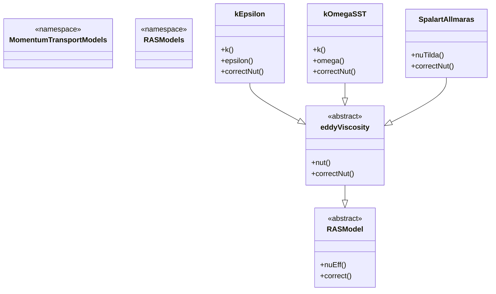

# Module 05: OpenFOAM Programming - Section 08: Turbulence Models

## 08 Turbulence Models (รู้จักแบบจำลองความวุ่นวาย)

### 01 Overview (ภาพรวม)

Turbulence modeling is one of the most critical aspects in CFD simulations for R410A evaporator flows. In OpenFOAM, the turbulence models are organized under the `MomentumTransportModels` namespace, providing a comprehensive framework for Reynolds-Averaged Navier-Stokes (RANS) modeling.

⭐ **Architecture:**


### 02 Turbulence Modeling Philosophy (ปรัชญาการสร้างแบบจำลองความวุ่นวาย)

#### 02.1 RANS (Reynolds-Averaged Navier-Stokes)

**Mathematical Foundation:**

The RANS approach decomposes flow variables into mean and fluctuating components:

$$
\phi = \bar{\phi} + \phi'
$$

Where $\phi'$ represents the turbulent fluctuations.

⭐ **Key Equations:**
- **Continuity:** $\frac{\partial \bar{\rho}}{\partial t} + \nabla \cdot (\bar{\rho} \mathbf{\bar{U}}) = 0$
- **Momentum:** $\frac{\partial \bar{\rho} \mathbf{\bar{U}}}{\partial t} + \nabla \cdot (\bar{\rho} \mathbf{\bar{U}} \otimes \mathbf{\bar{U}}) = -\nabla \bar{p} + \nabla \cdot (\bar{\tau} - \bar{\rho} \mathbf{\overline{u'u'}})$
- **Reynolds Stress Tensor:** $\tau_{ij} = \mu \left(\frac{\partial \bar{u}_i}{\partial x_j} + \frac{\partial \bar{u}_j}{\partial x_i}\right) - \rho \overline{u_i'u_j'}$

The closure problem is solved using eddy viscosity hypothesis:

$$
-\rho \overline{u_i'u_j'} = \mu_t \left(\frac{\partial \bar{u}_i}{\partial x_j} + \frac{\partial \bar{u}_j}{\partial x_i}\right) - \frac{2}{3} \rho k \delta_{ij}
$$

#### 02.2 LES (Large Eddy Simulation)

LES resolves large-scale turbulent structures directly while modeling small-scale effects using a subgrid-scale (SGS) model:

⭐ **Filtering Operation:**
$$
\bar{\phi}(\mathbf{x}, t) = \int G(\mathbf{x}, \mathbf{x'}, \Delta) \phi(\mathbf{x'}, t) d\mathbf{x'}
$$

Where $G$ is the filter kernel and $\Delta$ is the filter width.

**Subgrid-Scale Stress Model (Smagorinsky):**
$$
\tau_{ij}^{SGS} - \frac{1}{3} \tau_{kk}^{SGS} \delta_{ij} = -2 \mu_t \bar{S}_{ij}
$$

$$
\mu_t = \rho (C_s \Delta)^2 \sqrt{2 \bar{S}_{ij} \bar{S}_{ij}}
$$

#### 02.3 DNS (Direct Numerical Simulation)

DNS resolves all turbulent scales without modeling, requiring extremely fine mesh resolution:

⭐ **Computational Requirements:**
- $N_{DNS} \propto Re^{9/4}$
- $N_{LES} \propto Re^{3/4}$
- $N_{RANS} \propto Re^{1/2}$

### 03 Linear Eddy Viscosity Models (แบบจำลองความเหนียวแบบเชิงเส้น)

#### 03.1 k-ε Model

The standard k-ε model solves two transport equations for turbulence kinetic energy (k) and dissipation rate (ε).

⭐ **Equations:**
**k-Equation:**
$$
\frac{\partial}{\partial t}(\rho k) + \nabla \cdot [\rho \mathbf{U} k] = \nabla \cdot \left[\left(\mu + \frac{\mu_t}{\sigma_k}\right) \nabla k\right] + P_k - \rho \epsilon
$$

**ε-Equation:**
$$
\frac{\partial}{\partial t}(\rho \epsilon) + \nabla \cdot [\rho \mathbf{U} \epsilon] = \nabla \cdot \left[\left(\mu + \frac{\mu_t}{\sigma_\epsilon}\right) \nabla \epsilon\right] + C_{1\epsilon} \frac{\epsilon}{k} P_k - C_{2\epsilon} \rho \frac{\epsilon^2}{k}
$$

**Production Term:**
$$
P_k = \mu_t \nabla \mathbf{U} : \left(\nabla \mathbf{U} + (\nabla \mathbf{U})^T\right)
$$

**Eddy Viscosity:**
$$
\mu_t = \rho C_\mu \frac{k^2}{\epsilon}
$$

**File:** `openfoam_temp/src/MomentumTransportModels/momentumTransportModels/RAS/kEpsilon/kEpsilon.H:169-178`
```cpp
// Return the effective diffusivity for k
tmp<volScalarField> DkEff() const
{
    return volScalarField::New
    (
        "DkEff",
        (this->nut_/sigmak_ + this->nu())
    );
}
```

#### 03.2 k-ω Models

k-ω models solve for k and specific dissipation rate ω instead of ε.

**k-ω Equations:**
**k-Equation:**
$$
\frac{\partial}{\partial t}(\rho k) + \nabla \cdot [\rho \mathbf{U} k] = \nabla \cdot \left[\left(\mu + \frac{\mu_t}{\sigma_k}\right) \nabla k\right] + P_k - \beta^* \rho \omega k
$$

**ω-Equation:**
$$
\frac{\partial}{\partial t}(\rho \omega) + \nabla \cdot [\rho \mathbf{U} \omega] = \nabla \cdot \left[\left(\mu + \frac{\mu_t}{\sigma_\omega}\right) \nabla \omega\right] + \alpha \frac{\omega}{k} P_k - \beta \rho \omega^2
$$

**k-ω SST (Shear Stress Transport):**

The SST model combines k-ω in near-wall regions with k-ε in outer regions:

⭐ **Blending Function:**
$$
F_1 = \tanh(\phi_1^4)
$$
$$
F_2 = \tanh(\phi_2^4)
$$

Where $\phi_1$ and $\phi_2$ are functions of the distance from the wall.

**File:** `openfoam_temp/src/MomentumTransportModels/momentumTransportModels/RAS/kOmegaSST/kOmegaSST.H:57-65`
```cpp
template<class BasicMomentumTransportModel>
class kOmegaSST
:
    public Foam::kOmegaSST
    <
        eddyViscosity<RASModel<BasicMomentumTransportModel>>,
        BasicMomentumTransportModel
    >
```

#### 03.3 Spalart-Allmaras Model

A one-equation model designed for aerodynamic applications:

⭐ **Transported Variable:** $\tilde{\nu}$ (modified turbulent viscosity)

**Equation:**
$$
\frac{\partial \tilde{\nu}}{\partial t} + u_j \frac{\partial \tilde{\nu}}{\partial x_j} = c_{b1} \tilde{S} \tilde{\nu} - c_{w1} f_w \left(\frac{\tilde{\nu}}{d}\right)^2 + \frac{1}{\sigma} \frac{\partial}{\partial x_j} \left[ (v + \tilde{\nu}) \frac{\partial \tilde{\nu}}{\partial x_j} \right]
$$

**Eddy Viscosity:**
$$
\nu_t = f_{v1} \tilde{\nu}
$$

**File:** `openfoam_temp/src/MomentumTransportModels/momentumTransportModels/RAS/SpalartAllmaras/SpalartAllmaras.H:179-199`
```cpp
//- Return the turbulence kinetic energy
virtual tmp<volScalarField> k() const;

//- Return the turbulence kinetic energy dissipation rate
virtual tmp<volScalarField> epsilon() const;

//- Return the turbulence specific dissipation rate
virtual tmp<volScalarField> omega() const;
```

### 04 Non-Linear Models (แบบจำลองที่ไม่เป็นเชิงเส้น)

Non-linear models provide better representation of complex flow behavior by going beyond the linear eddy viscosity assumption.

⭐ **Non-Linear Stress Tensor:**
$$
\tau_{ij} = \mu \left(\frac{\partial u_i}{\partial x_j} + \frac{\partial u_j}{\partial x_i}\right) + \rho \left[ C_1 f_1 S_{ij} + C_2 f_2 (S_{ik} S_{kj} + W_{ik} W_{kj}) + C_3 f_3 (\Omega_{ik} \Omega_{kj}) + C_4 f_4 \Omega_{ik} S_{kj} \right]
$$

Where:
- $S_{ij} = \frac{1}{2} \left(\frac{\partial u_i}{\partial x_j} + \frac{\partial u_j}{\partial x_i}\right)$ is the strain rate tensor
- $W_{ij} = \frac{1}{2} \left(\frac{\partial u_i}{\partial x_j} - \frac{\partial u_j}{\partial x_i}\right)$ is the vorticity tensor

**File:** `openfoam_temp/src/MomentumTransportModels/momentumTransportModels/nonlinearEddyViscosity/nonlinearEddyViscosity.H:71`
```cpp
volSymmTensorField nonlinearStress_;
```

### 05 Wall Functions (ฟังก์ชันเกาะผิว)

Wall functions bridge the gap between coarse meshes and near-wall physics by providing boundary conditions for turbulent quantities.

#### 05.1 Standard Wall Functions

**Log-Law Region:**
$$
u^+ = \frac{1}{\kappa} \ln(y^+) + B
$$

Where:
- $u^+ = \frac{u}{u_\tau}$
- $y^+ = \frac{y u_\tau}{\nu}$
- $\kappa = 0.41$ (von Kármán constant)
- $B = 5.2$

**Shear Velocity:**
$$
u_\tau = \sqrt{\frac{\tau_w}{\rho}}
$$

#### 05.2 Wall Function Types

**k-ε Wall Functions:**
- Velocity boundary condition based on log-law
- k boundary condition: $k_w = 0$
- ε boundary condition: $\epsilon_w = \frac{u_\tau^3}{\kappa y}$

**ω Wall Functions:**
- Uses specific dissipation rate
- $\omega_w = \frac{6 \nu}{\beta_1 y^2}$

**File:** `openfoam_temp/src/MomentumTransportModels/momentumTransportModels/derivedFvPatchFields/wallFunctions/fWallFunctions/`

#### 05.3 Implementing Wall Functions

```cpp
// Set velocity based on log-law
if (yPlus > 11.225)
{
    U.boundaryField()[patchi] = (1/kappa)*log(E*yPlus)*uTau;
}
else
{
    // Viscous sublayer
    U.boundaryField()[patchi] = yPlus*nu/uTau;
}
```

### 06 Implementation in OpenFOAM (การนำไปใช้ใน OpenFOAM)

#### 06.1 Basic Model Structure

All turbulence models inherit from `RASModel` base class:

**File:** `openfoam_temp/src/MomentumTransportModels/momentumTransportModels/RAS/RASModel/RASModel.H:53-57`
```cpp
template<class BasicMomentumTransportModel>
class RASModel
:
    public BasicMomentumTransportModel
{
protected:
    // Turbulence on/off flag
    Switch turbulence_;

    // Fields
    volScalarField k_;
    volScalarField epsilon_;

public:
    // Virtual functions to be implemented
    virtual void correct();
    virtual tmp<volScalarField> nuEff() const;
};
```

#### 06.2 Model Selection

Create a `turbulenceProperties` file:

```properties
FoamFile
{
    version     2.0;
    format      ascii;
    class       dictionary;
    object      turbulenceProperties;
}

simulationType  RAS;

RAS
{
    RASModel    kEpsilon;

    kEpsilonCoeffs
    {
        Cmu         0.09;
        C1          1.44;
        C2          1.92;
        C3          0;
        sigmak      1.0;
        sigmaEps    1.3;
    }
}
```

#### 06.3 Run-Time Selection

The models use the `autoPtr` mechanism for run-time selection:

**File:** `openfoam_temp/src/MomentumTransportModels/momentumTransportModels/RAS/RASModel/RASModel.H:98-112`
```cpp
declareRunTimeSelectionTable
(
    autoPtr,
    RASModel,
    dictionary,
    (
        const alphaField& alpha,
        const rhoField& rho,
        const volVectorField& U,
        const surfaceScalarField& alphaRhoPhi,
        const surfaceScalarField& phi,
        const viscosity& viscosity
    ),
    (alpha, rho, U, alphaRhoPhi, phi, viscosity)
);
```

### 07 R410A Two-Phase Flow Considerations (ข้อควรพิจารณาสำหรับการไหลสองเฟสของ R410A)

#### 07.1 Turbulence in Two-Phase Flows

⚠️ **Challenges:**
- Interfacial momentum transfer
- Phase distribution effects
- Modified turbulence production
- Near-wall two-phase interactions

⭐ **Modified Reynolds Stress:**
$$
-\rho_{eff} \overline{u_i'u_j'} = \mu_t \left(\frac{\partial u_i}{\partial x_j} + \frac{\partial u_j}{\partial x_i}\right) - \frac{2}{3} \rho_{eff} k \delta_{ij}
$$

#### 07.2 Model Selection Guidelines

**For R410A Evaporator Flow:**

1. **k-ω SST Model** - Best choice for:
   - Near-wall flows
   - Separation and reattachment
   - Adverse pressure gradients

2. **Realizable k-ε** - Alternative for:
   - Fully developed flows
   - Good convergence properties

3. **Algebraic Stress Models** - For:
   - Complex geometries
   - Secondary flows

#### 07.3 Phase-Resolved Models

```cpp
// Two-phase turbulence model
class twoPhaseTurbulenceModel
:
    public RASModel<incompressible::RASModel>
{
    protected:
        // Phase fractions
        volScalarField alpha_;
        volScalarField beta_;

        // Interface tracking
        tmp<volScalarField> alphaTurb();

    public:
        virtual void correct();
};
```

### 08 Best Practices (แนวที่ดีที่สุด)

#### 08.1 Mesh Requirements

⭐ **y+ Guidelines:**
- Standard wall functions: $y^+ > 30$
- Low-Re models: $y^+ < 1$
- Enhanced wall functions: $y^+ \approx 1$

**Grid Generation Script:**
```python
# Python script for y+ estimation
def calculate_y_plus(U_tau, nu, y_wall):
    return U_tau * y_wall / nu

# Target y+ = 1 for low-Re
y_target = 1.0 * nu / U_tau
```

#### 08.2 Boundary Conditions

**Inlet:**
```properties
inlet
{
    type            turbulentIntensityKineticEnergyInlet;
    intensity       0.05;
    k               uniform 1.0;
    epsilon         uniform 10.0;
}
```

**Wall:**
```properties
wall
{
    type            noSlip;
    value           uniform (0 0 0);
}
```

#### 08.3 Validation Strategies

⭐ **Validation Checklist:**
- [ ] Grid independence study
- [ ] Compare with experimental data
- [ ] Check y+ distribution
- [ ] Monitor convergence
- [ ] Verify turbulence budgets

**Monitoring Script:**
```cpp
// Monitor turbulence production
Info << "Production: " << max(Pk).value() << endl;
Info << "Dissipation: " << max(epsilon).value() << endl;
Info << "Ratio Pk/eps: " << max(Pk/epsilon).value() << endl;
```

### 09 Advanced Topics (หัวข้อขั้นสูง)

#### 09.1 Detached Eddy Simulation (DES)

DES combines RANS near walls with LES in the core region:

⭐ **DES Length Scale:**
$$
C_{DES} \Delta = \max(C_{DES} \Delta, d_{wall})
$$

Where $d_{wall}$ is the distance from the nearest wall.

#### 09.2 Scale-Adaptive Simulation (SAS)

SAS adjusts the turbulence model based on local grid resolution to capture unsteady effects.

#### 09.3 Transition Modeling**

Specialized models for laminar-turbulent transition in evaporator flows.

---

**Next Section:** [09_TurbulentFlameSpeed](09_TurbulentFlameSpeed.md) - Advanced combustion modeling for R410A applications

**Previous Section:** [07_Mesh_Database](07_Mesh_Database.md) - Mesh generation and management