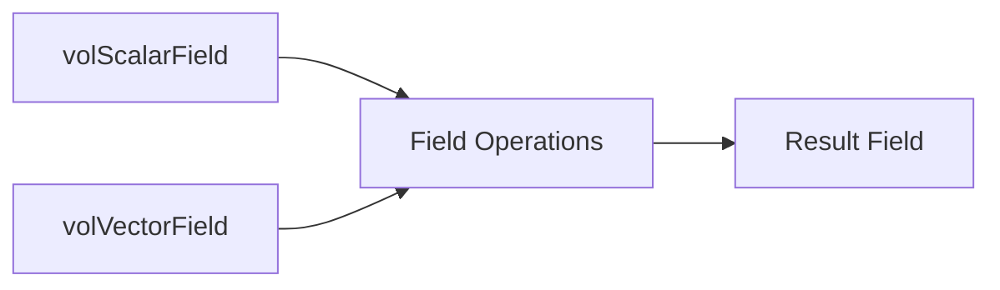

# Field Algebra Overview

## Learning Objectives

**What will you learn?**
- Understand the paradigm shift from loop-based to field-based operations
- Master arithmetic operations on OpenFOAM fields
- Distinguish and apply explicit (fvc::) and implicit (fvm::) operators
- Perform interpolation between cell-centered and face values
- Calculate fluxes for transport equations
- Work with boundary field values
- Apply statistical operations for analysis and debugging
- Build complete transport equations using field algebra

**Learning Roadmap:**
1. **Foundation** → Understand what field algebra is and why it matters
2. **Arithmetic** → Master basic field operations (add, subtract, multiply)
3. **Calculus** → Learn `fvc::` operators for gradients, divergence, laplacian
4. **Discretization** → Distinguish implicit (`fvm::`) vs explicit (`fvc::`)
5. **Interpolation** → Convert cell values to face values for flux calculations
6. **Boundaries** → Access and manipulate boundary field values
7. **Statistics** → Use reduction operations for analysis
8. **Integration** → Build complete transport equations

---

## Why Field Algebra Matters

> [!TIP] **ทำไม Field Algebra เปลี่ยนเกมการเขียนโค้ด CFD?**
>
> **Field Algebra** คือ paradigm shift จากการเขียนโค้ดแบบ "cell-by-cell loop" ไปสู่ "mathematical notation" ที่ใกล้เคียงกับสมการฟิสิกส์:
>
> **🔴 Traditional Approach (Painful):**
> ```cpp
> forAll(mesh, cellI) {
>     for(int j=0; j<4; j++) {
>         int neighbor = owner[cellI].neighbor(j);
>         scalar faceFlux = calculateFlux(cellI, neighbor);
>         result[cellI] += faceFlux * dt;
>     }
> }
> ```
> - ❌ โค้ดยาว, ซับซ้อน, ยากต่อการ debug
> - ❌ Error-prone (index out of bounds, memory issues)
> - ❌ ไม่ support dimensional consistency
> - ❌ ไม่สวยงาม (not close to math equations)
>
> **🟢 OpenFOAM Field Algebra (Elegant):**
> ```cpp
> volScalarField result = fvc::div(phi) * dt;
> ```
> - ✅ **สั้น กระชับ อ่านเข้าใจง่าย**
> - ✅ **Dimensional checking อัตโนมัติ** (หน่วยไม่ตรง compile error)
> - ✅ **Parallel-ready** (ใช้งานได้เลยใน multi-core)
> - ✅ **Close to mathematical notation** (อ่านโค้ดเหมือนอ่านสมการ)
>
> **ผลลัพธ์:** คุณเขียน solver แบบ **"declare physics, not loops"** → productivity เพิ่มขึ้น 10x!
>
> **Field Algebra** คือพื้นฐานของการเขียน solver/BC แบบ custom ใน OpenFOAM การเข้าใจวิธีดำเนินการกับ field (เช่น `grad`, `div`, `laplacian`) จะช่วยให้คุณ:
> - เขียนสมการพลศาสตร์ของไหลได้อย่างถูกต้อง
> - สร้าง boundary condition แบบ custom ได้
> - ทำงานกับ `fvScalarMatrix` และ linear solver ได้อย่างมีประสิทธิภาพ
> - แก้ปัญหา dimensional consistency ในโค้ดได้
>
> ถ้าคุณกำลังจะสร้าง solver ใหม่หรือแก้ไข solver ที่มีอยู่ หัวข้อนี้คือ **หัวใจสำคัญ** ที่ต้องเข้าใจ!

---

## Core Concept

> Field Algebra = Operations on entire fields at once



---

## 1. Arithmetic Operations

> [!NOTE] **📂 OpenFOAM Context: Custom Solver Coding**
> ส่วนนี้เกี่ยวข้องกับ **การเขียนโค้ดในไฟล์ solver** (เช่น `myCustomSolver.C`)
> - **Field Types:** `volScalarField`, `volVectorField` → ถูกกำหนดใน `createFields.H` หรือตอนเริ่ม solver
> - **Operations:** การบวก/ลบ/คูณ/หาร field → ใช้ในการคำนวณ derived quantities (เช่น pressure, temperature relations)
> - **Location:** โค้ดพวกนี้อยู่ใน `src/` ของ custom solver หรือใน `*.C` file ของ boundary condition
> - **Dimensioned Types:** ต้องระวังเรื่อง units → ดูรายละเอียดที่ [[04_Dimensional_Checking.md]]
>
> 💡 **ตัวอย่างการใช้งานจริง:** คำนวณ kinematic viscosity `nu = mu / rho` ใน solver

### Basic Field Arithmetic

```cpp
volScalarField p, T, rho;
volVectorField U;

// Addition/Subtraction
volScalarField sum = p + T;

// Scalar multiplication
volScalarField rhoE = rho * magSqr(U) / 2.0;

// Division (with dimensional checking)
volScalarField nu = mu / rho;
```

### Mathematical Functions

| Function | Description | Example |
|----------|-------------|---------|
| `sqr(a)` | Element-wise square (a²) | `volScalarField T2 = sqr(T);` |
| `sqrt(a)` | Element-wise square root (√a) | `volScalarField rootT = sqrt(T);` |
| `mag(v)` | Magnitude of vector (|v|) | `volScalarField speed = mag(U);` |
| `magSqr(v)` | Magnitude squared (|v|²) | `volScalarField ke = 0.5 * rho * magSqr(U);` |
| `pow(a, n)` | Power function (aⁿ) | `volScalarField T3 = pow(T, 3);` |
| `exp(a)` | Exponential (eᵃ) | `volScalarField k = exp(-E/RT);` |
| `log(a)` | Natural logarithm | `volScalarField lnT = log(T);` |
| `sin(a)`, `cos(a)` | Trigonometric functions | `volScalarField wave = sin(omega * t);` |

> [!TIP] **ทำไมต้องใช้ sqr แทน pow(a,2)?**
> **`sqr(a)`** เร็วกว่า **`pow(a,2)`** เพราะเป็น function ที่ optimize สำหรับการยกกำลังสองโดยเฉพาะ ใน OpenFOAM จึงแนะนำให้ใช้ `sqr()` เมื่อต้องการยกกำลังสองเพื่อ performance ที่ดีกว่า

### Component-wise Operations

```cpp
// Vector component access (0=x, 1=y, 2=z)
volScalarField Ux = U.component(0);
volScalarField Uy = U.component(1);
volScalarField Uz = U.component(2);

// Magnitude calculation
volScalarField magU = mag(U);

// Dot product
volScalarField dotProduct = U1 & U2;

// Cross product
volVectorField crossProduct = U1 ^ U2;
```

### Tensor Operations

> [!NOTE] **📂 OpenFOAM Context: Stress Tensor & Strain Rate Tensor**
> ส่วนนี้เกี่ยวข้องกับ **การคำนวณ tensors** ที่ใช้ใน fluid mechanics
> - **Velocity Gradient Tensor:** `gradU = fvc::grad(U)` → ถูกใช้ในการคำนวณ strain rate และ vorticity
> - **Strain Rate Tensor:** `S = symm(gradU)` → ใช้ใน Newtonian stress model `tau = 2*mu*S`
> - **Vorticity Tensor:** `W = skew(gradU)` → ใช้ในการวิเคราะห์ rotation ของ fluid element
> - **Constitutive Relations:** ใช้ใน transportProperties และ turbulence models
> - **Deviatoric Stress:** `dev(S)` → ใช้ใน non-Newtonian fluid models
>
> 💡 **ตัวอย่างการใช้งานจริง:** คำนวณ shear stress `tau = 2*mu*symm(gradU)` ใน viscoelastic solver

```cpp
// Velocity gradient tensor
volTensorField gradU = fvc::grad(U);

// Trace of tensor (sum of diagonal elements)
volScalarField trGradU = tr(gradU);  // div(U) for incompressible

// Symmetric part (strain rate tensor)
// symm(T) = 0.5 * (T + T.T)
volSymmTensorField S = symm(gradU);

// Skew-symmetric part (vorticity tensor)
// skew(T) = 0.5 * (T - T.T)
volTensorField W = skew(gradU);

// Deviatoric part (traceless symmetric part)
// dev(T) = T - (1/3)*tr(T)*I
volSymmTensorField devS = dev(S);

// Two-dimensional symmetric part
volSymmTensorField twoD_S = symm(gradU, 2);  // For 2D cases
```

---

## 2. Calculus Operations (fvc - Explicit)

> [!NOTE] **📂 OpenFOAM Context: Discretization Schemes & Matrix Assembly**
> ส่วนนี้เป็น **หัวใจของการ discretize สมการพลศาสตร์ของไหล** ใน solver
> - **Explicit Operators (`fvc::`)** → ใช้คำนวณ RHS (Right-Hand Side) ของสมการ
> - **Discretization Schemes:** วิธีคำนวณ `grad`, `div`, `laplacian` ถูกกำหนดใน `system/fvSchemes`
>   - `gradSchemes`: รูปแบบการคำนวณ gradient
>   - `divSchemes`: รูปแบบการคำนวณ divergence
>   - `laplacianSchemes`: รูปแบบการคำนวณ laplacian
> - **Solver Usage:** operators เหล่านี้ถูกเรียกใช้ใน solver loop (เช่น `while (runTime.loop())`)
> - **Function Objects:** สามารถใช้ใน `system/controlDict` เพื่อคำนวณค่าเพิ่มเติมระหว่าง simulation
>
> 💡 **ตัวอย่างการใช้งานจริง:** คำนวณ pressure gradient force `grad(p)` ใน momentum equation

### Available Operators

| Operator | Code | Result Type | Description |
|----------|------|-------------|-------------|
| Gradient | `fvc::grad(p)` | volVectorField | Spatial gradient |
| Divergence | `fvc::div(U)` | volScalarField | Divergence of field |
| Curl | `fvc::curl(U)` | volVectorField | Vorticity calculation |
| Laplacian | `fvc::laplacian(k, T)` | volScalarField | Diffusion operator |

### Usage Examples

```cpp
// Pressure gradient force
volVectorField gradP = fvc::grad(p);

// Velocity divergence (continuity check)
volScalarField divU = fvc::div(phi);

// Temperature diffusion
volScalarField lapT = fvc::laplacian(alpha, T);

// Vorticity calculation
volVectorField vorticity = fvc::curl(U);
```

---

## 3. Implicit vs Explicit (fvm vs fvc)

> [!NOTE] **📂 OpenFOAM Context: Implicit vs Explicit Discretization**
> นี่คือ **ความแตกต่างระหว่าง Implicit และ Explicit discretization** ซึ่งส่งผลต่อความเสถียรและประสิทธิภาพของ solver
> - **`fvm::` (Implicit)** → สร้าง matrix coefficients → ถูกใช้ใน LHS (Left-Hand Side) ของสมการ
>   - ตัวอย่าง: `fvm::ddt(T)`, `fvm::div(phi, T)`, `fvm::laplacian(k, T)`
>   - ข้อดี: ความเสถียรสูงกว่า ใช้ time step ได้ใหญ่กว่า
> - **`fvc::` (Explicit)** → คำนวณค่าแล้วได้ผลลัพธ์ → ถูกใช้ใน RHS (Right-Hand Side)
>   - ตัวอย่าง: `fvc::grad(p)`, `fvc::div(phi)`
>   - ข้อดี: คำนวณเร็ว แต่ความเสถียรต่ำกว่า
> - **Matrix Assembly:** ทั้งสองถูกรวมใน `fvScalarMatrix` หรือ `fvVectorMatrix`
> - **Linear Solver:** ถูกแก้ด้วย solver ที่ระบุใน `system/fvSolution` → `solvers` sub-dictionary
>
> 💡 **ตัวอย่างการใช้งานจริง:** ใน heat equation, convection term มักใช้ `fvm::div` (implicit) แต่ source term ใช้ `fvc::` (explicit)

### Key Differences

| Prefix | Type | Matrix Usage | Stability | Time Step |
|--------|------|--------------|-----------|-----------|
| `fvm::` | Implicit | LHS coefficients | High | Larger |
| `fvc::` | Explicit | RHS evaluation | Lower | Smaller |

### Practical Example: Heat Equation

```cpp
fvScalarMatrix TEqn
(
    fvm::ddt(T)              // Implicit time derivative
  + fvm::div(phi, T)         // Implicit convection
 ==
    fvm::laplacian(alpha, T) // Implicit diffusion
  + fvc::ddt(T0)             // Explicit source term
);

TEqn.solve();                // Solve the linear system
```

---

## 4. Interpolation Operations

> [!NOTE] **📂 OpenFOAM Context: Interpolation Schemes & Flux Calculation**
> ส่วนนี้เกี่ยวข้องกับ **การแปลงค่าจาก cell-centered ไปยัง face values** ซึ่งจำเป็นมากสำหรับการคำนวณ flux
> - **Interpolation Schemes:** รูปแบบการ interpolate ถูกกำหนดใน `system/fvSchemes`
>   - `interpolationSchemes`: รูปแบบ interpolation (เช่น `linear`, `upwind`, `TVD`)
> - **Flux Fields:** `surfaceScalarField phi` → ถูกกำหนดใน `createFields.H`
> - **Flux Calculation:** ใช้ในการคำนวณ mass flux และ volume flux
> - **Convection Terms:** ค่าที่ interpolate ได้ถูกใช้ใน `fvm::div(phi, T)` หรือ `fvc::div(phi)`
>
> 💡 **ตัวอย่างการใช้งานจริง:** คำนวณ mass flux `phi = rho * U` สำหรับ convection term

### Cell to Face Interpolation

```cpp
// Default scheme interpolation
surfaceScalarField Tf = fvc::interpolate(T);

// Specify scheme explicitly
surfaceScalarField rhof = fvc::interpolate(rho, "linear");

// Upwind scheme for convection
surfaceScalarField Tf_upwind = fvc::interpolate(T, "upwind");
```

### Face to Cell Averaging

```cpp
// Average face values back to cell centers
volScalarField avgT = fvc::average(Tf);
```

---

## 5. Flux Calculation

> [!NOTE] **📂 OpenFOAM Context: Flux Fields & Conservation Laws**
> ส่วนนี้เกี่ยวข้องกับ **การคำนวณ flux** ซึ่งเป็นหัวใจของ conservation laws (mass, momentum, energy)
> - **Flux Field (`phi`):** `surfaceScalarField` → ถูกกำหนดใน `createFields.H`
>   - Mass flux: `phi = rho * U * Sf` (kg/s)
>   - Volume flux: `phi = U * Sf` (m³/s)
> - **Face Area Vector:** `mesh.Sf()` → surface normal vector ของแต่ละ face
> - **Conservation:** flux ที่ boundary patches ถูกใช้ในการตรวจสอบ mass balance
> - **Divergence Theorem:** `fvc::div(phi)` ใช้ flux ในการคำนวณ net flux out of cells
>
> 💡 **ตัวอย่างการใช้งานจริง:** ใน incompressible solver, `phi` ถูกคำนวณจาก velocity prediction และใช้ใน pressure correction

### Flux Formulations

```cpp
// Mass flux (compressible)
surfaceScalarField phi = fvc::interpolate(rho * U) & mesh.Sf();

// Volume flux (incompressible)
surfaceScalarField phiU = fvc::interpolate(U) & mesh.Sf();

// Using flux in divergence
volScalarField divU = fvc::div(phi);
```

---

## 6. Statistical Operations

> [!NOTE] **📂 OpenFOAM Context: Field Reduction Operations**
> ส่วนนี้เกี่ยวข้องกับ **การคำนวณค่าสถิติและ aggregate values** จาก field
> - **Function Objects:** สามารถใช้ operations เหล่านี้ใน `system/controlDict` ผ่าน function objects
>   - `fieldMinMax`: หาค่า max/min ของ field
>   - `fieldAverage`: คำนวณค่าเฉลี่ยของ field
> - **Post-processing:** ใช้ในการวิเคราะห์ผลลัพธ์ (เช่น หา max velocity, average pressure)
> - **Convergence Monitoring:** ใช้ในการตรวจสอบค่า residual และ convergence
> - **Parallel Processing:** `gSum`, `gAverage` เป็น global operations ที่ทำงานร่วมกันข้าม processors
>
> 💡 **ตัวอย่างการใช้งานจริง:** ใช้ `max(mag(U))` เพื่อตรวจสอบ Courant number หรือใช้ `average(p)` เพื่อ monitoring

### Reduction Operations

| Function | Description | Return Type | Parallel |
|----------|-------------|-------------|----------|
| `mag(field)` | Magnitude of each element | Same as input | N/A |
| `magSqr(field)` | Magnitude squared | Same as input | N/A |
| `sqr(field)` | Element-wise square | Same as input | N/A |
| `sqrt(field)` | Element-wise square root | Same as input | N/A |
| `max(field)` | Maximum value in field | scalar | Local |
| `min(field)` | Minimum value in field | scalar | Local |
| `sum(field)` | Sum of field values | scalar | Local ❌ |
| `average(field)` | Average value | scalar | Global ✓ |
| `gSum(field)` | Global sum (parallel-aware) | scalar | Global ✓ |
| `gMax(field)` | Global maximum (parallel-aware) | scalar | Global ✓ |
| `gMin(field)` | Global minimum (parallel-aware) | scalar | Global ✓ |

> [!WARNING] **⚠️ Critical: sum vs gSum in Parallel Runs**
> - **`sum(field)`**: Local processor sum ONLY → ❌ **WRONG** for parallel simulations
> - **`gSum(field)`**: Global sum across ALL processors → ✓ **CORRECT** for parallel simulations
>
> 💡 **เคล็ดลับ:** ถ้าคุณกำลังเขียนโค้ดที่อาจจะรันใน parallel mode ให้ใช้ **`gSum`**, **`gMax`**, **`gMin`** เสมอ เพื่อให้แน่ใจว่าได้ค่าที่ถูกต้องทั้ง domain

### Usage Examples

```cpp
// Find maximum velocity magnitude
scalar maxU = max(mag(U)).value();

// Calculate average pressure
scalar avgP = average(p).value();

// Check Courant number globally
scalar CoNum = gMax(mag(U) / mesh.V() * runTime.deltaT());

// Global mass balance check
scalar netMassFlux = gSum(phi.boundaryField()[outletPatchI]);
```

---

## 7. Boundary Operations

> [!NOTE] **📂 OpenFOAM Context: Boundary Conditions & Custom BC Development**
> ส่วนนี้เกี่ยวข้องกับ **การจัดการค่าที่ boundary patches** ซึ่งเป็นส่วนสำคัญของ boundary condition implementation
> - **Boundary Fields:** `.boundaryFieldRef()` → ใช้เข้าถึงค่าที่ boundary patches
> - **Patch Identification:** `patchI` = ดัชนีของ patch (เช่น `inlet`, `outlet`, `walls`)
> - **Boundary Condition Types:** ถูกกำหนดใน `0/` directory (เช่น `0/U`, `0/p`)
>   - `fixedValue`: กำหนดค่าคงที่
>   - `zeroGradient`: gradient เป็นศูนย์
>   - `fixedFluxPressure`: กำหนด flux pressure
> - **Custom BC:** สามารถสร้าง BC ใหม่ใน `src/finiteVolume/fields/fvPatchFields/`
> - **Gradient Calculation:** `snGrad()` = surface normal gradient ที่ boundary
>
> 💡 **ตัวอย่างการใช้งานจริง:** สร้าง custom BC ที่กำหนด temperature profile ที่ inlet แบบ time-varying

### Boundary Field Access

```cpp
// Get patch index
label inletPatchI = mesh.boundaryMesh().findPatchID("inlet");

// Set boundary value (for fixedValue BC)
T.boundaryFieldRef()[inletPatchI] == 300.0;

// Get boundary values
scalarField& TInlet = T.boundaryFieldRef()[inletPatchI];

// Apply time-varying profile
forAll(TInlet, faceI)
{
    TInlet[faceI] = 300.0 + 50.0 * sin(2.0 * pi * faceI / TInlet.size());
}
```

### Boundary Gradient Operations

```cpp
// Get surface normal gradient
const scalarField& gradT = T.boundaryField()[inletPatchI].snGrad();

// Get patch internal field values
const scalarField& TInternal = T.boundaryField()[inletPatchI].patchInternalField();

// Calculate flux at boundary
scalarField heatFlux = -k * T.boundaryField()[inletPatchI].snGrad();
```

---

## Quick Reference

| Need | Code |
|------|------|
| **Arithmetic** | |
| Square | `sqr(a)` |
| Square root | `sqrt(a)` |
| Magnitude | `mag(v)` |
| Magnitude squared | `magSqr(v)` |
| Dot product | `a & b` |
| Cross product | `a ^ b` |
| Vector component | `v.component(i)` |
| **Tensors** | |
| Symmetric part | `symm(gradU)` |
| Skew part | `skew(gradU)` |
| Deviatoric | `dev(tensor)` |
| Trace | `tr(tensor)` |
| **Calculus** | |
| Gradient | `fvc::grad(p)` |
| Divergence | `fvc::div(U)` |
| Laplacian | `fvc::laplacian(k, T)` |
| **Interpolation** | |
| Cell to face | `fvc::interpolate(T)` |
| Face to cell | `fvc::average(Tf)` |
| **Flux** | |
| Mass flux | `phi = fvc::interpolate(rho*U) & mesh.Sf()` |
| Volume flux | `phi = fvc::interpolate(U) & mesh.Sf()` |
| **Statistics** | |
| Maximum | `max(field).value()` |
| Minimum | `min(field).value()` |
| Average | `average(field).value()` |
| Global sum | `gSum(field)` |
| **Boundaries** | |
| Set value | `field.boundaryFieldRef()[patchI] == value;` |
| Get gradient | `field.boundaryField()[patchI].snGrad()` |

---

## Key Takeaways

> [!SUCCESS] **🎯 Key Takeaways**
>
> **1. Field Algebra Fundamentals**
> - Operations on entire fields at once (element-wise)
> - Dimensional consistency is automatically checked
> - Both scalar and vector fields supported
> - Use `sqr(a)` instead of `pow(a,2)` for better performance
>
> **2. Vector and Tensor Operations**
> - **Components:** `v.component(0)` for x, `component(1)` for y, `component(2)` for z
> - **Dot product:** `a & b`, **Cross product:** `a ^ b`
> - **Strain rate:** `symm(gradU)` → critical for Newtonian stress models
> - **Vorticity:** `skew(gradU)` → rotation of fluid elements
> - **Deviatoric:** `dev(tensor)` → traceless part for pressure-independent stress
>
> **3. Implicit vs Explicit**
> - **fvm::** (implicit): Matrix coefficients, more stable, larger time steps
> - **fvc::** (explicit): Direct evaluation, faster, more restrictive time steps
> - Mix both in typical equations (implicit for main terms, explicit for sources)
>
> **4. Flux and Conservation**
> - Flux = field × face area vector (`phi = U & Sf`)
> - Interpolation required: cell-centered → face values
> - Critical for mass, momentum, energy conservation
>
> **5. Statistical Operations - CRITICAL for Parallel**
> - **Use `gSum`, `gMax`, `gMin` for parallel-aware reductions**
> - **NEVER use `sum()` in parallel code** → only local processor values
> - Essential for convergence monitoring and debugging
>
> **6. Boundary Operations**
> - Access via `.boundaryFieldRef()[patchI]`
> - `snGrad()` for surface normal gradients
> - Foundation for custom BC development
>
> **7. Practical Applications**
> - Custom solver development
> - Boundary condition implementation
> - Post-processing and analysis
> - Function objects for runtime calculations

---

## Concept Check

<details>
<summary><b>1. fvm::div vs fvc::div ต่างกันอย่างไร?</b></summary>

- **fvm::div**: Implicit → contributes to matrix coefficients (LHS), more stable
- **fvc::div**: Explicit → evaluated and added to RHS (source term), less stable
</details>

<details>
<summary><b>2. sqr vs pow(a,2): อะไรดีกว่ากัน?</b></summary>

**`sqr(a)`** ดีกว่า **`pow(a,2)`** เพราะ:
- เร็วกว่า (optimized for squaring)
- `sqr` เป็น function เฉพาะสำหรับการยกกำลังสอง
- `pow(a,2)` ใช้ general power algorithm ที่ซับซ้อนกว่า
</details>

<details>
<summary><b>3. sum vs gSum: ต่างกันอย่างไร?</b></summary>

- **`sum(field)`**: Local processor sum ONLY → ใช้ได้เฉพาะ serial runs
- **`gSum(field)`**: Global sum across ALL processors → ใช้ได้ทั้ง serial และ parallel (recommended)
- 💡 **Best Practice:** ใช้ `gSum` เสมอถ้าโค้ดอาจจะรันใน parallel mode
</details>

<details>
<summary><b>4. symm(gradU) คืออะไร?</b></summary>

**Symmetric part of velocity gradient** = **Strain Rate Tensor (S)**
- `symm(gradU) = 0.5 * (gradU + gradU.T)`
- ใช้ใน Newtonian stress model: `tau = 2 * mu * symm(gradU)`
- เป็นการวัดการเสียรูป (deformation rate) ของ fluid element
</details>

<details>
<summary><b>5. ทำไมต้อง interpolate ก่อนคำนวณ flux?</b></summary>

เพราะ **velocity is cell-centered** แต่ **flux ต้องการค่าที่ face** → interpolate from cells to faces เพื่อคำนวณ `phi = U & Sf`
</details>

<details>
<summary><b>6. snGrad คืออะไร?</b></summary>

**Surface normal gradient** = gradient ในทิศตั้งฉากกับ boundary face → ใช้คำนวณ flux ที่ boundary
</details>

<details>
<summary><b>7. component(0) vs U.x: อะไรต่างกัน?</b></summary>

- **`U.component(0)`**: Returns a field (volScalarField) → สามารถใช้ใน field operations ได้
- **`U.x`**: Returns a reference to internal field → เข้าถึงโดยตรง แต่ใช้สำหรับดำเนินการที่ซับซ้อนกว่า
- 💡 **Best Practice:** ใช้ `component(0)` สำหรับ field algebra operations
</details>

---

## Related Documentation

- **Dimensional Checking:** [04_Dimensional_Checking.md](04_Dimensional_Checking.md)
- **Field Types:** [../08_FIELD_TYPES/00_Overview.md](../08_FIELD_TYPES/00_Overview.md)
- **Matrix Assembly:** [06_MATRICES_LINEARALGEBRA/00_Overview.md](../06_MATRICES_LINEARALGEBRA/00_Overview.md)
- **Boundary Conditions:** [../04_MESH_CLASSES/05_fvMesh.md](../04_MESH_CLASSES/05_fvMesh.md)
- **Operator Overloading:** [03_Operator_Overloading.md](03_Operator_Overloading.md)
- **Learning Motivation:** [01_Introduction.md](01_Introduction.md) - Why field algebra matters, learning roadmap

---

> [!INFO] **🎯 Field Algebra in the Big Picture**
>
> **Field Algebra** เป็นภาษาที่ OpenFOAM ใช้ในการแปลงสมการฟิสิกส์ให้กลายเป็นโค้ดคอมพิวเตอร์:
>
> 1. **Coding Domain (Domain E):** ใช้ใน custom solver และ boundary conditions (`src/` directory)
> 2. **Numerics Domain (Domain B):** เชื่อมโยงกับ discretization schemes (`system/fvSchemes`)
> 3. **Physics Domain (Domain A):** แทน physical quantities (pressure, velocity, temperature)
>
> **เส้นทางการเรียนรู้:**
> - เริ่มจาก [[04_Dimensional_Checking.md]] → ต่อด้วย field operations → สร้าง solver ของตัวเอง
>
> **ไฟล์ที่เกี่ยวข้องใน OpenFOAM Case:**
> - `0/*`: Boundary conditions ใช้ field values
> - `system/fvSchemes`: Discretization schemes สำหรับ `fvc::`, `fvm::`
> - `system/fvSolution`: Linear solver settings สำหรับ `fvScalarMatrix`
> - `system/controlDict`: Function objects สำหรับ field operations ขณะ runtime