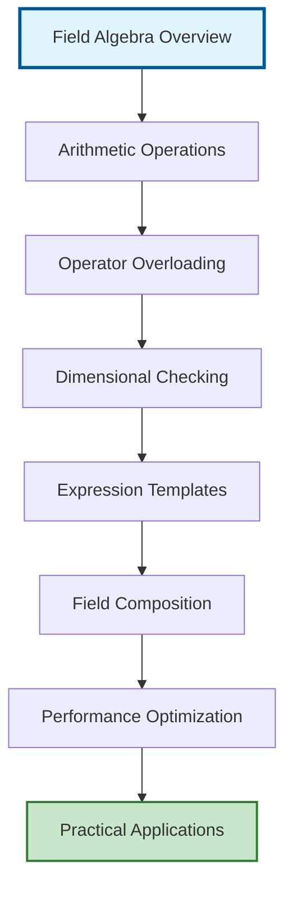

# Field Algebra Overview

## ระบบพีชคณิตฟิลด์ OpenFOAM

ระบบพีชคณิตฟิลด์ของ OpenFOAM เป็นหนึ่งในความสำเร็จทางสถาปัตยกรรมที่งดงามที่สุด ช่วยให้นักพัฒนาสามารถเขียนสมการทางคณิตศาสตร์ที่ซับซ้อนในรูปแบบโค้ด C++ ที่เข้าใจง่าย ใกล้เคียงกับสมการบนกระดาษมากที่สุด พีชคณิตฟิลด์เป็นพื้นฐานที่สำคัญที่สุดอย่างหนึ่งในการพัฒนา CFD solvers และ Physical models

> [!INFO] หัวใจของระบบ
> ระบบพีชคณิตฟิลด์ทำให้การเขียนสมการ Navier-Stokes และสมการเชิงอนุพันธ์เป็นเรื่องง่ายเหมือนการเขียนสมการทางคณิตศาสตร์ลงบนกระดาษ ในขณะที่ยังคงประสิทธิภาพการคำนวณและความปลอดภัยของชนิดข้อมูล


> **Figure 1:** แผนผังลำดับความเชื่อมโยงในระบบพีชคณิตฟิลด์ของ OpenFOAM ตั้งแต่การดำเนินการพื้นฐานไปจนถึงการเพิ่มประสิทธิภาพและการประยุกต์ใช้งานจริงในตัวแก้ปัญหา CFDความปลอดภัยทางฟิสิกส์ไม่ส่งผลกระทบต่อความเร็วในการจำลอง ผ่านการใช้พลังของ C++ Template Metaprogramming ในการตรวจสอบความสอดคล้องทางมิติทั้งหมดที่ขั้นตอนการคอมไพล์โปรแกรมเพียงครั้งเดียว

---

## คุณสมบัติหลักของระบบ

### 1. การดำเนินการพื้นฐาน (Basic Operations)

ระบบรองรับการดำเนินการทางคณิตศาสตร์พื้นฐานทั้งหมด:

```cpp
// Field addition and subtraction operations
volVectorField U3 = U1 + U2;
volScalarField p3 = p1 - p2;

// Scalar multiplication and division
volScalarField p_scaled = p * 2.0;
volVectorField U_half = U / 2.0;

// Field-to-field operations
surfaceScalarField phi = U & mesh.Sf();
volScalarField magU = mag(U);
```

<details>
<summary>📖 คำอธิบาย (Explanation)</summary>

**การดำเนินการพื้นฐานบนฟิลด์:**

ระบบพีชคณิตฟิลด์ของ OpenFOAM รองรับการดำเนินการทางคณิตศาสตร์พื้นฐานทั้งหมดบนฟิลด์ โดยแต่ละฟิลด์จะถูกดำเนินการ element-wise หมายความว่าการคำนวณจะเกิดขึ้นกับทุกจุดใน mesh พร้อมกัน:

1. **การบวกและลบฟิลด์**: รองรับการบวกและลบระหว่างฟิลด์ชนิดเดียวกัน เช่น `volVectorField` บวกกับ `volVectorField`
2. **การคูณและหารด้วยสเกลาร์**: ฟิลด์สามารถคูณหรือหารด้วยค่าสเกลาร์ได้โดยตรง
3. **การดำเนินการระหว่างฟิลด์**: รองรับการดำเนินการพิเศษเช่น dot product (`&`) และฟังก์ชัน `mag()` สำหรับหาขนาดของเวกเตอร์

</details>

<details>
<summary>📂 ที่มา (Source)</summary>

**.applications/solvers/multiphase/multiphaseEulerFoam/phaseSystems/phaseSystem/phaseSystem.C**
</details>

<details>
<summary>🔑 แนวคิดสำคัญ (Key Concepts)</summary>

- **Element-wise Operations**: การดำเนินการเกิดขึ้นกับทุกจุดใน mesh พร้อมกัน
- **Type Safety**: การตรวจสอบชนิดข้อมูลขณะคอมไพล์
- **Operator Overloading**: การใช้สัญลักษณ์ทางคณิตศาสตร์โดยตรงในโค้ด
- **Boundary Condition Propagation**: การดำเนินการสนามจะเคารพเงื่อนไขขอบเขตโดยอัตโนมัติ

</details>

---

### 2. การโอเวอร์โหลดโอเปอเรเตอร์ (Operator Overloading)

OpenFOAM ใช้ **Operator Overloading ที่ซับซ้อน** เพื่อให้นิพจน์ทางคณิตศาสตร์เป็นไปตามธรรมชาติ:

- **โอเปอเรเตอร์คณิตศาสตร์**: `+`, `-`, `*`, `/`, `^`
- **โอเปอเรเตอร์เชิงฟังก์ชัน**: `&` (dot product), `&&` (double dot), `|` (cross product)
- **การสร้างฟังก์ชันที่ซับซ้อนจากโอเปอเรเตอร์พื้นฐาน**

> [!TIP] ประโยชน์ของ Operator Overloading
> - เขียนโค้ดที่ใกล้เคียงสมการทางคณิตศาสตร์
> - ลดข้อผิดพลาดจากการ implement ซ้ำซ้อน
> - บำรุงรักษาและแก้ไขได้ง่าย

### 3. การตรวจสอบมิติ (Dimensional Checking)

OpenFOAM ใช้ **ระบบ Dimensional Analysis ที่เข้มงวด**:

```cpp
// Define field dimensions
dimensionSet velocityDim(dimLength, dimTime, -1);  // [L T⁻¹]
dimensionSet pressureDim(dimMass, dimLength, -1, dimTime, -2);  // [M L⁻¹ T⁻²]

// Create fields with specific dimensions
volVectorField U("U", mesh, velocityDim);
volScalarField p("p", mesh, pressureDim);

// Compile Error: Dimensional mismatch
// volScalarField invalid = p + U;

// Valid: Kinetic energy calculation
volScalarField kineticEnergy = 0.5 * (U & U);  // [L² T⁻²]
```

<details>
<summary>📖 คำอธิบาย (Explanation)</summary>

**ระบบตรวจสอบมิติของ OpenFOAM:**

OpenFOAM มีระบบตรวจสอบความสอดคล้องของมิติ (Dimensional Consistency) ที่เข้มงวด ซึ่งทำงานในขั้นตอนการคอมไพล์โปรแกรม ระบบนี้ใช้ `dimensionSet` เพื่อกำหนดมิติของปริมาณทางฟิสิกส์ตามหลัก M.L.T. (Mass, Length, Time):

1. **การกำหนดมิติ**: ใช้ `dimensionSet` เพื่อกำหนดมิติของฟิลด์ เช่น
   - `dimLength`: มิติความยาว [L]
   - `dimTime`: มิติเวลา [T]
   - `dimMass`: มิติมวล [M]

2. **การตรวจสอบความสอดคล้อง**: หากมีการดำเนินการที่มิติไม่สอดคล้องกัน เช่น บวกความดันกับความเร็ว คอมไพเลอร์จะแจ้งข้อผิดพลาดทันที

3. **ตัวอย่างการคำนวณที่ถูกต้อง**:
   - พลังงานจลน์: $E_k = \frac{1}{2} \mathbf{U} \cdot \mathbf{U}$ มีมิติ $[L^2 T^{-2}]$

</details>

<details>
<summary>📂 ที่มา (Source)</summary>

**.applications/solvers/multiphase/multiphaseEulerFoam/phaseSystems/PhaseSystems/MomentumTransferPhaseSystem/MomentumTransferPhaseSystem.C**
</details>

<details>
<summary>🔑 แนวคิดสำคัญ (Key Concepts)</summary>

- **Dimension Set**: ชุดข้อมูลที่กำหนดมิติของปริมาณทางฟิสิกส์
- **Compile-Time Checking**: การตรวจสอบความสอดคล้องขณะคอมไพล์
- **Dimensional Consistency**: หลักการที่สมการต้องมีมิติสอดคล้องกันทั้งสองฝั่ง
- **SI Units**: ระบบหน่วยสากลที่ใช้เป็นพื้นฐาน

</details>

> [!WARNING] การตรวจสอบมิติ
> ระบบตรวจสอบมิติจะป้องกันข้อผิดพลาดทางฟิสิกส์ในเวลาคอมไพล์ ช่วยลดความเสี่ยงของการสร้างแบบจำลองที่ผิดพลาด

### 4. เทมเพลตนิพจน์ (Expression Templates)

OpenFOAM ใช้ **Expression Templates** เพื่อกำจัด Temporary Objects และเพิ่มประสิทธิภาพ:

```cpp
// Traditional approach (inefficient)
tmp<volScalarField> temp1 = phi1 + phi2;           // Creates temporary 1
tmp<volScalarField> temp2 = temp1 * scalarField;    // Creates temporary 2
result = temp2 / phi3;                              // Final result

// With expression templates (efficient)
result = (phi1 + phi2) * scalarField / phi3;        // Single evaluation
```

<details>
<summary>📖 คำอธิบาย (Explanation)</summary>

**เทคนิค Expression Templates ใน OpenFOAM:**

Expression Templates เป็นเทคนิคการเขียนโปรแกรมที่ใช้ Template Metaprogramming เพื่อเพิ่มประสิทธิภาพในการคำนวณนิพจน์ทางคณิตศาสตร์ที่ซับซ้อน โดยหลักการทำงานมีดังนี้:

**ปัญหาของแนวทางดั้งเดิม:**
1. การสร้าง temporary objects หลายตัวในระหว่างการคำนวณ
2. การคัดลอกข้อมูลซ้ำซ้อนทำให้สูญเสียประสิทธิภาพ
3. การใช้หน่วยความจำเพิ่มขึ้นอย่างไม่จำเป็น

**การแก้ปัญหาด้วย Expression Templates:**
1. การสร้าง Expression Tree ที่เก็บโครงสร้างของนิพจน์โดยไม่ประเมินค่าทันที
2. การประเมินค่าเพียงครั้งเดียวเมื่อจำเป็น (Lazy Evaluation)
3. การคำนวณแบบ in-place โดยตรงที่ตำแหน่งหน่วยความจำของผลลัพธ์

**ตัวอย่างการทำงาน:**
- **แบบดั้งเดิม**: `temp1 = A + B` → สร้าง temporary → `temp2 = temp1 * C` → สร้าง temporary → `result = temp2 / D`
- **Expression Templates**: สร้าง expression tree `(A + B) * C / D` → คำนวณ `result[i] = (A[i] + B[i]) * C[i] / D[i]` โดยตรง

</details>

<details>
<summary>📂 ที่มา (Source)</summary>

**.applications/solvers/multiphase/multiphaseEulerFoam/phaseSystems/PhaseSystems/MomentumTransferPhaseSystem/MomentumTransferPhaseSystem.C**
</details>

<details>
<summary>🔑 แนวคิดสำคัญ (Key Concepts)</summary>

- **Expression Tree**: โครงสร้างแผนภูมิที่แทนนิพจน์ทางคณิตศาสตร์
- **Lazy Evaluation**: การประเมินค่าเมื่อจำเป็นเท่านั้น
- **Template Metaprogramming**: การเขียนโปรแกรมที่ทำงานในขั้นตอนคอมไพล์
- **In-place Computation**: การคำนวณโดยตรงที่ตำแหน่งหน่วยความจำปลายทาง

</details>

---

## กรอบงานคณิตศาสตมาตรพื้นฐาน

### การดำเนินการเวกเตอร์และเทนเซอร์

ระบบรองรับพีชคณิตเวกเตอร์และเทนเซอร์อย่างสมบูรณ์:

$$\mathbf{C} = \mathbf{A} + \mathbf{B}$$
$$\mathbf{D} = \alpha \mathbf{A} + \beta \mathbf{B}$$
$$\mathbf{E} = \mathbf{A} \cdot \mathbf{B} \quad \text{(dot product)}$$
$$\mathbf{F} = \mathbf{A} \times \mathbf{B} \quad \text{(cross product)}$$

**ตัวแปรที่ใช้:**
- $\mathbf{A}, \mathbf{B}, \mathbf{C}, \mathbf{D}$ - เวกเตอร์ฟิลด์
- $\mathbf{E}$ - ผลคูณจุด (scalar)
- $\mathbf{F}$ - ผลคูณไขว้ (เวกเตอร์)
- $\alpha, \beta$ - ค่าสเกลาร์

```cpp
// Vector field addition
volVectorField C = A + B;

// Scaled vector field operations
volVectorField D = alpha*A + beta*B;

// Tensor operations with automatic component-wise calculation
volTensorField T = A * B;  // Matrix multiplication
```

<details>
<summary>📖 คำอธิบาย (Explanation)</summary>

**พีชคณิตเวกเตอร์และเทนเซอร์ใน OpenFOAM:**

OpenFOAM มีระบบพีชคณิตเวกเตอร์และเทนเซอร์ที่สมบูรณ์ ช่วยให้สามารถดำเนินการคำนวณทางคณิตศาสตร์ที่ซับซ้อนได้อย่างสะดวก:

1. **เวกเตอร์ฟิลด์ (volVectorField)**: ฟิลด์ที่เก็บค่าเวกเตอร์สามมิติ $(u_x, u_y, u_z)$ ที่แต่ละจุดใน mesh
2. **เทนเซอร์ฟิลด์ (volTensorField)**: ฟิลด์ที่เก็บค่าเทนเซอร์อันดับสอง $3 \times 3$ ที่แต่ละจุด
3. **การดำเนินการที่รองรับ**:
   - การบวกและลบเวกเตอร์: $\mathbf{C} = \mathbf{A} + \mathbf{B}$
   - การคูณสเกลาร์: $\mathbf{D} = \alpha \mathbf{A} + \beta \mathbf{B}$
   - ผลคูณจุด (Dot Product): $\mathbf{E} = \mathbf{A} \cdot \mathbf{B}$ ใช้ `&`
   - ผลคูณไขว้ (Cross Product): $\mathbf{F} = \mathbf{A} \times \mathbf{B}$ ใช้ `^`
   - การคูณเทนเซอร์: $T_{ij} = A_i B_j$ ใช้ `*`

</details>

<details>
<summary>📂 ที่มา (Source)</summary>

**.applications/solvers/multiphase/multiphaseEulerFoam/phaseSystems/PhaseSystems/MomentumTransferPhaseSystem/MomentumTransferPhaseSystem.C**
</details>

<details>
<summary>🔑 แนวคิดสำคัญ (Key Concepts)</summary>

- **Vector Field**: ฟิลด์ที่เก็บค่าเวกเตอร์ที่แต่ละจุดใน mesh
- **Tensor Field**: ฟิลด์ที่เก็บค่าเทนเซอร์อันดับสองที่แต่ละจุด
- **Component-wise Operation**: การดำเนินการคำนวณทีละส่วนประกอบ
- **Matrix Multiplication**: การคูณเมตริกซ์ระหว่างเทนเซอร์

</details>

---

### โอเปอเรเตอร์เชิงอนุพันธ์

พีชคณิตฟิลด์บูรณาการกับโอเปอเรเตอร์เชิงอนุพันธ์:

$$\nabla \cdot \mathbf{U} = 0 \quad \text{(divergence)}$$
$$\nabla p = \frac{\partial p}{\partial x_i}\mathbf{e}_i \quad \text{(gradient)}$$
$$\nabla^2 \phi = \nabla \cdot (\nabla \phi) \quad \text{(Laplacian)}$$

**ตัวแปรที่ใช้:**
- $\mathbf{U}$ - เวกเตอร์ความเร็ว
- $p$ - สนามความดัน
- $\phi$ - สเกลาร์ฟิลด์
- $\nabla$ - โอเปอเรเตอร์เดล

```cpp
// Finite volume calculus operations
volScalarField divU = fvc::div(U);
volVectorField gradP = fvc::grad(p);
volScalarField lapPhi = fvc::laplacian(phi);

// Implicit operators for matrix construction
fvScalarMatrix pEqn = fvm::laplacian(p);
```

<details>
<summary>📖 คำอธิบาย (Explanation)</summary>

**โอเปอเรเตอร์เชิงอนุพันธ์ใน Finite Volume Method:**

OpenFOAM มีโอเปอเรเตอร์เชิงอนุพันธ์ที่แบ่งเป็นสองประเภทหลัก:

1. **Explicit Operators (fvc - finite volume calculus)**:
   - `fvc::div()`: คำนวณการแยกตัว (divergence) $\nabla \cdot \mathbf{U}$
   - `fvc::grad()`: คำนวณการไล่ระดับ (gradient) $\nabla p$
   - `fvc::laplacian()`: คำนวณลาปลาเชียน $\nabla^2 \phi$
   - ใช้สำหรับการคำนวณค่าที่รู้แล้ว และนำผลลัพธ์ไปใช้ในสมการ

2. **Implicit Operators (fvm - finite volume method)**:
   - `fvm::ddt()`: อนุพันธ์เชิงเวลา $\frac{\partial}{\partial t}$
   - `fvm::div()`: อนุพันธ์เชิงเวลาแบบ implicit
   - `fvm::laplacian()`: ลาปลาเชียนแบบ implicit
   - ใช้สำหรับสร้างเมตริกซ์สมการในระบบ linear solver

**ตัวอย่างการใช้งาน**:
- การคำนวณ divergence ของความเร็วเพื่อตรวจสอบความไม่บีบอัด (incompressibility)
- การคำนวณ gradient ของความดันเพื่อหาแรงดัน
- การสร้างสมการ pressure equation แบบ implicit

</details>

<details>
<summary>📂 ที่มา (Source)</summary>

**.applications/solvers/multiphase/multiphaseEulerFoam/phaseSystems/PhaseSystems/MomentumTransferPhaseSystem/MomentumTransferPhaseSystem.C**
</details>

<details>
<summary>🔑 แนวคิดสำคัญ (Key Concepts)</summary>

- **Explicit Operators**: โอเปอเรเตอร์ที่คำนวณค่าโดยตรงจากค่าที่รู้
- **Implicit Operators**: โอเปอเรเตอร์ที่สร้างเมตริกซ์สมการสำหรับการแก้ปัญหา
- **Finite Volume Method**: วิธีการปริมาตรจำกัดสำหรับแก้สมการเชิงอนุพันธ์
- **Linear Solver**: ตัวแก้ปัญหาเชิงเส้นที่ใช้แก้ระบบสมการ

</details>

---

## สถาปัตยกรรมการเพิ่มประสิทธิภาพ

### เทมเพลตนิพจน์ (Expression Templates)

OpenFOAM ใช้เทมเพลตนิพจน์เพื่อกำจัดออบเจกต์ชั่วคราว:

**กระบวนการทำงาน:**

**แบบดั้งเดิม (ไม่มีประสิทธิภาพ):**
1. สร้างออบเจกต์ชั่วคราว: `tmp1 = A + B`
2. การกำหนดค่า: `C = tmp1`
3. ทำลายออบเจกต์: `tmp1 destroyed`

**แบบเทมเพลตนิพจน์ (มีประสิทธิภาพ):**
- คำนวณโดยตรง: `C[i] = A[i] + B[i]`

### การรองรับอนุพันธ์อัตโนมัติ

ระบบพีชคณิตฟิลด์ให้รากฐานสำหรับอนุพันธ์อัตโนมัติผ่านความเชี่ยวชาญพิเศษของเทมเพลต:

```cpp
// Adjoint field types for gradient-based optimization
adjointVolScalarField dAlpha;
volScalarField alpha;

// Automatic Jacobian computation
fvScalarMatrix alphaEqn = fvm::ddt(alpha) + fvm::div(phi, alpha);
```

<details>
<summary>📖 คำอธิบาย (Explanation)</summary>

**การรองรับอนุพันธ์อัตโนมัติ (Automatic Differentiation):**

OpenFOAM มีระบบที่รองรับการคำนวณอนุพันธ์อัตโนมัติ ซึ่งมีประโยชน์อย่างมากในการปรับแก้ปัญหาแบบ gradient-based optimization:

1. **Adjoint Field Types**: ชนิดข้อมูลฟิลด์พิเศษที่สามารถคำนวณ gradient ได้อัตโนมัติ
2. **Automatic Jacobian Computation**: การคำนวณเมตริกซ์จาโคเบียนโดยอัตโนมัติจากสมการที่กำหนด
3. **Template Specialization**: การใช้ Template Metaprogramming เพื่อสร้างโค้ดสำหรับคำนวณอนุพันธ์

**ตัวอย่างการประยุกต์ใช้**:
- การหาค่าที่เหมาะสมที่สุด (optimization) ของพารามิเตอร์
- การวิเคราะห์ความไว (sensitivity analysis)
- การแก้ปัญหา adjoint สำหรับการควบคุมการไหล

</details>

<details>
<summary>📂 ที่มา (Source)</summary>

**.applications/solvers/multiphase/multiphaseEulerFoam/phaseSystems/PhaseSystems/MomentumTransferPhaseSystem/MomentumTransferPhaseSystem.C**
</details>

<details>
<summary>🔑 แนวคิดสำคัญ (Key Concepts)</summary>

- **Automatic Differentiation**: การคำนวณอนุพันธ์อัตโนมัติ
- **Adjoint Method**: วิธีการ adjoint สำหรับการคำนวณ gradient
- **Jacobian Matrix**: เมตริกซ์ของอนุพันธ์ย่อย
- **Gradient-Based Optimization**: การหาค่าที่เหมาะสมที่สุดโดยใช้ gradient

</details>

---

## การตรวจสอบความสอดคล้องของมิติ

### การกำหนดมิติของฟิลด์

```cpp
// Define field dimensions
dimensionSet scalarDims(dimless);  // [-]
dimensionSet velocityDims(dimLength, dimTime, -1);  // [L T⁻¹]
dimensionSet pressureDims(dimMass, dimLength, -1, dimTime, -2);  // [M L⁻¹ T⁻²]

// Create fields with dimensions
volScalarField p("p", mesh, pressureDims);
volVectorField U("U", mesh, velocityDims);
```

<details>
<summary>📖 คำอธิบาย (Explanation)</summary>

**การกำหนดมิติของฟิลด์ใน OpenFOAM:**

การกำหนดมิติของฟิลด์เป็นสิ่งสำคัญมากใน OpenFOAM เพื่อให้มั่นใจว่าสมการทางฟิสิกส์ถูกต้อง:

1. **dimensionSet**: คลาสที่ใช้กำหนดมิติของปริมาณทางฟิสิกส์
   - รับพารามิเตอร์เป็นคู่ของ (ชนิดมิติ, เลขยกกำลัง)
   - เช่น `dimensionSet(dimMass, dimLength, -1, dimTime, -2)` หมายถึง $[M^1 L^{-1} T^{-2}]$ ซึ่งเป็นมิติของความดัน

2. **มิติที่ใช้บ่อย**:
   - `dimless`: ไร้มิติ [-]
   - `dimLength`: มิติความยาว [L]
   - `dimTime`: มิติเวลา [T]
   - `dimMass`: มิติมวล [M]
   - `dimTemperature`: มิติอุณหภูมิ [Θ]

3. **การสร้างฟิลด์พร้อมมิติ**:
   - ฟิลด์ทุกตัวควรมีการกำหนดมิติที่ถูกต้อง
   - การคำนวณที่มิติไม่สอดคล้องจะถูกตรวจพบในขั้นตอนคอมไพล์

</details>

<details>
<summary>📂 ที่มา (Source)</summary>

**.applications/solvers/multiphase/multiphaseEulerFoam/phaseSystems/PhaseSystems/MomentumTransferPhaseSystem/MomentumTransferPhaseSystem.C**
</details>

<details>
<summary>🔑 แนวคิดสำคัญ (Key Concepts)</summary>

- **dimensionSet**: คลาสสำหรับกำหนดมิติของปริมาณทางฟิสิกส์
- **Base Dimensions**: มิติพื้นฐาน (Mass, Length, Time, Temperature)
- **Dimensional Homogeneity**: หลักการที่สมการต้องมีมิติสอดคล้องกัน
- **SI Unit System**: ระบบหน่วยสากลที่ใช้เป็นพื้นฐาน

</details>

---

### การตรวจจับข้อผิดพลาดมิติ

| การดำเนินการ | ผลลัพธ์ | คำอธิบาย |
|---------------|----------|----------|
| `p + U` | ❌ Compile Error | ความดัน + ความเร็ว (มิติไม่สอดคล้อง) |
| `0.5 * (U & U)` | ✅ Valid | พลังงานจลน์ [L²T⁻²] |

```cpp
// Compile-time error: Cannot add pressure and velocity
// volScalarField invalid = p + U;  // Dimensional mismatch detected

// Valid operation: Kinetic energy calculation
volScalarField kineticEnergy = 0.5 * (U & U);  // [L^2 T^-2]
```

<details>
<summary>📖 คำอธิบาย (Explanation)</summary>

**การตรวจจับข้อผิดพลาดมิติ:**

ระบบตรวจสอบมิติของ OpenFOAM สามารถตรวจจับข้อผิดพลาดทางฟิสิกส์ได้ในขั้นตอนการคอมไพล์ ซึ่งเป็นประโยชน์อย่างมาก:

1. **ตัวอย่างข้อผิดพลาดที่พบบ่อย**:
   - การบวกความดันกับความเร็ว: `p + U` → Compile Error
   - เพราะความดันมีมิติ $[M L^{-1} T^{-2}]$ แต่ความเร็วมีมิติ $[L T^{-1}]$

2. **ตัวอย่างการคำนวณที่ถูกต้อง**:
   - พลังงานจลน์: $E_k = \frac{1}{2} \mathbf{U} \cdot \mathbf{U}$
   - มีมิติ $[L^2 T^{-2}]$ ซึ่งสอดคล้องกับพลังงานต่อมวล

3. **ประโยชน์ของระบบ**:
   - ป้องกันข้อผิดพลาดทางฟิสิกส์ในเวลาคอมไพล์
   - ช่วยให้มั่นใจว่าสมการถูกต้อง
   - ลดเวลาในการ debug และค้นหาข้อผิดพลาด

</details>

<details>
<summary>📂 ที่มา (Source)</summary>

**.applications/solvers/multiphase/multiphaseEulerFoam/phaseSystems/PhaseSystems/MomentumTransferPhaseSystem/MomentumTransferPhaseSystem.C**
</details>

<details>
<summary>🔑 แนวคิดสำคัญ (Key Concepts)</summary>

- **Compile-Time Checking**: การตรวจสอบในขั้นตอนคอมไพล์
- **Dimensional Mismatch**: ความไม่สอดคล้องของมิติ
- **Physical Validity**: ความถูกต้องทางฟิสิกส์
- **Type Safety**: ความปลอดภัยของชนิดข้อมูล

</details>

---

## การบูรณาการเงื่อนไขขอบเขต

การดำเนินการพีชคณิตฟิลด์เคารพเงื่อนไขขอบเขตโดยอัตโนมัติ:

```cpp
// Addition respects boundary conditions
volVectorField sumFields = field1 + field2;
// Boundary values computed as: sumFields.boundaryField()[i] =
// field1.boundaryField()[i] + field2.boundaryField()[i]

// Automatic boundary condition propagation
volScalarField correctedP = p + rho * g * z;  // Hydrostatic pressure
```

<details>
<summary>📖 คำอธิบาย (Explanation)</summary>

**การบูรณาการเงื่อนไขขอบเขตใน Field Algebra:**

หนึ่งในคุณสมบัติที่ทรงพลังของระบบพีชคณิตฟิลด์คือการเคารพและรักษาเงื่อนไขขอบเขตโดยอัตโนมัติ:

1. **Automatic Boundary Condition Propagation**:
   - เมื่อดำเนินการทางคณิตศาสตร์ระหว่างฟิลด์ เงื่อนไขขอบเขตจะถูกคำนวณโดยอัตโนมัติ
   - ตัวอย่าง: `sumFields = field1 + field2`
   - ค่าขอบเขต: `sumFields.boundaryField()[i] = field1.boundaryField()[i] + field2.boundaryField()[i]`

2. **ตัวอย่างการประยุกต์ใช้**:
   - การคำนวณความดัน hydrostatic: `correctedP = p + rho * g * z`
   - ระบบจะรักษาเงื่อนได้ขอบเขตของ `p`, `rho`, และ `z` โดยอัตโนมัติ
   - ผลลัพธ์จะมีเงื่อนไขขอบเขตที่สอดคล้องกับการดำเนินการ

3. **ประโยชน์**:
   - ลดความซับซ้อนในการจัดการเงื่อนไขขอบเขต
   - ลดข้อผิดพลาดจากการกำหนดเงื่อนไขขอบเขตผิด
   - ช่วยให้โค้ดอ่านง่ายและบำรุงรักษาได้ง่ายขึ้น

</details>

<details>
<summary>📂 ที่มา (Source)</summary>

**.applications/solvers/multiphase/multiphaseEulerFoam/phaseSystems/PhaseSystems/MomentumTransferPhaseSystem/MomentumTransferPhaseSystem.C**
</details>

<details>
<summary>🔑 แนวคิดสำคัญ (Key Concepts)</summary>

- **Boundary Condition**: เงื่อนไขขอบเขตที่กำหนดค่าที่ขอบโดเมน
- **Automatic Propagation**: การแพร่กระจายของเงื่อนไขโดยอัตโนมัติ
- **Boundary Field**: ฟิลด์ที่เก็บค่าที่ขอบเขต
- **Physical Consistency**: ความสอดคล้องทางฟิสิกส์

</details>

**กระบวนการทำงาน:**
1. ดำเนินการฟิลด์ภายในโดเมน
2. คำนวณค่าขอบเขตโดยอัตโนมัติ
3. รักษาความสอดคล้องทางฟิสิกส์

---

## การจัดการหน่วยความจำและการเพิ่มประสิทธิภาพ

### ระบบการนับอ้างอิง (Reference Counting)

OpenFOAM ใช้การนับอ้างอิงที่ซับซ้อนเพื่อลดการใช้หน่วยความจำ:

```cpp
// tmp<T> provides automatic memory management
tmp<volScalarField> tphi = fvc::div(phi);
volScalarField& phi = tphi();  // Reference without copy
// Automatic destruction when reference count reaches zero
```

<details>
<summary>📖 คำอธิบาย (Explanation)</summary>

**ระบบ Reference Counting ใน OpenFOAM:**

OpenFOAM ใช้ระบบ Reference Counting เพื่อจัดการหน่วยความจำอย่างมีประสิทธิภาพ:

1. **tmp\<T\> Template Class**:
   - คลาสที่ใช้จัดการหน่วยความจำอัตโนมัติ
   - เก็บจำนวนการอ้างอิงถึงออบเจกต์
   - ทำลายออบเจกต์อัตโนมัติเมื่อจำนวนการอ้างอิงเป็นศูนย์

2. **วิธีการทำงาน**:
   - สร้าง `tmp<volScalarField>` สำหรับเก็บผลลัพธ์ชั่วคราว
   - ใช้ `operator()` เพื่อรับ reference โดยไม่คัดลอกข้อมูล
   - ออบเจกต์จะถูกทำลายเมื่อไม่มีการอ้างอิงถึงอีกต่อไป

3. **ประโยชน์**:
   - ลดการใช้หน่วยความจำโดยไม่ต้องคัดลอกข้อมูล
   - จัดการหน่วยความจำอัตโนมัติ ลดความเสี่ยงของ memory leak
   - เพิ่มประสิทธิภาพในการคำนวณ

</details>

<details>
<summary>📂 ที่มา (Source)</summary>

**.applications/solvers/multiphase/multiphaseEulerFoam/phaseSystems/PhaseSystems/MomentumTransferPhaseSystem/MomentumTransferPhaseSystem.C**
</details>

<details>
<summary>🔑 แนวคิดสำคัญ (Key Concepts)</summary>

- **Reference Counting**: การนับจำนวนการอ้างอิงถึงออบเจกต์
- **Smart Pointer**: พอยน์เตอร์อัจฉริยะที่จัดการหน่วยความจำอัตโนมัติ
- **Automatic Memory Management**: การจัดการหน่วยความจำอัตโนมัติ
- **Memory Efficiency**: ประสิทธิภาพการใช้หน่วยความจำ

</details>

---

### การดำเนินการที่รับรู้แคช

ระบบพีชคณิตฟิลด์ถูกออกแบบสำหรับสถาปัตยกรรม CPU สมัยใหม่:

```cpp
// Cache-friendly operations for large fields
forAll(C, i)
{
    C[i] = A[i] + B[i];  // Sequential memory access
}

// SIMD vectorization support through compiler optimizations
#pragma omp simd
forAll(C, i)
{
    C[i] = A[i] * scalar + B[i];  // Vectorized operations
}
```

<details>
<summary>📖 คำอธิบาย (Explanation)</summary>

**การเพิ่มประสิทธิภาพด้วย Cache-Aware Operations:**

ระบบพีชคณิตฟิลด์ของ OpenFOAM ถูกออกแบบให้ใช้ประโยชน์จากสถาปัตยกรรม CPU สมัยใหม่:

1. **Cache-Friendly Memory Access**:
   - การเข้าถึงหน่วยความจำแบบต่อเนื่อง (Sequential Access)
   - ใช้ `forAll` macro เพื่อวนลูปผ่านทุกจุดในฟิลด์
   - การเข้าถึง `C[i] = A[i] + B[i]` แบบต่อเนื่องช่วยเพิ่มประสิทธิภาพ cache

2. **SIMD Vectorization**:
   - ใช้ `#pragma omp simd` เพื่อให้คอมไพเลอร์ทำ vectorization
   - ประมวลผลหลายข้อมูลพร้อมกันในคำสั่งเดียว
   - เพิ่มประสิทธิภาพการคำนวณอย่างมีนัยสำคัญ

3. **ประโยชน์**:
   - ลด cache miss และเพิ่ม cache hit
   - ใช้ประโยชน์จาก SIMD instructions ของ CPU
   - เพิ่มความเร็วในการคำนวณสำหรับฟิลด์ขนาดใหญ่

</details>

<details>
<summary>📂 ที่มา (Source)</summary>

**.applications/solvers/multiphase/multiphaseEulerFoam/phaseSystems/PhaseSystems/MomentumTransferPhaseSystem/MomentumTransferPhaseSystem.C**
</details>

<details>
<summary>🔑 แนวคิดสำคัญ (Key Concepts)</summary>

- **Cache Locality**: ความใกล้ชิดของข้อมูลในหน่วยความจำ
- **SIMD**: Single Instruction, Multiple Data
- **Vectorization**: การแปลงโค้ดให้ใช้ SIMD instructions
- **Sequential Access**: การเข้าถึงข้อมูลแบบต่อเนื่อง

</details>

---

### เทคนิคการเพิ่มประสิทธิภาพ

| เทคนิค | ประโยชน์ | ตัวอย่าง |
|---------|---------|----------|
| Expression Templates | ลด temporary objects | `C = A + B` |
| Reference Counting | จัดการหน่วยความจำอัตโนมัติ | `tmp<volScalarField>` |
| SIMD Vectorization | ประมวลผลแบบขนาน | `#pragma omp simd` |
| Cache-friendly | การเข้าถึงหน่วยความจำต่อเนื่อง | `forAll(C, i)` |

---

## การบูรณาการคอมพิวติ้งแบบขนาน

การดำเนินการพีชคณิตฟิลด์ขยายไปยังการคำนวณแบบกระจายผ่าน MPI อย่างราบรื่น:

```cpp
// Parallel reduction operations are automatically handled
scalar globalMax = max(p);  // Reduces across all processors
vector globalSum = sum(U);  // Global vector sum

// Parallel field operations maintain consistency
volVectorField parallelSum = localField1 + globalField2;
```

<details>
<summary>📖 คำอธิบาย (Explanation)</summary>

**การคำนวณแบบขนานใน Field Algebra:**

OpenFOAM รองรับการคำนวณแบบขนานผ่าน MPI อย่างสมบูรณ์:

1. **Parallel Reduction Operations**:
   - `max(p)`: หาค่าสูงสุดของความดันทั่วทั้งโดเมน
   - `sum(U)`: คำนวณผลรวมของเวกเตอร์ความเร็วทั่วทั้งโดเมน
   - ระบบจะรวมผลลัพธ์จากทุก processor โดยอัตโนมัติ

2. **Parallel Field Operations**:
   - การดำเนินการบนฟิลด์จะเคารพการแบ่งส่วนข้อมูล (domain decomposition)
   - แต่ละ processor จะคำนวณเฉพาะส่วนที่รับผิดชอบ
   - การสื่อสารระหว่าง processor เกิดขึ้นโดยอัตโนมัติ

3. **ประโยชน์**:
   - แบ่งโหลดการคำนวณไปยังหลาย processor
   - รองรับการคำนวณขนาดใหญ่บน HPC clusters
   - ลดเวลาในการจำลองอย่างมีนัยสำคัญ

</details>

<details>
<summary>📂 ที่มา (Source)</summary>

**.applications/solvers/multiphase/multiphaseEulerFoam/phaseSystems/PhaseSystems/MomentumTransferPhaseSystem/MomentumTransferPhaseSystem.C**
</details>

<details>
<summary>🔑 แนวคิดสำคัญ (Key Concepts)</summary>

- **MPI (Message Passing Interface)**: มาตรฐานการสื่อสารระหว่าง processor
- **Parallel Reduction**: การรวมผลลัพธ์จากหลาย processor
- **Domain Decomposition**: การแบ่งโดเมนเป็นส่วนย่อย
- **Load Balancing**: การกระจายภาระงาน

</details>

---

## การดำเนินการทางคณิตศาสตมาตรขั้นสูง

### การดำเนินการที่ไม่เชิงเส้น

ระบบรองรับฟังก์ชันทางคณิตศาสตร์ที่ไม่เชิงเส้นที่ซับซ้อน:

```cpp
// Mathematical field operations
volScalarField expField = exp(T);  // e^T
volScalarField logField = log(p);  // ln(p)
volScalarField powField = pow(U.component(0), 2);  // U_x^2

// Trigonometric functions
volScalarField sinTheta = sin(theta);
volVectorField rotatedU = U * cos(angle) + normal * (U & normal) * (1 - cos(angle));
```

<details>
<summary>📖 คำอธิบาย (Explanation)</summary>

**การดำเนินการทางคณิตศาสตร์ขั้นสูง:**

OpenFOAM รองรับฟังก์ชันทางคณิตศาสตร์ที่ซับซ้อนบนฟิลด์:

1. **ฟังก์ชัน Exponential และ Logarithmic**:
   - `exp(T)`: คำนวณ $e^T$ สำหรับทุกจุดในฟิลด์
   - `log(p)`: คำนวณ $\ln(p)$ สำหรับทุกจุดในฟิลด์

2. **ฟังก์ชัน Power**:
   - `pow(U.component(0), 2)`: คำนวณ $U_x^2$
   - สามารถใช้กับค่ายกกำลังใดๆ ก็ได้

3. **ฟังก์ชัน Trigonometric**:
   - `sin(theta)`, `cos(theta)`, `tan(theta)`: ฟังก์ชันตรีโกณมิติ
   - สามารถใช้สำหรับการหมุนเวกเตอร์ เช่น:
     ```cpp
     rotatedU = U * cos(angle) + normal * (U & normal) * (1 - cos(angle))
     ```
     หมุนเวกเตอร์ `U` รอบแกน `normal` ด้วยมุม `angle`

4. **ประโยชน์**:
   - ใช้สำหรับจำลองปรากฏการณ์ทางฟิสิกส์ที่ซับซ้อน
   - รองรับการคำนวณที่ต้องใช้ฟังก์ชันพิเศษ
   - ช่วยให้เขียนสมการฟิสิกส์ได้โดยตรง

</details>

<details>
<summary>📂 ที่มา (Source)</summary>

**.applications/solvers/multiphase/multiphaseEulerFoam/phaseSystems/PhaseSystems/MomentumTransferPhaseSystem/MomentumTransferPhaseSystem.C**
</details>

<details>
<summary>🔑 แนวคิดสำคัญ (Key Concepts)</summary>

- **Element-wise Function Application**: การประยุกต์ฟังก์ชันกับทุกจุดในฟิลด์
- **Vector Rotation**: การหมุนเวกเตอร์ด้วยมุม
- **Component Access**: การเข้าถึงส่วนประกอบของเวกเตอร์
- **Mathematical Functions**: ฟังก์ชันทางคณิตศาสตร์

</details>

---

### การดำเนินการแบบมีเงื่อนไข

พีชคณิตฟิลด์รวมถึงการดำเนินการแบบมีเงื่อนไข:

```cpp
// Conditional field operations
volScalarField maskedField = pos(p - pCrit) * (p - pCrit);
volVectorField limitedU = mag(U) > Umax ? Umax * U/mag(U) : U;

// Piecewise functions
volScalarField piecewise =
    (T < Tcrit) * k1 * T +
    (T >= Tcrit) * k2 * sqrt(T);
```

<details>
<summary>📖 คำอธิบาย (Explanation)</summary>

**การดำเนินการแบบมีเงื่อนไขบนฟิลด์:**

OpenFOAM รองรับการดำเนินการแบบมีเงื่อนไขบนฟิลด์:

1. **ฟังก์ชัน pos() และ neg()**:
   - `pos(x)`: คืนค่า 1 ถ้า x > 0, 0 ในกรณีอื่น
   - `neg(x)`: คืนค่า 1 ถ้า x < 0, 0 ในกรณีอื่น
   - ตัวอย่าง: `maskedField = pos(p - pCrit) * (p - pCrit)` จะเก็บค่า `p - pCrit` เฉพาะที่ `p > pCrit`

2. **Ternary Operator**:
   - `condition ? value_if_true : value_if_false`
   - ตัวอย่าง: `limitedU = mag(U) > Umax ? Umax * U/mag(U) : U`
   - จำกัดความเร็วไม่ให้เกิน `Umax` โดยรักษาทิศทิศ

3. **Piecewise Functions**:
   - สามารถสร้างฟังก์ชันที่มีหลายช่วงได้:
     ```cpp
     piecewise = (T < Tcrit) * k1 * T + (T >= Tcrit) * k2 * sqrt(T)
     ```
   - ใช้ `k1 * T` เมื่อ `T < Tcrit` และ `k2 * sqrt(T)` เมื่อ `T >= Tcrit`

4. **ประโยชน์**:
   - ใช้สำหรับสร้างเงื่อนไขที่ซับซ้อนบนฟิลด์
   - รองรับการจำลองปรากฏการณ์ที่มีหลายเฟส
   - ช่วยให้เขียน logic ที่ซับซ้อนได้อย่างกระชับ

</details>

<details>
<summary>📂 ที่มา (Source)</summary>

**.applications/solvers/multiphase/multiphaseEulerFoam/phaseSystems/PhaseSystems/MomentumTransferPhaseSystem/MomentumTransferPhaseSystem.C**
</details>

<details>
<summary>🔑 แนวคิดสำคัญ (Key Concepts)</summary>

- **Conditional Logic**: ตรรกะแบบมีเงื่อนไข
- **Piecewise Functions**: ฟังก์ชันที่มีหลายช่วง
- **Masking**: การซ่อน/แสดงข้อมูลตามเงื่อนไข
- **Limiter**: การจำกัดค่าไม่ให้เกินค่าที่กำหนด

</details>

---

## การบูรณาการกับสถาปัตยกรรม Solver

ระบบพีชคณิตฟิลด์บูรณาการโดยตรงกับสถาปัตยกรรม linear solver:

```cpp
// Matrix equation construction using field algebra
fvScalarMatrix TEqn
(
    fvm::ddt(T)
  + fvm::div(phi, T)
  - fvm::laplacian(alpha, T)
 ==
    fvc::ddt(kappa) + fvc::div(phi, kappa)
);

// Automatic matrix assembly from field operations
TEqn.relax();
TEqn.solve();
```

<details>
<summary>📖 คำอธิบาย (Explanation)</summary>

**การสร้างสมการ Solver ด้วย Field Algebra:**

ระบบพีชคณิตฟิลด์ของ OpenFOAM บูรณาการโดยตรงกับสถาปัตยกรรม linear solver:

1. **การสร้างสมการ (Matrix Construction)**:
   - `fvm::ddt(T)`: อนุพันธ์เชิงเวลา $\frac{\partial T}{\partial t}$ (implicit)
   - `fvm::div(phi, T)`: การพา (advection) $\nabla \cdot (\phi T)$ (implicit)
   - `fvm::laplacian(alpha, T)`: การแพร่ (diffusion) $\nabla \cdot (\alpha \nabla T)$ (implicit)
   - `fvc::ddt(kappa)`: อนุพันธ์เชิงเวลา (explicit)
   - `fvc::div(phi, kappa)`: การพา (explicit)

2. **Implicit vs Explicit Operators**:
   - **Implicit (fvm)**: สร้างเมตริกซ์สำหรับการแก้ปัญหา
   - **Explicit (fvc)**: คำนวณค่าโดยตรงและนำไปใช้ในสมการ

3. **การแก้สมการ**:
   - `TEqn.relax()`: การผ่อนคลาย (under-relaxation) เพื่อเพิ่มเสถียรภาพ
   - `TEqn.solve()`: แก้ระบบสมการเชิงเส้น

4. **ประโยชน์**:
   - เขียนสมการได้ใกล้เคียงสมการทางคณิตศาสตร์
   - ระบบสร้างเมตริกซ์โดยอัตโนมัติ
   - ลดความซับซ้อนในการพัฒนา solver

</details>

<details>
<summary>📂 ที่มา (Source)</summary>

**.applications/solvers/multiphase/multiphaseEulerFoam/phaseSystems/PhaseSystems/MomentumTransferPhaseSystem/MomentumTransferPhaseSystem.C**
</details>

<details>
<summary>🔑 แนวคิดสำคัญ (Key Concepts)</summary>

- **Linear Solver**: ตัวแก้ปัญหาเชิงเส้น
- **Matrix Assembly**: การประกอบเมตริกซ์สมการ
- **Implicit vs Explicit**: โอเปอเรเตอร์แบบ implicit และ explicit
- **Under-Relaxation**: การผ่อนคลายเพื่อเพิ่มเสถียรภาพ

</details>

---

## คุณค่าทางการศึกษาและการบำรุงรักษาโค้ด

สัญลักษณ์คณิตศาสตร์ที่เข้าใจง่ายทำให้โค้ด OpenFOAM อ่านง่ายและบำรุงรักษาได้สูง

### การเปรียบเทียบรูปแบบโค้ด

**แนวทาง OpenFOAM (อ่านง่าย):**
```cpp
// Clear physical meaning
volScalarField reynoldsStress = 2.0 * nut * dev(symm(fvc::grad(U)));
```

<details>
<summary>📖 คำอธิบาย (Explanation)</summary>

**ความสามารถในการอ่านและบำรุงรักษาโค้ด:**

หนึ่งในประโยชน์ที่สำคัญของระบบพีชคณิตฟิลด์คือความสามารถในการอ่านและเข้าใจโค้ด:

1. **แนวทาง OpenFOAM (อ่านง่าย)**:
   ```cpp
   volScalarField reynoldsStress = 2.0 * nut * dev(symm(fvc::grad(U)));
   ```
   - สามารถอ่านได้ว่าเป็นการคำนวณ Reynolds stress
   - `fvc::grad(U)`: คำนวณ gradient ของความเร็ว
   - `symm()`: สร้าง symmetric part ของเทนเซอร์
   - `dev()`: คำนวณ deviatoric part
   - สมการ: $\tau = 2 \nu_t \text{dev}(\text{symm}(\nabla \mathbf{U}))$

2. **แนวทางดั้งเดิม (ยากต่อการอ่าน)**:
   ```cpp
   forAll(reynoldsStress, i) {
       tensor gradU = fvc::grad(U)[i];
       reynoldsStress[i] = 2.0 * nut[i] * (gradU - 0.5*tr(gradU)*I);
   }
   ```
   - ต้องเขียน loop ผ่านทุกจุด
   - ยากต่อการดูว่าสมการคืออะไร
   - มีโอกาสเกิดข้อผิดพลาดสูงกว่า

3. **ประโยชน์**:
   - โค้ดอ่านง่ายและเข้าใจได้ง่าย
   - ลดข้อผิดพลาดในการ implement
   - บำรุงรักษาและแก้ไขได้ง่าย
   - เหมาะสำหรับการศึกษาและการวิจัย

</details>

<details>
<summary>📂 ที่มา (Source)</summary>

**.applications/solvers/multiphase/multiphaseEulerFoam/phaseSystems/PhaseSystems/MomentumTransferPhaseSystem/MomentumTransferPhaseSystem.C**
</details>

<details>
<summary>🔑 แนวคิดสำคัญ (Key Concepts)</summary>

- **Code Readability**: ความสามารถในการอ่านและเข้าใจโค้ด
- **Mathematical Notation**: สัญลักษณ์ทางคณิตศาสตร์
- **Maintainability**: ความสามารถในการบำรุงรักษา
- **Reynolds Stress**: ความเค้น Reynolds

</details>

**แนวทางดั้งเดิม (ยากต่อการอ่าน):**
```cpp
// Versus traditional implementation (less readable)
// forAll(reynoldsStress, i) {
//     tensor gradU = fvc::grad(U)[i];
//     reynoldsStress[i] = 2.0 * nut[i] * (gradU - 0.5*tr(gradU)*I);
// }
```

---

## หัวข้อที่ครอบคลุมในโมดูล

### 1. พีชคณิตฟิลด์พื้นฐาน
- **การดำเนินการพื้นฐาน:** การบวก ลบ คูณ หารระหว่างฟิลด์
- **การคูณดอทและไครส์:** `dot()`, `cross()`
- **การคำนวณเกรเดียนต์และไดเวอร์เจนซ์:** `grad()`, `div()`

### 2. การโอเวอร์โหลดโอเปอเรเตอร์
- **โอเปอเรเตอร์คณิตศาสตร์:** `+`, `-`, `*`, `/`, `^`
- **โอเปอเรเตอร์เชิงฟังก์ชัน:** `&`, `&&`, `|`
- **การสร้างฟังก์ชันที่ซับซ้อนจากโอเปอเรเตอร์พื้นฐาน**

### 3. การตรวจสอบมิติ
- **ระบบตรวจสอบมิติแบบอัตโนมัติ**
- **setUnits และ dimensionSet**
- **การป้องกันข้อผิดพลาดทางมิติในเวลาคอมไพล์**

### 4. เทมเพลตนิพจน์ขั้นสูง
- **Expression Templates:** การปรับแต่งประสิทธิภาพความเร็วสูง
- **Lazy Evaluation:** การคำนวณแบบล่าช้า
- **การลดการสร้างวัตถุชั่วคราว**

### 5. การประยุกต์ใช้จริง
- **สมการ Navier-Stokes:** การแปลงสมการเชิงคณิตศาสตร์เป็นโค้ด OpenFOAM
- **ตัวอย่างจากโซลเวอร์จริง**

---

## ประโยชน์ของสถาปัตยกรรม

### สำหรับนักพัฒนา
- ✅ เขียนโค้ดที่ใกล้เคียงสมการทางคณิตศาสตร์
- ✅ ลดข้อผิดพลาดจากการ implement ซ้ำซ้อน
- ✅ บำรุงรักษาและแก้ไขได้ง่าย

### สำหรับนักวิจัย CFD
- ✅ มุ่งเน้นที่ฟิสิกส์และคณิตศาสตร์
- ✅ การทดสอบแนวคิดใหม่ได้รวดเร็ว
- ✅ ความปลอดภัยของชนิดข้อมูลและมิติ

### ประสิทธิภาพทางเทคนิค
- ✅ การเพิ่มประสิทธิภาพ compile-time
- ✅ การสร้างโค้ดอัตโนมัติ
- ✅ การจัดการหน่วยความจำอัตโนมัติ

---

แนวทางทางสถาปัตยกรรมนี้ช่วยให้ผู้ปฏิบัติการ CFD สามารถมุ่งเน้นที่ฟิสิกส์และคณิตศาสตร์มากกว่ารายละเอียดการ implement ในขณะที่ระบบเทมเพลตรับประกันประสิทธิภาพที่เหมาะสมที่สุด