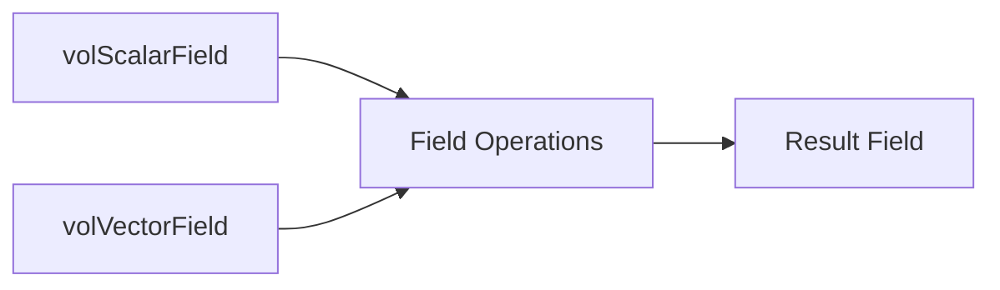

# Field Algebra Overview

ภาพรวม Field Algebra ใน OpenFOAM

> [!TIP] ทำไม Field Algebra สำคัญ?
> **Field Algebra** คือพื้นฐานของการเขียน solver/BC แบบ custom ใน OpenFOAM การเข้าใจวิธีดำเนินการกับ field (เช่น `grad`, `div`, `laplacian`) จะช่วยให้คุณ:
> - เขียนสมการพลศาสตร์ของไหลได้อย่างถูกต้อง
> - สร้าง boundary condition แบบ custom ได้
> - ทำงานกับ `fvScalarMatrix` และ linear solver ได้อย่างมีประสิทธิภาพ
> - แก้ปัญหา dimensional consistency ในโค้ดได้
>
> ถ้าคุณกำลังจะสร้าง solver ใหม่หรือแก้ไข solver ที่มีอยู่ หัวข้อนี้คือ **หัวใจสำคัญ** ที่ต้องเข้าใจ!

---

## Overview

> Field Algebra = Operations on entire fields at once



---

## 1. Arithmetic Operations

> [!NOTE] **📂 OpenFOAM Context: Custom Solver Coding**
> ส่วนนี้เกี่ยวข้องกับ **การเขียนโค้ดในไฟล์ solver** (เช่น `myCustomSolver.C`)
> - **Field Types:** `volScalarField`, `volVectorField` → ถูกกำหนดใน `createFields.H` หรือตอนเริ่ม solver
> - **Operations:** การบวก/ลบ/คูณ/หาร field → ใช้ในการคำนวณ derived quantities (เช่น pressure, temperature relations)
> - **Location:** โค้ดพวกนี้อยู่ใน `src/` ของ custom solver หรือใน `*.C` file ของ boundary condition
> - **Dimensioned Types:** ต้องระวังเรื่อง units → ดูรายละเอียดที่ [[04_Dimensional_Checking.md]]
>
> 💡 **ตัวอย่างการใช้งานจริง:** คำนวณ kinematic viscosity `nu = mu / rho` ใน solver

### Basic Math

```cpp
volScalarField p, T, rho;
volVectorField U;

// Addition/Subtraction
volScalarField sum = p + T;

// Multiplication
volScalarField rhoE = rho * magSqr(U) / 2.0;

// Division
volScalarField nu = mu / rho;
```

### Component-wise

```cpp
// Vector component access
volScalarField Ux = U.component(0);

// Magnitude
volScalarField magU = mag(U);
```

---

## 2. Vector Calculus (fvc)

> [!NOTE] **📂 OpenFOAM Context: discretization Schemes & Matrix Assembly**
> ส่วนนี้เป็น **หัวใจของการ discretize สมการพลศาสตร์ของไหล** ใน solver
> - **Explicit Operators (`fvc::`)** → ใช้คำนวณ RHS (Right-Hand Side) ของสมการ
> - **Discretization Schemes:** วิธีคำนวณ `grad`, `div`, `laplacian` ถูกกำหนดใน `system/fvSchemes`
>   - `gradSchemes`: รูปแบบการคำนวณ gradient
>   - `divSchemes`: รูปแบบการคำนวณ divergence
>   - `laplacianSchemes`: รูปแบบการคำนวณ laplacian
> - **Solver Usage:** operators เหล่านี้ถูกเรียกใช้ใน solver loop (เช่น `while (runTime.loop())`)
> - **Function Objects:** สามารถใช้ใน `system/controlDict` เพื่อคำนวณค่าเพิ่มเติมระหว่าง simulation
>
> 💡 **ตัวอย่างการใช้งานจริง:** คำนวณ pressure gradient force `grad(p)` ใน momentum equation

| Operator | Code | Result Type |
|----------|------|-------------|
| Gradient | `fvc::grad(p)` | volVectorField |
| Divergence | `fvc::div(U)` | volScalarField |
| Curl | `fvc::curl(U)` | volVectorField |
| Laplacian | `fvc::laplacian(k, T)` | volScalarField |

### Examples

```cpp
// Pressure gradient
volVectorField gradP = fvc::grad(p);

// Velocity divergence
volScalarField divU = fvc::div(phi);

// Temperature diffusion
volScalarField lapT = fvc::laplacian(alpha, T);
```

---

## 3. fvm vs fvc

> [!NOTE] **📂 OpenFOAM Context: Implicit vs Explicit Discretization**
> นี่คือ **ความแตกต่างระหว่าง Implicit และ Explicit discretization** ซึ่งส่งผลต่อความเสถียรและประสิทธิภาพของ solver
> - **`fvm::` (Implicit)** → สร้าง matrix coefficients → ถูกใช้ใน LHS (Left-Hand Side) ของสมการ
>   - ตัวอย่าง: `fvm::ddt(T)`, `fvm::div(phi, T)`, `fvm::laplacian(k, T)`
>   - ข้อดี: ความเสถียรสูงกว่า ใช้ time step ได้ใหญ่กว่า
> - **`fvc::` (Explicit)** → คำนวณค่าแล้วได้ผลลัพธ์ → ถูกใช้ใน RHS (Right-Hand Side)
>   - ตัวอย่าง: `fvc::grad(p)`, `fvc::div(phi)`
>   - ข้อดี: คำนวณเร็ว แต่ความเสถียรต่ำกว่า
> - **Matrix Assembly:** ทั้งสองถูกรวมใน `fvScalarMatrix` หรือ `fvVectorMatrix`
> - **Linear Solver:** ถูกแก้ด้วย solver ที่ระบุใน `system/fvSolution` → `solvers` sub-dictionary
>
> 💡 **ตัวอย่างการใช้งานจริง:** ใน heat equation, convection term มักใช้ `fvm::div` (implicit) แต่ source term ใช้ `fvc::` (explicit)

| Prefix | Type | Use |
|--------|------|-----|
| `fvm::` | Implicit | Matrix LHS |
| `fvc::` | Explicit | Evaluated RHS |

### Example

```cpp
fvScalarMatrix TEqn
(
    fvm::ddt(T)           // Implicit (goes to matrix)
  + fvm::div(phi, T)      // Implicit (goes to matrix)
 ==
    fvm::laplacian(alpha, T)  // Implicit
  + fvc::ddt(T0)              // Explicit source
);
```

---

## 4. Interpolation

> [!NOTE] **📂 OpenFOAM Context: Interpolation Schemes & Flux Calculation**
> ส่วนนี้เกี่ยวข้องกับ **การแปลงค่าจาก cell-centered ไปยัง face values** ซึ่งจำเป็นมากสำหรับการคำนวณ flux
> - **Interpolation Schemes:** รูปแบบการ interpolate ถูกกำหนดใน `system/fvSchemes`
>   - `interpolationSchemes`: รูปแบบ interpolation (เช่น `linear`, `upwind`, `TVD`)
> - **Flux Fields:** `surfaceScalarField phi` → ถูกกำหนดใน `createFields.H`
> - **Flux Calculation:** ใช้ในการคำนวณ mass flux และ volume flux
> - **Convection Terms:** ค่าที่ interpolate ได้ถูกใช้ใน `fvm::div(phi, T)` หรือ `fvc::div(phi)`
>
> 💡 **ตัวอย่างการใช้งานจริง:** คำนวณ mass flux `phi = rho * U` สำหรับ convection term

### Cell → Face

```cpp
// Linear interpolation
surfaceScalarField Tf = fvc::interpolate(T);

// Scheme-based
surfaceScalarField rhof = fvc::interpolate(rho, "linear");
```

### Face → Cell

```cpp
// Average of face values
volScalarField avgT = fvc::average(Tf);
```

---

## 5. Flux Calculation

> [!NOTE] **📂 OpenFOAM Context: Flux Fields & Conservation Laws**
> ส่วนนี้เกี่ยวข้องกับ **การคำนวณ flux** ซึ่งเป็นหัวใจของ conservation laws (mass, momentum, energy)
> - **Flux Field (`phi`):** `surfaceScalarField` → ถูกกำหนดใน `createFields.H`
>   - Mass flux: `phi = rho * U * Sf` (kg/s)
>   - Volume flux: `phi = U * Sf` (m³/s)
> - **Face Area Vector:** `mesh.Sf()` → surface normal vector ของแต่ละ face
> - **Conservation:** flux ที่ boundary patches ถูกใช้ในการตรวจสอบ mass balance
> - **Divergence Theorem:** `fvc::div(phi)` ใช้ flux ในการคำนวณ net flux out of cells
>
> 💡 **ตัวอย่างการใช้งานจริง:** ใน incompressible solver, `phi` ถูกคำนวณจาก velocity prediction และใช้ใน pressure correction

```cpp
// Mass flux from velocity
surfaceScalarField phi = fvc::interpolate(rho * U) & mesh.Sf();

// Volume flux
surfaceScalarField phiU = fvc::interpolate(U) & mesh.Sf();
```

---

## 6. Common Operations

> [!NOTE] **📂 OpenFOAM Context: Field Reduction Operations**
> ส่วนนี้เกี่ยวข้องกับ **การคำนวณค่าสถิติและ aggregate values** จาก field
> - **Function Objects:** สามารถใช้ operations เหล่านี้ใน `system/controlDict` ผ่าน function objects
>   - `fieldMinMax`: หาค่า max/min ของ field
>   - `fieldAverage`: คำนวณค่าเฉลี่ยของ field
> - **Post-processing:** ใช้ในการวิเคราะห์ผลลัพธ์ (เช่น หา max velocity, average pressure)
> - **Convergence Monitoring:** ใช้ในการตรวจสอบค่า residual และ convergence
> - **Parallel Processing:** `gSum`, `gAverage` เป็น global operations ที่ทำงานร่วมกันข้าม processors
>
> 💡 **ตัวอย่างการใช้งานจริง:** ใช้ `max(mag(U))` เพื่อตรวจสอบ Courant number หรือใช้ `average(p)` เพื่อ monitoring

| Function | Description |
|----------|-------------|
| `mag(field)` | Magnitude |
| `magSqr(field)` | Magnitude squared |
| `sqr(field)` | Element-wise square |
| `sqrt(field)` | Element-wise sqrt |
| `max(field)` | Maximum value |
| `min(field)` | Minimum value |
| `average(field)` | Global average |
| `gSum(field)` | Global sum |

---

## 7. Boundary Operations

> [!NOTE] **📂 OpenFOAM Context: Boundary Conditions & Custom BC Development**
> ส่วนนี้เกี่ยวข้องกับ **การจัดการค่าที่ boundary patches** ซึ่งเป็นส่วนสำคัญของ boundary condition implementation
> - **Boundary Fields:** `.boundaryFieldRef()` → ใช้เข้าถึงค่าที่ boundary patches
> - **Patch Identification:** `patchI` = ดัชนีของ patch (เช่น `inlet`, `outlet`, `walls`)
> - **Boundary Condition Types:** ถูกกำหนดใน `0/` directory (เช่น `0/U`, `0/p`)
>   - `fixedValue`: กำหนดค่าคงที่
>   - `zeroGradient`: gradient เป็นศูนย์
>   - `fixedFluxPressure`: กำหนด flux pressure
> - **Custom BC:** สามารถสร้าง BC ใหม่ใน `src/finiteVolume/fields/fvPatchFields/`
> - **Gradient Calculation:** `snGrad()` = surface normal gradient ที่ boundary
>
> 💡 **ตัวอย่างการใช้งานจริง:** สร้าง custom BC ที่กำหนด temperature profile ที่ inlet แบบ time-varying

```cpp
// Set boundary value
T.boundaryFieldRef()[patchI] == fixedValue;

// Get boundary gradient
const scalarField& gradT = T.boundaryField()[patchI].snGrad();
```

---

## Quick Reference

| Need | Code |
|------|------|
| Gradient | `fvc::grad(p)` |
| Divergence | `fvc::div(U)` |
| Laplacian | `fvc::laplacian(k, T)` |
| Interpolate | `fvc::interpolate(T)` |
| Flux | `phi = fvc::interpolate(U) & mesh.Sf()` |

---

## 🧠 Concept Check

<details>
<summary><b>1. fvm::div vs fvc::div ต่างกันอย่างไร?</b></summary>

- **fvm::div**: Implicit → contributes to matrix coefficients
- **fvc::div**: Explicit → evaluated and added to RHS
</details>

<details>
<summary><b>2. ทำไมต้อง interpolate ก่อนคำนวณ flux?</b></summary>

เพราะ **velocity is cell-centered** แต่ **flux ต้องการค่าที่ face** → interpolate from cells to faces
</details>

<details>
<summary><b>3. snGrad คืออะไร?</b></summary>

**Surface normal gradient** = gradient ในทิศตั้งฉากกับ boundary face
</details>

---

## 📖 เอกสารที่เกี่ยวข้อง

- **Dimensional Checking:** [04_Dimensional_Checking.md](04_Dimensional_Checking.md)
- **Field Types:** [../08_FIELD_TYPES/00_Overview.md](../08_FIELD_TYPES/00_Overview.md)

---

> [!INFO] **🎯 Summary: Field Algebra in the Big Picture**
>
> **Field Algebra** เป็นภาษาที่ OpenFOAM ใช้ในการแปลงสมการฟิสิกส์ให้กลายเป็นโค้ดคอมพิวเตอร์:
>
> 1. **Coding Domain (Domain E):** ใช้ใน custom solver และ boundary conditions (`src/` directory)
> 2. **Numerics Domain (Domain B):** เชื่อมโยงกับ discretization schemes (`system/fvSchemes`)
> 3. **Physics Domain (Domain A):** แทน physical quantities (pressure, velocity, temperature)
>
> **เส้นทางการเรียนรู้:**
> - เริ่มจาก [[04_Dimensional_Checking.md]] → ต่อด้วย field operations → สร้าง solver ของตัวเอง
>
> **ไฟล์ที่เกี่ยวข้องใน OpenFOAM Case:**
> - `0/*`: Boundary conditions ใช้ field values
> - `system/fvSchemes`: Discretization schemes สำหรับ `fvc::`, `fvm::`
> - `system/fvSolution`: Linear solver settings สำหรับ `fvScalarMatrix`
> - `system/controlDict`: Function objects สำหรับ field operations ขณะ runtime