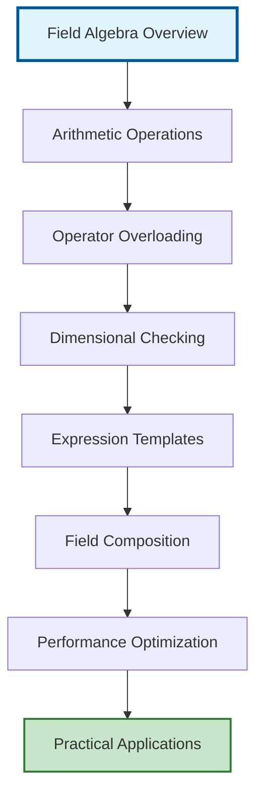

# Field Algebra Overview

## ระบบพีชคณิตฟิลด์ OpenFOAM

ระบบพีชคณิตฟิลด์ของ OpenFOAM เป็นหนึ่งในความสำเร็จทางสถาปัตยกรรมที่งดงามที่สุด ช่วยให้นักพัฒนาสามารถเขียนสมการทางคณิตศาสตร์ที่ซับซ้อนในรูปแบบโค้ด C++ ที่เข้าใจง่าย ใกล้เคียงกับสมการบนกระดาษมากที่สุด พีชคณิตฟิลด์เป็นพื้นฐานที่สำคัญที่สุดอย่างหนึ่งในการพัฒนา CFD solvers และ Physical models

> [!INFO] หัวใจของระบบ
> ระบบพีชคณิตฟิลด์ทำให้การเขียนสมการ Navier-Stokes และสมการเชิงอนุพันธ์เป็นเรื่องง่ายเหมือนการเขียนสมการทางคณิตศาสตร์ลงบนกระดาษ ในขณะที่ยังคงประสิทธิภาพการคำนวณและความปลอดภัยของชนิดข้อมูล


> **Figure 1:** แผนผังลำดับความเชื่อมโยงในระบบพีชคณิตฟิลด์ของ OpenFOAM ตั้งแต่การดำเนินการพื้นฐานไปจนถึงการเพิ่มประสิทธิภาพและการประยุกต์ใช้งานจริงในตัวแก้ปัญหา CFDความปลอดภัยทางฟิสิกส์ไม่ส่งผลกระทบต่อความเร็วในการจำลอง ผ่านการใช้พลังของ C++ Template Metaprogramming ในการตรวจสอบความสอดคล้องทางมิติทั้งหมดที่ขั้นตอนการคอมไพล์โปรแกรมเพียงครั้งเดียว

---

## คุณสมบัติหลักของระบบ

### 1. การดำเนินการพื้นฐาน (Basic Operations)

ระบบรองรับการดำเนินการทางคณิตศาสตร์พื้นฐานทั้งหมด:

```cpp
// การบวกและลบฟิลด์
volVectorField U3 = U1 + U2;
volScalarField p3 = p1 - p2;

// การคูณและหารด้วยสเกลาร์
volScalarField p_scaled = p * 2.0;
volVectorField U_half = U / 2.0;

// การดำเนินการระหว่างฟิลด์
surfaceScalarField phi = U & mesh.Sf();
volScalarField magU = mag(U);
```

### 2. การโอเวอร์โหลดโอเปอเรเตอร์ (Operator Overloading)

OpenFOAM ใช้ **Operator Overloading ที่ซับซ้อน** เพื่อให้นิพจน์ทางคณิตศาสต์เป็นไปตามธรรมชาติ:

- **โอเปอเรเตอร์คณิตศาสตร์**: `+`, `-`, `*`, `/`, `^`
- **โอเปอเรเตอร์เชิงฟังก์ชัน**: `&` (dot product), `&&` (double dot), `|` (cross product)
- **การสร้างฟังก์ชันที่ซับซ้อนจากโอเปอเรเตอร์พื้นฐาน**

> [!TIP] ประโยชน์ของ Operator Overloading
> - เขียนโค้ดที่ใกล้เคียงสมการทางคณิตศาสตร์
> - ลดข้อผิดพลาดจากการ implement ซ้ำซ้อน
> - บำรุงรักษาและแก้ไขได้ง่าย

### 3. การตรวจสอบมิติ (Dimensional Checking)

OpenFOAM ใช้ **ระบบ Dimensional Analysis ที่เข้มงวด**:

```cpp
dimensionSet velocityDim(dimLength, dimTime, -1); // [L T⁻¹]
dimensionSet pressureDim(dimMass, dimLength, -1, dimTime, -2); // [M L⁻¹ T⁻²]

volVectorField U("U", mesh, velocityDim);
volScalarField p("p", mesh, pressureDim);

// ❌ Compile Error: มิติไม่สอดคล้อง
// volScalarField invalid = p + U;

// ✅ Valid: พลังงานจลน์
volScalarField kineticEnergy = 0.5 * (U & U); // [L² T⁻²]
```

> [!WARNING] การตรวจสอบมิติ
> ระบบตรวจสอบมิติจะป้องกันข้อผิดพลาดทางฟิสิกส์ในเวลาคอมไพล์ ช่วยลดความเสี่ยงของการสร้างแบบจำลองที่ผิดพลาด

### 4. เทมเพลตนิพจน์ (Expression Templates)

OpenFOAM ใช้ **Expression Templates** เพื่อกำจัด Temporary Objects และเพิ่มประสิทธิภาพ:

```cpp
// ❌ แบบดั้งเดิม (ไม่มีประสิทธิภาพ)
tmp<volScalarField> temp1 = phi1 + phi2;           // สร้าง temporary 1
tmp<volScalarField> temp2 = temp1 * scalarField;    // สร้าง temporary 2
result = temp2 / phi3;                              // ผลลัพธ์สุดท้าย

// ✅ ด้วย expression templates (มีประสิทธิภาพ)
result = (phi1 + phi2) * scalarField / phi3;        // การประเมินครั้งเดียว
```

---

## กรอบงานคณิตศาสตมาตรพื้นฐาน

### การดำเนินการเวกเตอร์และเทนเซอร์

ระบบรองรับพีชคณิตเวกเตอร์และเทนเซอร์อย่างสมบูรณ์:

$$\mathbf{C} = \mathbf{A} + \mathbf{B}$$
$$\mathbf{D} = \alpha \mathbf{A} + \beta \mathbf{B}$$
$$\mathbf{E} = \mathbf{A} \cdot \mathbf{B} \quad \text{(dot product)}$$
$$\mathbf{F} = \mathbf{A} \times \mathbf{B} \quad \text{(cross product)}$$

**ตัวแปรที่ใช้:**
- $\mathbf{A}, \mathbf{B}, \mathbf{C}, \mathbf{D}$ - เวกเตอร์ฟิลด์
- $\mathbf{E}$ - ผลคูณจุด (scalar)
- $\mathbf{F}$ - ผลคูณไขว้ (เวกเตอร์)
- $\alpha, \beta$ - ค่าสเกลาร์

```cpp
// Vector field addition
volVectorField C = A + B;

// Scaled vector field operations
volVectorField D = alpha*A + beta*B;

// Tensor operations with automatic component-wise calculation
volTensorField T = A * B; // Matrix multiplication
```

### โอเปอเรเตอร์เชิงอนุพันธ์

พีชคณิตฟิลด์บูรณาการกับโอเปอเรเตอร์เชิงอนุพันธ์:

$$\nabla \cdot \mathbf{U} = 0 \quad \text{(divergence)}$$
$$\nabla p = \frac{\partial p}{\partial x_i}\mathbf{e}_i \quad \text{(gradient)}$$
$$\nabla^2 \phi = \nabla \cdot (\nabla \phi) \quad \text{(Laplacian)}$$

**ตัวแปรที่ใช้:**
- $\mathbf{U}$ - เวกเตอร์ความเร็ว
- $p$ - สนามความดัน
- $\phi$ - สเกลาร์ฟิลด์
- $\nabla$ - โอเปอเรเตอร์เดล

```cpp
// Finite volume calculus operations
volScalarField divU = fvc::div(U);
volVectorField gradP = fvc::grad(p);
volScalarField lapPhi = fvc::laplacian(phi);

// Implicit operators for matrix construction
fvScalarMatrix pEqn = fvm::laplacian(p);
```

---

## สถาปัตยกรรมการเพิ่มประสิทธิภาพ

### เทมเพลตนิพจน์ (Expression Templates)

OpenFOAM ใช้เทมเพลตนิพจน์เพื่อกำจัดออบเจกต์ชั่วคราว:

**กระบวนการทำงาน:**

**แบบดั้งเดิม (ไม่มีประสิทธิภาพ):**
1. สร้างออบเจกต์ชั่วคราว: `tmp1 = A + B`
2. การกำหนดค่า: `C = tmp1`
3. ทำลายออบเจกต์: `tmp1 destroyed`

**แบบเทมเพลตนิพจน์ (มีประสิทธิภาพ):**
- คำนวณโดยตรง: `C[i] = A[i] + B[i]`

### การรองรับอนุพันธ์อัตโนมัติ

ระบบพีชคณิตฟิลด์ให้รากฐานสำหรับอนุพันธ์อัตโนมัติผ่านความเชี่ยวชาญพิเศษของเทมเพลต:

```cpp
// Adjoint field types for gradient-based optimization
adjointVolScalarField dAlpha;
volScalarField alpha;

// Automatic Jacobian computation
fvScalarMatrix alphaEqn = fvm::ddt(alpha) + fvm::div(phi, alpha);
```

---

## การตรวจสอบความสอดคล้องของมิติ

### การกำหนดมิติของฟิลด์

```cpp
dimensionSet scalarDims(dimless);           // [-]
dimensionSet velocityDims(dimLength, dimTime, -1); // [L T⁻¹]
dimensionSet pressureDims(dimMass, dimLength, -1, dimTime, -2); // [M L⁻¹ T⁻²]

volScalarField p("p", mesh, pressureDims);
volVectorField U("U", mesh, velocityDims);
```

### การตรวจจับข้อผิดพลาดมิติ

| การดำเนินการ | ผลลัพธ์ | คำอธิบาย |
|---------------|----------|----------|
| `p + U` | ❌ Compile Error | ความดัน + ความเร็ว (มิติไม่สอดคล้อง) |
| `0.5 * (U & U)` | ✅ Valid | พลังงานจลน์ [L²T⁻²] |

```cpp
// Compile-time error: Cannot add pressure and velocity
// volScalarField invalid = p + U; // Dimensional mismatch detected

// Valid operation: Kinetic energy calculation
volScalarField kineticEnergy = 0.5 * (U & U); // [L^2 T^-2]
```

---

## การบูรณาการเงื่อนไขขอบเขต

การดำเนินการพีชคณิตฟิลด์เคารพเงื่อนไขขอบเขตโดยอัตโนมัติ:

```cpp
// Addition respects boundary conditions
volVectorField sumFields = field1 + field2;
// Boundary values computed as: sumFields.boundaryField()[i] =
// field1.boundaryField()[i] + field2.boundaryField()[i]

// Automatic boundary condition propagation
volScalarField correctedP = p + rho * g * z; // Hydrostatic pressure
```

**กระบวนการทำงาน:**
1. ดำเนินการฟิลด์ภายในโดเมน
2. คำนวณค่าขอบเขตโดยอัตโนมัติ
3. รักษาความสอดคล้องทางฟิสิกส์

---

## การจัดการหน่วยความจำและการเพิ่มประสิทธิภาพ

### ระบบการนับอ้างอิง (Reference Counting)

OpenFOAM ใช้การนับอ้างอิงที่ซับซ้อนเพื่อลดการใช้หน่วยความจำ:

```cpp
// tmp<T> provides automatic memory management
tmp<volScalarField> tphi = fvc::div(phi);
volScalarField& phi = tphi(); // Reference without copy
// Automatic destruction when reference count reaches zero
```

### การดำเนินการที่รับรู้แคช

ระบบพีชคณิตฟิลด์ถูกออกแบบสำหรับสถาปัตยกรรม CPU สมัยใหม่:

```cpp
// Cache-friendly operations for large fields
forAll(C, i)
{
    C[i] = A[i] + B[i]; // Sequential memory access
}

// SIMD vectorization support through compiler optimizations
#pragma omp simd
forAll(C, i)
{
    C[i] = A[i] * scalar + B[i]; // Vectorized operations
}
```

### เทคนิคการเพิ่มประสิทธิภาพ

| เทคนิค | ประโยชน์ | ตัวอย่าง |
|---------|---------|----------|
| Expression Templates | ลด temporary objects | `C = A + B` |
| Reference Counting | จัดการหน่วยความจำอัตโนมัติ | `tmp<volScalarField>` |
| SIMD Vectorization | ประมวลผลแบบขนาน | `#pragma omp simd` |
| Cache-friendly | การเข้าถึงหน่วยความจำต่อเนื่อง | `forAll(C, i)` |

---

## การบูรณาการคอมพิวติ้งแบบขนาน

การดำเนินการพีชคณิตฟิลด์ขยายไปยังการคำนวณแบบกระจายผ่าน MPI อย่างราบรื่น:

```cpp
// Parallel reduction operations are automatically handled
scalar globalMax = max(p); // Reduces across all processors
vector globalSum = sum(U); // Global vector sum

// Parallel field operations maintain consistency
volVectorField parallelSum = localField1 + globalField2;
```

---

## การดำเนินการทางคณิตศาสตร์ขั้นสูง

### การดำเนินการที่ไม่เชิงเส้น

ระบบรองรับฟังก์ชันทางคณิตศาสตร์ที่ไม่เชิงเส้นที่ซับซ้อน:

```cpp
// Mathematical field operations
volScalarField expField = exp(T); // e^T
volScalarField logField = log(p); // ln(p)
volScalarField powField = pow(U.component(0), 2); // U_x^2

// Trigonometric functions
volScalarField sinTheta = sin(theta);
volVectorField rotatedU = U * cos(angle) + normal * (U & normal) * (1 - cos(angle));
```

### การดำเนินการแบบมีเงื่อนไข

พีชคณิตฟิลด์รวมถึงการดำเนินการแบบมีเงื่อนไข:

```cpp
// Conditional field operations
volScalarField maskedField = pos(p - pCrit) * (p - pCrit);
volVectorField limitedU = mag(U) > Umax ? Umax * U/mag(U) : U;

// Piecewise functions
volScalarField piecewise =
    (T < Tcrit) * k1 * T +
    (T >= Tcrit) * k2 * sqrt(T);
```

---

## การบูรณาการกับสถาปัตยกรรม Solver

ระบบพีชคณิตฟิลด์บูรณาการโดยตรงกับสถาปัตยกรรม linear solver:

```cpp
// Matrix equation construction using field algebra
fvScalarMatrix TEqn
(
    fvm::ddt(T)
  + fvm::div(phi, T)
  - fvm::laplacian(alpha, T)
 ==
    fvc::ddt(kappa) + fvc::div(phi, kappa)
);

// Automatic matrix assembly from field operations
TEqn.relax();
TEqn.solve();
```

---

## คุณค่าทางการศึกษาและการบำรุงรักษาโค้ด

สัญลักษณ์คณิตศาสตร์ที่เข้าใจง่ายทำให้โค้ด OpenFOAM อ่านง่ายและบำรุงรักษาได้สูง

### การเปรียบเทียบรูปแบบโค้ด

**แนวทาง OpenFOAM (อ่านง่าย):**
```cpp
// Clear physical meaning
volScalarField reynoldsStress = 2.0 * nut * dev(symm(fvc::grad(U)));
```

**แนวทางดั้งเดิม (ยากต่อการอ่าน):**
```cpp
// Versus traditional implementation (less readable)
// forAll(reynoldsStress, i) {
//     tensor gradU = fvc::grad(U)[i];
//     reynoldsStress[i] = 2.0 * nut[i] * (gradU - 0.5*tr(gradU)*I);
// }
```

---

## หัวข้อที่ครอบคลุมในโมดูล

### 1. พีชคณิตฟิลด์พื้นฐาน
- **การดำเนินการพื้นฐาน:** การบวก ลบ คูณ หารระหว่างฟิลด์
- **การคูณดอทและไครส์:** `dot()`, `cross()`
- **การคำนวณเกรเดียนต์และไดเวอร์เจนซ์:** `grad()`, `div()`

### 2. การโอเวอร์โหลดโอเปอเรเตอร์
- **โอเปอเรเตอร์คณิตศาสตร์:** `+`, `-`, `*`, `/`, `^`
- **โอเปอเรเตอร์เชิงฟังก์ชัน:** `&`, `&&`, `|`
- **การสร้างฟังก์ชันที่ซับซ้อนจากโอเปอเรเตอร์พื้นฐาน**

### 3. การตรวจสอบมิติ
- **ระบบตรวจสอบมิติแบบอัตโนมัติ**
- **setUnits และ dimensionSet**
- **การป้องกันข้อผิดพลาดทางมิติในเวลาคอมไพล์**

### 4. เทมเพลตนิพจน์ขั้นสูง
- **Expression Templates:** การปรับแต่งประสิทธิภาพความเร็วสูง
- **Lazy Evaluation:** การคำนวณแบบล่าช้า
- **การลดการสร้างวัตถุชั่วคราว**

### 5. การประยุกต์ใช้จริง
- **สมการ Navier-Stokes:** การแปลงสมการเชิงคณิตศาสตร์เป็นโค้ด OpenFOAM
- **ตัวอย่างจากโซลเวอร์จริง**

---

## ประโยชน์ของสถาปัตยกรรม

### สำหรับนักพัฒนา
- ✅ เขียนโค้ดที่ใกล้เคียงสมการทางคณิตศาสตร์
- ✅ ลดข้อผิดพลาดจากการ implement ซ้ำซ้อน
- ✅ บำรุงรักษาและแก้ไขได้ง่าย

### สำหรับนักวิจัย CFD
- ✅ มุ่งเน้นที่ฟิสิกส์และคณิตศาสตร์
- ✅ การทดสอบแนวคิดใหม่ได้รวดเร็ว
- ✅ ความปลอดภัยของชนิดข้อมูลและมิติ

### ประสิทธิภาพทางเทคนิค
- ✅ การเพิ่มประสิทธิภาพ compile-time
- ✅ การสร้างโค้ดอัตโนมัติ
- ✅ การจัดการหน่วยความจำอัตโนมัติ

---

แนวทางทางสถาปัตยกรรมนี้ช่วยให้ผู้ปฏิบัติการ CFD สามารถมุ่งเน้นที่ฟิสิกส์และคณิตศาสตร์มากกว่ารายละเอียดการ implement ในขณะที่ระบบเทมเพลตรับประกันประสิทธิภาพที่เหมาะสมที่สุด
