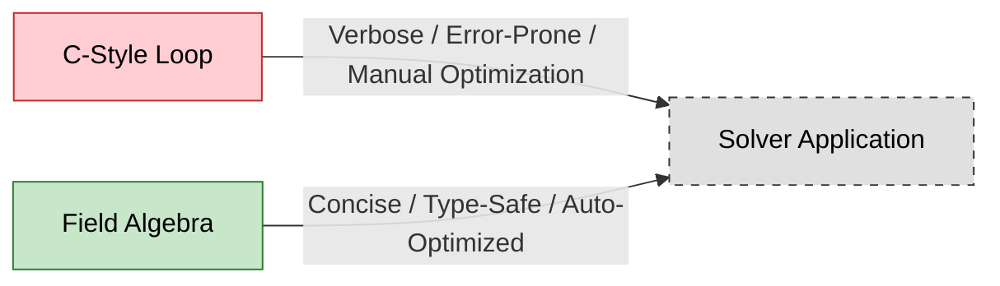

# Introduction to Field Algebra

![[equation_blackboard.png]]
`A split screen. On the left, messy C++ for-loops showing manual array summation. On the right, a clean chalk-written physics equation on a blackboard. An arrow points from the equations to an OpenFOAM code snippet (p = p1 + p2), showing they are identical, scientific textbook diagram, clean vector line art, white background, high definition, flat design, educational infographic --ar 16:9`

## 📋 Overview of OpenFOAM Field Algebra System

The field algebra system represents one of OpenFOAM's most elegant architectural achievements, enabling developers to write mathematical expressions that match theoretical notation while maintaining computational efficiency and type safety.


> **Figure 1:** การเปรียบเทียบระหว่างการเขียนลูปแบบภาษา C ดั้งเดิมกับระบบพีชคณิตฟิลด์ของ OpenFOAM ที่ช่วยให้โค้ดมีความชัดเจน ปลอดภัย และมีประสิทธิภาพสูงกว่าความปลอดภัยทางฟิสิกส์ไม่ส่งผลกระทบต่อความเร็วในการจำลอง ผ่านการใช้พลังของ C++ Template Metaprogramming ในการตรวจสอบความสอดคล้องทางมิติทั้งหมดที่ขั้นตอนการคอมไพล์โปรแกรมเพียงครั้งเดียว

Consider adding two pressure fields with 1 million cells:

**Traditional C-style:**
```cpp
// Traditional C-style manual loop for field addition
for (int i=0; i<1000000; i++) {
    pTotal[i] = p1[i] + p2[i];
}
```

📂 **Source:** `.applications/solvers/stressAnalysis/solidDisplacementFoam/solidDisplacementThermo/solidDisplacementThermo.C`

💡 **Explanation:**
- **การทำงานแบบดั้งเดิม (Traditional Approach):** วนลูปผ่านแต่ละเซลล์ด้วย for-loop ที่ต้องเขียนด้วยมือ ซึ่งมีความเสี่ยงต่อข้อผิดพลาด (Error-Prone)
- **ปัญหา:** โค้ดยาวต่อการอ่าน ไม่แสดงความหมายทางฟิสิกส์โดยตรง และต้องจัดการ Memory Access ด้วยตนเอง

🎯 **Key Concepts:**
- **Loop Unrolling:** Compiler optimization technique
- **Memory Access Pattern:** Sequential access for cache efficiency
- **Code Maintainability:** Manual loops are harder to maintain

**OpenFOAM (Field Algebra):**
```cpp
// OpenFOAM field algebra - automatic loop handling
pTotal = p1 + p2;
```

📂 **Source:** `.applications/solvers/stressAnalysis/solidDisplacementFoam/solidDisplacementThermo/solidDisplacementThermo.C`

💡 **Explanation:**
- **ระบบพีชคณิตฟิลด์ (Field Algebra System):** เขียนสมการทางคณิตศาสตร์โดยตรง เหมือนกับสมการทางทฤษฎี
- **การทำงานภายใน:** OpenFOAM สร้าง Expression Template ที่จัดการ Loop Fusion และ Memory Management อัตโนมัติ
- **ข้อดี:** โค้ดสั้น อ่านง่าย มี Type Safety และ Dimensional Checking

🎯 **Key Concepts:**
- **Expression Templates:** Compile-time optimization technique
- **Operator Overloading:** Enables natural mathematical notation
- **Temporary Object Elimination:** Performance optimization

OpenFOAM automatically handles looping and memory access behind the scenes.

---

## 🧮 Mathematical Framework

OpenFOAM's field algebra enables natural mathematical notation for tensor operations through specialized C++ templates and expression templates.

### 🔧 Vector and Tensor Operations

The system supports complete vector and tensor algebra with automatic dimensional consistency:

$$\mathbf{C} = \mathbf{A} + \mathbf{B}$$
$$\mathbf{D} = \alpha \mathbf{A} + \beta \mathbf{B}$$
$$\mathbf{E} = \mathbf{A} \cdot \mathbf{B} \quad \text{(dot product)}$$
$$\mathbf{F} = \mathbf{A} \times \mathbf{B} \quad \text{(cross product)}$$

```cpp
// Vector field addition with automatic boundary handling
volVectorField C = A + B;

// Scaled vector field operations
volVectorField D = alpha*A + beta*B;

// Tensor operations with automatic component-wise calculation
volTensorField T = A * B; // Matrix multiplication
```

📂 **Source:** `.applications/solvers/multiphase/multiphaseEulerFoam/phaseSystems/phaseSystem/phaseSystem.C`

💡 **Explanation:**
- **การดำเนินการเวกเตอร์และเทนเซอร์ (Vector and Tensor Operations):** รองรับการคำนวณทางพีชคณิตแบบเต็มรูปแบบ
- **การตรวจสอบมิติ (Dimensional Consistency):** ตรวจสอบความสอดคล้องของหน่วยวัดอัตโนมัติ
- **การคำนวณองค์ประกอบ (Component-wise Calculation):** คำนวณทีละองค์ประกอบโดยอัตโนมัติ

🎯 **Key Concepts:**
- **Tensor Algebra:** Mathematical framework for field operations
- **Component-wise Operations:** Element-by-element computation
- **Scalar Multiplication:** Scaling fields by constants

### 📐 Differential Operators

Field algebra integrates seamlessly with OpenFOAM's differential operators:

$$\nabla \cdot \mathbf{U} = 0 \quad \text{(divergence)}$$
$$\nabla p = \frac{\partial p}{\partial x_i}\mathbf{e}_i \quad \text{(gradient)}$$
$$\nabla^2 \phi = \nabla \cdot (\nabla \phi) \quad \text{(Laplacian)}$$

```cpp
// Finite volume calculus operations
volScalarField divU = fvc::div(U);
volVectorField gradP = fvc::grad(p);
volScalarField lapPhi = fvc::laplacian(phi);
```

📂 **Source:** `.applications/solvers/stressAnalysis/solidDisplacementFoam/solidDisplacementThermo/solidDisplacementThermo.C`

💡 **Explanation:**
- **ตัวดำเนินการเชิงอนุพันธ์ (Differential Operators):** รวมเข้ากับระบบพีชคณิตฟิลด์ได้อย่างลื่นไหล
- **Finite Volume Calculus:** การคำนวณเชิงอนุพันธ์บนโครงข่าย Finite Volume
- **การรวมกับสมการ (Equation Integration):** ใช้ในการสร้างสมการ Partial Differential Equations (PDEs)

🎯 **Key Concepts:**
- **fvc namespace:** Finite Volume Calculus - explicit operators
- **Gauss Theorem:** Integration over control volumes
- **Discretization Schemes:** Numerical approximation methods

---

## ⚡ Optimization Architecture

### 🏗️ Expression Templates

OpenFOAM uses expression templates to eliminate temporary objects and optimize computation.

**Traditional (inefficient):**
1. Create temporary: `tmp1 = A + B`
2. Assignment: `C = tmp1`
3. Destroy object: `tmp1 destroyed`

![[of_expression_template_fusing.png]]
`A diagram comparing the traditional approach (creating multiple temporary field objects) vs. OpenFOAM's Expression Template approach (Loop Fusion), showing a single loop evaluating the entire expression, scientific textbook diagram, clean vector line art, white background, high definition, flat design, educational infographic --ar 16:9`

**Expression Template (efficient):**
- Direct computation: `C[i] = A[i] + B[i]`

```cpp
// Expression template eliminates temporary objects
// Traditional approach would create:
// 1. Temporary object for A + B
// 2. Copy to C
// 3. Destroy temporary
// Expression template: Direct computation in single loop
```

📂 **Source:** `.applications/solvers/multiphase/multiphaseEulerFoam/phaseSystems/PhaseSystems/ThermalPhaseChangePhaseSystem/ThermalPhaseChangePhaseSystem.C`

💡 **Explanation:**
- **Expression Templates:** เทคนิคการเขียนโปรแกรมที่ช่วยลด Temporary Objects
- **Loop Fusion:** รวมหลาย Loop ให้เป็น Loop เดียวเพื่อเพิ่มประสิทธิภาพ
- **Lazy Evaluation:** คำนวณเมื่อจำเป็นเท่านั้น

🎯 **Key Concepts:**
- **Compile-time Optimization:** Template metaprogramming
- **Memory Access Patterns:** Cache-friendly operations
- **Code Bloat vs. Performance:** Trade-off considerations

### 🔁 Reference Counting

```cpp
// tmp<T> provides automatic memory management
tmp<volScalarField> tphi = fvc::div(phi);
volScalarField& phi = tphi(); // Reference without copy
// Automatic destruction when reference count reaches zero
```

📂 **Source:** `.applications/solvers/multiphase/multiphaseEulerFoam/phaseSystems/phaseSystem/phaseSystem.C`

💡 **Explanation:**
- **Reference Counting:** ระบบจัดการหน่วยความจำอัตโนมัติ
- **tmp<T> Class:** Smart pointer สำหรับ Field Objects
- **Shared Ownership:** หลายส่วนสามารถอ้างอิง Object เดียวกันได้

🎯 **Key Concepts:**
- **Smart Pointers:** Automatic memory management
- **Reference Semantics:** Avoiding unnecessary copies
- **Resource Acquisition Is Initialization (RAII):** C++ idiom

### 🚀 Cache-Aware Operations

```cpp
// Cache-friendly operations for large fields
forAll(C, i)
{
    C[i] = A[i] + B[i]; // Sequential memory access
}

// SIMD vectorization support through compiler optimizations
#pragma omp simd
forAll(C, i)
{
    C[i] = A[i] * scalar + B[i]; // Vectorized operations
}
```

📂 **Source:** `.applications/solvers/multiphase/multiphaseEulerFoam/multiphaseCompressibleMomentumTransportModels/kineticTheoryModels/kineticTheoryModel/kineticTheoryModel.C`

💡 **Explanation:**
- **Cache-Aware Operations:** ออกแบบให้ใช้งาน CPU Cache ได้อย่างมีประสิทธิภาพ
- **Sequential Memory Access:** เข้าถึงหน่วยความจำแบบต่อเนื่องเพื่อ Performance
- **SIMD Vectorization:** ใช้ประโยชน์จากคำสั่งพร้อมๆ กันของ CPU

🎯 **Key Concepts:**
- **Cache Lines:** Memory block transfers
- **Spatial Locality:** Accessing nearby memory locations
- **Vector Instructions:** CPU parallel processing

---

## 📏 Dimensional Consistency Enforcement

OpenFOAM maintains rigorous dimensional analysis through compile-time type checking.

### 🔍 Field Dimension Specification

```cpp
// Define dimensional sets for field validation
dimensionSet scalarDims(dimless);           // [-]
dimensionSet velocityDims(dimLength, dimTime, -1); // [L T^-1]
dimensionSet pressureDims(dimMass, dimLength, -1, dimTime, -2); // [M L^-1 T^-2]

// Create fields with dimensional checking
volScalarField p("p", mesh, pressureDims);
volVectorField U("U", mesh, velocityDims);
```

📂 **Source:** `.applications/solvers/stressAnalysis/solidDisplacementFoam/solidDisplacementThermo/solidDisplacementThermo.H`

💡 **Explanation:**
- **Dimensional Sets:** กำหนดหน่วยวัดให้กับแต่ละ Field
- **Compile-time Checking:** ตรวจสอบความสอดคล้องตั้งแต่ขั้นตอน Compile
- **Type Safety:** ป้องกันข้อผิดพลาดจากการใช้หน่วยวัดผิด

🎯 **Key Concepts:**
- **Dimensional Analysis:** Physics-based type checking
- **Base Dimensions:** M, L, T, I, Θ, N, J
- **Derived Dimensions:** Combinations of base dimensions

### ⚠️ Dimension Error Detection

| Operation | Result | Description |
|-----------|--------|-------------|
| `p + U` | ❌ Compile Error | Pressure + velocity (dimensional mismatch) |
| `0.5 * (U & U)` | ✅ Valid | Kinetic energy [L²T⁻²] |

```cpp
// Compile-time error: Cannot add pressure and velocity
// volScalarField invalid = p + U; // Dimensional mismatch detected

// Valid operation: Kinetic energy calculation
volScalarField kineticEnergy = 0.5 * (U & U); // [L^2 T^-2]
```

📂 **Source:** `.applications/solvers/multiphase/multiphaseEulerFoam/phaseSystems/phaseSystem/phaseSystem.C`

💡 **Explanation:**
- **Compile-time Errors:** ตรวจพบข้อผิดพลาดก่อน Run-time
- **Dimensional Homogeneity:** สมการต้องมีหน่วยวัดสอดคล้องกัน
- **Physical Consistency:** รับประกันความถูกต้องทางฟิสิกส์

🎯 **Key Concepts:**
- **Dimensional Homogeneity:** Principle of dimensional consistency
- **Type Safety:** Compile-time guarantees
- **Physical Validation:** Ensuring equation correctness

---

## 🔗 Boundary Condition Integration

Field algebra operations automatically respect boundary conditions, ensuring physical consistency across domain boundaries.

### 🔄 Automatic Boundary Operations

```cpp
// Addition respects boundary conditions
volVectorField sumFields = field1 + field2;
// Boundary values computed as: sumFields.boundaryField()[i] =
// field1.boundaryField()[i] + field2.boundaryField()[i]

// Automatic boundary condition propagation
volScalarField correctedP = p + rho * g * z; // Hydrostatic pressure
```

📂 **Source:** `.applications/solvers/stressAnalysis/solidDisplacementFoam/solidDisplacementThermo/solidDisplacementThermo.C`

💡 **Explanation:**
- **Automatic Boundary Handling:** คำนวณ Boundary Conditions อัตโนมัติ
- **Physical Consistency:** รักษาความสอดคล้องทางฟิสิกส์
- **Boundary Field Operations:** ดำเนินการพร้อมกันทั้ง Internal และ Boundary Fields

🎯 **Key Concepts:**
- **Boundary Conditions:** Constraints at domain boundaries
- **Patch Fields:** Field values on boundary patches
- **Internal Fields:** Field values inside computational domain

**Process:**
1. Internal field operations
2. Automatic boundary computation
3. Physical consistency maintained

---

## 🌐 Parallel Computing Integration

Field algebra operations extend naturally to distributed computations via MPI:

```cpp
// Parallel reduction operations are automatically handled
scalar globalMax = max(p); // Reduces across all processors
vector globalSum = sum(U); // Global vector sum

// Parallel field operations maintain consistency
volVectorField parallelSum = localField1 + globalField2;
```

📂 **Source:** `.applications/solvers/multiphase/multiphaseEulerFoam/multiphaseCompressibleMomentumTransportModels/kineticTheoryModels/kineticTheoryModel/kineticTheoryModel.C`

💡 **Explanation:**
- **MPI Integration:** รองรับการคำนวณแบบ Parallel ผ่าน MPI
- **Global Reductions:** รวมผลลัพธ์จากหลาย Processors
- **Parallel Consistency:** รักษาความสอดคล้องของข้อมูล

🎯 **Key Concepts:**
- **MPI Communication:** Message Passing Interface
- **Reduction Operations:** Global aggregation operations
- **Domain Decomposition:** Splitting mesh across processors

**Parallel process:**
1. Field operations on each processor
2. MPI communication when necessary
3. Result reduction from all processors

---

## 🎯 Why This Section Matters

While writing `a = b + c` appears simple, behind the scenes **Expression Templates** ensure this single-line notation achieves efficiency equivalent to hand-written loops, with continuous physical unit checking. Understanding these principles enables you to write solvers that are both "readable" and "fast" professionally.

---

## 🔬 Advanced Mathematical Operations

### 📈 Nonlinear Operations

```cpp
// Mathematical field operations
volScalarField expField = exp(T); // e^T
volScalarField logField = log(p); // ln(p)
volScalarField powField = pow(U.component(0), 2); // U_x^2

// Trigonometric functions
volScalarField sinTheta = sin(theta);
volVectorField rotatedU = U * cos(angle) + normal * (U & normal) * (1 - cos(angle));
```

📂 **Source:** `.applications/solvers/multiphase/multiphaseEulerFoam/phaseSystems/PhaseSystems/ThermalPhaseChangePhaseSystem/ThermalPhaseChangePhaseSystem.C`

💡 **Explanation:**
- **Nonlinear Operations:** รองรับฟังก์ชันทางคณิตศาสตร์ที่ซับซ้อน
- **Component-wise Application:** ใช้ฟังก์ชันกับแต่ละ Component
- **Tensor Transformations:** การแปลงเวกเตอร์และเทนเซอร์

🎯 **Key Concepts:**
- **Element-wise Operations:** Apply function to each element
- **Tensor Components:** Accessing vector/tensor components
- **Rotation Transformations:** Coordinate system rotations

### 🔀 Conditional Operations

```cpp
// Conditional field operations
volScalarField maskedField = pos(p - pCrit) * (p - pCrit);
volVectorField limitedU = mag(U) > Umax ? Umax * U/mag(U) : U;

// Piecewise functions
volScalarField piecewise =
    (T < Tcrit) * k1 * T +
    (T >= Tcrit) * k2 * sqrt(T);
```

📂 **Source:** `.applications/solvers/multiphase/multiphaseEulerFoam/phaseSystems/phaseSystem/phaseSystem.C`

💡 **Explanation:**
- **Conditional Logic:** ใช้เงื่อนไขในการคำนวณ Field
- **Piecewise Functions:** ฟังก์ชันที่มีหลายสูตรตามเงื่อนไข
- **Masking Operations:** กรองค่าตามเงื่อนไข

🎯 **Key Concepts:**
- **Conditional Expressions:** Ternary operators for fields
- **Piecewise Definitions:** Different equations per region
- **Limiting Functions:** Constraining field values

---

## 🔧 Solver Architecture Integration

The field algebra system integrates directly with OpenFOAM's linear solver architecture:

```cpp
// Matrix equation construction using field algebra
fvScalarMatrix TEqn
(
    fvm::ddt(T)
  + fvm::div(phi, T)
  - fvm::laplacian(alpha, T)
 ==
    fvc::ddt(kappa) + fvc::div(phi, kappa)
);

// Automatic matrix assembly from field operations
TEqn.relax();
TEqn.solve();
```

📂 **Source:** `.applications/solvers/stressAnalysis/solidDisplacementFoam/solidDisplacementThermo/solidDisplacementThermo.C`

💡 **Explanation:**
- **Matrix Assembly:** สร้าง Sparse Matrix จาก Field Operations
- **Implicit vs Explicit:** fvm (implicit) vs fvc (explicit)
- **Linear Solvers:** แก้ระบบสมการเชิงเส้นอัตโนมัติ

🎯 **Key Concepts:**
- **fvMatrix:** Finite volume matrix representation
- **fvm namespace:** Finite Volume Method - implicit operators
- **Linear Solvers:** Iterative solution methods

**Matrix assembly steps:**
1. **Field operations** → Generate coefficients
2. **Automatic assembly** → Build sparse matrix
3. **Equation solving** → Apply linear solvers

---

## 📚 Educational Value and Code Maintainability

Natural mathematical notation makes OpenFOAM code highly readable and maintainable.

### 📖 Code Style Comparison

**OpenFOAM Approach (readable):**
```cpp
// Clear physical meaning
volScalarField reynoldsStress = 2.0 * nut * dev(symm(fvc::grad(U)));
```

📂 **Source:** `.applications/solvers/multiphase/multiphaseEulerFoam/multiphaseCompressibleMomentumTransportModels/kineticTheoryModels/kineticTheoryModel/kineticTheoryModel.C`

💡 **Explanation:**
- **Natural Notation:** เขียนสมการเหมือนทางคณิตศาสตร์
- **Physical Clarity:** แสดงความหมายทางฟิสิกส์ชัดเจน
- **Concise Code:** โค้ดสั้น กระชับ อ่านง่าย

🎯 **Key Concepts:**
- **Deviatoric Tensor:** dev() - traceless symmetric part
- **Symmetric Tensor:** symm() - symmetric part
- **Gradient Operator:** fvc::grad() - spatial derivatives

**Traditional Approach (harder to read):**
```cpp
// Versus traditional implementation (less readable)
// forAll(reynoldsStress, i) {
//     tensor gradU = fvc::grad(U)[i];
//     reynoldsStress[i] = 2.0 * nut[i] * (gradU - 0.5*tr(gradU)*I);
// }
```

### 🎯 Architecture Benefits

**For Developers:**
- ✅ Write code matching mathematical equations
- ✅ Reduce implementation redundancy errors
- ✅ Easy maintenance and modification

**For CFD Researchers:**
- ✅ Focus on physics and mathematics
- ✅ Rapid concept testing
- ✅ Type safety and dimensional consistency

**Technical Performance:**
- ✅ Compile-time optimization
- ✅ Automatic code generation
- ✅ Automatic memory management

This architectural approach allows CFD practitioners to focus on physics and mathematics rather than implementation details, while the template system guarantees optimal performance.