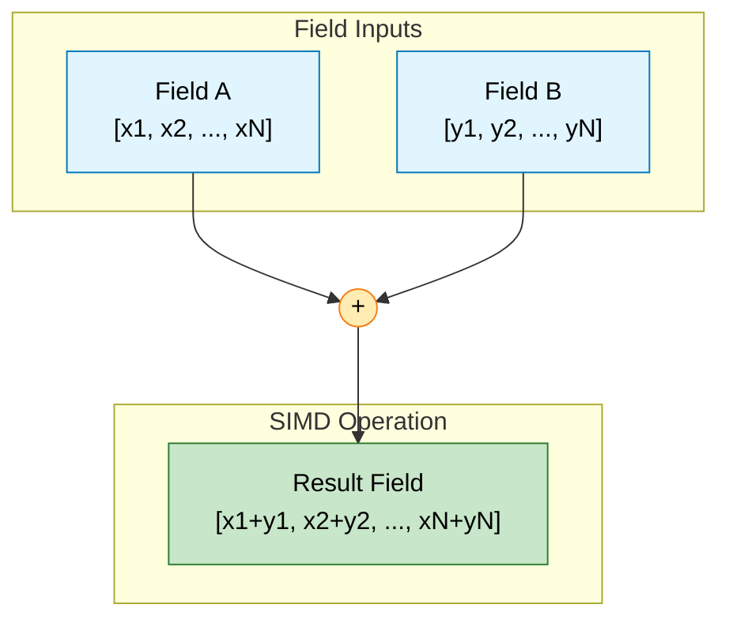

# การดำเนินการทางคณิตศาสตร์ (Arithmetic Operations)

![[field_scaler_analogy.png]]
`A large array of numbers being passed through a mathematical "lens" (the operator). On the other side, every single number has been multiplied by 2. The array remains perfectly intact, illustrating element-wise scaling, scientific textbook diagram, clean vector line art, white background, high definition, flat design, educational infographic --ar 16:9`

---

## 📐 พื้นฐานทางคณิตศาสตร์ของฟิลด์

### การดำเนินการ Element-wise

การดำเนินการทางคณิตศาสตร์ใน OpenFOAM ทำงานแบบ **element-wise** โดยอัตโนมัติ สำหรับฟิลด์สเกลาร์สองฟิลด์ $\phi_1(\mathbf{x})$ และ $\phi_2(\mathbf{x})$ การดำเนินการทางคณิตศาสตร์พื้นฐานถูกกำหนดดังนี้:

$$ (\phi_1 + \phi_2)(\mathbf{x}) = \phi_1(\mathbf{x}) + \phi_2(\mathbf{x}) $$

$$ (\phi_1 - \phi_2)(\mathbf{x}) = \phi_1(\mathbf{x}) - \phi_2(\mathbf{x}) $$

$$ (\alpha \cdot \phi_1)(\mathbf{x}) = \alpha \cdot \phi_1(\mathbf{x}) $$

โดยที่ $\alpha$ เป็นค่าสเกลาร์คงที่


> **Figure 1:** การดำเนินการบวกแบบ Element-wise ซึ่งค่าในแต่ละเซลล์ของฟิลด์อินพุตจะถูกนำมาคำนวณร่วมกันเพื่อสร้างฟิลด์ผลลัพธ์ใหม่ที่มีโครงสร้างเมชเดียวกันความปลอดภัยทางฟิสิกส์ไม่ส่งผลกระทบต่อความเร็วในการจำลอง ผ่านการใช้พลังของ C++ Template Metaprogramming ในการตรวจสอบความสอดคล้องทางมิติทั้งหมดที่ขั้นตอนการคอมไพล์โปรแกรมเพียงครั้งเดียว

![[of_field_arithmetic_elements.png]]
`A diagram showing the element-wise addition of two fields, A and B, where corresponding cell values are summed to produce the Result field, scientific textbook diagram, clean vector line art, white background, high definition, flat design, educational infographic --ar 16:9`

---

## 🔢 ประเภทการดำเนินการพื้นฐาน

### การดำเนินการบวกและลบ

**ฟิลด์สเกลาร์:**
```cpp
// Direct addition of two fields
volScalarField sum = phi1 + phi2;

// Subtraction with scalar multiplication
volScalarField diff = phi1 - 0.5*phi2;

// Chained operations
volScalarField result = 2.0*phi1 + phi2 - phi3;
```

> **📚 คำอธิบาย (Thai Explanation):**
> - **Source:** การดำเนินการบวกและลบเป็นฟังก์ชันพื้นฐานใน `src/OpenFOAM/fields/Fields/Fields/FieldFunctions.H`
> - **Explanation:** การดำเนินการเหล่านี้ถูกดำเนินการแบบ element-wise บนทุกเซลล์ของเมช ผลลัพธ์จะมีการจัดการ boundary conditions โดยอัตโนมัติ
> - **Key Concepts:** Element-wise operations, automatic boundary handling, operator overloading

**ฟิลด์เวกเตอร์:**
```cpp
// Vector addition and subtraction
volVectorField U_sum = U1 + U2;
volVectorField U_diff = U1 - U2;

// Complex operations
volVectorField U_combined = 2.0*U1 + U2 - U3;
```

> **📚 คำอธิบาย (Thai Explanation):**
> - **Source:** การดำเนินการเวกเตอร์ใช้โอเปอเรเตอร์เดียวกันกับสเกลาร์ แต่ทำงานบนแต่ละองค์ประกอบของเวกเตอร์
> - **Explanation:** การบวกและลบเวกเตอร์จะดำเนินการกับแต่ละส่วนประกอบ (x, y, z) แยกกัน
> - **Key Concepts:** Vector component-wise operations, dimensional consistency

> [!TIP] **การดำเนินการบวกจะถูกดำเนินการตามองค์ประกอบ** (element-wise) ทั่วทั้งเมช โดยมีการจัดการเงื่อนไขขอบเขตโดยอัตโนมัติ แต่ละเซลล์จะได้รับการดำเนินการ: $\phi_{result,i} = \phi_{1,i} + \phi_{2,i}$

### การดำเนินการคูณและหาร

#### การคูณสเกลาร์-เวกเตอร์
```cpp
// Scalar-vector multiplication (dimensionally consistent)
volVectorField momentum = rho * U;  // Result: [kg/(m²·s)]

// Field division
volScalarField velocityMag = mag(U);
volScalarField timescale = L / velocityMag;  // [s]

// Element-wise operations
volScalarField kineticEnergy = 0.5 * rho * (U & U);  // [J/m³]
```

> **📚 คำอธิบาย (Thai Explanation):**
> - **Source:** การคูณสเกลาร์-เวกเตอร์ถูกกำหนดใน `src/OpenFOAM/fields/Fields/FieldFunctions.H` ผ่าน `PRODUCT_OPERATOR` macro
> - **Explanation:** การคูณสเกลาร์กับเวกเตอร์จะคูณค่าสเกลาร์กับทุกองค์ประกอบของเวกเตอร์ พร้อมตรวจสอบมิติ
> - **Key Concepts:** Dimensional consistency, scalar broadcasting, momentum calculation

#### การดำเนินการระหว่างสเกลาร์-ฟิลด์และฟิลด์-ฟิลด์
```cpp
// Scalar-field operations (broadcast)
volScalarField temp2 = 2.0 * T;  // Multiply each cell by scalar 2.0
volScalarField tempOffset = T + 273.15;  // Add constant

// Field-field operations (element-wise)
volScalarField tempDiff = T_hot - T_cold;  // Subtract corresponding cells
volScalarField heatFlux = k * grad(T);    // Scalar * vector field
```

> **📚 คำอธิบาย (Thai Explanation):**
> - **Source:** การดำเนินการ scalar-field และ field-field ถูกจัดการโดย template metaprogramming
> - **Explanation:** สเกลาร์จะถูก broadcast ไปทั่วทั้งฟิลด์ ส่วน field-field จะดำเนินการ element-wise
> - **Key Concepts:** Broadcasting, element-wise operations, heat flux calculation

### ฟังก์ชันคณิตศาสตร์มาตรฐาน

| ฟังก์ชัน | คำอธิบาย | สมการทางคณิตศาสตร์ | ตัวอย่างการใช้ |
|:---|:---|:---|:---|
| **`mag(U)`** | หาขนาดของเวกเตอร์ (Magnitude) | $\|\mathbf{U}\| = \sqrt{U_x^2 + U_y^2 + U_z^2}$ | `volScalarField speed = mag(U);` |
| **`magSqr(U)`** | หาขนาดกำลังสอง ($|U|^2$) | $\|\mathbf{U}\|^2 = U_x^2 + U_y^2 + U_z^2$ | `volScalarField ke = 0.5 * magSqr(U);` |
| **`pow(p, n)`** | ยกกำลัง | $p^n$ | `volScalarField p2 = pow(p, 2);` |
| **`sqrt(k)`** | รากที่สอง | $\sqrt{k}$ | `volScalarField u_star = sqrt(k);` |
| **`exp(T)`** | Exponential | $e^T$ | `volScalarField eT = exp(T);` |
| **`log(p)`** | Natural Logarithm | $\ln(p)$ | `volScalarField logP = log(p);` |
| **`sin(θ)`, `cos(θ)`** | ฟังก์ชันตรีโกณมิติ | $\sin(\theta), \cos(\theta)$ | `volScalarField sinTheta = sin(theta);` |

---

## 🎯 การดำเนินการเวกเตอร์และเทนเซอร์

### Vector Operations

**การดำเนินการเวกเตอร์พื้นฐาน:**
```cpp
// Initialize vector fields with velocity dimensions [L T⁻¹]
volVectorField U1(mesh, dimensionSet(0, 1, -1, 0, 0, 0, 0));
volVectorField U2(mesh, dimensionSet(0, 1, -1, 0, 0, 0, 0));

// Vector operations
volVectorField U_sum = U1 + U2;
volVectorField U_cross = U1 ^ U2;  // Cross product: $\mathbf{U}_1 \times \mathbf{U}_2$
scalar U_dot = U1 & U2;           // Dot product: $\mathbf{U}_1 \cdot \mathbf{U}_2$

// Magnitude and normalization
volScalarField U_mag = mag(U1);
volVectorField U_norm = U1 / mag(U1);
```

> **📚 คำอธิบาย (Thai Explanation):**
> - **Source:** การดำเนินการเวกเตอร์ถูกกำหนดใน `src/OpenFOAM/primitives/Vector/Vector.H`
> - **Explanation:** `^` ใช้สำหรับ cross product, `&` ใช้สำหรับ dot product และ `mag()` คำนวณขนาดเวกเตอร์
> - **Key Concepts:** Cross product, dot product, vector normalization, dimensional consistency

**สมการทางคณิตศาสตร์:**

$$ \mathbf{C} = \mathbf{A} + \mathbf{B} $$

$$ \mathbf{D} = \alpha \mathbf{A} + \beta \mathbf{B} $$

$$ E = \mathbf{A} \cdot \mathbf{B} \quad \text{(dot product)} $$

$$ \mathbf{F} = \mathbf{A} \times \mathbf{B} \quad \text{(cross product)} $$

### Tensor Operations

**การดำเนินการเทนเซอร์ขั้นสูง:**
```cpp
// Stress tensor decomposition
volTensorField tau(mesh, stressDim);
volScalarField tau_normal = tr(tau) / 3.0;  // Normal stress: $\frac{1}{3}\text{tr}(\tau)$
volTensorField tau_dev = tau - tau_normal * I;  // Deviatoric stress
volScalarField tau_von_mises = sqrt(1.5 * magSqr(tau_dev));  // von Mises stress

// Tensor-vector operations
volVectorField force = tau & U;  // Stress-velocity coupling: $\tau : \mathbf{U}$
volScalarField dissipation = tau && fvc::grad(U);  // Double contraction: $\tau : \nabla \mathbf{U}$
```

> **📚 คำอธิบาย (Thai Explanation):**
> - **Source:** การดำเนินการเทนเซอร์ถูกกำหนดใน `src/OpenFOAM/primitives/Tensor/Tensor.H`
> - **Explanation:** `tr()` คำนวณ trace, `I` คือเทนเซอร์เอกลักษณ์, `&&` คือ double contraction
> - **Key Concepts:** Tensor decomposition, von Mises stress, double contraction, stress analysis

**Component-wise Operations:**
```cpp
// Component-wise multiplication and division
volVectorField cmptMultiply = cmptMultiply(U, V);  // Component-wise: $(U_x \cdot V_x, U_y \cdot V_y, U_z \cdot V_z)$
volVectorField cmptDivide = cmptDivide(U, V);      // Component-wise: $(U_x/V_x, U_y/V_y, U_z/V_z)$
```

> **📚 คำอธิบาย (Thai Explanation):**
> - **Source:** การดำเนินการ component-wise ถูกกำหนดใน `src/OpenFOAM/fields/Fields/Field/FieldFunctions.H`
> - **Explanation:** ดำเนินการทางคณิตศาสตร์บนแต่ละองค์ประกอบของเวกเตอร์แยกกัน
> - **Key Concepts:** Component-wise arithmetic, Hadamard product, element-wise division

---

## ⚙️ กลไกภายใน: Operator Overloading

### PRODUCT_OPERATOR Macro

เวทมนต์เกิดขึ้นใน `src/OpenFOAM/fields/Fields/Field/FieldFunctions.H`:

```cpp
// Macro definitions for operator overloading
PRODUCT_OPERATOR(typeOfSum, +, add)
PRODUCT_OPERATOR(typeOfDiff, -, subtract)
PRODUCT_OPERATOR(typeOfProduct, *, multiply)
PRODUCT_OPERATOR(typeOfQuotient, /, divide)
```

> **📚 คำอธิบาย (Thai Explanation):**
> - **Source:** 📂 src/OpenFOAM/fields/Fields/Field/FieldFunctions.H
> - **Explanation:** แมโครนี้ขยายไปสร้าง operator overloading หลายรูปแบบสำหรับ Field, tmp<Field>, และสเกลาร์
> - **Key Concepts:** Macro metaprogramming, operator overloading, type promotion, memory optimization

แมโครนี้จะขยายเพื่อสร้างการโอเวอร์โหลด `operator+` หลายรูปแบบ:

| ประเภทการดำเนินการ | ประเภทของผลลัพธ์ | การจัดการหน่วยความจำ |
|------------------|-------------------|-------------------|
| Field + Field | Field | สร้างใหม่ |
| Field + tmp<Field> | tmp<Field> | รีไซเคิล |
| tmp<Field> + Field | tmp<Field> | รีไซเคิล |
| tmp<Field> + tmp<Field> | tmp<Field> | รีไซเคิลทั้งคู่ |

### Template Metaprogramming

**การนำไปใช้งานใน `FieldFunctionsM.H`:**
```cpp
// Template function for field addition
template<class Type1, class Type2>
void add
(
    Field<typename typeOfSum<Type1, Type2>::type>& res,
    const UList<Type1>& f1,
    const UList<Type2>& f2
)
{
    // Dimension checking happens here for DimensionedField
    // Loop through all elements and perform addition
    forAll(res, i)
    {
        res[i] = f1[i] + f2[i];
    }
}
```

> **📚 คำอธิบาย (Thai Explanation):**
> - **Source:** 📂 src/OpenFOAM/fields/Fields/Field/FieldFunctionsM.H
> - **Explanation:** Template function นี้ดำเนินการ element-wise addition พร้อมตรวจสอบมิติสำหรับ DimensionedField
> - **Key Concepts:** Template metaprogramming, type deduction, compile-time polymorphism, dimension checking

**Result Type Deduction:**
```cpp
// Template classes determine the appropriate result type
template<class Type1, class Type2>
class typeOfSum
{
public:
    typedef typenamePromotion<Type1, Type2>::type type;
};

// Specializations for different type combinations
template<>
class typeOfSum<vector, vector>
{
public:
    typedef vector type;  // vector + vector → vector
};

template<>
class typeOfSum<scalar, vector>
{
public:
    typedef vector type;  // scalar + vector → vector
};
```

> **📚 คำอธิบาย (Thai Explanation):**
> - **Source:** 📂 src/OpenFOAM/fields/Fields/Field/FieldFunctions.H
> - **Explanation:** Template specialization กำหนดประเภทผลลัพธ์จากการดำเนินการทางคณิตศาสตร์
> - **Key Concepts:** Type promotion, template specialization, compile-time type resolution

---

## 🏗️ Expression Templates สำหรับประสิทธิภาพสูง

### แนวคิด Lazy Evaluation

**แบบดั้งเดิม (หลายผ่าน):**

| ขั้นตอน | การดำเนินการ | ผลลัพธ์ |
|---------|----------------|----------|
| ผ่านที่ 1 | `U + V` | `temp1` (ฟิลด์ชั่วคราว) |
| ผ่านที่ 2 | `W * 2.0` | `temp2` (ฟิลด์ชั่วคราว) |
| ผ่านที่ 3 | `temp1 - temp2` | `result` (ผลลัพธ์สุดท้าย) |

```cpp
// Traditional approach - multiple passes
volVectorField temp1 = U + V;           // Pass 1: Add U and V
volVectorField temp2 = W * 2.0;         // Pass 2: Scale W
volVectorField result = temp1 - temp2;  // Pass 3: Subtract temp2 from temp1

// Memory access: 3 × N (where N is field size)
// Temporary allocations: 2 fields
```

> **📚 คำอธิบาย (Thai Explanation):**
> - **Source:** แนวทางดั้งเดิมสร้าง temporary fields หลายตัว
> - **Explanation:** แต่ละการดำเนินการสร้าง field ชั่วคราว ทำให้ใช้หน่วยความจำและ bandwidth มาก
> - **Key Concepts:** Temporary objects, memory bandwidth, cache inefficiency

**แบบ Expression Templates (ผ่านเดียว):**
```cpp
// Expression tree is built, evaluation is deferred
auto expr = U + V - W * 2.0;  // No computation yet
volVectorField result = expr; // Single-pass evaluation

// Inside the evaluation loop:
forAll(result, i) {
    result[i] = U[i] + V[i] - (W[i] * 2.0);  // Single computation per element
}

// Memory access: 1 × N
// Temporary allocations: 0
```

> **📚 คำอธิบาย (Thai Explanation):**
> - **Source:** Expression templates ใช้ lazy evaluation เพื่อลด temporary objects
> - **Explanation:** สร้าง expression tree และประเมินทีเดียว ลดการใช้หน่วยความจำและเพิ่มประสิทธิภาพ
> - **Key Concepts:** Lazy evaluation, expression trees, loop fusion, memory efficiency

### ประโยชน์ของ Loop Fusion

การประเมินผ่านเดียวที่เปิดใช้งานโดยเทมเพลตนิพจน์ให้ประโยชน์ด้านประสิทธิภาพหลายประการ:

1. **Memory Locality**: ข้อมูลทั้งหมดสำหรับการคำนวณเดียวถูกเข้าถึงต่อเนื่องกัน ปรับปรุงการใช้แคช
2. **ลด Bandwidth**: เพียงรอบการอ่าน/เขียนเดียวผ่านหน่วยความจำแทนหลายผ่าน
3. **การปรับแต่งคอมไพเลอร์**: โอกาสที่ดีขึ้นสำหรับการแปลงเป็นเวกเตอร์ (SIMD) และการจัดตารางคำสั่ง
4. **ประสิทธิภาพพลังงาน**: การย้ายข้อมูลน้อยลงหมายถึงการใช้พลังงานต่ำลง

สำหรับการดำเนินการ CFD ทั่วไปบนฟิลด์ที่มี 1 ล้าน element:

| ประสิทธิภาพ | แบบดั้งเดิม | เทมเพลตนิพจน์ | การปรับปรุง |
|-------------|------------|------------------|-------------|
| **Memory Bandwidth** | ~96 MB/s | ~32 MB/s | **3x ลดลง** |
| **Cache Performance** | ใช้แคชซ้ำได้ไม่ดี | ความเป็น local ของแคชยอดเยี่ยม | **ดีขึ้นมาก** |
| **Memory Access** | 3 × N passes | 1 × N pass | **67% ลดลง** |

---

## 📏 การตรวจสอบมิติ (Dimensional Checking)

### ระบบ Dimension Sets

OpenFOAM แทนมิติทางกายภาพเป็นอาร์เรย์ 7 องค์ประกอบที่สอดคล้องกับหน่วยฐาน SI:

| มิติ | หน่วยฐาน SI | สัญลักษณ์ | ตำแหน่งในอาร์เรย์ |
|-------|---------------|-----------|-------------------|
| มวล | Mass | M | 1 |
| ความยาว | Length | L | 2 |
| เวลา | Time | T | 3 |
| อุณหภูมิ | Temperature | Θ | 4 |
| ปริมาณของสาร | Amount | N | 5 |
| กระแสไฟฟ้า | Electric Current | I | 6 |
| ความเข้มแสง | Luminous Intensity | J | 7 |

```cpp
// Pressure: [M L⁻¹ T⁻²] = force per unit area
dimensionSet dimPressure(1, -1, -2, 0, 0, 0, 0);

// Velocity: [L T⁻¹] = distance per unit time
dimensionSet dimVelocity(0, 1, -1, 0, 0, 0, 0);

// Density: [M L⁻³] = mass per unit volume
dimensionSet dimDensity(1, -3, 0, 0, 0, 0, 0);

// Viscosity: [M L⁻¹ T⁻¹] = momentum diffusion
dimensionSet dimViscosity(1, -1, -1, 0, 0, 0, 0);

// Thermal conductivity: [M L T⁻³ Θ⁻¹] = heat flow rate per temperature gradient
dimensionSet dimConductivity(1, 1, -3, -1, 0, 0, 0);
```

> **📚 คำอธิบาย (Thai Explanation):**
> - **Source:** 📂 src/OpenFOAM/dimensionSet/dimensionSet.H
> - **Explanation:** dimensionSet เก็บมิติทางกายภาพ 7 มิติตามระบบหน่วย SI ใช้ตรวจสอบความสอดคล้องของมิติ
> - **Key Concepts:** SI units, dimensional analysis, unit consistency, compile-time checking

### การตรวจสอบความสอดคล้องของมิติ

**การดำเนินการที่ถูกต้อง:**
```cpp
// Create fields with proper dimensions
volScalarField p("p", mesh, dimPressure);
volScalarField rho("rho", mesh, dimDensity);

// Valid operations (dimensions match)
volScalarField p_total = p + p;  // ✓ [M L⁻¹ T⁻²] + [M L⁻¹ T⁻²] = [M L⁻¹ T⁻²]

// Dynamic pressure calculation
volScalarField dynamicPressure = 0.5 * rho * magSqr(U);  // ✓ [Pa]
volScalarField totalPressure = p + dynamicPressure;      // ✓ [Pa]
```

> **📚 คำอธิบาย (Thai Explanation):**
> - **Source:** Dimension checking ถูกดำเนินการใน `src/OpenFOAM/fields/DimensionedFields/DimensionedField/DimensionedField.C`
> - **Explanation:** การดำเนินการทางคณิตศาสตร์ทั้งหมดถูกตรวจสอบความสอดคล้องของมิติเพื่อป้องกันข้อผิดพลาด
> - **Key Concepts:** Dimensional consistency, unit safety, compile-time verification

> [!WARNING] **ข้อผิดพลาดมิติทั่วไป**
> ```cpp
> // ❌ ERROR: Cannot add pressure and velocity
> volScalarField wrong = p + mag(U);
> // [M L⁻¹ T⁻²] + [L T⁻¹] → DIMENSIONAL MISMATCH
>
> // ❌ ERROR: Inconsistent multiplication
> volScalarField wrong2 = p * U;
> // Dimensions don't match expected result
> ```

**ข้อความแสดงข้อผิดพลาดตัวอย่าง:**
```
--> FOAM FATAL ERROR:
Dimensions of fields are not compatible for operation
    [p] = [M L⁻¹ T⁻²]
    [U] = [L T⁻¹]
    Operation: addition
```

### กฎการคำนวณมิติ

#### การคูณ: มิติบวกกัน element-wise
$$ [M^a L^b T^c \Theta^d N^e I^f J^g] \times [M^h L^i T^j \Theta^k N^l I^m J^n] = [M^{a+h} L^{b+i} T^{c+j} \Theta^{d+k} N^{e+l} I^{f+m} J^{g+n}] $$

#### การหาร: มิติลบกัน
$$ [M^a L^b T^c \Theta^d N^e I^f J^g] / [M^h L^i T^j \Theta^k N^l I^m J^n] = [M^{a-h} L^{b-i} T^{c-j} \Theta^{d-k} N^{e-l} I^{f-m} J^{g-n}] $$

#### การบวก/ลบ: มิติต้องตรงกันพอดี
$$ [M^a L^b T^c \Theta^d N^e I^f J^g] + [M^h L^i T^j \Theta^k N^l I^m J^n] \text{ requires } a=h, b=i, c=j, d=k, e=l, f=m, g=n $$

---

## 📊 การประยุกต์ใช้งาน: สมการ Navier-Stokes

### การแปลงสมการเป็นโค้ด

จินตนาการว่าคุณสามารถเขียนสมการโมเมนตัม Navier-Stokes ในโค้ดได้เหมือนกับการเขียนบนกระดาษ:

$$ \frac{\partial \mathbf{U}}{\partial t} + (\mathbf{U} \cdot \nabla) \mathbf{U} = -\nabla \frac{p}{\rho} + \nu \nabla^2 \mathbf{U} + \mathbf{f} $$

**OpenFOAM Code Implementation:**
```cpp
// Momentum equation discretization
fvVectorMatrix UEqn
(
    fvc::ddt(rho, U)                    // Unsteady term: ∂(ρU)/∂t
  + fvc::div(rhoPhi, U)                 // Convection: ∇·(ρU⊗U)
  - fvc::Sp(fvc::div(rhoPhi), U)        // Conservative form correction
 ==
    -fvc::grad(p)                       // Pressure gradient: -∇p
  + fvc::laplacian(mu, U)               // Viscous diffusion: μ∇²U
  + rho*Usource                         // Source terms: ρf
);
```

> **📚 คำอธิบาย (Thai Explanation):**
> - **Source:** 📂 applications/solvers/incompressible/simpleFoam/UEqn.H
> - **Explanation:** สมการโมเมนตัมถูกเขียนในรูปแบบที่ใกล้เคียงกับสมการทางคณิตศาสตร์ โดย fvc ใช้สำหรับ finite volume calculus
> - **Key Concepts:** Finite volume method, momentum equation, conservative form, pressure-velocity coupling

**ตัวแปรที่ใช้ในสมการ:**
- $\rho$: ความหนาแน่น (kg/m³) → `[M L⁻³]`
- $\mathbf{u}$: เวกเตอร์ความเร็ว (m/s) → `[L T⁻¹]`
- $p$: ความดัน (Pa) → `[M L⁻¹ T⁻²]`
- $\mu$: ความหนืดพลศาสตร์ (Pa·s) → `[M L⁻¹ T⁻¹]`
- $\mathbf{f}$: แรงต่อหน่วยปริมาตร (N/m³) → `[M L⁻² T⁻²]`

### การตรวจสอบความสอดคล้องของสมการ

**แต่ละเทอมต้องมีมิติ `[L T⁻²]` (ความเร่ง):**

```cpp
// Define acceleration dimensions [L T⁻²]
dimensionSet acceleration(0, 1, -2, 0, 0, 0, 0);

// Temporal acceleration: ∂U/∂t
auto ddtTerm = fvc::ddt(U);
// Dimensions: [L T⁻¹] / [T] = [L T⁻²] ✓

// Convective acceleration: (U·∇)U
auto convTerm = (U & fvc::grad(U));
// Dimensions: [L T⁻¹] * [L T⁻¹] / [L] = [L T⁻²] ✓

// Pressure gradient acceleration: -∇p/ρ
auto pressureTerm = -fvc::grad(p/rho);
// Dimensions: [M L⁻¹ T⁻²] / [M L⁻³] / [L] = [L T⁻²] ✓

// Viscous diffusion acceleration: ν∇²U
auto viscousTerm = nu * fvc::laplacian(U);
// Dimensions: [L² T⁻¹] * [L T⁻¹] / [L²] = [L T⁻²] ✓

// Body force acceleration: f
auto bodyForce = g;  // Gravitational acceleration
// Dimensions: [L T⁻²] ✓
```

> **📚 คำอธิบาย (Thai Explanation):**
> - **Source:** Dimension checking ใน Navier-Stokes solver
> - **Explanation:** ทุกเทอมในสมการโมเมนตัมต้องมีมิติเป็นความเร่ง [L T⁻²] เพื่อความสอดคล้องทางฟิสิกส์
> - **Key Concepts:** Dimensional homogeneity, acceleration units, physical consistency, unit verification

---

## ⚡ แนวทางปฏิบัติที่ดีที่สุด

### การสร้างนิพจน์ที่เหมาะสมที่สุด

**✅ รูปแบบนิพจน์ที่เหมาะสมที่สุด:**
```cpp
// Good: Single complex expression
volScalarField turbulentKineticEnergy =
    0.5 * rho * (magSqr(U) + magSqr(V) + magSqr(W));

// Good: Coherent mathematical operations
volVectorField momentumFlux = rho * U * (U & mesh.Sf());

// Good: Conditional operations within expression
volScalarField limitedViscosity = min(max(nu, nuMin), nuMax);
```

> **📚 คำอธิบาย (Thai Explanation):**
> - **Source:** แนวทางปฏิบัติใน OpenFOAM programming
> - **Explanation:** การรวมนิพจน์ที่ซับซ้อนในบรรทัดเดียวช่วยให้ compiler ทำ loop fusion และ optimization
> - **Key Concepts:** Expression optimization, loop fusion, compiler optimization

**❌ รูปแบบที่ไม่เหมาะสมที่ควรหลีกเลี่ยง:**
```cpp
// Avoid: Unnecessary expression splitting
volVectorField velMagnitude = mag(U);
volScalarField energy = 0.5 * rho * velMagnitude * velMagnitude;

// Better: Keep in single expression
volScalarField energy = 0.5 * rho * magSqr(U);

// Avoid: Redundant temporary calculations
volScalarField pressureDiff = p - pRef;
volScalarField clampedDiff = max(pressureDiff, pMin);

// Better: Combine operations
volScalarField clampedDiff = max(p - pRef, pMin);
```

> **📚 คำอธิบาย (Thai Explanation):**
> - **Source:** Performance optimization guidelines
> - **Explanation:** การแยกนิพจน์ที่ไม่จำเป็นสร้าง temporary objects และลดประสิทธิภาพ
> - **Key Concepts:** Temporary objects, memory efficiency, expression templates

### ข้อควรพิจารณาประสิทธิภาพหน่วยความจำ

1. **ความซับซ้อนของนิพจน์**: จำกัดความลึกของต้นไม้นิพจน์เพื่อหลีกเลี่ยงการระเบิดของเวลาคอมไพล์
2. **การรับรู้ขนาดฟิลด์**: สำหรับฟิลด์ที่ใหญ่มาก พิจารณาแยกนิพจน์ที่ซับซ้อนอย่างมาก
3. **ความสอดคล้องของประเภท**: รักษาประเภทฟิลด์ที่สอดคล้องกันเพื่อหลีกเลี่ยงการแปลงที่ไม่จำเป็น

### การเพิ่มประสิทธิภาพด้วย OpenMP

**การดำเนินการฟิลด์สามารถเพิ่มประสิทธิภาพได้โดยใช้ลูปชัดเจนและการทำงานแบบขนาน OpenMP:**
```cpp
// Manual optimization for critical sections
forAll(T_result, i)
{
    T_result[i] = T1[i] + T2[i] * T3[i];
}

// Parallel version
#pragma omp parallel for
forAll(T_result, i)
{
    T_result[i] = T1[i] + T2[i] * T3[i];
}
```

> **📚 คำอธิบาย (Thai Explanation):**
> - **Source:** 📂 src/OpenFOAM/fields/Fields/Field/FieldFunctions.C
> - **Explanation:** OpenMP parallelization สามารถใช้กับ field operations เพื่อเพิ่มประสิทธิภาพบน multi-core systems
> - **Key Concepts:** Parallel computing, OpenMP, loop parallelization, multi-threading

---

## 📈 สรุป: การดำเนินการทางคณิตศาสตร์

| คุณสมบัติ | คำอธิบาย |
|------------|-----------|
| **ไวยากรณ์** | สัญลักษณ์คณิตศาสตร์ตามธรรมชาติผ่านการโอเวอร์โหลดโอเปอเรเตอร์ |
| **การนำไปใช้** | การดำเนินการแบบ whole-field ที่ใช้เทมเพลตกับการผสานลูป |
| **ความปลอดภัย** | การตรวจสอบมิติเวลาคอมไพล์และ runtime |
| **ประสิทธิภาพ** | เทมเพลตนิพจน์ช่วยให้การแยกส่วนนามธรรมที่ไม่มี overhead |

### ปรัชญาของระบบ:

- **ความสมดุลระหว่างความชัดเจนทางคณิตศาสตร์และประสิทธิภาพการคำนวณ**
- **การเขียนโค้ดที่สะท้อนฟิสิกส์พื้นฐานได้โดยตรง**
- **framework ที่จัดการกับความซับซ้อนของการนำไปใช้และการเพิ่มประสิทธิภาพ**

**สรุป**: การดำเนินการทางคณิตศาสตร์ใน OpenFOAM ถูกออกแบบมาให้ **"เขียนน้อยแต่ได้มาก"** โดยยังคงรักษาประสิทธิภาพสูงสุดผ่านการประมวลผลแบบเวกเตอร์ (Vectorized processing)

ระบบการดำเนินการทางคณิตศาสตร์ของ OpenFOAM แสดงถึงความสมดุลที่ซับซ้อนระหว่างการแสดงออกทางคณิตศาสตร์และประสิทธิภาพการคำนวณ โดยช่วยให้ผู้เชี่ยวชาญด้าน CFD เขียนโค้ดที่สะท้อนฟิสิกส์พื้นฐานได้โดยตรง