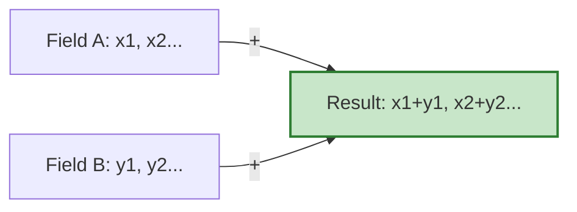

# การดำเนินการทางคณิตศาสตร์ (Arithmetic Operations)

![[field_scaler_analogy.png]]
`A large array of numbers being passed through a mathematical "lens" (the operator). On the other side, every single number has been multiplied by 2. The array remains perfectly intact, illustrating element-wise scaling, scientific textbook diagram, clean vector line art, white background, high definition, flat design, educational infographic --ar 16:9`

---

## 📐 พื้นฐานทางคณิตศาสตร์ของฟิลด์

### การดำเนินการ Element-wise

การดำเนินการทางคณิตศาสตร์ใน OpenFOAM ทำงานแบบ **element-wise** โดยอัตโนมัติ สำหรับฟิลด์สเกลาร์สองฟิลด์ $\phi_1(\mathbf{x})$ และ $\phi_2(\mathbf{x})$ การดำเนินการทางคณิตศาสตร์พื้นฐานถูกกำหนดดังนี้:

$$ (\phi_1 + \phi_2)(\mathbf{x}) = \phi_1(\mathbf{x}) + \phi_2(\mathbf{x}) $$

$$ (\phi_1 - \phi_2)(\mathbf{x}) = \phi_1(\mathbf{x}) - \phi_2(\mathbf{x}) $$

$$ (\alpha \cdot \phi_1)(\mathbf{x}) = \alpha \cdot \phi_1(\mathbf{x}) $$

โดยที่ $\alpha$ เป็นค่าสเกลาร์คงที่


> **Figure 1:** การดำเนินการบวกแบบ Element-wise ซึ่งค่าในแต่ละเซลล์ของฟิลด์อินพุตจะถูกนำมาคำนวณร่วมกันเพื่อสร้างฟิลด์ผลลัพธ์ใหม่ที่มีโครงสร้างเมชเดียวกันความปลอดภัยทางฟิสิกส์ไม่ส่งผลกระทบต่อความเร็วในการจำลอง ผ่านการใช้พลังของ C++ Template Metaprogramming ในการตรวจสอบความสอดคล้องทางมิติทั้งหมดที่ขั้นตอนการคอมไพล์โปรแกรมเพียงครั้งเดียว

![[of_field_arithmetic_elements.png]]
`A diagram showing the element-wise addition of two fields, A and B, where corresponding cell values are summed to produce the Result field, scientific textbook diagram, clean vector line art, white background, high definition, flat design, educational infographic --ar 16:9`

---

## 🔢 ประเภทการดำเนินการพื้นฐาน

### การดำเนินการบวกและลบ

**ฟิลด์สเกลาร์:**
```cpp
// การบวกฟิลด์สองฟิลด์โดยตรง
volScalarField sum = phi1 + phi2;

// การลบฟิลด์พร้อมการคูณสเกลาร์
volScalarField diff = phi1 - 0.5*phi2;

// การดำเนินการต่อเนื่อง
volScalarField result = 2.0*phi1 + phi2 - phi3;
```

**ฟิลด์เวกเตอร์:**
```cpp
// การบวกและลบเวกเตอร์
volVectorField U_sum = U1 + U2;
volVectorField U_diff = U1 - U2;

// การดำเนินการที่ซับซ้อน
volVectorField U_combined = 2.0*U1 + U2 - U3;
```

> [!TIP] **การดำเนินการบวกจะถูกดำเนินการตามองค์ประกอบ** (element-wise) ทั่วทั้งเมช โดยมีการจัดการเงื่อนไขขอบเขตโดยอัตโนมัติ แต่ละเซลล์จะได้รับการดำเนินการ: $\phi_{result,i} = \phi_{1,i} + \phi_{2,i}$

### การดำเนินการคูณและหาร

#### การคูณสเกลาร์-เวกเตอร์
```cpp
// การคูณสเกลาร์-เวกเตอร์ (สอดคล้องกับมิติ)
volVectorField momentum = rho * U;  // ผลลัพธ์: [kg/(m²·s)]

// การหารฟิลด์
volScalarField velocityMag = mag(U);
volScalarField timescale = L / velocityMag;  // [s]

// การดำเนินการตามองค์ประกอบ
volScalarField kineticEnergy = 0.5 * rho * (U & U);  // [J/m³]
```

#### การดำเนินการระหว่างสเกลาร์-ฟิลด์และฟิลด์-ฟิลด์
```cpp
// การดำเนินการสเกลาร์-ฟิลด์ (broadcast)
volScalarField temp2 = 2.0 * T;  // คูณแต่ละเซลล์ด้วยสเกลาร์ 2.0
volScalarField tempOffset = T + 273.15;  // เพิ่มค่าคงที่

// การดำเนินการฟิลด์-ฟิลด์ (element-wise)
volScalarField tempDiff = T_hot - T_cold;  // ลบเซลล์ที่สอดคล้องกัน
volScalarField heatFlux = k * grad(T);    // สเกลาร์ * ฟิลด์เวกเตอร์
```

### ฟังก์ชันคณิตศาสตร์มาตรฐาน

| ฟังก์ชัน | คำอธิบาย | สมการทางคณิตศาสตร์ | ตัวอย่างการใช้ |
|:---|:---|:---|:---|
| **`mag(U)`** | หาขนาดของเวกเตอร์ (Magnitude) | $\|\mathbf{U}\| = \sqrt{U_x^2 + U_y^2 + U_z^2}$ | `volScalarField speed = mag(U);` |
| **`magSqr(U)`** | หาขนาดกำลังสอง ($|U|^2$) | $\|\mathbf{U}\|^2 = U_x^2 + U_y^2 + U_z^2$ | `volScalarField ke = 0.5 * magSqr(U);` |
| **`pow(p, n)`** | ยกกำลัง | $p^n$ | `volScalarField p2 = pow(p, 2);` |
| **`sqrt(k)`** | รากที่สอง | $\sqrt{k}$ | `volScalarField u_star = sqrt(k);` |
| **`exp(T)`** | Exponential | $e^T$ | `volScalarField eT = exp(T);` |
| **`log(p)`** | Natural Logarithm | $\ln(p)$ | `volScalarField logP = log(p);` |
| **`sin(θ)`, `cos(θ)`** | ฟังก์ชันตรีโกณมิติ | $\sin(\theta), \cos(\theta)$ | `volScalarField sinTheta = sin(theta);` |

---

## 🎯 การดำเนินการเวกเตอร์และเทนเซอร์

### Vector Operations

**การดำเนินการเวกเตอร์พื้นฐาน:**
```cpp
volVectorField U1(mesh, dimensionSet(0, 1, -1, 0, 0, 0, 0)); // ความเร็ว
volVectorField U2(mesh, dimensionSet(0, 1, -1, 0, 0, 0, 0)); // ความเร็ว

// การดำเนินการเวกเตอร์
volVectorField U_sum = U1 + U2;
volVectorField U_cross = U1 ^ U2;  // ผลคูณไขว้: $\mathbf{U}_1 \times \mathbf{U}_2$
scalar U_dot = U1 & U2;           // ผลคูณจุด: $\mathbf{U}_1 \cdot \mathbf{U}_2$

// ขนาดและการทำให้เป็นมาตรฐาน
volScalarField U_mag = mag(U1);
volVectorField U_norm = U1 / mag(U1);
```

**สมการทางคณิตศาสตร์:**

$$ \mathbf{C} = \mathbf{A} + \mathbf{B} $$

$$ \mathbf{D} = \alpha \mathbf{A} + \beta \mathbf{B} $$

$$ E = \mathbf{A} \cdot \mathbf{B} \quad \text{(dot product)} $$

$$ \mathbf{F} = \mathbf{A} \times \mathbf{B} \quad \text{(cross product)} $$

### Tensor Operations

**การดำเนินการเทนเซอร์ขั้นสูง:**
```cpp
// การแยกเทนเซอร์ความเครียง
volTensorField tau(mesh, stressDim);
volScalarField tau_normal = tr(tau) / 3.0;  // ความเครียงปกติ: $\frac{1}{3}\text{tr}(\tau)$
volTensorField tau_dev = tau - tau_normal * I;  // ความเครียงเบี่ยงเบน
volScalarField tau_von_mises = sqrt(1.5 * magSqr(tau_dev));  // ความเครียง von Mises

// การดำเนินการเทนเซอร์-เวกเตอร์
volVectorField force = tau & U;  // การเชื่อมโยงความเครียง-ความเร็ว: $\tau : \mathbf{U}$
volScalarField dissipation = tau && fvc::grad(U);  // Double contraction: $\tau : \nabla \mathbf{U}$
```

**Component-wise Operations:**
```cpp
// Component-wise multiplication and division
volVectorField cmptMultiply = cmptMultiply(U, V);  // Component-wise: $(U_x \cdot V_x, U_y \cdot V_y, U_z \cdot V_z)$
volVectorField cmptDivide = cmptDivide(U, V);      // Component-wise: $(U_x/V_x, U_y/V_y, U_z/V_z)$
```

---

## ⚙️ กลไกภายใน: Operator Overloading

### PRODUCT_OPERATOR Macro

เวทมนต์เกิดขึ้นใน `src/OpenFOAM/fields/Fields/Field/FieldFunctions.H`:

```cpp
PRODUCT_OPERATOR(typeOfSum, +, add)
PRODUCT_OPERATOR(typeOfDiff, -, subtract)
PRODUCT_OPERATOR(typeOfProduct, *, multiply)
PRODUCT_OPERATOR(typeOfQuotient, /, divide)
```

แมโครนี้จะขยายเพื่อสร้างการโอเวอร์โหลด `operator+` หลายรูปแบบ:

| ประเภทการดำเนินการ | ประเภทของผลลัพธ์ | การจัดการหน่วยความจำ |
|------------------|-------------------|-------------------|
| Field + Field | Field | สร้างใหม่ |
| Field + tmp<Field> | tmp<Field> | รีไซเคิล |
| tmp<Field> + Field | tmp<Field> | รีไซเคิล |
| tmp<Field> + tmp<Field> | tmp<Field> | รีไซเคิลทั้งคู่ |

### Template Metaprogramming

**การนำไปใช้งานใน `FieldFunctionsM.H`:**
```cpp
template<class Type1, class Type2>
void add
(
    Field<typename typeOfSum<Type1, Type2>::type>& res,
    const UList<Type1>& f1,
    const UList<Type2>& f2
)
{
    // Dimension checking happens here for DimensionedField
    forAll(res, i)
    {
        res[i] = f1[i] + f2[i];
    }
}
```

**Result Type Deduction:**
```cpp
// Template classes determine the appropriate result type
template<class Type1, class Type2>
class typeOfSum
{
public:
    typedef typenamePromotion<Type1, Type2>::type type;
};

// Specializations for different type combinations
template<>
class typeOfSum<vector, vector>
{
public:
    typedef vector type;  // vector + vector → vector
};

template<>
class typeOfSum<scalar, vector>
{
public:
    typedef vector type;  // scalar + vector → vector
};
```

---

## 🏗️ Expression Templates สำหรับประสิทธิภาพสูง

### แนวคิด Lazy Evaluation

**แบบดั้งเดิม (หลายผ่าน):**

| ขั้นตอน | การดำเนินการ | ผลลัพธ์ |
|---------|----------------|----------|
| ผ่านที่ 1 | `U + V` | `temp1` (ฟิลด์ชั่วคราว) |
| ผ่านที่ 2 | `W * 2.0` | `temp2` (ฟิลด์ชั่วคราว) |
| ผ่านที่ 3 | `temp1 - temp2` | `result` (ผลลัพธ์สุดท้าย) |

```cpp
volVectorField temp1 = U + V;           // ผ่าน 1: บวก U และ V
volVectorField temp2 = W * 2.0;         // ผ่าน 2: ปรับขนาด W
volVectorField result = temp1 - temp2;  // ผ่าน 3: ลบ temp2 จาก temp1

// การเข้าถึงหน่วยความจำ: 3 × N (โดยที่ N คือขนาดฟิลด์)
// การจัดสรรชั่วคราว: 2 ฟิลด์
```

**แบบ Expression Templates (ผ่านเดียว):**
```cpp
// ต้นไม้นิพจน์ถูกสร้างขึ้น การประเมินถูกเลื่อนออกไป
auto expr = U + V - W * 2.0;  // ยังไม่มีการคำนวณ
volVectorField result = expr; // การประเมินผ่านเดียว

// ภายในลูปการประเมิน:
forAll(result, i) {
    result[i] = U[i] + V[i] - (W[i] * 2.0);  // การคำนวณหนึ่งครั้งต่อ element
}

// การเข้าถึงหน่วยความจำ: 1 × N
// การจัดสรรชั่วคราว: 0
```

### ประโยชน์ของ Loop Fusion

การประเมินผ่านเดียวที่เปิดใช้งานโดยเทมเพลตนิพจน์ให้ประโยชน์ด้านประสิทธิภาพหลายประการ:

1. **Memory Locality**: ข้อมูลทั้งหมดสำหรับการคำนวณเดียวถูกเข้าถึงต่อเนื่องกัน ปรับปรุงการใช้แคช
2. **ลด Bandwidth**: เพียงรอบการอ่าน/เขียนเดียวผ่านหน่วยความจำแทนหลายผ่าน
3. **การปรับแต่งคอมไพเลอร์**: โอกาสที่ดีขึ้นสำหรับการแปลงเป็นเวกเตอร์ (SIMD) และการจัดตารางคำสั่ง
4. **ประสิทธิภาพพลังงาน**: การย้ายข้อมูลน้อยลงหมายถึงการใช้พลังงานต่ำลง

สำหรับการดำเนินการ CFD ทั่วไปบนฟิลด์ที่มี 1 ล้าน element:

| ประสิทธิภาพ | แบบดั้งเดิม | เทมเพลตนิพจน์ | การปรับปรุง |
|-------------|------------|------------------|-------------|
| **Memory Bandwidth** | ~96 MB/s | ~32 MB/s | **3x ลดลง** |
| **Cache Performance** | ใช้แคชซ้ำได้ไม่ดี | ความเป็น local ของแคชยอดเยี่ยม | **ดีขึ้นมาก** |
| **Memory Access** | 3 × N passes | 1 × N pass | **67% ลดลง** |

---

## 📏 การตรวจสอบมิติ (Dimensional Checking)

### ระบบ Dimension Sets

OpenFOAM แทนมิติทางกายภาพเป็นอาร์เรย์ 7 องค์ประกอบที่สอดคล้องกับหน่วยฐาน SI:

| มิติ | หน่วยฐาน SI | สัญลักษณ์ | ตำแหน่งในอาร์เรย์ |
|-------|---------------|-----------|-------------------|
| มวล | Mass | M | 1 |
| ความยาว | Length | L | 2 |
| เวลา | Time | T | 3 |
| อุณหภูมิ | Temperature | Θ | 4 |
| ปริมาณของสาร | Amount | N | 5 |
| กระแสไฟฟ้า | Electric Current | I | 6 |
| ความเข้มแสง | Luminous Intensity | J | 7 |

```cpp
// ความดัน: [M L⁻¹ T⁻²] = แรงต่อหน่วยพื้นที่
dimensionSet dimPressure(1, -1, -2, 0, 0, 0, 0);

// ความเร็ว: [L T⁻¹] = ระยะทางต่อหน่วยเวลา
dimensionSet dimVelocity(0, 1, -1, 0, 0, 0, 0);

// ความหนาแน่น: [M L⁻³] = มวลต่อหน่วยปริมาตร
dimensionSet dimDensity(1, -3, 0, 0, 0, 0, 0);

// ความหนืด: [M L⁻¹ T⁻¹] = diffusion ของโมเมนตัม
dimensionSet dimViscosity(1, -1, -1, 0, 0, 0, 0);

// ความนำความร้อน: [M L T⁻³ Θ⁻¹] = อัตราการไหลของความร้อนต่อ gradient ของอุณหภูมิ
dimensionSet dimConductivity(1, 1, -3, -1, 0, 0, 0);
```

### การตรวจสอบความสอดคล้องของมิติ

**การดำเนินการที่ถูกต้อง:**
```cpp
volScalarField p("p", mesh, dimPressure);
volScalarField rho("rho", mesh, dimDensity);

// การดำเนินการที่ถูกต้อง (มิติตรงกัน)
volScalarField p_total = p + p;  // ✓ [M L⁻¹ T⁻²] + [M L⁻¹ T⁻²] = [M L⁻¹ T⁻²]

volScalarField dynamicPressure = 0.5 * rho * magSqr(U);  // ✓ [Pa]
volScalarField totalPressure = p + dynamicPressure;      // ✓ [Pa]
```

> [!WARNING] **ข้อผิดพลาดมิติทั่วไป**
> ```cpp
> // ❌ ERROR: ไม่สามารถบวกความดันกับความเร็วได้
> volScalarField wrong = p + mag(U);
> // [M L⁻¹ T⁻²] + [L T⁻¹] → DIMENSIONAL MISMATCH
>
> // ❌ ERROR: การคูณที่ไม่สอดคล้องกัน
> volScalarField wrong2 = p * U;
> // มิติไม่ตรงกับที่คาดหวัง
> ```

**ข้อความแสดงข้อผิดพลาดตัวอย่าง:**
```
--> FOAM FATAL ERROR:
Dimensions of fields are not compatible for operation
    [p] = [M L⁻¹ T⁻²]
    [U] = [L T⁻¹]
    Operation: addition
```

### กฎการคำนวณมิติ

#### การคูณ: มิติบวกกัน element-wise
$$ [M^a L^b T^c \Theta^d N^e I^f J^g] \times [M^h L^i T^j \Theta^k N^l I^m J^n] = [M^{a+h} L^{b+i} T^{c+j} \Theta^{d+k} N^{e+l} I^{f+m} J^{g+n}] $$

#### การหาร: มิติลบกัน
$$ [M^a L^b T^c \Theta^d N^e I^f J^g] / [M^h L^i T^j \Theta^k N^l I^m J^n] = [M^{a-h} L^{b-i} T^{c-j} \Theta^{d-k} N^{e-l} I^{f-m} J^{g-n}] $$

#### การบวก/ลบ: มิติต้องตรงกันพอดี
$$ [M^a L^b T^c \Theta^d N^e I^f J^g] + [M^h L^i T^j \Theta^k N^l I^m J^n] \text{ requires } a=h, b=i, c=j, d=k, e=l, f=m, g=n $$

---

## 📊 การประยุกต์ใช้งาน: สมการ Navier-Stokes

### การแปลงสมการเป็นโค้ด

จินตนาการว่าคุณสามารถเขียนสมการโมเมนตัม Navier-Stokes ในโค้ดได้เหมือนกับการเขียนบนกระดาษ:

$$ \frac{\partial \mathbf{U}}{\partial t} + (\mathbf{U} \cdot \nabla) \mathbf{U} = -\nabla \frac{p}{\rho} + \nu \nabla^2 \mathbf{U} + \mathbf{f} $$

**OpenFOAM Code Implementation:**
```cpp
fvVectorMatrix UEqn
(
    fvc::ddt(rho, U)
  + fvc::div(rhoPhi, U)
  - fvc::Sp(fvc::div(rhoPhi), U)
 ==
    -fvc::grad(p)
  + fvc::laplacian(mu, U)
  + rho*Usource
);
```

**ตัวแปรที่ใช้ในสมการ:**
- $\rho$: ความหนาแน่น (kg/m³) → `[M L⁻³]`
- $\mathbf{u}$: เวกเตอร์ความเร็ว (m/s) → `[L T⁻¹]`
- $p$: ความดัน (Pa) → `[M L⁻¹ T⁻²]`
- $\mu$: ความหนืดพลศาสตร์ (Pa·s) → `[M L⁻¹ T⁻¹]`
- $\mathbf{f}$: แรงต่อหน่วยปริมาตร (N/m³) → `[M L⁻² T⁻²]`

### การตรวจสอบความสอดคล้องของสมการ

**แต่ละเทอมต้องมีมิติ `[L T⁻²]` (ความเร่ง):**

```cpp
dimensionSet acceleration(0, 1, -2, 0, 0, 0, 0);

// ความเร่งเชิงเวลา: ∂U/∂t
auto ddtTerm = fvc::ddt(U);
// มิติ: [L T⁻¹] / [T] = [L T⁻²] ✓

// ความเร่งเชิง convective: (U·∇)U
auto convTerm = (U & fvc::grad(U));
// มิติ: [L T⁻¹] * [L T⁻¹] / [L] = [L T⁻²] ✓

// ความเร่ง gradient ความดัน: -∇p/ρ
auto pressureTerm = -fvc::grad(p/rho);
// มิติ: [M L⁻¹ T⁻²] / [M L⁻³] / [L] = [L T⁻²] ✓

// ความเร่งการ diffusive ความหนืด: ν∇²U
auto viscousTerm = nu * fvc::laplacian(U);
// มิติ: [L² T⁻¹] * [L T⁻¹] / [L²] = [L T⁻²] ✓

// ความเร่งแรงลำตัว: f
auto bodyForce = g;  // ความเร่งโน้มถ่วง
// มิติ: [L T⁻²] ✓
```

---

## ⚡ แนวทางปฏิบัติที่ดีที่สุด

### การสร้างนิพจน์ที่เหมาะสมที่สุด

**✅ รูปแบบนิพจน์ที่เหมาะสมที่สุด:**
```cpp
// ดี: นิพจน์ที่ซับซ้อนเดียว
volScalarField turbulentKineticEnergy =
    0.5 * rho * (magSqr(U) + magSqr(V) + magSqr(W));

// ดี: การดำเนินการทางคณิตศาสตร์ที่เชื่อมโยงกัน
volVectorField momentumFlux = rho * U * (U & mesh.Sf());

// ดี: การดำเนินการแบบมีเงื่อนไขภายในนิพจน์
volScalarField limitedViscosity = min(max(nu, nuMin), nuMax);
```

**❌ รูปแบบที่ไม่เหมาะสมที่ควรหลีกเลี่ยง:**
```cpp
// หลีกเลี่ยง: การแยกนิพจน์โดยไม่จำเป็น
volVectorField velMagnitude = mag(U);
volScalarField energy = 0.5 * rho * velMagnitude * velMagnitude;

// ดีกว่า: เก็บไว้ในนิพจน์เดียว
volScalarField energy = 0.5 * rho * magSqr(U);

// หลีกเลี่ยง: การคำนวณชั่วคราวที่ซ้ำซ้อน
volScalarField pressureDiff = p - pRef;
volScalarField clampedDiff = max(pressureDiff, pMin);

// ดีกว่า: รวมการดำเนินการ
volScalarField clampedDiff = max(p - pRef, pMin);
```

### ข้อควรพิจารณาประสิทธิภาพหน่วยความจำ

1. **ความซับซ้อนของนิพจน์**: จำกัดความลึกของต้นไม้นิพจน์เพื่อหลีกเลี่ยงการระเบิดของเวลาคอมไพล์
2. **การรับรู้ขนาดฟิลด์**: สำหรับฟิลด์ที่ใหญ่มาก พิจารณาแยกนิพจน์ที่ซับซ้อนอย่างมาก
3. **ความสอดคล้องของประเภท**: รักษาประเภทฟิลด์ที่สอดคล้องกันเพื่อหลีกเลี่ยงการแปลงที่ไม่จำเป็น

### การเพิ่มประสิทธิภาพด้วย OpenMP

**การดำเนินการฟิลด์สามารถเพิ่มประสิทธิภาพได้โดยใช้ลูปชัดเจนและการทำงานแบบขนาน OpenMP:**
```cpp
// การเพิ่มประสิทธิภาพด้วยตนเองสำหรับส่วนสำคัญ
forAll(T_result, i)
{
    T_result[i] = T1[i] + T2[i] * T3[i];
}

// เวอร์ชันแบบขนาน
#pragma omp parallel for
forAll(T_result, i)
{
    T_result[i] = T1[i] + T2[i] * T3[i];
}
```

---

## 📈 สรุป: การดำเนินการทางคณิตศาสตร์

| คุณสมบัติ | คำอธิบาย |
|------------|-----------|
| **ไวยากรณ์** | สัญลักษณ์คณิตศาสตร์ตามธรรมชาติผ่านการโอเวอร์โหลดโอเปอเรเตอร์ |
| **การนำไปใช้** | การดำเนินการแบบ whole-field ที่ใช้เทมเพลตกับการผสานลูป |
| **ความปลอดภัย** | การตรวจสอบมิติเวลาคอมไพล์และ runtime |
| **ประสิทธิภาพ** | เทมเพลตนิพจน์ช่วยให้การแยกส่วนนามธรรมที่ไม่มี overhead |

### ปรัชญาของระบบ:

- **ความสมดุลระหว่างความชัดเจนทางคณิตศาสตร์และประสิทธิภาพการคำนวณ**
- **การเขียนโค้ดที่สะท้อนฟิสิกส์พื้นฐานได้โดยตรง**
- **framework ที่จัดการกับความซับซ้อนของการนำไปใช้และการเพิ่มประสิทธิภาพ**

**สรุป**: การดำเนินการทางคณิตศาสตร์ใน OpenFOAM ถูกออกแบบมาให้ **"เขียนน้อยแต่ได้มาก"** โดยยังคงรักษาประสิทธิภาพสูงสุดผ่านการประมวลผลแบบเวกเตอร์ (Vectorized processing)

ระบบการดำเนินการทางคณิตศาสตร์ของ OpenFOAM แสดงถึงความสมดุลที่ซับซ้อนระหว่างการแสดงออกทางคณิตศาสตร์และประสิทธิภาพการคำนวณ โดยช่วยให้ผู้เชี่ยวชาญด้าน CFD เขียนโค้ดที่สะท้อนฟิสิกส์พื้นฐานได้โดยตรง
