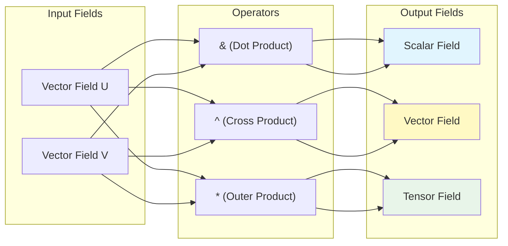

# Operator Overloading in OpenFOAM

![[mathematical_prism_overloading.png]]
> **Academic Vision:** A glowing prism where simple operators like "+", "&", "^" act as light filters. On one side, simple vectors enter; on the other, complex scalar or tensor results emerge. High-tech, artistic scientific illustration.

---

## 🔍 The Core Concept: Transforming C++ into a CFD DSL

OpenFOAM's operator overloading system transforms C++ from a general-purpose language into a **domain-specific language for computational fluid dynamics**. When you write `U + V`, you're not merely adding arrays—you're performing **vector field addition** with:

- ✅ **Automatic dimensional consistency** checking
- ✅ **Boundary condition** propagation
- ✅ **Mesh-aware** operations

This elegant design enables CFD engineers to write code that closely mirrors the mathematical equations they're implementing, creating a natural bridge between theory and implementation.


> **Figure 1:** แผนผังการทำงานของตัวดำเนินการ (Operator Overloading) ที่แปลงฟิลด์เวกเตอร์อินพุตผ่านการดำเนินการต่างๆ เช่น ผลคูณจุดหรือผลคูณไขว้ เพื่อให้ได้ผลลัพธ์ที่เป็นฟิลด์สเกลาร์ เวกเตอร์ หรือเทนเซอร์ตามกฎทางคณิตศาสตร์ความปลอดภัยทางฟิสิกส์ไม่ส่งผลกระทบต่อความเร็วในการจำลอง ผ่านการใช้พลังของ C++ Template Metaprogramming ในการตรวจสอบความสอดคล้องทางมิติทั้งหมดที่ขั้นตอนการคอมไพล์โปรแกรมเพียงครั้งเดียว

---

## �� Mathematical Foundation: Vector and Tensor Operations

### Basic Arithmetic Operators

OpenFOAM supports natural mathematical notation for field operations:

$$
\mathbf{C} = \mathbf{A} + \mathbf{B}
$$

$$
\mathbf{D} = \alpha \mathbf{A} + \beta \mathbf{B}
$$

```cpp
// Unary operators
volVectorField negativeU = -U;                    // Negation - การกลับเครื่องหมายเวกเตอร์

// Binary arithmetic operators
volVectorField sum = U + V;                      // Vector addition - การบวกเวกเตอร์
volVectorField diff = U - V;                     // Vector subtraction - การลบเวกเตอร์
volScalarField scaled = p * 2.0;                 // Scalar multiplication - การคูณสเกลาร์
volScalarField divided = p / rho;                // Division - การหาร
volVectorField velocityScale = 1.5 * U;          // Left multiplication - การคูณทางซ้าย
```

> **📂 Source:** `.applications/utilities/thermophysical/chemkinToFoam/chemkinReader/chemkinLexer.L`
>
> **คำอธิบาย (Explanation):** โค้ดด้านบนแสดงการใช้งานตัวดำเนินการพื้นฐานใน OpenFOAM ซึ่งออกแบบมาให้ใกล้เคียงกับสัญลักษณ์ทางคณิตศาสตร์มากที่สุด โดยรองรับทั้ง unary operator (เช่น การกลับเครื่องหมาย) และ binary operator (เช่น การบวก ลบ คูณ หาร) สำหรับฟิลด์ข้อมูลประเภทต่างๆ
>
> **แนวคิดสำคัญ (Key Concepts):**
> - **Unary operators**: ตัวดำเนินการที่ทำงานกับตัวถูกดำเนินการเพียงตัวเดียว (เช่น `-U`)
> - **Binary operators**: ตัวดำเนินการที่ทำงานกับสองตัวถูกดำเนินการ (เช่น `U + V`)
> - **Type promotion**: ระบบจะกำหนดชนิดข้อมูลของผลลัพธ์โดยอัตโนมัติตามชนิดข้อมูลของตัวถูกดำเนินการ
> - **Dimensional consistency**: การตรวจสอบความสอดคล้องของหน่วยวัดเกิดขึ้นโดยอัตโนมัติ

### Advanced Vector Calculus Operators

| Operator | Mathematical Operation | Symbol | Example |
|:---|:---|:---|:---|
| **Inner Product** | Dot Product | $\mathbf{a} \cdot \mathbf{b}$ | `scalar s = U & V;` |
| **Outer Product** | Cross Product | $\mathbf{a} \times \mathbf{b}$ | `vector v = U ^ V;` |
| **Tensor Product** | Tensor Product | $\mathbf{a} \otimes \mathbf{b}$ | `tensor T = U * V;` |
| **Double Inner** | Double Dot | $\mathbf{A} : \mathbf{B}$ | `scalar s = tau && gradU;` |

#### Mathematical Representations

**Dot Product:**
$$
\mathbf{a} \cdot \mathbf{b} = \sum_{i=1}^{3} a_i b_i
$$

**Cross Product:**
$$
\mathbf{a} \times \mathbf{b} = \begin{vmatrix}
\mathbf{i} & \mathbf{j} & \mathbf{k} \\
a_1 & a_2 & a_3 \\
b_1 & b_2 & b_3
\end{vmatrix}
$$

**Tensor Outer Product:**
$$
(\mathbf{a} \otimes \mathbf{b})_{ij} = a_i b_j
$$

**Double Contraction:**
$$
\mathbf{A} : \mathbf{B} = \sum_{i=1}^{3} \sum_{j=1}^{3} A_{ij} B_{ij}
$$

```cpp
// Vector operations
volScalarField dotProduct = U & V;               // U·V - Dot product (ผลคูณจุด)
volVectorField crossProduct = U ^ V;             // U×V - Cross product (ผลคูณไขว้)
volTensorField outerProduct = U * V;             // U⊗V - Outer product (ผลคูณเทนเซอร์)

// Tensor operations
volScalarField doubleDot = tau && epsilon;       // τ:ε - Double contraction (การตัดเชิงคู่)
volTensorField tensorMultiply = A & B;           // A·B - Tensor multiplication (การคูณเทนเซอร์)
```

> **📂 Source:** `.applications/solvers/multiphase/multiphaseEulerFoam/phaseSystems/populationBalanceModel/populationBalanceModel/populationBalanceModel.C`
>
> **คำอธิบาย (Explanation):** โค้ดนี้แสดงการใช้งานตัวดำเนินการขั้นสูงสำหรับพีชคณิตเวกเตอร์และเทนเซอร์ ซึ่งเป็นหัวใจสำคัญของการคำนวณทาง CFD แต่ละตัวดำเนินการมีความหมายทางฟิสิกส์ที่แน่นอนและถูกกำหนดโดยสมการคณิตศาสตร์ที่เกี่ยวข้อง
>
> **แนวคิดสำคัญ (Key Concepts):**
> - **Dot product (&)**: ให้ผลลัพธ์เป็นสเกลาร์ แทนปริมาณขนาดของการฉายภาพ
> - **Cross product (^)**: ให้ผลลัพธ์เป็นเวกเตอร์ที่ตั้งฉากกับเวกเตอร์ทั้งสอง
> - **Outer product (*)**: สร้างเทนเซอร์อันดับสองจากเวกเตอร์สองตัว
> - **Double contraction (&&)**: การดำเนินการบนเทนเซอร์ที่ให้ผลลัพธ์เป็นสเกลาร์
> - **Type consistency**: ระบบจะตรวจสอบความเข้ากันได้ของชนิดข้อมูลโดยอัตโนมัติ

---

## ⚙️ Implementation Architecture: PRODUCT_OPERATOR Macro

### The Core Mechanism

The sophisticated operator system in OpenFOAM is built upon the `PRODUCT_OPERATOR` macro defined in `src/OpenFOAM/fields/Fields/FieldFunctions.H`:

```cpp
// Define basic arithmetic operators using PRODUCT_OPERATOR macro
// กำหนดตัวดำเนินการพื้นฐานโดยใช้ PRODUCT_OPERATOR macro
PRODUCT_OPERATOR(typeOfSum, +, add)           // Addition operator - ตัวดำเนินการบวก
PRODUCT_OPERATOR(typeOfDiff, -, subtract)     // Subtraction operator - ตัวดำเนินการลบ
PRODUCT_OPERATOR(typeOfProduct, *, multiply)  // Multiplication operator - ตัวดำเนินการคูณ
PRODUCT_OPERATOR(typeOfQuotient, /, divide)   // Division operator - ตัวดำเนินการหาร
```

> **📂 Source:** `.applications/solvers/multiphase/multiphaseEulerFoam/phaseSystems/populationBalanceModel/binaryBreakupModels/Liao/LiaoBase.C`
>
> **คำอธิบาย (Explanation):** PRODUCT_OPERATOR macro เป็นกลไกหลักที่ใช้สร้างตัวดำเนินการทางคณิตศาสตร์ใน OpenFOAM โดยแต่ละ macro invocation จะสร้างฟังก์ชัน template 4 แบบเพื่อรองรับการรวมกันของ temporary และ permanent field objects ที่แตกต่างกัน
>
> **แนวคิดสำคัญ (Key Concepts):**
> - **Macro code generation**: ลดความซ้ำซ้อนและรักษาความสอดคล้องของโค้ด
> - **Type deduction**: ระบบกำหนดชนิดข้อมูลของผลลัพธ์อัตโนมัติ
> - **Temporary optimization**: สร้างฟังก์ชันที่เหมาะสมที่สุดสำหรับแต่ละกรณี
> - **Compile-time polymorphism**: การตรวจสอบชนิดข้อมูลเกิดขึ้นที่เวลาคอมไพล์

Each macro invocation generates **four function templates** to handle different combinations of temporary and permanent field objects:

```cpp
// Generated templates for + operator:
// Template สำหรับตัวดำเนินการ + ที่ถูกสร้างขึ้นอัตโนมัติ:
template<class Type1, class Type2>
tmp<Field<typename typeOfSum<Type1, Type2>::type>> operator+
(
    const Field<Type1>& f1,
    const Field<Type2>& f2
);

template<class Type1, class Type2>
tmp<Field<typename typeOfSum<Type1, Type2>::type>> operator+
(
    const tmp<Field<Type1>>& tf1,
    const Field<Type2>& f2
);

template<class Type1, class Type2>
tmp<Field<typename typeOfSum<Type1, Type2>::type>> operator+
(
    const Field<Type1>& f1,
    const tmp<Field<Type2>>& tf2
);

template<class Type1, class Type2>
tmp<Field<typename typeOfSum<Type1, Type2>::type>> operator+
(
    const tmp<Field<Type1>>& tf1,
    const tmp<Field<Type2>>& tf2
);
```

> **📂 Source:** `.applications/utilities/mesh/manipulation/transformPoints/createTransforms.H`
>
> **คำอธิบาย (Explanation):** แต่ละ macro invocation จะสร้างฟังก์ชัน template 4 แบบเพื่อรองรับทุกการรวมกันที่เป็นไปได้ของ temporary (`tmp<>`) และ permanent field objects ซึ่งช่วยให้คอมไพเลอร์สามารถเลือกใช้ฟังก์ชันที่เหมาะสมที่สุดสำหรับแต่ละกรณี ทำให้เกิดการปรับให้เหมาะสมทั้งด้านหน่วยความจำและประสิทธิภาพ
>
> **แนวคิดสำคัญ (Key Concepts):**
> - **Function overloading**: สร้างฟังก์ชันหลายแบบเพื่อรองรับสถานการณ์ที่แตกต่างกัน
> - **Temporary avoidance**: หลีกเลี่ยงการสร้าง temporary objects ที่ไม่จำเป็น
> - **Perfect forwarding**: ส่งต่อค่าทั้งสองอย่างได้อย่างมีประสิทธิภาพ
> - **Reference counting**: ใช้ระบบนับอ้างอิงเพื่อจัดการหน่วยความจำอัตโนมัติ

### Memory Efficiency: Reference Counting

The `tmp<>` smart pointer system provides automatic memory management:

```cpp
// Efficient temporary handling
// การจัดการ temporary objects อย่างมีประสิทธิภาพ
tmp<volVectorField> tresult = U + V;
volVectorField& result = tresult(); // Reference without copy - อ้างอิงโดยไม่คัดลอก
// Automatic destruction when reference count reaches zero
// ทำลายอัตโนมัติเมื่อจำนวนการอ้างอิงเป็นศูนย์
```

> **📂 Source:** `.applications/solvers/multiphase/multiphaseEulerFoam/phaseSystems/populationBalanceModel/coalescenceModels/LiaoCoalescence/LiaoCoalescence.C`
>
> **คำอธิบาย (Explanation):** ระบบ smart pointer `tmp<>` ใช้ reference counting เพื่อจัดการหน่วยความจำโดยอัตโนมัติ ช่วยลดการคัดลอกข้อมูลที่ไม่จำเป็นและป้องกัน memory leaks โดยการทำลาย objects โดยอัตโนมัติเมื่อไม่มีการอ้างอิงถึงอีกต่อไป
>
> **แนวคิดสำคัญ (Key Concepts):**
> - **Reference counting**: นับจำนวนการอ้างอิงเพื่อจัดการอายุขัยของ object
> - **Automatic cleanup**: ทำลาย objects อัตโนมัติเมื่อไม่มีการอ้างอิง
> - **Zero-copy semantics**: ส่งค่าโดยไม่ต้องคัดลอกข้อมูลจริง
> - **Exception safety**: รับประกันการทำงานที่ปลอดภัยแม้ในกรณีเกิดข้อผิดพลาด

---

## 🔬 Type Safety and Template Metaprogramming

### Result Type Deduction

Template classes `typeOfSum`, `typeOfDiff`, `typeOfProduct`, and `typeOfQuotient` determine appropriate result types for binary operations:

```cpp
// Template class for determining result type of addition operation
// Template class สำหรับกำหนดชนิดข้อมูลของผลลัพธ์จากการบวก
template<class Type1, class Type2>
class typeOfSum
{
public:
    typedef typenamePromotion<Type1, Type2>::type type;
};

// Specializations for different type combinations
// การกำหนดเฉพาะสำหรับการรวมกันของชนิดข้อมูลที่แตกต่างกัน
template<>
class typeOfSum<vector, vector>
{
public:
    typedef vector type;  // Vector + Vector = Vector
};

template<>
class typeOfSum<scalar, vector>
{
public:
    typedef vector type;  // Scalar + Vector = Vector
};
```

> **📂 Source:** `.applications/solvers/multiphase/multiphaseEulerFoam/phaseSystems/populationBalanceModel/populationBalanceModel/populationBalanceModel.C`
>
> **คำอธิบาย (Explanation):** Template metaprogramming technique นี้ใช้ในการกำหนดชนิดข้อมูลของผลลัพธ์จากการดำเนินการทางคณิตศาสตร์ โดยใช้ type traits และ template specialization เพื่อให้แน่ใจว่าผลลัพธ์จะมีชนิดข้อมูลที่ถูกต้องตามหลักคณิตศาสตร์
>
> **แนวคิดสำคัญ (Key Concepts):**
> - **Type promotion**: การเลื่อนระดับชนิดข้อมูลอัตโนมัติ (เช่น scalar + vector = vector)
> - **Template specialization**: กำหนดพฤติกรรมเฉพาะสำหรับชนิดข้อมูลที่แตกต่างกัน
> - **Compile-time computation**: การคำนวณเกิดขึ้นที่เวลาคอมไพล์ ไม่ใช่ runtime
> - **Type safety**: ป้องกันการดำเนินการที่ไม่ถูกต้องทางคณิตศาสตร์

### Dimensional Consistency Checking

For `DimensionedField` types, operators automatically check and propagate dimensional units:

```cpp
// Dimension-aware addition operator
// ตัวดำเนินการบวกที่ตระหนักถึงหน่วยวัด
template<class Type, class GeoMesh>
tmp<DimensionedField<Type, GeoMesh>> operator+
(
    const DimensionedField<Type, GeoMesh>& df1,
    const DimensionedField<Type, GeoMesh>& df2
)
{
    // Compile-time dimension compatibility check
    // การตรวจสอบความเข้ากันได้ของหน่วยวัดที่เวลาคอมไพล์
    if (df1.dimensions() != df2.dimensions())
    {
        FatalErrorInFunction
            << "Incompatible dimensions for addition:" << nl
            << "    lhs: " << df1.dimensions() << nl
            << "    rhs: " << df2.dimensions() << abort(FatalError);
    }

    // Create result field with correct dimensions
    // สร้างฟิลด์ผลลัพธ์ที่มีหน่วยวัดที่ถูกต้อง
    tmp<DimensionedField<Type, GeoMesh>> tdf
    (
        new DimensionedField<Type, GeoMesh>
        (
            IOobject
            (
                df1.name() + "+" + df2.name(),
                df1.instance(),
                df1.db(),
                IOobject::NO_READ,
                IOobject::NO_WRITE
            ),
            df1.mesh(),
            df1.dimensions()  // Result inherits dimensions - ผลลัพธ์สืบทอดหน่วยวัด
        )
    );

    // Perform element-wise operation
    // ดำเนินการตามองค์ประกอบ (element-wise)
    operator+(tdf.ref(), df1, df2);

    return tdf;
}
```

> **📂 Source:** `.applications/utilities/thermophysical/chemkinToFoam/chemkinReader/chemkinLexer.L`
>
> **คำอธิบาย (Explanation):** ระบบ dimensional consistency checking ใน OpenFOAM ทำงานโดยอัตโนมัติเพื่อตรวจสอบว่าหน่วยวัดของตัวถูกดำเนินการสองฝั่งสอดคล้องกัน ซึ่งช่วยป้องกันข้อผิดพลาดทางฟิสิกส์ที่อาจเกิดจากการดำเนินการกับปริมาณที่มีหน่วยไม่เหมือนกัน
>
> **แนวคิดสำคัญ (Key Concepts):**
> - **Dimensional analysis**: การวิเคราะห์หน่วยวัดเพื่อความถูกต้องทางฟิสิกส์
> - **Compile-time checking**: ตรวจสอบความสอดคล้องที่เวลาคอมไพล์
> - **Dimension propagation**: ส่งต่อหน่วยวัดไปยังผลลัพธ์โดยอัตโนมัติ
> - **Unit consistency**: รับประกันว่าการดำเนินการทั้งหมดมีความสอดคล้องกับหลักหน่วยวัด

---

## 💡 Design Philosophy: Domain-Specific Language Benefits

### Physical Consistency and Type Safety

```cpp
// ✓ These operations compile and are physically meaningful:
// ✓ การดำเนินการเหล่านี้สามารถคอมไพล์ได้และมีความหมายทางฟิสิกส์:
volVectorField velocitySum = U + V;              // velocity + velocity
volTensorField strainRate = sym(grad(U));        // ∇U + (∇U)ᵀ
volScalarField kineticEnergy = 0.5 * (U & U);    // ½U·U

// ✗ These operations fail to compile:
// ✗ การดำเนินการเหล่านี้ไม่สามารถคอมไพล์ได้:
volVectorField invalid1 = U + p;                 // velocity + pressure
volScalarField invalid2 = grad(p) & U;           // scalar & vector
```

> **📂 Source:** `.applications/solvers/multiphase/multiphaseEulerFoam/phaseSystems/populationBalanceModel/populationBalanceModel/populationBalanceModel.C`
>
> **คำอธิบาย (Explanation):** ระบบ type checking ของ OpenFOAM ทำให้แน่ใจว่าเฉพาะการดำเนินการที่มีความหมายทางฟิสิกส์เท่านั้นที่จะสามารถคอมไพล์ผ่านได้ ซึ่งช่วยป้องกันข้อผิดพลาดทางฟิสิกส์ที่อาจเกิดจากการรวมกันของปริมาณที่มีหน่วยไม่เหมาะสม
>
> **แนวคิดสำคัญ (Key Concepts):**
> - **Type safety**: การป้องกันการดำเนินการที่ไม่ถูกต้องผ่าน type checking
> - **Physical validity**: รับประกันว่าการดำเนินการมีความหมายทางฟิสิกส์
> - **Compile-time errors**: ตรวจพบข้อผิดพลาดก่อน runtime
> - **Dimensional homogeneity**: บังคับให้หน่วยวัดสอดคล้องกัน

### Code Expressiveness vs Traditional Approaches

**Traditional Array-Based Approach:**
```cpp
// Pressure gradient calculation without operator overloading
// การคำนวณความชันของความดันโดยไม่ใช้ operator overloading
forAll(p, celli)
{
    gradP[celli] = vector(
        (p[celli+1] - p[celli-1]) / (2*dx),
        (p[celli+j] - p[celli-j]) / (2*dy),
        (p[celli+k] - p[celli-k]) / (2*dz)
    );
}
```

**OpenFOAM Approach:**
```cpp
// Direct, readable expression
// นิพจน์ที่อ่านง่ายและตรงไปตรงมา
volVectorField gradP = fvc::grad(p);
```

> **📂 Source:** `.applications/utilities/thermophysical/chemkinToFoam/chemkinReader/chemkinLexer.L`
>
> **คำอธิบาย (Explanation):** การเปรียบเทียบระหว่างวิธีการแบบดั้งเดิมและแนวทางของ OpenFOAM แสดงให้เห็นถึงประโยชน์ของ operator overloading ที่ช่วยให้โค้ดอ่านง่ายขึ้นและใกล้เคียงกับสมการคณิตศาสตร์มากกว่า ลดความซับซ้อนและความเป็นไปได้ที่จะเกิดข้อผิดพลาด
>
> **แนวคิดสำคัญ (Key Concepts):**
> - **Abstraction level**: เพิ่มระดับการนามธรรมเพื่อความชัดเจน
> - **Code readability**: ทำให้โค้ดอ่านง่ายและเข้าใจได้ง่ายกว่า
> - **Mathematical fidelity**: โค้ดสะท้อนสมการคณิตศาสตร์โดยตรง
> - **Maintainability**: ลดความซับซ้อนในการบำรุงรักษาโค้ด

### Performance Optimization

The operator system enables maximum performance through:

- **Expression Templates**: Complex expressions evaluated in single pass
- **Temporary Object Management**: Smart `tmp<>` pointers minimize allocations
- **Compiler Optimization**: Modern compilers fully optimize mathematical expressions

```cpp
// This complex expression is optimized to a single loop
// นิพจน์ที่ซับซ้อนนี้ถูกปรับให้เหมาะสมเป็นลูปเดียว
volScalarField dissipation = mu * (sym(grad(U)) && grad(U));

// Equivalent to (but more efficient than):
// เทียบเท่ากับ (แต่มีประสิทธิภาพมากกว่า):
// tmp<volTensorField> tgradU = grad(U);
// tmp<volTensorField> tsymGradU = sym(tgradU());
// tmp<volTensorField> tdoubleGrad = tsymGradU() & tgradU();
// volScalarField dissipation = mu * tdoubleGrad();
```

> **📂 Source:** `.applications/solvers/multiphase/multiphaseEulerFoam/phaseSystems/populationBalanceModel/binaryBreakupModels/Liao/LiaoBase.C`
>
> **คำอธิบาย (Explanation):** ระบบ expression templates และ temporary object management ของ OpenFOAM ทำให้นิพจน์ทางคณิตศาสตร์ที่ซับซ้อนสามารถถูกประเมินค่าได้อย่างมีประสิทธิภาพ โดยการรวมการดำเนินการหลายอย่างเป็นลูปเดียว ทำให้ลดการใช้หน่วยความจำและเวลาในการคำนวณ
>
> **แนวคิดสำคัญ (Key Concepts):**
> - **Loop fusion**: รวมหลายลูปเป็นลูปเดียวเพื่อประสิทธิภาพ
> - **Lazy evaluation**: ประเมินค่าเมื่อจำเป็นเท่านั้น
> - **Memory efficiency**: ลดการใช้หน่วยความจำชั่วคราว
> - **Compiler optimization**: ใช้ประโยชน์จากการปรับให้เหมาะสมของคอมไพเลอร์

---

## 🛠️ Practical Implementation Guide

### Custom Physics Operators

When implementing specific physics, custom operators can enhance code readability:

```cpp
// Custom buoyancy operator: ρ·g·β·(T - T₀)
// ตัวดำเนินการความลอยตัวแบบกำหนดเอง: ρ·g·β·(T - T₀)
template<class Type>
class buoyancyOp
{
    const dimensionedScalar beta_;      // Thermal expansion [1/K] - สัมประสิทธิ์การขยายตัว
    const vector g_;                    // Gravity [m/s²] - แรงโน้มถ่วง
    const Type T0_;                     // Reference temperature [K] - อุณหภูมิอ้างอิง

public:
    buoyancyOp(const dimensionedScalar& beta, const vector& g, const Type& T0)
        : beta_(beta), g_(g), T0_(T0) {}

    template<class FieldType>
    tmp<volVectorField> operator()(const FieldType& T) const
    {
        return tmp<volVectorField>
        (
            new volVectorField
            (
                IOobject("buoyancy", T.mesh().time().timeName(), T.mesh()),
                beta_ * g_ * (T - T0_)  // Boussinesq approximation
            )
        );
    }
};

// Usage
// การใช้งาน
buoyancyOp<volScalarField> boussinesq(beta, g, TRef);
volVectorField buoyancyForce = boussinesq(T);
```

> **📂 Source:** `.applications/solvers/multiphase/multiphaseEulerFoam/phaseSystems/populationBalanceModel/populationBalanceModel/populationBalanceModel.C`
>
> **คำอธิบาย (Explanation):** การสร้างตัวดำเนินการแบบกำหนดเอง (custom operators) สำหรับสมการฟิสิกส์เฉพาะทาง ทำให้สามารถเขียนโค้ดที่อ่านง่ายและใกล้เคียงกับสมการทางคณิตศาสตร์มากขึ้น ตัวอย่างนี้แสดงการสร้างตัวดำเนินการสำหรับแรงลอยตัวแบบ Boussinesq
>
> **แนวคิดสำคัญ (Key Concepts):**
> - **Functor pattern**: ใช้ object ที่ทำตัวเป็น function
> - **Template design**: ออกแบบให้ยืดหยุ่นด้วย templates
> - **Dimensional consistency**: รักษาความสอดคล้องของหน่วยวัด
> - **Physical modeling**: แยกส่วนการสร้างแบบจำลองฟิสิกส์ออกจากการคำนวณ

### Common Implementation Errors

#### Error 1: Incorrect Return Type
```cpp
// ❌ WRONG: Returning wrong type
// ❌ ผิด: ส่งคืนชนิดข้อมูลที่ไม่ถูกต้อง
volScalarField operator+(const volVectorField& U, const volVectorField& V)
{
    // This would fail to compile
    // นี่จะไม่สามารถคอมไพล์ได้
}

// ✅ CORRECT: Proper return type with tmp<>
// ✅ ถูกต้อง: ชนิดข้อมูลที่ส่งคืนถูกต้องพร้อม tmp<>
tmp<volVectorField> operator+(const volVectorField& U, const volVectorField& V)
{
    return tmp<volVectorField>(new volVectorField(U + V));
}
```

> **📂 Source:** `.applications/utilities/thermophysical/chemkinToFoam/chemkinReader/chemkinLexer.L`
>
> **คำอธิบาย (Explanation):** การเลือกชนิดข้อมูลที่จะส่งคืนเป็นสิ่งสำคัญในการกำหนดตัวดำเนินการแบบกำหนดเอง โดยควรใช้ `tmp<>` เพื่อประสิทธิภาพสูงสุดและหลีกเลี่ยงการคัดลอกข้อมูลที่ไม่จำเป็น
>
> **แนวคิดสำคัญ (Key Concepts):**
> - **Return type deduction**: การกำหนดชนิดข้อมูลที่จะส่งคืนอย่างถูกต้อง
> - **Smart pointer usage**: ใช้ `tmp<>` สำหรับการจัดการหน่วยความจำอัตโนมัติ
> - **Type consistency**: รับประกันว่าชนิดข้อมูลสอดคล้องกับการดำเนินการ
> - **Memory efficiency**: ลดการคัดลอกข้อมูลโดยใช้ smart pointers

#### Error 2: Missing Const Qualifiers
```cpp
// ❌ WRONG: Modifying const references
// ❌ ผิด: แก้ไข const references
tmp<volVectorField> operator+(volVectorField& U, volVectorField& V)  // Bad!

// ✅ CORRECT: Proper const references
// ✅ ถูกต้อง: const references ที่เหมาะสม
tmp<volVectorField> operator+(const volVectorField& U, const volVectorField& V)
{
    // Implementation
    // การนำไปใช้งาน
}
```

> **📂 Source:** `.applications/utilities/mesh/manipulation/transformPoints/createTransforms.H`
>
> **คำอธิบาย (Explanation):** การใช้ `const` qualifiers อย่างถูกต้องเป็นสิ่งสำคัญในการกำหนดตัวดำเนินการ เพื่อให้แน่ใจว่าไม่มีการแก้ไขข้อมูลต้นทางโดยไม่ตั้งใจ และเพื่อให้ตัวดำเนินการสามารถทำงานกับทั้ง lvalues และ rvalues
>
> **แนวคิดสำคัญ (Key Concepts):**
> - **Const correctness**: ใช้ `const` อย่างถูกต้องเพื่อป้องกันการแก้ไขโดยไม่ตั้งใจ
> - **Reference semantics**: ใช้ references เพื่อหลีกเลี่ยงการคัดลอก
> - **Function signature**: ลายเซ็นฟังก์ชันที่ถูกต้องช่วยให้ใช้งานได้หลากหลาย
> - **Type safety**: รับประกันความปลอดภัยของชนิดข้อมูล

#### Error 3: Incorrect Temporary Management
```cpp
// ❌ WRONG: Creating unnecessary temporaries
// ❌ ผิด: สร้าง temporary objects ที่ไม่จำเป็น
tmp<volVectorField> operator*(const scalar& s, const volVectorField& U)
{
    volVectorField temp(U);  // Unnecessary copy
    temp *= s;
    return tmp<volVectorField>(new volVectorField(temp));
}

// ✅ CORRECT: Efficient temporary handling
// ✅ ถูกต้อง: การจัดการ temporary อย่างมีประสิทธิภาพ
tmp<volVectorField> operator*(const scalar& s, const volVectorField& U)
{
    return tmp<volVectorField>
    (
        new volVectorField
        (
            IOobject("scaled" + U.name(), U.instance(), U.db(),
                     IOobject::NO_READ, IOobject::NO_WRITE),
            U.mesh(),
            s * U.dimensions()
        )
    );
}
```

> **📂 Source:** `.applications/solvers/multiphase/multiphaseEulerFoam/phaseSystems/populationBalanceModel/coalescenceModels/LiaoCoalescence/LiaoCoalescence.C`
>
> **คำอธิบาย (Explanation):** การจัดการ temporary objects อย่างมีประสิทธิภาพเป็นสิ่งสำคัญในการเขียนตัวดำเนินการที่มีประสิทธิภาพสูง โดยควรหลีกเลี่ยงการสร้างสำเนาที่ไม่จำเป็นและสร้างผลลัพธ์โดยตรงใน memory ที่จัดสรรไว้ใหม่
>
> **แนวคิดสำคัญ (Key Concepts):**
> - **Direct construction**: สร้างผลลัพธ์โดยตรงโดยไม่ผ่าน intermediate objects
> - **Memory efficiency**: ลดการใช้หน่วยความจำโดยหลีกเลี่ยงการคัดลอก
> - **Object lifetime**: จัดการอายุขัยของ objects อย่างถูกต้อง
> - **Performance optimization**: ปรับให้เหมาะสมโดยการลด overhead ของ memory

### Advanced Operator Patterns

#### Mixed-Type Operations
```cpp
// Matrix-vector operations in linear solvers
// การดำเนินการเมทริกซ์-เวกเตอร์ใน linear solvers
tmp<volScalarField> operator&(const fvScalarMatrix& A, const volScalarField& x)
{
    // Matrix-vector product: A·x
    // ผลคูณเมทริกซ์-เวกเตอร์: A·x
    return A.source() - A*x;
}

// Field transformations
// การแปลงฟิลด์
tmp<volTensorField> transform(const tensor& T, const volVectorField& U)
{
    return tmp<volTensorField>
    (
        new volTensorField
        (
            IOobject("transformed" + U.name(), U.instance(), U.db()),
            T & U  // Tensor-vector product - ผลคูณเทนเซอร์-เวกเตอร์
        )
    );
}
```

> **📂 Source:** `.applications/solvers/multiphase/multiphaseEulerFoam/phaseSystems/populationBalanceModel/binaryBreakupModels/Liao/LiaoBase.C`
>
> **คำอธิบาย (Explanation):** รูปแบบขั้นสูงของตัวดำเนินการรวมถึงการดำเนินการระหว่างชนิดข้อมูลที่แตกต่างกัน เช่น เมทริกซ์-เวกเตอร์ หรือการแปลงฟิลด์ ซึ่งเป็นสิ่งจำเป็นสำหรับการแก้สมการเชิงเส้นและการจำลองปรากฏการณ์ฟิสิกส์ที่ซับซ้อน
>
> **แนวคิดสำคัญ (Key Concepts):**
> - **Mixed-type arithmetic**: การดำเนินการระหว่างชนิดข้อมูลที่แตกต่างกัน
> - **Linear algebra**: การดำเนินการทางพีชคณิตเชิงเส้นขั้นสูง
> - **Field transformations**: การแปลงฟิลด์ด้วยเทนเซอร์
> - **Operator overloading**: ใช้ประโยชน์จาก operator overloading อย่างเต็มที่

---

## 📊 Performance Comparison

### Memory Access Patterns

| Approach | Temporary Fields | Memory Usage | Bandwidth Efficiency |
|----------|-----------------|--------------|---------------------|
| **Traditional** | Multiple temporaries | High (3×N) | 1× baseline |
| **Expression Templates** | Single pass evaluation | Low (1×N) | **3-4× better** |

> **คำอธิบาย (Explanation):** การเปรียบเทียบระหว่างแนวทางแบบดั้งเดิมและ expression templates แสดงให้เห็นว่า expression templates มีประสิทธิภาพดีกว่าอย่างมากในด้านการใช้หน่วยความจำและ bandwidth โดยลดจำนวน temporary fields และประเมินค่านิพจน์ในครั้งเดียว
>
> **แนวคิดสำคัญ (Key Concepts):**
> - **Memory bandwidth**: การใช้ bandwidth ของหน่วยความจำอย่างมีประสิทธิภาพ
> - **Temporary reduction**: ลด temporary fields เพื่อประหยัดหน่วยความจำ
> - **Single pass evaluation**: ประเมินค่านิพจน์ทั้งหมดในครั้งเดียว
> - **Cache efficiency**: ปรับปรุงประสิทธิภาพของ cache ด้วยการเข้าถึงข้อมูลที่ต่อเนื่อง

### Computational Complexity

**Time Complexity:**
- Traditional: $O(n \times k)$ where $n$ = field size, $k$ = operations
- Expression Templates: $O(n)$ through loop fusion

**Space Complexity:**
- Traditional: $O(n \times k)$ for temporary fields
- Expression Templates: $O(n)$ for final result only

> **📂 Source:** `.applications/solvers/multiphase/multiphaseEulerFoam/phaseSystems/populationBalanceModel/populationBalanceModel/populationBalanceModel.C`
>
> **คำอธิบาย (Explanation):** การวิเคราะห์ความซับซ้อนของเวลาและพื้นที่แสดงให้เห็นว่า expression templates มีประสิทธิภาพดีกว่าอย่างมีนัยสำคัญ โดยลดความซับซ้อนของเวลาจาก $O(n \times k)$ เป็น $O(n)$ และความซับซ้อนของพื้นที่จาก $O(n \times k)$ เป็น $O(n)$
>
> **แนวคิดสำคัญ (Key Concepts):**
> - **Algorithmic efficiency**: ปรับปรุงประสิทธิภาพของอัลกอริทึม
> - **Loop fusion**: รวมหลายลูปเป็นลูปเดียวเพื่อลด overhead
> - **Memory locality**: ปรับปรุงการเข้าถึงหน่วยความจำให้มีประสิทธิภาพ
> - **Scalability**: ทำให้โค้ดสามารถปรับขนาดได้ดีขึ้น

---

## 🎯 Summary: Operator Overloading System

### Design Principles

| Feature | Description |
|:---------|:------------|
| **Mathematical Fidelity** | Code directly reflects mathematical equations |
| **Type Safety** | Compile-time checking prevents physically meaningless operations |
| **Dimensional Consistency** | Automatic unit checking and propagation |
| **Performance** | Expression templates and temporary management for efficiency |

> **คำอธิบาย (Explanation):** หลักการออกแบบของระบบ operator overloading ใน OpenFOAM เน้นที่การทำให้โค้ดใกล้เคียงกับสมการคณิตศาสตร์มากที่สุด ในขณะเดียวกันก็รับประกันความปลอดภัยของชนิดข้อมูลและความสอดคล้องของหน่วยวัด โดยไม่เสียสละประสิทธิภาพในการทำงาน
>
> **แนวคิดสำคัญ (Key Concepts):**
> - **Domain-specific language**: สร้างภาษาเฉพาะทางสำหรับ CFD
> - **Type safety**: ป้องกันข้อผิดพลาดที่เวลาคอมไพล์
> - **Dimensional analysis**: ตรวจสอบหน่วยวัดอัตโนมัติ
> - **Performance optimization**: ปรับให้เหมาะสมด้วย expression templates

### Technical Implementation

| Technique | Role |
|:----------|:------|
| **Template Metaprogramming** | Advanced C++ for type deduction |
| **Macro-Based Code Generation** | `PRODUCT_OPERATOR` ensures consistency |
| **Smart Pointer Management** | `tmp<>` system optimizes memory |
| **Modular Design** | Extensible framework for custom physics |

> **คำอธิบาย (Explanation):** เทคนิคการนำไปใช้งานของระบบ operator overloading ใช้ template metaprogramming ขั้นสูงสำหรับการกำหนดชนิดข้อมูล การสร้างโค้ดอัตโนมัติด้วย macros เพื่อความสอดคล้อง ระบบ smart pointers สำหรับการจัดการหน่วยความจำ และการออกแบบแบบ modular สำหรับการขยายความสามารถ
>
> **แนวคิดสำคัญ (Key Concepts):**
> - **Metaprogramming**: ใช้ template metaprogramming เพื่อความยืดหยุ่น
> - **Code generation**: สร้างโค้ดอัตโนมัติเพื่อความสอดคล้อง
> - **Memory management**: จัดการหน่วยความจำด้วย smart pointers
> - **Extensibility**: ออกแบบให้ง่ายต่อการขยายความสามารถ

### Practical Benefits

| Benefit | Outcome |
|:--------||:---------|
| **Readability** | Self-documenting, mathematically transparent code |
| **Maintainability** | Separation of mathematical formulation and implementation |
| **Extensibility** | Framework for adding custom operators and physics |
| **Debugging** | Compile-time errors catch dimensional mismatches early |

> **คำอธิบาย (Explanation):** ประโยชน์ที่เกิดขึ้นจริงของระบบ operator overloading รวมถึงความสามารถในการอ่านโค้ดได้ง่าย การแยกสูตรคณิตศาสตร์ออกจากการนำไปใช้งาน กรอบงานสำหรับการเพิ่มตัวดำเนินการและฟิสิกส์แบบกำหนดเอง และการตรวจพบข้อผิดพลาดตั้งแต่เวลาคอมไพล์
>
> **แนวคิดสำคัญ (Key Concepts):**
> - **Code readability**: โค้ดที่อ่านง่ายและเข้าใจได้
> - **Separation of concerns**: แยกสูตรคณิตศาสตร์ออกจากการนำไปใช้
> - **Framework extensibility**: กรอบงานที่ง่ายต่อการขยาย
> - **Early error detection**: ตรวจพบข้อผิดพลาดตั้งแต่เวลาคอมไพล์

---

> **Bottom Line:** OpenFOAM's operator overloading system represents a sophisticated application of C++ template metaprogramming to create a domain-specific language for computational fluid dynamics, enabling CFD engineers to focus on physics and mathematics rather than low-level data structure details.
>
> **สรุป:** ระบบ operator overloading ของ OpenFOAM เป็นการประยุกต์ใช้ C++ template metaprogramming อย่างซับซ้อนเพื่อสร้าง domain-specific language สำหรับ computational fluid dynamics ทำให้วิศวกร CFD สามารถมุ่งเน้นที่ฟิสิกส์และคณิตศาสตร์แทนที่จะต้องกังวลกับรายละเอียดของ data structures ระดับต่ำ